Table of contents
=================

<!--ts-->
   * [AI Code Assistant](#ai-code-assistant)
      * [Developer's Coding Companion](#developers-coding-companion)
      * [AI Autopilot for Software](#ai-autopilot-for-software)      
      * [Security](#security)
      * [Compliance](#compliance)
      * [Customization](#customization)
      * [Context Size Limits](#context-size-limits)
      * [AI Adoption](#ai-adoption)
      * [Tools Comparison](#tools-comparison)
        * [Usecase](#use-case)        
        * [Comparison Results](#comparison)
  * [Developer Productivity](#developer-productivity)
      * [AI Powered Development Environments](#ai-powered-development-environments)
      * [IDE Settings to 5x AI Output Quality](#ide-settings-to-5x-ai-output-quality)
          * [Instructions or Settings Template](#instructions-or-settings-template-for-windsurf--cursor--vs-code)
<!--te-->

## AI Code Assistant

### Developers Coding Companion

AI code assistants serve as invaluable companions for developers, augmenting human capabilities throughout the development lifecycle. These tools provide intelligent suggestions, automate repetitive tasks, and help troubleshoot code problems in real-time.

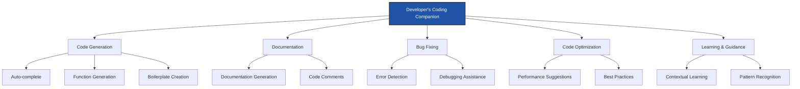

Key benefits include:
- Accelerated development velocity
- Reduced cognitive load on repetitive tasks
- Enhanced code quality and consistency
- Just-in-time learning for unfamiliar technologies
- Streamlined onboarding for new team members
-----

### AI Autopilot for Software
`Automated Creation, Monitoring and Maintenance with Artifical Intelligence`


Modern AI systems can now automate significant portions of the software development lifecycle, acting as an "autopilot" for various tasks from creation through maintenance.

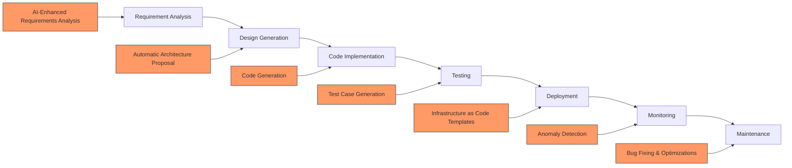

This automation paradigm enables:
- Continuous creation and refinement of software assets
- Proactive identification of potential issues
- Context-aware maintenance recommendations
- Intelligent scaling and optimization
- Reduced operational overhead
-----

### Security
Maintaining the security of AI code assistants is paramount to ensure confidentiality, integrity, and availability of both the system and its data.

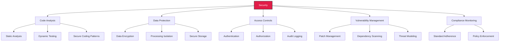

Key security considerations include:
- Prevention of data leakage between separate environments
- Verification of generated code against security vulnerabilities
- Robust authentication and authorization mechanisms
- Regular security assessment and remediation
- Protection against prompt injection and other AI-specific threats

### Compliance

AI code assistants must adhere to applicable laws, regulations, ethical principles, and technical standards to ensure responsible development practices.

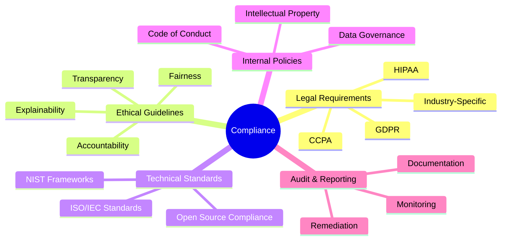

Compliance frameworks ensure:
- Proper data handling and privacy protections
- Ethical use of AI technologies
- Transparency in AI-generated code and recommendations
- Adherence to organizational policies and industry standards
- Auditability of AI interactions and outputs

### Customization

AI code assistants can be tailored to meet specific organizational needs through various customization options.

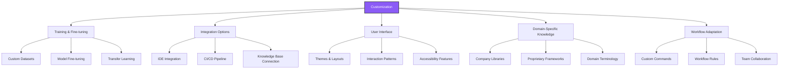

Effective customization enables:
- Alignment with organizational coding standards and practices
- Integration with existing development workflows
- Incorporation of proprietary knowledge and frameworks
- Adaptive learning from team feedback and usage patterns
- Specialized functionality for domain-specific requirements

### Context Size Limits

Managing large codebases within AI assistant context windows requires strategic approaches to maximize effectiveness.

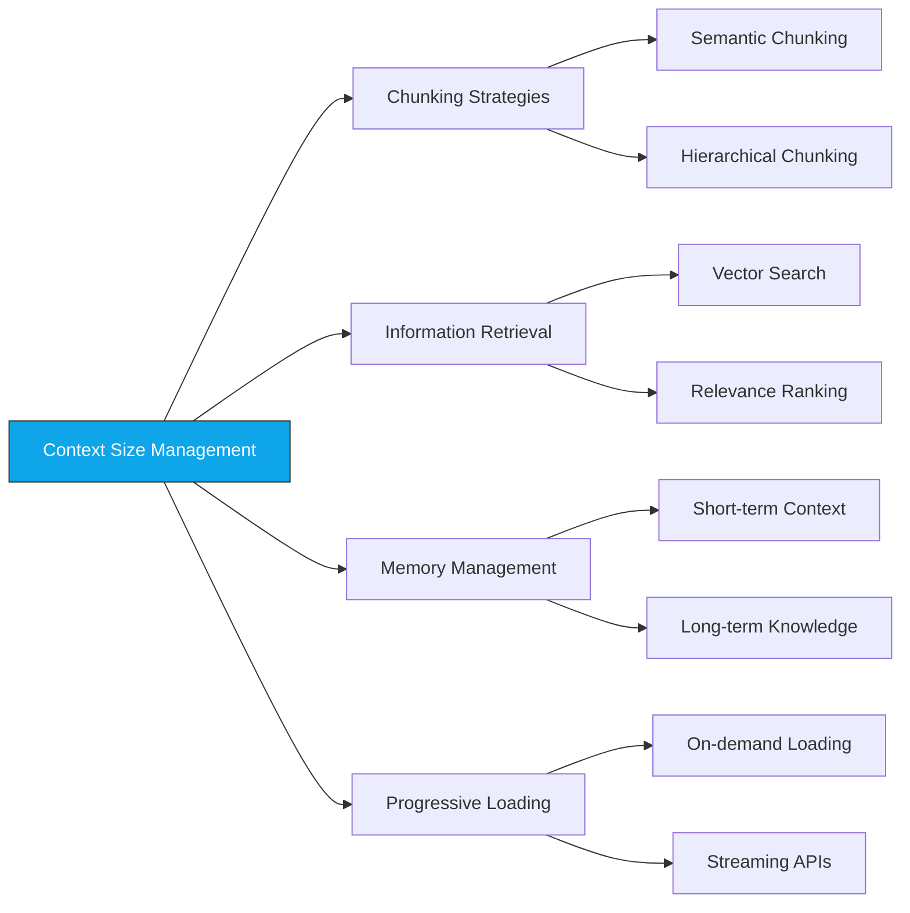

Effective context handling techniques include:
- Intelligent code chunking based on logical components
- Semantic understanding to prioritize relevant code sections
- Multi-stage prompting for complex analyses
- Repository-aware navigation and reference resolution
- Strategic summarization of peripheral code components

### AI Adoption

Successfully incorporating AI code assistants into development workflows requires a structured approach focused on team enablement and value delivery.

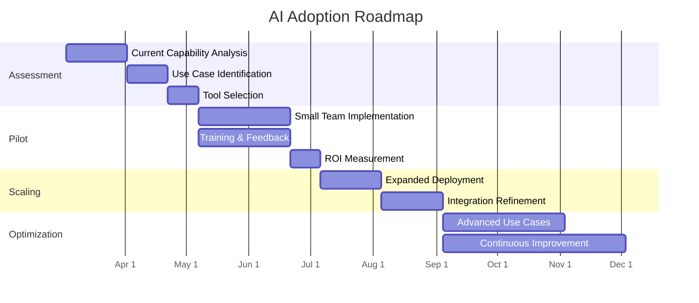

Key adoption principles include:
- Start with high-impact, low-risk use cases
- Provide comprehensive training and support
- Establish clear usage guidelines and best practices
- Measure and showcase productivity improvements
- Continuously collect feedback and refine implementation
- Address concerns about skill degradation and overdependence

### Tools Comparison

AI code assistants have proliferated in recent years, each with distinct capabilities, strengths, and limitations. This section provides a detailed comparison of eight leading tools in this space.

#### Overview of AI Coding Assistants

**GitHub Copilot**: Developed by GitHub in collaboration with OpenAI, Copilot leverages large language models to suggest code and entire functions in real-time as you type. It learns from your coding patterns and project context to provide increasingly relevant suggestions.

**Tabnine**: One of the pioneers in the AI code completion space, Tabnine offers both cloud-based and self-hosted options. It emphasizes privacy and security while providing context-aware code completions across numerous programming languages.

**Codeium**: A newer entrant that focuses on fast, context-aware code completions with strong support for multiple languages and frameworks. Codeium emphasizes developer productivity while maintaining a lightweight footprint.

**Amazon Q Developer**: Formerly CodeWhisperer, Amazon's AI coding assistant is tightly integrated with AWS services and emphasizes security-focused code generation. It specializes in detecting vulnerabilities and suggesting secure coding patterns.

**Cursor**: An AI-powered IDE built from the ground up for AI collaboration. Cursor integrates chat interfaces, code generation, and deep code understanding capabilities to serve as a comprehensive development environment.

**Windsurf**: An agent-style AI coding assistant that focuses on automation of complex coding tasks. Windsurf takes a more proactive approach to code generation and refactoring, often anticipating developer needs.

**CodeGPT**: A versatile coding assistant that provides GPT-powered completions, explanations, and code generation. It emphasizes natural language interaction with codebases for both writing and understanding code.

**Google Code Assist**: Google's enterprise-grade code assistant (formerly Duet AI) integrates with Google Cloud and emphasizes productivity across the software development lifecycle with capabilities spanning from design to deployment.

#### Use Case Evaluation

To effectively compare these assistants, we'll evaluate them against two common API development scenarios:

**Add to Cart API**
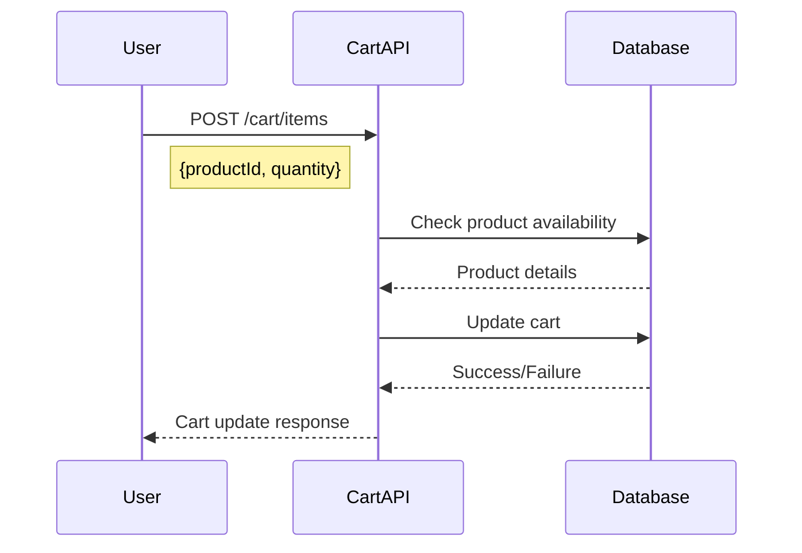

**Place Order API**
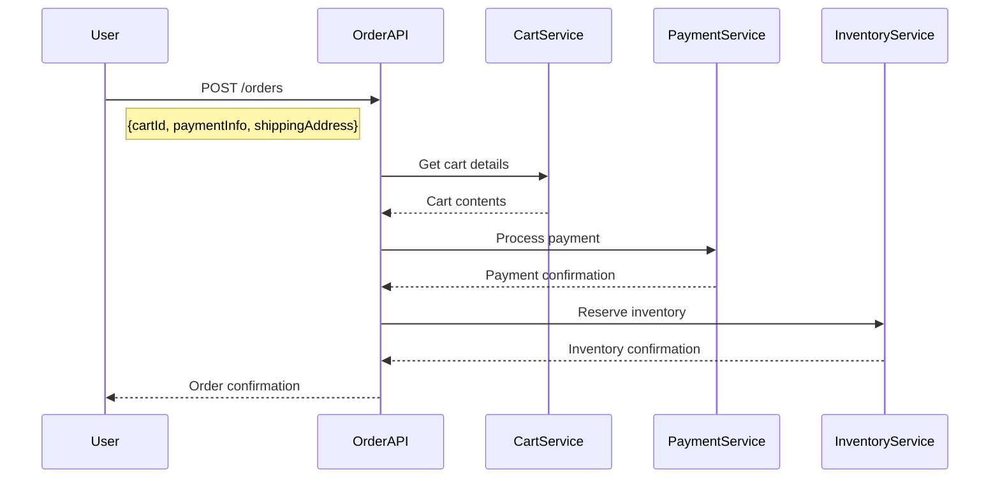

These scenarios test each assistant's ability to understand complex business logic, generate appropriate API structures, implement proper validation and error handling, manage service dependencies, and apply security best practices.

#### Comparative Performance Analysis

Based on comprehensive testing across multiple criteria, here's how these AI code assistants compare:

**Functionality & Performance**

**Feature Comparison Matrix**

| Feature | GitHub Copilot | Tabnine | Codeium | Amazon Q | Cursor | Windsurf | CodeGPT | Google Code Assist |
|---------|:-------------:|:-------:|:-------:|:--------:|:------:|:--------:|:-------:|:-----------------:|
| Multi-language Support | ⭐⭐⭐⭐⭐ | ⭐⭐⭐⭐ | ⭐⭐⭐⭐ | ⭐⭐⭐ | ⭐⭐⭐⭐⭐ | ⭐⭐⭐⭐ | ⭐⭐⭐⭐ | ⭐⭐⭐⭐⭐ |
| Code Generation | ⭐⭐⭐⭐⭐ | ⭐⭐⭐ | ⭐⭐⭐⭐ | ⭐⭐⭐⭐ | ⭐⭐⭐⭐⭐ | ⭐⭐⭐⭐⭐ | ⭐⭐⭐⭐ | ⭐⭐⭐⭐ |
| Code Explanation | ⭐⭐⭐ | ⭐⭐ | ⭐⭐⭐ | ⭐⭐⭐ | ⭐⭐⭐⭐⭐ | ⭐⭐⭐⭐ | ⭐⭐⭐⭐⭐ | ⭐⭐⭐⭐ |
| Security Focus | ⭐⭐⭐ | ⭐⭐⭐⭐ | ⭐⭐⭐ | ⭐⭐⭐⭐⭐ | ⭐⭐⭐ | ⭐⭐⭐ | ⭐⭐⭐ | ⭐⭐⭐⭐ |
| IDE Integration | ⭐⭐⭐⭐⭐ | ⭐⭐⭐⭐ | ⭐⭐⭐⭐ | ⭐⭐⭐ | ⭐⭐⭐⭐⭐ | ⭐⭐⭐ | ⭐⭐⭐⭐ | ⭐⭐⭐⭐ |
| Refactoring | ⭐⭐⭐⭐ | ⭐⭐⭐ | ⭐⭐⭐ | ⭐⭐⭐ | ⭐⭐⭐⭐⭐ | ⭐⭐⭐⭐⭐ | ⭐⭐⭐ | ⭐⭐⭐⭐ |
| Test Generation | ⭐⭐⭐⭐ | ⭐⭐ | ⭐⭐⭐ | ⭐⭐⭐ | ⭐⭐⭐⭐ | ⭐⭐⭐⭐ | ⭐⭐⭐ | ⭐⭐⭐⭐ |
| Documentation Gen | ⭐⭐⭐ | ⭐⭐ | ⭐⭐⭐ | ⭐⭐⭐ | ⭐⭐⭐⭐ | ⭐⭐⭐ | ⭐⭐⭐⭐ | ⭐⭐⭐⭐ |
| Privacy Features | ⭐⭐⭐ | ⭐⭐⭐⭐⭐ | ⭐⭐⭐⭐ | ⭐⭐⭐⭐ | ⭐⭐⭐ | ⭐⭐⭐ | ⭐⭐⭐ | ⭐⭐⭐ |
| Chat Interface | ⭐⭐⭐ | ⭐⭐ | ⭐⭐⭐ | ⭐⭐⭐ | ⭐⭐⭐⭐⭐ | ⭐⭐⭐⭐ | ⭐⭐⭐⭐ | ⭐⭐⭐⭐ |

**Pricing and Accessibility**

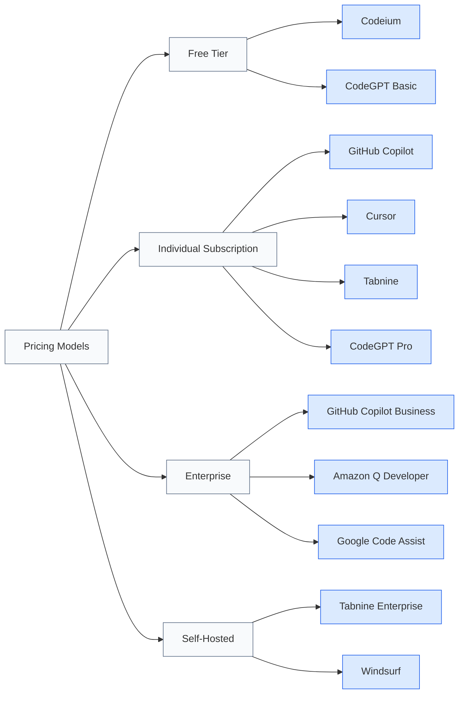

**Key Differentiators**

| Assistant | Primary Strengths | Notable Limitations |
|-----------|-------------------|---------------------|
| GitHub Copilot | Code quality excellence, Project-level context understanding, Extensive language support | Cost for large teams, Limited control over data usage |
| Tabnine | Strong privacy focus with local models, Low latency completions, Flexible deployment options | Less advanced in complex task understanding, Limited test generation |
| Codeium | Free tier availability, Fast response times, Competitive performance | Newer platform with evolving enterprise features, Less community resources |
| Amazon Q Developer | AWS ecosystem integration, Security-focused suggestions, Coding policy enforcement | Best performance within AWS ecosystem, Limited general knowledge |
| Cursor | Complete IDE experience, Powerful chat interface, Strong refactoring capabilities | Requires using Cursor editor, Learning curve for full functionality |
| Windsurf | Agentic approach to coding tasks, Multi-step reasoning, Complex automation | Still emerging product, Higher learning curve, Less IDE integrations |
| CodeGPT | Natural language interaction focus, Cross-language support, Education-friendly | Less specialized for enterprise environments, Variable performance |
| Google Code Assist | Google Cloud integration, Strong API knowledge, Multi-language capabilities | Best suited for Google Cloud users, Enterprise-focused pricing |

**Developer Experience and Adoption**


**Integration Capabilities**

Different AI code assistants offer varying levels of integration with development ecosystems:

```mermaid
graph TD
    A[Integration Ecosystem] --> B[GitHub Copilot]
    A --> C[Tabnine]
    A --> D[Codeium]
    A --> E[Amazon Q Developer]
    A --> F[Cursor]
    A --> G[Windsurf]
    A --> H[CodeGPT]
    A --> I[Google Code Assist]
    
    B --> B1[VS Code]
    B --> B2[JetBrains]
    B --> B3[GitHub]
    B --> B4[Neovim]
    
    C --> C1[VS Code]
    C --> C2[JetBrains]
    C --> C3[Vim/Neovim]
    C --> C4[Web Browsers]
    
    D --> D1[VS Code]
    D --> D2[JetBrains]
    D --> D3[Web Browsers]
    D --> D4[Vim/Neovim]
    
    E --> E1[VS Code]
    E --> E2[JetBrains]
    E --> E3[AWS Cloud9]
    E --> E4[Amazon CodeCatalyst]
    
    F --> F1[Cursor Editor]
    
    G --> G1[Windsurf Editor]
    G --> G2[VS Code Plugin]
    
    H --> H1[VS Code]
    H --> H2[JetBrains]
    
    I --> I1[VS Code]
    I --> I2[JetBrains]
    I --> I3[Cloud Workstations]
    I --> I4[Cloud Shell Editor]
    
    classDef mainNode fill:#475569,stroke:#0f172a,stroke-width:1px,color:white;
    classDef assistantNode fill:#0ea5e9,stroke:#0c4a6e,stroke-width:1px,color:white;
    classDef integrationNode fill:#f0f9ff,stroke:#0ea5e9,stroke-width:1px;
    
    class A mainNode;
    class B,C,D,E,F,G,H,I assistantNode;
    class B1,B2,B3,B4,C1,C2,C3,C4,D1,D2,D3,D4,E1,E2,E3,E4,F1,G1,G2,H1,H2,I1,I2,I3,I4 integrationNode;
```

## Developer Productivity

AI tools have revolutionized developer productivity by automating routine tasks, providing intelligent assistance, and enabling new workflows that weren't previously possible.

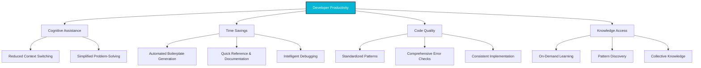

### AI-Powered Development Environments

Modern AI-enhanced development environments offer significantly more capabilities than traditional IDEs by incorporating intelligent assistance throughout the development process.

"Windsurf" and "Cursor" represent two leading AI-powered code editors that extend traditional capabilities:

**Common Capabilities**
- Intelligent code completion and generation
- Contextual documentation and explanations
- Automated refactoring suggestions
- Natural language code generation
- Bug detection and resolution assistance

**Key Differences**

| Feature | Windsurf | Cursor |
|---------|----------|--------|
| Focus | Proactive code manipulation and complex task automation | User-driven commands and contextual suggestions |
| Interface | Command-driven with agent-like behavior | Refined UI with integrated chat interface |
| Autonomy | Higher autonomy with multi-step reasoning | More user-guided with focused assistance |
| Learning Curve | Steeper but powerful for complex tasks | Gentler with progressive capability discovery |
| Customization | More extensive configuration options | Streamlined with defaults optimized for common use cases |

Both tools represent the evolution of development environments from passive text editors to active collaborators in the coding process.

### IDE Settings to 5x AI Output Quality

To maximize the effectiveness of AI coding assistants, proper configuration is essential. Each environment provides specific locations for custom instructions:

- **Visual Studio Code**: `.github/copilot-instructions.md`
- **Cursor**: `.cursorrules`
- **Windsurf**: `.windsurfrules`

These configuration files allow developers to establish project-specific guidelines that dramatically improve AI suggestion quality and relevance.

#### Instructions or Settings Template for Windsurf / Cursor / VS Code

```markdown
# [Project Name]
Every time you choose to apply a rule(s), explicitly state the rule(s) in the output. You can abbreviate the rule description to a single word or phrase.

## Project Context
[Brief description]
- [more description]
- [more description]
- [more description]

## Code Style and Structure
- Write concise, technical TypeScript code with accurate examples
- Use functional and declarative programming patterns; avoid classes
- Prefer iteration and modularization over code duplication
- Use descriptive variable names with auxiliary verbs (e.g., isLoading, hasError)
- Structure repository files as follows:
```
server/
├── src/
    ├── components/     # Shared React components
    ├── hooks/          # Custom React hooks
    ├── utils/          # Helper functions
    ├── types/          # TypeScript types
    └── lib/            # Shared libraries
extension/
├── src/
    ├── background/     # Service worker scripts
    ├── content/        # Content scripts
    ├── popup/          # Extension popup UI
    ├── options/        # Extension options page
    ├── components/     # Shared React components
    ├── hooks/          # Custom React hooks
    ├── utils/          # Helper functions
    ├── lib/            # Shared libraries
    ├── types/          # TypeScript types
    └── storage/        # Chrome storage utilities
shared/
├── src/
    ├── types/          # TypeScript types, only used for shared types between server and extension
    └── utils/          # Helper functions, only used for shared functions between server and extension
```

## Tech Stack
- React
- TypeScript
- Tailwind CSS
- Shadcn UI
- Chrome Extension
- Express.js

## Naming Conventions
- Use lowercase with dashes for directories (e.g., components/form-wizard)
- Favor named exports for components and utilities
- Use PascalCase for component files (e.g., VisaForm.tsx)
- Use camelCase for utility files (e.g., formValidator.ts)

## TypeScript Usage
- Use TypeScript for all code; prefer interfaces over types
- Avoid enums; use const objects with 'as const' assertion
- Use functional components with TypeScript interfaces
- Define strict types for message passing between different parts of the extension
- Use absolute imports for all files @/...
- Avoid try/catch blocks unless there's good reason to translate or handle error in that abstraction
- Use explicit return types for all functions

## State Management
- Use React Context for global state when needed
- Implement proper state persistence using chrome.storage (for extension)
- Implement proper cleanup in useEffect hooks

## Syntax and Formatting
- Use "function" keyword for pure functions
- Avoid unnecessary curly braces in conditionals
- Use declarative JSX
- Implement proper TypeScript discriminated unions for message types

## UI and Styling
- Use Shadcn UI and Radix for components
- use `npx shadcn@latest add <component-name>` to add new shadcn components
- Implement Tailwind CSS for styling
- Consider extension-specific constraints (popup dimensions, permissions)
- Follow Material Design guidelines for Chrome extensions
- When adding new shadcn component, document the installation command

## Error Handling
- Implement proper error boundaries
- Log errors appropriately for debugging
- Provide user-friendly error messages
- Handle network failures gracefully

## Testing
- Write unit tests for utilities and components
- Implement E2E tests for critical flows
- Test across different Chrome versions
- Test memory usage and performance

## Security
- Implement Content Security Policy
- Sanitize user inputs
- Handle sensitive data properly
- Follow Chrome extension security best practices
- Implement proper CORS handling

## Git Usage
Commit Message Prefixes:
- "fix:" for bug fixes
- "feat:" for new features
- "perf:" for performance improvements
- "docs:" for documentation changes
- "style:" for formatting changes
- "refactor:" for code refactoring
- "test:" for adding missing tests
- "chore:" for maintenance tasks

Rules:
- Use lowercase for commit messages
- Keep the summary line concise
- Include description for non-obvious changes
- Reference issue numbers when applicable

## Documentation
- Maintain clear README with setup instructions
- Document API interactions and data flows
- Keep manifest.json well-documented
- Don't include comments unless it's for complex logic
- Document permission requirements

## Development Workflow
- Use proper version control
- Implement proper code review process
- Test in multiple environments
- Follow semantic versioning for releases
- Maintain changelog
```
---