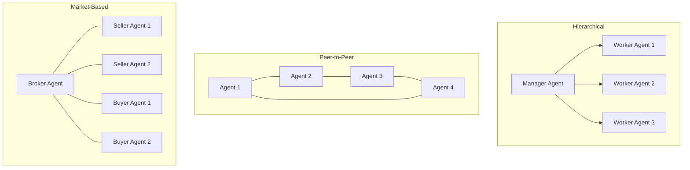
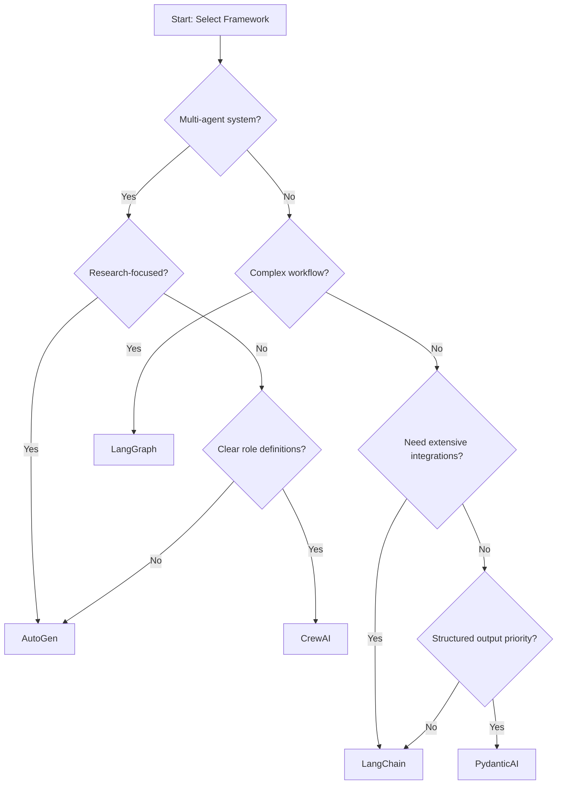

# Agentic AI Systems

# Comprehensive Guide to Agentic AI: Architecture, Implementation, and Applications

## Table of Contents

1. [Introduction to Agentic AI](#introduction-to-agentic-ai)
2. [Core Architecture of Agentic AI](#core-architecture-of-agentic-ai)
3. [Agent Implementation Paradigms](#agent-implementation-paradigms)
4. [Technical Frameworks and Tools](#technical-frameworks-and-tools)
5. [Specialized Agent Categories](#specialized-agent-categories)
6. [Design Patterns for Agentic Systems](#design-patterns-for-agentic-systems)
7. [Performance Optimization](#performance-optimization)
8. [Challenges and Limitations](#challenges-and-limitations)
9. [Future Directions](#future-directions)
10. [Implementation Roadmap](#implementation-roadmap)
11. [Appendix: Comparative Analysis](#appendix-comparative-analysis)

## Introduction to Agentic AI

### Definition and Core Concepts

Agentic AI refers to artificial intelligence systems designed to operate with varying degrees of autonomy to accomplish specific objectives. Unlike traditional AI models that respond reactively to inputs, agentic systems proactively engage with environments, make decisions, and take actions to achieve goals. These systems typically maintain internal state, learn from interactions, and adapt their behavior over time.

The term "agent" in this context denotes an entity that:
- Perceives its environment through sensors or data inputs
- Maintains internal representations of the world
- Makes decisions based on goals and available information
- Takes actions that affect its environment
- Learns from the outcomes of its actions

### The Rise of Agentic AI in 2025

2025 has become the inflection point for Agentic AI due to several converging factors:

1. **Advancements in Large Language Models (LLMs)**: The emergence of powerful LLMs capable of complex reasoning and following instructions has enabled more sophisticated agent behavior.

2. **Improved Tool Integration**: Modern frameworks allow agents to leverage external tools and APIs, dramatically expanding their capabilities beyond pure language generation.

3. **Framework Maturation**: The development of specialized frameworks like LangChain, LangGraph, AutoGen, and CrewAI has simplified the implementation of complex agent architectures.

4. **Architectural Innovations**: Multi-agent systems and collaborative agent networks have demonstrated capabilities exceeding those of single models.

5. **Business Adoption**: Organizations have moved beyond exploratory implementations to production-grade agent systems solving real business problems.

### From Reactive AI to Agentic Systems

The evolution of AI systems showcases a clear progression toward increasingly agentic behavior:

| Generation | Characteristics | Examples |
|------------|----------------|----------|
| Reactive Systems | Respond directly to inputs without memory or context | Rule-based systems, early chatbots |
| Contextual Systems | Maintain conversation history and context | GPT-3, early chat assistants |
| Tool-Using Systems | Incorporate external tools and capabilities | Function-calling LLMs, early agents |
| Autonomous Agents | Self-directed action toward goals with planning and memory | Task-oriented agents, virtual assistants |
| Multi-Agent Systems | Collaborative networks of specialized agents | Research teams, complex workflow systems |

This progression represents not just technological advancement but a fundamental shift in how AI systems operate and the problems they can solve.

## Core Architecture of Agentic AI

The architecture of Agentic AI follows a comprehensive framework comprising six interconnected components that work in harmony to create intelligent, autonomous, and adaptive systems.

### The Six-Component Framework

```mermaid
graph TD
    A[Agentic AI] --> B[1. Learning]
    A --> C[2. Adaptation]
    A --> D[3. Action]
    A --> E[4. Anticipation]
    A --> F[5. Efficiency]
    A --> G[6. Refinement]
    
    B --> B1[Ingestion]
    B --> B2[Training]
    B --> B3[Updates]
    
    C --> C1[Feedback]
    C --> C2[Scanning]
    C --> C3[Optimization]
    
    D --> D1[Initiative]
    D --> D2[Response]
    D --> D3[Opportunity]
    
    E --> E1[Forecasting]
    E --> E2[Risk Assessment]
    E --> E3[Trends Analysis]
    
    F --> F1[Process Optimization]
    F --> F2[Resource Allocation]
    F --> F3[Performance Tuning]
    
    G --> G1[Improvement Cycles]
    G --> G2[Adjustment Capabilities]
    G --> G3[Quality Assurance]
```



#### 1. Learning Component

The Learning component enables the system to continuously expand its knowledge and capabilities through:

- **Ingestion**: Absorbing new data from diverse sources to broaden the knowledge base
- **Training**: Implementing structured learning protocols to enhance performance
- **Updates**: Dynamically refreshing the knowledge base to maintain relevance

This foundational component ensures the AI remains current and adaptive, continuously expanding its capabilities through structured learning protocols and real-time knowledge acquisition.

#### 2. Adaptation Component

The Adaptation component allows the system to evolve in response to changing conditions through:

- **Feedback Loops**: Integrating responses from the environment and users
- **Environmental Scanning**: Monitoring changes in operational context
- **Self-Optimization**: Adjusting internal parameters to improve performance

This adaptive layer enables the system to respond dynamically to new situations, adjusting its behavior based on real-world interactions and performance metrics.

#### 3. Action Component

The Action component transforms insights into tangible outcomes through:

- **Initiative**: Proactively identifying and pursuing tasks
- **Response**: Generating appropriate reactions to external stimuli
- **Opportunity Recognition**: Identifying and capitalizing on favorable conditions

This proactive component ensures the AI doesn't just analyze but takes meaningful action to achieve objectives.

#### 4. Anticipation Component

The Anticipation component prepares the system for future scenarios through:

- **Forecasting**: Predicting future states and outcomes
- **Risk Assessment**: Identifying potential threats and vulnerabilities
- **Trends Analysis**: Recognizing patterns and trajectories in data

This predictive layer empowers the AI to not just react to current situations but prepare for future scenarios through sophisticated pattern recognition and predictive modeling.

#### 5. Efficiency Component

The Efficiency component optimizes resource utilization through:

- **Process Optimization**: Streamlining workflows and procedures
- **Resource Allocation**: Distributing computational resources effectively
- **Performance Tuning**: Fine-tuning operations for maximum effectiveness

This efficiency framework ensures optimal utilization of computational resources while maintaining high-quality output, balancing speed with precision in every operation.

#### 6. Refinement Component

The Refinement component ensures continuous improvement through:

- **Improvement Cycles**: Implementing iterative enhancement processes
- **Adjustment Capabilities**: Fine-tuning parameters based on outcomes
- **Quality Assurance**: Maintaining performance standards

This refinement layer acts as a self-correcting mechanism, constantly analyzing performance metrics and implementing improvements to enhance overall system effectiveness.

### Component Interaction and Integration

The six core components operate within an interconnected network architecture, enabling:

1. **Bidirectional Information Flow**: Each component both contributes to and benefits from other components
2. **Feedback-Driven Operation**: Outcomes from each component inform adjustments to others
3. **Holistic Performance Management**: The system evaluates and optimizes as an integrated whole

This architectural design provides both stability and flexibility, making it adaptable to diverse applications while maintaining consistent performance standards.

## Agent Implementation Paradigms

Agentic AI systems can be implemented using various paradigms, each with distinct characteristics, advantages, and use cases.

### Single-Agent Systems

Single-agent systems comprise a unified agent entity that handles all aspects of a task or domain.

**Characteristics:**
- Centralized decision-making
- Unified memory and context
- Simplified state management
- Streamlined implementation

**Appropriate for:**
- Well-defined tasks with clear boundaries
- Applications requiring consistent reasoning
- Scenarios with limited scope complexity
- Personal assistants and specialized tools

**Implementation Example:**
```python
# Simple single-agent implementation
class SingleAgent:
    def __init__(self, model, memory):
        self.model = model
        self.memory = memory
        self.tools = self._initialize_tools()
    
    def _initialize_tools(self):
        return {
            "search": SearchTool(),
            "calculator": CalculatorTool(),
            "database": DatabaseTool()
        }
    
    def process(self, input_query):
        context = self.memory.get_relevant_context(input_query)
        tool_names = self._determine_required_tools(input_query, context)
        
        tool_results = {}
        for tool_name in tool_names:
            tool_results[tool_name] = self.tools[tool_name].execute(input_query, context)
        
        response = self.model.generate(input_query, context, tool_results)
        self.memory.update(input_query, response, tool_results)
        
        return response
```

### Multi-Agent Systems

Multi-agent systems distribute tasks among specialized agents that collaborate to achieve objectives.

**Characteristics:**
- Distributed decision-making
- Specialized agent roles
- Complex agent interaction patterns
- Emergent system capabilities

**Appropriate for:**
- Complex tasks requiring diverse expertise
- Scenarios with interdependent subtasks
- Applications benefiting from parallel processing
- Situations requiring robustness through redundancy

**Agent Organization Patterns:**



### Agent Orchestration Approaches

Different frameworks employ various approaches to coordinate agent activities:

1. **Centralized Orchestration**
   - Central controller manages agent execution
   - Predetermined workflow with clear transitions
   - Example frameworks: LangChain, CrewAI

2. **Graph-Based Workflows**
   - State transitions represented as graph nodes
   - Conditional routing between processing steps
   - Example frameworks: LangGraph

3. **Market/Auction-Based**
   - Agents bid for tasks based on capabilities
   - Dynamic resource allocation and task assignment
   - Specialized implementations in research contexts

4. **Consensus-Driven**
   - Multiple agents collaborate on decisions
   - Voting or weighted influence mechanisms
   - Example frameworks: AutoGen

### Memory Models in Agent Systems

Agent memory structures are critical for maintaining context and enabling learning:

1. **Ephemeral Memory**
   - Short-term storage for immediate context
   - Typically cleared between sessions
   - Lower computational overhead

2. **Persistent Memory**
   - Long-term storage across sessions
   - Vector databases for semantic retrieval
   - Knowledge graphs for structured information

3. **Hierarchical Memory**
   - Tiered approach combining fast access and depth
   - Automatic summarization for compression
   - Importance-based retention policies

4. **Distributed Memory**
   - Shared knowledge across agent networks
   - Specialized memory for different agent roles
   - Synchronization mechanisms between agents

## Technical Frameworks and Tools

The implementation of Agentic AI systems relies on a variety of frameworks and tools, each with specific strengths and optimal use cases.

### Major Frameworks Comparison

| Framework | Key Features | Best For | Limitations | Maturity Level |
|-----------|-------------|----------|-------------|----------------|
| LangChain | Comprehensive toolkit, extensive integrations, active community | Rapid prototyping, tool integration, single-agent systems | Can be complex for beginners, performance overhead | High (3+ years) |
| LangGraph | State management, graph-based workflows, conditional routing | Complex workflows, stateful applications, decision trees | Newer ecosystem, fewer integrations | Medium (1-2 years) |
| AutoGen | Multi-agent conversation, agent grouping, minimal setup | Research applications, agent collaboration, exploratory tasks | Less structured workflows, higher resource usage | Medium (1-2 years) |
| CrewAI | Role-based agent design, task management, intuitive API | Business workflows, clear agent responsibilities, task allocation | Limited customization options, newer ecosystem | Low-Medium (<1 year) |
| PydanticAI | Schema validation, typed outputs, structured data | Integration with existing systems, data validation, API connections | Limited to structured outputs, less conversational | Low (<1 year) |
| Swarm (OpenAI) | Native integration with OpenAI models, simplified collaboration | OpenAI-centric applications, production use cases, enterprise settings | Platform lock-in, less flexibility | Low (<1 year) |

### Essential Components for Agent Implementation

1. **Foundation Models**
   - OpenAI GPT series (GPT-4, GPT-4o, etc.)
   - Anthropic Claude models
   - Open-source models (Llama, Mistral, etc.)
   - Specialized domain models

2. **Vector Databases**
   - Pinecone
   - Weaviate
   - ChromaDB
   - PostgreSQL with pgvector

3. **Tool Integration**
   - API connectors
   - Python function calling
   - Structured output parsers
   - Web browsers and scrapers

4. **Monitoring and Observability**
   - LangSmith
   - Weights & Biases
   - Arize
   - Custom logging solutions

### Framework Selection Decision Tree



### Implementation Approaches

1. **API-First Integration**
   - Access models through provider APIs
   - Lower computational requirements
   - Usage-based pricing model
   - Example: OpenAI API, Claude API

2. **Self-Hosted Deployment**
   - Run models on your infrastructure
   - Higher control and privacy
   - Fixed infrastructure costs
   - Example: llama.cpp, vLLM, TGI

3. **Hybrid Approaches**
   - Combine API and self-hosted models
   - Tiered model deployment strategy
   - Optimize for cost and performance
   - Example: Using local models for initial processing, API models for complex reasoning

## Specialized Agent Categories

Agentic AI systems can be designed for specific domains and applications, each with unique characteristics, requirements, and implementation considerations.

### Educational and Research Agents

These agents facilitate learning, knowledge discovery, and scientific exploration.

**Key Features:**
- Information retrieval and synthesis from diverse sources
- Personalized learning pathways and content adaptation
- Research assistance including literature review and analysis
- Hypothesis generation and experimental design support

**Notable Implementations:**
- ATLAS (Academic Task and Learning Agent System)
- Chiron (Feynman-Enhanced Learning Agent)
- Scientific Paper Agent for Literature Review

**Technical Considerations:**
- Maintaining factual accuracy and citation integrity
- Balancing explanation depth with accessibility
- Integration with academic databases and resources
- Ethical handling of research data and attribution

### Business and Professional Agents

These agents streamline business operations, enhance decision-making, and improve productivity.

**Key Features:**
- Process automation and workflow optimization
- Data analysis and business intelligence
- Customer interaction and support
- Project management and resource allocation

**Notable Implementations:**
- Customer Support Agent
- Project Manager Assistant
- Contract Analysis Assistant (ClauseAI)
- E2E Testing Agent

**Technical Considerations:**
- Integration with enterprise systems and databases
- Security and privacy of business-critical information
- Scalability for enterprise-level deployment
- Auditability and traceability of agent actions

### Creative and Content Generation Agents

These agents assist in creating, editing, and optimizing various forms of content.

**Key Features:**
- Multi-modal content generation (text, images, audio)
- Style adaptation and brand consistency
- Audience-tailored content optimization
- Creative ideation and concept development

**Notable Implementations:**
- Content Intelligence Multi-Platform Generator
- TTS Poem Generator
- Music Compositor Agent
- GIF Animation Generator

**Technical Considerations:**
- Balancing originality with consistency
- Copyright and attribution issues
- Integration with media processing tools
- Performance optimization for resource-intensive generation

### Analysis and Information Processing Agents

These agents extract insights, identify patterns, and synthesize information from large datasets.

**Key Features:**
- Data extraction and transformation
- Pattern recognition and anomaly detection
- Information synthesis and summarization
- Multi-source correlation and verification

**Notable Implementations:**
- Self-Healing Codebase System
- Memory-Enhanced Conversational Agent
- Multi-Agent Collaboration System
- DataScribe Schema Explorer

**Technical Considerations:**
- Scalability for large datasets
- Accuracy and reliability of analysis
- Explanatory capabilities for complex findings
- Integration with data visualization tools

### Task Management and Productivity Agents

These agents help organize, prioritize, and execute tasks across personal and professional contexts.

**Key Features:**
- Task breakdown and prioritization
- Progress tracking and notification
- Resource allocation and scheduling
- Obstacle identification and resolution

**Notable Implementations:**
- Taskifier (Intelligent Task Allocation)
- Grocery Management Agents System
- Travel Planning Agent

**Technical Considerations:**
- Integration with existing productivity tools
- Personalization to individual work styles
- Real-time responsiveness and adaptability
- Handling of dependencies and constraints

## Design Patterns for Agentic Systems

Successful Agentic AI implementations follow established design patterns that enhance functionality, maintainability, and performance.

### Core Architectural Patterns

1. **Plan-Execute-Reflect Pattern**
   
   This pattern implements a three-phase approach where the agent:
   - Plans a sequence of actions based on goals
   - Executes those actions systematically
   - Reflects on outcomes to improve future performance

   ```mermaid
   graph LR
       A[Goal Definition] --> B[Planning]
       B --> C[Execution]
       C --> D[Outcome Evaluation]
       D --> E[Reflection]
       E --> B
   ```

   **Benefits:**
   - Structured approach to complex tasks
   - Continuous improvement through reflection
   - Explicit reasoning about failures
   
   **Implementation Example:**
   ```python
   def plan_execute_reflect_cycle(agent, task, context):
       # Planning phase
       plan = agent.create_plan(task, context)
       
       # Execution phase
       results = agent.execute_plan(plan)
       
       # Reflection phase
       lessons = agent.reflect_on_execution(plan, results)
       
       # Update agent knowledge
       agent.update_knowledge(lessons)
       
       return results, lessons
   ```

2. **ReAct (Reasoning + Acting) Pattern**
   
   This pattern interleaves reasoning steps with action steps:
   - Reason about the current state
   - Decide on an appropriate action
   - Execute the action
   - Observe the result
   - Repeat

   **Benefits:**
   - More dynamic than rigid planning
   - Adjusts to unexpected situations
   - Provides traceable reasoning chains

3. **Chain-of-Thought Augmentation**
   
   This pattern enhances agent decision-making by:
   - Breaking complex reasoning into explicit steps
   - Maintaining the reasoning trace in context
   - Building on intermediate conclusions

   **Benefits:**
   - Improved reasoning on complex tasks
   - Reduced hallucinations through structured thinking
   - Easier debugging of agent thought processes

4. **Tool Orchestration Pattern**
   
   This pattern manages the selection and use of available tools:
   - Analyze the task to determine required tools
   - Select optimal tools from available options
   - Execute tools in appropriate sequence
   - Integrate results into cohesive output

   **Benefits:**
   - Extends agent capabilities beyond model limitations
   - Enables real-world interaction
   - Improves accuracy through specialized tools

### Specialized Design Patterns

1. **Critic-Revision Pattern**
   
   This pattern implements a two-agent structure:
   - Generator agent produces initial output
   - Critic agent evaluates and suggests improvements
   - Generator revises based on critique
   - Process repeats until quality thresholds are met

   **Benefits:**
   - Higher quality output through iterative improvement
   - Separation of generation and evaluation concerns
   - Explicit quality criteria enforcement

2. **Information Foraging Pattern**
   
   This pattern guides efficient information gathering:
   - Identify information needs
   - Determine optimal information sources
   - Extract and validate information
   - Synthesize findings into coherent knowledge

   **Benefits:**
   - Systematic approach to research tasks
   - Balanced exploration vs. exploitation
   - Comprehensive coverage of relevant information

3. **Human-in-the-Loop Pattern**
   
   This pattern integrates human judgment at critical points:
   - Agent performs initial processing
   - Human reviews and provides feedback
   - Agent adjusts based on feedback
   - Process continues with reduced human intervention

   ```mermaid
   sequenceDiagram
       participant User
       participant Agent
       participant Tools
       
       Agent->>Agent: Initial processing
       Agent->>User: Request review/approval
       User->>Agent: Provide feedback
       Agent->>Agent: Adjust approach
       Agent->>Tools: Execute tools
       Tools->>Agent: Return results
       Agent->>User: Present improved result
   ```

   **Benefits:**
   - Combines human judgment with AI efficiency
   - Builds user trust through transparency
   - Enables progressive automation

4. **Memory Hierarchy Pattern**
   
   This pattern implements tiered memory management:
   - Working memory for immediate context
   - Short-term memory for recent interactions
   - Long-term memory for persistent knowledge
   - External knowledge for reference information

   **Benefits:**
   - Optimized context management
   - Balanced between comprehensive context and efficiency
   - Persistent learning across interactions

## Performance Optimization

Optimizing the performance of Agentic AI systems requires attention to efficiency, cost management, and quality assurance.

### Computational Efficiency Strategies

1. **Prompt Engineering and Optimization**
   - Precise instruction framing to minimize token usage
   - Template optimization to reduce redundant content
   - Strategic use of few-shot examples

2. **Model Selection and Tiering**
   - Matching model capabilities to task requirements
   - Using simpler models for routine tasks
   - Reserving advanced models for complex reasoning

3. **Caching and Memoization**
   - Storing and reusing common query results
   - Implementing tiered caching strategies
   - Effective cache invalidation policies

4. **Parallel Processing**
   - Concurrent execution of independent tasks
   - Asynchronous API calls and tool usage
   - Efficient task batching where appropriate

### Cost Management Approaches

1. **Token Economy**
   - Tracking and optimizing token usage
   - Implementing token budgets by task type
   - Compression techniques for context reduction

2. **Hybrid Model Deployment**
   - Self-hosting smaller models for routine tasks
   - Using API models for complex reasoning
   - Dynamically selecting based on task requirements

3. **Output Caching**
   - Storing and reusing expensive generations
   - Implementing intelligent cache policies
   - Partial cache matching for similar queries

4. **Request Throttling and Batching**
   - Combining related requests where possible
   - Implementing rate limits to control costs
   - Priority-based request scheduling

### Quality Assurance Mechanisms

1. **Automated Evaluation Frameworks**
   - Implementing automated quality checks
   - Using ground truth comparison where available
   - Measuring consistency across related outputs

2. **Self-Evaluation Techniques**
   - Agent-driven output assessment
   - Confidence scoring for generated content
   - Uncertainty identification and flagging

3. **Regression Testing**
   - Maintaining test suites of expected behaviors
   - Regular evaluation against benchmarks
   - Monitoring performance drift over time

4. **Human Feedback Integration**
   - Structured feedback collection processes
   - Feedback incorporation into training data
   - Progressive automation with quality thresholds

### Monitoring and Observability

1. **Performance Metrics Tracking**
   - Response time and latency monitoring
   - Token usage and efficiency metrics
   - Error rates and recovery statistics

2. **User Satisfaction Measurement**
   - Direct feedback collection mechanisms
   - Implicit satisfaction signals
   - A/B testing of agent variations

3. **System Health Indicators**
   - Service availability and reliability metrics
   - Resource utilization and bottleneck identification
   - Dependency health monitoring

4. **Failure Analysis**
   - Structured logging of agent reasoning
   - Root cause analysis for errors
   - Continuous improvement based on failure patterns

## Challenges and Limitations

Despite their potential, Agentic AI systems face significant challenges that must be addressed for successful implementation.

### Technical Challenges

1. **Hallucination and Factuality**
   - Foundation models can generate plausible but incorrect information
   - Challenges in grounding agent knowledge in verifiable facts
   - Difficulty in distinguishing model knowledge from reasoning errors

   **Mitigation Strategies:**
   - Implement fact verification mechanisms using external sources
   - Use structured knowledge bases for critical information
   - Develop explicit uncertainty indicators for agent outputs

2. **Context Management**
   - Limited context windows in foundation models
   - Challenges in maintaining relevant information across interactions
   - Information prioritization for complex tasks

   **Mitigation Strategies:**
   - Implement hierarchical memory systems with summarization
   - Develop context compression techniques
   - Use retrieval-augmented generation for external knowledge

3. **Tool Integration Reliability**
   - Unpredictable tool usage patterns by language models
   - Challenges in error handling for external tools
   - Difficulty in maintaining tool awareness across context boundaries

   **Mitigation Strategies:**
   - Structured tool calling frameworks with explicit schemas
   - Comprehensive error handling and retry mechanisms
   - Regular refreshing of tool availability and capabilities

4. **Planning and Execution Gaps**
   - Disconnect between agent plans and execution capabilities
   - Task decomposition challenges for complex objectives
   - Failure recovery in multi-step processes

   **Mitigation Strategies:**
   - Implement explicit plan validation steps
   - Develop recursive task decomposition techniques
   - Design robust failure recovery mechanisms

### Ethical and Safety Considerations

1. **Alignment and Control**
   - Ensuring agent goals align with human intentions
   - Preventing goal modification during operation
   - Maintaining appropriate autonomy boundaries

2. **Transparency and Explainability**
   - Making agent reasoning processes transparent
   - Explaining complex decision chains
   - Providing attribution for information sources

3. **Bias and Fairness**
   - Inheriting and potentially amplifying model biases
   - Ensuring equitable treatment across user groups
   - Preventing discriminatory outcomes in automated processes

4. **Security Vulnerabilities**
   - Prompt injection and jailbreaking attempts
   - Data leakage through agent interactions
   - Malicious use of agent capabilities

### Integration Challenges

1. **Enterprise System Compatibility**
   - Integrating with legacy systems and databases
   - Meeting enterprise security requirements
   - Scaling to organizational workloads

2. **Human-Agent Collaboration**
   - Defining appropriate task boundaries
   - Building user trust in agent capabilities
   - Managing handoffs between humans and agents

3. **Regulatory Compliance**
   - Navigating sector-specific regulations
   - Ensuring data privacy compliance
   - Maintaining audit trails for regulated processes

4. **Operational Readiness**
   - Developing appropriate monitoring infrastructure
   - Creating escalation paths for agent failures
   - Establishing performance baselines and SLAs

## Future Directions

The field of Agentic AI is rapidly evolving with several emerging trends and research directions shaping its future.

### Emerging Research Areas

1. **Autonomous Skill Acquisition**
   - Self-improving agents that learn new capabilities
   - Automated tool discovery and integration
   - Curriculum learning for progressive skill development

2. **Collective Intelligence Systems**
   - Large-scale agent networks with emergent capabilities
   - Specialized agent ecosystems with complex interactions
   - Market-based resource allocation between agents

3. **Embodied Intelligence**
   - Integration of agentic systems with robotics
   - Physical world interaction through sensors and actuators
   - Multi-modal perception and action planning

4. **Agent Personalization**
   - Adaptation to individual user preferences and needs
   - Personalized memory and interaction patterns
   - Learning from user feedback and behavior

### Industry Adoption Trajectories

1. **Short-Term (1-2 Years)**
   - Widespread adoption of task-specific agents
   - Integration into existing business workflows
   - Focus on immediate productivity gains

2. **Medium-Term (3-5 Years)**
   - Enterprise-wide agent ecosystems
   - Agent collaboration across organizational boundaries
   - Autonomous process optimization

3. **Long-Term (5+ Years)**
   - General-purpose autonomous systems
   - Agent-mediated business operations
   - Human-agent collaborative networks

### Technological Enablers

1. **Foundation Model Advancements**
   - Increased context windows
   - Improved factuality and reasoning
   - Lower latency and computational requirements

2. **Specialized Agent Architectures**
   - Purpose-built models for agent coordination
   - Efficient state representation techniques
   - Multi-modal agent capabilities

3. **Tool Ecosystem Expansion**
   - Standardized tool definition frameworks
   - Comprehensive tool libraries
   - Self-describing API integration

4. **Infrastructure Optimization**
   - Specialized hardware for agent operations
   - Distributed agent execution environments
   - Memory-efficient agent deployment

## Implementation Roadmap

A structured approach to implementing Agentic AI systems involves progressive development phases.

### Phase 1: Foundation Building

1. **Business Case Development**
   - Identify high-value use cases
   - Define success metrics and KPIs
   - Secure stakeholder buy-in

2. **Technology Selection**
   - Choose appropriate foundation models
   - Select implementation frameworks
   - Define integration architecture

3. **Pilot Project Planning**
   - Scope limited initial implementation
   - Define clear boundaries and expectations
   - Establish evaluation criteria

### Phase 2: Prototype Development

1. **Basic Agent Implementation**
   - Develop core agent functionality
   - Implement simple tool integrations
   - Create minimal user interface

2. **Internal Testing and Refinement**
   - Gather feedback from stakeholders
   - Identify performance bottlenecks
   - Refine agent capabilities

3. **Limited Deployment**
   - Release to controlled user group
   - Monitor performance and usage
   - Collect user experience data

### Phase 3: Production Scaling

1. **Architecture Optimization**
   - Refine for performance and reliability
   - Implement monitoring infrastructure
   - Develop cost management strategies

2. **Feature Expansion**
   - Add advanced capabilities
   - Integrate additional tools
   - Enhance user experience

3. **Full Deployment**
   - Scale to intended user base
   - Implement training and support
   - Establish continuous improvement processes

### Phase 4: Ecosystem Development

1. **Agent Specialization**
   - Develop domain-specific agents
   - Implement agent collaboration
   - Create agent marketplace

2. **Process Integration**
   - Embed agents in business processes
   - Develop automation workflows
   - Implement cross-system agent operations

3. **Continuous Advancement**
   - Regular capability updates
   - Model and framework upgrades
   - Expanded tool integrations

## Appendix: Comparative Analysis

### Framework Feature Comparison Matrix

| Feature | LangChain | LangGraph | AutoGen | CrewAI | PydanticAI |
|---------|-----------|-----------|---------|--------|------------|
| Multi-Agent Support | ✓ | ✓ | ✓✓✓ | ✓✓ | ✗ |
| Workflow Management | ✓ | ✓✓✓ | ✓ | ✓✓ | ✗ |
| State Management | ✓ | ✓✓✓ | ✓ | ✓ | ✗ |
| Tool Integration | ✓✓✓ | ✓✓ | ✓ | ✓ | ✓ |
| Memory Systems | ✓✓✓ | ✓✓ | ✓ | ✓ | ✗ |
| Data Validation | ✓ | ✓ | ✗ | ✓ | ✓✓✓ |
| Learning Curve | Steep | Moderate | Moderate | Gentle | Gentle |
| Community Size | Large | Medium | Medium | Small | Small |
| Documentation | Extensive | Good | Good | Limited | Limited |
| Enterprise Readiness | High | Medium | Medium | Low | Medium |

Key: ✓ (Basic Support), ✓✓ (Good Support), ✓✓✓ (Excellent Support), ✗ (Not Supported)

### Model Capabilities for Agent Implementation

| Model Family | Reasoning | Tool Usage | Planning | Memory Management | Multi-Agent Compatibility |
|--------------|-----------|------------|----------|-------------------|---------------------------|
| GPT-4 Series | Excellent | Excellent | Excellent | Good | Excellent |
| Claude Series | Excellent | Good | Excellent | Good | Good |
| Llama 3 | Good | Good | Good | Moderate | Moderate |
| Mistral | Moderate | Moderate | Moderate | Limited | Limited |
| Gemini | Good | Good | Good | Moderate | Good |
| Command R | Good | Excellent | Good | Moderate | Moderate |

### Application Domain Suitability

| Domain | Single Agent | Multi-Agent | Key Frameworks | Implementation Complexity |
|--------|--------------|-------------|----------------|---------------------------|
| Customer Support | High | Medium | LangChain, PydanticAI | Medium |
| Research & Analysis | Medium | High | AutoGen, LangGraph | High |
| Content Creation | High | Medium | LangChain, CrewAI | Medium |
| Process Automation | Medium | High | LangGraph, CrewAI | High |
| Personal Productivity | High | Low | LangChain, PydanticAI | Low |
| Education & Training | High | Medium | LangChain, LangGraph | Medium |
| Business Intelligence | Medium | High | AutoGen, LangGraph | High |
