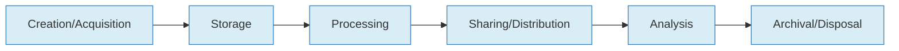
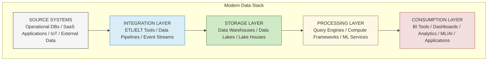
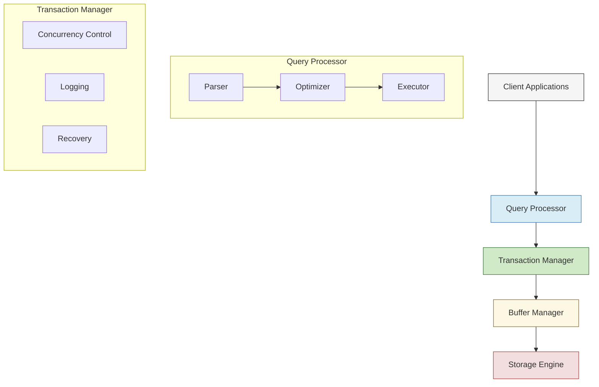
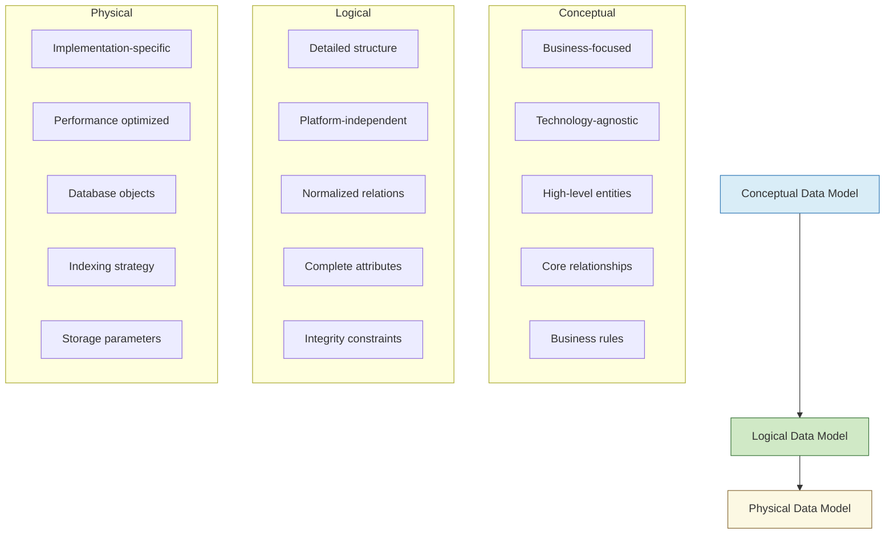
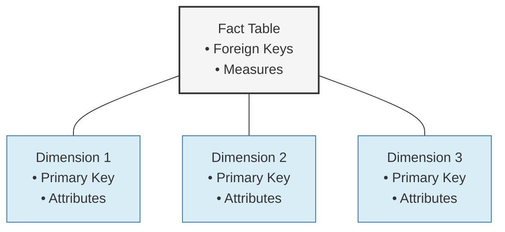
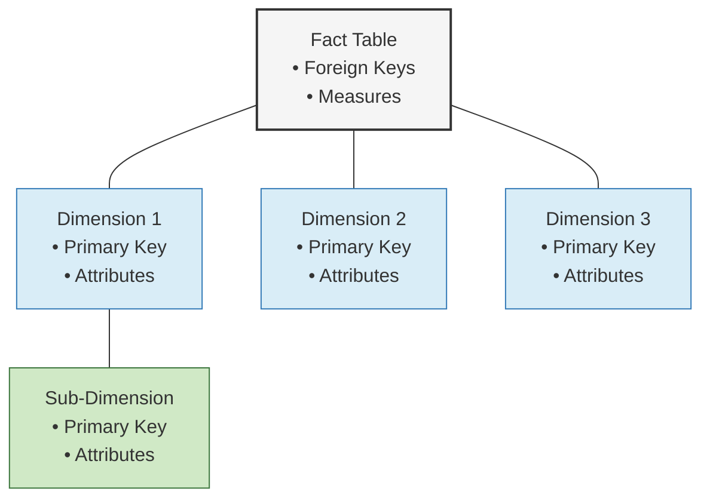
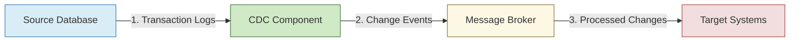
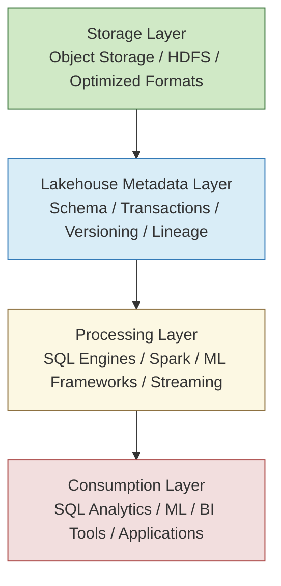
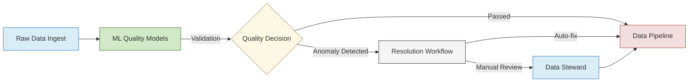
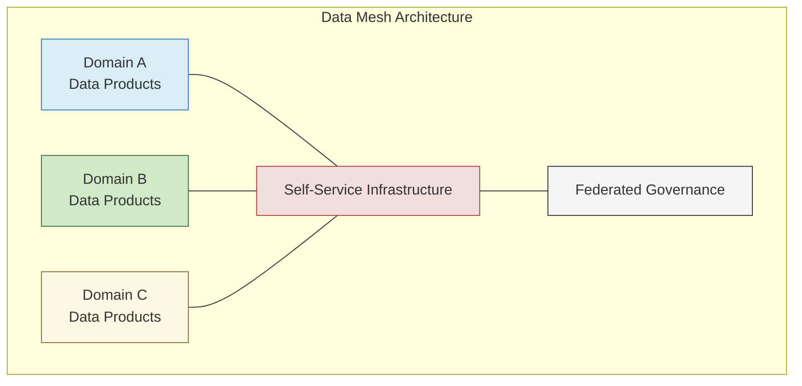

## Table of Contents
- [Fundamentals of Data Management](#fundamentals-of-data-management)
- [Database Systems](#database-systems)
- [Data Modeling and Architecture](#data-modeling-and-architecture)
- [Data Storage and Processing](#data-storage-and-processing)
- [Data Quality and Governance](#data-quality-and-governance)
- [Modern Data Engineering](#modern-data-engineering)
- [Future Trends in Data Foundations](#future-trends-in-data-foundations)

---

## Fundamentals of Data Management

### Core Concepts and Terminology

Data management encompasses the processes, architectures, practices, policies, and procedures that manage the full data lifecycle within an enterprise. 

| Concept | Definition | Enterprise Significance |
|---------|------------|-------------------------|
| **Data** | Raw facts and figures | Foundation of all information systems |
| **Information** | Processed and contextualized data | Enables operational decision-making |
| **Knowledge** | Applied information | Drives strategic advantage |
| **Data Assets** | Data with recognized value | Requires formal management |
| **Metadata** | Data about data | Enables discovery, understanding, and governance |

---

### Data Lifecycle Management



Enterprise data moves through distinct phases that must be managed cohesively:

1. **Creation/Acquisition** 
   - Internal generation
   - External sourcing
   - System integration

2. **Storage**
   - Repository selection
   - Schema design
   - Performance optimization

3. **Processing**
   - Transformation
   - Enrichment
   - Quality management

4. **Sharing/Distribution**
   - Access control
   - Delivery mechanisms
   - Integration patterns

5. **Analysis**
   - Descriptive analytics
   - Predictive modeling
   - Prescriptive insights

6. **Archival/Disposal**
   - Retention policies
   - Compliant deletion
   - Archive management

---

### Enterprise Data Strategy

A comprehensive data strategy aligns data management with business objectives through:

| Component | Purpose | Key Considerations |
|-----------|---------|-------------------|
| **Business Alignment** | Connect data initiatives to enterprise goals | Strategic priorities, KPIs, value drivers |
| **Data as an Asset** | Establish data valuation framework | Asset classification, ownership, ROI measurement |
| **Value Realization** | Create mechanisms to measure data's impact | Benefit tracking, cost management, reporting |
| **Capability Assessment** | Evaluate current vs. desired maturity | Gap analysis, benchmarking, roadmap development |
| **Technology Roadmap** | Plan infrastructure evolution | Platform selection, integration architecture, scaling |

---

### Data Governance Frameworks

Enterprise data governance establishes accountability for data assets through:

- **Organizational Structure**
  - Data stewards
  - Data owners
  - Data custodians
  - Governance committees

- **Policies and Standards**
  - Data quality standards
  - Security classification
  - Retention requirements
  - Privacy controls

- **Procedures**
  - Data access workflows
  - Quality remediation processes
  - Classification procedures
  - Compliance verification

- **Controls**
  - Technical enforcement mechanisms
  - Audit capabilities
  - Validation routines
  - Access restrictions

- **Measurement**
  - Governance maturity assessment
  - Policy compliance metrics
  - Quality scorecards
  - Value realization tracking

**Established Enterprise Frameworks:**

1. **DAMA DMBOK** (Data Management Body of Knowledge)
   - Comprehensive knowledge framework
   - Ten data management functions
   - Environmental factors and best practices

2. **IBM Data Governance Council Maturity Model**
   - Eleven governance categories
   - Five maturity levels
   - Outcome-focused assessment

3. **Stanford Data Governance Maturity Model**
   - People, policies, and capabilities focus
   - Progressive capability development
   - Academic foundation with enterprise adaptation

---

### Modern Data Stack Overview

The contemporary enterprise data ecosystem typically comprises interconnected layers:



**Cross-cutting concerns:**
- Security & Access Control
- Data Governance
- Metadata Management
- Data Quality
- Lineage Tracking
- Cost Management

---

## Database Systems

### Relational Database Management Systems (RDBMS)

#### Principles and Architecture

RDBMS platforms organize data into normalized tables with defined relationships, based on these core principles:

- **Relational Model**: Mathematics-based approach using set theory and predicate logic
- **Schema Enforcement**: Strong typing and structural validation before data entry
- **Transaction Management**: ACID properties ensuring reliability and consistency
- **Query Optimization**: Cost-based and rule-based optimizers for performance
- **Concurrency Control**: Sophisticated mechanisms for managing simultaneous access

**Core RDBMS Architectural Components:**



#### Major Enterprise RDBMS Platforms

| Platform | Strengths | Limitations | Best Use Cases |
|----------|-----------|-------------|----------------|
| **Oracle Database** | • Advanced security<br>• High availability<br>• Comprehensive features<br>• Mature ecosystem | • High cost<br>• Licensing complexity<br>• Resource requirements | • Mission-critical enterprise applications<br>• Complex transactional systems<br>• Large-scale data warehousing |
| **Microsoft SQL Server** | • Integration with Microsoft ecosystem<br>• Strong BI capabilities<br>• Developer-friendly tools | • Windows-centric<br>• Licensing costs<br>• Resource-intensive | • Windows/.NET enterprise environments<br>• Microsoft-aligned organizations<br>• Data warehousing and analytics |
| **PostgreSQL** | • Extensibility<br>• Standards compliance<br>• Advanced features<br>• Open source | • Complex configuration<br>• Performance tuning complexity<br>• Limited native cloud features | • Cost-sensitive enterprises<br>• Application flexibility<br>• Multi-model database needs |
| **MySQL/MariaDB** | • Simplicity<br>• Performance<br>• Community support<br>• Web application focus | • Fewer enterprise features<br>• Limited scalability<br>• Simpler optimizer | • Web applications<br>• Medium-sized deployments<br>• LAMP stack environments |
| **IBM Db2** | • Mainframe integration<br>• High reliability<br>• Hybrid transaction/analytical | • Cost<br>• Complexity<br>• Specialized skills required | • Large financial institutions<br>• Legacy environments<br>• IBM-aligned organizations |

#### Total Cost of Ownership Considerations

Enterprise RDBMS evaluation must include comprehensive TCO analysis:

- **Licensing Models**
  - Core-based vs. user-based licensing
  - Enterprise agreements and discounting
  - Cloud consumption-based pricing
  - Open source support subscriptions

- **Hardware Requirements**
  - Server specifications and scaling
  - High-availability infrastructure
  - Disaster recovery components
  - Storage performance tiers

- **Administration Overhead**
  - DBA staffing requirements
  - Specialized skill acquisition
  - Monitoring and management tools
  - Backup and recovery infrastructure

- **Support Costs**
  - Vendor support contracts
  - Third-party support options
  - Community support viability
  - Internal expertise development

- **Scaling Economics**
  - Vertical vs. horizontal scaling costs
  - License implications of scaling
  - Performance at scale considerations
  - Multi-instance management

- **Cloud vs. On-premises**
  - CapEx vs. OpEx considerations
  - Total migration costs
  - Operational model changes
  - Long-term cost projections

---

### SQL Fundamentals and Advanced Techniques

#### Basic SQL Operations

**Data Retrieval:**
```sql
SELECT column1, column2, aggregated_value
FROM table1
JOIN table2 ON table1.key = table2.key
WHERE condition1 AND condition2
GROUP BY column1, column2
HAVING aggregation_condition
ORDER BY column1 DESC
LIMIT 100;
```

**Data Manipulation:**
```sql
-- Inserting data
INSERT INTO table (column1, column2) VALUES (value1, value2);

-- Updating records
UPDATE table
SET column1 = value1, column2 = value2
WHERE condition;

-- Deleting records
DELETE FROM table WHERE condition;
```

**Data Definition:**
```sql
-- Creating tables
CREATE TABLE table_name (
  id INTEGER PRIMARY KEY,
  column1 VARCHAR(100) NOT NULL,
  column2 DATE,
  column3 DECIMAL(10,2),
  CONSTRAINT fk_constraint FOREIGN KEY (column1) REFERENCES other_table(key_column)
);

-- Altering tables
ALTER TABLE table_name ADD COLUMN new_column INTEGER;
```

**Access Control:**
```sql
-- Granting permissions
GRANT SELECT, INSERT ON table_name TO role_name;

-- Revoking permissions
REVOKE ALL PRIVILEGES ON table_name FROM user_name;
```

#### Advanced SQL Features

| Feature | Purpose | Enterprise Applications |
|---------|---------|------------------------|
| **Window Functions** | Perform calculations across sets of rows | • Financial period-over-period analysis<br>• Sales ranking and segmentation<br>• Moving averages for trend analysis |
| **Common Table Expressions** | Create named temporary result sets | • Complex hierarchical data queries<br>• Multi-step transformations<br>• Recursive relationship traversal |
| **Recursive Queries** | Process hierarchical or graph-structured data | • Organizational charts<br>• Bill of materials explosion<br>• Network path analysis |
| **Stored Procedures** | Encapsulate business logic in database | • Data validation<br>• Complex transaction processing<br>• Security and access control |
| **User-Defined Functions** | Custom calculations and transformations | • Business-specific calculations<br>• Data standardization<br>• Complex derivations |
| **Materialized Views** | Precomputed query results | • Reporting performance<br>• Real-time dashboards<br>• Complex aggregation caching |
| **JSON/XML Processing** | Handle semi-structured data | • API integration<br>• Document storage<br>• Flexible schemas for variable data |
| **Full-text Search** | Natural language and keyword searching | • Content management<br>• Knowledge bases<br>• Document repositories |

**Example of Window Functions:**
```sql
SELECT 
  department,
  employee_name,
  salary,
  AVG(salary) OVER (PARTITION BY department) as dept_avg,
  salary - AVG(salary) OVER (PARTITION BY department) as diff_from_avg,
  RANK() OVER (PARTITION BY department ORDER BY salary DESC) as salary_rank
FROM employees;
```

**Example of Common Table Expressions:**
```sql
WITH regional_sales AS (
  SELECT region, SUM(amount) as total_sales
  FROM orders
  GROUP BY region
),
top_regions AS (
  SELECT region
  FROM regional_sales
  ORDER BY total_sales DESC
  LIMIT 5
)
SELECT region, product, SUM(quantity) as product_units
FROM orders
WHERE region IN (SELECT region FROM top_regions)
GROUP BY region, product
ORDER BY region, product_units DESC;
```

#### SQL Performance Optimization

**Execution Plan Analysis:**
```
EXPLAIN ANALYZE
SELECT * FROM large_table
JOIN other_table ON large_table.id = other_table.ref_id
WHERE large_table.status = 'Active'
AND other_table.category IN ('A', 'B');
```

**Key Optimization Techniques:**

- **Index Utilization**
  - Appropriate index selection
  - Covering indexes for query requirements
  - Index intersection considerations
  - Index maintenance schedule

- **Join Optimization**
  - Join type selection (nested loop, hash, merge)
  - Join order significance
  - Join condition analysis
  - Partitioning alignment for joins

- **Subquery Optimization**
  - Rewriting as joins when appropriate
  - Correlation impact analysis
  - Materialization vs. pipelining
  - IN vs. EXISTS comparison

- **Parameterization**
  - Prepared statement usage
  - Bind variable implementation
  - Avoiding parameter sniffing issues
  - Plan cache management

- **Statistics Management**
  - Regular statistics updates
  - Histogram accuracy
  - Sampling rates for large tables
  - Multi-column statistics

---

### NoSQL Database Systems

#### Document Databases

Store semi-structured, schema-flexible JSON-like documents:

| Database | Enterprise Features | Performance Characteristics | Typical Use Cases |
|----------|---------------------|----------------------------|-------------------|
| **MongoDB** | • Sharding<br>• Replication<br>• Enterprise security<br>• Encryption<br>• Auditing | • Horizontal scaling<br>• Flexible indexing<br>• Read optimized<br>• Memory-mapped storage | • Content management<br>• Catalog systems<br>• User profiles<br>• Real-time analytics<br>• IoT data |
| **Couchbase** | • Memory-first architecture<br>• Cross-datacenter replication<br>• SQL integration (N1QL)<br>• Full-text search | • Low-latency access<br>• Multi-model capabilities<br>• Memory-optimized<br>• Key-based sharding | • Web applications<br>• Mobile backends<br>• Profile stores<br>• Session management<br>• Caching tier |
| **DocumentDB/CosmosDB** | • Global distribution<br>• Multiple consistency models<br>• Multi-API support<br>• Automatic indexing | • Predictable performance<br>• SLA guarantees<br>• Elastic scaling<br>• Geo-replication | • Globally distributed applications<br>• Multi-model support<br>• Microservices backends<br>• IoT telemetry storage |

**Document Database Example (MongoDB):**
```javascript
// Document structure
{
  "_id": ObjectId("5f8a3d2e9d3b2c1a0b5e7d9c"),
  "customer_id": "CUST-12345",
  "name": "Acme Corporation",
  "contacts": [
    {
      "type": "primary",
      "name": "John Smith",
      "email": "john.smith@acme.com",
      "phone": "+1-555-123-4567"
    },
    {
      "type": "billing",
      "name": "Finance Department",
      "email": "ap@acme.com"
    }
  ],
  "address": {
    "street": "123 Business Ave",
    "city": "Enterprise",
    "state": "CA",
    "postal_code": "94105",
    "country": "USA"
  },
  "industry": "Manufacturing",
  "revenue_tier": "Enterprise",
  "created_date": ISODate("2023-01-15T08:30:00Z"),
  "tags": ["strategic", "enterprise", "manufacturing"]
}
```

#### Key-Value Stores

Optimized for simple key-based retrieval with high performance:

| Database | Enterprise Features | Performance Characteristics | Typical Use Cases |
|----------|---------------------|----------------------------|-------------------|
| **Redis** | • In-memory performance<br>• Data structures<br>• Pub/sub<br>• Transactions<br>• Persistence options | • Sub-millisecond response<br>• High throughput<br>• Memory optimization<br>• Single-threaded model | • Caching<br>• Session stores<br>• Real-time analytics<br>• Message broker<br>• Leaderboards |
| **DynamoDB** | • Fully managed<br>• Auto-scaling<br>• Point-in-time recovery<br>• Global tables | • Consistent single-digit ms<br>• Virtually unlimited scale<br>• Predictable performance<br>• SLA guarantees | • High-scale web applications<br>• Microservices<br>• Gaming applications<br>• IoT data storage<br>• Session management |
| **Aerospike** | • Flash optimization<br>• Strong consistency<br>• Cross-datacenter replication<br>• ACID transactions | • Low-latency at scale<br>• Hybrid memory architecture<br>• High throughput<br>• Efficient storage | • Ad-tech<br>• Fraud detection<br>• Real-time bidding<br>• Payment processing<br>• Stock trading platforms |

#### Column-Family Stores

Wide-column stores optimized for specific access patterns:

| Database | Enterprise Features | Performance Characteristics | Typical Use Cases |
|----------|---------------------|----------------------------|-------------------|
| **Cassandra** | • Linear scalability<br>• Multi-datacenter replication<br>• Tunable consistency<br>• Compaction strategies | • Write-optimized<br>• No single point of failure<br>• Predictable latency<br>• High throughput | • Time-series data<br>• Product catalogs<br>• Messaging systems<br>• IoT data<br>• Activity tracking |
| **HBase** | • Strong consistency<br>• Hadoop integration<br>• Coprocessors<br>• Linear scaling | • Random and sequential access<br>• HDFS storage<br>• Region-based sharding<br>• Write consistency | • Large datasets with varied access<br>• Real-time analytics<br>• Event logging<br>• Content storage and serving |
| **ScyllaDB** | • C++ implementation<br>• Shard-per-core architecture<br>• Cassandra compatibility<br>• Auto-tuning capabilities | • High throughput<br>• Low latency<br>• Resource efficiency<br>• Predictable performance | • High-volume time-series<br>• Monitoring systems<br>• IoT platforms<br>• Financial data<br>• Real-time analytics |

**Column Family Example (Cassandra):**
```
Column Family: customer_data

RowKey: customer_12345
[
  Column: profile:name = "Acme Corporation",
  Column: profile:industry = "Manufacturing",
  Column: profile:created_date = "2023-01-15T08:30:00Z",
  Column: address:street = "123 Business Ave",
  Column: address:city = "Enterprise",
  Column: address:state = "CA",
  Column: address:postal_code = "94105",
  Column: contact:primary_email = "john.smith@acme.com",
  Column: contact:primary_phone = "+1-555-123-4567"
]

RowKey: customer_67890
[...]
```

#### Graph Databases

Optimized for relationship-centric data:

| Database | Enterprise Features | Performance Characteristics | Typical Use Cases |
|----------|---------------------|----------------------------|-------------------|
| **Neo4j** | • ACID transactions<br>• Cypher query language<br>• Clustering<br>• Causal clustering | • Relationship traversal optimization<br>• Index-free adjacency<br>• Query caching<br>• Native graph storage | • Knowledge graphs<br>• Fraud detection<br>• Recommendations<br>• Network analysis<br>• Identity and access management |
| **ArangoDB** | • Multi-model (graph, document, key-value)<br>• AQL query language<br>• Cluster architecture | • Flexible schema<br>• Efficient joins<br>• Hybrid storage model<br>• Index utilization | • Master data management<br>• Social networks<br>• Supply chain<br>• IoT networks<br>• Content management |
| **Amazon Neptune** | • Fully managed<br>• High availability<br>• Multiple APIs (Gremlin, SPARQL)<br>• Point-in-time recovery | • Concurrent graph traversals<br>• Purpose-built engine<br>• Storage auto-scaling<br>• Read replicas | • Identity graphs<br>• Network analysis<br>• Metadata management<br>• Recommendation engines<br>• Security graph analysis |

**Graph Data Example (Cypher Query for Neo4j):**
```cypher
// Creating graph data
CREATE 
  (acme:Company {name: 'Acme Corporation', industry: 'Manufacturing'}),
  (john:Person {name: 'John Smith', title: 'CEO'}),
  (sarah:Person {name: 'Sarah Johnson', title: 'CTO'}),
  (widget:Product {name: 'Super Widget', sku: 'W-1234'}),
  (gadget:Product {name: 'Mega Gadget', sku: 'G-5678'}),
  (techco:Company {name: 'TechCo', industry: 'Technology'}),
  
  (john)-[:WORKS_FOR {since: '2010-06-01'}]->(acme),
  (sarah)-[:WORKS_FOR {since: '2012-03-15'}]->(acme),
  (acme)-[:PRODUCES]->(widget),
  (acme)-[:PRODUCES]->(gadget),
  (techco)-[:SUPPLIES]->(acme),
  (john)-[:KNOWS]->(sarah);

// Query to find suppliers of companies that produce widgets
MATCH (supplier:Company)-[:SUPPLIES]->(company:Company)-[:PRODUCES]->(product:Product)
WHERE product.name CONTAINS 'Widget'
RETURN supplier.name, company.name, product.name;
```

#### Time-Series Databases

Specialized for time-stamped data:

| Database | Enterprise Features | Performance Characteristics | Typical Use Cases |
|----------|---------------------|----------------------------|-------------------|
| **InfluxDB** | • Time-based functions<br>• Continuous queries<br>• Retention policies<br>• Flux query language | • High-speed ingest<br>• Efficient time-based queries<br>• Data compression<br>• Downsampling | • IoT data<br>• Application monitoring<br>• Real-time analytics<br>• Sensor data<br>• Business metrics |
| **TimescaleDB** | • PostgreSQL extension<br>• SQL interface<br>• Continuous aggregates<br>• Compression | • Time/space partitioning<br>• SQL compatibility<br>• Index optimization<br>• Parallel query execution | • Industrial telemetry<br>• Financial data<br>• DevOps monitoring<br>• Smart city data<br>• Energy management |
| **Prometheus** | • Pull-based collection<br>• PromQL query language<br>• Alert manager<br>• Service discovery | • High cardinality<br>• Local storage<br>• Efficient sampling<br>• Real-time querying | • System monitoring<br>• Alerting<br>• Kubernetes metrics<br>• Service level indicators<br>• Application performance |

#### Enterprise NoSQL Implementation Considerations

- **Data Consistency Requirements**
  - CAP theorem tradeoffs
  - Consistency model selection
  - Business impact of consistency choices
  - Eventual consistency compensation strategies

- **Operational Complexity**
  - Administration overhead
  - Monitoring requirements
  - Backup and recovery procedures
  - Specialized expertise needed

- **Integration with Existing Systems**
  - Connectors and compatibility
  - Data synchronization approaches
  - Hybrid architecture considerations
  - Migration strategies from relational systems

- **Security Implications**
  - Authentication mechanisms
  - Authorization models
  - Encryption requirements
  - Compliance considerations

- **Vendor Lock-in Risk**
  - Data migration paths
  - Standards support
  - Proprietary features dependency
  - Exit strategy planning

- **Total Cost of Ownership**
  - Licensing models
  - Infrastructure requirements
  - Support and maintenance
  - Training and staffing

---

### NewSQL and Distributed SQL Systems

Evolution of relational technology for distributed environments:

| System | Key Features | Enterprise Adoption Factors |
|--------|-------------|----------------------------|
| **Google Spanner** | • Global distribution<br>• Strong consistency<br>• TrueTime implementation<br>• SQL interface with extensions | • Multi-region transactions<br>• Unlimited scale potential<br>• Google infrastructure<br>• Horizontal scaling with ACID |
| **CockroachDB** | • PostgreSQL compatibility<br>• Survivability focus<br>• Automated sharding<br>• Distributed transactions | • Geo-distributed ACID transactions<br>• Cloud-neutral deployment<br>• Familiar SQL interface<br>• Horizontal scaling |
| **TiDB** | • MySQL protocol compatibility<br>• Horizontal scaling<br>• HTAP capabilities<br>• Separate storage/compute | • Hybrid transactional/analytical<br>• MySQL migration path<br>• Open source foundation<br>• Separation of concerns |
| **YugabyteDB** | • PostgreSQL/Cassandra compatible APIs<br>• Distributed document store<br>• Multi-region deployments<br>• Strong consistency | • Cloud-native deployments<br>• Geo-distribution<br>• Microservices compatibility<br>• API flexibility |

---

### Database Performance Optimization

#### Indexing Strategies

| Index Type | Use Cases | Performance Characteristics | Limitations |
|------------|-----------|----------------------------|-------------|
| **B-tree indexes** | • General-purpose indexing<br>• Range queries<br>• Equality predicates | • Balanced read/write performance<br>• Logarithmic search time<br>• Ordered scan capability | • Size overhead<br>• Write overhead<br>• Limited for high-cardinality |
| **Bitmap indexes** | • Low-cardinality columns<br>• Data warehousing<br>• Analytical queries | • Compact storage<br>• Fast for multi-column conditions<br>• Efficient for OR operations | • Update intensive overhead<br>• High-cardinality inefficiency<br>• Lock contention |
| **Hash indexes** | • Exact-match lookups<br>• Key-value access patterns<br>• In-memory databases | • O(1) lookup performance<br>• Compact for certain cases<br>• Efficient memory usage | • No range scan support<br>• Collision management<br>• Resizing costs |
| **Full-text indexes** | • Document search<br>• Natural language queries<br>• Content repositories | • Word/token-level indexing<br>• Relevance scoring<br>• Linguistic processing | • Index build time<br>• Storage requirements<br>• Update overhead |
| **Spatial indexes** | • Geographic data<br>• Multi-dimensional queries<br>• Proximity searches | • R-tree implementation<br>• Efficient for nearest-neighbor<br>• Region-based queries | • Complex maintenance<br>• Implementation variability<br>• Specific use cases |
| **Partial indexes** | • Focused subsets<br>• Filtered conditions<br>• Special case optimization | • Reduced size<br>• Maintenance efficiency<br>• Query plan specificity | • Limited applicability<br>• Predicate restrictions<br>• Planning complexity |
| **Covering indexes** | • Performance-critical queries<br>• Report generation<br>• API response optimization | • Eliminated table access<br>• Reduced I/O<br>• Query acceleration | • Size overhead<br>• Update costs<br>• Design complexity |

**Index Selection Strategy Framework:**

1. **Identify query patterns**
   - Frequency of execution
   - Performance requirements
   - Join conditions
   - WHERE clause predicates
   - GROUP BY and ORDER BY needs

2. **Analyze data characteristics**
   - Cardinality assessment
   - Data distribution
   - Update frequency
   - Size implications
   - Uniqueness requirements

3. **Consider workload balance**
   - Read vs. write ratio
   - Analytical vs. transactional focus
   - Scan vs. point lookup patterns
   - Concurrency requirements
   - Batch vs. real-time processing

4. **Implement monitoring and maintenance**
   - Index usage tracking
   - Fragmentation assessment
   - Statistics maintenance
   - Performance validation
   - Periodic review cycles

#### Query Tuning Methodology

Enterprise approach to systematic query optimization:

1. **Baseline Measurement**
   - Execution time metrics
   - Resource utilization
   - I/O patterns
   - Wait statistics
   - Client-side latency

2. **Execution Plan Analysis**
   - Plan visualization
   - Operator evaluation
   - Cost assessment
   - Index utilization review
   - Join operation analysis

3. **Query Rewriting**
   - Logical equivalents exploration
   - Subquery transformation
   - JOIN restructuring
   - Predicate optimization
   - Aggregation refinement

4. **Schema Optimization**
   - Index creation/modification
   - Statistics updates
   - Partitioning alignment
   - Computed columns
   - Materialized views

5. **Resource Allocation**
   - Memory configuration
   - Parallelism settings
   - I/O subsystem tuning
   - Temp space allocation
   - Buffer pool optimization

6. **Workload Management**
   - Resource governance
   - Query prioritization
   - Concurrency control
   - Query resource limits
   - Execution slot allocation

7. **Verification**
   - A/B performance testing
   - Load simulation
   - Regression prevention
   - Edge case validation
   - Production monitoring

8. **Documentation**
   - Optimization rationale
   - Configuration changes
   - Index design decisions
   - Query pattern documentation
   - Performance history tracking

#### Transaction Management

**Isolation Levels**

  | Level | Description | Use Cases | Trade-offs |
  |-------|-------------|-----------|------------|
  | **Read Uncommitted** | Allows dirty reads | • Report generation<br>• Non-critical analytics | • Data inconsistency<br>• Phantom reads<br>• Non-repeatable reads |
  | **Read Committed** | Prevents dirty reads | • General transactional<br>• Most OLTP systems | • Non-repeatable reads<br>• Phantom reads<br>• Moderate blocking |
  | **Repeatable Read** | Prevents non-repeatable reads | • Financial calculations<br>• Critical business logic | • Phantom reads possible<br>• Increased blocking<br>• Deadlock potential |
  | **Serializable** | Prevents all concurrency phenomena | • Financial transactions<br>• Regulatory compliance | • Lowest concurrency<br>• Highest blocking<br>• Performance impact |
  | **Snapshot** | Point-in-time consistent view | • Reporting during OLTP<br>• Long-running reads | • Tempdb usage<br>• Version store growth<br>• Potential update conflicts |

**Locking Mechanisms**
  - Pessimistic concurrency control
    - Shared locks (read)
    - Exclusive locks (write)
    - Intent locks (hierarchical)
    - Schema locks (DDL operations)
  - Optimistic concurrency control
    - Version-based validation
    - Timestamp ordering
    - Multi-version concurrency control (MVCC)

**Deadlock Detection and Prevention**
  - Detection algorithms
    - Wait-for graph analysis
    - Timeout-based detection
    - Dependency cycles identification
  - Prevention strategies
    - Consistent access ordering
    - Lock hierarchy enforcement
    - Lock timeout configuration
    - Minimizing lock duration
    - Application-level prevention

**Distributed Transactions**
  - Two-phase commit protocol
    - Prepare phase
    - Commit phase
    - Coordinator role
    - Participant responsibilities
  - Saga pattern
    - Compensating transactions
    - Choreography vs. orchestration
    - Recovery points
    - Eventual consistency approach

#### High Availability and Scaling

**Replication Architectures**
  - Synchronous replication
    - Transaction consistency
    - Performance impact
    - Network dependency
    - Failover transparency
  - Asynchronous replication
    - Performance priority
    - Potential data loss
    - Geographic distribution
    - Reduced network dependency

**Clustering Approaches**
  - Active-passive clustering
    - Standby server readiness
    - Failover mechanisms
    - Shared storage considerations
    - Split-brain prevention
  - Active-active clustering
    - Load distribution
    - Concurrent write handling
    - Conflict resolution
    - Connection management

**Sharding Strategies**
  - Range-based sharding
    - Natural data boundaries
    - Uneven distribution risk
    - Simple implementation
    - Range query efficiency
  - Hash-based sharding
    - Even distribution
    - Deterministic placement
    - Cross-shard query complexity
    - Resharding challenges
  - Directory-based sharding
    - Flexible placement
    - Centralized lookup
    - Routing layer requirement
    - Adaptive distribution

**Load Balancing**
  - Connection-level distribution
    - Round-robin allocation
    - Least-connection routing
    - Resource-based allocation
    - Geographic routing
  - Query-level distribution
    - Read/write splitting
    - Query classification
    - Workload-aware routing
    - Service-level enforcement

**Global Distribution**
  - Multi-region deployment patterns
    - Active-active regions
    - Region failover hierarchy
    - Data sovereignty compliance
    - Latency optimization
  - Data consistency models
    - Strong global consistency
    - Regional consistency boundaries
    - Conflict resolution policies
    - Replication topologies

---

## Data Modeling and Architecture

### Data Modeling Fundamentals

#### Modeling Process and Methodologies

Enterprise data modeling follows defined methodologies that progress through increasing levels of detail:



**Leading Enterprise Methodologies:**

- **Zachman Framework**
  - Six perspectives (what, how, where, who, when, why)
  - Six aspects (data, function, network, people, time, motivation)
  - Holistic enterprise architecture
  - Data architecture integration

- **TOGAF**
  - Architecture Development Method (ADM)
  - Data architecture within broader EA
  - Content metamodel for data entities
  - Building blocks approach

- **Information Engineering**
  - Top-down approach
  - Process-driven
  - Strategic information planning
  - Business area analysis
  - System design and construction phases

#### Entity-Relationship Modeling

Core components of ER modeling:

- **Entity Types**
  - Representation of business objects
  - Strong vs. weak entities
  - Concrete vs. abstract entities
  - Classification hierarchies

- **Attributes**
  - Simple vs. composite
  - Single-valued vs. multi-valued
  - Stored vs. derived
  - Required vs. optional
  - Domain constraints

- **Relationships**
  - Binary, ternary, and n-ary relationships
  - Cardinality constraints (1:1, 1:N, M:N)
  - Participation constraints (total vs. partial)
  - Identifying vs. non-identifying relationships
  - Self-referential relationships

- **Identifiers**
  - Primary keys
  - Alternate keys
  - Foreign keys
  - Surrogate vs. natural keys
  - Composite key design

- **Subtypes/Supertypes**
  - Inheritance structures
  - Specialization criteria
  - Disjoint vs. overlapping subtypes
  - Complete vs. incomplete hierarchies
  - Implementation strategies

**ER Notation Systems:**

| Notation | Characteristics | Industry Usage | Tooling Support |
|----------|-----------------|----------------|----------------|
| **Chen** | • Original ER notation<br>• Diamonds for relationships<br>• Rectangles for entities<br>• Ovals for attributes | • Academic contexts<br>• Conceptual modeling<br>• Theoretical foundations | • Limited commercial tools<br>• Educational platforms |
| **Crow's Foot** | • Line endings for cardinality<br>• Simple visual representation<br>• Attribute lists in entities<br>• Minimalist approach | • Data modeling tools<br>• Database design<br>• Wide commercial adoption | • Most ERD tools<br>• Database IDEs<br>• Design platforms |
| **IDEF1X** | • Government standard<br>• Detailed relationship types<br>• Key attribute indicators<br>• Subtype clustering | • Government projects<br>• Defense industry<br>• Manufacturing<br>• Legacy systems | • Specialized CASE tools<br>• Enterprise architecture suites |
| **UML** | • Class diagram adaptation<br>• Object-oriented approach<br>• Extensibility mechanisms<br>• Behavioral integration | • Software engineering<br>• Object-relational mapping<br>• Application development | • CASE tools<br>• UML modelers<br>• Development IDEs |

#### Logical vs. Physical Modeling

| Aspect | Logical Model | Physical Model |
|--------|--------------|----------------|
| **Focus** | Business requirements and structure | Implementation details and performance |
| **Audience** | Business analysts, data architects | Database administrators, developers |
| **Level of detail** | Complete entity definitions, relationships | Tablespaces, partitioning, indexes, constraints |
| **Naming conventions** | Business terminology, clear meaning | Database naming standards, possibly abbreviated |
| **Performance considerations** | Minimal, focused on correctness | Extensive optimization for queries and storage |
| **Database specificity** | Platform-agnostic | Vendor-specific features and syntax |
| **Normalization level** | Typically 3NF or higher | Possibly denormalized for performance |
| **Physical properties** | Absent | Storage parameters, file groups, tablespaces |
| **Indexes and access paths** | Conceptual only | Detailed index design and tuning |
| **Constraints** | Business rule representation | Implementation-specific constraint types |

---

### Relational Data Modeling Techniques

#### Normalization and Denormalization

**Normal Forms and Their Business Implications:**

| Normal Form | Description | Business Benefits | Potential Drawbacks |
|-------------|-------------|------------------|---------------------|
| **1NF** | Atomic attributes, no repeating groups | • Consistent data structure<br>• Simplified attribute access | • May not address all anomalies<br>• Potential redundancy remains |
| **2NF** | 1NF + no partial dependencies | • Reduced data duplication<br>• Improved update management | • Still allows transitive dependencies<br>• Multiple tables for related concepts |
| **3NF** | 2NF + no transitive dependencies | • Minimal redundancy<br>• Logical data grouping<br>• Update anomaly prevention | • More complex queries<br>• Join performance impact<br>• Distributed data access |
| **BCNF** | Stricter 3NF, all determinants are candidate keys | • Further redundancy reduction<br>• Cleaner design | • Potentially more complex joins<br>• Decomposition challenges |
| **4NF** | BCNF + no multi-valued dependencies | • Addresses complex relationships<br>• Further anomaly prevention | • Increased normalization overhead<br>• Query complexity |
| **5NF** | 4NF + no join dependencies | • Complete logical separation<br>• Lossless join decomposition | • Very complex query requirements<br>• Performance considerations |
| **6NF** | 5NF + no non-trivial join dependencies | • Temporal and historical modeling<br>• Complete attribute independence | • Extreme decomposition<br>• Query performance challenges |

**Denormalization Techniques:**

- **Controlled redundancy**
  - Duplicate attributes in related tables
  - Pre-calculated values for reporting
  - Aggregated data for analytics
  - Historical snapshot preservation

- **Table consolidation**
  - Merging related normalized tables
  - Vertical partitioning reversal
  - One-to-one relationship collapsing
  - Simplifying access patterns

- **Pre-joining**
  - Materialized views for common joins
  - Report-oriented combined tables
  - Performance-critical path optimization
  - Query simplification

**Hybrid Approaches:**

- **Selective denormalization**
  - Critical path optimization
  - Read-heavy table consolidation
  - Write-heavy table normalization
  - Domain-specific customization

- **Dimensional normalization**
  - Normalized dimensions with denormalized facts
  - Snowflaking for hierarchical dimensions
  - Conformed dimensions across subject areas
  - Balanced data quality and performance

#### Keys, Constraints, and Relationships

- **Primary Keys**
  - Natural key selection criteria
    - Business meaning and stability
    - Uniqueness guarantee
    - Immutability considerations
    - Performance implications
  - Surrogate key benefits
    - Implementation independence
    - Performance optimization
    - Stability during changes
    - Simplified relationships

- **Foreign Keys**
  - Referential integrity implementation
    - Parent-child relationships
    - Cascade options (update, delete)
    - Deferrable constraints
    - Match options (simple, full, partial)
  - Indexing considerations
    - Join optimization
    - Constraint verification performance
    - Query pattern alignment
    - Clustered vs. non-clustered

- **Unique Constraints**
  - Business rule enforcement
    - Alternate key definition
    - Multi-column uniqueness
    - Conditional uniqueness (filtered)
    - Logical vs. physical implementation
  - Implementation approaches
    - Unique indexes
    - Constraint declarations
    - Trigger-based enforcement
    - Application-level validation

- **Check Constraints**
  - Domain rule enforcement
    - Value range restrictions
    - Pattern matching
    - Conditional validation
    - Cross-column validations
  - Enterprise implementation
    - Centralized rule repository
    - Reusable constraint definitions
    - Documentation integration
    - Verification testing

- **Default Values**
  - Standardization approaches
    - Static defaults
    - Function-based defaults
    - Environment-dependent values
    - Sequence/identity integration
  - Implementation considerations
    - Constraint definition
    - DEFAULT expressions
    - Application consistency
    - Migration implications

---

### Dimensional Modeling

Specialized modeling approach for analytical systems:

#### Star and Snowflake Schemas

**Star Schema Structure:**



**Snowflake Schema Structure:**



**Comparison:**

| Aspect | Star Schema | Snowflake Schema |
|--------|-------------|------------------|
| **Structure** | Denormalized dimensions | Normalized dimensions |
| **Performance** | Typically faster queries | More complex joins |
| **Storage** | Higher redundancy | Less storage overhead |
| **Maintenance** | Simpler structure | Better data integrity |
| **ETL Complexity** | Simpler loading | More complex loading |
| **Query Complexity** | Simpler SQL | More complex SQL |
| **Best For** | Query performance | Data maintenance |

**Grain Definition:**

- **Transaction grain**
  - Individual events/transactions
  - Maximum detail
  - Highest volume

- **Periodic snapshot grain**
  - Regular time intervals
  - Status at points in time
  - Trend analysis

- **Accumulating snapshot grain**
  - Process/workflow tracking
  - Multiple date columns
  - Progressive updates

- **Factless fact tables**
  - Event recording without measures
  - Coverage analysis
  - Relationship tracking

#### Slowly Changing Dimensions (SCDs)

Techniques for handling historical changes:

| Type | Method | History Retention | Implementation | Use Cases |
|------|--------|-------------------|----------------|-----------|
| **Type 1** | Overwrite changes | No history | Simple attribute updates | • Non-critical attributes<br>• Error corrections<br>• Current state only needed |
| **Type 2** | Add new records | Full history with new rows | • Surrogate key<br>• Effective dates<br>• Current flag | • Critical historical tracking<br>• Compliance requirements<br>• Accurate point-in-time |
| **Type 3** | Add new columns | Limited history (previous value) | • Current and previous columns<br>• Change date tracking | • Limited history needs<br>• Simple before/after analysis<br>• Latest changes only |
| **Type 4** | History tables | Full history in separate tables | • Current dimension<br>• History dimension<br>• Common business key | • Performance critical current<br>• Detailed history needed<br>• Mixed query patterns |
| **Type 6** | Combined approach | Comprehensive with flexibility | Type 1 + Type 2 + Type 3 hybrid | • Complex analytical requirements<br>• Mixed history needs<br>• Maximum flexibility |

**Enterprise implementation considerations:**

- History tracking strategy selection
  - Business requirements analysis
  - Regulatory considerations
  - Performance impact assessment
  - Storage capacity planning
  - Query pattern optimization

- Technical implementation approaches
  - ETL process design
  - Change detection mechanisms
  - Surrogate key management
  - Current record identification
  - History table synchronization

#### Fact Table Design

- **Additive Measures**
  - Fully summable across all dimensions
  - Examples: Sales amount, quantity, count
  - Implementation: Simple aggregation functions
  - Best practices: Preferred measure type for analytics

- **Semi-additive Measures**
  - Summable across some dimensions but not time
  - Examples: Account balances, inventory levels
  - Implementation: Specialized aggregation logic
  - Best practices: Time dimension handling with min/max/avg

- **Non-additive Measures**
  - Cannot be meaningfully summed
  - Examples: Ratios, percentages, averages
  - Implementation: Calculated at query time
  - Best practices: Store components for calculation

- **Factless Fact Tables**
  - Event or coverage tracking without measures
  - Examples: Student attendance, product eligibility
  - Implementation: Junction tables with dimension keys
  - Best practices: COUNT operations for analysis

- **Aggregate Fact Tables**
  - Precomputed summaries for performance
  - Examples: Daily/monthly summaries, regional rollups
  - Implementation: Scheduled aggregation processes
  - Best practices: Transparent query routing

**Fact Table Types by Temporal Pattern**

  | Type | Characteristics | Updates | Use Cases |
  |------|-----------------|---------|-----------|
  | **Transaction Facts** | • One row per event<br>• Never updated<br>• Highest granularity | Insert only | • Sales transactions<br>• Orders<br>• Financial events |
  | **Periodic Snapshot** | • Regular time intervals<br>• Status recording<br>• Consistent periodicity | Insert only | • Inventory levels<br>• Account balances<br>• Performance metrics |
  | **Accumulating Snapshot** | • Process milestones<br>• Multiple date columns<br>• Tracks entire lifecycle | Updates as process progresses | • Order fulfillment<br>• Claims processing<br>• Project tracking |

---

### Data Vault Methodology

Enterprise approach optimized for historical data warehousing:

```
┌─────────────────┐       ┌─────────────────┐       ┌─────────────────┐
│      Hub        │       │      Link       │       │      Hub        │
│                 │       │                 │       │                 │
│ • Business Key  │◄──────┤ • Hub Keys      ├──────►│ • Business Key  │
│ • Hub ID        │       │ • Link ID       │       │ • Hub ID        │
└────────┬────────┘       └─────────────────┘       └────────┬────────┘
         │                                                    │
         │                                                    │
┌────────▼────────┐                                 ┌─────────▼───────┐
│    Satellite    │                                 │    Satellite    │
│                 │                                 │                 │
│ • Hub ID        │                                 │ • Hub ID        │
│ • Load Date     │                                 │ • Load Date     │
│ • Attributes    │                                 │ • Attributes    │
└─────────────────┘                                 └─────────────────┘
```

**Core Components:**

- **Hubs**
  - Business keys and identifiers
  - Immutable and integration focused
  - Minimal attributes (business key only)
  - Surrogate key generation
  - Source system tracking

- **Links**
  - Relationships between business keys
  - Transaction and association tracking
  - Multiple hub connections
  - Non-hierarchical relationships
  - Temporal context capabilities

- **Satellites**
  - Descriptive and contextual attributes
  - Historical tracking by design
  - Source-specific information
  - Effective dating approach
  - Context segregation by domain

**Design Principles:**

- **Auditability**
  - Complete historical preservation
  - Source system tracking
  - Load date/time recording
  - No data overwrites
  - Change tracking by design

- **Scalability**
  - Parallel loading capability
  - Independent component processing
  - Distributed table management
  - Flexible extension patterns
  - Minimize table dependencies

- **Adaptability**
  - Schema evolution support
  - New source integration
  - Business rule independence
  - Separation of concerns
  - Agnostic to downstream needs

**Enterprise Implementation Patterns:**

- **Loading Strategies**
  - Batch vs. real-time ingestion
  - Change data capture integration
  - Business key resolution
  - Link relationship derivation
  - Satellite change detection

- **Historization**
  - Effective dating approach
  - End-dating policies
  - Sequence management
  - Record supersession
  - Satellite versioning

**Comparison with Other Methodologies:**

| Aspect | Data Vault | Star Schema | 3NF Modeling |
|--------|------------|-------------|--------------|
| **Primary Purpose** | Integration and history | Analytics and reporting | Operational systems |
| **Change Handling** | Built-in historization | Slowly changing dimensions | Application-dependent |
| **Modeling Focus** | Business keys and relationships | Facts and dimensions | Entities and normalization |
| **Query Complexity** | Higher, requires views | Lower, optimized for analysis | Moderate |
| **Loading Parallelism** | High, independent tables | Moderate, dimension dependencies | Lower, referential integrity |
| **Adaptability** | High, extensible design | Moderate, requires conformity | Low, schema changes impact |
| **Storage Efficiency** | Lower, historical redundancy | Moderate, denormalization | Higher, normalized |

---

### Modern Data Modeling Approaches

#### Schema-on-Read

- **Late Binding**
  - Deferring schema enforcement to query time
  - Raw data preservation
  - Multiple interpretation possibilities
  - Query-time transformation
  - Schema evolution simplification

- **Data Lake Implications**
  - Raw storage with downstream interpretation
  - Native format preservation
  - Processing flexibility
  - Schema evolution without migration
  - Support for diverse data types

- **Use Cases**
  - Exploratory analytics
  - Data science sandboxes
  - Diverse data type integration
  - Rapid data ingestion
  - Evolving business requirements

- **Governance Challenges**
  - Metadata management complexity
  - Data quality assurance
  - Discovery and understanding
  - Consistent interpretation
  - Documentation requirements

- **Implementation Technologies**
  - Hadoop ecosystem
  - Object storage (S3, ADLS)
  - Query engines (Presto, Athena)
  - Schema registries
  - Data catalogs

#### Polymorphic Schemas

- **Schema Evolution**
  - Handling changing data structures
  - Version management
  - Compatibility strategies
  - Transition approaches
  - Field deprecation patterns

- **Multi-model Databases**
  - Supporting varied data representations
  - Document, graph, relational hybrids
  - Polyglot persistence
  - Unified query interfaces
  - Cross-model relationships

- **Schema Versioning**
  - Managing concurrent schema versions
  - Consumer compatibility
  - Version negotiation
  - Migration coordination
  - Transition periods

- **Compatibility Patterns**
  - Forward compatibility (new clients, old data)
  - Backward compatibility (old clients, new data)
  - Full compatibility strategies
  - Breaking change management
  - Version coexistence approaches

#### JSON and Semi-Structured Data Modeling

- **Document Design Principles**
  - Nesting vs. referencing decision framework
  - Atomic document boundaries
  - Access pattern optimization
  - Update frequency considerations
  - Size constraint management

- **Normalization Considerations**
  - When to normalize JSON data
  - Embedding vs. referencing guidelines
  - Duplication trade-offs
  - Consistency requirements
  - Performance implications

- **Indexing Strategies**
  - Path-based indexing
  - Partial indexing
  - Array element indexing
  - Computed index fields
  - Full-text search integration

- **Schema Validation Approaches**
  - JSON Schema implementation
  - Validation timing (ingestion vs. query)
  - Partial validation strategies
  - Default value handling
  - Error management approaches

- **Hybrid Relational-JSON Models**
  - Combined implementation patterns
  - JSON columns in relational tables
  - External references from documents
  - Transaction boundaries
  - Query optimization strategies

---

### Master Data Management

Comprehensive approach to critical enterprise data assets:

#### MDM Architectures

| Architecture | Description | Strengths | Limitations |
|--------------|-------------|-----------|------------|
| **Registry** | • Central index of records<br>• Cross-references only<br>• Data remains in sources | • Minimal disruption<br>• Lower implementation cost<br>• Quick deployment | • Limited governance<br>• No single physical record<br>• Synchronization challenges |
| **Centralized** | • Physical consolidation<br>• Golden record creation<br>• System of record approach | • Strong governance<br>• Authoritative source<br>• Consistent distribution | • Higher implementation cost<br>• Integration complexity<br>• Potential performance impact |
| **Hybrid** | • Selective centralization<br>• Critical data centralized<br>• Registry for other attributes | • Balanced approach<br>• Focused governance<br>• Progressive implementation | • Design complexity<br>• Clear boundaries needed<br>• Partial benefits realization |
| **Federated** | • Distributed master data<br>• Governance framework overlay<br>• Virtual consolidation | • Source system ownership<br>• Lower disruption<br>• Organizational alignment | • Complex to implement<br>• Governance challenges<br>• Consistency risks |

#### Data Domains

Common enterprise master data domains:

- **Customer/Party**
  - Individual identification
  - Organization hierarchies
  - Relationships and roles
  - Contact mechanisms
  - Preference management

- **Product**
  - Product hierarchies
  - Specifications and attributes
  - Classifications and categories
  - Related items and bundles
  - Lifecycle management

- **Employee**
  - Personnel identification
  - Organizational structure
  - Skills and qualifications
  - Employment history
  - Role assignments

- **Location**
  - Geographic hierarchies
  - Physical/postal addresses
  - Facility information
  - Service territories
  - Geographic coordinates

- **Financial**
  - Chart of accounts
  - Cost centers
  - Legal entities
  - Financial hierarchies
  - Accounting periods

#### Golden Record Creation

Enterprise approach to authoritative record generation:

1. **Matching**
   - Deterministic matching
     - Exact field comparison
     - Business key matching
     - Composite key approaches
   - Probabilistic matching
     - Fuzzy matching algorithms
     - Scoring and thresholds
     - Machine learning approaches
   - Hybrid approaches
     - Rule-based foundation
     - ML enhancement
     - Continuous improvement

2. **Merging**
   - Field-level survivorship
   - Source system priority
   - Recency-based selection
   - Completeness evaluation
   - Quality score consideration

3. **Survivorship Rules**
   - Attribute-level specification
   - Business-defined hierarchy
   - Conditional logic application
   - Override mechanisms
   - Exception handling

#### Data Stewardship

Roles and workflows for maintenance:

- **Stewardship Roles**
  - Executive sponsor
  - Data governance council
  - Domain stewards
  - Data custodians
  - Data quality analysts

- **Workflow Components**
  - Match review processes
  - Exception handling
  - Manual record consolidation
  - New entity approval
  - Change management

- **Technology Enablement**
  - Stewardship interfaces
  - Task management
  - Collaboration tools
  - Audit trail recording
  - Performance dashboards

#### Integration Patterns

- **Operational MDM**
  - Real-time access
  - Transactional integration
  - Service-oriented architecture
  - Event-driven updates
  - Synchronous processes

- **Analytical MDM**
  - Dimensional integration
  - Golden record as dimension
  - Hierarchy management
  - Conformed dimensions
  - Historical tracking

- **Enterprise Integration**
  - API-based access
  - Data virtualization
  - Publish-subscribe patterns
  - Event streaming
  - Microservice architecture

---

### Data Architecture Patterns

#### Data Lake Architecture

**Components**

  ```
  ┌───────────────────────────────────────┐
  │          Data Governance Layer        │
  │  Catalog | Lineage | Quality | Access │
  └───────────────────────────────────────┘
                      ▲
                      │
  ┌───────────────────┴───────────────────┐
  │          Processing Layer             │
  │  Batch | Stream | Interactive | ML    │
  └───────────────────┬───────────────────┘
                      │
                      ▼
  ┌───────────────────────────────────────┐
  │             Storage Layer             │
  │    Raw | Trusted | Refined/Curated    │
  └───────────────────┬───────────────────┘
                      │
                      ▼
  ┌───────────────────────────────────────┐
  │           Ingestion Layer             │
  │  Batch | Real-time | Change-data      │
  └───────────────────────────────────────┘
  ```

**Zone-based Design**

  | Zone | Purpose | Data Characteristics | Access Patterns |
  |------|---------|----------------------|-----------------|
  | **Raw/Bronze** | • Original data preservation<br>• Historical archive<br>• Schema-on-read foundation | • Unmodified source format<br>• No transformations<br>• Complete history | • Limited direct access<br>• Data science exploration<br>• Audit and lineage |
  | **Trusted/Silver** | • Validated and cleansed data<br>• Standardized formats<br>• Domain organization | • Quality-checked<br>• Consistent schemas<br>• Linked entities | • Data engineering<br>• Domain analytics<br>• Application integration |
  | **Refined/Gold** | • Business-ready datasets<br>• Purpose-built views<br>• Performance-optimized | • Aggregated metrics<br>• Enriched content<br>• Consumer-specific formats | • Business intelligence<br>• Self-service analytics<br>• Application consumption |

**Storage Technologies**

  | Technology | Characteristics | Best For | Limitations |
  |------------|-----------------|----------|------------|
  | **HDFS** | • Distributed storage<br>• Data locality<br>• Block replication | • On-premises Hadoop<br>• High-throughput<br>• Large files | • Operational complexity<br>• Fixed cluster size<br>• Not cloud-native |
  | **S3/Azure Blob/GCS** | • Object storage<br>• Unlimited scale<br>• Cost-effective | • Cloud data lakes<br>• Variable workloads<br>• Long-term storage | • No data locality<br>• Potential latency<br>• Access control complexity |
  | **Delta Lake/Iceberg/Hudi** | • ACID transactions<br>• Schema enforcement<br>• Time travel | • Lakehouse architecture<br>• Mixed workloads<br>• Schema evolution | • Processing overhead<br>• Tool ecosystem limitations<br>• Complexity |

**Enterprise Implementation Patterns**

  - Business-driven organization
    - Domain alignment
    - Purpose-specific zones
    - Business metadata integration
    - Consumer-oriented design
  
  - Technical architecture
    - Storage tiering strategy
    - Compute separation
    - Security framework
    - Resource isolation
    - Monitoring infrastructure

  - Governance implementation
    - Zone-specific policies
    - Progressive data quality
    - Metadata enrichment flow
    - Access control inheritance
    - Data product definition

#### Data Warehouse Architecture

**Kimball vs. Inmon Methodologies**

  | Aspect | Kimball Approach | Inmon Approach |
  |--------|------------------|----------------|
  | **Core Philosophy** | Business process-centric | Enterprise data-centric |
  | **Architecture** | Dimensional model, star schema | Normalized EDW with dependent marts |
  | **Development Approach** | Bottom-up, iterative | Top-down, enterprise-wide |
  | **Time to Value** | Faster initial delivery | Longer setup, comprehensive coverage |
  | **Integration Method** | Conformed dimensions | Central EDW normalization |
  | **Primary Audience** | Business users | IT and data specialists |
  | **Flexibility** | Business process adaptation | Enterprise data consistency |

**Layered Architecture**

  ```
  ┌────────────────────────────────────────────┐
  │            Presentation Layer              │
  │   Data Marts | OLAP Cubes | Semantic Layer │
  └──────────────────┬─────────────────────────┘
                     │
  ┌──────────────────▼─────────────────────────┐
  │            Integration Layer               │
  │   Enterprise DW | Conformed Dimensions     │
  └──────────────────┬─────────────────────────┘
                     │
  ┌──────────────────▼─────────────────────────┐
  │              Staging Layer                 │
  │   Source Extracts | Transformation Area    │
  └──────────────────┬─────────────────────────┘
                     │
  ┌──────────────────▼─────────────────────────┐
  │              Source Systems                │
  │   Operational DBs | External Data | Files  │
  └────────────────────────────────────────────┘
  ```

**ETL Frameworks**

  - Batch processing design
    - Sequential dependencies
    - Restart/recovery points
    - Parallel processing
    - Incremental loading
    - Full refresh strategies

  - Data integration patterns
    - Staging approach
    - Change data detection
    - Dimension processing
    - Fact table loading
    - Exception handling

**Enterprise Data Warehouse Patterns**

  | Pattern | Description | Advantages | Challenges |
  |---------|-------------|------------|------------|
  | **Hub-and-Spoke** | • Central EDW<br>• Dependent data marts<br>• Subject-area focus | • Centralized governance<br>• Single version of truth<br>• Integrated enterprise view | • Complex implementation<br>• Longer time to value<br>• Resource-intensive |
  | **Federated** | • Multiple data warehouses<br>• Distributed responsibility<br>• Integration layer | • Domain ownership<br>• Specialized optimization<br>• Organizational alignment | • Governance challenges<br>• Integration complexity<br>• Potential inconsistency |
  | **Virtual** | • Logical data warehouse<br>• Query federation<br>• Minimal physical consolidation | • Reduced data movement<br>• Source system utilization<br>• Faster implementation | • Performance limitations<br>• Source system impact<br>• Complex query optimization |
  | **Hybrid** | • Combined approaches<br>• Selective centralization<br>• Tiered architecture | • Balanced methodology<br>• Pragmatic implementation<br>• Evolutionary approach | • Design complexity<br>• Clear boundaries needed<br>• Governance model challenges |

**Cloud Data Warehouse Considerations**

  | Platform | Key Features | Enterprise Considerations |
  |----------|-------------|----------------------------|
  | **Snowflake** | • Separation of storage/compute<br>• Zero management<br>• Multi-cluster virtual warehouses | • Consumption-based pricing<br>• Performance optimization<br>• Resource governance |
  | **Redshift** | • AWS integration<br>• Column-oriented storage<br>• MPP architecture | • Sizing and scaling<br>• Reserved instance planning<br>• Spectrum for external data |
  | **BigQuery** | • Serverless architecture<br>• On-demand or flat-rate pricing<br>• ML integration | • Cost management<br>• Query optimization<br>• Workload isolation |
  | **Synapse Analytics** | • Azure integration<br>• Spark integration<br>• Polybase external data | • Pool management<br>• Resource classes<br>• Hybrid integration |

#### Lakehouse Architecture

Convergence of data lake and warehouse capabilities:

```
┌───────────────────────────────────────────────┐
│           Consumption Layer                   │
│  SQL Analytics | ML | BI Tools | Applications │
└───────────────────┬───────────────────────────┘
                    │
┌───────────────────▼───────────────────────────┐
│           Processing Layer                    │
│  SQL Engines | Spark | ML Frameworks | Streaming │
└───────────────────┬───────────────────────────┘
                    │
┌───────────────────▼───────────────────────────┐
│         Lakehouse Metadata Layer              │
│  Schema | Transactions | Versioning | Lineage │
└───────────────────┬───────────────────────────┘
                    │
┌───────────────────▼───────────────────────────┐
│            Storage Layer                      │
│   Object Storage | HDFS | Optimized Formats   │
└───────────────────────────────────────────────┘
```

**Core Principles**

  - Schema enforcement and evolution
    - Declarative schemas
    - Schema evolution capabilities
    - Type checking and validation
    - Metadata management

  - Transaction support
    - ACID guarantees
    - Concurrent writer support
    - Atomic operations
    - Consistency enforcement

  - Performance optimization
    - Data skipping
    - Indexing and statistics
    - Caching mechanisms
    - Query optimization
    - Compute isolation

**Implementation Technologies**

  | Technology | Key Features | Enterprise Considerations |
  |------------|-------------|----------------------------|
  | **Delta Lake** | • ACID transactions<br>• Time travel<br>• Schema enforcement<br>• Spark integration | • Databricks ecosystem alignment<br>• Open source foundation<br>• Performance optimization |
  | **Apache Iceberg** | • Schema evolution<br>• Hidden partitioning<br>• Immutable file format<br>• Multi-engine support | • Engine compatibility<br>• Vendor-neutral approach<br>• Integration complexity |
  | **Apache Hudi** | • Upsert support<br>• Incremental processing<br>• Stream processing<br>• Snapshot isolation | • Real-time use cases<br>• Ecosystem integration<br>• Operational complexity |

**Enterprise Adoption Considerations**

  - Skills and capabilities
    - Data engineering expertise
    - SQL proficiency
    - Platform-specific knowledge
    - Architectural understanding

  - Migration strategies
    - Phased implementation
    - Pilot workloads
    - Data migration approach
    - Tool transition planning
    - Parallel operations

  - Cost-benefit analysis
    - Storage optimization
    - Compute efficiency
    - Operational overhead
    - Tool consolidation
    - Performance improvements

#### Data Mesh Architecture

Decentralized, domain-oriented data approach:

**Core Principles**

  - Domain ownership
    - Business-aligned data domains
    - End-to-end responsibility
    - Local autonomy
    - Product thinking

  - Data as product
    - Discoverable assets
    - Self-service access
    - Quality guarantees
    - Documentation and support
    - Consumer-oriented design

  - Self-serve infrastructure
    - Platform capabilities
    - Common tooling
    - Standardized templates
    - Automated deployment
    - Shared services

  - Federated governance
    - Global standards
    - Local implementation
    - Interoperability rules
    - Cross-domain policies
    - Distributed enforcement

**Organizational Alignment**

  - Structure changes
    - Domain-oriented teams
    - Data product ownership
    - Platform team establishment
    - Governance coordination
    - Capability building

  - Responsibility shifts
    - Domain-led data management
    - Productization focus
    - Consumer-centric design
    - Cross-functional teams
    - Collaborative governance

**Technical Enablers**

  - Federation technologies
    - API management
    - Metadata exchange
    - Identity federation
    - Event integration
    - Discovery mechanisms

  - Standardization areas
    - Data contracts
    - Quality metrics
    - Metadata schemas
    - Interoperability patterns
    - Security models

**Enterprise Transformation**

  - Change management considerations
    - Cultural transformation
    - Skills development
    - Incentive alignment
    - Leadership engagement
    - Organizational readiness

  - Implementation roadmap
    - Domain prioritization
    - Platform capabilities
    - Governance evolution
    - Success metrics
    - Iterative expansion

#### Lambda and Kappa Architectures

**Lambda Architecture**

    ```
    ┌─────────────────┐
    │   Data Source   │
    └────────┬────────┘
             │
             ▼
    ┌─────────────────┐
    │  Ingestion Layer│
    └───┬────────────┬┘
        │            │
        ▼            ▼
    ┌───────────┐ ┌───────────┐
    │Batch Layer│ │Speed Layer│
    └─────┬─────┘ └────┬──────┘
          │            │
          ▼            ▼
    ┌─────────────┐ ┌──────────┐
    │Batch Views  │ │Real-time │
    │             │ │  Views   │
    └─────┬───────┘ └────┬─────┘
          │              │
          ▼              ▼
        ┌─────────────────┐
        │  Serving Layer  │
        └───────┬─────────┘
                │
                ▼
        ┌──────────────┐
        │ Applications │
        └──────────────┘
    ```

  - **Batch layer**
    - Complete dataset processing
    - High-volume handling
    - Complex transformations
    - Historical reprocessing capability

  - **Speed layer**
    - Real-time stream processing
    - Recent data handling
    - Fast, approximate results
    - Temporary view creation

  - **Serving layer**
    - Query response optimization
    - View consolidation
    - Unified access interface
    - Performance tuning

**Kappa Architecture**

  ```
  ┌─────────────────┐
  │   Data Source   │
  └────────┬────────┘
           │
           ▼
  ┌────────┴────────┐
  │  Stream Layer   │
  └────────┬────────┘
           │
           ▼
  ┌────────┴────────┐
  │  Serving Layer  │
  └────────┬────────┘
           │
           ▼
   ┌──────────────┐
   │ Applications │
   └──────────────┘
  ```

  - Stream processing simplification
    - Single processing pipeline
    - Event log as source of truth
    - Reprocessing through replay
    - Simplified operations
    - Unified programming model

**Implementation Technologies**

  | Component | Technologies | Enterprise Considerations |
  |-----------|-------------|----------------------------|
  | **Batch Processing** | Spark, Hadoop, Flink, Cloud Dataflow | • Processing window size<br>• Resource allocation<br>• Cost optimization |
  | **Stream Processing** | Kafka Streams, Flink, Spark Streaming, Cloud Dataflow | • Latency requirements<br>• State management<br>• Exactly-once semantics |
  | **Serving Layer** | Cassandra, HBase, Redis, Elasticsearch, Cloud Bigtable | • Query patterns<br>• Response time<br>• Scalability needs |
  | **Event Storage** | Kafka, Pulsar, Kinesis, EventHubs | • Retention period<br>• Throughput requirements<br>• Partitioning strategy |

**Enterprise Considerations**

  - Architectural selection
    - Data complexity assessment
    - Latency requirements
    - Development resources
    - Operational capabilities
    - Cost constraints

  - Operational complexity
    - Maintenance overhead
    - Monitoring requirements
    - Failure recovery
    - Debugging challenges
    - Resource management

---

## Data Storage and Processing

### Data Storage Fundamentals

#### Storage Hierarchy and Technologies

Enterprise storage options across the performance-cost spectrum:

```
        Performance
            ▲
            │
            │   ┌──────────────┐
            │   │  In-Memory   │
            │   └──────────────┘
            │
            │   ┌──────────────┐
            │   │   SSD/NVMe   │
            │   └──────────────┘
            │
            │   ┌──────────────┐
            │   │     HDD      │
            │   └──────────────┘
            │
            │   ┌──────────────┐
            │   │Object Storage│
            │   └──────────────┘
            │
            │   ┌──────────────┐
            │   │ Tape/Offline │
            │   └──────────────┘
            │
            └───────────────────────►
                       Cost
```

| Storage Type | Performance Characteristics | Cost Profile | Typical Use Cases |
|--------------|----------------------------|--------------|-------------------|
| **In-Memory** | • Sub-microsecond access<br>• Highest throughput<br>• Volatile storage | • Highest per-GB cost<br>• Specialized hardware<br>• Power consumption | • Real-time analytics<br>• Caching layers<br>• High-frequency trading<br>• Session storage |
| **SSD/NVMe** | • Microsecond access<br>• No moving parts<br>• Consistent latency | • High per-GB cost<br>• Improving economics<br>• Enterprise-grade options | • Operational databases<br>• Hot data tier<br>• Performance-critical applications<br>• Virtual machine storage |
| **HDD** | • Millisecond access<br>• Mechanical components<br>• Sequential optimization | • Moderate per-GB cost<br>• High-capacity options<br>• Mature technology | • Warm data storage<br>• Cost-effective analytics<br>• Backup targets<br>• Media storage |
| **Object Storage** | • Variable latency<br>• High durability<br>• Unlimited scalability | • Low per-GB cost<br>• Tiered pricing options<br>• Usage-based billing | • Data lakes<br>• Content repositories<br>• Backup and archival<br>• Web content distribution |
| **Tape/Offline** | • Second/minute retrieval<br>• Physical media handling<br>• Highest durability | • Lowest per-GB cost<br>• Long media lifespan<br>• Minimal power consumption | • Long-term archival<br>• Compliance storage<br>• Air-gapped backups<br>• Disaster recovery |

#### File Systems vs. Databases

| Aspect | File Systems | Databases |
|--------|--------------|-----------|
| **Structure** | • Minimal, file-based<br>• Directory hierarchies<br>• Limited metadata | • Schema-enforced, record-based<br>• Table relationships<br>• Rich metadata |
| **Access Model** | • Direct I/O operations<br>• File-level access<br>• Application parsing | • Query language interface<br>• Record-level access<br>• Built-in data processing |
| **Concurrency** | • Limited file-level locking<br>• Application-managed concurrency<br>• Potential conflicts | • Fine-grained locking<br>• Transaction management<br>• Isolation levels |
| **Consistency** | • Basic, at file level<br>• No transaction support<br>• Application responsibility | • ACID guarantees available<br>• Transaction boundaries<br>• Integrity constraints |
| **Query Capabilities** | • Limited, external tools<br>• Full file scanning<br>• Custom parsing required | • Powerful query languages<br>• Indexes and optimization<br>• Aggregation and analysis |
| **Management Overhead** | • Lower administration needs<br>• Simpler backup processes<br>• Less complex tuning | • Higher administration requirements<br>• Complex backup strategies<br>• Ongoing optimization |
| **Enterprise Use Cases** | • Raw data storage<br>• Document archives<br>• Media content<br>• Unstructured data | • Transactional systems<br>• Analytical databases<br>• Structured information<br>• Complex queries |

---

### File Formats for Analytics

#### Row-Based Formats

| Format | Characteristics | Performance Profile | Enterprise Considerations |
|--------|-----------------|---------------------|---------------------------|
| **CSV** | • Human-readable text<br>• Simple structure<br>• Universal support<br>• No schema enforcement | • Sequential read pattern<br>• Inefficient for column selection<br>• Parse-intensive<br>• No compression | • Data interchange standard<br>• Legacy system compatibility<br>• Simple ETL processes<br>• Storage inefficiency |
| **JSON** | • Self-describing<br>• Hierarchical structure<br>• Flexible schema<br>• Native web integration | • Parse-intensive<br>• Verbose storage<br>• Document-oriented<br>• Nested structure traversal | • API integration<br>• Semi-structured data<br>• Schema evolution<br>• Development familiarity |
| **XML** | • Strongly typed<br>• Self-describing<br>• Complex schemas<br>• Validation capability | • Highly verbose<br>• Parse-intensive<br>• Complex processing<br>• Specialized tools | • Legacy integration<br>• Enterprise standards<br>• Complex schemas<br>• Regulatory compliance |

#### Column-Based Formats

| Format | Characteristics | Performance Profile | Enterprise Considerations |
|--------|-----------------|---------------------|---------------------------|
| **Parquet** | • Column-oriented storage<br>• Nested data support<br>• Compression efficiency<br>• Schema preservation | • Efficient for column selection<br>• Reduced I/O for analytics<br>• Parallel processing<br>• Predicate pushdown | • Hadoop/cloud data lakes<br>• Query performance optimization<br>• Storage cost reduction<br>• Analytics workloads |
| **ORC** | • Hive-optimized<br>• Indexing support<br>• Type awareness<br>• ACID support | • Fast analytics<br>• Predicate pushdown<br>• Statistics utilization<br>• Efficient storage | • Hive environments<br>• Hadoop ecosystem<br>• Transaction requirements<br>• Complex query patterns |
| **Avro** | • Schema evolution<br>• Row-based format<br>• Compact binary encoding<br>• Schema registry integration | • Efficient serialization<br>• Schema versioning<br>• Dynamic typing<br>• Language neutrality | • Data integration<br>• Streaming architectures<br>• Schema evolution needs<br>• Multi-language environments |
| **Arrow** | • In-memory columnar<br>• Zero-copy sharing<br>• Language interoperability<br>• Vectorized processing | • Cross-language efficiency<br>• In-memory performance<br>• Columnar operations<br>• Analytics acceleration | • Tool interoperability<br>• In-memory analytics<br>• Data science platforms<br>• High-performance computing |

#### Format Selection Framework

Enterprise decision factors:

1. **Query patterns**
   - Column vs. row access frequency
   - Projection selectivity
   - Aggregation requirements
   - Join operations
   - Filtering complexity

2. **Compression requirements**
   - Storage cost targets
   - Network bandwidth constraints
   - Processing overhead tolerance
   - Decompression performance
   - Specialized needs (splittable, seekable)

3. **Schema evolution needs**
   - Field addition frequency
   - Type changes
   - Backward compatibility
   - Forward compatibility
   - Schema versioning

4. **Ecosystem compatibility**
   - Processing frameworks
   - Query engines
   - Tool support
   - Cloud services
   - Integration requirements

5. **Data characteristics**
   - Size and volume
   - Update frequency
   - Hierarchical structure
   - Schema complexity
   - Specialized data types

---

### Storage Optimization

#### Compression Techniques

| Technique | Compression Ratio | CPU Impact | Use Cases |
|-----------|-------------------|------------|-----------|
| **Snappy** | • Moderate (2-4x)<br>• Balanced approach | • Very low<br>• Optimized for speed<br>• Minimal decompression cost | • Processing-intensive pipelines<br>• Real-time analytics<br>• Frequent data access<br>• CPU-constrained environments |
| **Gzip** | • High (5-10x)<br>• Multiple levels available | • Moderate to high<br>• Level-dependent<br>• Significant compress time | • Storage optimization<br>• Cold data storage<br>• Network transfer reduction<br>• Archival purposes |
| **Zstandard** | • High (5-10x)<br>• Configurable levels | • Low to moderate<br>• Better than gzip<br>• Efficient decompression | • Balance of performance and compression<br>• Modern data pipelines<br>• Replacing gzip implementations<br>• Wide compression spectrum |
| **Delta Encoding** | • Variable, data-dependent<br>• Sequence-dependent | • Low<br>• Simple algorithm<br>• Streaming-friendly | • Time-series data<br>• Incremental backups<br>• Sequential numeric data<br>• Log files |
| **Dictionary Encoding** | • High for repeated values<br>• Cardinality-dependent | • Low<br>• Memory overhead<br>• Static or dynamic dictionaries | • Low-cardinality columns<br>• String data<br>• Categorical values<br>• Dimension tables |
| **Run-length Encoding** | • High for repeated sequences<br>• Pattern-dependent | • Very low<br>• Simple implementation<br>• Fast decompression | • Boolean columns<br>• Status fields<br>• Sparse data<br>• Bitmap indexes |

#### Partitioning Strategies

- **Horizontal Partitioning**
  - Row-based division
  - Range partitioning
    - Date/time ranges
    - Numeric ranges
    - Alphabetical segments
  - List partitioning
    - Categorical values
    - Region/country codes
    - Status values
  - Hash partitioning
    - Even distribution
    - Parallel processing
    - Load balancing

- **Vertical Partitioning**
  - Column-based division
  - Hot/cold column separation
  - Access pattern alignment
  - Storage tier optimization
  - Functional grouping

- **Composite Partitioning**
  - Multi-level organization
  - Hierarchical structures
    - Date hierarchy (year/month/day)
    - Geographic hierarchy
    - Category/subcategory
  - Mixed strategies
    - Range + hash
    - List + range
    - Time + geography

- **Enterprise Considerations**
  - Partition maintenance
    - Addition/removal processes
    - Automation requirements
    - Monitoring frameworks
  - Query optimization
    - Partition pruning
    - Partition-wise joins
    - Parallel execution
  - Management complexity
    - Metadata overhead
    - Planning requirements
    - Administrative burden

#### Indexing for Analytics

- **Zone Maps**
  - Min/max values for data blocks
  - Metadata-based filtering
  - I/O reduction mechanism
  - Coarse-grain statistics
  - Storage-efficient approach

- **Bitmap Indexes**
  - Efficient for low-cardinality columns
  - Bit vector representation
  - Compression advantages
  - Fast logical operations
  - Analytical query acceleration

- **Secondary Indexes**
  - Additional access paths
  - Specialized retrieval optimization
  - Targeted query support
  - Maintenance considerations
  - Storage/performance trade-offs

- **Bloom Filters**
  - Probabilistic membership testing
  - False positive potential
  - Memory-efficient structure
  - Rapid filtering capability
  - Join optimization support

- **Inverted Indexes**
  - Text and attribute searching
  - Term-to-record mapping
  - Full-text capabilities
  - Relevance scoring options
  - Search optimization

---

### Data Processing Paradigms

#### Batch Processing

- **ETL Workflows**
  - Extract phase
    - Source system connectivity
    - Change data detection
    - Metadata validation
    - Volume management
  - Transform phase
    - Data cleansing
    - Type conversion
    - Business rule application
    - Key generation
    - Enrichment and lookup
  - Load phase
    - Target preparation
    - Constraint handling
    - Transaction management
    - History preservation
    - Error handling

- **ELT Workflows**
  - Extract phase
    - Source extraction
    - Minimal transformation
    - Raw data preservation
  - Load phase
    - Target staging
    - Metadata registration
    - Schema alignment
  - Transform phase
    - In-database processing
    - SQL-based transformation
    - Parallel execution
    - Target-system optimization

- **Scheduling Approaches**
  - Time-based scheduling
    - Fixed intervals
    - Cron expressions
    - Time windows
    - Calendar alignment
  - Event-based triggering
    - File arrival
    - Message queue events
    - API callbacks
    - System state changes
  - Dependency-driven execution
    - Directed acyclic graphs (DAGs)
    - Predecessor completion
    - Conditional execution
    - Dynamic dependencies

- **Resource Allocation**
  - Static provisioning
    - Fixed infrastructure
    - Dedicated resources
    - Predictable capacity
    - Consistent performance
  - Dynamic provisioning
    - Auto-scaling
    - Serverless execution
    - Demand-based allocation
    - Cost optimization

#### Stream Processing

- **Event Processing Models**
  - Record-by-record
    - Event-at-a-time processing
    - Low latency focus
    - Stateful operators
    - Continuous execution
  - Micro-batch
    - Small batch grouping
    - Periodic execution
    - Balance of latency/throughput
    - Simplified fault tolerance
  - Windows
    - Time-based windows
    - Count-based windows
    - Session windows
    - Sliding vs. tumbling

- **Stateful Processing**
  - State management approaches
    - In-memory state
    - External state stores
    - Checkpointing mechanisms
    - Recovery procedures
  - Consistency models
    - Exactly-once semantics
    - At-least-once delivery
    - State recovery guarantees
    - Transactional boundaries

- **Backpressure Handling**
  - Detection mechanisms
    - Queue monitoring
    - Processing time metrics
    - Buffer utilization
    - Latency measurement
  - Mitigation strategies
    - Rate limiting
    - Load shedding
    - Dynamic scaling
    - Priority processing
    - Buffering policies

**Enterprise Streaming Technologies**

  | Technology | Key Features | Enterprise Considerations |
  |------------|-------------|----------------------------|
  | **Kafka Streams** | • Kafka-native<br>• Stateful processing<br>• Exactly-once semantics | • Kafka ecosystem alignment<br>• Scalability approach<br>• Deployment model |
  | **Apache Flink** | • Native streaming<br>• Advanced windowing<br>• Stateful functions | • Operational complexity<br>• Resource requirements<br>• Ecosystem integration |
  | **Spark Streaming** | • Micro-batch model<br>• Unified batch/stream<br>• ML integration | • Latency requirements<br>• Spark ecosystem<br>• Resource management |
  | **Cloud Offerings** | • Managed services<br>• Serverless options<br>• Native integrations | • Vendor lock-in<br>• Cost predictability<br>• Hybrid compatibility |

#### Hybrid Approaches

- **Unified Processing Frameworks**
  - Batch and streaming convergence
  - Common programming models
  - Shared infrastructure
  - Consistent semantics
  - Deployment simplification

- **Lambda Architecture Evolution**
  - Simplification strategies
  - Maintenance overhead reduction
  - Code duplication elimination
  - Consistency assurance
  - Operational improvements

- **Operational Analytics**
  - Real-time insights on transactional data
  - Change data capture utilization
  - Transactional/analytical integration
  - Low-latency reporting
  - Decision automation

---

### Distributed Storage Systems

#### HDFS and Cloud-Based Alternatives

| System | Key Features | Enterprise Considerations |
|--------|-------------|----------------------------|
| **HDFS** | • Block replication<br>• Data locality<br>• NameNode architecture<br>• Rack awareness | • On-premises deployments<br>• Existing Hadoop investments<br>• Administrative expertise<br>• Scaling limitations |
| **Amazon S3** | • Object storage<br>• Unlimited scale<br>• High durability<br>• Lifecycle management | • AWS ecosystem integration<br>• Consumption-based pricing<br>• Performance characteristics<br>• Consistency model |
| **Azure Data Lake Storage** | • Hierarchical namespace<br>• HDFS compatibility<br>• Integrated security<br>• Tiered storage | • Azure ecosystem alignment<br>• Enterprise Active Directory<br>• Hybrid scenarios<br>• Analytics integration |
| **Google Cloud Storage** | • Global availability<br>• Strong consistency<br>• Object versioning<br>• Multi-regional options | • GCP ecosystem<br>• Performance tiers<br>• Data transfer considerations<br>• Retention policies |

#### Object Storage

- **Object Storage Principles**
  - Flat namespace
  - Metadata-rich objects
  - HTTP-based access
  - Unlimited scalability
  - Built-in durability

- **Object Lifecycle Management**
  - Transition rules
    - Age-based transitions
    - Access pattern monitoring
    - Storage class migration
    - Cost optimization
  - Expiration rules
    - Retention policy enforcement
    - Automatic deletion
    - Version management
    - Legal hold capabilities

- **Consistency Models**
  - Strong consistency
    - Immediate visibility
    - Higher overhead
    - Synchronous operations
    - Transaction-like semantics
  - Eventual consistency
    - Potential read-after-write delays
    - Higher throughput
    - Asynchronous replication
    - Conflict resolution approaches

- **Enterprise Integration Patterns**
  - Direct access
    - Native API usage
    - SDK integration
    - RESTful interfaces
    - Credential management
  - Gateway approaches
    - NFS/SMB interfaces
    - File system emulation
    - Protocol translation
    - Local caching

---

### Enterprise Storage Considerations

#### Hot vs. Cold Storage Tiers

Implementing tiered storage strategies:

| Tier | Characteristics | Access Patterns | Cost Profile |
|------|-----------------|----------------|--------------|
| **Hot** | • High-performance storage<br>• Low latency access<br>• SSD/NVMe technology<br>• IOPS optimization | • Frequent, interactive access<br>• Mission-critical systems<br>• Real-time analytics<br>• Operational databases | • High per-GB cost<br>• Performance premium<br>• Significant infrastructure<br>• Higher energy consumption |
| **Warm** | • Balanced performance/cost<br>• Mixed storage technologies<br>• Moderate access latency<br>• Standard redundancy | • Regular but not constant<br>• Reporting systems<br>• Recent historical data<br>• Batch analytics | • Moderate per-GB cost<br>• Balanced approach<br>• Standard protection<br>• Efficient utilization |
| **Cold** | • Optimized for infrequent access<br>• High-capacity focus<br>• Higher retrieval latency<br>• Reduced redundancy options | • Periodic, scheduled access<br>• Compliance archives<br>• Historical analysis<br>• Backup repositories | • Low per-GB cost<br>• Economical storage<br>• Minimal performance<br>• Retrieval fees potential |
| **Archive** | • Very high latency<br>• Offline capabilities<br>• Retrieval delays accepted<br>• Maximum durability | • Rare, exceptional access<br>• Long-term preservation<br>• Legal requirements<br>• Disaster recovery | • Lowest per-GB cost<br>• Minimal infrastructure<br>• Retrieval costs<br>• Long-term commitment

---

### Data Quality and Governance

In the modern enterprise, data quality and governance have evolved from technical concerns to critical business imperatives. Their implementation directly impacts operational efficiency, regulatory compliance, and strategic decision-making capabilities.

#### Data Quality Fundamentals

##### Dimensions of Data Quality

Enterprise framework for quality assessment:

| Dimension | Definition | Business Impact | Measurement Approach |
|-----------|------------|-----------------|----------------------|
| **Accuracy** | Correctness of values compared to real-world | • Incorrect decisions<br>• Operational errors<br>• Customer dissatisfaction | • Source verification<br>• Statistical sampling<br>• Exception reporting |
| **Completeness** | Presence of required data elements | • Incomplete analysis<br>• Process failures<br>• Regulatory exposure | • Null value detection<br>• Required field validation<br>• Relationship verification |
| **Consistency** | Agreement of values across systems and instances | • Conflicting information<br>• Trust degradation<br>• Integration failures | • Cross-system comparison<br>• Pattern analysis<br>• Relationship validation |
| **Timeliness** | Availability when needed and temporal relevance | • Delayed decisions<br>• Missed opportunities<br>• Operational disruption | • Latency measurement<br>• Freshness tracking<br>• Update frequency analysis |
| **Validity** | Conformance to defined formats, types and rules | • Processing errors<br>• System failures<br>• Integration blockers | • Format verification<br>• Domain validation<br>• Business rule checking |
| **Uniqueness** | Absence of duplication in records | • Overcounting<br>• Contact redundancy<br>• Processing inefficiency | • Duplicate detection<br>• Match code generation<br>• Key verification |
| **Integrity** | Maintained relationships between related data | • Orphaned records<br>• Referential breaks<br>• Process failures | • Relationship verification<br>• Referential integrity checks<br>• Hierarchical validation |
| **Reasonableness** | Values within logical or statistical bounds | • Calculation errors<br>• Outlier-skewed analysis<br>• Unreliable reporting | • Statistical distribution<br>• Historical comparison<br>• Business rule validation |

##### Impact of Poor Data Quality

Enterprise impact assessment areas:

- **Financial Impacts**
  - Revenue loss through missed opportunities, customer churn, billing errors, and contract violations
  - Cost increases due to operational inefficiency, rework requirements, manual intervention, and error remediation

- **Operational Inefficiencies**
  - Process failures requiring exception handling, manual workarounds, and delayed workflows
  - Resource misallocation resulting in duplicated efforts, unnecessary activities, and misguided prioritization

- **Compliance and Regulatory Exposure**
  - Reporting inaccuracies including financial misstatements, regulatory reporting errors, and potential penalties
  - Privacy violations leading to data protection failures, consent management issues, and regulatory sanctions

- **Decision-making Impairment**
  - Strategic misdirection causing flawed market analysis, incorrect investment decisions, and resource misallocation
  - Tactical ineffectiveness resulting in operational misjudgments, performance miscalculation, and intervention failures

**Quantifying Data Quality ROI:**

1. **Cost of Poor Data Quality (CPDQ) Methodology**
   - Direct cost identification including error correction resources, system downtime, and compliance penalties
   - Indirect cost estimation covering opportunity costs, reputation damage, and decision quality impact

2. **Business Case Development**
   - Current state assessment with quality scoring, problem quantification, and process impact mapping
   - Future state projection outlining quality improvement targets, process efficiency gains, and risk reduction

3. **Measurement Frameworks**
   - Baseline establishment with current quality metrics, problem frequency, and impact severity
   - Improvement tracking through progress indicators, benefit realization, and ROI calculation

#### Data Quality Assessment

##### Data Profiling Techniques

Systematic discovery and analysis through:

| Technique | Purpose | Implementation Approach | Enterprise Benefits |
|-----------|---------|------------------------|---------------------|
| **Column Profiling** | • Statistical analysis of individual fields<br>• Pattern discovery<br>• Value distribution understanding | • Frequency distributions<br>• Min/max/mean/median<br>• Null percentage<br>• Pattern recognition | • Baseline quality understanding<br>• Anomaly detection foundation<br>• Data type validation<br>• Transformation requirements |
| **Cross-column Profiling** | • Relationship and dependency analysis<br>• Functional dependency discovery<br>• Correlation detection | • Value co-occurrence analysis<br>• Correlation statistical testing<br>• Conditional dependency checks | • Business rule discovery<br>• Data model validation<br>• Redundancy identification<br>• Integrity constraint validation |
| **Cross-table Profiling** | • Referential integrity validation<br>• Foreign key discovery<br>• Relationship mapping | • Candidate key analysis<br>• Join condition testing<br>• Orphaned record detection | • Data model verification<br>• Integration point validation<br>• Relationship documentation<br>• ETL requirement discovery |
| **Time-series Profiling** | • Temporal pattern analysis<br>• Trend identification<br>• Seasonality detection | • Sequential value analysis<br>• Periodicity detection<br>• Trend component isolation | • Forecasting preparation<br>• Anomaly detection context<br>• Historical pattern discovery<br>• Predictive model input |
| **Pattern Discovery** | • Format and structure identification<br>• Data type inference<br>• Domain value detection | • Regular expression generation<br>• String pattern analysis<br>• Format template extraction | • Standardization requirements<br>• Parse rule development<br>• Validation rule creation<br>• Data type correction |
| **Outlier Detection** | • Statistical anomaly identification<br>• Data quality issue discovery<br>• Exception handling | • Z-score analysis<br>• IQR (interquartile range)<br>• Clustering methods<br>• Distance-based approaches | • Error identification<br>• Special case handling<br>• Data cleaning requirements<br>• Process exception detection |

**Enterprise Implementation Approaches:**

- **Automated profiling frameworks** with scheduled execution, cross-system analysis, result persistence, and trend monitoring
- **Profiling workflow integration** as data ingestion prerequisites, quality gate enforcement, and source system validation
- **Result interpretation** with business context application, domain expertise integration, and anomaly contextualization

##### Quality Metrics and Scorecards

Quantitative measurement approaches include:

- **Key Quality Indicators (KQIs)**
  - Critical measurement selection based on business impact alignment, process criticality, and regulatory requirements
  - Quantitative definition with calculation methodology, threshold determination, and target setting

- **Composite Scoring**
  - Weighted quality dimensions based on business priority, risk, and domain-specific importance
  - Aggregation methods including weighted averages, scoring algorithms, and index construction

- **Trend Analysis**
  - Quality changes over time through improvement tracking, deterioration alerts, and process change impact
  - Statistical approaches utilizing control charts, regression analysis, and moving averages

- **Visualization Techniques**
  - Executive dashboards with strategic KPI visibility, exception highlighting, and drill-down capabilities
  - Operational reporting for daily quality monitoring, issue queue management, and remediation tracking

#### Data Quality Improvement

##### Cleansing Methodologies

Systematic approaches to quality remediation:

| Methodology | Purpose | Techniques | Enterprise Implementation |
|-------------|---------|------------|---------------------------|
| **Standardization** | Format and representation normalization | • Pattern-based formatting<br>• Value mapping<br>• Controlled vocabulary<br>• Unit conversion | • Reference data management<br>• Centralized rules<br>• Transformation services<br>• Business rule repositories |
| **Normalization** | Structural improvements for consistency | • Decomposition<br>• Dependency analysis<br>• Consolidation<br>• Relationship definition | • Data model alignment<br>• Structure standardization<br>• Integration preparation<br>• Quality by design |
| **Deduplication** | Record matching and consolidation | • Deterministic matching<br>• Probabilistic matching<br>• Fuzzy logic<br>• Machine learning | • Entity resolution<br>• Golden record management<br>• Customer consolidation<br>• MDM integration |
| **Enrichment** | Adding missing or derived values | • Reference data lookup<br>• Third-party data<br>• Derivation rules<br>• Inference logic | • Data completeness improvement<br>• Value-add creation<br>• Analytics enablement<br>• Feature engineering |
| **Validation** | Business rule enforcement | • Range checking<br>• Cross-field validation<br>• Relationship verification<br>• Format validation | • Rule repositories<br>• Validation services<br>• Exception management<br>• Governance enforcement |
| **Error Correction** | Fixing identified quality issues | • Automated correction<br>• Manual remediation<br>• Exception handling<br>• Historical correction | • Workflow management<br>• Stewardship interfaces<br>• Correction prioritization<br>• Root cause analysis |

**Enterprise Implementation Strategies:**

- **Cleansing workflow design** with process integration points, automation opportunities, and exception handling procedures
- **Technology selection** considering specialized cleansing tools, ETL capabilities, and real-time vs. batch processing
- **Governance integration** through rule ownership assignment, change management processes, and compliance verification

##### Standardization and Enrichment

Key standardization approaches include:

- **Reference Data Management**
  - Authoritative sources of truth including official code sets, approved value lists, and hierarchical structures
  - Maintenance processes with approval workflows, version control, and distribution mechanisms

- **Address Standardization**
  - Postal validation and normalization for format standardization, component parsing, and directional standardization
  - Geocoding and spatial enrichment with coordinate assignment and geographic hierarchy determination

- **Name Parsing and Standardization**
  - Personal name handling with component separation, title/suffix identification, and cultural variations
  - Organization name normalization addressing legal entity identification and abbreviation standardization

- **Industry Codes and Classifications**
  - Standard taxonomies including industry classifications, product categorization, and geographic standards
  - Mapping and crosswalks for inter-standard relationships and legacy system translation

- **External Data Augmentation**
  - Third-party enhancement with demographic data, firmographic information, and behavioral attributes
  - Integration approaches including real-time enrichment, batch augmentation, and API-based access

##### Anomaly and Outlier Detection

Advanced approaches for identifying data issues:

- **Statistical Methods**
  - Standard deviation analysis with Z-score calculation, distribution modeling, and confidence intervals
  - IQR analysis using quartile calculation, box plot visualization, and outlier thresholds

- **Machine Learning Approaches**
  - Clustering techniques including K-means, DBSCAN, and hierarchical clustering
  - Isolation forests with random partitioning, path length analysis, and anomaly scoring

- **Pattern-based Detection**
  - Time series analysis for trend decomposition, seasonality modeling, and change point detection
  - Regression techniques with prediction error analysis, residual evaluation, and feature contribution

- **Enterprise Implementation**
  - Detection workflow design including monitoring frequency, alert generation, and investigation triggering
  - Remediation processes with root cause analysis, correction procedures, and prevention measures

#### Data Governance Implementation

##### Data Catalogs and Metadata Management

Essential enterprise governance infrastructure includes:

| Component | Purpose | Features | Implementation Approach |
|-----------|---------|----------|------------------------|
| **Business Glossary** | Standardized terminology and definitions | • Common vocabulary<br>• Hierarchical organization<br>• Relationship mapping<br>• Semantic context | • Business-led definition<br>• Governance council approval<br>• Term stewardship<br>• Usage monitoring |
| **Technical Metadata** | Schema, format, and structure information | • Data dictionary<br>• Schema documentation<br>• Format specifications<br>• System properties | • Automated extraction<br>• System integration<br>• Change tracking<br>• Version control |
| **Operational Metadata** | Lineage, processing, and quality metrics | • Processing history<br>• Transformation details<br>• Quality measurements<br>• Usage statistics | • Pipeline integration<br>• Event capture<br>• Metrics collection<br>• Timeline construction |
| **Discovery Mechanisms** | Search and exploration capabilities | • Intelligent search<br>• Faceted navigation<br>• Relationship visualization<br>• Context recommendation | • Index optimization<br>• User experience design<br>• Integration patterns<br>• Search enhancement |
| **Classification Frameworks** | Sensitivity, criticality, domain tagging | • Classification taxonomies<br>• Tagging structures<br>• Attribute assignments<br>• Inheritance rules | • Policy-driven approach<br>• Automated classification<br>• Manual curation<br>• Governance validation |

**Enterprise Catalog Integration Patterns:**

1. **Passive cataloging**: Metadata repository with documentation focus and limited system integration
2. **Active metadata**: Operational integration with policy enforcement and workflow enablement
3. **Federated architecture**: Distributed catalog components with domain-specific management
4. **Knowledge graph approach**: Entity relationship modeling with semantic integration and inference capabilities

##### Data Lineage Tracking

- **End-to-end Lineage**
  - Source-to-consumption tracking with origin identification, system traversal, and consumption mapping
  - Implementation approaches including manual documentation, ETL metadata capture, and code analysis

- **Column-level Lineage**
  - Detailed transformation mapping with field-level tracing, transformation logic capture, and derivation rules
  - Technical implementation through parser-based extraction, code analysis, and pattern recognition

- **Impact Analysis**
  - Change propagation understanding with dependency identification, downstream impact assessment, and risk evaluation
  - Use cases including change management, risk mitigation, and retirement planning

- **Enterprise Lineage Visualization**
  - Technical views with system-level diagrams, process flow mapping, and transformation details
  - Business views providing simplified visualization, business terminology, and decision support focus

##### Data Access and Security

- **Authentication Frameworks**
  - Identity verification with single sign-on integration, multi-factor authentication, and directory services
  - Enterprise implementation through identity management integration, access lifecycle, and risk-based approaches

- **Authorization Models**
  - Role-based access control (RBAC) with role definition, permission assignment, and separation of duties
  - Attribute-based access control (ABAC) with policy definition, attribute evaluation, and contextual decisions

- **Data Classification**
  - Sensitivity categorization including confidentiality levels, integrity requirements, and availability needs
  - Regulatory categorization with compliance mapping, jurisdictional requirements, and processing restrictions

- **Masking and Encryption**
  - Protection techniques including static/dynamic data masking, tokenization, and format-preserving encryption
  - Implementation considerations around key management, performance impact, and reversibility requirements

#### Enterprise Data Quality Frameworks

##### Tools Comparison

| Category | Key Capabilities | Enterprise Considerations | Leading Platforms |
|----------|-----------------|----------------------------|-------------------|
| **Profiling Tools** | • Pattern discovery<br>• Statistical analysis<br>• Relationship identification<br>• Anomaly detection | • Scale capability<br>• Integration points<br>• Metadata capture<br>• Performance impact | • Informatica Data Quality<br>• IBM InfoSphere Information Analyzer<br>• SAS Data Management<br>• Talend Data Quality |
| **Cleansing Platforms** | • Standardization<br>• Matching<br>• Enrichment<br>• Transformation logic | • Processing performance<br>• Rule customization<br>• Reference data integration<br>• Scalability | • Trillium<br>• DataFlux<br>• Melissa Data<br>• Experian Pandora |
| **Monitoring Solutions** | • Continuous quality measurement<br>• Threshold alerting<br>• Trend analysis<br>• SLA tracking | • Real-time capabilities<br>• Integration breadth<br>• Alerting mechanisms<br>• Dashboard customization | • Collibra DQ<br>• Informatica Data Quality<br>• IBM InfoSphere Information Governance Catalog<br>• Oracle Enterprise Data Quality |
| **Data Observability** | • ML-driven anomaly detection<br>• Schema drift monitoring<br>• Volume analysis<br>• Freshness tracking | • Alert management<br>• False positive handling<br>• Integration depth<br>• Machine learning sophistication | • Monte Carlo<br>• Databand<br>• Acceldata<br>• BigEye |
| **Integrated Suites** | • End-to-end quality management<br>• Governance integration<br>• Workflow automation<br>• Comprehensive metrics | • Total cost of ownership<br>• Implementation complexity<br>• Skill requirements<br>• Vendor ecosystem | • Informatica<br>• IBM<br>• SAP<br>• Oracle |

##### Implementation Strategies

Enterprise-scale quality initiative approach:

1. **Assessment**
   - Current state analysis with quality dimension scoring, pain point identification, and system evaluation
   - Benchmarking against industry standards, best practices, and maturity model placement

2. **Prioritization**
   - Critical data domains based on business impact, regulatory requirements, and process dependencies
   - Quality dimensions prioritized by relevance, problem severity, and remediation complexity

3. **Organization**
   - Roles and responsibilities including executive sponsorship, data stewardship, and quality analysts
   - Governance structures with council establishment, working groups, and escalation paths

4. **Technology**
   - Tool selection based on requirements mapping, platform evaluation, and integration assessment
   - Architecture integration considering processing models, system touchpoints, and infrastructure requirements

5. **Process Design**
   - Quality workflows with detection mechanisms, notification procedures, and remediation processes
   - Remediation approaches including issue prioritization, correction methods, and root cause analysis

6. **Measurement**
   - Metrics framework with KPI definition, calculation methods, and threshold determination
   - Scorecards with visualization design, reporting frequency, and distribution methods

7. **Culture Change**
   - Awareness and training through educational programs, role-specific training, and leadership engagement
   - Incentive alignment with performance integration, recognition programs, and value demonstration

8. **Continuous Improvement**
   - Feedback mechanisms including user input channels, process evaluation, and effectiveness measurement
   - Evolution planning with maturity progression, capability expansion, and process refinement

---

### Modern Data Engineering

Modern data engineering has evolved significantly to address the increasing volumes, varieties, and velocities of data in enterprise environments. This section explores contemporary approaches to designing, implementing, and operating data pipelines at scale.

#### ETL vs. ELT Paradigms

| Aspect | ETL (Extract, Transform, Load) | ELT (Extract, Load, Transform) |
|--------|-------------------------------|-------------------------------|
| **Processing Location** | • Dedicated transformation server<br>• ETL tool environment<br>• Integration platform | • Target data platform<br>• Data warehouse/lake compute<br>• In-database processing |
| **Data Staging** | • Intermediate transformation area<br>• Temporary processing tables<br>• Integration server storage | • Direct to target storage<br>• Raw data zones<br>• Target system staging |
| **Scalability Approach** | • Vertical (server capacity)<br>• Limited by ETL server<br>• Processing node scaling | • Horizontal (distributed compute)<br>• Target system scalability<br>• Separation of storage/compute |
| **Transformation Complexity** | • Rich transformation capabilities<br>• Complex mapping support<br>• Specialized functions | • SQL-based transformation<br>• Platform-specific features<br>• Functional limitations |
| **Best Suited For** | • Complex transformations<br>• Legacy systems integration<br>• Limited target capabilities | • Cloud data warehouses<br>• Data lakes<br>• Analytical processing |
| **Implementation Complexity** | • Higher upfront design<br>• Specialized ETL skills<br>• Platform-specific knowledge | • Lower initial complexity<br>• SQL-focused development<br>• Higher optimization needs |
| **Cost Model** | • Fixed infrastructure<br>• Licensing costs<br>• Dedicated resources | • Consumption-based compute<br>• Processing-time charges<br>• Elasticity advantages |
| **Maintenance Approach** | • ETL tool updates<br>• Server management<br>• Resource monitoring | • SQL script management<br>• Target system optimization<br>• Compute resource governance |
| **Governance and Lineage** | • Tool-based lineage<br>• Built-in documentation<br>• Centralized metadata | • Manual tracking needs<br>• SQL documentation<br>• External lineage tools |

**Enterprise Decision Framework:**

- **Existing Investments**: Assessment of current ETL/ELT infrastructure, team capabilities, and sunk costs
- **Data Volume and Complexity**: Evaluation of processing scale requirements, transformation sophistication, and growth projections
- **Target Platform Capabilities**: Analysis of processing capabilities, SQL extensibility, and cost structure
- **Organizational Factors**: Consideration of skill availability, support model, and strategic direction

#### Data Pipeline Design Patterns

##### Modern Pipeline Architecture Patterns

- **Medallion Architecture**


  - Bronze (raw) layer preserving unmodified source data in original format with complete history
  - Silver (cleansed) layer with validated data, schema enforcement, and standardized formats
  - Gold (business-ready) layer containing aggregated metrics, business definitions, and analysis-ready views

- **Incremental Processing**
  - Delta-based pipeline optimization with change data identification, modification tracking, and efficient processing
  - Implementation approaches including change data capture, timestamp-based detection, and log-based tracking

- **Idempotent Pipelines**
  - Reliable reprocessing capabilities with consistent results guarantees and multiple execution safety
  - Implementation techniques including deterministic operations, state tracking, and atomic updates

- **Parameterized Pipelines**
  - Reusable processing templates with configuration-driven execution, dynamic behavior, and code reuse
  - Enterprise benefits including reduced development time, consistent patterns, and maintenance efficiency

- **Error Handling Patterns**
  - Dead-letter queues for failed record isolation, inspection capabilities, and reprocessing options
  - Circuit breakers for failure detection, resource protection, and graceful degradation

- **Pipeline-as-Code**
  - Infrastructure-as-code for data processing with version control integration and declarative definitions
  - DevOps integration including CI/CD pipelines, testing automation, and configuration management

#### Orchestration and Workflow Management

| Platform | Key Features | Enterprise Considerations |
|----------|-------------|----------------------------|
| **Apache Airflow** | • DAG-based workflows<br>• Extensive operators<br>• Python-based definition<br>• Rich scheduling | • Open-source foundation<br>• Integration flexibility<br>• Python skill requirement<br>• Deployment complexity |
| **Azure Data Factory** | • Visual design<br>• Cloud-native integration<br>• Managed service<br>• Azure ecosystem | • Microsoft ecosystem alignment<br>• Hybrid connectivity<br>• Enterprise integration<br>• Visual development |
| **AWS Step Functions** | • Serverless orchestration<br>• State machines<br>• Visual workflow editor<br>• AWS integration | • AWS ecosystem<br>• Fine-grained IAM<br>• Microservice integration<br>• Consumption-based pricing |
| **Google Cloud Composer** | • Managed Airflow<br>• GCP integration<br>• Serverless operations<br>• Python extension | • Google Cloud alignment<br>• Open-source compatibility<br>• Managed infrastructure<br>• Airflow ecosystem |
| **Prefect** | • Dynamic workflows<br>• Observability<br>• Python-native<br>• Hybrid execution | • Modern design<br>• Developer experience<br>• Enhanced Airflow alternative<br>• Cloud or self-hosted |
| **Dagster** | • Data-aware orchestration<br>• Asset management<br>• Testing framework<br>• Observability | • Data-centric approach<br>• Software engineering focus<br>• Type system<br>• Development experience |

**Enterprise Orchestration Requirements:**

- **Monitoring and Alerting**: Execution status tracking, SLA monitoring, failure notification, and performance metrics
- **SLA Management**: Deadline definition, critical path monitoring, escalation procedures, and priority handling
- **Recovery and Restart**: Checkpoint mechanisms, partial reprocessing, state persistence, and failure isolation
- **Environment Promotion**: Development to production processes, configuration management, and deployment automation
- **Access Control and Security**: Role-based permissions, credential management, and audit logging

#### Real-time Data Integration

- **Event Streaming Platforms**
  - Core capabilities including message persistence, delivery guarantees, and scalable throughput
  - Enterprise platforms including Kafka ecosystem, Pulsar features, and cloud-native options

- **Change Data Capture (CDC)**



| Approach | Implementation Method | Advantages | Limitations |
|----------|----------------------|------------|-------------|
| **Log-based CDC** | • Database transaction log parsing<br>• Redo log monitoring<br>• Journal analysis | • Low source impact<br>• Complete capture<br>• Minimal latency<br>• Transactional consistency | • Database-specific implementations<br>• Administrative privileges required<br>• Log format dependencies<br>• Version sensitivity |
| **Trigger-based CDC** | • Database triggers for change recording<br>• Insert/update/delete event capture<br>• Change table population | • Works with any database<br>• Fine control over tracking<br>• Selective column monitoring<br>• Schema evolution handling | • Performance impact on source<br>• Maintenance overhead<br>• Trigger management complexity<br>• Transaction boundary challenges |
| **Query-based CDC** | • Polling for changes using timestamps/versions<br>• Comparison-based detection<br>• Scheduled execution | • Simple implementation<br>• Database-agnostic approach<br>• Minimal privileges needed<br>• Flexible configuration | • Resource intensive<br>• Potential missed changes<br>• Latency implications<br>• Inefficient for high volumes |
| **Hybrid Approaches** | • Combined methods for resilience<br>• Multi-stage detection<br>• Complementary techniques | • Flexibility<br>• Reliability improvement<br>• Gap coverage<br>• Optimization options | • Complexity<br>• Synchronization challenges<br>• Maintenance burden<br>• Configuration overhead |

- **Stream Processing Engines**
  - Processing models including record-at-a-time, micro-batch, window-based, and stateful operations
  - Enterprise requirements including exactly-once semantics, state management, and fault tolerance

- **Integration Patterns**
  - Publish/subscribe with topic design, consumer patterns, and message filtering
  - Event sourcing with event as source of truth, state reconstruction, and audit capabilities
  - CQRS (Command Query Responsibility Segregation) with write/read separation and specialized models

#### Data Observability

Comprehensive monitoring of data systems:

| Component | Purpose | Implementation Approach | Enterprise Benefits |
|-----------|---------|------------------------|---------------------|
| **Freshness Monitoring** | • Timeliness of data arrival<br>• Processing delay detection<br>• SLA verification | • Update timestamp tracking<br>• Expected arrival windows<br>• Latency measurement<br>• Pattern deviation alerts | • Timely data availability<br>• SLA compliance<br>• Upstream issue detection<br>• Process reliability |
| **Volume Monitoring** | • Expected data quantities<br>• Record count variation<br>• Size anomaly detection | • Historical pattern analysis<br>• Statistical deviation<br>• Threshold definition<br>• Trend monitoring | • Data completeness validation<br>• Processing issues detection<br>• Capacity management<br>• Anomaly identification |
| **Schema Monitoring** | • Structure changes and impacts<br>• Attribute drift detection<br>• Type compatibility | • Schema comparison<br>• Version tracking<br>• Contract validation<br>• Impact assessment | • Breaking change prevention<br>• Integration stability<br>• Processing reliability<br>• Evolution management |
| **Lineage Tracking** | • End-to-end flow visibility<br>• Dependency mapping<br>• Impact analysis | • Metadata collection<br>• Process mapping<br>• Transformation tracking<br>• Visualization | • Change impact analysis<br>• Root cause investigation<br>• Compliance demonstration<br>• System understanding |
| **Distribution Monitoring** | • Statistical patterns<br>• Outlier detection<br>• Profile deviation | • Distribution modeling<br>• Pattern recognition<br>• Anomaly scoring<br>• Machine learning detection | • Data quality verification<br>• Subtle issue detection<br>• Process drift identification<br>• Proactive remediation |

**Enterprise Implementation:**

- **Integrated Observability Platforms** providing end-to-end visibility, cross-system correlation, and unified alerting
- **Monitoring Strategy** with critical asset prioritization, metric selection, and threshold determination
- **Operational Integration** aligning with DevOps practices, incident management, and continuous improvement

#### Enterprise Data Engineering Platforms

| Platform Category | Key Capabilities | Implementation Considerations | Leading Solutions |
|-------------------|------------------|-------------------------------|-------------------|
| **Cloud Data Platforms** | • Integrated storage, compute, governance<br>• Scalable processing<br>• Managed infrastructure<br>• Ecosystem integration | • Cloud strategy alignment<br>• Cost management<br>• Integration architecture<br>• Skills availability | • Snowflake<br>• Databricks<br>• Google BigQuery<br>• Amazon Redshift<br>• Azure Synapse |
| **Stream Processing** | • Real-time data handling<br>• Event processing<br>• State management<br>• Integration capabilities | • Latency requirements<br>• Scale considerations<br>• Processing semantics<br>• Operational complexity | • Confluent Platform<br>• Amazon MSK<br>• Apache Flink<br>• Google Dataflow<br>• Azure Event Hubs |
| **Data Integration Suites** | • Comprehensive connectivity<br>• Transformation capabilities<br>• Metadata management<br>• Governance integration | • Enterprise standards<br>• Legacy support<br>• Skill requirements<br>• License costs | • Informatica<br>• Talend<br>• Fivetran<br>• Matillion<br>• HVR |
| **Specialized ETL Tools** | • Domain-specific optimizations<br>• Purpose-built connectors<br>• Simplified interfaces<br>• Developer experience | • Use case alignment<br>• Enterprise integration<br>• Governance incorporation<br>• Ecosystem compatibility | • dbt<br>• Stitch<br>• Airbyte<br>• Meltano<br>• Cube.js |
| **Open Source Frameworks** | • Flexibility<br>• Customization<br>• Community support<br>• No license costs | • Support requirements<br>• Maintenance overhead<br>• Expertise needs<br>• Integration complexity | • Apache Spark<br>• Apache Beam<br>• Apache Airflow<br>• Apache NiFi<br>• Great Expectations |

**Enterprise Platform Selection Framework:**

- **Total Cost of Ownership Analysis**: Evaluation of acquisition costs, operational expenses, staffing requirements, and scaling economics
- **Integration Capabilities**: Assessment of source/target connectivity, ecosystem compatibility, and API/extension points
- **Scaling Characteristics**: Analysis of workload handling, performance at scale, and elasticity
- **Security and Compliance**: Verification of authentication mechanisms, authorization models, and audit capabilities
- **Vendor Evaluation**: Consideration of market position, financial stability, innovation trajectory, and support quality

---

### Future Trends in Data Foundations

The data ecosystem continues to evolve rapidly, with emerging approaches addressing the limitations of traditional architectures. This section examines key trends shaping enterprise data foundations.

#### Unified Analytics Platforms

Evolution toward integrated data environments:



- **Lakehouse Convergence**
  - Combining lake flexibility with warehouse performance through schema enforcement, ACID transactions, and optimization techniques
  - Implementation approaches including layer addition to data lakes, format standardization, and query optimization

- **Seamless Batch/Streaming**
  - Unified processing paradigms with common programming models, consistent semantics, and shared infrastructure
  - Enterprise benefits including simplified architecture, developer productivity, and reduced latency

- **End-to-end Governance**
  - Integrated quality, security, and lineage with cross-platform visibility, policy consistency, and unified controls
  - Implementation challenges around tool integration, standard development, and organizational alignment

- **Multi-modal Analytics**
  - SQL, ML, and graph in single platforms with query language integration and processing framework unification
  - User experience benefits including reduced context switching, skill leverage, and analytical productivity

#### AI-Driven Data Management

- **Automated Data Discovery**
  - AI-powered metadata generation through pattern recognition, context determination, and relationship inference
  - Implementation approaches using machine learning models, natural language processing, and knowledge graph techniques

- **Intelligent Data Quality**
  - Machine learning for anomaly detection with pattern learning, outlier identification, and resolution recommendation
  - Enterprise applications enabling proactive monitoring, reduced manual review, and context-aware validation



- **Smart Data Integration**
  - Automated mapping and transformation with schema matching, transformation suggestion, and code generation
  - Implementation considerations including training data requirements, domain adaptation, and human verification

- **Natural Language Interfaces**
  - Conversational data interaction with query translation, intent recognition, and result explanation
  - Enterprise adoption factors including accuracy requirements, training investment, and user acceptance

#### Automated Data Preparation

- **No-code/Low-code Transformation**
  - Democratized data preparation with visual interfaces, guided operations, and pattern recognition
  - Enterprise considerations around governance integration, performance optimization, and skill development

- **Intelligent Schema Mapping**
  - Automated integration using semantic matching, pattern recognition, and historical learning
  - Implementation approaches incorporating machine learning models, similarity algorithms, and knowledge bases

- **Suggestion Engines**
  - ML-powered transformation recommendations based on common pattern detection and best practice application
  - User experience design with confidence indicators, explanation mechanisms, and feedback incorporation

- **Self-service Validation**
  - Automated quality verification through rule suggestion, pattern validation, and impact assessment
  - Governance integration with policy alignment, approval workflows, and documentation generation

#### Data Fabric and Data Mesh Evolution

- **Data Fabric Maturity**
  - Integrated design patterns built on metadata foundation, semantic layer, and cross-system orchestration
  - Enterprise adoption stages including infrastructure integration, metadata standardization, and autonomous operations



- **Data Mesh Implementation Frameworks**
  - Domain-oriented approaches with domain identification, team structure alignment, and product thinking adoption
  - Organizational evolution requiring capability development, mindset transformation, and process adaptation

- **Federated Governance Models**
  - Balancing centralization and autonomy through global standards, local implementation, and distributed enforcement
  - Implementation approaches including platform capabilities, policy distribution, and compliance verification

- **Self-service Infrastructure**
  - Technical enablement platforms with development templates, deployment automation, and monitoring frameworks
  - Enterprise considerations around platform investment, standardization level, and support model

#### Enterprise Considerations for Emerging Technologies

Framework for evaluating data technology innovations:

1. **Maturity Assessment**
   - Production readiness evaluation considering stability, community activity, and enterprise deployments
   - Risk profiling based on adoption stage, technology lifecycle, and failure impact

2. **Integration Complexity**
   - Compatibility with existing systems including standard support, API availability, and integration patterns
   - Implementation requirements covering infrastructure needs, operational changes, and process adaptations

3. **Skills Availability**
   - Internal expertise assessment including current capabilities, training requirements, and team composition
   - Market availability evaluation covering hiring competition, compensation requirements, and partnership options

4. **Total Cost of Ownership**
   - Beyond acquisition costs: implementation expenses, operational overhead, and maintenance requirements
   - Value realization timeframe with benefit quantification, payback period, and risk-adjusted return

5. **Vendor Stability**
   - Sustainability of solutions based on financial viability, market position, and customer base
   - Alternative scenarios including acquisition planning, exit strategies, and replacement options

6. **Migration Paths**
   - Transition from existing systems through parallel operation, phased implementation, and data migration
   - Fallback options with rollback planning, contingency approaches, and decision gates

7. **Risk Management**
   - Mitigation strategies including pilot implementations, proof of concept, and staged adoption
   - Contingency planning with alternative options, exit criteria, and impact limitation

---