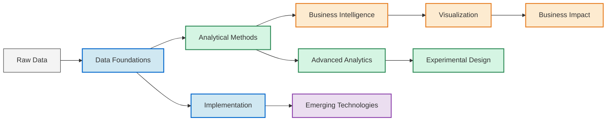

# Data Analysis Mastery

# Comprehensive Enterprise Data Analysis Guide

## 📋 Table of Contents

- [1. Data Analysis Foundations](#1-data-analysis-foundations)
- [2. Analytical Methodologies](#2-analytical-methodologies)
- [3. Business Intelligence & Reporting](#3-business-intelligence--reporting)
- [4. Data Visualization Strategies](#4-data-visualization-strategies)
- [5. Business Analysis & Impact](#5-business-analysis--impact)
- [6. Advanced Analytics Applications](#6-advanced-analytics-applications)
- [7. Experimental Design & Causal Analysis](#7-experimental-design--causal-analysis)
- [8. Enterprise Analytics Implementation](#8-enterprise-analytics-implementation)
- [9. Emerging Technologies & Future Trends](#9-emerging-technologies--future-trends)

---

## 1. Data Analysis Foundations

### 1.1 Statistical Fundamentals

Statistical methods form the backbone of data analysis, enabling organizations to extract meaningful insights from raw data. The application of these methodologies helps establish patterns, validate hypotheses, and make data-driven decisions with measurable confidence.

#### 1.1.1 Descriptive Statistics

Descriptive statistics provide the foundation for understanding and summarizing data distributions within an enterprise context:

- **Central Tendency Measures**: Mean, median, and mode calculations help establish baseline metrics for business KPIs
- **Dispersion Measures**: Standard deviation, variance, range, and interquartile range help identify variability in operational processes
- **Distribution Analysis**: Understanding the shape of data (normal, skewed, bimodal) impacts forecasting accuracy and anomaly detection
- **Percentiles and Quartiles**: Critical for setting performance thresholds and identifying outliers in enterprise reporting

> 💡 **Enterprise Application**: Financial institutions leverage descriptive statistics to establish baseline performance metrics for investment portfolios, enabling risk assessment and performance benchmarking.

#### 1.1.2 Inferential Statistics

Inferential statistics enable enterprises to draw conclusions about populations from sample data:

- **Confidence Intervals**: Establishing ranges for true population parameters with specified probability
- **Statistical Significance**: Determining whether observed differences represent meaningful business impact
- **Effect Size Estimation**: Quantifying the magnitude of relationships for prioritizing business initiatives
- **Power Analysis**: Determining appropriate sample sizes for enterprise research and experimentation

> 💡 **Enterprise Application**: Pharmaceutical companies employ inferential statistics in clinical trials to establish drug efficacy with specified confidence levels, guiding go/no-go decisions for product development.

#### 1.1.3 Probability Distributions

Understanding probability distributions helps model uncertainty in enterprise decision-making:

- **Normal Distribution**: Underpins many business metrics and enables statistical process control
- **Binomial Distribution**: Models success/failure scenarios in conversion events and quality control
- **Poisson Distribution**: Essential for modeling random events like customer arrivals or system failures
- **Exponential Distribution**: Used for time-between-events modeling like customer service wait times
- **Log-normal Distribution**: Common in modeling positively skewed financial metrics

> 💡 **Enterprise Application**: Insurance companies apply probability distributions to model claim frequencies and severities, enabling actuarially sound pricing and risk management.

#### 1.1.4 Hypothesis Testing Framework

Hypothesis testing provides a structured approach to validating business assumptions:

- **Null and Alternative Hypotheses**: Formally stating testable business assumptions
- **Test Statistic Selection**: Choosing appropriate methods (t-tests, chi-square, ANOVA, etc.)
- **p-value Interpretation**: Understanding the probability of observed results given the null hypothesis
- **Type I and Type II Errors**: Balancing false positive and false negative risks in business contexts
- **Multiple Testing Correction**: Adjusting for increased error risk when conducting numerous tests

> 💡 **Enterprise Application**: E-commerce platforms use hypothesis testing to validate whether website changes significantly impact conversion rates before full-scale implementation.

---

### 1.2 Data Quality Management

High-quality data is the foundation of reliable analytics. Enterprises must implement robust frameworks to ensure data integrity throughout the analytical lifecycle.

#### 1.2.1 Data Quality Dimensions

| Dimension | Description | Business Impact |
|-----------|-------------|----------------|
| **Accuracy** | Correctness of data values against known sources of truth | Prevents incorrect business decisions |
| **Completeness** | Presence of all necessary data points for meaningful analysis | Ensures comprehensive insights |
| **Consistency** | Agreement of related data across different systems and datasets | Enables trusted enterprise reporting |
| **Timeliness** | Availability of data within required timeframes for decision-making | Supports responsive business actions |
| **Uniqueness** | Absence of duplicate records that could skew analytical results | Prevents inflated metrics and costs |
| **Validity** | Conformance to defined business rules and domain constraints | Maintains business logic integrity |
| **Integrity** | Maintenance of relationships between related data elements | Preserves analytical context |

#### 1.2.2 Data Quality Frameworks

- **Data Quality Assessment**: Systematic evaluation across quality dimensions
- **Data Profiling**: Examination of data structure, content, and relationships
- **Data Cleansing**: Identification and correction of erroneous or inconsistent data
- **Master Data Management**: Ensuring consistent definitions of key business entities
- **Data Lineage Tracking**: Documenting data origins and transformations
- **Quality Monitoring**: Ongoing measurement of data quality metrics
- **Remediation Processes**: Established protocols for addressing quality issues

> 💡 **Enterprise Application**: Global manufacturers implement enterprise-wide data quality frameworks to ensure product specifications, inventory levels, and supply chain data remain consistent across international operations, preventing costly production errors.

---

### 1.3 Analysis Infrastructure

Robust technical infrastructure enables scalable, secure, and efficient data analysis across the enterprise.

#### 1.3.1 Data Storage Systems

- **Data Warehouses**: Centralized repositories optimized for reporting and analysis
- **Data Lakes**: Flexible storage for diverse structured and unstructured data
- **Data Marts**: Subject-specific analytical datasets for departmental use
- **Operational Data Stores**: Near-real-time data repositories for tactical analysis
- **Cloud vs. On-Premises Solutions**: Considerations for enterprise deployment

#### 1.3.2 Analysis Platforms

- **Statistical Computing Environments**: R, Python, SAS, SPSS
- **Big Data Processing Frameworks**: Hadoop, Spark, Databricks
- **Stream Processing Systems**: Kafka, Flink, Storm
- **SQL and NoSQL Database Systems**: Enterprise considerations for analytical workloads
- **In-Memory Analytics**: Benefits and implementation strategies

#### 1.3.3 Data Integration Infrastructure

- **ETL/ELT Processes**: Extract, transform, load methodologies
- **Data Virtualization**: Unified data access without physical movement
- **API-Based Integration**: Real-time data connectivity
- **Event-Driven Architecture**: Reactive analytical systems
- **Enterprise Service Bus**: Orchestration of analytical data flows

> 💡 **Enterprise Application**: Financial services firms build multi-tier data infrastructures that combine cloud data lakes for historical analysis with on-premises data warehouses for secure, regulatory-compliant reporting.

---

## 2. Analytical Methodologies

### 2.1 Descriptive Analytics

Descriptive analytics answers the question "What happened?" by summarizing historical data to identify patterns and insights.

#### 2.1.1 Time Series Analysis

Time series analysis examines data points collected over time to identify patterns, cycles, and trends:

- **Trend Analysis**: Identifying long-term directional movements
- **Seasonality Detection**: Recognizing regular, calendar-related patterns
- **Cyclical Patterns**: Identifying non-seasonal, economic or business cycles
- **Moving Averages**: Smoothing techniques for trend visualization
- **Exponential Smoothing**: Weighted averaging with greater emphasis on recent data
- **Decomposition Methods**: Separating time series into trend, seasonal, and residual components
- **Autocorrelation Analysis**: Measuring serial dependency in sequential data

> 💡 **Enterprise Application**: Retail corporations analyze multi-year sales data to distinguish between seasonal effects, long-term growth trends, and promotional impacts, enabling more accurate inventory planning and financial forecasting.

#### 2.1.2 Correlation Analysis

Correlation analysis measures the strength and direction of relationships between variables:

- **Pearson Correlation**: Linear relationship between continuous variables
- **Spearman Rank Correlation**: Monotonic relationships without linearity assumption
- **Partial Correlation**: Controlling for effects of additional variables
- **Correlation Matrix Analysis**: Visualizing relationships across multiple variables
- **Correlation vs. Causation**: Understanding limitations in business interpretation

> 💡 **Enterprise Application**: Healthcare providers analyze correlations between patient demographics, treatment protocols, and outcomes to identify factors associated with improved recovery rates, while acknowledging causal inference limitations.

#### 2.1.3 Regression Analysis

Regression modeling quantifies relationships between dependent and independent variables:

- **Simple Linear Regression**: Modeling relationship between two variables
- **Multiple Linear Regression**: Incorporating multiple predictors
- **Polynomial Regression**: Modeling nonlinear relationships
- **Logistic Regression**: Analyzing binary outcomes such as conversion events
- **Regression Diagnostics**: Assessing model assumptions and validity
- **Variable Selection Methods**: Stepwise, lasso, ridge approaches for model optimization
- **Interaction Effects**: Modeling how variables influence each other's impacts

> 💡 **Enterprise Application**: Manufacturing companies use regression analysis to quantify how production factors (temperature, material quality, machine settings) affect product quality metrics, enabling process optimization.

---

### 2.2 Diagnostic Analytics

Diagnostic analytics answers "Why did it happen?" by examining data to identify root causes of events and behaviors.

#### 2.2.1 Root Cause Analysis

- **5-Why Analysis**: Iterative questioning to identify underlying causes
- **Fishbone/Ishikawa Diagrams**: Visualizing causal factors in categories
- **Pareto Analysis**: Identifying the vital few causes driving the majority of effects
- **Fault Tree Analysis**: Logical decomposition of system failures
- **Change Analysis**: Identifying system or process changes preceding issues
- **Barrier Analysis**: Examining failed controls or safeguards

#### 2.2.2 Variance Analysis

- **Planned vs. Actual Comparison**: Quantifying deviations from expectations
- **Contribution Analysis**: Identifying factors driving overall variance
- **Drill-Down Techniques**: Systematic decomposition of aggregate variances
- **Sensitivity Analysis**: Understanding how changes in inputs affect outcomes
- **Cohort Comparison**: Examining performance differences between groups
- **Anomaly Investigation**: Methodologies for exploring outlier causes

> 💡 **Enterprise Application**: Energy utilities perform variance analysis to understand why actual power generation deviates from forecasts, examining weather factors, equipment performance, and consumption patterns to improve prediction models.

---

### 2.3 Predictive Analytics

Predictive analytics answers "What will happen?" by using historical data to forecast future events and behaviors.

#### 2.3.1 Forecasting Methodologies

- **Quantitative vs. Qualitative Approaches**: Statistical vs. expert-judgment methods
- **Time Series Forecasting**: ARIMA, exponential smoothing, and Prophet models
- **Causal Forecasting**: Using explanatory variables to predict outcomes
- **Ensemble Forecasting**: Combining multiple models for improved accuracy
- **Scenario Analysis**: Developing forecasts under different assumptions
- **Forecast Accuracy Metrics**: MAPE, RMSE, MAE for performance evaluation
- **Forecast Horizon Considerations**: Short, medium, and long-term approaches

#### 2.3.2 Machine Learning Approaches

- **Supervised Learning**: Classification and regression techniques
- **Unsupervised Learning**: Clustering and dimension reduction
- **Semi-Supervised Learning**: Leveraging unlabeled data
- **Reinforcement Learning**: Sequential decision optimization
- **Deep Learning Applications**: Neural networks for complex pattern recognition
- **Feature Engineering**: Creating effective predictors from raw data
- **Model Validation**: Cross-validation and holdout testing strategies

> 💡 **Enterprise Application**: Telecommunications companies apply machine learning models to predict customer churn probability based on usage patterns, service interactions, and network quality indicators, enabling proactive retention efforts.

---

### 2.4 Prescriptive Analytics

Prescriptive analytics answers "What should we do?" by recommending actions to achieve desired outcomes.

#### 2.4.1 Optimization Techniques

- **Linear Programming**: Resource allocation under constraints
- **Integer Programming**: Optimization with discrete variables
- **Nonlinear Optimization**: Handling complex objective functions
- **Constrained Optimization**: Balancing multiple business requirements
- **Multi-objective Optimization**: Addressing competing business goals
- **Heuristic Methods**: Practical approaches for complex problems
- **Metaheuristics**: Genetic algorithms, simulated annealing, particle swarm

#### 2.4.2 Simulation Methods

- **Monte Carlo Simulation**: Probabilistic modeling of uncertain outcomes
- **Discrete Event Simulation**: Modeling process flows and queuing
- **Agent-Based Modeling**: Simulating complex interactions between entities
- **System Dynamics**: Modeling feedback loops and time delays
- **Digital Twins**: Virtual replicas of physical assets or processes
- **Scenario Planning**: Testing alternative futures and decision paths

> 💡 **Enterprise Application**: Logistics companies use optimization algorithms to determine optimal delivery routes, vehicle loading, and scheduling, minimizing fuel costs while meeting service-level agreements.

---

## 3. Business Intelligence & Reporting

### 3.1 KPI Framework Development

Effective KPI frameworks translate business strategy into measurable metrics that drive organizational alignment and performance management.

#### 3.1.1 Strategic KPI Design

- **Strategy Alignment**: Connecting metrics to organizational objectives
- **Leading vs. Lagging Indicators**: Balancing predictive and outcome measures
- **SMART Criteria**: Specific, Measurable, Achievable, Relevant, Time-bound
- **KPI Hierarchy**: Cascading metrics across organizational levels
- **Cross-Functional Metrics**: Addressing interdepartmental dependencies
- **Industry Benchmarking**: Contextualizing performance against peers
- **KPI Governance**: Ownership, definition, and change management

#### 3.1.2 Metric Development Methodology

- **Business Driver Analysis**: Identifying key performance levers
- **Metric Definition Process**: Establishing precise calculation methodologies
- **Data Source Mapping**: Connecting metrics to underlying data assets
- **Target Setting Approaches**: Statistical, historical, and aspirational methods
- **Threshold Determination**: Establishing intervention trigger points
- **Segmentation Dimensions**: Breaking down metrics by relevant facets
- **Metric Interdependencies**: Understanding relationships between KPIs

> 💡 **Enterprise Application**: Healthcare systems develop balanced KPI frameworks that measure clinical outcomes, operational efficiency, patient satisfaction, and financial performance, with appropriate metrics cascaded from executive dashboards to departmental scorecards.

---

### 3.2 Enterprise Reporting Systems

Enterprise reporting systems provide the infrastructure to collect, process, and deliver actionable information across the organization.

#### 3.2.1 Reporting Architecture

- **Centralized vs. Federated Models**: Balancing consistency and flexibility
- **Push vs. Pull Distribution**: Scheduled delivery vs. on-demand access
- **Real-Time vs. Periodic Reporting**: Timing considerations for different use cases
- **Semantic Layer Design**: Business-friendly data abstraction
- **Report Cataloging**: Organizing and communicating available insights
- **Security and Access Control**: Ensuring appropriate information access
- **Scalability Considerations**: Supporting enterprise-wide deployment

#### 3.2.2 Report Design Principles

- **Audience-Centric Design**: Tailoring content to user needs and expertise
- **Information Hierarchy**: Organizing from summary to detail
- **Consistent Formatting**: Establishing enterprise standards
- **Exception Highlighting**: Drawing attention to significant deviations
- **Actionable Insights**: Moving beyond data presentation to decision support
- **Mobile Considerations**: Optimizing for multi-device consumption
- **Accessibility Standards**: Ensuring universal information access

> 💡 **Enterprise Application**: Global manufacturers implement multi-tier reporting architectures that provide executive dashboards for strategic oversight, operational reports for daily management, and detailed analytics for process engineers, all drawing from consistent enterprise data sources.

---

### 3.3 Self-Service Analytics

Self-service analytics empowers business users to access, analyze, and visualize data without relying on technical specialists.

#### 3.3.1 Self-Service Implementation Strategy

- **Capability Maturity Model**: Assessing organizational readiness
- **Tool Selection Criteria**: Balancing power and usability
- **Data Preparation Automation**: Simplifying complex transformations
- **Governed Data Access**: Balancing flexibility with control
- **Training and Enablement**: Building organizational capabilities
- **Community Development**: Fostering knowledge sharing and collaboration
- **Support Model**: Balancing self-sufficiency with expert assistance

#### 3.3.2 Data Democratization Approach

- **Data Literacy Programs**: Building organizational capabilities
- **Business Glossary Development**: Establishing common definitions
- **Curated Data Sets**: Pre-built views for common analysis needs
- **Analysis Templates**: Reusable starting points for business users
- **Quality Certification**: Indicating trusted data sources
- **Insight Sharing Platforms**: Promoting collaboration and reuse
- **Data Storytelling Culture**: Encouraging narrative-driven analysis

> 💡 **Enterprise Application**: Financial services firms implement tiered self-service analytics platforms where power users create advanced models using governed datasets, while business users access pre-built dashboards with guided exploration capabilities, all within a consistent security framework.

---

## 4. Data Visualization Strategies

### 4.1 Visualization Principles

Effective data visualization transforms complex information into intuitive visual insights that drive understanding and action.

#### 4.1.1 Visual Perception Fundamentals

- **Preattentive Processing**: Leveraging automatic visual perception
- **Gestalt Principles**: Understanding how visual elements are perceived together
- **Color Theory**: Strategic use of color for information encoding
- **Chart Junk Elimination**: Removing non-data ink and distractions
- **Cognitive Load Management**: Simplifying visual complexity
- **Human Working Memory Limitations**: Designing within cognitive constraints
- **Accessibility Considerations**: Ensuring universal information access

#### 4.1.2 Chart Selection Framework

| Data Relationship | Recommended Visualizations | Key Considerations |
|-------------------|----------------------------|-------------------|
| **Relationships** | Scatter plots, bubble charts, network diagrams | Correlation strength, multiple dimensions |
| **Comparisons** | Bar charts, column charts, radar charts | Baseline consistency, order, scale |
| **Composition** | Pie charts, stacked bars, treemaps | Part-to-whole relationships, proportions |
| **Distribution** | Histograms, box plots, violin plots | Shape, outliers, central tendency |
| **Trends** | Line charts, area charts, spark lines | Time intervals, seasonality, smoothing |
| **Spatial** | Maps, cartograms, heat maps | Geographic context, data density |
| **Multi-Dimensional** | Small multiples, parallel coordinates | Variable relationships, pattern discovery |

> 💡 **Enterprise Application**: Investment management firms use carefully designed dashboard visualizations that combine performance trend charts with distribution plots showing risk characteristics, enabling portfolio managers to quickly assess both returns and exposures.

---

### 4.2 Enterprise Visualization Tools

Selecting and implementing the right visualization technologies enables consistent, scalable, and effective visual analytics across the organization.

#### 4.2.1 Visualization Tool Comparison

| Tool | Enterprise Integration | Customization | Self-Service | Scalability | Governance | Mobile | Cost Structure |
|------|------------------------|---------------|--------------|-------------|------------|--------|----------------|
| **Tableau** | Strong | Moderate | Excellent | Good | Moderate | Good | Per-user licensing |
| **Power BI** | Excellent (Microsoft) | Moderate | Good | Very good | Strong | Good | Per-user with Premium options |
| **Qlik** | Good | Strong | Very good | Good | Good | Good | Token-based/per-user |
| **Looker** | Excellent | Strong | Moderate | Excellent | Excellent | Moderate | Platform-based |
| **D3.js** | Limited | Unlimited | Poor | Varies | Limited | Varies | Open source |
| **Python (Plotly/Dash)** | Good | Excellent | Limited | Excellent | Limited | Moderate | Open source with enterprise options |

#### 4.2.2 Implementation Considerations

- **Integration with Data Sources**: Connectivity to enterprise data systems
- **Performance Optimization**: Handling large datasets effectively
- **Deployment Models**: Cloud, on-premises, and hybrid approaches
- **Embedding Capabilities**: Integrating visualizations into applications
- **Governance Framework**: Certification and content management
- **Administrative Requirements**: Maintaining enterprise deployments
- **Total Cost of Ownership**: Beyond licensing to include support and infrastructure

> 💡 **Enterprise Application**: Global consulting firms establish visualization centers of excellence that evaluate tools against enterprise requirements, develop implementation roadmaps, and create governance frameworks for consistent deployment across business units.

---

### 4.3 Storytelling with Data

Data storytelling combines narrative, context, and visualization to transform insights into compelling, action-oriented business communications.

#### 4.3.1 Narrative Structure

- **Audience Analysis**: Understanding information needs and preferences
- **Context Setting**: Establishing relevance and importance
- **Narrative Arc**: Building logical flow from problem to solution
- **Strategic Sequencing**: Ordering information for maximum impact
- **Cognitive Signposting**: Guiding audience through complex information
- **Call to Action**: Driving decisions and next steps
- **Feedback Integration**: Refining based on audience response

#### 4.3.2 Presentation Techniques

- **Executive Summaries**: Distilling key insights for leadership
- **Annotation Strategies**: Highlighting and explaining key findings
- **Progressive Disclosure**: Revealing information at appropriate pace
- **Interactivity Planning**: Designing for audience exploration
- **Scenario Presentation**: Comparing alternative outcomes
- **Multi-channel Delivery**: Adapting stories for different mediums
- **Narrative Visualization**: Combining text and visuals effectively

> 💡 **Enterprise Application**: Pharmaceutical market research teams develop data stories that combine patient journey visualizations with treatment outcome metrics and voice-of-customer insights, enabling cross-functional alignment on product development priorities.

---

## 5. Business Analysis & Impact

### 5.1 Requirements Engineering

Effective requirements engineering ensures that analytical solutions address genuine business needs and deliver measurable value.

#### 5.1.1 Business Analysis Frameworks

- **BABOK (Business Analysis Body of Knowledge)**: Comprehensive methodology
- **Agile Business Analysis**: Iterative requirements discovery
- **Design Thinking**: Human-centered problem definition
- **Six Sigma/DMAIC**: Process-focused requirements
- **Job-To-Be-Done Framework**: Outcome-centered analysis
- **Value Stream Mapping**: End-to-end process optimization
- **Systems Thinking**: Holistic problem analysis

#### 5.1.2 Requirements Elicitation Techniques

- **Stakeholder Interviews**: Direct dialogue with key business users
- **Observation Methods**: Watching actual work processes
- **Workshop Facilitation**: Collaborative requirements gathering
- **Survey Design**: Efficient broad-based input collection
- **Prototyping**: Iterative concept visualization
- **Document Analysis**: Reviewing existing procedural materials
- **Competitive Benchmarking**: Understanding industry best practices

> 💡 **Enterprise Application**: Insurance companies employ structured business analysis methodologies when developing underwriting analytics platforms, ensuring solutions address actuarial requirements, operational workflows, and regulatory compliance needs.

---

### 5.2 Business Process Analysis

Business process analysis examines organizational workflows to identify improvement opportunities and analytical intervention points.

#### 5.2.1 Process Modeling Approaches

- **BPMN (Business Process Model and Notation)**: Standardized visualization
- **Swimlane Diagrams**: Role-based process mapping
- **Value Stream Mapping**: Identifying waste and constraints
- **SIPOC (Supplier, Input, Process, Output, Customer)**: End-to-end perspective
- **Process Hierarchy Modeling**: Connecting strategic to operational processes
- **Decision Modeling**: Formalizing business rules and logic
- **Simulation Modeling**: Dynamic process performance testing

#### 5.2.2 Process Optimization Methods

- **Lean Analysis**: Eliminating non-value-adding activities
- **Six Sigma**: Reducing variation and defects
- **Theory of Constraints**: Identifying and addressing bottlenecks
- **Business Process Reengineering**: Radical process redesign
- **Process Mining**: Data-driven process discovery and analysis
- **Operational Excellence**: Continuous improvement frameworks
- **Robotic Process Automation**: Task automation opportunities

> 💡 **Enterprise Application**: Banking institutions map customer onboarding processes across channels to identify friction points, compliance risks, and automation opportunities, then develop analytics solutions to monitor process performance and predict bottlenecks.

---

### 5.3 Value Measurement

Quantifying the business impact of analytical initiatives ensures appropriate investment and supports continuous improvement.

#### 5.3.1 ROI Frameworks

- **Cost-Benefit Analysis**: Comprehensive evaluation of financial returns
- **NPV (Net Present Value)**: Time-adjusted return calculation
- **Payback Period**: Time to recoup investment
- **IRR (Internal Rate of Return)**: Percentage return on investment
- **Economic Value Added**: Impact on overall business performance
- **Opportunity Cost Assessment**: Comparing alternative investments
- **Sensitivity Analysis**: Testing ROI under different assumptions

#### 5.3.2 Impact Measurement Methodologies

- **Before/After Comparison**: Direct measurement of change
- **Control Group Design**: Isolating initiative impact
- **Regression Discontinuity**: Measuring effects at implementation boundary
- **Key Value Indicators**: Connecting analytics to business value
- **Balanced Scorecard**: Multi-dimensional impact assessment
- **Attribution Modeling**: Assigning credit for business outcomes
- **Counterfactual Analysis**: Estimating what would have happened without intervention

> 💡 **Enterprise Application**: Retail corporations implement structured measurement frameworks for analytical initiatives, tracking both direct financial impacts (revenue lift, cost reduction) and indirect benefits (improved decision speed, risk reduction) to guide investment prioritization.

---

## 6. Advanced Analytics Applications

### 6.1 Customer Analytics

Customer analytics applies data-driven insights to enhance customer understanding, improve experiences, and optimize relationship value.

#### 6.1.1 Customer Segmentation Approaches

- **RFM (Recency, Frequency, Monetary) Analysis**: Behavioral segmentation
- **Demographic Segmentation**: Characteristic-based customer grouping
- **Psychographic Segmentation**: Attitude and lifestyle-based grouping
- **Behavioral Segmentation**: Action-based customer differentiation
- **Value-Based Segmentation**: Grouping by current and potential value
- **Needs-Based Segmentation**: Differentiation by customer requirements
- **Cluster Analysis Techniques**: Algorithmic customer grouping

#### 6.1.2 Customer Journey Analytics

- **Touchpoint Mapping**: Documenting customer interactions
- **Path Analysis**: Identifying common journeys and friction points
- **Channel Preference Analysis**: Understanding engagement preferences
- **Moment of Truth Identification**: Critical experience points
- **Sentiment Analysis**: Extracting emotional context from interactions
- **Experience Gap Analysis**: Differences between expected and actual experiences
- **Journey Orchestration**: Analytics-driven experience optimization

> 💡 **Enterprise Application**: Telecommunications providers develop integrated customer analytics platforms that combine segmentation models with journey analytics to personalize service experiences, predict needs, and optimize contact strategies across channels.

---

### 6.2 Operational Analytics

Operational analytics applies data-driven insights to improve business processes, resource utilization, and operational performance.

#### 6.2.1 Supply Chain Analytics

- **Demand Forecasting**: Predicting future resource requirements
- **Inventory Optimization**: Balancing stock levels against service levels
- **Network Design Analysis**: Optimizing facility locations and flows
- **Supplier Performance Analytics**: Monitoring and improving vendor relationships
- **Transportation Analytics**: Route optimization and mode selection
- **Risk Analytics**: Identifying and mitigating supply chain vulnerabilities
- **Sustainability Analytics**: Environmental impact measurement and improvement

#### 6.2.2 Workforce Analytics

- **Capacity Planning**: Aligning staffing with business demands
- **Skills Gap Analysis**: Identifying capability shortfalls
- **Productivity Analytics**: Measuring and improving output efficiency
- **Turnover Analysis**: Understanding and addressing retention challenges
- **Succession Planning**: Data-driven leadership pipeline development
- **Engagement Analytics**: Measuring and improving workforce satisfaction
- **Workforce Cost Optimization**: Balancing expenses against capabilities

> 💡 **Enterprise Application**: Manufacturing companies implement operational analytics platforms that integrate production data, quality metrics, maintenance records, and workforce information to optimize throughput, minimize downtime, and reduce defects through predictive intervention.

---

### 6.3 Financial Analytics

Financial analytics applies data-driven insights to optimize resource allocation, manage risk, and enhance financial performance.

#### 6.3.1 Financial Performance Analysis

- **Profitability Analysis**: Understanding earnings drivers
- **Cost Structure Analysis**: Examining expense composition and trends
- **Working Capital Analytics**: Optimizing cash conversion cycle
- **Capital Allocation Analysis**: Prioritizing investment opportunities
- **Scenario Modeling**: Testing financial outcomes under different conditions
- **Variance Analysis**: Understanding deviations from financial plans
- **Benchmarking**: Comparing performance against industry standards

#### 6.3.2 Risk Analytics

- **Credit Risk Modeling**: Predicting default probability
- **Market Risk Analysis**: Measuring exposure to market movements
- **Operational Risk Analytics**: Quantifying process and system risks
- **Compliance Risk Assessment**: Monitoring regulatory adherence
- **Fraud Detection**: Identifying suspicious patterns and activities
- **Stress Testing**: Evaluating performance under adverse conditions
- **Portfolio Optimization**: Balancing risk and return across investments

> 💡 **Enterprise Application**: Investment management firms deploy integrated financial analytics platforms that combine performance attribution models with risk analytics to optimize portfolio construction, monitor exposures, and generate client-facing performance insights.

---

### 6.4 Marketing Analytics

Marketing analytics applies data-driven insights to optimize campaign performance, channel strategy, and marketing return on investment.

#### 6.4.1 Campaign Performance Analytics

- **Attribution Modeling**: Assigning credit across touchpoints
- **Conversion Funnel Analysis**: Identifying drop-off points
- **A/B Testing Framework**: Systematic campaign optimization
- **Content Performance Analysis**: Measuring engagement and outcomes
- **Audience Response Modeling**: Predicting campaign effectiveness
- **Cross-Channel Effectiveness**: Understanding interaction effects
- **Marketing Mix Modeling**: Optimizing resource allocation

#### 6.4.2 Customer Acquisition and Retention

- **Customer Lifetime Value Modeling**: Projecting relationship economics
- **Acquisition Cost Analysis**: Optimizing customer acquisition investment
- **Churn Prediction**: Identifying at-risk relationships
- **Win-Back Analysis**: Targeting and converting former customers
- **Loyalty Driver Analysis**: Understanding retention factors
- **Share of Wallet Analysis**: Identifying expansion opportunities
- **Next Best Action Modeling**: Optimizing relationship development

> 💡 **Enterprise Application**: E-commerce companies implement marketing analytics platforms that integrate acquisition metrics, on-site behavior, purchase patterns, and post-sale engagement to optimize campaign targeting, personalize customer experiences, and maximize lifetime value.

---

## 7. Experimental Design & Causal Analysis

### 7.1 A/B Testing Framework

A/B testing enables organizations to make data-driven decisions by systematically comparing alternatives through controlled experiments.

#### 7.1.1 Experimental Design Principles

- **Hypothesis Formulation**: Developing testable business assumptions
- **Randomization Methods**: Ensuring unbiased group assignment
- **Sample Size Determination**: Achieving adequate statistical power
- **Control Group Design**: Establishing appropriate baselines
- **Factorial Design**: Testing multiple variables simultaneously
- **Blocking and Stratification**: Controlling for known variation sources
- **Crossover Design**: Testing with subjects as their own controls

#### 7.1.2 Implementation Methodology

- **Test Duration Planning**: Balancing speed against seasonal effects
- **Stopping Rules**: Determining when to conclude experiments
- **Sequential Testing**: Efficiently allocating experimental resources
- **Guardrail Metrics**: Monitoring for unexpected negative impacts
- **Statistical Analysis Methods**: Appropriate significance testing
- **Result Communication**: Translating findings into business insights
- **Implementation Planning**: Scaling successful experiments

> 💡 **Enterprise Application**: Technology companies establish experimentation platforms that enable product teams to systematically test user interface changes, feature introductions, and pricing models with statistically rigorous methods and centralized learning repositories.

---

### 7.2 Multivariate Testing

Multivariate testing extends beyond simple A/B comparisons to evaluate complex combinations of variables simultaneously.

#### 7.2.1 Multivariate Design Approaches

- **Full Factorial Design**: Testing all possible combinations
- **Fractional Factorial**: Testing selected combinations efficiently
- **Taguchi Methods**: Optimizing for robustness
- **Response Surface Methodology**: Mapping variable relationships
- **ANOVA-Based Design**: Analyzing variance components
- **Latin Square Design**: Controlling for row and column effects
- **Conjoint Analysis**: Determining feature preference combinations

#### 7.2.2 Multivariate Analysis Techniques

- **Main Effects Analysis**: Isolating individual variable impacts
- **Interaction Effect Analysis**: Identifying combination effects
- **MANOVA (Multivariate Analysis of Variance)**: Multiple dependent variables
- **Principal Component Analysis**: Dimensionality reduction
- **Factor Analysis**: Identifying underlying variable structures
- **Canonical Correlation**: Analyzing relationships between variable sets
- **Structural Equation Modeling**: Testing complex causal structures

> 💡 **Enterprise Application**: Consumer packaged goods companies use multivariate testing to optimize product formulations, packaging designs, and marketing messages simultaneously, efficiently identifying optimal combinations that maximize consumer preference and purchase intent.

---

### 7.3 Causal Inference Methods

Causal inference techniques help organizations move beyond correlation to establish true cause-and-effect relationships for more effective interventions.

#### 7.3.1 Quasi-Experimental Methods

- **Difference-in-Differences**: Comparing before/after changes across groups
- **Regression Discontinuity**: Analyzing effects at eligibility thresholds
- **Instrumental Variables**: Using proxy factors to isolate causal effects
- **Propensity Score Matching**: Creating comparable treatment/control groups
- **Synthetic Control Methods**: Constructing artificial comparison groups
- **Interrupted Time Series**: Analyzing trend changes after interventions
- **Panel Data Methods**: Leveraging repeated observations over time

#### 7.3.2 Causal Modeling Approaches

- **Structural Causal Models**: Formal representations of causal relationships
- **Directed Acyclic Graphs**: Visualizing causal structures
- **Mediation Analysis**: Understanding causal mechanisms
- **Moderation Analysis**: Identifying contextual effects on causality
- **Bayesian Networks**: Probabilistic causal modeling
- **Counterfactual Analysis**: Estimating unobserved outcomes
- **Causal Machine Learning**: Combining predictive and causal approaches

> 💡 **Enterprise Application**: Healthcare organizations apply causal inference methods to evaluate treatment effectiveness in real-world settings where randomized trials aren't feasible, controlling for selection bias and confounding factors to guide clinical protocol development.

---

## 8. Enterprise Analytics Implementation

### 8.1 Data Governance

Data governance provides the framework to ensure analytics assets are accurate, secure, compliant, and strategically aligned.

#### 8.1.1 Governance Framework Components

- **Data Ownership**: Establishing accountability for data assets
- **Policy Development**: Creating standards and guidelines
- **Metadata Management**: Documenting data characteristics and lineage
- **Data Classification**: Categorizing information by sensitivity and value
- **Quality Management**: Ensuring analytical integrity
- **Security and Privacy**: Protecting sensitive information
- **Compliance Management**: Meeting regulatory requirements

#### 8.1.2 Governance Operating Model

- **Steering Committee Structure**: Executive oversight and direction
- **Data Stewardship Program**: Domain-level data management
- **Center of Excellence**: Specialized expertise and guidance
- **Community of Practice**: Knowledge sharing and collaboration
- **Change Management Process**: Controlled evolution of standards
- **Training and Awareness**: Building organizational capabilities
- **Monitoring and Audit**: Ensuring ongoing compliance

> 💡 **Enterprise Application**: Financial institutions implement comprehensive data governance frameworks that establish clear ownership of critical data domains, enforce regulatory compliance, maintain data quality standards, and provide controlled access to analytical assets across the organization.

---

### 8.2 Analytics Operating Model

The analytics operating model defines how analytical capabilities are organized, resourced, and managed to deliver business value.

#### 8.2.1 Organizational Structure Options

| Model | Description | Best For | Challenges |
|-------|-------------|----------|------------|
| **Centralized** | Consolidated analytics function | Consistency, specialized skills | Business alignment |
| **Decentralized** | Embedded within business units | Business relevance, speed | Duplication, inconsistency |
| **Federated** | Hub-and-spoke approach | Balance of specialization and alignment | Governance complexity |
| **Center of Excellence** | Specialized enterprise resource | Advanced capabilities, standards | Business adoption |
| **Community of Practice** | Cross-functional collaboration | Knowledge sharing, innovation | Operational execution |
| **Analytics as a Service** | Internal consultancy model | Flexibility, clear metrics | Resource prioritization |
| **Outsourcing** | External resource utilization | Specialized capabilities, scalability | Knowledge retention |

#### 8.2.2 Capability Development

- **Skills Assessment**: Identifying organizational gaps
- **Career Path Design**: Attracting and retaining talent
- **Training Program Development**: Building internal capabilities
- **Technology Stack Strategy**: Aligning tools with business needs
- **Process Standardization**: Establishing consistent methodologies
- **Knowledge Management**: Capturing and sharing expertise
- **Performance Measurement**: Evaluating analytical effectiveness

> 💡 **Enterprise Application**: Global consumer goods companies implement federated analytics operating models that combine centers of excellence for specialized capabilities (advanced statistics, machine learning) with embedded analysts in key business functions, supported by enterprise platforms and governance frameworks.

---

### 8.3 Change Management

Effective change management ensures that analytical innovations are successfully adopted and deliver sustained business value.

#### 8.3.1 Stakeholder Management

- **Stakeholder Mapping**: Identifying key influencers and decision-makers
- **Engagement Planning**: Tailored communication strategies
- **Resistance Management**: Addressing concerns and objections
- **Executive Sponsorship**: Securing leadership support
- **Change Champion Networks**: Developing organizational advocates
- **Feedback Mechanisms**: Continuous improvement based on input
- **Success Celebration**: Recognizing achievements and adoption

#### 8.3.2 Implementation Strategies

- **Readiness Assessment**: Evaluating organizational preparation
- **Pilot Approaches**: Controlled initial deployment
- **Phased Implementation**: Staged rollout strategies
- **Training and Support**: Ensuring user capability
- **Communication Planning**: Maintaining awareness and engagement
- **Adoption Monitoring**: Tracking usage and satisfaction
- **Benefit Realization**: Measuring and communicating value

> 💡 **Enterprise Application**: Healthcare systems implement structured change management programs when deploying clinical analytics platforms, addressing physician concerns, demonstrating tangible benefits in patient outcomes, and providing specialized training to different user groups.

---

## 9. Emerging Technologies & Future Trends

### 9.1 AI-Augmented Analytics

Artificial intelligence is transforming analytics by automating complex tasks, surfacing hidden insights, and enabling natural language interaction with data.

#### 9.1.1 Machine Learning Automation

- **Automated Feature Engineering**: Algorithmic feature discovery and selection
- **AutoML Platforms**: Streamlined model development and deployment
- **Hyperparameter Optimization**: Automated model tuning
- **Anomaly Detection**: Intelligent identification of data irregularities
- **Pattern Recognition**: Discovering complex relationships at scale
- **Transfer Learning**: Leveraging pre-trained models for new applications
- **Reinforcement Learning**: Self-improving analytical systems

#### 9.1.2 Natural Language in Analytics

- **NLP for Data Preparation**: Text-based data transformation
- **Natural Language Querying**: Conversational data interaction
- **Automated Insight Generation**: AI-driven finding discovery
- **Natural Language Generation**: Automated narrative creation
- **Sentiment Analysis**: Extracting meaning from unstructured feedback
- **Voice Analytics**: Speech-based data interaction
- **Multimodal Analytics**: Combining text, voice, and visual interfaces

> 💡 **Enterprise Application**: Financial services firms deploy AI-augmented analytics platforms that enable business users to interact with complex data through natural language queries, automatically generate insights from financial patterns, and receive narrative explanations of performance drivers.

---

### 9.2 Real-Time Analytics

Real-time analytics processes data as it's created, enabling immediate insight generation and action for time-sensitive business contexts.

#### 9.2.1 Streaming Analytics Architecture

- **Event Processing Systems**: Real-time data handling
- **In-Memory Computing**: High-speed analytical processing
- **Edge Analytics**: Distributed processing at data sources
- **Lambda and Kappa Architectures**: Combined batch/streaming approaches
- **Time-Window Analysis**: Rolling period calculations
- **Complex Event Processing**: Pattern detection in event streams
- **Continuous Query Processing**: Persistent analytical operations

#### 9.2.2 Operational Applications

- **Real-Time Dashboarding**: Live business monitoring
- **Algorithmic Decision-Making**: Automated response to events
- **Predictive Maintenance**: Just-in-time intervention
- **Fraud Detection**: Immediate identification of suspicious activity
- **Dynamic Pricing**: Real-time market-responsive pricing
- **Supply Chain Visibility**: Live inventory and logistics tracking
- **Customer Experience Personalization**: Contextual interaction adaptation

> 💡 **Enterprise Application**: E-commerce platforms implement real-time analytics systems that process customer browsing behavior, inventory levels, competitive pricing, and historical purchase patterns to dynamically adjust product recommendations, promotions, and pricing within milliseconds of user interactions.

---

### 9.3 Decision Intelligence

Decision intelligence combines data science with decision theory to improve the quality, speed, and consistency of complex business decisions.

#### 9.3.1 Decision Modeling Frameworks

- **Decision Trees and Influence Diagrams**: Structured decision visualization
- **Bayesian Decision Networks**: Probabilistic decision modeling
- **Multi-Criteria Decision Analysis**: Balancing competing objectives
- **Decision Support Systems**: Interactive decision guidance
- **Cognitive Bias Mitigation**: Addressing systematic decision errors
- **Game Theory Applications**: Strategic interaction modeling
- **Group Decision Making**: Collaborative decision frameworks

#### 9.3.2 Augmented Decision-Making

- **Recommendation Systems**: AI-driven option suggestions
- **Decision Automation**: Rules-based choice execution
- **Human-AI Collaboration**: Combined decision approaches
- **Explainable AI**: Transparent reasoning processes
- **Decision Confidence Scoring**: Uncertainty quantification
- **Ethical Decision Frameworks**: Value-aligned choice architecture
- **Decision Outcome Tracking**: Closed-loop learning systems

> 💡 **Enterprise Application**: Insurance underwriting departments implement decision intelligence platforms that combine predictive risk models with explicit business rules, regulatory constraints, and market strategy to provide consistent, explainable, and optimal policy pricing decisions across distributed teams.

---

## Conclusion

This comprehensive guide has explored the multifaceted landscape of enterprise data analysis, from fundamental statistical concepts to emerging technologies that are reshaping the field. Organizations that systematically develop these capabilities create sustainable competitive advantages through more informed decisions, optimized processes, and enhanced customer experiences.

The modern data-driven enterprise requires not only technical proficiency but also strategic alignment, strong governance, and effective change management to realize the full potential of analytical investments. By developing a balanced portfolio of descriptive, diagnostic, predictive, and prescriptive capabilities, organizations can address both operational needs and strategic opportunities.

As artificial intelligence, real-time analytics, and decision intelligence continue to evolve, enterprises must maintain a forward-looking perspective while ensuring that foundational capabilities are robust and well-governed. The most successful organizations will be those that combine analytical rigor with business context, creating insights that are not only statistically valid but also practically valuable and actionable.

---