---

## 📋 Table of Contents

1. [Introduction to Data Engineering](#introduction-to-data-engineering)
2. [Data Integration](#data-integration)
3. [Data Pipeline Orchestration](#data-pipeline-orchestration)
4. [Big Data Processing](#big-data-processing)
5. [Cloud Data Technologies](#cloud-data-technologies)
6. [Data Architecture](#data-architecture)
7. [Data Modeling and Storage](#data-modeling-and-storage)
8. [Data Quality and Governance](#data-quality-and-governance)
9. [Data Security and Compliance](#data-security-and-compliance)
10. [Modern Data Stack and Emerging Trends](#modern-data-stack-and-emerging-trends)

---

## Introduction to Data Engineering

Data Engineering forms the foundation of modern data-driven enterprises, encompassing the development, implementation, and maintenance of systems and processes for transforming raw data into actionable insights. It sits at the intersection of software engineering and data science, providing the infrastructure that enables organizations to harness the full potential of their data assets.

### Core Responsibilities of Data Engineers

- **Data Pipeline Development**: Building robust systems to collect, process, and deliver data
- **Infrastructure Management**: Maintaining the underlying technology stack
- **Performance Optimization**: Ensuring data systems operate efficiently at scale
- **Data Accessibility**: Making data available to stakeholders while maintaining security
- **Tool Selection**: Evaluating and implementing appropriate technologies

---

### Evolution of Data Engineering

| Era | Focus | Key Technologies | Enterprise Impact |
|:---:|:------|:-----------------|:------------------|
| **Traditional** (Pre-2010) | Batch-oriented ETL | Oracle, Informatica, IBM DataStage | Centralized data warehousing |
| **Big Data** (2010-2015) | Distributed processing | Hadoop, MapReduce, Hive | Data lakes, semi-structured data |
| **Cloud & Streaming** (2015-2020) | Real-time processing, cloud migration | Spark, Kafka, AWS/Azure/GCP | Hybrid architectures, faster insights |
| **Modern** (2020-Present) | Automation, self-service, data mesh | dbt, Airflow, Databricks, Snowflake | Decentralized ownership, DataOps |

---

## Data Integration

Data integration encompasses the processes and technologies used to combine data from disparate sources into unified views for business intelligence and analytics purposes. Enterprise data integration strategies must balance performance, cost, and governance requirements.

### ETL vs. ELT Methodologies

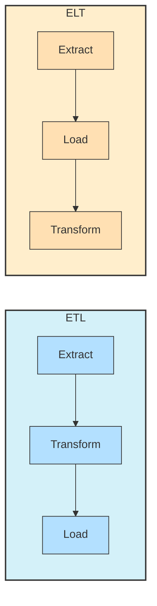

#### **ETL (Extract, Transform, Load)**

- **Process Flow**: Data is extracted from source systems, transformed in a staging area, then loaded into a target system
- **Transformation Timing**: Occurs before loading into the target system
- **Infrastructure Requirements**: Separate transformation server or service
- **Best Suited For**: Complex transformations, limited target system compute resources, strict data quality requirements
- **Enterprise Considerations**: Higher initial development time, more control over transformation logic

#### **ELT (Extract, Load, Transform)**

- **Process Flow**: Data is extracted from source systems, loaded into the target system, then transformed within the target system
- **Transformation Timing**: Occurs after loading into the target system
- **Infrastructure Requirements**: Powerful target system with transformation capabilities
- **Best Suited For**: Cloud data warehouses, exploratory analytics, agile development
- **Enterprise Considerations**: Faster time-to-insight, higher compute costs in the data warehouse

#### **Comparison Matrix**

| Factor | ETL | ELT |
|:------:|:---:|:---:|
| **Development Speed** | ⏱ Slower | ⚡ Faster |
| **Maintenance Complexity** | 🔧 Higher | 🛠 Lower |
| **Data Warehouse Costs** | 💰 Lower | 💸 Higher |
| **Source System Impact** | ⚠️ Higher | ✅ Lower |
| **Transformation Flexibility** | 📊 Limited by staging area | 📈 Leverages data warehouse capabilities |
| **Data Lineage** | 🧩 Potentially complex | 🧬 Generally clearer |
| **Preferred Enterprise Tools** | Informatica, IBM DataStage, SSIS | Snowflake, BigQuery, Fivetran + dbt |

---

### Change Data Capture Techniques

Change Data Capture (CDC) identifies and tracks changes to data in source systems to ensure efficient synchronization with target systems without full data reloads.

#### **Database Log-Based CDC**

- **Methodology**: Reads database transaction logs to capture changes
- **Advantages**: Low impact on source systems, captures all changes
- **Enterprise Tools**: Debezium, Oracle GoldenGate, AWS DMS, Qlik Replicate
- **Implementation Considerations**: Requires database log access, potential security concerns

#### **Query-Based CDC**

- **Methodology**: Uses queries with timestamps or version columns to identify changes
- **Advantages**: Works with any database, simpler implementation
- **Enterprise Tools**: Fivetran, Talend, Airbyte
- **Implementation Considerations**: May miss changes between polling intervals, higher source system impact

#### **Trigger-Based CDC**

- **Methodology**: Database triggers record changes to tracking tables
- **Advantages**: Works without log access, captures exact changes
- **Enterprise Tools**: Custom implementations, some ETL platforms
- **Implementation Considerations**: Performance impact on source systems, maintenance overhead

> 💡 **CDC Implementation Best Practices**
> 
> - Maintain change metadata (operation type, timestamp, source)
> - Implement error handling and recovery mechanisms
> - Consider data consistency requirements across systems
> - Plan for schema evolution

---

### Data Synchronization Patterns

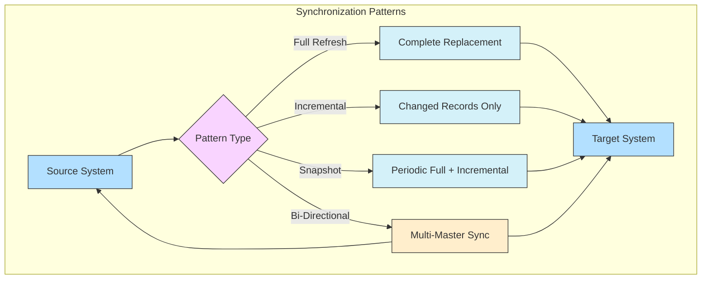

#### **Full Refresh Synchronization**

- **Pattern**: Complete replacement of target data
- **Use Cases**: Small datasets, infrequent changes, simple implementation requirements
- **Enterprise Considerations**: Resource-intensive, potential downtime

#### **Incremental Synchronization**

- **Pattern**: Transferring only new or changed records
- **Use Cases**: Large datasets, frequent updates, minimal transfer windows
- **Enterprise Considerations**: Requires change tracking mechanism, potential for drift

#### **Snapshot-Based Synchronization**

- **Pattern**: Periodic complete copies with incremental updates between snapshots
- **Use Cases**: When both consistency and efficiency are priorities
- **Enterprise Considerations**: Balance between full refresh and incremental approaches

#### **Bi-Directional Synchronization**

- **Pattern**: Changes flow in both directions between systems
- **Use Cases**: Multi-master architectures, distributed systems
- **Enterprise Considerations**: Complex conflict resolution, consistency challenges

---

### API Integration Approaches

#### **REST API Integration**

- **Methodology**: HTTP-based API calls with standardized methods (GET, POST, etc.)
- **Enterprise Tools**: MuleSoft, Apigee, custom implementations
- **Implementation Considerations**: Rate limiting, pagination, authentication

#### **GraphQL Integration**

- **Methodology**: Query language allowing clients to request exactly what they need
- **Enterprise Tools**: Apollo, Hasura, AWS AppSync
- **Implementation Considerations**: Schema design, resolvers, performance optimization

#### **Event-Driven Integration**

- **Methodology**: Systems communicate through events via message brokers
- **Enterprise Tools**: Kafka, RabbitMQ, AWS EventBridge
- **Implementation Considerations**: Event schema management, ordering, delivery guarantees

#### **Webhook Integration**

- **Methodology**: HTTP callbacks triggered by specific events
- **Enterprise Tools**: Custom implementations, Zapier, n8n
- **Implementation Considerations**: Retry logic, authentication, payload validation

> 📋 **Enterprise API Integration Best Practices**
> 
> - Implement comprehensive error handling and retry mechanisms
> - Develop consistent authentication and authorization approaches
> - Create monitoring for API availability and performance
> - Establish data transformation patterns for inconsistent APIs

---

### Web Scraping Methods

#### **HTML Parsing**

- **Methodology**: Extracting data from HTML using DOM manipulation
- **Enterprise Tools**: Beautiful Soup (Python), Jsoup (Java), Cheerio (Node.js)
- **Implementation Considerations**: Site structure changes, content variation

#### **Headless Browsers**

- **Methodology**: Automated browser that renders JavaScript before extraction
- **Enterprise Tools**: Puppeteer, Selenium, Playwright
- **Implementation Considerations**: Resource-intensive, complex setup

#### **API Extraction**

- **Methodology**: Using undocumented APIs that power websites
- **Enterprise Tools**: Custom implementations, API development tools
- **Implementation Considerations**: API changes, detection prevention

> ⚠️ **Enterprise Web Scraping Considerations**
> 
> - Legal and ethical implications (terms of service, robots.txt)
> - IP rotation and request throttling
> - Data quality validation
> - Maintenance due to frequent site changes

---

### Real-time vs. Batch Processing

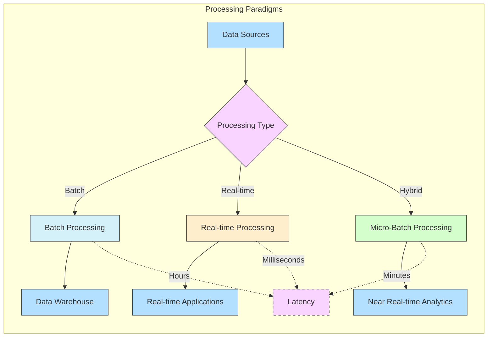

#### **Batch Processing**

- **Methodology**: Processing data in scheduled, finite groups
- **Latency**: Minutes to hours
- **Enterprise Tools**: Apache Spark, AWS Glue, Azure Data Factory
- **Use Cases**: Regular reporting, historical analysis, complex transformations
- **Enterprise Considerations**: Simpler implementation, well-established patterns

#### **Real-time Processing**

- **Methodology**: Processing data as it arrives with minimal delay
- **Latency**: Milliseconds to seconds
- **Enterprise Tools**: Apache Kafka Streams, Apache Flink, Spark Streaming
- **Use Cases**: Fraud detection, monitoring, recommendation engines
- **Enterprise Considerations**: Higher complexity, increased infrastructure requirements

#### **Micro-Batch Processing**

- **Methodology**: Processing small batches at short intervals
- **Latency**: Seconds to minutes
- **Enterprise Tools**: Structured Streaming in Spark, AWS Kinesis
- **Use Cases**: Near real-time analytics, compromise between latency and throughput
- **Enterprise Considerations**: Balance of complexity and resource utilization

#### **Processing Method Selection Factors**

- Data freshness requirements
- System complexity tolerance
- Cost constraints
- Existing architecture
- Fault tolerance needs

---

### Incremental Loading Strategies

#### **Timestamp-Based Loading**

- **Methodology**: Using modification timestamps to identify new or changed records
- **Advantages**: Simple implementation, widely supported
- **Challenges**: Clock synchronization issues, missing updates if timestamps aren't updated

#### **Primary Key-Based Loading**

- **Methodology**: Using record IDs to track and merge changes
- **Advantages**: Works without reliable timestamps, handles deletes effectively
- **Challenges**: Requires stable primary keys, merge operation complexity

#### **Hash-Based Loading**

- **Methodology**: Computing hashes of rows to detect changes
- **Advantages**: Detects any field changes, works with complex data types
- **Challenges**: Computation overhead, hash function selection

#### **Version-Based Loading**

- **Methodology**: Using explicit version or sequence numbers in source data
- **Advantages**: Reliable ordering, clear audit trail
- **Challenges**: Requires version support in source systems

> 🔄 **Enterprise Implementation Considerations**
> 
> - Recovery mechanisms for failed loads
> - Handling schema evolution during incremental loads
> - Balancing load frequency with system impact
> - Strategies for initial historical loads

---

## Data Pipeline Orchestration

Data pipeline orchestration involves the coordination, scheduling, and monitoring of data workflows across various systems and processes. Effective orchestration is critical for reliable data operations in enterprise environments.

### Workflow Management Systems

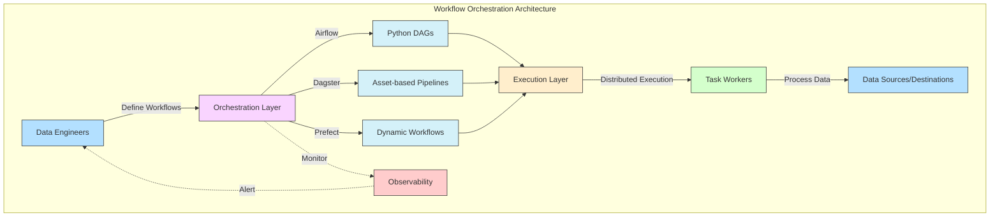

#### **Apache Airflow**

- **Architecture**: Python-based DAG (Directed Acyclic Graph) definition
- **Key Features**: Rich operator ecosystem, extensible, strong community
- **Enterprise Adoption**: Widespread, used by Airbnb, Lyft, Twitter
- **Scalability**: Celery or Kubernetes executor for distributed execution
- **Monitoring**: Rich UI, metrics integration, customizable alerting
- **Limitations**: Steep learning curve, Python-centric, DAG versioning challenges

#### **Dagster**

- **Architecture**: Asset-based data-aware orchestration
- **Key Features**: Data-aware pipelines, structured type system, testing framework
- **Enterprise Adoption**: Growing, used by Prezi, Mapbox
- **Scalability**: Kubernetes deployment, parallel execution
- **Monitoring**: Integrated observability, asset materialization tracking
- **Limitations**: Newer platform, smaller community than Airflow

#### **Prefect**

- **Architecture**: Python-based positive engineering focus
- **Key Features**: Dynamic workflows, hybrid execution model, rich UI
- **Enterprise Adoption**: Moderate, used by Robinhood, Getty Images
- **Scalability**: Dask integration, Kubernetes support
- **Monitoring**: Built-in notification system, observability dashboard
- **Limitations**: Smaller ecosystem than Airflow, commercial focus for enterprise features

#### **Comparison for Enterprise Use**

| Factor | Airflow | Dagster | Prefect |
|:-------|:-------:|:-------:|:-------:|
| **Learning Curve** | 📚 Steep | 📘 Moderate | 📗 Moderate |
| **Deployment Complexity** | ⚙️ High | 🔧 Moderate | 🛠 Low to Moderate |
| **Community Support** | 👥 Extensive | 👤 Growing | 👤 Moderate |
| **Data Awareness** | ⚠️ Limited | ✅ Native | 🔶 Moderate |
| **Workflow Flexibility** | 🔄 Moderate | 🔁 High | 🔁 High |
| **Enterprise Support** | Commercial options | Commercial options | Core to business model |

---

### Pipeline Monitoring and Alerting

#### **Monitoring Dimensions**

- **Execution Metrics**: Runtime, resource utilization, throughput
- **Outcome Validation**: Data quality, completeness, business rule compliance
- **System Health**: Component status, resource availability, queue depths
- **Business Impact**: SLA compliance, downstream system effects

#### **Monitoring Implementation Approaches**

- **Built-in Tool Capabilities**: Native dashboards in orchestration platforms
- **Observability Platforms**: Integration with Datadog, New Relic, Prometheus/Grafana
- **Custom Solutions**: Tailored metrics collection and visualization

#### **Alerting Strategies**

- **Progressive Escalation**: Tiered alerts based on severity and duration
- **Contextual Alerts**: Including relevant logs, metrics, and recovery steps
- **Alert Correlation**: Grouping related issues to reduce noise

> 📊 **Enterprise Monitoring Best Practices**
> 
> - Establish clear ownership for pipeline components
> - Define SLAs and corresponding alert thresholds
> - Implement runbook automation for common issues
> - Create business impact dashboards for stakeholder visibility

---

### Error Handling and Retry Mechanisms

#### **Common Pipeline Failure Scenarios**

- **Infrastructure Issues**: Resource constraints, network failures
- **Data Problems**: Schema changes, unexpected formats, volume spikes
- **Dependency Failures**: External service outages, API changes
- **Business Logic Errors**: Invalid assumptions, edge cases

#### **Error Handling Strategies**

- **Task-Level Retry**: Individual task retries with configurable backoff
- **Partial Workflow Recovery**: Resuming from failure points
- **Circuit Breakers**: Preventing cascade failures with dynamic service isolation
- **Dead Letter Queues**: Capturing failed records for separate processing

#### **Error Recovery Patterns**

- **Immediate Retry**: For transient issues like network hiccups
- **Delayed Retry**: For resource contention or rate limiting
- **Fallback Processing**: Alternative processing paths for specific error types
- **Manual Intervention**: Human-in-the-loop for complex failures

> ⚡ **Enterprise Implementation Considerations**
> 
> - Balance between automation and manual intervention
> - Clear error classification and routing
> - Recovery impact on data consistency
> - Comprehensive error logging and traceability

---

### Idempotency Implementation

Idempotency ensures that operations can be repeated without causing unintended side effects, a critical characteristic for reliable data pipelines.

#### **Idempotency Patterns**

- **Natural Key Merges**: Using business keys for upset/merge operations
- **Idempotency Tokens**: Unique operation identifiers to detect duplicates
- **Result Caching**: Storing operation results for repeat executions
- **State-Based Execution**: Checking current state before applying changes

#### **Implementation Techniques**

- **Database-Level**: Unique constraints, merge operations
- **Application-Level**: Request deduplication, conditional processing
- **Infrastructure-Level**: Message deduplication in queuing systems

> 🔄 **Enterprise Idempotency Challenges**
> 
> - Distributed system coordination
> - Performance implications of checks
> - Historical data retention for idempotency verification
> - Cross-system consistency

---

### Dependency Management

#### **Types of Pipeline Dependencies**

- **Data Dependencies**: Upstream data availability and quality
- **System Dependencies**: External service availability
- **Temporal Dependencies**: Time-based execution requirements
- **Resource Dependencies**: Computing resource availability

#### **Dependency Management Approaches**

- **Static DAG Definition**: Fixed dependency structure defined in advance
- **Dynamic Dependency Resolution**: Runtime determination based on context
- **Event-Driven Triggers**: Execution based on system events rather than schedules
- **Resource-Aware Scheduling**: Considering resource availability for execution

> 🔄 **Enterprise Dependency Challenges**
> 
> - Cross-team dependencies and coordination
> - Legacy system integration
> - External partner dependencies
> - Cloud service limitations and quotas

---

### Pipeline Scheduling Approaches

#### **Time-Based Scheduling**

- **Cron-Style**: Fixed schedule based on time patterns
- **Interval-Based**: Regular execution with defined gaps
- **Calendar-Aware**: Business day awareness, holiday handling

#### **Event-Driven Scheduling**

- **Data Arrival**: Triggering when new data becomes available
- **External Signals**: API calls or system events initiating workflows
- **Completion Events**: Downstream processes starting after upstream completion

#### **Hybrid Scheduling**

- **Time-Window Execution**: Events processed within defined time windows
- **Scheduled Polling**: Regular checks for event conditions
- **Backfill Orchestration**: Historical data processing with time simulation

> ⏰ **Enterprise Scheduling Considerations**
> 
> - Business hour alignment for critical processes
> - Cross-region timing for global operations
> - Maintenance window coordination
> - Resource contention during peak periods

---

### Resource Optimization

#### **Compute Resource Optimization**

- **Right-Sizing**: Matching resources to workload requirements
- **Autoscaling**: Dynamically adjusting resources based on demand
- **Spot/Preemptible Instances**: Using discounted ephemeral resources
- **Workload Distribution**: Balancing jobs across available infrastructure

#### **Storage Optimization**

- **Data Lifecycle Management**: Tiered storage based on access patterns
- **Compression Strategies**: Balancing storage and compute trade-offs
- **Partitioning Schemes**: Optimizing for query patterns and management

#### **Cost Management Approaches**

- **Tagging and Allocation**: Tracking resource usage by business unit
- **Idle Resource Detection**: Identifying and eliminating waste
- **Reserved Capacity Planning**: Pre-purchasing for predictable workloads
- **Continuous Monitoring**: Regular review of resource utilization patterns

> 💰 **Enterprise Implementation Strategies**
> 
> - FinOps team integration for cost visibility
> - Regular optimization cycles with measurable targets
> - Balancing performance requirements with cost constraints
> - Establishing resource governance frameworks

---

## Big Data Processing

Big data processing involves the manipulation and analysis of datasets too large or complex for traditional data processing systems. Enterprise implementations must balance scalability, performance, and manageability.

### Distributed Computing Principles

#### **Fundamental Concepts**

- **Data Partitioning**: Splitting data across nodes for parallel processing
- **Task Distribution**: Allocating work across computing resources
- **Fault Tolerance**: Continuing operation despite component failures
- **Data Locality**: Processing data where it resides to minimize movement
- **Scalability Dimensions**: Vertical (more powerful nodes) vs. horizontal (more nodes)

#### **Distributed System Challenges**

- **Consistency**: Maintaining data integrity across distributed components
- **Availability**: Ensuring system accessibility despite failures
- **Partition Tolerance**: Handling network partitions between nodes
- **Latency Management**: Minimizing processing delays across distributed components

#### **CAP Theorem Implications**

- Trade-offs between consistency, availability, and partition tolerance
- Enterprise system design decisions based on business requirements
- Practical implementation considerations for different data workloads

> 🌐 **Enterprise Implementation Considerations**
> 
> - Network architecture for data-intensive workloads
> - Hardware selection strategies
> - Management complexity at scale
> - Total cost of ownership calculations

---

### Hadoop Ecosystem Components

#### **Core Components**

- **HDFS (Hadoop Distributed File System)**: Distributed storage layer
- **YARN (Yet Another Resource Negotiator)**: Resource management and job scheduling
- **MapReduce**: Distributed processing framework
- **Hadoop Common**: Utilities supporting other Hadoop modules

#### **Extended Ecosystem**

- **Hive**: SQL-like interface for Hadoop data
- **HBase**: NoSQL distributed database
- **Pig**: Scripting platform for data flows
- **ZooKeeper**: Coordination service for distributed applications
- **Oozie**: Workflow scheduler for Hadoop jobs

#### **Enterprise Adoption State**

- Legacy deployments in many enterprises
- Gradual migration to cloud-native alternatives
- Continued relevance for specific use cases
- Integration challenges with modern data tooling

#### **Comparison with Modern Alternatives**

| Factor | Hadoop Ecosystem | Modern Alternatives |
|:-------|:----------------:|:-------------------:|
| **Deployment Complexity** | ⚙️ High | 🛠 Lower with managed services |
| **Operational Overhead** | ⚠️ Significant | ✅ Reduced with serverless options |
| **Learning Curve** | 📚 Steep | 📘 Generally less steep |
| **Cost Structure** | 💰 Capital expense focused | 💸 Operational expense focused |
| **Workload Flexibility** | 🔄 Less agile | 🔁 More adaptable |

---

### Apache Spark Architecture and RDDs

#### **Spark Core Architecture**

- **Driver Program**: Central coordinator managing job execution
- **Cluster Manager**: Resource allocation (Standalone, YARN, Kubernetes)
- **Executors**: Distributed workers performing tasks
- **Task Distribution**: Dynamic allocation based on data locality and resource availability

#### **Resilient Distributed Datasets (RDDs)**

- **Key Properties**: Immutable, partitioned, ability to track lineage
- **Operations**: Transformations (lazy) vs. Actions (eager)
- **Persistence Options**: Memory, disk, serialization formats
- **Fault Recovery**: Lineage-based reconstruction of lost partitions

#### **Spark Execution Model**

- **Job Breakdown**: Jobs → Stages → Tasks
- **Shuffle Operations**: Redistributing data across partitions
- **Execution Planning**: Catalyst optimizer for logical and physical plans
- **Adaptive Query Execution**: Runtime optimization based on statistics

> 🚀 **Enterprise Performance Considerations**
> 
> - Memory configuration and management
> - Serialization format selection
> - Partition sizing strategies
> - Shuffle tuning for large-scale operations

---

### MapReduce Programming Model

While largely superseded by newer frameworks like Spark, the MapReduce model established foundational patterns for distributed data processing.

#### **Core Concepts**

- **Map Phase**: Parallel processing of input data into key-value pairs
- **Shuffle Phase**: Sorting and transferring data between nodes
- **Reduce Phase**: Aggregating results for final output
- **Execution Flow**: Input splitting, mapping, shuffling, reducing, output

#### **MapReduce Strengths**

- Simplicity of programming model
- Natural fit for aggregation problems
- Built-in fault tolerance
- Minimal data movement for certain workloads

#### **MapReduce Limitations**

- High latency for iterative algorithms
- I/O overhead between job stages
- Limited in-memory processing
- Verbose implementation for complex workflows

> 🔄 **Enterprise Considerations for Legacy MapReduce Systems**
> 
> - Migration strategies to modern frameworks
> - Skill availability for maintenance
> - Integration with contemporary data systems
> - Performance optimization for critical workloads

---

### Spark SQL and DataFrames

#### **Spark SQL Components**

- **DataFrame API**: Distributed collection of structured data
- **Catalyst Optimizer**: Query optimization engine
- **Tungsten Execution Engine**: Efficient code generation
- **External Data Source API**: Connecting to diverse data sources

#### **Benefits Over RDDs**

- **Schema Awareness**: Understanding and enforcing data structure
- **Optimization Opportunities**: SQL-based query planning
- **Language Integration**: Seamless use from Python, Scala, R, Java
- **Performance Improvements**: Memory management, code generation

#### **Enterprise Implementation Patterns**

- Data lake query interfaces
- ETL/ELT pipeline implementation
- Interactive analytics platforms
- Integration with BI tools

> 📊 **Best Practices for Enterprise Use**
> 
> - Schema management and evolution
> - Performance tuning techniques
> - Resource allocation strategies
> - Integration with enterprise security frameworks

---

### Stream Processing

#### **Stream Processing Fundamentals**

- **Event Time vs. Processing Time**: Handling time in streaming contexts
- **Windowing Strategies**: Processing data in temporal chunks
- **State Management**: Maintaining information between events
- **Delivery Guarantees**: At-least-once, at-most-once, exactly-once semantics

#### **Apache Kafka Architecture**

- **Topics and Partitions**: Distributed log structure
- **Producers and Consumers**: Writing and reading from topics
- **Broker Cluster**: Distributed storage and coordination
- **Connect and Streams API**: Integration and processing capabilities

#### **Apache Flink Capabilities**

- **Stateful Stream Processing**: Sophisticated state management
- **Event Time Processing**: Natural handling of out-of-order events
- **Savepoints**: Consistent state snapshots for recovery
- **Table API and SQL**: Relational interfaces to streams

#### **Enterprise Stream Processing Patterns**

- Real-time data integration pipelines
- Monitoring and alerting systems
- Fraud detection and security analytics
- Real-time dashboards and reporting

#### **Comparison of Stream Processing Technologies**

| Factor | Kafka Streams | Apache Flink | Spark Streaming |
|:-------|:-------------:|:------------:|:---------------:|
| **Processing Model** | Record-at-a-time | Record-at-a-time | Micro-batch |
| **Latency** | ⚡ Low | ⚡⚡ Lowest | ⏱ Higher |
| **State Management** | 💾 Strong | 💾💾 Advanced | 💾 Basic |
| **Integration** | Kafka-native | Flexible | Spark ecosystem |
| **Exactly-once Semantics** | ✅ Supported | ✅✅ Comprehensive | ✅ Supported |
| **Enterprise Adoption** | 🏢 High | 🏢 Growing | 🏢 Established |

---

### Resource Management and Optimization

#### **Cluster Resource Managers**

- **YARN**: Hadoop resource negotiator
- **Kubernetes**: Container orchestration platform
- **Mesos**: Distributed systems kernel
- **Standalone Managers**: Framework-specific resource allocation

#### **Resource Allocation Strategies**

- **Static Allocation**: Fixed resources assigned at startup
- **Dynamic Allocation**: Resources adjusted based on workload
- **Resource Profiles**: Specialized configurations for different job types
- **Quota Management**: Fair sharing across users and applications

#### **Memory Management**

- **Heap vs. Off-heap**: Different memory management approaches
- **Caching Strategies**: In-memory data persistence options
- **Spill-to-disk**: Handling memory pressure gracefully
- **Garbage Collection Tuning**: Minimizing processing pauses

> 🔧 **Enterprise Optimization Approaches**
> 
> - Workload characterization and benchmarking
> - Performance testing frameworks
> - Monitoring-driven tuning
> - Capacity planning methodologies

---

## Cloud Data Technologies

Cloud data technologies enable organizations to build scalable, flexible data infrastructures without managing physical hardware. Enterprise implementations must address integration, governance, and cost optimization.

### Cloud Data Warehouses

#### **Snowflake Architecture**

- **Multi-cluster, Shared Data Architecture**: Separation of storage and compute
- **Virtual Warehouses**: Independent compute resources for workload isolation
- **Automatic Query Optimization**: Built-in performance tuning
- **Time Travel and Zero-Copy Cloning**: Data versioning capabilities
- **Enterprise Features**: Role-based access control, VPC integration, column-level security

#### **Google BigQuery**

- **Serverless Architecture**: No cluster management required
- **Storage-Compute Separation**: Independent scaling
- **SQL Dialect**: Extended SQL with analytic functions
- **ML Integration**: In-database machine learning
- **Enterprise Features**: Column-level security, VPC Service Controls, encryption options

#### **Amazon Redshift**

- **Cluster-Based Architecture**: Leader and compute nodes
- **Redshift Spectrum**: Querying data directly in S3
- **Concurrency Scaling**: On-demand additional compute
- **AQUA (Advanced Query Accelerator)**: Hardware-accelerated processing
- **Enterprise Features**: VPC deployment, AWS integration, encryption options

#### **Comparison for Enterprise Decision-Making**

| Factor | Snowflake | BigQuery | Redshift |
|:-------|:---------:|:--------:|:--------:|
| **Pricing Model** | 💰 Compute + Storage | 💲 Query-based + Storage | 💻 Instance-based + Storage |
| **Scaling Model** | 🔄 Independent warehouses | 🔄 Automatic | 🔄 Cluster resizing, concurrency scaling |
| **Maintenance** | ✅ Minimal | ✅ Minimal | 🔧 Some cluster maintenance |
| **Query Performance** | ⚡⚡ Excellent | ⚡ Very good | ⚡ Very good |
| **Ecosystem Integration** | Multi-cloud, partner network | Google Cloud, partner network | AWS services |
| **Data Sharing** | 🔄 Native capabilities | 🔄 BigQuery Data Transfer | ⚠️ Limited |

---

### Cloud Storage Systems

#### **Amazon S3 (Simple Storage Service)**

- **Object Storage Model**: Flat namespace with buckets and objects
- **Storage Classes**: Standard, Intelligent-Tiering, Glacier, etc.
- **Performance Features**: Transfer acceleration, multipart uploads
- **Data Management**: Lifecycle policies, inventory reports
- **Enterprise Features**: Versioning, replication, access controls, encryption

#### **Microsoft Azure Blob Storage**

- **Storage Account Structure**: Hierarchical organization
- **Access Tiers**: Hot, Cool, Archive
- **Data Lake Storage Gen2**: Enhanced for analytics workloads
- **Performance Features**: Data lake enablement, hierarchical namespace
- **Enterprise Features**: Soft delete, immutable storage, access control

#### **Google Cloud Storage (GCS)**

- **Bucket and Object Model**: Global namespace
- **Storage Classes**: Standard, Nearline, Coldline, Archive
- **Performance Features**: Strong consistency, composite objects
- **Data Management**: Object lifecycle management, retention policies
- **Enterprise Features**: Uniform bucket-level access, IAM integration

> 🌐 **Enterprise Implementation Considerations**
> 
> - Data residency and sovereignty requirements
> - Cross-region replication strategies
> - Cost optimization through lifecycle management
> - Integration with on-premises systems
> - Governance and compliance frameworks

---

### Serverless Data Processing

#### **AWS Lambda**

- **Event-Driven Execution**: Function invocation based on triggers
- **Integration Points**: S3, DynamoDB, Kinesis, EventBridge
- **Data Processing Patterns**: Stream processing, ETL, data validation
- **Limitations**: Execution time, memory constraints, deployment size
- **Enterprise Considerations**: Cold start latency, monitoring, cost management

#### **Azure Functions**

- **Trigger Types**: Timer, HTTP, blob storage, queue
- **Durable Functions**: Stateful function orchestration
- **Integration with Azure Data Services**: Event Hubs, Cosmos DB, Blob Storage
- **Limitations**: Similar to Lambda with Azure-specific constraints
- **Enterprise Considerations**: Monitoring with Application Insights, security integration

#### **Google Cloud Functions**

- **Event Providers**: Cloud Storage, Pub/Sub, Firestore
- **HTTP Functions**: RESTful service implementation
- **Integration with GCP Services**: BigQuery, Datastore
- **Limitations**: Similar to competitors with GCP-specific aspects
- **Enterprise Considerations**: Stackdriver monitoring, IAM integration

#### **Serverless Analytics Services**

- **AWS Athena**: S3-based SQL query service
- **Google BigQuery**: Serverless data warehouse
- **Azure Synapse Analytics**: Unified analytics platform with serverless options

#### **Serverless ETL Services**

- **AWS Glue**: Serverless data integration service
- **Azure Data Factory**: Managed data integration service
- **Google Cloud Dataflow**: Managed Apache Beam service

> ☁️ **Enterprise Serverless Adoption Strategies**
> 
> - Use case identification and prioritization
> - Cost modeling and optimization
> - Operational monitoring and management
> - Security and compliance implementation
> - Integration with existing data infrastructure

---

### Infrastructure as Code for Data Systems

#### **Core IaC Principles for Data Infrastructure**

- **Declarative Definitions**: Specifying desired state rather than steps
- **Version Control Integration**: Tracking infrastructure changes
- **Automated Provisioning**: Consistent environment creation
- **Configuration Drift Detection**: Ensuring infrastructure matches definitions
- **Modular Design**: Reusable components for different environments

#### **Major IaC Tools for Data Infrastructure**

- **Terraform**: Multi-cloud infrastructure provisioning
- **AWS CloudFormation**: AWS-specific infrastructure templating
- **Azure Resource Manager Templates**: Azure resource definitions
- **Google Cloud Deployment Manager**: GCP resource templates
- **Pulumi**: Programming languages for infrastructure definition

#### **Data-Specific IaC Patterns**

- **Data Pipeline Definitions**: Codifying workflow structures
- **Warehouse Schema Management**: Version-controlled data definitions
- **Security Configuration**: Consistent access control implementation
- **Environment Parity**: Matching development, testing, and production

> 🔄 **Enterprise Implementation Strategies**
> 
> - CI/CD integration for infrastructure deployment
> - Testing frameworks for infrastructure validation
> - Change management processes
> - Developer experience and self-service capabilities
> - Compliance and governance integration

---

### Cost Management and Optimization

#### **Cloud Data Cost Drivers**

- **Compute Resources**: Processing power allocation
- **Storage Volumes**: Data at rest costs
- **Data Transfer**: Ingress/egress charges
- **Query Execution**: Per-query or per-TB pricing
- **Managed Service Premiums**: Value-added service charges

#### **Optimization Strategies**

- **Right-Sizing Resources**: Matching capacity to requirements
- **Storage Tiering**: Moving data to appropriate price tiers
- **Query Optimization**: Reducing processed data volumes
- **Reservation and Commitment Discounts**: Pre-purchasing capacity
- **Automated Scaling**: Adjusting resources to demand

#### **Cost Visibility and Governance**

- **Tagging Strategies**: Resource attribution to business units
- **Budgeting and Alerting**: Proactive cost management
- **Chargeback/Showback Models**: Business unit accountability
- **Anomaly Detection**: Identifying unexpected spending

> 💰 **Enterprise Implementation Approaches**
> 
> - FinOps team structure and responsibilities
> - Regular cost review cadences
> - Optimization targets and incentives
> - Balancing cost against performance requirements
> - Forecasting and planning methodologies

---

### Multi-Cloud Strategies

#### **Multi-Cloud Approaches for Data Systems**

- **Best-of-Breed Selection**: Choosing optimal services across providers
- **Redundancy and Failover**: Using multiple clouds for resilience
- **Vendor Leverage**: Maintaining negotiating position with providers
- **Geographic Coverage**: Utilizing regional strengths of different providers
- **Specialized Capabilities**: Accessing unique features from different clouds

#### **Multi-Cloud Challenges**

- **Data Movement Costs**: Cross-cloud transfer expenses
- **Skill Fragmentation**: Specialized expertise requirements
- **Management Complexity**: Multiple consoles and APIs
- **Security Consistency**: Maintaining uniform controls
- **Governance Overhead**: Policy implementation across platforms

#### **Implementation Patterns**

- **Abstraction Layers**: Infrastructure-agnostic interfaces
- **Data Synchronization**: Maintaining consistency across clouds
- **Unified Monitoring**: Centralized visibility across environments
- **Identity Management**: Consistent authentication and authorization
- **Network Architecture**: Connectivity between cloud environments

> ☁️ **Enterprise Suitability Assessment**
> 
> - Business case validation for multi-cloud
> - Total cost of ownership analysis
> - Risk and resilience evaluation
> - Operational capability assessment
> - Regulatory and compliance considerations

---

### Data Security in Cloud Environments

#### **Cloud Data Security Framework Components**

- **Identity and Access Management**: User authentication and authorization
- **Data Protection**: Encryption, tokenization, masking
- **Network Security**: VPC design, traffic control, firewalls
- **Monitoring and Detection**: Logging, anomaly detection, alerting
- **Compliance Management**: Control implementation and documentation

#### **Cloud Provider Security Features**

- **AWS**: IAM, KMS, CloudTrail, Security Hub, VPC endpoints
- **Azure**: Azure AD, Key Vault, Security Center, Private Link
- **GCP**: IAM, Cloud KMS, Security Command Center, VPC Service Controls

#### **Data-Specific Security Controls**

- **Data Classification**: Identifying sensitivity levels
- **Encryption Strategies**: At-rest, in-transit, and in-use protection
- **Access Controls**: Column-level, row-level, and cell-level security
- **Audit Logging**: Comprehensive activity tracking
- **Data Lineage**: Understanding data origins and transformations

> 🔒 **Enterprise Security Implementation Approaches**
> 
> - Security-by-design principles for data architecture
> - DevSecOps integration for pipeline security
> - Automated compliance validation
> - Threat modeling for data workflows
> - Security monitoring and incident response

---

## Data Architecture

Data architecture defines the structure, integration patterns, and organization of data systems to meet business requirements. Modern enterprise architectures must balance centralization with domain-specific needs.

### Data Lake Design Principles

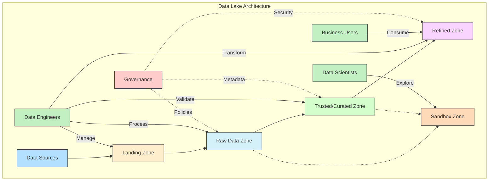

#### **Core Data Lake Concepts**

- **Schema-on-Read Approach**: Deferring structure until analysis time
- **Multi-Format Storage**: Supporting structured, semi-structured, and unstructured data
- **Historical Preservation**: Maintaining raw data for future use cases
- **Democratized Access**: Enabling diverse user groups to leverage data
- **Scalable Storage**: Accommodating rapid data growth

#### **Architectural Layers**

- **Landing Zone**: Raw data ingestion
- **Raw Data Zone**: Unaltered source data preservation
- **Trusted/Curated Zone**: Validated, cleansed data
- **Refined Zone**: Aggregated, transformed data for specific use cases
- **Sandbox Zone**: Exploration and experimentation area

#### **Governance Implementation**

- **Metadata Management**: Tracking data sources, quality, and lineage
- **Access Control Framework**: Fine-grained permissions model
- **Data Quality Processes**: Validation rules and monitoring
- **Lifecycle Management**: Retention and archiving policies

> 🌊 **Enterprise Implementation Patterns**
> 
> - Cloud-native vs. hybrid approaches
> - Integration with existing data warehouses
> - Self-service vs. managed access models
> - Cost allocation and chargeback mechanisms

---

### Data Mesh Architecture

Data Mesh represents a paradigm shift from centralized data platforms to a distributed, domain-oriented, self-serve design.

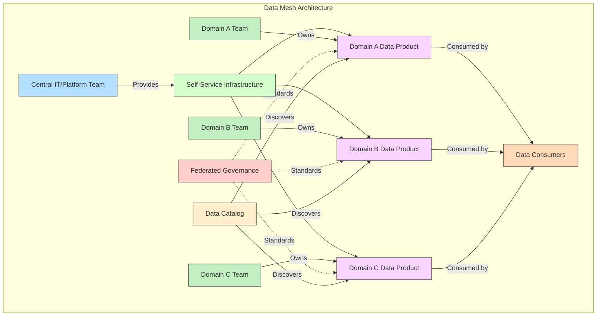

#### **Core Principles**

- **Domain Ownership**: Business domains own their data products
- **Data as a Product**: Treating data with product management principles
- **Self-Serve Infrastructure**: Enabling domain autonomy through platforms
- **Federated Governance**: Balancing autonomy with organizational standards

#### **Architectural Components**

- **Domain Data Products**: Self-contained, valuable data assets
- **Data Product Interfaces**: Well-defined consumption methods
- **Discovery and Catalog**: Finding and understanding available data
- **Infrastructure Platform**: Shared technical capabilities
- **Governance Framework**: Cross-domain standards and policies

#### **Implementation Steps**

- **Domain Identification**: Mapping business domains to data ownership
- **Platform Development**: Creating enabling infrastructure
- **Operating Model Evolution**: Shifting from centralized to federated
- **Measuring Success**: Tracking adoption and business outcomes

> 🔄 **Enterprise Adoption Considerations**
> 
> - Organizational readiness and cultural alignment
> - Required capability development
> - Transition strategies from centralized models
> - Balancing standardization with domain autonomy

---

### Lakehouse Paradigm

The Lakehouse architecture combines data lake storage with data warehouse management capabilities.

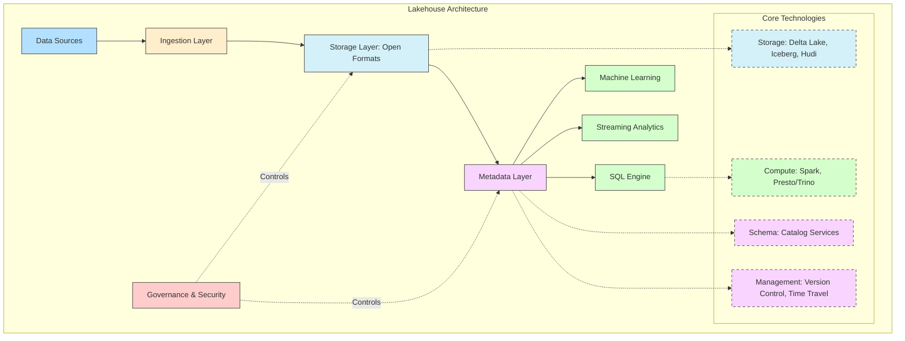

#### **Key Characteristics**

- **Open Storage Formats**: Leveraging formats like Parquet, Delta, Iceberg
- **ACID Transactions**: Ensuring data consistency and reliability
- **Schema Enforcement**: Applying structure when needed
- **Advanced Data Management**: Versioning, time travel, optimization
- **Diverse Workload Support**: Analytics, ML, streaming in unified platform

#### **Technical Components**

- **Table Formats**: Delta Lake, Apache Iceberg, Apache Hudi
- **Compute Engines**: Spark, Presto/Trino, Snowflake
- **Metadata Layer**: Catalog services, schema registry
- **Management Layer**: Governance, security, optimization

#### **Enterprise Benefits**

- Reduced data silos and duplication
- Lower total cost of ownership
- Simplified architecture and maintenance
- Improved data freshness
- Enhanced analytics and ML capabilities

> 🏠 **Implementation Strategies**
> 
> - Greenfield vs. migration approaches
> - Single vs. multi-platform implementations
> - Integration with existing data warehouses
> - Skill development requirements

---

### Lambda and Kappa Architectures

```mermaid
graph TD
    subgraph "Lambda Architecture"
        A1[Data Source] --> B1[Stream Processing]
        A1 --> C1[Batch Processing]
        
        B1 --> D1[Real-time View]
        C1 --> E1[Batch View]
        
        D1 --> F1[Serving Layer]
        E1 --> F1
        
        F1 --> G1[Query Results]
    end
    
    subgraph "Kappa Architecture"
        A2[Data Source] --> B2[Stream Processing System]
        B2 --> C2[Real-time Processing]
        B2 --> D2[Historical Reprocessing]
        
        C2 --> E2[Serving Layer]
        D2 --> E2
        
        E2 --> F2[Query Results]
    end
    
    style A1 fill:#b3e0ff,stroke:#333
    style B1 fill:#ffeecc,stroke:#333
    style C1 fill:#d4f1f9,stroke:#333
    style D1 fill:#f9d4ff,stroke:#333
    style E1 fill:#f9d4ff,stroke:#333
    style F1 fill:#d4ffcc,stroke:#333
    style G1 fill:#ffdab9,stroke:#333
    
    style A2 fill:#b3e0ff,stroke:#333
    style B2 fill:#ffeecc,stroke:#333
    style C2 fill:#f9d4ff,stroke:#333
    style D2 fill:#f9d4ff,stroke:#333
    style E2 fill:#d4ffcc,stroke:#333
    style F2 fill:#ffdab9,stroke:#333
```

#### **Lambda Architecture**

- **Batch Layer**: Complete, accurate processing of all data
- **Speed Layer**: Real-time processing of recent data
- **Serving Layer**: Combining batch and speed results for queries
- **Benefits**: Comprehensive results with low latency
- **Challenges**: Duplicate processing logic, complexity

#### **Kappa Architecture**

- **Single Processing Path**: Stream processing for all data
- **Replayability**: Ability to reprocess historical data through stream
- **Benefits**: Simplified maintenance, unified code base
- **Challenges**: Stream processing complexity, historical reprocessing

#### **Unified Architecture Trends**

- Convergence of batch and streaming capabilities
- Stream processing frameworks with batch support
- Cloud services supporting hybrid approaches
- Simplified development models

> 🔄 **Enterprise Implementation Considerations**
> 
> - Workload characteristics and latency requirements
> - Existing technology investments
> - Team skills and organization
> - Operational complexity tolerance

---

### Edge Computing Integration

#### **Edge Computing Concepts**

- **Distributed Processing**: Computation near data sources
- **Local Intelligence**: Analytics at the network edge
- **Data Reduction**: Filtering before central transmission
- **Latency Optimization**: Real-time processing without network delays
- **Autonomy**: Operation during connectivity interruptions

#### **Data Architecture Implications**

- **Edge-to-Core Pipelines**: Moving selected data to central systems
- **Metadata Synchronization**: Maintaining context across locations
- **Processing Distribution**: Deciding what happens where
- **State Management**: Handling distributed system complexity

#### **Implementation Patterns**

- **Edge Pre-processing**: Initial transformation at the source
- **Local Analytics**: Decision-making without central systems
- **Selective Transmission**: Sending only valuable data centrally
- **Central Coordination**: Managing distributed edge nodes

> 📡 **Enterprise Use Cases**
> 
> - Manufacturing sensor analysis
> - Retail in-store analytics
> - Telecommunications network monitoring
> - Connected vehicle data processing
> - Healthcare device monitoring

---

### Microservices for Data Systems

#### **Data Microservices Concepts**

- **Service Boundaries**: Defining data function separation
- **API-First Design**: Clear interface definitions
- **Independent Deployment**: Autonomous service lifecycle
- **Polyglot Persistence**: Service-appropriate data stores
- **Domain-Driven Design**: Aligning with business domains

#### **Common Data Microservices**

- **Ingest Services**: Data acquisition and validation
- **Transform Services**: Processing and enrichment
- **Storage Services**: Persistence and retrieval
- **Query Services**: Data access and aggregation
- **Orchestration Services**: Workflow and coordination

#### **Implementation Challenges**

- Distributed transaction management
- Eventual consistency handling
- Service discovery and registry
- Monitoring and observability
- Development and testing complexity

> 🧩 **Enterprise Implementation Approaches**
> 
> - Gradual migration from monolithic systems
> - Container orchestration platforms (Kubernetes)
> - Service mesh implementation
> - API gateway integration
> - DevOps practices for deployment

---

### Event-Driven Architectures

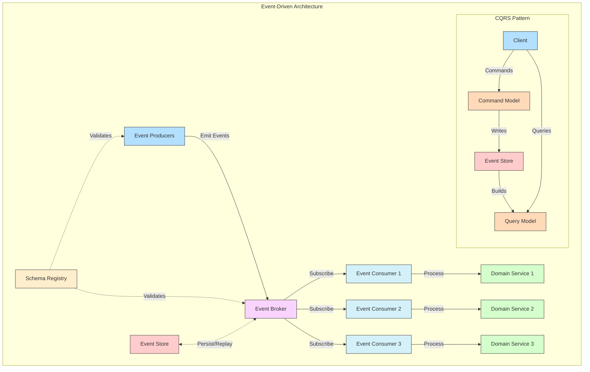

#### **Core Concepts**

- **Events as First-Class Citizens**: Representing state changes as events
- **Decoupled Communication**: Producers unaware of consumers
- **Temporal Decoupling**: Asynchronous processing
- **Event Sourcing**: Using event log as system of record
- **Command Query Responsibility Segregation (CQRS)**: Separate write and read models

#### **Key Components**

- **Event Producers**: Systems generating events
- **Event Brokers**: Kafka, RabbitMQ, EventBridge, Pub/Sub
- **Event Consumers**: Systems processing events
- **Event Store**: Persistent event history
- **Schema Registry**: Event format definitions

#### **Implementation Patterns**

- **Event Notification**: Simple notifications without payload detail
- **Event-Carried State Transfer**: Complete state in events
- **Event Sourcing**: Rebuilding state from event history
- **Event Collaboration**: Distributed processes via events

> 🔄 **Enterprise Adoption Considerations**
> 
> - Schema evolution management
> - Event versioning strategies
> - Delivery guarantees and ordering
> - Monitoring and debugging complexity
> - Integration with legacy systems

---

## Data Modeling and Storage

Data modeling defines the structure and relationships of data to enable effective storage, retrieval, and analysis. Enterprise data modeling must balance performance, accessibility, and governance requirements.

### Data Modeling Methodologies

#### **Conceptual Data Modeling**

- **Purpose**: High-level view of data concepts and relationships
- **Audience**: Business stakeholders, system architects
- **Techniques**: Entity-Relationship Diagrams, UML Class Diagrams
- **Enterprise Considerations**: Business rule representation, domain modeling

#### **Logical Data Modeling**

- **Purpose**: Technology-independent detailed structure
- **Audience**: Data architects, business analysts
- **Techniques**: Normalized models, dimensional models
- **Enterprise Considerations**: Cross-domain integration, canonical models

#### **Physical Data Modeling**

- **Purpose**: Implementation-specific database design
- **Audience**: Database developers, data engineers
- **Techniques**: Schema definitions, indexing strategies, partitioning
- **Enterprise Considerations**: Performance optimization, storage efficiency

#### **Modern Data Modeling Approaches**

- **Data Vault Modeling**: Hub, link, and satellite design for enterprise data warehouses
- **Anchor Modeling**: Highly normalized, temporal modeling approach
- **Graph Modeling**: Relationship-focused designs for connected data
- **Schema-on-Read**: Flexible modeling for data lakes and NoSQL systems

---

### Relational Database Design

#### **Normalization Principles**

- **First Normal Form (1NF)**: Atomic values, no repeating groups
- **Second Normal Form (2NF)**: All attributes dependent on the entire primary key
- **Third Normal Form (3NF)**: No transitive dependencies
- **Boyce-Codd Normal Form (BCNF)**: Every determinant is a candidate key
- **Enterprise Applications**: Transaction systems, master data management

#### **Dimensional Modeling**

- **Fact Tables**: Measurement events with foreign keys to dimensions
- **Dimension Tables**: Descriptive attributes for analysis
- **Star Schema**: Central fact table with directly connected dimensions
- **Snowflake Schema**: Normalized dimensions extending from star schema
- **Enterprise Applications**: Data warehousing, analytical systems

#### **Indexing Strategies**

- **B-Tree Indexes**: Standard balanced tree structure
- **Bitmap Indexes**: Compact representation for low-cardinality columns
- **Covering Indexes**: Including all query columns to avoid table access
- **Partitioning Schemes**: Horizontal data division for performance
- **Enterprise Considerations**: Query patterns, write loads, maintenance

> 💾 **Enterprise Implementation Patterns**
> 
> - Slowly Changing Dimension handling
> - Historization approaches
> - Temporal data management
> - Hybrid transactional/analytical processing (HTAP)

---

### NoSQL Database Patterns

#### **Document Databases**

- **Model**: Self-contained documents (typically JSON/BSON)
- **Key Characteristics**: Schema flexibility, nested structures
- **Popular Implementations**: MongoDB, Couchbase, DocumentDB
- **Enterprise Use Cases**: Content management, profile stores, catalog data
- **Design Considerations**: Document size, nesting depth, indexing strategy

#### **Key-Value Stores**

- **Model**: Simple key to value mapping
- **Key Characteristics**: High performance, horizontal scalability
- **Popular Implementations**: Redis, DynamoDB, Riak
- **Enterprise Use Cases**: Caching, session storage, high-volume simple data
- **Design Considerations**: Key design, value serialization, expiration policies

#### **Column-Family Stores**

- **Model**: Rows containing column families with dynamic columns
- **Key Characteristics**: Write-optimized, scaling for wide tables
- **Popular Implementations**: Cassandra, HBase, ScyllaDB
- **Enterprise Use Cases**: Time-series data, IoT, high-write applications
- **Design Considerations**: Column family design, primary key composition, compaction strategies

#### **Graph Databases**

- **Model**: Nodes and relationships with properties
- **Key Characteristics**: Relationship traversal performance
- **Popular Implementations**: Neo4j, Amazon Neptune, JanusGraph
- **Enterprise Use Cases**: Network analysis, recommendation engines, identity management
- **Design Considerations**: Node/relationship modeling, query patterns, traversal depth

#### **Multi-Model Databases**

- **Model**: Supporting multiple data models in single platform
- **Key Characteristics**: Flexibility, unified management
- **Popular Implementations**: ArangoDB, CosmosDB, FaunaDB
- **Enterprise Use Cases**: Complex applications with diverse data needs
- **Design Considerations**: Model separation, query optimization, transaction handling

---

### Time-Series Data Management

#### **Time-Series Data Characteristics**

- **Time-Stamped Records**: Each data point associated with time
- **Append-Only**: Primarily new data rather than updates
- **High Write Volume**: Often continuous data streams
- **Temporal Queries**: Time-range and aggregation focus
- **Retention Policies**: Age-based purging or archiving

#### **Storage Optimizations**

- **Time-Based Partitioning**: Dividing data by time intervals
- **Columnar Compression**: Efficiently storing similar values
- **Downsampling**: Aggregating older data at lower resolution
- **Hot-Cold Tiering**: Moving older data to cost-effective storage

#### **Specialized Databases**

- **InfluxDB**: Purpose-built time-series database
- **TimescaleDB**: PostgreSQL extension for time-series
- **Amazon Timestream**: Serverless time-series database
- **Prometheus**: Monitoring-focused time-series database

> ⏱ **Enterprise Implementation Considerations**
> 
> - Query performance requirements
> - Retention period determination
> - Aggregation and rollup strategies
> - Integration with analytical systems

---

### Data Serialization Formats

#### **Row-Based Formats**

- **CSV**: Simple text format with delimiters
- **JSON**: Human-readable, hierarchical structure
- **XML**: Verbose but schema-capable format
- **Enterprise Considerations**: Human readability, processing overhead, size

#### **Columnar Formats**

- **Parquet**: Columnar storage with nested data support
- **ORC**: Optimized Row Columnar format
- **Arrow**: In-memory columnar format
- **Enterprise Considerations**: Query performance, compression efficiency

#### **Binary Formats**

- **Avro**: Compact binary with schema evolution
- **Protocol Buffers**: Google's structured data serialization
- **Thrift**: Cross-language service development
- **Enterprise Considerations**: Size efficiency, language support, schema evolution

> 🔄 **Format Selection Factors**
> 
> - Processing framework compatibility
> - Query pattern optimization
> - Storage efficiency requirements
> - Schema evolution needs
> - Development ecosystem

---

### Storage Optimization Techniques

#### **Data Compression**

- **Compression Algorithms**: Snappy, GZIP, LZO, ZSTD
- **Compression Levels**: Balancing ratio and performance
- **Column-Level Compression**: Type-specific algorithms
- **Enterprise Considerations**: CPU utilization, decompression speed

#### **Partitioning Strategies**

- **Horizontal Partitioning**: Row division by values
- **Time-Based Partitioning**: Division by time periods
- **List/Range Partitioning**: Division by value ranges
- **Enterprise Considerations**: Query patterns, partition management

#### **Data Lifecycle Management**

- **Tiered Storage Hierarchies**: Performance-based data placement
- **Archival Policies**: Moving aged data to cold storage
- **Purge Workflows**: Removing obsolete data
- **Enterprise Considerations**: Compliance requirements, cost optimization

#### **Advanced Techniques**

- **Data Deduplication**: Eliminating redundancy
- **Small File Compaction**: Combining small files for efficiency
- **Materialized Views**: Pre-computed results for common queries
- **Approximate Query Processing**: Trading accuracy for performance

---

## Data Quality and Governance

Data quality and governance ensure that data is accurate, consistent, and used appropriately. Enterprise implementations must balance control with accessibility to maximize data value.

### Data Quality Dimensions

#### **Core Data Quality Dimensions**

- **Accuracy**: Correctness compared to real-world values
- **Completeness**: Presence of all required data
- **Consistency**: Agreement across different datasets
- **Timeliness**: Currency and availability when needed
- **Validity**: Conformance to business rules and formats
- **Uniqueness**: Absence of duplication

#### **Quality Assessment Methods**

- **Profiling**: Statistical analysis of data characteristics
- **Rule-Based Validation**: Checking against defined constraints
- **Pattern Matching**: Identifying expected/unexpected patterns
- **Outlier Detection**: Finding statistical anomalies
- **Reference Data Comparison**: Verifying against authoritative sources

#### **Quality Measurement Frameworks**

- **Quality Scorecards**: Dimensional rating systems
- **Quality SLAs**: Defined acceptable thresholds
- **Trend Analysis**: Tracking quality metrics over time
- **Impact Assessment**: Business consequence evaluation

> 📊 **Enterprise Implementation Approaches**
> 
> - Preventive vs. detective controls
> - Centralized vs. distributed responsibility
> - Quality-by-design principles
> - Business stakeholder involvement

---

### Data Governance Frameworks

#### **Governance Structural Elements**

- **Data Governance Council**: Executive-level oversight
- **Data Stewards**: Domain-specific responsibility
- **Governance Office**: Operational coordination
- **Working Groups**: Focused implementation teams

#### **Governance Process Components**

- **Policy Management**: Creating and maintaining standards
- **Issue Resolution**: Addressing data problems
- **Change Management**: Controlled evolution of data assets
- **Communications**: Stakeholder awareness and education
- **Compliance Monitoring**: Ensuring adherence to standards

#### **Governance Focus Areas**

- **Metadata Management**: Documenting data meaning and context
- **Data Quality**: Maintaining accuracy and reliability
- **Privacy and Security**: Protecting sensitive information
- **Lifecycle Management**: Controlling creation through retirement
- **Architecture Alignment**: Ensuring consistent implementation

> 🔄 **Enterprise Implementation Models**
> 
> - Centralized vs. federated approaches
> - Business-led vs. IT-led structures
> - Integration with enterprise governance
> - Maturity-based implementation roadmaps

---

### Metadata Management

#### **Metadata Types**

- **Technical Metadata**: Schemas, formats, locations
- **Business Metadata**: Definitions, ownership, context
- **Operational Metadata**: Lineage, quality metrics, usage
- **Reference Metadata**: Code sets, hierarchies, classifications

#### **Metadata Repository Components**

- **Metadata Ingestion**: Collection from various sources
- **Storage Layer**: Persistence and versioning
- **API Layer**: Programmatic access
- **Search Capability**: Discovery functionality
- **Visualization**: Graphical presentation of relationships

#### **Enterprise Metadata Standards**

- **Common Metadata Framework (CMF)**: IBM's standard
- **Common Warehouse Metamodel (CWM)**: OMG standard
- **ISO/IEC 11179**: Metadata registry standard
- **Dublin Core**: Document and resource description

> 📚 **Implementation Approaches**
> 
> - Integrated with data catalogs
> - Custom vs. commercial solutions
> - Active vs. passive metadata collection
> - Business glossary integration

---

### Data Catalog Implementation

#### **Core Catalog Capabilities**

- **Asset Inventory**: Comprehensive data asset registry
- **Search and Discovery**: Finding relevant data
- **Context Enhancement**: Enriching with business metadata
- **Collaboration Features**: Annotations, ratings, discussions
- **Integration Points**: Connecting with data platforms

#### **Catalog Tool Comparison**

| Feature | Alation | Collibra | Informatica EDC | AWS Glue Data Catalog |
|:--------|:-------:|:--------:|:---------------:|:---------------------:|
| **Discovery Method** | Automated + Manual | Primarily Manual | Automated + Manual | Automated |
| **Business Context** | 📊 Rich | 📈 Extensive | 📊 Moderate | 📉 Limited |
| **Technical Metadata** | ✅ Comprehensive | 🔍 Moderate | ✅ Comprehensive | ✅ Good |
| **Integration Scope** | 🌐 Broad | 🌐 Broad | 🌐 Broad | ☁️ AWS-focused |
| **Collaboration** | 👥 Strong | 👥 Strong | 👤 Moderate | 👤 Limited |
| **Machine Learning** | 🧠 Advanced | 🧠 Moderate | 🧠 Advanced | 🧠 Basic |

#### **Implementation Strategies**

- Crawl-walk-run adoption approach
- Domain-by-domain rollout
- Integration with governance processes
- Self-service enablement focus

> 🔍 **Enterprise Success Factors**
> 
> - Executive sponsorship
> - Clear ownership and curation model
> - Integration with data access workflow
> - Active community building

---

### Master Data Management

#### **MDM Approaches**

- **Registry Style**: Central index with references to source systems
- **Consolidation Style**: Integrated copy for reporting
- **Centralized Style**: System of record with distribution
- **Hybrid Style**: Combination of approaches by domain

#### **Implementation Architectures**

- **Persistent Hub**: Central physical repository
- **Virtual Hub**: Federated access without centralization
- **Operational Data Store**: Integration layer with MDM capabilities
- **Cloud MDM**: Managed service implementations

#### **Key MDM Processes**

- **Data Consolidation**: Bringing together related records
- **Matching and Merging**: Identifying and combining duplicates
- **Governance Workflow**: Managing exceptions and approvals
- **Hierarchy Management**: Maintaining relationships
- **Distribution Management**: Synchronizing with consuming systems

> 🔄 **Enterprise Domain Considerations**
> 
> - Customer data management
> - Product information management
> - Supplier master data
> - Employee information management
> - Location and geographic hierarchy

---

### Data Lineage Tracking

#### **Lineage Dimensions**

- **Technical Lineage**: System-level data flow
- **Business Lineage**: Business process view
- **Transformation Lineage**: Detailed logic tracing
- **Field-Level Lineage**: Column/attribute flow

#### **Lineage Capture Methods**

- **Static Analysis**: Code and configuration parsing
- **Dynamic Analysis**: Runtime monitoring
- **Manual Documentation**: Human-recorded processes
- **Hybrid Approaches**: Combining automated and manual

#### **Implementation Technologies**

- **ETL Tool Integration**: Native lineage from data integration tools
- **SQL Parsing**: Extracting lineage from queries
- **Code Analysis**: Reviewing custom applications
- **Metadata API Integration**: Connecting disparate systems

> 🔍 **Enterprise Usage Patterns**
> 
> - Regulatory compliance reporting
> - Impact analysis for changes
> - Root cause analysis for data issues
> - Data valuation and prioritization

---

### Data Privacy and Compliance

#### **Regulatory Framework Examples**

- **GDPR**: European Union data protection regulation
- **CCPA/CPRA**: California privacy regulations
- **HIPAA**: US healthcare data protection
- **GLBA**: US financial information safeguards
- **Industry-Specific**: PCI DSS, FISMA, etc.

#### **Privacy-Enhancing Technologies**

- **Data Masking**: Obscuring sensitive information
- **Tokenization**: Replacing values with non-sensitive equivalents
- **Differential Privacy**: Adding noise to preserve aggregate accuracy
- **Homomorphic Encryption**: Computing on encrypted data
- **Federated Analysis**: Distributed processing without centralized data

#### **Implementation Approaches**

- Privacy by design principles
- Data discovery and classification
- Consent management systems
- De-identification frameworks
- Access control and monitoring

> 🔒 **Enterprise Governance Integration**
> 
> - Privacy impact assessments
> - Data protection officer role
> - Incident response protocols
> - Regular compliance auditing
> - Training and awareness programs

---

## Data Security and Compliance

Data security protects information assets from unauthorized access while ensuring availability to legitimate users. Enterprise security strategies must be comprehensive, layered, and proportionate to risk.

### Data Security Framework Components

#### **Data Security Layers**

- **Identity and Access Management**: Authentication and authorization
- **Data Protection**: Encryption, masking, tokenization
- **Infrastructure Security**: Network, compute, and storage protection
- **Application Security**: Secure development and configuration
- **Monitoring and Detection**: Identifying and responding to threats

#### **Security Governance Elements**

- **Policy Framework**: Defining security requirements
- **Risk Assessment**: Identifying and prioritizing threats
- **Control Implementation**: Deploying protective measures
- **Compliance Monitoring**: Verifying control effectiveness
- **Incident Management**: Responding to security events

#### **Enterprise Security Standards**

- **ISO 27001/27002**: Information security management
- **NIST Cybersecurity Framework**: Risk-based approach
- **CIS Controls**: Prioritized security actions
- **Industry-Specific**: PCI DSS, HITRUST, etc.

> 🔒 **Implementation Approaches**
> 
> - Defense-in-depth strategy
> - Zero trust architecture
> - Least privilege principle
> - Security-by-design methodology

---

### Data Access Control Models

#### **Role-Based Access Control (RBAC)**

- **Structure**: Permissions assigned to roles, roles assigned to users
- **Advantages**: Simplified management, reduced complexity
- **Limitations**: Role explosion, coarse-grained control
- **Enterprise Implementation**: Role engineering, attestation processes

#### **Attribute-Based Access Control (ABAC)**

- **Structure**: Policy-based decisions using multiple attributes
- **Advantages**: Contextual decisions, fine-grained control
- **Limitations**: Complex policy management, performance overhead
- **Enterprise Implementation**: Policy definition frameworks, rule engines

#### **Column-Level Security**

- **Structure**: Access control at the column/field level
- **Advantages**: Data element protection, regulatory alignment
- **Limitations**: Management complexity, performance impact
- **Enterprise Implementation**: Database-native features, data virtualization

#### **Row-Level Security**

- **Structure**: Access control at the record level
- **Advantages**: Multi-tenant support, data segregation
- **Limitations**: Query complexity, potential performance impact
- **Enterprise Implementation**: Database policies, view-based implementations

#### **Cell-Level Security**

- **Structure**: Access control at the intersection of row and column
- **Advantages**: Highest precision control
- **Limitations**: Significant management complexity
- **Enterprise Implementation**: Specialized database features, application logic

---

### Data Encryption Strategies

#### **Encryption Types**

- **Symmetric Encryption**: Single key for encryption/decryption
- **Asymmetric Encryption**: Public/private key pairs
- **Hashing**: One-way transformation
- **Format-Preserving Encryption**: Maintaining data format

#### **Encryption Application Points**

- **Data at Rest**: Stored information protection
- **Data in Transit**: Network communication protection
- **Data in Use**: Processing while encrypted (emerging)

#### **Key Management Components**

- **Key Generation**: Creating cryptographically strong keys
- **Key Storage**: Secure persistence of key material
- **Key Rotation**: Periodic replacement of keys
- **Key Destruction**: Secure removal when no longer needed

> 🔑 **Enterprise Implementation Approaches**
> 
> - Hardware Security Module (HSM) integration
> - Cloud Key Management Services
> - Encryption gateway architectures
> - Transparent Data Encryption (TDE)

---

### Security Monitoring and Analytics

#### **Monitoring Scope**

- **Access Patterns**: User authentication and authorization
- **Data Movement**: Transfer and usage tracking
- **Configuration Changes**: System and security settings
- **Threat Indicators**: Suspicious activity detection

#### **Security Information and Event Management (SIEM)**

- **Log Collection**: Centralized event aggregation
- **Correlation Rules**: Pattern detection across sources
- **Alerting Framework**: Notification of security events
- **Incident Response Integration**: Workflow and remediation

#### **User and Entity Behavior Analytics (UEBA)**

- **Baseline Establishment**: Normal behavior profiling
- **Anomaly Detection**: Identifying deviations from normal
- **Risk Scoring**: Prioritizing potential threats
- **Advanced Detection**: Machine learning for subtle patterns

> 🔍 **Enterprise Implementation Considerations**
> 
> - Signal-to-noise ratio optimization
> - False positive management
> - Integration with security operations
> - Compliance reporting automation

---

### Compliance Frameworks and Controls

#### **Major Compliance Frameworks**

- **SOC 2**: Service organization controls
- **ISO 27001**: Information security management
- **HITRUST**: Health information security framework
- **FedRAMP**: US federal cloud security
- **Industry-Specific**: HIPAA, PCI DSS, GDPR, etc.

#### **Control Implementation Approaches**

- **Preventive Controls**: Blocking unauthorized actions
- **Detective Controls**: Identifying violations
- **Corrective Controls**: Addressing identified issues
- **Administrative Controls**: Policies and procedures

#### **Compliance Documentation**

- **Policies**: Organizational requirements
- **Standards**: Specific implementation requirements
- **Procedures**: Step-by-step processes
- **Guidelines**: Recommended approaches
- **Evidence**: Documentation of control effectiveness

> 📋 **Enterprise Compliance Management**
> 
> - Integrated GRC (Governance, Risk, Compliance) platforms
> - Continuous compliance monitoring
> - Automated evidence collection
> - Control rationalization across frameworks

---

## Modern Data Stack and Emerging Trends

The modern data stack represents the current evolution of data technologies, emphasizing cloud-native solutions, increased automation, and democratized access. Enterprise adoption requires balancing innovation with stability.

### Modern Data Stack Components

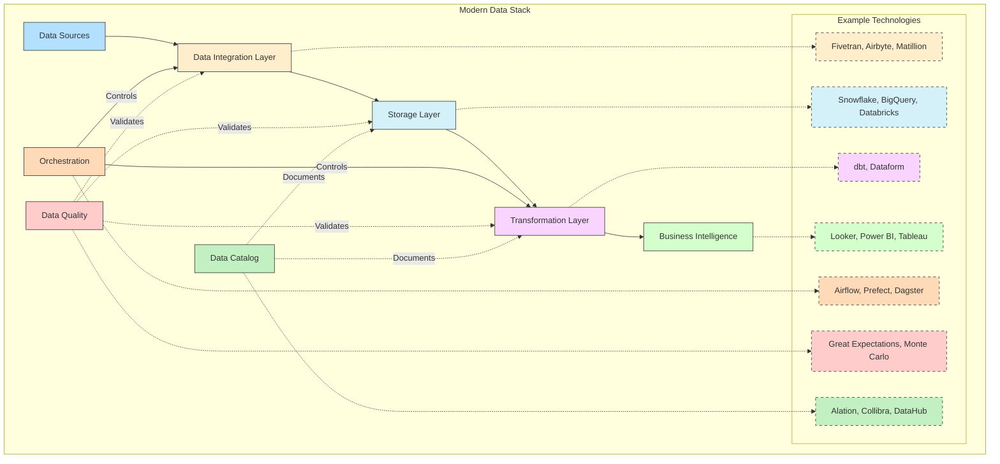

#### **Core Elements**

- **Cloud Data Warehouse/Lakehouse**: Snowflake, BigQuery, Databricks
- **Data Integration Tools**: Fivetran, Airbyte, Matillion
- **Transformation Layer**: dbt, Dataform
- **Business Intelligence**: Looker, Power BI, Tableau
- **Orchestration**: Airflow, Prefect, Dagster
- **Data Quality**: Great Expectations, Monte Carlo, Soda

#### **Architectural Patterns**

- **ELT-Dominant**: Loading before transformation
- **API-First**: Service-oriented integration
- **Self-Service Analytics**: Business-led data exploration
- **Modularity**: Best-of-breed component selection
- **Automation**: Reduced manual intervention

#### **Evolution from Traditional Stack**

| Aspect | Traditional Approach | Modern Data Stack |
|:-------|:--------------------:|:-----------------:|
| **Infrastructure** | 🏢 On-premises, fixed capacity | ☁️ Cloud-native, elastic |
| **Integration** | 🔄 ETL-focused, batch | 🔁 ELT-focused, continuous |
| **Transformation** | 📦 Black-box ETL tools | 💻 Code-first, version-controlled |
| **Development** | 📝 Waterfall, IT-led | 🔄 Agile, collaborative |
| **Consumption** | 📊 Centralized BI | 🔍 Self-service analytics |
| **Governance** | 🔒 Centralized control | 🔄 Federated with guardrails |

> ☁️ **Enterprise Adoption Considerations**
> 
> - Migration strategy from legacy systems
> - Skill development requirements
> - Cost model changes
> - Integration with existing investments

---

### DataOps and MLOps

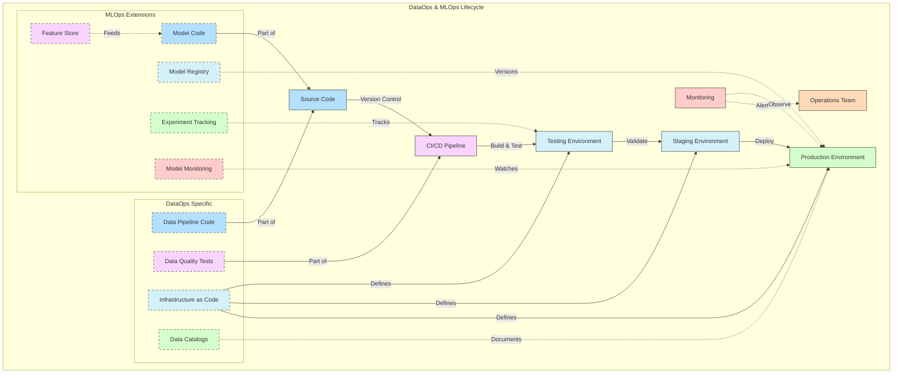

#### **DataOps Core Principles**

- **Automation**: Reducing manual processes
- **Testing**: Continuous validation at all stages
- **Monitoring**: Comprehensive observability
- **Collaboration**: Cross-functional integration
- **Versioning**: Managing code and configuration changes

#### **DataOps Implementation Components**

- **CI/CD for Data**: Automated testing and deployment
- **Infrastructure as Code**: Consistent environment management
- **Metadata-Driven Automation**: Self-adjusting workflows
- **Observability Platforms**: Unified monitoring
- **Collaboration Tools**: Shared knowledge and responsibility

#### **MLOps Extensions**

- **Model Training Pipelines**: Reproducible experimentation
- **Model Registry**: Versioning and lineage
- **Model Serving**: Deployment and scaling
- **Model Monitoring**: Performance and drift detection
- **Feature Store**: Reusable feature management

> 🔄 **Enterprise Implementation Strategies**
> 
> - Maturity assessment and roadmap development
> - Team structure and responsibility definition
> - Tool selection and integration
> - Metrics for measuring success
> - Cultural transformation approach

---

### Semantic Layer Evolution

#### **Semantic Layer Purposes**

- **Business Logic Centralization**: Consistent definitions
- **Technical Abstraction**: Hiding complexity from users
- **Self-Service Enablement**: Empowering business analysis
- **Governance Implementation**: Controlled data access

#### **Traditional vs. Modern Approaches**

| Aspect | Traditional Semantic Layer | Modern Semantic Layer |
|:-------|:-------------------------:|:---------------------:|
| **Implementation** | 📊 Within BI tools | 🧩 Independent platforms |
| **Definition Method** | 🖱️ GUI-based modeling | 💻 Code and configuration |
| **Deployment** | 🔒 Tightly coupled with BI | 🔄 Decoupled, service-oriented |
| **Query Generation** | ⚠️ Limited, proprietary | ✅ Sophisticated, SQL-native |
| **Data Access** | 📑 Usually single source | 🌐 Multi-source federation |

#### **Emerging Semantic Technologies**

- **Headless BI**: dbt Semantic Layer, Cube.js
- **Metrics Stores**: Transform, Secoda
- **Data Contracts**: Defined interfaces between producers and consumers
- **Knowledge Graphs**: Semantic relationship modeling

> 🧩 **Enterprise Implementation Considerations**
> 
> - Balancing flexibility with standardization
> - Integration across analytical tools
> - Performance optimization
> - Governance integration

---

### Real-Time Analytics Evolution

#### **Real-Time Processing Models**

- **Stream Processing**: Continuous event handling
- **Micro-Batch**: Small, frequent batch operations
- **Hybrid Architectures**: Combined streaming and batch

#### **Technology Enablers**

- **Streaming Platforms**: Kafka, Pulsar, Kinesis
- **Processing Engines**: Flink, Spark Streaming, Beam
- **Real-Time Databases**: Druid, ClickHouse, Pinot
- **Real-Time Warehouses**: Snowflake Snowpipe, BigQuery streaming

#### **Analytical Patterns**

- **Operational Analytics**: Business process monitoring
- **Anomaly Detection**: Identifying pattern deviations
- **Real-Time Dashboards**: Live business metrics
- **Alerting and Automation**: Triggering actions from events

> ⚡ **Enterprise Implementation Strategies**
> 
> - Use case prioritization based on latency needs
> - Acceptable latency definition by function
> - Infrastructure right-sizing for peak loads
> - Cost/benefit analysis for real-time vs. near-real-time

---

### Augmented Analytics and AI Integration

#### **AI-Enhanced Data Preparation**

- **Automated Data Discovery**: Finding relevant datasets
- **Intelligent Profiling**: Pattern and anomaly identification
- **Smart Transformation Suggestions**: Proposed data operations
- **Automated Documentation**: AI-generated context

#### **AI-Enhanced Data Analysis**

- **Automated Insights**: Pattern and trend detection
- **Natural Language Querying**: Conversational data interfaces
- **Anomaly Explanation**: Root cause analysis
- **Predictive Analytics**: Forecasting and scenario modeling

#### **Implementation Technologies**

- **AutoML Platforms**: Automated model development
- **Augmented BI Tools**: ThoughtSpot, Power BI Q&A
- **Conversational Analytics**: Natural language interfaces
- **AI-Powered Data Preparation**: Trifacta, Alteryx

> 🧠 **Enterprise Adoption Considerations**
> 
> - Trust and explainability requirements
> - Human-in-the-loop workflow design
> - Integration with existing analytical platforms
> - Skill development for effective AI partnership

---

### Data Mesh Implementation

#### **Practical Implementation Steps**

- **Domain Identification**: Mapping business domains to data responsibilities
- **Data Product Definition**: Standardizing interfaces and quality requirements
- **Self-Serve Platform Development**: Creating enabling infrastructure
- **Federated Governance Model**: Balancing autonomy with standards
- **Operating Model Evolution**: Organizational change management

#### **Technical Implementation Components**

- **Domain-Oriented Storage**: Dedicated resources by domain
- **Data Product Catalogs**: Discovery and metadata management
- **Cross-Domain Integration Layer**: Standardized access patterns
- **Mesh Observability**: Monitoring across domains
- **Governance Implementation**: Distributed with central standards

#### **Organizational Change Aspects**

- Team structure and responsibility definition
- Skill development requirements
- Incentive alignment for data sharing
- Cultural shift to product thinking

> 🔄 **Enterprise Readiness Assessment**
> 
> - Domain clarity and ownership
> - Technical capability evaluation
> - Existing data governance maturity
> - Organizational change readiness

---

### Embedded Analytics Trends

#### **Embedded Analytics Models**

- **Application Integration**: Analytics within operational systems
- **OEM/White Label**: Analytics provided to customers
- **Customer-Facing Dashboards**: External stakeholder insights
- **Workflow Integration**: Analytical support for decisions

#### **Implementation Approaches**

- **iFrame and Component Embedding**: Visual integration
- **API-Based Integration**: Data-level embedding
- **SDK Development**: Customized analytical applications
- **Headless Analytics**: Backend analytical services

#### **Technology Enablers**

- **Embedded BI Platforms**: Power BI Embedded, Looker Embedded
- **Analytics APIs**: Programmatic data access
- **Headless BI Services**: Decoupled analytical engines
- **Frontend Integration Frameworks**: Component libraries

> 📊 **Enterprise Implementation Considerations**
> 
> - Multi-tenancy and security requirements
> - Performance optimization
> - Consistent branding and experience
> - Licensing and commercial models

---

### Emerging Data Storage Technologies

#### **Advancements in Database Technology**

- **Vector Databases**: Similarity search for AI applications
- **Time-Series Optimization**: Purpose-built for temporal data
- **Hybrid Transactional/Analytical Processing (HTAP)**: Unified workloads
- **Serverless Databases**: On-demand scaling and pricing

#### **Storage Format Evolution**

- **Delta Lake**: ACID transactions for data lakes
- **Apache Iceberg**: Table format with schema evolution
- **Apache Hudi**: Record-level updates and deletes
- **Project Nessie**: Git-like versioning for data lakes

#### **Hardware Acceleration**

- **GPU Database Processing**: Massively parallel computation
- **Storage-Class Memory**: Persistent memory performance
- **SmartNICs**: Network interface processing offload
- **Computational Storage**: Processing near storage devices

> 💾 **Enterprise Evaluation Criteria**
> 
> - Workload suitability assessment
> - Operational complexity evaluation
> - Integration with existing investments
> - Total cost of ownership analysis

---

### Data Ethics and Responsible AI

#### **Ethical Framework Components**

- **Fairness**: Preventing and addressing bias
- **Transparency**: Explainable processes and decisions
- **Privacy**: Protecting personal information
- **Security**: Safeguarding data and systems
- **Accountability**: Clear responsibility and oversight

#### **Implementation Approaches**

- **Ethical Review Boards**: Oversight committees
- **Impact Assessments**: Structured evaluation process
- **Monitoring Frameworks**: Ongoing compliance verification
- **Bias Detection Tools**: Automated fairness checking
- **Documentation Standards**: Transparency requirements

#### **Responsible AI Governance**

- Model development guidelines
- Testing requirements for fairness
- Deployment approval processes
- Monitoring and auditing frameworks
- Incident response protocols

> 🧠 **Enterprise Integration Strategies**
> 
> - Executive sponsorship and accountability
> - Integration with existing governance
> - Training and awareness programs
> - Vendor management extensions
> - Regulatory compliance alignment

---

## Conclusion and Next Steps

Enterprise data engineering continues to evolve rapidly, driven by technological innovation, changing business requirements, and increasing data volumes and complexity. Organizations must develop comprehensive strategies that balance innovation with stability, scalability with governance, and technical capability with business value.

### Key Implementation Considerations

- **Strategic Alignment**: Connecting data initiatives to business outcomes
- **Technology Selection**: Balancing innovation with operational stability
- **Talent Development**: Building and retaining necessary skills
- **Governance Integration**: Ensuring appropriate controls without hindering agility
- **Change Management**: Supporting organizational adaptation to new data paradigms

---

### Emerging Focus Areas

- **AI-Powered Data Engineering**: Automation and augmentation of data workflows
- **Data Product Thinking**: Treating data as valuable, managed products
- **Federated Governance Models**: Balancing central control with domain autonomy
- **Sustainable Data Engineering**: Optimizing for environmental and financial efficiency
- **DataOps Maturity**: Applying DevOps principles to data workflows

The most successful enterprises approach data engineering as a strategic capability, investing in both technology and organizational development to derive maximum value from their data assets.

---