Table of contents
=================

<!--ts-->
- [Introduction to Edge Gateways](#introduction-to-edge-gateways)
- [AWS IoT Greengrass V2](#aws-iot-greengrass-v2)
  - [AWS IoT Service Ecosystem](#aws-iot-service-ecosystem)
  - [Architecture and Key Concepts](#architecture-and-key-concepts)
  - [Deployment and Management](#deployment-and-management)
  - [Security Framework](#security-framework)
- [Azure IoT Edge](#azure-iot-edge)
  - [Architecture and Services](#architecture-and-services)
  - [Gateway Types](#gateway-types)
  - [Security Model](#security-model)
  - [DevOps and Monitoring](#devops-and-monitoring)
- [Comparing Edge Computing Platforms](#comparing-edge-computing-platforms)

<!--te-->

## Introduction to Edge Gateways

Edge gateways serve as critical components in Industrial IoT architectures, bridging the gap between operational technology (OT) devices and cloud infrastructure while enabling local processing capabilities.

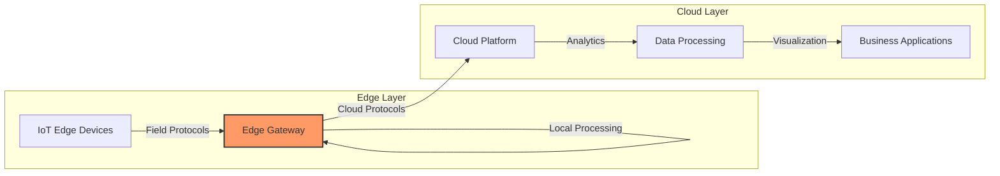

A Smart Edge Gateway Platform serves as a central node in the IoT ecosystem, enabling seamless communication between devices and cloud services through multiple capabilities:

1. **Protocol Translation**: Converts between industrial protocols (Modbus, OPC-UA, etc.) and cloud communication protocols (MQTT, AMQP, HTTP)
2. **Local Processing**: Executes applications at the edge for real-time analytics and decision-making
3. **Connectivity Management**: Maintains reliable connections with both field devices and cloud platforms
4. **Data Filtering**: Reduces bandwidth consumption by processing and filtering data before cloud transmission
5. **Security Enforcement**: Implements authentication, encryption, and access control at the edge

Smart gateways enable industrial organizations to:
- Reduce latency for time-sensitive operations
- Operate during internet connectivity disruptions
- Decrease cloud bandwidth and storage costs
- Implement security controls closer to data sources
- Deploy edge applications for local intelligence

## AWS IoT Greengrass V2

AWS IoT Greengrass is an edge runtime and cloud service that helps build, deploy, and manage device software. It extends AWS services to edge devices, allowing them to operate even with intermittent connectivity.

### AWS IoT Service Ecosystem

AWS IoT Greengrass exists within a broader ecosystem of complementary AWS IoT services:

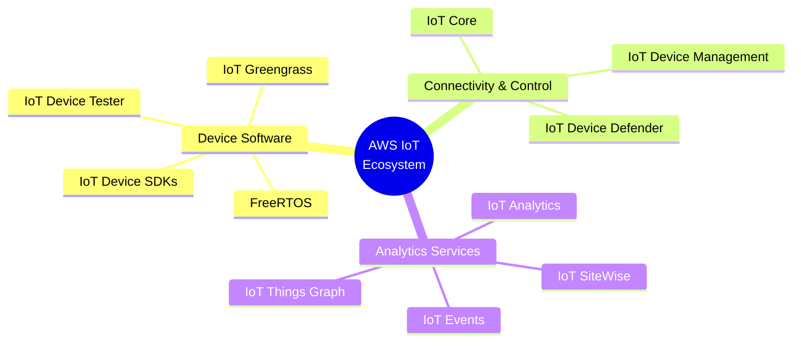

This ecosystem provides a comprehensive set of tools and services for developing, deploying, and managing IoT solutions:

- **Device Software**: Enables edge functionality and connectivity for various device types
  - *FreeRTOS*: Operating system for microcontrollers with direct AWS cloud connectivity
  - *IoT Device SDKs*: Libraries for connecting to AWS IoT services
  - *IoT Greengrass*: Edge runtime for extended cloud capabilities
  - *IoT Device Tester*: Validation tools for device compatibility

- **Connectivity & Control Services**: Establish secure cloud communications and device management
  - *IoT Core*: Managed service for device connectivity
  - *IoT Device Management*: Fleet provisioning and management
  - *IoT Device Defender*: Security monitoring and auditing

- **Analytics Services**: Process and analyze device data
  - *IoT SiteWise*: Industrial equipment data collection and analysis
  - *IoT Analytics*: Data processing pipelines for IoT data
  - *IoT Events*: Event detection and response
  - *IoT Things Graph*: Visual service to connect devices and web services

### Architecture and Key Concepts

AWS Greengrass V2 is architected around a component-based model with modular functionality:

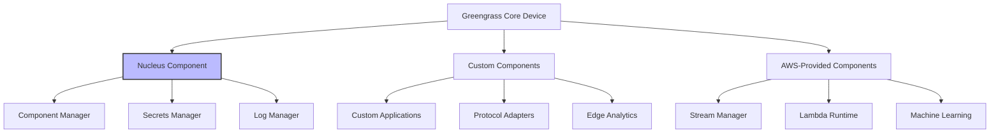

Key Greengrass V2 concepts include:

1. **Greengrass Nucleus**: The core runtime component that provides minimum functionality for device deployment. It manages lifecycle, deployment, and local communications.

2. **Components**: Modular software packages that extend functionality:
   - **AWS-provided components**: Pre-built components for common functionality
   - **Custom components**: Developer-created components for specific use cases
   - **Community components**: Shared through AWS Marketplace or other channels

3. **Recipes**: YAML configuration files that define component metadata, dependencies, lifecycle, and configuration.

4. **Deployments**: Configuration packages that define which components should run on specific devices or device groups.

5. **IPC (Inter-Process Communication)**: Communication mechanism between components using a publish-subscribe model.

### Deployment and Management

Greengrass V2 provides multiple deployment options to accommodate various operational requirements:

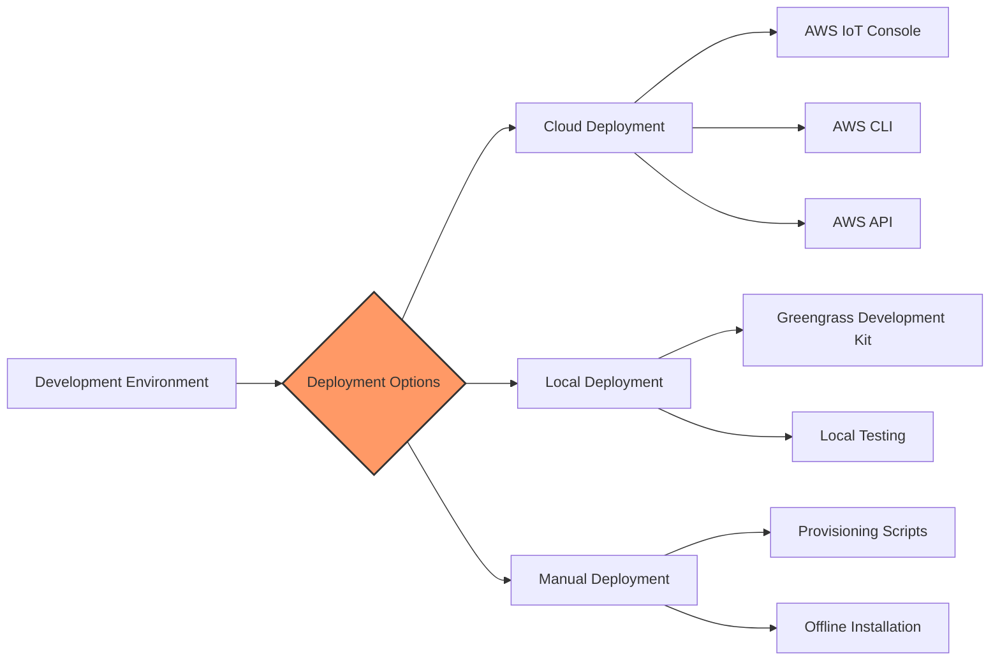

#### Component Lifecycle

Components follow a defined lifecycle that enables management across the deployment process:

1. **Install**: Component is downloaded and installed on the device
2. **Configure**: Component is configured according to deployment settings
3. **Bootstrap**: Preparation steps before startup
4. **Run**: Component actively running
5. **Shutdown**: Graceful termination when stopping
6. **Recover**: Error handling for recovery from failure

AWS-provided components extend Greengrass functionality with pre-built modules for common tasks like:
- Stream Manager (data stream management)
- Lambda Runtime (serverless function execution)
- Machine Learning Inference
- Secret Manager (secure credential management)
- Log Manager (log collection and forwarding)

#### Data Stream Management

Greengrass provides capabilities for efficiently managing data streams at the edge:

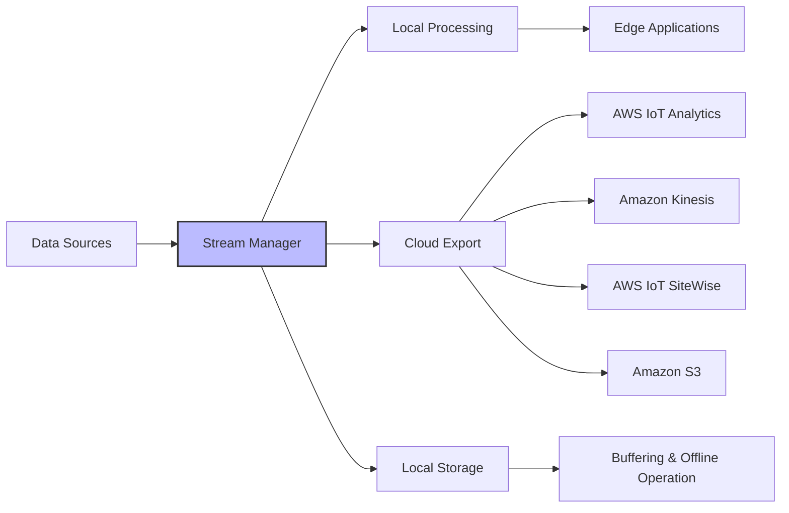

Stream Manager provides:
- Automatic export to AWS cloud services
- Local persistence for offline operation
- Bandwidth optimization through batching and compression
- Priority-based stream processing
- Configurable time-to-live (TTL) for data

### Security Framework

AWS IoT Greengrass implements a comprehensive security model based on AWS's shared responsibility approach:

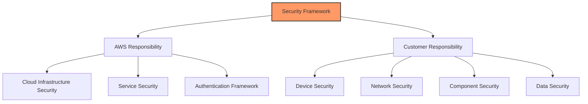

Security features include:

1. **Device Authentication**: X.509 certificates for device identity
2. **Secure Communication**: TLS 1.2+ for all network communications
3. **Hardware Security**: Integration with hardware security modules and secure elements
4. **Secret Management**: Secure distribution of credentials to edge components
5. **Role-based Access**: IAM roles for components to access AWS services
6. **Component Isolation**: Configurable isolation between components
7. **Secure Updates**: Verified component deployment and updates

## Azure IoT Edge

Azure IoT Edge is Microsoft's intelligent edge offering that extends cloud capabilities to the edge through a modular, containerized approach.

### Architecture and Services

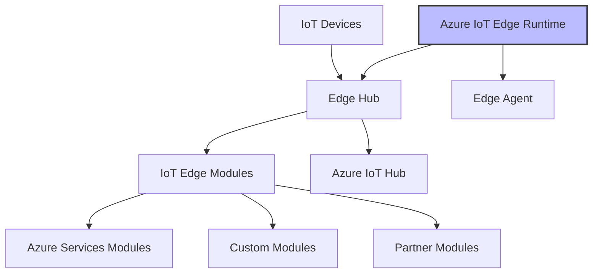

Azure IoT Edge offers:

1. **IoT Edge Runtime**: Core system components that manage modules and communication
   - **Edge Hub**: Local proxy for IoT Hub providing connectivity even when offline
   - **Edge Agent**: Deploys and monitors modules

2. **Modules**: Docker-compatible containers that provide functionality
   - **Azure Service Modules**: Pre-built modules (Stream Analytics, Functions, etc.)
   - **Custom Modules**: Developer-created containers for specific use cases
   - **Partner Modules**: Third-party solutions from Microsoft partners

3. **Module Twin**: JSON documents storing module configuration and state

4. **Direct Methods**: Cloud-to-device commands for remote control

### Gateway Types

Azure IoT Edge supports multiple gateway patterns to accommodate different device connectivity scenarios:

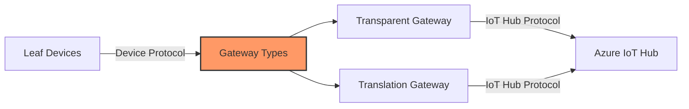

#### Transparent Gateway

A transparent gateway maintains device identity while providing connectivity to Azure IoT Hub:

- Leaf devices maintain their own identity in IoT Hub
- Each device has a unique connection to the cloud
- Gateway provides connectivity and offline caching
- Authentication and authorization for each device

This approach is ideal when devices are capable of using IoT Hub protocols but may have intermittent connectivity.

#### Translation Gateway

A translation gateway represents downstream devices to the cloud:

- Gateway has a single identity in IoT Hub
- Downstream devices are represented as components
- Gateway translates between device protocols and cloud protocols
- Simplifies management of large device fleets

This approach is best for integrating legacy devices or those using protocols not supported by IoT Hub.

### Security Model

Azure IoT Edge implements multiple security layers to protect edge deployments:

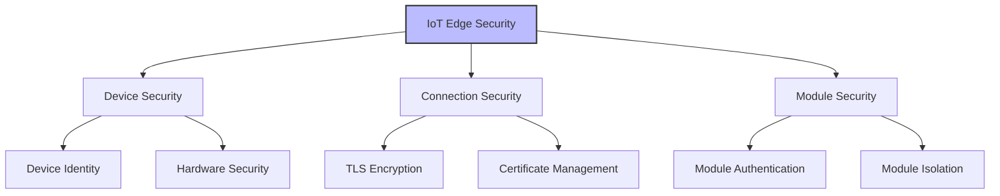

Key security features include:

1. **Security Manager**: Manages security credentials and certificates
2. **Daemon Architecture**: Separates security operations from application code
3. **Device Attestation**: Verifies device identity and state
4. **Certificate Management**: Automated certificate lifecycle management
5. **Container Isolation**: Secures modules from each other and the host
6. **Hardware Security**: Support for hardware security modules
7. **Secure Communication**: TLS encryption for all network traffic

### DevOps and Monitoring

Azure IoT Edge provides comprehensive tools for development, deployment, and monitoring:

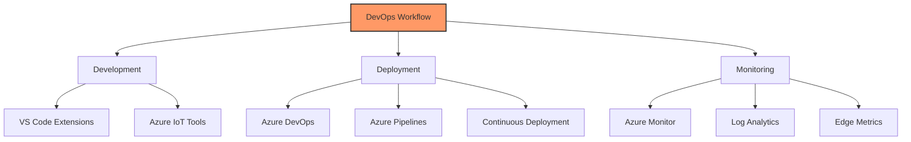

**Development Tools**:
- Visual Studio Code Extensions for IoT Edge
- Azure IoT Edge for VS Code
- Azure IoT Hub Toolkit
- Azure IoT Edge Dev Tool

**Deployment Services**:
- Azure DevOps integration
- CI/CD pipeline support
- Automated testing frameworks
- Layered deployment capability

**Monitoring Features**:
- Built-in metrics collection
- Custom metrics support
- Integration with Azure Monitor
- Log Analytics for edge device logs
- Alerts and notifications

## Comparing Edge Computing Platforms

When selecting an edge gateway platform, organizations should evaluate options against their specific requirements:

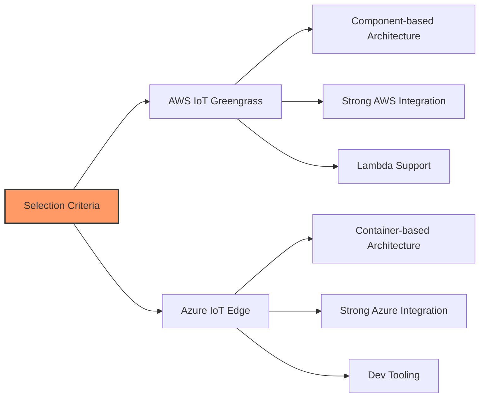

**AWS IoT Greengrass Strengths**:
- Native integration with AWS services
- Component-based architecture for modularity
- Serverless computing at the edge with Lambda
- Streamlined data integration with AWS analytics services
- Lightweight deployment options for constrained devices

**Azure IoT Edge Strengths**:
- Container-based architecture with Docker compatibility
- Strong developer tooling ecosystem
- Seamless integration with Azure IoT Hub and services
- Flexible gateway patterns for legacy device integration
- Robust CI/CD capabilities through Azure DevOps

Key considerations when selecting an edge platform:
1. Existing cloud platform investments
2. Development team expertise
3. Hardware constraints and compatibility
4. Connectivity requirements
5. Security and compliance needs
6. Scalability requirements
7. Integration with existing systems

By carefully evaluating these factors against organizational requirements, enterprises can select the edge gateway platform that best aligns with their industrial IoT strategy.

---

# Edge Gateway Implementation Guide

This guide provides practical recommendations for planning, deploying, and managing edge gateways in industrial environments.

## Planning Your Edge Gateway Deployment

### Requirements Analysis

Before selecting an edge gateway solution, conduct a thorough requirements analysis:

1. **Connectivity Requirements**
   - Which protocols are used by your field devices? (Modbus, OPC-UA, BACnet, etc.)
   - What is your cloud connectivity method? (Ethernet, Wi-Fi, Cellular)
   - What are your bandwidth constraints?

2. **Processing Requirements**
   - What local processing will be needed? (Data filtering, analytics, ML inference)
   - What are the latency requirements for critical operations?
   - Will you need to operate during internet outages?

3. **Security Requirements**
   - What security standards must be met? (IEC 62443, NIST, etc.)
   - Are there specific authentication requirements?
   - What data encryption standards are necessary?

4. **Environmental Considerations**
   - Operating temperature range
   - Humidity and dust conditions
   - Power supply reliability
   - Physical security requirements

### Platform Selection

When choosing between AWS Greengrass and Azure IoT Edge:

**Select AWS Greengrass when:**
- You have existing AWS infrastructure
- You need fine-grained component management
- Your applications are developed in Lambda-compatible languages
- You have constrained hardware resources

**Select Azure IoT Edge when:**
- You have existing Azure infrastructure
- Your applications are containerized
- You need strong developer tooling support
- You require comprehensive gateway patterns for legacy devices

## Implementation Steps

### AWS Greengrass Implementation

1. **Prepare Your Environment**
   - Create an AWS account and configure IAM roles
   - Set up AWS IoT Core resources
   - Configure device certificates

2. **Configure Your Device**
   - Install required dependencies (Java, Python, etc.)
   - Set up AWS credentials
   - Configure network access to AWS

3. **Deploy Core Software**
   - Install Greengrass nucleus
   - Configure core device settings
   - Test initial connectivity

4. **Create Components**
   - Develop or select required components
   - Create component recipes
   - Test components locally

5. **Deploy Components**
   - Create deployment configuration
   - Deploy to test devices
   - Validate component functionality

### Azure IoT Edge Implementation

1. **Prepare Your Environment**
   - Create an Azure account
   - Set up Azure IoT Hub
   - Register edge devices

2. **Configure Your Device**
   - Install container runtime (Docker/Moby)
   - Install IoT Edge runtime
   - Configure device connection

3. **Deploy Modules**
   - Develop or select required modules
   - Create deployment manifests
   - Test module functionality locally

4. **Configure Gateway Mode**
   - Set up certificates for transparent gateway (if needed)
   - Configure downstream device communication
   - Test leaf device connectivity

5. **Deploy to Production**
   - Use Azure DevOps for CI/CD
   - Monitor initial deployment
   - Validate end-to-end functionality

## Operations Best Practices

### Monitoring and Maintenance

1. **Establish Monitoring Procedures**
   - Configure metrics collection
   - Set up alerts for critical conditions
   - Implement log management

2. **Implement Update Strategies**
   - Develop testing procedures for updates
   - Create rollback plans
   - Implement staged deployment approaches

3. **Security Management**
   - Regular certificate rotation
   - Security patch management
   - Vulnerability scanning

### Scaling Your Deployment

1. **Device Management**
   - Implement device grouping strategies
   - Create deployment groups for phased rollouts
   - Develop device provisioning automation

2. **Performance Optimization**
   - Monitor resource usage
   - Implement message batching for efficiency
   - Configure appropriate data retention policies

3. **Reliability Enhancements**
   - Configure offline operation capabilities
   - Implement local storage management
   - Create failure recovery procedures

## Common Challenges and Solutions

1. **Connectivity Issues**
   - Implement connection monitoring
   - Configure retry policies
   - Provide local caching during outages

2. **Resource Constraints**
   - Monitor CPU, memory, and storage usage
   - Implement resource limits for components/modules
   - Optimize message payloads

3. **Security Management**
   - Automate certificate management
   - Implement device attestation
   - Configure network segmentation

4. **Legacy Device Integration**
   - Deploy protocol adapter components
   - Implement store-and-forward capabilities
   - Create device shadows for intermittent devices

By following these guidelines, organizations can successfully implement edge gateway solutions that provide robust, secure, and efficient industrial IoT capabilities.

---
