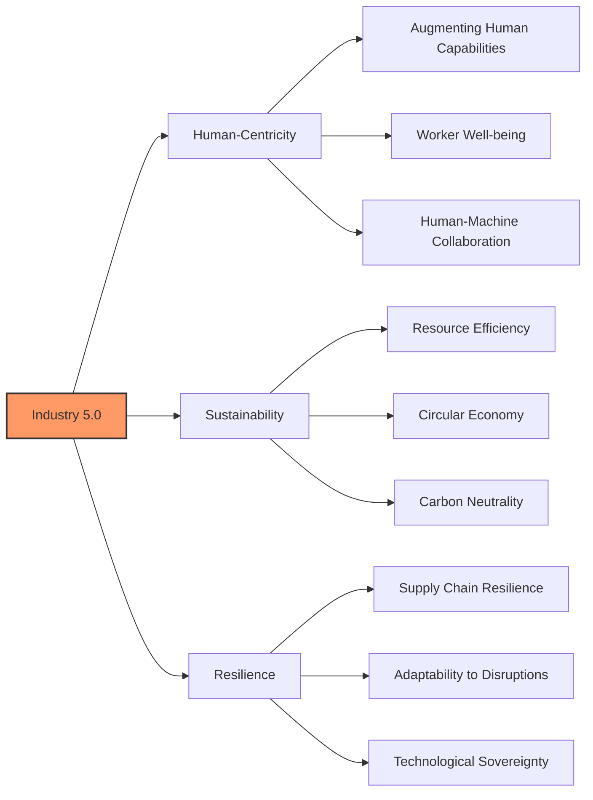
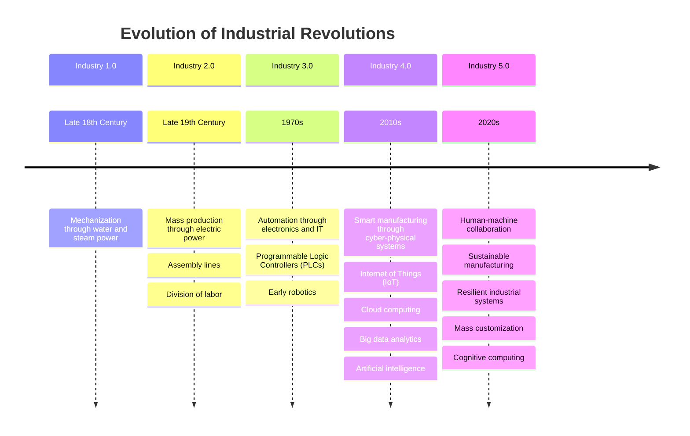
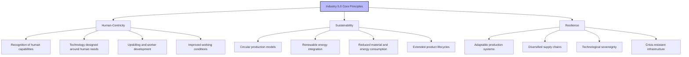
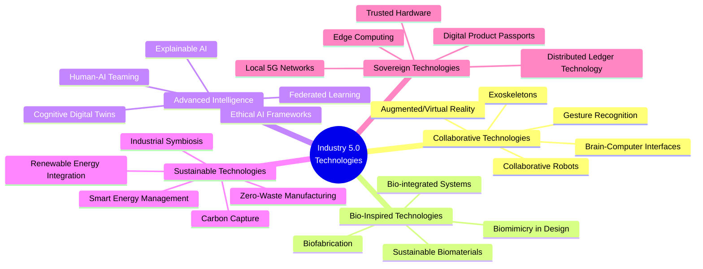
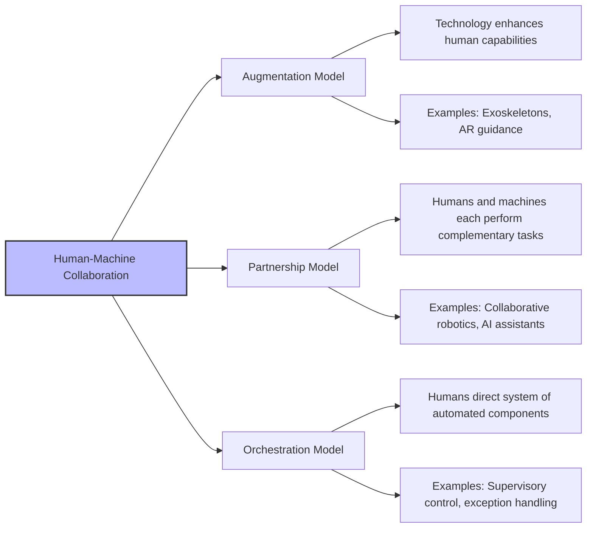
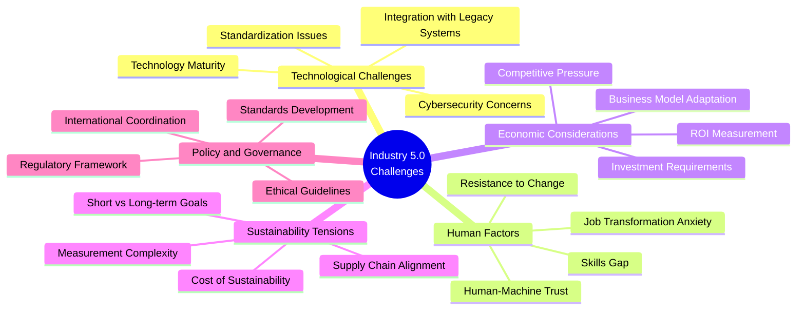

# Industry 5.0: The Human-Centered, Sustainable and Resilient Industrial Revolution

## Table of Contents
- [Introduction to Industry 5.0](#introduction-to-industry-50)
- [Evolution: From Industry 4.0 to 5.0](#evolution-from-industry-40-to-50)
- [Core Principles of Industry 5.0](#core-principles-of-industry-50)
- [Enabling Technologies](#enabling-technologies)
- [Implementation Framework](#implementation-framework)
- [Human-Machine Collaboration Models](#human-machine-collaboration-models)
- [Sustainability Approaches](#sustainability-approaches)
- [Case Studies and Early Adoption](#case-studies-and-early-adoption)
- [Challenges and Considerations](#challenges-and-considerations)
- [Future Outlook](#future-outlook)

## Introduction to Industry 5.0

Industry 5.0 represents a significant evolution in industrial development, focusing on the synergistic collaboration between humans and machines rather than simply automating human work. While Industry 4.0 centered on digitalization and smart factories, Industry 5.0 reintroduces the human element into manufacturing systems, recognizing the unique value that human creativity, judgment, and adaptability bring to industrial processes.

This paradigm shift represents a more balanced approach to industrial progress that moves beyond productivity and efficiency to encompass broader societal and environmental values. Industry 5.0 aims to ensure that technological advancement serves people and planet, not just profit.

The European Commission formally introduced the Industry 5.0 concept in 2021, defining it as an approach that "complements the existing Industry 4.0 paradigm by highlighting research and innovation as drivers for a transition to a sustainable, human-centric, and resilient European industry."

## Evolution: From Industry 4.0 to 5.0

The industrial world has evolved through five distinct revolutionary phases, each building upon the advances of the previous era while introducing new capabilities and priorities.

Industry 5.0 doesn't replace Industry 4.0 but rather complements and extends it in several key ways:

| Industry 4.0 | Industry 5.0 |
|--------------|--------------|
| Machine-centric | Human-centric |
| Technology as replacement for humans | Technology as enhancement for humans |
| Focus on efficiency and productivity | Balance of efficiency with sustainability and human well-being |
| Mass production | Mass customization and personalization |
| Automation of physical and cognitive tasks | Collaborative intelligence between humans and machines |
| Data-driven optimization | Value-driven innovation |
| Centralized intelligence | Distributed intelligence |

This evolution represents a significant shift in how we conceptualize the role of technology in manufacturing environments. While Industry 4.0 focused primarily on connecting machines and systems to create smart factories, Industry 5.0 emphasizes how those connected systems can work alongside humans to create more value for all stakeholders, including society and the environment.

## Core Principles of Industry 5.0

Industry 5.0 is built upon three fundamental pillars that guide its implementation and development:

### Human-Centricity

The human-centric approach of Industry 5.0 goes beyond ergonomics and safety to place human needs and capabilities at the center of production processes. Key aspects include:

- **Cognitive Ergonomics**: Designing systems that complement human cognitive capabilities rather than straining them
- **Worker Empowerment**: Providing workers with decision-making authority supported by technology
- **Skills Development**: Continuous learning and upskilling to adapt to evolving technological environments
- **Inclusive Design**: Creating technologies and processes accessible to diverse worker populations
- **Work-Life Enhancement**: Using technology to improve quality of work life and overall well-being

### Sustainability

Industry 5.0 embraces a comprehensive approach to sustainability that integrates environmental responsibility throughout the production lifecycle:

- **Circular Economy Integration**: Designing products for reuse, remanufacturing, and recycling
- **Carbon-Neutral Manufacturing**: Aiming for net-zero emissions through process redesign and renewable energy
- **Resource Efficiency**: Minimizing material and energy inputs for production
- **Environmental Impact Reduction**: Moving beyond compliance to regenerative approaches
- **Lifecycle Consideration**: Accounting for environmental impact from raw material extraction to end-of-life

### Resilience

The resilience principle focuses on creating robust industrial systems that can withstand disruptions and adapt to changing conditions:

- **Supply Chain Resilience**: Developing flexible, diverse, and local supply networks
- **Technology Sovereignty**: Reducing critical dependencies on external technologies
- **Adaptive Manufacturing**: Creating production systems that can rapidly shift to meet changing needs
- **Distributed Production**: Moving toward localized manufacturing networks
- **Crisis Preparedness**: Building capabilities to maintain operations during disruptions

These three core principles work together to create manufacturing systems that are not only efficient and productive but also environmentally sustainable, socially beneficial, and economically resilient.

## Enabling Technologies

Industry 5.0 leverages both existing Industry 4.0 technologies and emerging innovations to create human-centric, sustainable, and resilient manufacturing environments:

These technologies enable several key capabilities essential to Industry 5.0 implementation:

### Collaborative Technologies

Technologies like collaborative robots (cobots) and augmented reality systems enable seamless human-machine collaboration:

- **Cobots**: Robots designed to work alongside humans, combining human flexibility with robotic precision
- **Wearable Technologies**: Exoskeletons and smart glasses that enhance human capabilities
- **Intuitive Interfaces**: Natural language processing and gesture recognition for human-machine interaction
- **Digital Workspaces**: Augmented and virtual reality environments for enhanced training and operation

### Bio-Inspired Technologies

Bio-inspired approaches bring natural principles to industrial processes, enhancing sustainability:

- **Biomimetic Design**: Product and process design inspired by natural systems
- **Biofabrication**: Using biological systems to produce materials and products
- **Bio-integrated Sensing**: Environmental and process monitoring using biological principles
- **Regenerative Approaches**: Manufacturing processes that restore rather than deplete

### Advanced Intelligence

Sophisticated AI systems that work with humans rather than replacing them:

- **Explainable AI**: Systems that provide understandable reasoning for their decisions
- **Human-in-the-Loop Systems**: AI that incorporates human judgment at critical points
- **Cognitive Assistance**: AI systems that enhance human decision-making capabilities
- **Adaptive Learning**: Systems that learn from and adapt to individual human workers

### Sustainable Technologies

Technologies that minimize environmental impact and resource consumption:

- **Renewable Energy Integration**: Incorporating solar, wind, and other renewable sources
- **Circular Manufacturing Systems**: Technologies enabling material reuse and recycling
- **Smart Resource Management**: AI-optimized resource allocation and waste reduction
- **Carbon-Neutral Technologies**: Systems designed to eliminate or offset carbon emissions

### Sovereign Technologies

Technologies that enhance resilience through reduced dependencies:

- **Distributed Manufacturing**: Local production using advanced manufacturing technologies
- **Edge Computing**: Localized data processing reducing dependence on cloud infrastructure
- **Open-Source Platforms**: Reducing dependency on proprietary technologies
- **Digital Product Passports**: Enhancing transparency and traceability across supply chains

These technologies work together to create industrial systems that augment human capabilities, minimize environmental impact, and build resilience against disruptions.

## Implementation Framework

Implementing Industry 5.0 requires a structured approach that accounts for technological, human, environmental, and organizational factors:

```mermaid
graph TB
    A[Industry 5.0 Implementation] --> B[Assessment Phase]
    A --> C[Design Phase]
    A --> D[Deployment Phase]
    A --> E[Evolution Phase]
    
    B --> B1[Current Capability Assessment]
    B --> B2[Stakeholder Analysis]
    B --> B3[Sustainability Audit]
    B --> B4[Resilience Evaluation]
    
    C --> C1[Technology Selection]
    C --> C2[Human-Centered Design]
    C --> C3[Sustainability Integration]
    C --> C4[Resilience Planning]
    
    D --> D1[Pilot Implementation]
    D --> D2[Worker Training]
    D --> D3[Process Integration]
    D --> D4[Performance Monitoring]
    
    E --> E1[Continuous Improvement]
    E --> E2[Capability Building]
    E --> E3[Innovation Integration]
    E --> E4[Knowledge Management]
    
    style A fill:#f96,stroke:#333,stroke-width:2px
```

### Assessment Phase

The initial phase focuses on understanding the current state of operations and identifying opportunities for improvement:

- **Capability Mapping**: Assessing existing technological and human capabilities
- **Value Stream Analysis**: Identifying areas for human-machine collaboration
- **Environmental Impact Assessment**: Evaluating current sustainability performance
- **Vulnerability Analysis**: Identifying resilience gaps and critical dependencies

### Design Phase

The design phase involves creating systems that embody Industry 5.0 principles:

- **Human-Centered Technology Selection**: Choosing technologies that augment human capabilities
- **Sustainable Process Design**: Redesigning processes to minimize environmental impact
- **Resilient Architecture Development**: Creating adaptable and robust systems
- **Collaborative Workspace Design**: Developing environments that facilitate human-machine collaboration

### Deployment Phase

Implementation requires careful integration of new technologies and approaches:

- **Pilot Implementation**: Testing in controlled environments before full deployment
- **Worker Engagement**: Involving workers in the implementation process
- **Skills Development**: Training for new technologies and collaborative approaches
- **Change Management**: Supporting organizational transition to new ways of working

### Evolution Phase

Industry 5.0 implementation is not a one-time project but an ongoing evolution:

- **Continuous Improvement**: Regular assessment and enhancement of systems
- **Innovation Integration**: Incorporating emerging technologies and approaches
- **Knowledge Building**: Developing organizational understanding of Industry 5.0 principles
- **Ecosystem Development**: Building networks of partners and suppliers aligned with Industry 5.0 values

This phased approach helps organizations systematically transform their operations to embrace the human-centric, sustainable, and resilient principles of Industry 5.0.

## Human-Machine Collaboration Models

Industry 5.0 introduces new models for collaboration between humans and machines, moving beyond the replacement paradigm to one of augmentation and partnership:

### Augmentation Model

In the augmentation model, technology directly enhances human capabilities:

- **Physical Augmentation**: Exoskeletons and powered tools that enhance strength and endurance
- **Cognitive Augmentation**: Decision support systems and knowledge management tools
- **Sensory Augmentation**: Enhanced reality systems that provide additional information
- **Skill Augmentation**: Guidance systems that facilitate complex tasks

### Partnership Model

The partnership model involves humans and machines working side by side on complementary tasks:

- **Task Allocation**: Assigning tasks based on comparative advantages
- **Adaptive Collaboration**: Shifting responsibilities based on changing conditions
- **Mutual Awareness**: Systems that understand human intentions and vice versa
- **Shared Workspaces**: Physical and digital environments designed for collaboration

### Orchestration Model

In the orchestration model, humans direct systems of automated components:

- **Supervisory Control**: Humans monitoring and directing automated processes
- **Exception Handling**: Automation handling routine tasks, humans managing exceptions
- **Strategic Direction**: Humans setting goals, machines determining execution
- **Process Optimization**: Humans and AI jointly optimizing complex processes

These collaboration models are not mutually exclusive but can be applied in different contexts or combined within a single production environment. The key principle is that technology serves to enhance human capabilities rather than simply replacing human labor.

## Sustainability Approaches

Industry 5.0 embraces comprehensive sustainability strategies that go beyond basic environmental compliance to create regenerative industrial systems:

```mermaid
graph TD
    A[Sustainability Approaches] --> B[Circular Economy Integration]
    A --> C[Resource Optimization]
    A --> D[Clean Energy Transformation]
    A --> E[Sustainable Product Design]
    
    B --> B1[Remanufacturing]
    B --> B2[Material Recovery]
    B --> B3[Waste-to-Resource]
    B --> B4[Industrial Symbiosis]
    
    C --> C1[Digital Twin Optimization]
    C --> C2[AI-Driven Efficiency]
    C --> C3[Lean-Green Manufacturing]
    C --> C4[Zero-Waste Processes]
    
    D --> D1[Renewable Integration]
    D --> D2[Energy Storage]
    D --> D3[Smart Grid Connection]
    D --> D4[Carbon Capture]
    
    E --> E1[Design for Longevity]
    E --> E2[Design for Disassembly]
    E --> E3[Sustainable Materials]
    E --> E4[Lifecycle Assessment]
    
    style A fill:#bfb,stroke:#333,stroke-width:2px
```

### Circular Economy Integration

Industry 5.0 embraces circular economy principles to eliminate waste and maximize resource value:

- **Closed-Loop Manufacturing**: Processes that recapture and reuse materials
- **Product-as-a-Service**: Business models that maintain manufacturer ownership of products
- **Remanufacturing Systems**: Facilities designed to restore used products to like-new condition
- **Industrial Symbiosis**: Networks where one facility's waste becomes another's raw material

### Resource Optimization

Advanced technologies enable unprecedented resource efficiency:

- **Digital Twin Simulation**: Optimizing processes virtually before physical implementation
- **AI-Driven Material Minimization**: Algorithms that reduce material usage while maintaining performance
- **Predictive Maintenance**: Preventing waste from equipment failure
- **Just-in-Time Resource Management**: Minimizing inventory and associated waste

### Clean Energy Transformation

Energy strategies focus on renewable sources and intelligent usage:

- **On-Site Renewable Generation**: Integrating solar, wind, and other renewable sources
- **Energy Recovery Systems**: Capturing and reusing waste heat and kinetic energy
- **Smart Energy Management**: AI-optimized energy usage based on production needs
- **Carbon-Neutral Manufacturing**: Eliminating or offsetting all carbon emissions

### Sustainable Product Design

Sustainability considerations are integrated from the earliest design stages:

- **Design for Longevity**: Creating products with extended useful lives
- **Design for Disassembly**: Facilitating easy separation of components for repair or recycling
- **Material Selection**: Choosing renewable, recyclable, or biodegradable materials
- **Lifecycle Assessment Integration**: Evaluating environmental impact across the entire product lifecycle

These approaches work together to create truly sustainable industrial systems that not only reduce environmental impact but actively contribute to ecological restoration.

## Case Studies and Early Adoption

Organizations worldwide are beginning to implement Industry 5.0 principles, demonstrating the practical value of human-centric, sustainable, and resilient approaches:

### Siemens Electronics Factory (Amberg, Germany)

Siemens' Amberg facility demonstrates advanced human-machine collaboration:

- **Collaborative Automation**: Workers oversee and collaborate with automated systems
- **Digital Twin Integration**: Real-time optimization through digital simulation
- **Personalized Production**: High customization while maintaining efficiency
- **Worker Augmentation**: AR systems guide workers through complex tasks
- **Results**: 99.9% quality rate with 75% increase in productivity

### Schneider Electric Smart Factory (Lexington, KY, USA)

Schneider Electric's facility showcases sustainability integration:

- **Carbon Neutrality**: 100% renewable energy and carbon offset programs
- **Zero Waste to Landfill**: Comprehensive recycling and waste reduction
- **Digital Energy Management**: Real-time energy optimization
- **Circular Material Flows**: Closed-loop material recovery systems
- **Results**: 26% energy reduction and 78% carbon footprint reduction

### Novo Nordisk Pharmaceutical Production (Kalundborg, Denmark)

Novo Nordisk demonstrates industrial symbiosis and resilience:

- **Industrial Ecosystem**: Waste products from production become inputs for other processes
- **Localized Supply Chain**: Reduced dependency on global suppliers
- **Adaptive Manufacturing**: Systems that can rapidly shift production focus
- **Bio-Based Production**: Using biological processes to reduce environmental impact
- **Results**: 70% reduction in CO2 emissions and enhanced supply security

### Toyota's Human-Centered Factory (Takaoka, Japan)

Toyota exemplifies the human-centric approach:

- **Human Judgment Integration**: Critical decisions remain with skilled workers
- **Physical Augmentation**: Exoskeletons and assistive devices for workers
- **Skills Development**: Continuous worker training and capability building
- **Jidoka Principle**: Automation with human intelligence
- **Results**: Improved worker satisfaction and 20% productivity increase

These case studies demonstrate that Industry 5.0 principles are not merely theoretical but are already being successfully implemented by leading manufacturers. They show that human-centricity, sustainability, and resilience can be achieved while maintaining or enhancing productivity and profitability.

## Challenges and Considerations

Implementing Industry 5.0 presents several challenges that organizations must address:

### Technological Challenges

The technical implementation of Industry 5.0 faces several obstacles:

- **Legacy System Integration**: Connecting new technologies with existing infrastructure
- **Technology Maturity**: Many needed technologies are still evolving
- **Interoperability**: Ensuring different systems can communicate effectively
- **Security Concerns**: Increased connectivity creating new vulnerabilities

### Human Factors

The human element presents its own set of challenges:

- **Skills Development**: Workers need new capabilities to thrive in Industry 5.0 environments
- **Organizational Culture**: Many companies remain focused on automation rather than augmentation
- **Change Management**: Transitioning to new work paradigms requires careful management
- **Human-Machine Trust**: Building appropriate levels of trust in collaborative systems

### Economic Considerations

Financial aspects must be carefully managed:

- **Investment Requirements**: Significant capital may be needed for transformation
- **Return Measurement**: Traditional ROI metrics may not capture all benefits
- **Business Model Evolution**: New approaches to value creation and capture
- **Competitive Dynamics**: Balancing short-term competitiveness with long-term transformation

### Sustainability Tensions

Implementing true sustainability involves resolving several tensions:

- **Cost Considerations**: Sustainable approaches may have higher initial costs
- **Value Chain Alignment**: Ensuring suppliers and customers support sustainability goals
- **Measurement Challenges**: Quantifying environmental and social impact
- **Regulatory Compliance**: Navigating complex and evolving environmental regulations

### Policy and Governance

The broader ecosystem requires supportive frameworks:

- **Regulatory Environment**: Need for policies that support Industry 5.0 principles
- **Standards Development**: Creating common standards for interoperability and assessment
- **Public-Private Collaboration**: Coordinating efforts across sectors
- **Global Coordination**: Aligning approaches across countries and regions

Addressing these challenges requires a multifaceted approach involving technological innovation, organizational development, policy evolution, and stakeholder collaboration. Organizations implementing Industry 5.0 should develop strategies to systematically address these challenges as part of their transformation process.

## Future Outlook

The evolution of Industry 5.0 is expected to significantly reshape manufacturing and industrial processes over the next decade:

### Near-Term Developments (1-3 Years)

The immediate future will likely see:

- Widespread adoption of collaborative robots and AR/VR systems in manufacturing
- Integration of explainable AI for human-machine collaboration
- Increased implementation of energy management systems
- Development of industry standards for human-machine interfaces
- Pilot implementations of circular manufacturing approaches

### Mid-Term Developments (3-7 Years)

As the paradigm matures, we may expect:

- Advanced biologically-inspired manufacturing processes
- Mainstream adoption of cognitive digital twins
- Sophisticated human augmentation technologies
- Distributed, resilient supply networks becoming standard
- Carbon-neutral manufacturing becoming a competitive necessity
- Regulatory frameworks specifically addressing Industry 5.0

### Long-Term Vision (7+ Years)

The full realization of Industry 5.0 could include:

- Seamless human-machine cognitive collaboration
- Regenerative manufacturing systems that restore environments
- Self-sustaining, adaptable production networks
- Customization at mass production efficiency
- Industrial processes fully integrated with circular economies
- New business models based on sustainable value creation

### Strategic Implications

Organizations should consider several strategic implications:

- The competitive advantage will increasingly come from human-machine synergy rather than automation alone
- Sustainability will transition from compliance issue to core business strategy
- Resilience capabilities will become essential for long-term survival
- Skills development and human-centered design will differentiate leaders from followers
- New metrics beyond productivity and efficiency will emerge to assess industrial performance

Industry 5.0 represents not merely a technological evolution but a fundamental reimagining of the relationship between industry, humans, and the planet. Organizations that embrace this vision early will be better positioned to thrive in an increasingly complex and dynamic industrial landscape.

---

# Industry 5.0 Implementation Guide

This guide provides organizations with a structured approach to implementing Industry 5.0 principles, focusing on practical steps and considerations for transformation.

## Strategic Planning Phase

### Organizational Readiness Assessment

Begin by evaluating your organization's current state and readiness for Industry 5.0:

1. **Current State Analysis**
   - Assess existing technologies and automation levels
   - Evaluate human-machine interaction points
   - Measure sustainability performance and practices
   - Analyze supply chain and operational resilience

2. **Gap Analysis**
   - Identify gaps in human-centricity of current operations
   - Evaluate sustainability shortfalls against best practices
   - Determine resilience vulnerabilities
   - Assess technological capabilities against Industry 5.0 requirements

3. **Stakeholder Mapping**
   - Identify key stakeholders affected by transformation
   - Assess readiness for change and potential resistance
   - Map required skills against current workforce capabilities
   - Identify external partners needed for implementation

### Vision and Roadmap Development

Create a clear vision and implementation roadmap:

1. **Define Industry 5.0 Vision**
   - Articulate how human-centricity will manifest in your operations
   - Develop specific sustainability goals and targets
   - Define resilience objectives for your organization
   - Create a compelling narrative for organizational transformation

2. **Establish Prioritization Framework**
   - Develop criteria for evaluating and prioritizing initiatives
   - Balance quick wins with strategic long-term projects
   - Consider interdependencies between initiatives
   - Align with overall business strategy and objectives

3. **Create Phased Implementation Plan**
   - Develop 3-5 year transformation roadmap
   - Define clear milestones and success metrics
   - Establish resource requirements and budgets
   - Create governance structure for implementation

## Implementation Phase

### Human-Centricity Implementation

Focus on placing humans at the center of technological systems:

1. **Collaborative Technology Deployment**
   - Implement collaborative robots with appropriate safety systems
   - Deploy augmented reality systems for worker guidance
   - Implement digital assistance tools for decision support
   - Create intuitive human-machine interfaces

2. **Workplace Redesign**
   - Rethink physical spaces for optimal human-machine collaboration
   - Implement ergonomic improvements to reduce physical strain
   - Create spaces that encourage creativity and problem-solving
   - Design for cognitive comfort and reduced mental load

3. **Skills Development Program**
   - Develop training programs for new technological capabilities
   - Build collaboration skills for human-machine teamwork
   - Create career paths for evolving roles
   - Implement continuous learning systems

### Sustainability Implementation

Transform operations toward environmental sustainability:

1. **Energy Transformation**
   - Conduct detailed energy audit and consumption analysis
   - Implement renewable energy sources where feasible
   - Deploy energy management systems with real-time monitoring
   - Establish energy efficiency targets and improvement programs

2. **Circular Economy Integration**
   - Map material flows through production processes
   - Identify opportunities for material reuse and recycling
   - Redesign processes to minimize waste generation
   - Develop relationships with circular economy partners

3. **Sustainable Product Development**
   - Implement lifecycle assessment for all products
   - Redesign products for repairability and recyclability
   - Substitute sustainable materials where possible
   - Develop product-as-service business models

### Resilience Implementation

Build robust systems that can withstand disruptions:

1. **Supply Chain Resilience**
   - Conduct vulnerability assessment of supply networks
   - Develop alternate sourcing strategies for critical components
   - Implement real-time supply chain visibility systems
   - Consider reshoring or nearshoring for critical production

2. **Operational Resilience**
   - Develop redundancy in critical systems
   - Implement flexible manufacturing capabilities
   - Create emergency response protocols
   - Design for rapid reconfiguration of production lines

3. **Digital Resilience**
   - Strengthen cybersecurity systems and protocols
   - Develop offline operational capabilities
   - Implement distributed data architectures
   - Create robust backup and recovery systems

## Monitoring and Evolution Phase

### Performance Measurement

Establish comprehensive monitoring systems:

1. **Balanced Scorecard Development**
   - Create metrics balancing people, planet, and profit
   - Develop leading indicators for sustainability performance
   - Implement resilience readiness measurements
   - Track human-machine collaboration effectiveness

2. **Data Collection Systems**
   - Deploy IoT sensors for real-time performance monitoring
   - Implement worker feedback mechanisms
   - Create sustainability impact tracking systems
   - Develop resilience stress testing protocols

3. **Reporting and Transparency**
   - Create executive dashboards for Industry 5.0 metrics
   - Develop stakeholder communication plans
   - Implement transparent reporting on progress
   - Benchmark against industry standards and competitors

### Continuous Improvement

Establish systems for ongoing evolution:

1. **Feedback Loops**
   - Create mechanisms for worker input on technology improvements
   - Implement regular sustainability performance reviews
   - Conduct resilience simulations and scenario planning
   - Develop formal lessons-learned processes

2. **Innovation Management**
   - Establish innovation labs for testing new approaches
   - Create cross-functional improvement teams
   - Implement idea management systems
   - Allocate resources for exploratory projects

3. **Knowledge Management**
   - Develop systems to capture and share best practices
   - Create communities of practice around Industry 5.0 principles
   - Implement learning management systems
   - Document case studies and success stories

## Change Management Considerations

Successful Industry 5.0 implementation requires effective change management:

1. **Leadership Alignment**
   - Ensure executive sponsorship and visible support
   - Develop leadership capabilities for Industry 5.0 transformation
   - Align incentives with transformation objectives
   - Create governance structures for oversight

2. **Communication Strategy**
   - Develop compelling change narrative
   - Create regular communication channels
   - Address fears and concerns proactively
   - Celebrate successes and milestones

3. **Cultural Transformation**
   - Identify required cultural shifts
   - Use champions and early adopters as catalysts
   - Recognize and reward behaviors aligned with Industry 5.0 principles
   - Address cultural barriers to human-centricity and sustainability

By following this structured approach to Industry 5.0 implementation, organizations can create manufacturing systems that are not only productive and efficient but also human-centric, environmentally sustainable, and resilient to disruptions.

---