Table of contents
=================

<!--ts-->
   * [Introduction](#introduction)
   * [The Problem Before LangChain](#the-problem-before-langchain)
   * [How LangChain Solves It](#how-langchain-solves-it)
   * [The MCP Analogy](#the-mcp-analogy)
   * [LangChain Architecture](#langchain-architecture)
   * [What LangChain Solves](#what-langchain-solves)
      * [Prompt Templates](#prompt-templates)
      * [Model Interface](#model-interface)
      * [Document Loaders](#document-loaders)
      * [Chunking Strategies](#chunking-strategies)
      * [Data Source Connectors](#data-source-connectors)
      * [LangChain Expression Language (LCEL)](#langchain-expression-language-lcel)
      * [Structured Output](#structured-output)
   * [When Sequential Chains Are Not Enough](#when-sequential-chains-are-not-enough)
   * [Quick Start with LangChain](#quick-start-with-langchain)
<!--te-->

## Introduction

**LangChain** is a framework for building LLM-powered applications. It provides components like **prompts**, **models**, **chains**, **tools**, and **RAG** for production-ready AI apps. The framework enables developers to quickly start building agents with any model provider while standardizing the entire development process.

> 🚀 **Quick Start**: Build agents with any model provider using LangChain's standardized toolkit

## The Problem Before LangChain

What would building AI applications with large language models look like **without** a toolkit like LangChain?

Before LangChain, building LLM applications required developers to:

- **Hardcode function definitions** for every API call
- **Manually handle document access** and processing
- **Write custom integrations** for each tool call (search API, weather API, etc.)
- **Build everything from scratch** for every new project

```python
# Before LangChain - Hardcoded approach
import openai
import requests

def call_search_api(query):
    # Custom hardcoded integration
    response = requests.get(f"https://search-api.com/search?q={query}")
    return response.json()

def call_weather_api(location):
    # Another hardcoded integration
    response = requests.get(f"https://weather-api.com/weather?loc={location}")
    return response.json()

def process_document(file_path):
    # Manual document processing
    with open(file_path, 'r') as f:
        content = f.read()
    # Custom chunking logic...
    return chunks

def call_llm(prompt, context):
    # Direct API call
    response = openai.ChatCompletion.create(
        model="gpt-4",
        messages=[{"role": "user", "content": f"{context}\n{prompt}"}]
    )
    return response.choices[0].message.content
```

This approach led to:
- ❌ **Code duplication** across projects
- ❌ **Tight coupling** to specific models and APIs
- ❌ **Maintenance nightmares** when switching providers
- ❌ **Inconsistent patterns** across the codebase

## How LangChain Solves It

LangChain **standardizes everything**. It provides a specific template out of the box where you can:

- ✅ **Switch different models** seamlessly
- ✅ **Add more models** into the pipeline
- ✅ **Switch API calls** and tool calling
- ✅ **Add different data sources** for RAG applications
- ✅ **Use pre-built toolkits** instead of hardcoding

```python
# With LangChain - Standardized approach
from langchain_openai import ChatOpenAI
from langchain_anthropic import ChatAnthropic
from langchain.tools import DuckDuckGoSearchRun
from langchain.document_loaders import PyPDFLoader
from langchain.text_splitter import RecursiveCharacterTextSplitter

# Easily switch models by changing one line
llm = ChatOpenAI(model="gpt-4")
# llm = ChatAnthropic(model="claude-3-opus")  # Easy switch!

# Standardized tool integration
search = DuckDuckGoSearchRun()

# Standardized document loading
loader = PyPDFLoader("document.pdf")
documents = loader.load()

# Standardized chunking
splitter = RecursiveCharacterTextSplitter(chunk_size=1000)
chunks = splitter.split_documents(documents)
```

## The MCP Analogy

A simple analogy is what happened with **MCP (Model Context Protocol)**:

### Before MCP

Any tool calls required hardcoding that particular API call individually for every single section and every single LLM you're using. This made the complexity of tool calling **N × M**:

- **N** = Number of Large Language Models
- **M** = Number of APIs or tool calls

```
┌─────────────────────────────────────────────────────────────┐
│                    BEFORE MCP: N × M Complexity             │
├─────────────────────────────────────────────────────────────┤
│                                                             │
│   ┌─────────┐     ┌─────────┐     ┌─────────┐              │
│   │  GPT-4  │     │ Claude  │     │ Gemini  │   (N LLMs)   │
│   └────┬────┘     └────┬────┘     └────┬────┘              │
│        │               │               │                    │
│   ┌────┼───────────────┼───────────────┼────┐              │
│   │    │               │               │    │              │
│   ▼    ▼               ▼               ▼    ▼              │
│ ┌───┐┌───┐┌───┐     ┌───┐┌───┐     ┌───┐┌───┐             │
│ │API││API││API│     │API││API│     │API││API│  (M APIs)   │
│ │ 1 ││ 2 ││ 3 │     │ 1 ││ 2 │     │ 1 ││ 2 │             │
│ └───┘└───┘└───┘     └───┘└───┘     └───┘└───┘             │
│                                                             │
│   Each LLM needs custom integration with EACH API!         │
│   Total Integrations = N × M                                │
└─────────────────────────────────────────────────────────────┘
```

### After MCP

MCP standardized how you go from a large language model to calling different APIs. It standardized how each and every server would connect with an LLM.

```
┌─────────────────────────────────────────────────────────────┐
│                    AFTER MCP: N + M Complexity              │
├─────────────────────────────────────────────────────────────┤
│                                                             │
│   ┌─────────┐     ┌─────────┐     ┌─────────┐              │
│   │  GPT-4  │     │ Claude  │     │ Gemini  │   (N LLMs)   │
│   └────┬────┘     └────┬────┘     └────┬────┘              │
│        │               │               │                    │
│        └───────────────┼───────────────┘                    │
│                        │                                    │
│                        ▼                                    │
│              ┌─────────────────┐                            │
│              │   MCP Protocol  │  ← Standardized Layer      │
│              │   (Standard)    │                            │
│              └────────┬────────┘                            │
│                       │                                     │
│        ┌──────────────┼──────────────┐                     │
│        │              │              │                      │
│        ▼              ▼              ▼                      │
│     ┌─────┐        ┌─────┐       ┌─────┐                   │
│     │ MCP │        │ MCP │       │ MCP │    (M Servers)    │
│     │Srv 1│        │Srv 2│       │Srv 3│                   │
│     └─────┘        └─────┘       └─────┘                   │
│                                                             │
│   MCP Servers are standardized!                             │
│   Total Integrations = N + M                                │
└─────────────────────────────────────────────────────────────┘
```

**The same way, LangChain has been doing this for building any sort of end-to-end LLM application.**

## LangChain Architecture

LangChain is typically designed for **sequential tasks**, but it encapsulates all the complexities you would otherwise have to handle manually.

```
┌─────────────────────────────────────────────────────────────────────────┐
│                      LangChain Sequential Pipeline                       │
├─────────────────────────────────────────────────────────────────────────┤
│                                                                          │
│   ┌─────────┐    ┌──────────────────┐    ┌─────────┐    ┌────────┐     │
│   │         │    │                  │    │         │    │        │      │
│   │  Query  │───▶│  Prompt Template │───▶│   LLM   │───▶│ Parser │      │
│   │         │    │   + Documents    │    │ (Brain) │    │        │      │
│   └─────────┘    └──────────────────┘    └─────────┘    └───┬────┘      │
│                                                              │           │
│                                                              ▼           │
│                                                         ┌────────┐      │
│                                                         │ Answer │      │
│                                                         └────────┘      │
│                                                                          │
└─────────────────────────────────────────────────────────────────────────┘
```



```mermaid
flowchart LR
    A["🔍 User Query"] -->|Input| B["📝 Prompt Template\n+ Documents"]
    B -->|Formatted Prompt| C["🧠 LLM\n(Brain)"]
    C -->|Raw Response| D["⚙️ Output Parser"]
    D -->|Structured Output| E["✅ Answer"]
    
    style A fill:#E3F2FD,stroke:#1976D2
    style B fill:#FFF3E0,stroke:#F57C00
    style C fill:#E8F5E9,stroke:#388E3C
    style D fill:#FCE4EC,stroke:#C2185B
    style E fill:#F3E5F5,stroke:#7B1FA2
```

## What LangChain Solves

### Prompt Templates

When you're trying to use a **system prompt** or **user prompt**, and you want to standardize that across multiple calls to the LLM, LangChain lets you do this using **templates**.

```python
from langchain.prompts import ChatPromptTemplate, SystemMessagePromptTemplate, HumanMessagePromptTemplate

# Define reusable templates
system_template = """You are a helpful assistant specialized in {domain}.
Always provide accurate and concise answers."""

human_template = """Based on the following context:
{context}

Answer this question: {question}"""

# Create the chat prompt
chat_prompt = ChatPromptTemplate.from_messages([
    SystemMessagePromptTemplate.from_template(system_template),
    HumanMessagePromptTemplate.from_template(human_template)
])

# Use across multiple calls with different inputs
formatted_prompt = chat_prompt.format_messages(
    domain="software engineering",
    context="LangChain is a framework for LLM applications.",
    question="What is LangChain?"
)
```

### Model Interface

LangChain provides a **standardized model interface** so you can swap between different models by simply adding an API key.

```python
from langchain_openai import ChatOpenAI
from langchain_anthropic import ChatAnthropic
from langchain_google_genai import ChatGoogleGenerativeAI

# All models share the same interface!
openai_llm = ChatOpenAI(model="gpt-4", api_key="your-openai-key")
anthropic_llm = ChatAnthropic(model="claude-3-opus", api_key="your-anthropic-key")
google_llm = ChatGoogleGenerativeAI(model="gemini-pro", api_key="your-google-key")

# Same method works for all
response = openai_llm.invoke("What is LangChain?")
response = anthropic_llm.invoke("What is LangChain?")
response = google_llm.invoke("What is LangChain?")
```

### Document Loaders

Any time you're trying to **load documents** (not just for RAG), whenever you want to **chunk the document and load it in-memory** for any large language model, LangChain provides standardized loaders.

> 📝 **In-memory** means the document takes up space in the **context window** of the LLM.

```python
from langchain.document_loaders import (
    PyPDFLoader,
    TextLoader,
    CSVLoader,
    UnstructuredWordDocumentLoader,
    WebBaseLoader
)

# PDF Documents
pdf_loader = PyPDFLoader("research_paper.pdf")
pdf_docs = pdf_loader.load()

# Text Files
text_loader = TextLoader("readme.txt")
text_docs = text_loader.load()

# CSV Data
csv_loader = CSVLoader("data.csv")
csv_docs = csv_loader.load()

# Word Documents
word_loader = UnstructuredWordDocumentLoader("report.docx")
word_docs = word_loader.load()

# Web Pages
web_loader = WebBaseLoader("https://example.com/article")
web_docs = web_loader.load()
```

### Chunking Strategies

Any chunking methodology is **templatized** for you. You can switch between different templates without hardcoding any logic into your code.

```
┌─────────────────────────────────────────────────────────────────────────┐
│                        Chunking Strategies                               │
├─────────────────────────────────────────────────────────────────────────┤
│                                                                          │
│  ┌─────────────────────────────────────────────────────────────────┐    │
│  │                    1. Fixed-Size Chunking                        │    │
│  ├─────────────────────────────────────────────────────────────────┤    │
│  │  ┌────────┐ ┌────────┐ ┌────────┐ ┌────────┐                    │    │
│  │  │ 1000   │ │ 1000   │ │ 1000   │ │  500   │  ← Fixed tokens    │    │
│  │  │ tokens │ │ tokens │ │ tokens │ │ tokens │                    │    │
│  │  └────────┘ └────────┘ └────────┘ └────────┘                    │    │
│  │  Simple but may break semantic boundaries                        │    │
│  └─────────────────────────────────────────────────────────────────┘    │
│                                                                          │
│  ┌─────────────────────────────────────────────────────────────────┐    │
│  │                 2. Recursive Character Chunking                  │    │
│  ├─────────────────────────────────────────────────────────────────┤    │
│  │  Splits by: ["\n\n", "\n", " ", ""]                              │    │
│  │  ┌──────────────┐ ┌──────────────┐ ┌──────────────┐             │    │
│  │  │  Paragraph 1 │ │  Paragraph 2 │ │  Paragraph 3 │             │    │
│  │  └──────────────┘ └──────────────┘ └──────────────┘             │    │
│  │  Respects natural text boundaries                                │    │
│  └─────────────────────────────────────────────────────────────────┘    │
│                                                                          │
│  ┌─────────────────────────────────────────────────────────────────┐    │
│  │                   3. Semantic Chunking                           │    │
│  ├─────────────────────────────────────────────────────────────────┤    │
│  │  Uses embeddings to find semantic boundaries                     │    │
│  │  ┌──────────┐   ┌──────────┐   ┌──────────┐                     │    │
│  │  │ Topic A  │   │ Topic B  │   │ Topic C  │                     │    │
│  │  │ content  │   │ content  │   │ content  │                     │    │
│  │  └──────────┘   └──────────┘   └──────────┘                     │    │
│  │  Best for maintaining context coherence                          │    │
│  └─────────────────────────────────────────────────────────────────┘    │
│                                                                          │
│  ┌─────────────────────────────────────────────────────────────────┐    │
│  │                 4. Document-Specific Chunking                    │    │
│  ├─────────────────────────────────────────────────────────────────┤    │
│  │  ┌─────────────┐  ┌─────────────┐  ┌─────────────┐              │    │
│  │  │  Markdown   │  │    Code     │  │    HTML     │              │    │
│  │  │  Headers    │  │  Functions  │  │    Tags     │              │    │
│  │  └─────────────┘  └─────────────┘  └─────────────┘              │    │
│  │  Respects document structure                                     │    │
│  └─────────────────────────────────────────────────────────────────┘    │
│                                                                          │
└─────────────────────────────────────────────────────────────────────────┘
```

```python
from langchain.text_splitter import (
    CharacterTextSplitter,
    RecursiveCharacterTextSplitter,
    TokenTextSplitter,
    MarkdownHeaderTextSplitter,
    PythonCodeTextSplitter
)

# 1. Fixed-Size Chunking
fixed_splitter = CharacterTextSplitter(
    chunk_size=1000,
    chunk_overlap=200
)

# 2. Recursive Character Chunking (Recommended for most cases)
recursive_splitter = RecursiveCharacterTextSplitter(
    chunk_size=1000,
    chunk_overlap=200,
    separators=["\n\n", "\n", " ", ""]
)

# 3. Token-Based Chunking
token_splitter = TokenTextSplitter(
    chunk_size=500,
    chunk_overlap=50
)

# 4. Markdown-Aware Chunking
headers_to_split_on = [
    ("#", "Header 1"),
    ("##", "Header 2"),
    ("###", "Header 3"),
]
markdown_splitter = MarkdownHeaderTextSplitter(
    headers_to_split_on=headers_to_split_on
)

# 5. Code-Aware Chunking
code_splitter = PythonCodeTextSplitter(
    chunk_size=1000,
    chunk_overlap=200
)
```

#### Choosing the Right Chunking Strategy

| Strategy | Best For | Pros | Cons |
|----------|----------|------|------|
| **Fixed-Size** | Simple documents | Fast, predictable | May break context |
| **Recursive** | General text | Respects boundaries | May vary in size |
| **Semantic** | Complex documents | Best context preservation | Slower, needs embeddings |
| **Markdown** | Documentation | Preserves structure | Markdown-specific |
| **Code** | Source code | Respects functions/classes | Language-specific |

### Data Source Connectors

When building a RAG application with data sitting across different kinds of data sources (Snowflake, MongoDB, SharePoint), LangChain provides **out-of-the-box connection mechanisms**.

```python
# Database Connectors
from langchain.document_loaders import (
    SnowflakeLoader,
    MongoDBLoader,
    SQLDatabaseLoader
)

# Cloud Storage Connectors
from langchain.document_loaders import (
    S3FileLoader,
    AzureBlobStorageFileLoader,
    GoogleCloudStorageFileLoader
)

# Enterprise Connectors
from langchain.document_loaders import (
    SharePointLoader,
    ConfluenceLoader,
    NotionDBLoader,
    SlackLoader
)

# Example: Snowflake integration (OAuth handled automatically)
snowflake_loader = SnowflakeLoader(
    account="your_account",
    user="your_user",
    password="your_password",
    database="your_db",
    schema="your_schema",
    query="SELECT * FROM your_table"
)
docs = snowflake_loader.load()
```

### LangChain Expression Language (LCEL)

LangChain has something called **LangChain Expression Language** (similar to regex or regular expressions). It makes it extremely easy to define the sequence of how you're going to build your application.

```python
from langchain_openai import ChatOpenAI
from langchain.prompts import ChatPromptTemplate
from langchain.schema.output_parser import StrOutputParser
from langchain.schema.runnable import RunnablePassthrough

# Define components
prompt = ChatPromptTemplate.from_template(
    "Answer the question based on the context:\n\nContext: {context}\n\nQuestion: {question}"
)
llm = ChatOpenAI(model="gpt-4")
output_parser = StrOutputParser()

# LCEL makes chaining elegant and readable
chain = (
    {"context": retriever, "question": RunnablePassthrough()}
    | prompt
    | llm
    | output_parser
)

# Execute the chain
answer = chain.invoke("What is LangChain?")
```

### Structured Output

**Why is structured output important?** Hardcoding it as a system prompt for the model to follow a specific instruction is **not reliable enough**.

```python
from langchain.output_parsers import PydanticOutputParser
from pydantic import BaseModel, Field
from typing import List

# Define your output structure
class ProductReview(BaseModel):
    sentiment: str = Field(description="Overall sentiment: positive, negative, or neutral")
    score: float = Field(description="Sentiment score from 0 to 1")
    key_points: List[str] = Field(description="List of key points from the review")
    recommendation: bool = Field(description="Whether the reviewer recommends the product")

# Create parser
parser = PydanticOutputParser(pydantic_object=ProductReview)

# Create prompt with format instructions
prompt = ChatPromptTemplate.from_messages([
    ("system", "Analyze the following product review.\n{format_instructions}"),
    ("human", "{review}")
])

# Chain with structured output
chain = prompt | llm | parser

# Get structured response
result = chain.invoke({
    "review": "Great product! Works exactly as described. Fast shipping. Highly recommend!",
    "format_instructions": parser.get_format_instructions()
})

# result is now a ProductReview object
print(result.sentiment)  # "positive"
print(result.score)      # 0.95
print(result.key_points) # ["Works exactly as described", "Fast shipping"]
print(result.recommendation)  # True
```

## When Sequential Chains Are Not Enough

A sequential chain is **not enough** when you move beyond one-turn conversations with a chatbot. When you have:

- **Multi-turn conversations** with memory involved
- **Different kinds of stages or nodes** to traverse
- **Different logical systems** with branching

Then **one chain is not enough**. That's where **LangGraph** evolved.

```
┌─────────────────────────────────────────────────────────────────────────┐
│                    Sequential vs Graph-Based Flows                       │
├─────────────────────────────────────────────────────────────────────────┤
│                                                                          │
│  Sequential (LangChain):                                                 │
│  ┌───┐    ┌───┐    ┌───┐    ┌───┐    ┌───┐                             │
│  │ A │───▶│ B │───▶│ C │───▶│ D │───▶│ E │                             │
│  └───┘    └───┘    └───┘    └───┘    └───┘                             │
│  One path, no branching, no loops                                        │
│                                                                          │
│  Graph-Based (LangGraph):                                                │
│                    ┌───┐                                                 │
│               ┌───▶│ B │───┐                                            │
│               │    └───┘   │                                            │
│  ┌───┐    ┌──┴──┐      ┌──▼──┐    ┌───┐                                │
│  │ A │───▶│ DEC │      │  D  │───▶│ E │                                │
│  └───┘    └──┬──┘      └──▲──┘    └─┬─┘                                │
│               │    ┌───┐   │        │                                   │
│               └───▶│ C │───┘        │                                   │
│                    └─┬─┘            │                                   │
│                      │              │                                   │
│                      └──────────────┘  ← Loop back possible             │
│  Branching, loops, conditionals, state management                        │
│                                                                          │
└─────────────────────────────────────────────────────────────────────────┘
```

> 🔗 **Next**: Learn about [LangGraph](/2025/01/24/langgraph.html) for building stateful, graph-based AI workflows.

## Quick Start with LangChain

```python
# Install LangChain
# pip install langchain langchain-openai

from langchain_openai import ChatOpenAI
from langchain.prompts import ChatPromptTemplate
from langchain.schema.output_parser import StrOutputParser

# Initialize the LLM
llm = ChatOpenAI(model="gpt-4", temperature=0)

# Create a simple prompt
prompt = ChatPromptTemplate.from_template(
    "You are a helpful assistant. Answer: {question}"
)

# Build the chain using LCEL
chain = prompt | llm | StrOutputParser()

# Run the chain
response = chain.invoke({"question": "What is LangChain?"})
print(response)
```

---

## Summary

| Feature | Before LangChain | With LangChain |
|---------|------------------|----------------|
| **Model Switching** | Rewrite entire codebase | Change one line |
| **Tool Integration** | Custom code for each API | Standardized interfaces |
| **Document Loading** | Manual parsing | 80+ pre-built loaders |
| **Chunking** | Hardcoded logic | Templated strategies |
| **Prompts** | Scattered strings | Reusable templates |
| **Output Parsing** | Hope the LLM follows instructions | Guaranteed structure |

---

> 💡 **The LangChain ecosystem is not only for AI engineers or Data engineers** - it's built with developers who are application developers in mind. Their support for **JavaScript and TypeScript** is also pretty solid, making it much easier to integrate with backend systems.

---

## Related Articles

- [LangGraph - Building Stateful AI Workflows](/2025/01/24/langgraph.html)
- [LangSmith - LLM Observability & Evaluation](/2025/01/24/langsmith.html)
- [Retrieval Augmented Generation (RAG)](/2025/01/07/retrieval-augmented-generation.html)
- [Agentic AI Systems](/2025/01/17/agentic-ai-systems.html)
