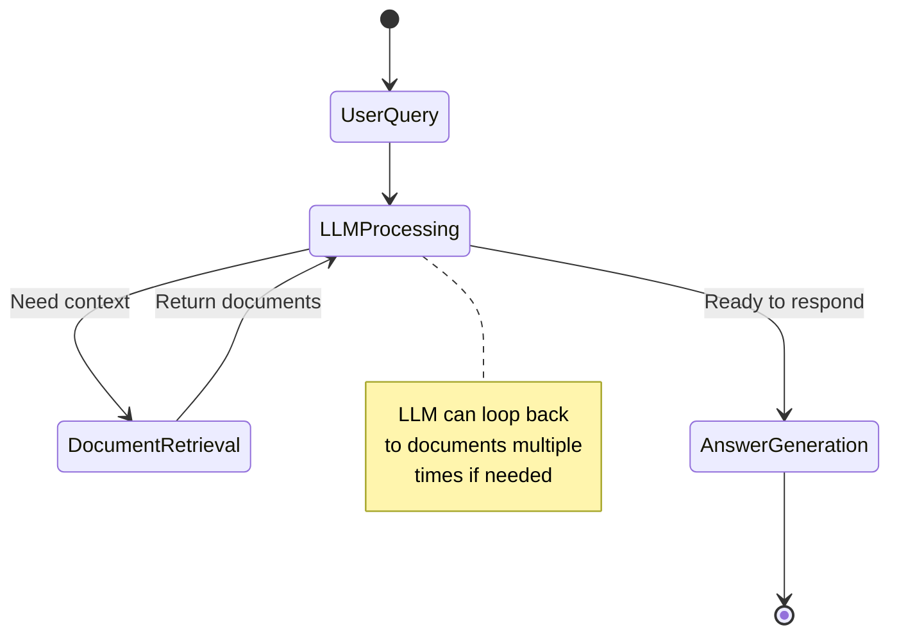

Table of contents
=================

<!--ts-->
   * [Introduction](#introduction)
   * [Why Sequential Chains Are Not Enough](#why-sequential-chains-are-not-enough)
   * [What LangGraph Solves](#what-langgraph-solves)
   * [Core Concepts](#core-concepts)
      * [Nodes](#nodes)
      * [Edges](#edges)
      * [State](#state)
   * [LangGraph Architecture](#langgraph-architecture)
   * [Real-World Example Flow](#real-world-example-flow)
   * [Building Your First Graph](#building-your-first-graph)
   * [Advanced Features](#advanced-features)
      * [Conditional Branching](#conditional-branching)
      * [Loops and Cycles](#loops-and-cycles)
      * [Human-in-the-Loop](#human-in-the-loop)
   * [When to Use LangGraph](#when-to-use-langgraph)
<!--te-->

## Introduction

**LangGraph** is a framework for building **stateful, controllable, graph-based AI workflows**. It lets you design LLM applications as **graphs** with **nodes**, **edges**, and **shared state**.

> 🎯 **Build Custom Agents with Low-Level Control** - LangGraph lets you define states, fallbacks, and loops for complex AI workflows.

While LangChain is excellent for sequential tasks, real-world AI applications often require more complexity. That's where LangGraph comes in.

## Why Sequential Chains Are Not Enough

**Not everything in this world is linear.** The same is true for building agentic AI systems:

- Not everything is going to be **linear**
- Not everything is going to be **sequential**
- There are **decision paths** - if this happens, do this; if that happens, do that
- There are **role-based access management** scenarios
- There are **loops** where you need to repeat actions
- There are **fallbacks** when a particular node fails

```
┌─────────────────────────────────────────────────────────────────────────┐
│                         Real-World Complexity                            │
├─────────────────────────────────────────────────────────────────────────┤
│                                                                          │
│  What Sequential Chains Assume:                                          │
│  ┌───┐    ┌───┐    ┌───┐    ┌───┐                                       │
│  │ A │───▶│ B │───▶│ C │───▶│ D │  (Always the same path)              │
│  └───┘    └───┘    └───┘    └───┘                                       │
│                                                                          │
│  What Reality Looks Like:                                                │
│                                                                          │
│                         ┌───────────┐                                    │
│                    ┌───▶│  Search   │───┐                               │
│                    │    │    DB     │   │                               │
│                    │    └───────────┘   │                               │
│  ┌───────┐    ┌───┴───┐            ┌───▼───┐    ┌──────────┐           │
│  │ Query │───▶│Decide │            │Combine│───▶│ Response │           │
│  └───────┘    └───┬───┘            └───▲───┘    └────┬─────┘           │
│                    │    ┌───────────┐   │            │                  │
│                    └───▶│   Call    │───┘            │                  │
│                         │   API     │                │                  │
│                         └─────┬─────┘                │                  │
│                               │                      │                  │
│                               │    ┌─────────┐       │                  │
│                               └───▶│ Retry?  │───────┘  (Loop back)    │
│                                    └─────────┘                          │
│                                                                          │
│  Decision paths, parallel execution, loops, error handling...           │
└─────────────────────────────────────────────────────────────────────────┘
```

When building real-world agent AI systems, developers quickly realize:

- ❌ Linear and sequential flow is **not enough**
- ✅ You need different kinds of **nodes**
- ✅ You need **branching**
- ✅ You need **loops**
- ✅ You need **fallback actions** if a particular node fails

**That's when LangGraph came into the picture.**

## What LangGraph Solves

| Challenge | How LangGraph Solves It |
|-----------|-------------------------|
| **Memory across steps** | Maintains state, enabling long, multi-step workflows |
| **Complex control flow** | Uses nodes & edges to define exactly how the agent should think and act |
| **Safe tool calls** | Built-in support for safe, structured tool calls inside workflows |
| **Error handling** | Define fallback actions for when nodes fail |
| **Conditional logic** | Branch based on LLM output or external conditions |

## Core Concepts

### Nodes

**Nodes** are the building blocks of your graph. Each node represents a discrete step in your workflow.

```python
from langgraph.graph import StateGraph
from typing import TypedDict

# Define state schema
class AgentState(TypedDict):
    messages: list
    current_step: str

# Define nodes as functions
def analyze_query(state: AgentState) -> AgentState:
    """Analyze the user's query"""
    # Processing logic here
    return {"current_step": "analyzed"}

def search_documents(state: AgentState) -> AgentState:
    """Search relevant documents"""
    # Search logic here
    return {"current_step": "searched"}

def generate_response(state: AgentState) -> AgentState:
    """Generate final response"""
    # Generation logic here
    return {"current_step": "completed"}
```

### Edges

**Edges** define how nodes connect and the flow between them.

```python
# Create the graph
graph = StateGraph(AgentState)

# Add nodes
graph.add_node("analyze", analyze_query)
graph.add_node("search", search_documents)
graph.add_node("respond", generate_response)

# Add edges (connections between nodes)
graph.add_edge("analyze", "search")
graph.add_edge("search", "respond")

# Set entry point
graph.set_entry_point("analyze")
graph.set_finish_point("respond")
```

### State

**State** is shared across all nodes and persists throughout the workflow.

```python
from typing import TypedDict, List, Optional
from langchain.schema import BaseMessage

class ConversationState(TypedDict):
    # Chat history
    messages: List[BaseMessage]
    
    # Current query being processed
    current_query: str
    
    # Retrieved context
    context: Optional[str]
    
    # Processing metadata
    step_count: int
    needs_clarification: bool
    
    # Final output
    response: Optional[str]
```

## LangGraph Architecture

```
┌─────────────────────────────────────────────────────────────────────────┐
│                        LangGraph Architecture                            │
├─────────────────────────────────────────────────────────────────────────┤
│                                                                          │
│  ┌─────────────────────────────────────────────────────────────────┐    │
│  │                         SHARED STATE                             │    │
│  │  ┌──────────┐ ┌──────────┐ ┌──────────┐ ┌──────────┐           │    │
│  │  │ Messages │ │ Context  │ │ Metadata │ │  Output  │           │    │
│  │  └──────────┘ └──────────┘ └──────────┘ └──────────┘           │    │
│  └─────────────────────────────────────────────────────────────────┘    │
│                              │                                           │
│                              ▼                                           │
│  ┌─────────────────────────────────────────────────────────────────┐    │
│  │                          GRAPH                                   │    │
│  │                                                                  │    │
│  │   ┌─────────┐                              ┌─────────┐          │    │
│  │   │  START  │                              │   END   │          │    │
│  │   └────┬────┘                              └────▲────┘          │    │
│  │        │                                        │               │    │
│  │        ▼                                        │               │    │
│  │   ┌─────────┐     ┌─────────┐     ┌─────────┐  │               │    │
│  │   │  Node   │────▶│  Node   │────▶│  Node   │──┘               │    │
│  │   │    A    │     │    B    │     │    C    │                  │    │
│  │   └────┬────┘     └────┬────┘     └────┬────┘                  │    │
│  │        │               │               │                        │    │
│  │        │          ┌────▼────┐          │                        │    │
│  │        └─────────▶│Condition│◀─────────┘                        │    │
│  │                   │  Node   │                                   │    │
│  │                   └────┬────┘                                   │    │
│  │                        │                                        │    │
│  │                   ┌────▼────┐                                   │    │
│  │                   │ Loop to │ (Back to Node A if needed)        │    │
│  │                   │ Node A  │                                   │    │
│  │                   └─────────┘                                   │    │
│  └─────────────────────────────────────────────────────────────────┘    │
│                                                                          │
└─────────────────────────────────────────────────────────────────────────┘
```



## Real-World Example Flow

Here's a practical example showing how LangGraph handles a customer support scenario with authentication, database lookup, and conditional responses:

```
┌─────────────────────────────────────────────────────────────────────────┐
│                    Customer Support Agent Flow                           │
├─────────────────────────────────────────────────────────────────────────┤
│                                                                          │
│   ┌──────────┐                                                          │
│   │  Query   │                                                          │
│   │ Received │                                                          │
│   └────┬─────┘                                                          │
│        │                                                                 │
│        ▼                                                                 │
│   ┌──────────┐                                                          │
│   │ Classify │                                                          │
│   │  Intent  │                                                          │
│   └────┬─────┘                                                          │
│        │                                                                 │
│        ├────────────────┬────────────────┬─────────────────┐            │
│        ▼                ▼                ▼                 ▼            │
│   ┌─────────┐     ┌─────────┐     ┌─────────┐      ┌─────────┐         │
│   │ Account │     │ Product │     │Technical│      │ General │         │
│   │  Query  │     │  Query  │     │ Support │      │  Query  │         │
│   └────┬────┘     └────┬────┘     └────┬────┘      └────┬────┘         │
│        │               │               │                │               │
│        ▼               │               │                │               │
│   ┌─────────┐          │               │                │               │
│   │  Auth   │          │               │                │               │
│   │Required?│          │               │                │               │
│   └────┬────┘          │               │                │               │
│     Yes│  No           │               │                │               │
│        ▼    │          │               │                │               │
│   ┌─────────┐│         │               │                │               │
│   │Validate ││         │               │                │               │
│   │  User   ││         │               │                │               │
│   └────┬────┘│         │               │                │               │
│        │     │         │               │                │               │
│        ▼     │         │               │                │               │
│   ┌─────────┐│         │               │                │               │
│   │  Fetch  ││         │               │                │               │
│   │  Data   │◀─────────┘               │                │               │
│   └────┬────┘                          │                │               │
│        │                               │                │               │
│        └───────────────┬───────────────┴────────────────┘               │
│                        ▼                                                 │
│                   ┌─────────┐                                           │
│                   │Generate │                                           │
│                   │Response │                                           │
│                   └────┬────┘                                           │
│                        │                                                 │
│                        ▼                                                 │
│                   ┌─────────┐         ┌─────────┐                       │
│                   │ Needs   │───Yes──▶│ Loop to │                       │
│                   │Follow-up│         │ Classify│                       │
│                   └────┬────┘         └─────────┘                       │
│                     No │                                                 │
│                        ▼                                                 │
│                   ┌─────────┐                                           │
│                   │  Send   │                                           │
│                   │Response │                                           │
│                   └─────────┘                                           │
│                                                                          │
└─────────────────────────────────────────────────────────────────────────┘
```

## Building Your First Graph

```python
from typing import TypedDict, Literal
from langgraph.graph import StateGraph, END
from langchain_openai import ChatOpenAI
from langchain.prompts import ChatPromptTemplate

# Define state
class GraphState(TypedDict):
    query: str
    context: str
    response: str
    needs_search: bool

# Initialize LLM
llm = ChatOpenAI(model="gpt-4", temperature=0)

# Define node functions
def analyze_query(state: GraphState) -> GraphState:
    """Determine if we need to search for context"""
    prompt = ChatPromptTemplate.from_template(
        "Analyze this query and determine if it needs external search: {query}\n"
        "Respond with 'yes' or 'no'"
    )
    chain = prompt | llm
    result = chain.invoke({"query": state["query"]})
    needs_search = "yes" in result.content.lower()
    return {"needs_search": needs_search}

def search_documents(state: GraphState) -> GraphState:
    """Search for relevant documents"""
    # Implement your search logic here
    context = f"Relevant context for: {state['query']}"
    return {"context": context}

def generate_response(state: GraphState) -> GraphState:
    """Generate the final response"""
    prompt = ChatPromptTemplate.from_template(
        "Context: {context}\n\nQuery: {query}\n\nProvide a helpful response."
    )
    chain = prompt | llm
    result = chain.invoke({
        "context": state.get("context", "No additional context"),
        "query": state["query"]
    })
    return {"response": result.content}

# Define conditional edge
def route_query(state: GraphState) -> Literal["search", "respond"]:
    if state.get("needs_search", False):
        return "search"
    return "respond"

# Build the graph
workflow = StateGraph(GraphState)

# Add nodes
workflow.add_node("analyze", analyze_query)
workflow.add_node("search", search_documents)
workflow.add_node("respond", generate_response)

# Add edges
workflow.set_entry_point("analyze")
workflow.add_conditional_edges(
    "analyze",
    route_query,
    {
        "search": "search",
        "respond": "respond"
    }
)
workflow.add_edge("search", "respond")
workflow.add_edge("respond", END)

# Compile the graph
app = workflow.compile()

# Run the graph
result = app.invoke({
    "query": "What is LangGraph?",
    "context": "",
    "response": "",
    "needs_search": False
})

print(result["response"])
```

## Advanced Features

### Conditional Branching

```python
from typing import Literal

def should_continue(state: GraphState) -> Literal["continue", "end"]:
    """Decide whether to continue or end the workflow"""
    if state["step_count"] >= 5:
        return "end"
    if state["confidence"] > 0.9:
        return "end"
    return "continue"

# Add conditional edges
workflow.add_conditional_edges(
    "process",
    should_continue,
    {
        "continue": "refine",
        "end": END
    }
)
```

### Loops and Cycles

```python
def needs_retry(state: GraphState) -> Literal["retry", "success"]:
    """Check if we need to retry the operation"""
    if state.get("error") and state["retry_count"] < 3:
        return "retry"
    return "success"

# Create a loop
workflow.add_conditional_edges(
    "execute_tool",
    needs_retry,
    {
        "retry": "execute_tool",  # Loop back to the same node
        "success": "process_result"
    }
)
```

### Human-in-the-Loop

```python
from langgraph.checkpoint.sqlite import SqliteSaver

# Add persistence for human-in-the-loop
memory = SqliteSaver.from_conn_string(":memory:")
app = workflow.compile(checkpointer=memory, interrupt_before=["human_review"])

# Run until human review step
config = {"configurable": {"thread_id": "user_123"}}
result = app.invoke(initial_state, config)

# Human reviews and approves
# Resume execution
app.invoke(None, config)
```

## When to Use LangGraph

| Use Case | LangChain | LangGraph |
|----------|-----------|-----------|
| Simple Q&A | ✅ | ❌ |
| Linear RAG pipeline | ✅ | ❌ |
| Multi-turn conversations | ⚠️ | ✅ |
| Complex decision trees | ❌ | ✅ |
| Workflows with loops | ❌ | ✅ |
| Human-in-the-loop | ❌ | ✅ |
| Error recovery/fallbacks | ⚠️ | ✅ |
| Stateful agents | ❌ | ✅ |

**Choose LangGraph when:**
- Your workflow has **branching logic**
- You need to **maintain state** across multiple steps
- You require **loops** or **retry mechanisms**
- You want **human oversight** at certain points
- Your agent needs to make **complex decisions**

---

## Summary

```
┌─────────────────────────────────────────────────────────────────────────┐
│                    LangChain vs LangGraph                                │
├─────────────────────────────────────────────────────────────────────────┤
│                                                                          │
│  LangChain: Sequential, Linear Workflows                                 │
│  ━━━━━━━━━━━━━━━━━━━━━━━━━━━━━━━━━━━━━━━                                │
│  Input ──▶ Step 1 ──▶ Step 2 ──▶ Step 3 ──▶ Output                      │
│                                                                          │
│  Best for: Simple chains, basic RAG, straightforward tasks               │
│                                                                          │
│  ─────────────────────────────────────────────────────────────────────  │
│                                                                          │
│  LangGraph: Stateful, Graph-Based Workflows                              │
│  ━━━━━━━━━━━━━━━━━━━━━━━━━━━━━━━━━━━━━━━━━                              │
│                                                                          │
│              ┌───────┐                                                   │
│         ┌───▶│ Node B│───┐                                              │
│         │    └───────┘   │                                              │
│  ┌─────┐│                │┌───────┐    ┌─────┐                          │
│  │Start│┤                ├▶│Node D │───▶│ End │                          │
│  └─────┘│    ┌───────┐   │└───┬───┘    └─────┘                          │
│         └───▶│ Node C│───┘    │                                          │
│              └───────┘        │                                          │
│                    ▲          │                                          │
│                    └──────────┘ (Loop)                                   │
│                                                                          │
│  Best for: Complex agents, multi-step workflows, stateful applications   │
│                                                                          │
└─────────────────────────────────────────────────────────────────────────┘
```

---

## Related Articles

- [LangChain Framework](/2025/01/24/langchain-framework.html)
- [LangSmith - LLM Observability & Evaluation](/2025/01/24/langsmith.html)
- [Agentic AI Systems](/2025/01/17/agentic-ai-systems.html)
