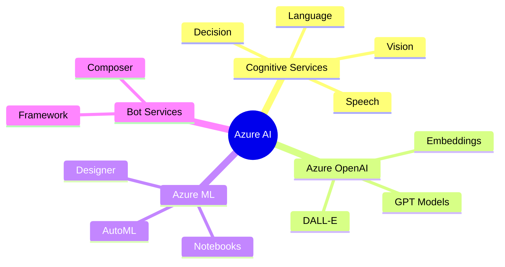

<div class="certification-header" style="background: linear-gradient(135deg, #0078D4 0%, #00BCF2 100%); color: white; padding: 2rem; border-radius: 10px; margin-bottom: 2rem;">
  <div style="display: flex; align-items: center; gap: 1rem;">
    <i class="fas fa-certificate" style="font-size: 3rem;"></i>
    <div>
      <h1 style="margin: 0; color: white;">AI-102: Azure AI Engineer Associate</h1>
      <p style="margin: 0.5rem 0 0 0; opacity: 0.9;">Microsoft Certified Professional Certification</p>
    </div>
  </div>
</div>

## 📋 Table of Contents

<!--ts-->
   * [Course Overview](#course-overview)
   * [Who Should Take This Course](#who-should-take-this-course)
   * [Exam Structure & Domains](#exam-structure--domains)
   * [Study Modules](#study-modules)
      * [Module 1: Introduction to Azure AI](#module-1-introduction-to-azure-ai)
      * [Module 2: Computer Vision](#module-2-computer-vision)
      * [Module 3: Natural Language Processing](#module-3-natural-language-processing)
      * [Module 4: Generative AI with Azure OpenAI](#module-4-generative-ai-with-azure-openai)
      * [Module 5: Knowledge Mining](#module-5-knowledge-mining)
      * [Module 6: Azure AI Document Intelligence](#module-6-azure-ai-document-intelligence)
   * [Detailed Module Breakdown](#detailed-module-breakdown)
   * [Exam Tips & Resources](#exam-tips--resources)
<!--te-->

---

## Course Overview

> 🚀 **Accelerate your career in Artificial Intelligence with the industry-leading Azure AI platform!**

The **Microsoft Certified: Azure AI Engineer Associate (AI-102)** certification is your comprehensive pathway to mastering Azure's powerful suite of AI technologies. Designed for both AI newcomers and experienced developers, this program empowers you to **build, deploy, and manage cutting-edge AI solutions** using Microsoft Azure.

```
┌─────────────────────────────────────────────────────────────────────────┐
│                    AI-102 Certification Journey                          │
├─────────────────────────────────────────────────────────────────────────┤
│                                                                          │
│   🎯 GOAL: Validate your ability to design and implement Azure AI       │
│                                                                          │
│   ┌─────────────┐    ┌─────────────┐    ┌─────────────┐                │
│   │   Learn     │───▶│   Practice  │───▶│   Certify   │                │
│   │   Concepts  │    │   Hands-on  │    │   AI-102    │                │
│   └─────────────┘    └─────────────┘    └─────────────┘                │
│                                                                          │
│   📚 6 Key Domains │ 🛠️ Real-world Skills │ ✅ Industry Recognition    │
│                                                                          │
└─────────────────────────────────────────────────────────────────────────┘
```

### What You should Learn

| Module | Focus Area | Key Skills |
|--------|------------|------------|
| **1** | Introduction to Azure AI | AI ecosystem, Azure AI services, enterprise applications |
| **2** | Computer Vision | Image/video analysis, face detection, custom vision models |
| **3** | Natural Language Processing | Text analysis, translation, conversational AI, speech |
| **4** | Generative AI | Azure OpenAI, RAG implementation, prompt engineering |
| **5** | Knowledge Mining | Intelligent search, document intelligence, knowledge stores |
| **6** | Document Intelligence | Automated document processing, form extraction |

---

## Who Should Take This Exam

<div style="display: grid; grid-template-columns: repeat(auto-fit, minmax(200px, 1fr)); gap: 1rem; margin: 1rem 0;">

<div style="background: #E3F2FD; padding: 1rem; border-radius: 8px; border-left: 4px solid #1976D2;">
  <strong>👨‍💻 Developers</strong><br>
  Looking to add AI capabilities to applications
</div>

<div style="background: #E8F5E9; padding: 1rem; border-radius: 8px; border-left: 4px solid #388E3C;">
  <strong>📊 Data Analysts</strong><br>
  Wanting to leverage AI for data insights
</div>

<div style="background: #FFF3E0; padding: 1rem; border-radius: 8px; border-left: 4px solid #F57C00;">
  <strong>🔧 IT Professionals</strong><br>
  Seeking to implement AI solutions
</div>

<div style="background: #F3E5F5; padding: 1rem; border-radius: 8px; border-left: 4px solid #7B1FA2;">
  <strong>🌟 Career Changers</strong><br>
  Ready to specialize in AI (no prior AI experience required!)
</div>

</div>

---

## Exam Structure & Domains

The AI-102 exam validates your ability to **design and implement Azure AI Services**. It's broken into **six key areas**, each mapped to real-world skills.

```
┌─────────────────────────────────────────────────────────────────────────┐
│                      AI-102 Exam Breakdown                               │
├─────────────────────────────────────────────────────────────────────────┤
│                                                                          │
│  ████████████████████░░░░░░░░░░░░░░░░░░░░  Plan & Manage (20-25%)       │
│                                                                          │
│  ██████████░░░░░░░░░░░░░░░░░░░░░░░░░░░░░░  Computer Vision (10-15%)     │
│                                                                          │
│  ████████████████░░░░░░░░░░░░░░░░░░░░░░░░  NLP Solutions (15-20%)       │
│                                                                          │
│  ████████████████░░░░░░░░░░░░░░░░░░░░░░░░  Generative AI (15-20%)       │
│                                                                          │
│  ████████████████░░░░░░░░░░░░░░░░░░░░░░░░  Knowledge Mining (15-20%)    │
│                                                                          │
│  ████████████████░░░░░░░░░░░░░░░░░░░░░░░░  Document Intel (15-20%)      │
│                                                                          │
└─────────────────────────────────────────────────────────────────────────┘
```

### Detailed Domain Breakdown

#### 1️⃣ Plan and Manage an Azure AI Solution (20-25%)

| Topic | Description |
|-------|-------------|
| Introduction to AI and Azure AI Services | Understanding the AI ecosystem and Azure's offerings |
| Get Started with Azure AI Services | Tools, SDKs, and resources to build with Azure AI |
| Enterprise Applications | Using Azure AI solutions at scale |

#### 2️⃣ Develop Computer Vision Solutions (10-15%)

| Topic | Description |
|-------|-------------|
| Analyze and Manipulate Images | Extract insights using pre-built or custom models |
| Analyze Videos | Break down video content into searchable metadata |
| Face Detection | Identify and analyze faces in photos and videos |
| Custom Vision Models | Train models for objects/patterns unique to your data |

#### 3️⃣ Develop Natural Language Processing Solutions (15-20%)

| Topic | Description |
|-------|-------------|
| Analyzing Text | Sentiment analysis, key phrase extraction, topic identification |
| Question Answering | Create systems that answer queries from your data |
| Text Translation | Convert text between languages with high accuracy |
| Conversational Language Understanding | Build chatbots that recognize intents and extract info |
| Custom Classification | Train models to label documents and tag entities |
| Speech Services | Speech-to-text, text-to-speech, translation |

#### 4️⃣ Develop Generative AI Solutions (15-20%)

| Topic | Description |
|-------|-------------|
| Azure OpenAI Service | Connect to powerful generative models |
| App Development | Build applications with Azure OpenAI |
| RAG Implementation | Ground AI responses in your data for accuracy |
| Prompt Engineering | Guide AI to produce better answers |

#### 5️⃣ Implement Knowledge Mining Solutions (15-20%)

| Topic | Description |
|-------|-------------|
| Intelligent Search | Use Azure AI Search for unstructured data insights |
| Document Intelligence | Extract structured data from forms, receipts, contracts |
| Custom Skills | Customize enrichment pipelines with your own logic |
| Knowledge Store | Persist AI-extracted data in structured, queryable format |

#### 6️⃣ Document Intelligence Solutions (15-20%)

| Topic | Description |
|-------|-------------|
| Document Processing | Automate document workflows |
| Form Extraction | Extract key information from forms |
| Business Workflow Enhancement | Improve accuracy and efficiency |

---

## Study Modules

### Module 1: Introduction to Azure AI

> 📚 **Begin with the Essentials**: Unpacking the AI ecosystem and exploring Azure AI services

**What You should Learn:**
- Introduction to AI concepts and the Azure AI platform
- Understanding the ecosystem of services and tools within Azure
- How to select the right solution for any business challenge



📖 **Topics in this module:**
1. [Introduction to AI and Azure AI Services](ai-102/introduction-to-ai-azure-services.html) 
2. [Get Started with Azure AI Services](ai-102/get-started-azure-ai-services.html)
3. [Using Azure AI Services for Enterprise Applications](ai-102/azure-ai-enterprise-applications.html)

---

### Module 2: Computer Vision

> 👁️ **See the World Through AI**: Process and analyze images and videos using Azure AI Services

**What You should Learn:**
- Build models that detect objects, extract text, and recognize faces
- Skills applicable to retail, security, and healthcare industries

```
┌─────────────────────────────────────────────────────────────────────────┐
│                    Computer Vision Pipeline                              │
├─────────────────────────────────────────────────────────────────────────┤
│                                                                          │
│   ┌─────────┐    ┌─────────────┐    ┌─────────────┐    ┌──────────┐   │
│   │  Image  │───▶│   Azure AI  │───▶│   Extract   │───▶│  Output  │   │
│   │  Input  │    │   Vision    │    │   Insights  │    │  Results │   │
│   └─────────┘    └─────────────┘    └─────────────┘    └──────────┘   │
│                                                                          │
│   Capabilities:                                                          │
│   ├── 🖼️ Object Detection                                               │
│   ├── 📝 OCR (Text Extraction)                                          │
│   ├── 👤 Face Detection & Analysis                                       │
│   ├── 🎯 Custom Vision Models                                            │
│   └── 🎬 Video Analysis                                                  │
│                                                                          │
└─────────────────────────────────────────────────────────────────────────┘
```

📖 **Topics in this module:**
1. [Analyze and Manipulate Images](ai-102/analyze-manipulate-images.html)
2. [Detecting Faces with Azure AI Vision](ai-102/detecting-faces-azure-ai.html)
3. [Custom Vision Models with Azure AI Custom Vision](ai-102/custom-vision-models.html)
4. [Analyzing Videos](ai-102/analyzing-videos.html)

---

### Module 3: Natural Language Processing

> 💬 **Enable Human-Machine Communication**: Analyze text, translate languages, and build conversational AI

**What You should Learn:**
- Detect sentiment and analyze text
- Translate languages with Azure AI Language Services
- Build intelligent bots for seamless human-machine interaction

```
┌─────────────────────────────────────────────────────────────────────────┐
│                         NLP Services Overview                            │
├─────────────────────────────────────────────────────────────────────────┤
│                                                                          │
│                        ┌─────────────────┐                              │
│                        │   Azure AI      │                              │
│                        │   Language      │                              │
│                        └────────┬────────┘                              │
│                                 │                                        │
│     ┌───────────────────────────┼───────────────────────────┐           │
│     │           │               │               │           │           │
│     ▼           ▼               ▼               ▼           ▼           │
│  ┌──────┐  ┌─────────┐   ┌──────────┐   ┌─────────┐  ┌──────────┐     │
│  │ Text │  │Question │   │Conversa- │   │  Named  │  │  Speech  │     │
│  │Analyt│  │Answering│   │  tional  │   │ Entity  │  │ Services │     │
│  │ ics  │  │         │   │   AI     │   │ Recog.  │  │          │     │
│  └──────┘  └─────────┘   └──────────┘   └─────────┘  └──────────┘     │
│                                                                          │
│  Sentiment   QnA from     Intent &      Custom       STT, TTS,         │
│  Key Phrases Your Data    Extraction    Entities     Translation       │
│                                                                          │
└─────────────────────────────────────────────────────────────────────────┘
```

📖 **Topics in this module:**
1. [Analyzing Text](ai-102/analyzing-text.html)
2. [Translating Text](ai-102/translating-text.html)
3. [Develop a Question Answering Solution](ai-102/question-answering-solution.html)
4. [Develop a Conversational Language Understanding App](ai-102/conversational-language-understanding.html)
5. [Custom Classification and Named Entity Extraction](ai-102/custom-classification-ner.html)
6. [Speech Recognition, Translation, and Synthesis](ai-102/speech-recognition-synthesis.html)

---

### Module 4: Generative AI with Azure OpenAI

> 🤖 **The Evolution of AI**: From traditional AI to Large Language Models

**The AI Timeline:**

```
┌─────────────────────────────────────────────────────────────────────────┐
│                      Evolution of AI                                     │
├─────────────────────────────────────────────────────────────────────────┤
│                                                                          │
│  1950s          1990s           2010s           2020s                   │
│    │              │               │               │                      │
│    ▼              ▼               ▼               ▼                      │
│  ┌────┐        ┌────┐          ┌────┐         ┌────────┐               │
│  │ AI │───────▶│ ML │─────────▶│ DL │────────▶│ GenAI  │               │
│  └────┘        └────┘          └────┘         └────────┘               │
│                                                                          │
│  Artificial    Machine         Deep           Generative                │
│  Intelligence  Learning        Learning       AI / LLMs                 │
│                                                                          │
│  Rule-based    Statistical     Neural         Large Language            │
│  Systems       Models          Networks       Models                    │
│                                                                          │
└─────────────────────────────────────────────────────────────────────────┘
```

**What You should Learn:**
- Create applications that generate natural language
- Summarize content and power dynamic chatbots
- Unlock innovative possibilities with Azure OpenAI

📖 **Topics in this module:**
1. [Get Started with Azure OpenAI Service](ai-102/get-started-azure-openai.html)
2. [Develop Apps with Azure OpenAI Service](ai-102/develop-apps-azure-openai.html)
3. [Apply Prompt Engineering](ai-102/prompt-engineering.html)
4. [Implement RAG with Azure OpenAI Service](ai-102/implement-rag-azure-openai.html)

---

### Module 5: Knowledge Mining

> 🔍 **Transform Data Chaos into Actionable Insights**

As data continuously grows, making sense of it is critical. Azure AI Search enables extraction of valuable, actionable insights from documents, images, and databases.

```
┌─────────────────────────────────────────────────────────────────────────┐
│                    Knowledge Mining Pipeline                             │
├─────────────────────────────────────────────────────────────────────────┤
│                                                                          │
│   ┌──────────────────────────────────────────────────────────────────┐  │
│   │                      Data Sources                                 │  │
│   │  📄 Documents  🖼️ Images  🗄️ Databases  📧 Emails  📊 Reports    │  │
│   └────────────────────────────┬─────────────────────────────────────┘  │
│                                │                                         │
│                                ▼                                         │
│   ┌──────────────────────────────────────────────────────────────────┐  │
│   │                    Azure AI Search                                │  │
│   │  ┌────────────┐  ┌────────────┐  ┌────────────┐                 │  │
│   │  │  Ingest    │─▶│  Enrich    │─▶│   Index    │                 │  │
│   │  │  Data      │  │  with AI   │  │  Content   │                 │  │
│   │  └────────────┘  └────────────┘  └────────────┘                 │  │
│   └────────────────────────────┬─────────────────────────────────────┘  │
│                                │                                         │
│                                ▼                                         │
│   ┌──────────────────────────────────────────────────────────────────┐  │
│   │                    Knowledge Store                                │  │
│   │  Structured, queryable, actionable insights                       │  │
│   └──────────────────────────────────────────────────────────────────┘  │
│                                                                          │
└─────────────────────────────────────────────────────────────────────────┘
```

📖 **Topics in this module:**
1. [Implementing an Intelligent Search Solution](ai-102/intelligent-search-solution.html)
2. [Create a Custom Skill for Azure AI Search](ai-102/custom-skill-azure-search.html)
3. [Creating a Knowledge Store](ai-102/creating-knowledge-store.html)

---

### Module 6: Azure AI Document Intelligence

> ⚡ **Automation: A Pillar of Modern AI Solutions**

**What You should Learn:**
- Automate document processing
- Extract key information from forms
- Enhance business workflows for greater accuracy and efficiency

```
┌─────────────────────────────────────────────────────────────────────────┐
│                Document Intelligence Workflow                            │
├─────────────────────────────────────────────────────────────────────────┤
│                                                                          │
│   Input Documents                        Extracted Data                  │
│   ┌─────────────────┐                   ┌─────────────────┐             │
│   │  📋 Forms       │                   │  {              │             │
│   │  🧾 Receipts    │    ─────────▶     │    "name": ..., │             │
│   │  📑 Contracts   │    Azure AI       │    "date": ..., │             │
│   │  🪪 IDs         │    Document       │    "amount": ..│             │
│   │  📄 Invoices    │    Intelligence   │  }              │             │
│   └─────────────────┘                   └─────────────────┘             │
│                                                                          │
│   Use Cases:                                                             │
│   ├── 🏦 Financial document processing                                  │
│   ├── 🏥 Healthcare form extraction                                     │
│   ├── 📦 Invoice automation                                             │
│   └── 🆔 Identity verification                                          │
│                                                                          │
└─────────────────────────────────────────────────────────────────────────┘
```

📖 **Topics in this module:**
1. [Develop a Document Intelligence Solution](ai-102/document-intelligence-solution.html)

---

## Detailed Module Breakdown

### Complete Lesson Plan

| Module | Topics |
|--------|--------|
| **1. Azure AI Intro** | Introduction to AI and Azure AI Services |
| | Get Started with Azure AI Services |
| | Using Azure AI Services for Enterprise |
| **2. Computer Vision** | Analyze and Manipulate Images |
| | Detecting Faces with Azure AI Vision |
| | Custom Vision Models |
| | Analyzing Videos |
| **3. NLP** | Analyzing Text |
| | Translating Text |
| | Question Answering Solution |
| | Conversational Language Understanding |
| | Custom Classification and NER |
| | Speech Recognition & Synthesis |
| **4. Generative AI** | Get Started with Azure OpenAI |
| | Develop Apps with Azure OpenAI |
| | Apply Prompt Engineering |
| | Implement RAG with Azure OpenAI |
| **5. Knowledge Mining** | Intelligent Search Solution |
| | Custom Skill for Azure AI Search |
| | Creating a Knowledge Store |
| **6. Document Intelligence** | Document Intelligence Solution |
| **Practice** | Mock Exams |

**Total: 107+ Lessons across 21 Topic Areas**

---

## Exam Tips & Resources

### 📝 Study Strategy

```
┌─────────────────────────────────────────────────────────────────────────┐
│                    Recommended Study Path                                │
├─────────────────────────────────────────────────────────────────────────┤
│                                                                          │
│   Week 1-2: Foundation                                                   │
│   ├── Module 1: Introduction to Azure AI                                │
│   └── Set up Azure subscription and explore services                    │
│                                                                          │
│   Week 3-4: Vision & NLP                                                │
│   ├── Module 2: Computer Vision                                         │
│   └── Module 3: Natural Language Processing                             │
│                                                                          │
│   Week 5-6: Generative AI                                               │
│   ├── Module 4: Azure OpenAI Service                                    │
│   └── Practice prompt engineering                                        │
│                                                                          │
│   Week 7-8: Knowledge Mining & Document Intelligence                    │
│   ├── Module 5: Knowledge Mining                                        │
│   └── Module 6: Document Intelligence                                   │
│                                                                          │
│   Week 9-10: Review & Practice                                          │
│   ├── Take mock exams                                                   │
│   ├── Review weak areas                                                 │
│   └── Hands-on labs                                                     │
│                                                                          │
└─────────────────────────────────────────────────────────────────────────┘
```

### 🔗 Official Resources

| Resource | Link |
|----------|------|
| **Official Exam Page** | [Microsoft AI-102 Certification](https://learn.microsoft.com/en-us/credentials/certifications/azure-ai-engineer) |
| **Practice Test** | [Available on Microsoft Learn] (https://learn.microsoft.com/en-us/credentials/certifications/azure-ai-engineer/practice/assessment?assessment-type=practice&assessmentId=61&practice-assessment-type=certification) |
| **Azure AI Documentation** | [Azure AI Services Docs](https://learn.microsoft.com/en-us/azure/ai-services/) |
| **Azure OpenAI Documentation** | [Azure OpenAI Docs](https://learn.microsoft.com/en-us/azure/ai-services/openai/) |

### ✅ Exam Day Checklist

- [ ] Review all six domain areas
- [ ] Complete hands-on labs for each service
- [ ] Take both mock exams
- [ ] Review incorrect answers and understand why
- [ ] Get a good night's sleep before the exam
- [ ] Have valid ID ready for exam day

---

## 🚀 Ready to Begin?

> **Transform your future with AI!** Let's begin your Azure AI journey—start with Module 1 and step boldly into the world of Artificial Intelligence!

<div style="background: linear-gradient(135deg, #0078D4 0%, #00BCF2 100%); color: white; padding: 1.5rem; border-radius: 10px; text-align: center; margin-top: 2rem;">
  <h3 style="color: white; margin: 0;">Start Learning Now</h3>
  <p style="margin: 0.5rem 0;">Begin with Module 1: Introduction to Azure AI</p>
  <a href="ai-102/introduction-to-ai-azure-services.html" style="display: inline-block; background: white; color: #0078D4; padding: 0.75rem 2rem; border-radius: 5px; text-decoration: none; font-weight: bold; margin-top: 1rem;">
    📚 Start Module 1 →
  </a>
</div>

---

## Related Articles

- [Azure Cloud Services Overview](/2025/01/17/azure-cloud-services.html)
- [AI-Powered Software Development](/2025/01/07/ai-driven-software-development.html)
- [Retrieval Augmented Generation (RAG)](/2025/01/07/retrieval-augmented-generation.html)
- [Prompt Engineering Mastery](/2025/01/17/prompt-engineering.html)
