Table of contents
=================

<!--ts-->
   * [Introduction](#introduction)
   * [The Problem: Fragmented AI Development](#the-problem-fragmented-ai-development)
   * [How Mastra Solves It](#how-mastra-solves-it)
   * [Mastra Core Features](#mastra-core-features)
      * [1. Agents](#1-agents)
      * [2. Tools](#2-tools)
      * [3. Workflows](#3-workflows)
      * [4. Scorers/Evaluations](#4-scorersevaluations)
      * [5. Memory](#5-memory)
      * [6. Storage](#6-storage)
      * [7. Observability](#7-observability)
      * [8. Logging](#8-logging)
   * [Mastra vs LangChain/LangGraph/LangSmith](#mastra-vs-langchainlanggraphlangsmith)
      * [Feature Comparison](#feature-comparison)
      * [Key Differentiators](#key-differentiators)
      * [When to Use What](#when-to-use-what)
   * [Monitoring & Observability](#monitoring--observability)
      * [Mastra Studio](#mastra-studio)
      * [Trace Visualization](#trace-visualization)
      * [Sensitive Data Protection](#sensitive-data-protection)
   * [Real-World Example: AI Architecture Advisor](#real-world-example-ai-architecture-advisor)
   * [Supported Domains](#supported-domains)
   * [Getting Started](#getting-started)
   * [References](#references)
<!--te-->

## Introduction

**Mastra** is a TypeScript-first, all-in-one framework for building production-ready AI applications. Unlike fragmented ecosystems that require multiple packages for agents, workflows, memory, observability, and evaluations, Mastra provides everything in a single, cohesive package.


> 🚀 **Transform Ideas to Production**: Build AI applications with type safety, built-in observability, and zero configuration overhead.

---

## The Problem: Fragmented AI Development

Building production AI applications typically requires assembling multiple packages:

```mermaid
%%{init: {'theme': 'base', 'themeVariables': { 'primaryColor': '#34A853', 'primaryTextColor': '#fff', 'primaryBorderColor': '#1E8E3E', 'lineColor': '#5F6368'}}}%%
block-beta
    columns 5
    
    block:mastraHeader:5
        mastraTitle["✅ MASTRA APPROACH (Single Package)"]
    end
    
    space:5
    
    block:package:5
        space
        mastraCore["📦 @mastra/core = Everything in ONE"]
        space
    end
    
    space:5
    
    block:benefits:5
        benefit1["✅ Unified API"]
        benefit2["✅ Native TypeScript"]
        benefit3["✅ Zero-Config Observability"]
        benefit4["✅ Built-in Dev Studio"]
        benefit5["✅ Consistent Docs"]
    end

    style mastraTitle fill:#34A853,stroke:#1E8E3E,color:#fff
    style mastraCore fill:#4285F4,stroke:#1967D2,color:#fff
    style benefit1 fill:#E6F4EA,stroke:#CEEAD6,color:#1E8E3E
    style benefit2 fill:#E6F4EA,stroke:#CEEAD6,color:#1E8E3E
    style benefit3 fill:#E6F4EA,stroke:#CEEAD6,color:#1E8E3E
    style benefit4 fill:#E6F4EA,stroke:#CEEAD6,color:#1E8E3E
    style benefit5 fill:#E6F4EA,stroke:#CEEAD6,color:#1E8E3E
```




---

## How Mastra Solves It

Mastra provides a **unified, TypeScript-first experience** for AI development:

| Challenge | Traditional Approach | Mastra Solution |
|-----------|---------------------|-----------------|
| **Type Safety** | Runtime JSON schemas | Native Zod schemas with full inference |
| **Agent Framework** | Multiple packages | Built-in `@mastra/core/agent` |
| **Workflows** | Separate graph library | Integrated `@mastra/core/workflows` |
| **Memory** | External package | Built-in `@mastra/memory` |
| **Observability** | Requires separate service | Built-in OpenTelemetry |
| **Evaluations** | Separate platform | Built-in scorers |
| **Dev Tools** | None or separate UI | Mastra Studio included |
| **Local LLMs** | Complex setup | Native Ollama support |

---

## Mastra Core Features

### 1. Agents

Intelligent AI agents that understand requirements and orchestrate tool calls.

```typescript
import { Agent } from '@mastra/core/agent';

export const architectureAgent = new Agent({
  id: 'architecture-agent',
  name: 'Architecture Advisor',
  instructions: `You are an expert cloud architect...`,
  model: 'google/gemini-2.5-pro', // or Ollama for local
  tools: { analyzeRequirements, generateDiagram, compareArchitectures },
  memory: new Memory(), // Conversation memory
});
```

**What it does:**
- Receives natural language requirements
- Decides which tools to call
- Processes results intelligently
- Generates human-friendly responses

---

### 2. Tools

Reusable, typed functions that agents can invoke with structured inputs/outputs.

```typescript
import { createTool } from '@mastra/core/tools';

export const architectureAnalysisTool = createTool({
  id: 'architectureAnalysisTool',
  description: 'Analyzes requirements to extract domain, features, and scale',
  inputSchema: z.object({ requirement: z.string() }),
  outputSchema: analysisOutputSchema,
  execute: async ({ requirement }) => {
    return analyzeRequirement(requirement);
  },
});
```

**Tool Examples:**

| Tool | Purpose |
|------|---------|
| `analyzeRequirementsTool` | Parses requirements → domain, features, scale |
| `generateServerlessDiagramTool` | Creates AWS Lambda + EventBridge architecture |
| `generateMicroservicesDiagramTool` | Creates K8s + Istio architecture |
| `compareArchitecturesTool` | Side-by-side trade-off analysis |
| `generateSummaryTool` | Executive summary with recommendations |

---

### 3. Workflows

Multi-step pipelines with typed inputs/outputs between steps.

```typescript
import { createStep, createWorkflow } from '@mastra/core/workflows';

const analyzeStep = createStep({
  id: 'analyze',
  inputSchema: z.object({ requirement: z.string() }),
  outputSchema: analysisResultSchema,
  execute: async ({ inputData, mastra }) => {
    // Step 1: Analyze requirements
  },
});

export const architectureWorkflow = createWorkflow({
  id: 'architectureWorkflow',
  inputSchema: requirementInputSchema,
  outputSchema: finalOutputSchema,
})
  .then(analyzeStep)
  .then(generateDiagramsStep)
  .then(compareStep)
  .then(generateReportStep)
  .commit();
```

**Benefits:**
- ✅ Type-safe data flow between steps
- ✅ Built-in error handling and retries
- ✅ Parallel execution where possible
- ✅ Tracing and debugging support

---

### 4. Scorers/Evaluations

Quality metrics for agent responses using the LLM-as-judge pattern.

```typescript
import { createScorer } from '@mastra/core/evals';

export const diagramQualityScorer = createScorer({
  id: 'diagram-quality-scorer',
  name: 'Diagram Quality',
  description: 'Evaluates Mermaid.js diagram correctness',
  type: 'agent',
  judge: {
    model: 'google/gemini-2.5-pro',
    instructions: 'You are an expert evaluator of diagrams...',
  },
})
  .preprocess(({ run }) => extractInput(run))
  .analyze({ outputSchema: qualitySchema, createPrompt })
  .generateScore(({ results }) => calculateScore(results))
  .generateReason(({ results, score }) => explainScore(results, score));
```

**Built-in Scorers:**

| Scorer | What it Measures |
|--------|------------------|
| `completenessScorer` | Does the response address all requirements? |
| `diagramQualityScorer` | Is the Mermaid syntax correct? |
| `tradeOffAnalysisScorer` | Are trade-offs fairly evaluated? |
| `domainRelevanceScorer` | Does it use domain-specific components? |

---

### 5. Memory

Persistent conversation history for multi-turn interactions.

```typescript
import { Memory } from '@mastra/memory';

const agent = new Agent({
  memory: new Memory(), // Remembers conversation context
});
```

**Enables:**
- Follow-up questions ("Now show me the Kubernetes version")
- Context retention ("Add payment processing to that design")
- Session persistence across page reloads

---

### 6. Storage

SQLite-based persistence for traces, threads, and data.

```typescript
import { LibSQLStore } from '@mastra/libsql';

const mastra = new Mastra({
  storage: new LibSQLStore({
    id: "mastra-storage",
    url: "file:./mastra.db", // Local SQLite file
  }),
});
```

**Persists:**
- Agent conversation threads
- Workflow execution history
- Trace data for debugging
- Scorer evaluation results

---

### 7. Observability

OpenTelemetry-based tracing with sensitive data filtering.

```typescript
import { Observability, DefaultExporter, CloudExporter, SensitiveDataFilter } 
  from '@mastra/observability';

const mastra = new Mastra({
  observability: new Observability({
    configs: {
      default: {
        serviceName: 'mastra',
        exporters: [
          new DefaultExporter(),  // Traces to Mastra Studio
          new CloudExporter(),    // Traces to Mastra Cloud
        ],
        spanOutputProcessors: [
          new SensitiveDataFilter(), // Redacts passwords, tokens, keys
        ],
      },
    },
  }),
});
```

**Monitoring features:**
- End-to-end request tracing
- Tool call latency metrics
- LLM token usage tracking
- Error rate monitoring
- Automatic PII redaction

---

### 8. Logging

Structured logging with Pino for debugging and audit trails.

```typescript
import { PinoLogger } from '@mastra/loggers';

const mastra = new Mastra({
  logger: new PinoLogger({
    name: 'Mastra',
    level: 'info', // debug, info, warn, error
  }),
});
```

---

## Mastra vs LangChain/LangGraph/LangSmith

### Feature Comparison

| Feature | **Mastra** | **LangChain** | **LangGraph** | **LangSmith** |
|---------|-----------|---------------|---------------|---------------|
| **Primary Focus** | Full-stack AI apps | LLM chains/pipelines | State machines | Monitoring only |
| **Type Safety** | ✅ Native TypeScript | ❌ Python-first, TS port | ❌ Python only | N/A |
| **Agent Framework** | ✅ Built-in | ✅ Built-in | ❌ Manual | N/A |
| **Tool System** | ✅ Zod schemas | ⚠️ JSON schemas | ⚠️ Manual typing | N/A |
| **Workflows** | ✅ DAG + Sequential | ⚠️ LCEL chains | ✅ State graphs | N/A |
| **Memory** | ✅ Built-in | ⚠️ External packages | ❌ Manual | N/A |
| **Observability** | ✅ Built-in OpenTelemetry | ❌ Requires LangSmith | ❌ Requires LangSmith | ✅ Core feature |
| **Evaluations** | ✅ Built-in scorers | ❌ Requires LangSmith | ❌ Requires LangSmith | ✅ Core feature |
| **Storage** | ✅ LibSQL built-in | ❌ External | ❌ External | N/A |
| **Dev Studio** | ✅ Mastra Studio | ❌ None | ❌ None | ✅ Web UI |
| **Local LLM Support** | ✅ Ollama native | ⚠️ Separate package | ⚠️ Separate setup | N/A |
| **MCP Protocol** | ✅ Native support | ❌ Not supported | ❌ Not supported | N/A |
| **Deployment** | ✅ Single package | ⚠️ Multiple packages | ⚠️ With LangChain | N/A |
| **Learning Curve** | 🟢 Low | 🟡 Medium | 🔴 High | 🟢 Low |

---

### Key Differentiators

#### 1. All-in-One Framework

```
LangChain + LangGraph + LangSmith + Memory + Vector DB = 5 packages
Mastra = 1 package with everything built-in
```

#### 2. TypeScript-First Design

```typescript
// Mastra: Full type safety with Zod
const tool = createTool({
  inputSchema: z.object({ query: z.string() }),
  outputSchema: z.object({ results: z.array(z.string()) }),
  execute: async ({ query }) => { /* fully typed */ }
});

// LangChain: Runtime JSON schemas
const tool = new StructuredTool({
  schema: { type: "object", properties: { query: { type: "string" } } }
});
```

#### 3. Simpler Agent Definition

```typescript
// Mastra: Declarative approach
const agent = new Agent({
  model: 'google/gemini-2.5-pro',
  tools: { myTool },
  memory: new Memory(),
});

// LangChain: Imperative chains
const agent = AgentExecutor.from_agent_and_tools(
  initialize_agent(llm, tools, agent_type),
  tools,
  memory=ConversationBufferMemory()
);
```

#### 4. Built-in Observability

```typescript
// Mastra: Zero config - traces appear in Mastra Studio automatically
const mastra = new Mastra({ observability: new Observability() });

// LangChain: Requires external setup
// Set LANGCHAIN_TRACING_V2=true
// Set LANGCHAIN_API_KEY=...
// Configure callbacks in every chain
```

#### 5. Native Local LLM Support

```typescript
// Mastra: Native Ollama support
const agent = new Agent({
  model: ollama('llama3.1:8b'), // Just works
});

// LangChain: Separate package with different API
from langchain_community.llms import Ollama
llm = Ollama(model="llama3.1:8b")
# Different API than cloud models
```

---

### When to Use What

| Use Case | Best Choice | Why |
|----------|-------------|-----|
| **New TypeScript AI project** | **Mastra** | Native TS, all-in-one, fast to start |
| **Existing Python codebase** | LangChain | Mature Python ecosystem |
| **Complex state machines** | LangGraph | Purpose-built for FSM |
| **Just need monitoring** | LangSmith | Best standalone monitoring |
| **Local/offline AI apps** | **Mastra** | Best Ollama integration |
| **Claude Desktop integration** | **Mastra** | Native MCP support |
| **Production enterprise** | Either | Both are production-ready |
| **Rapid prototyping** | **Mastra** | Fastest time to working demo |
| **Multi-agent orchestration** | LangGraph | Specialized for agent graphs |

---

## Monitoring & Observability

### Mastra Studio

Access at **http://localhost:4111** when running the dev server:

```mermaid
%%{init: {'theme': 'base', 'themeVariables': { 'primaryColor': '#4285F4', 'primaryTextColor': '#fff', 'primaryBorderColor': '#1967D2', 'lineColor': '#5F6368'}}}%%
flowchart TB
    subgraph studio["🖥️ MASTRA STUDIO"]
        direction TB
        
        subgraph agents["🤖 Agents"]
            agent1["architectureAgent"]
            agent2["architectureAgentDemo"]
            agent3["architectureAgentLocal"]
        end
        
        subgraph workflows["🔄 Workflows"]
            wf1["architectureWorkflow"]
            wf2["completeArchitectureWorkflow"]
        end
        
        subgraph traces["📊 Traces"]
            trace1["View all API calls, tool invocations"]
            trace2["Token usage, latency, errors"]
        end
        
        subgraph evals["📈 Evaluations"]
            eval1["Scorer results over time"]
            eval2["Quality trends, regression detection"]
        end
    end

    style studio fill:#aeb8d5,stroke:#3C4043,color:#fff
    style agents fill:#E8F0FE,stroke:#4285F4,color:#1967D2
    style workflows fill:#FEF7E0,stroke:#FBBC05,color:#B06000
    style traces fill:#E6F4EA,stroke:#34A853,color:#1E8E3E
    style evals fill:#FCE8E6,stroke:#EA4335,color:#C5221F
    style agent1 fill:#4285F4,stroke:#1967D2,color:#fff
    style agent2 fill:#4285F4,stroke:#1967D2,color:#fff
    style agent3 fill:#4285F4,stroke:#1967D2,color:#fff
    style wf1 fill:#FBBC05,stroke:#F9AB00,color:#202124
    style wf2 fill:#FBBC05,stroke:#F9AB00,color:#202124
    style trace1 fill:#34A853,stroke:#1E8E3E,color:#fff
    style trace2 fill:#34A853,stroke:#1E8E3E,color:#fff
    style eval1 fill:#EA4335,stroke:#C5221F,color:#fff
    style eval2 fill:#EA4335,stroke:#C5221F,color:#fff
```



### Trace Visualization

Every agent interaction creates a detailed trace:

```mermaid
%%{init: {'theme': 'base', 'themeVariables': { 'primaryColor': '#4285F4', 'primaryTextColor': '#fff', 'lineColor': '#5F6368'}}}%%
flowchart TD
    subgraph trace["🔍 Trace: req-12345"]
        direction TB
        
        input["📥 <b>Input</b><br/>A ride-sharing app for 100k users"]
        
        tool1["🔧 <b>analyzeRequirementsTool</b><br/>⏱️ 45ms"]
        out1["📄 domain: ride-sharing, scale: large"]
        
        tool2["🔧 <b>generateServerlessDiagramTool</b><br/>⏱️ 120ms"]
        out2["📄 mermaidCode: graph TB..."]
        
        tool3["🔧 <b>generateMicroservicesDiagramTool</b><br/>⏱️ 115ms"]
        out3["📄 mermaidCode: graph TB..."]
        
        tool4["🔧 <b>compareArchitecturesTool</b><br/>⏱️ 85ms"]
        out4["📄 recommendation: Serverless"]
        
        llm["🤖 <b>LLM: gemini-2.5-pro</b><br/>⏱️ 1.2s • 🎫 2500 tokens"]
        
        output["📤 <b>Output</b><br/>Based on your requirements..."]
    end
    
    input --> tool1 --> out1
    out1 --> tool2 --> out2
    out2 --> tool3 --> out3
    out3 --> tool4 --> out4
    out4 --> llm --> output

    style trace fill:#F1F3F4,stroke:#DADCE0,color:#202124
    style input fill:#E8F0FE,stroke:#D2E3FC,color:#1967D2
    style tool1 fill:#4285F4,stroke:#1967D2,color:#fff
    style tool2 fill:#4285F4,stroke:#1967D2,color:#fff
    style tool3 fill:#4285F4,stroke:#1967D2,color:#fff
    style tool4 fill:#4285F4,stroke:#1967D2,color:#fff
    style out1 fill:#F1F3F4,stroke:#DADCE0,color:#5F6368
    style out2 fill:#F1F3F4,stroke:#DADCE0,color:#5F6368
    style out3 fill:#F1F3F4,stroke:#DADCE0,color:#5F6368
    style out4 fill:#F1F3F4,stroke:#DADCE0,color:#5F6368
    style llm fill:#FBBC05,stroke:#F9AB00,color:#202124
    style output fill:#E6F4EA,stroke:#CEEAD6,color:#1E8E3E
```



### Sensitive Data Protection

The `SensitiveDataFilter` automatically redacts:
- API keys and tokens
- Passwords and secrets
- Credit card numbers
- Personal identifiable information (PII)

---

## Real-World Example: AI Architecture Advisor

Here's a complete example showcasing Mastra's capabilities - an AI agent that transforms app ideas into production-ready architecture blueprints.

### The Problem

Designing system architecture requires considering:
- How many users will you have?
- What databases should you use?
- Should you go serverless or use Kubernetes?
- What will it cost?
- How big a team do you need?

### The Solution

**Input:**
```
"A ride-sharing app for 100k daily users with real-time tracking and payments"
```

**Output:**

✅ **Two distinct architectures** (Serverless vs. Microservices)  
✅ **Visual diagrams** (Mermaid.js)  
✅ **Trade-off comparison** (scalability, cost, complexity, team size)  
✅ **Cost estimates** (monthly infrastructure costs)  
✅ **Clear recommendation** (which to choose and why)

### Architecture 1: Serverless Event-Driven

- **Cost:** $1,500-6,000/month
- **Team:** 2-5 developers
- **Time to MVP:** 2-4 weeks
- **Best for:** Startups, variable traffic, cost optimization

```mermaid
%%{init: {'theme': 'base', 'themeVariables': { 'primaryColor': '#4285F4', 'primaryTextColor': '#fff', 'lineColor': '#5F6368'}}}%%
graph TB
    subgraph clients["Clients"]
        Mobile[📱 Mobile App]
        Web[🌐 Web App]
    end
    
    subgraph serverless["AWS Serverless"]
        API[🚪 API Gateway]
        Auth[⚡ Auth Lambda]
        Ride[⚡ Ride Lambda]
        Match[⚡ Matching Lambda]
    end
    
    subgraph events["Events"]
        EB[📨 EventBridge]
        SQS[📬 SQS Queue]
    end
    
    subgraph data["Data"]
        DDB[(🗄️ DynamoDB)]
        Redis[(⚡ ElastiCache)]
    end
    
    Mobile --> API
    Web --> API
    API --> Auth --> Ride
    Ride --> EB --> SQS --> Match
    Ride --> DDB
    Ride --> Redis

    style clients fill:#E8F0FE,stroke:#D2E3FC,color:#1967D2
    style serverless fill:#FEF7E0,stroke:#FEEFC3,color:#B06000
    style events fill:#E6F4EA,stroke:#CEEAD6,color:#1E8E3E
    style data fill:#FCE8E6,stroke:#F5C6C2,color:#C5221F
    style Mobile fill:#4285F4,stroke:#1967D2,color:#fff
    style Web fill:#4285F4,stroke:#1967D2,color:#fff
    style API fill:#FBBC05,stroke:#F9AB00,color:#202124
    style Auth fill:#FBBC05,stroke:#F9AB00,color:#202124
    style Ride fill:#FBBC05,stroke:#F9AB00,color:#202124
    style Match fill:#FBBC05,stroke:#F9AB00,color:#202124
    style EB fill:#34A853,stroke:#1E8E3E,color:#fff
    style SQS fill:#34A853,stroke:#1E8E3E,color:#fff
    style DDB fill:#EA4335,stroke:#C5221F,color:#fff
    style Redis fill:#EA4335,stroke:#C5221F,color:#fff
```



### Architecture 2: Microservices on Kubernetes

- **Cost:** $9,000-30,000/month
- **Team:** 8-15 developers + DevOps
- **Time to MVP:** 2-4 months
- **Best for:** Large teams, complex domains, multi-cloud

```mermaid
%%{init: {'theme': 'base', 'themeVariables': { 'primaryColor': '#4285F4', 'primaryTextColor': '#fff', 'lineColor': '#5F6368'}}}%%
graph TB
    subgraph ingress["Ingress"]
        LB[⚖️ Load Balancer]
        Istio[🕸️ Service Mesh]
    end
    
    subgraph services["Services"]
        User[👤 User Service]
        Ride[🚗 Ride Service]
        Payment[💳 Payment Service]
        Location[📍 Location Service]
    end
    
    subgraph messaging["Messaging"]
        Kafka[📨 Kafka]
    end
    
    subgraph databases["Databases"]
        PG[(🐘 PostgreSQL)]
        Mongo[(🍃 MongoDB)]
        Redis[(⚡ Redis)]
    end
    
    LB --> Istio
    Istio --> User & Ride & Payment & Location
    Ride --> Kafka
    Kafka --> Location
    User --> PG
    Ride --> Mongo
    Location --> Redis

    style ingress fill:#E8F0FE,stroke:#D2E3FC,color:#1967D2
    style services fill:#FEF7E0,stroke:#FEEFC3,color:#B06000
    style messaging fill:#E6F4EA,stroke:#CEEAD6,color:#1E8E3E
    style databases fill:#FCE8E6,stroke:#F5C6C2,color:#C5221F
    style LB fill:#4285F4,stroke:#1967D2,color:#fff
    style Istio fill:#4285F4,stroke:#1967D2,color:#fff
    style User fill:#FBBC05,stroke:#F9AB00,color:#202124
    style Ride fill:#FBBC05,stroke:#F9AB00,color:#202124
    style Payment fill:#FBBC05,stroke:#F9AB00,color:#202124
    style Location fill:#FBBC05,stroke:#F9AB00,color:#202124
    style Kafka fill:#34A853,stroke:#1E8E3E,color:#fff
    style PG fill:#EA4335,stroke:#C5221F,color:#fff
    style Mongo fill:#EA4335,stroke:#C5221F,color:#fff
    style Redis fill:#EA4335,stroke:#C5221F,color:#fff
```



### Trade-off Matrix

| Dimension | Serverless | Microservices |
|-----------|-----------|---------------|
| Scalability | ⭐⭐⭐⭐⭐ (9/10) | ⭐⭐⭐⭐⭐ (9/10) |
| Cost Efficiency | ⭐⭐⭐⭐ (8/10) | ⭐⭐⭐ (5/10) |
| Time to Market | ⭐⭐⭐⭐⭐ (9/10) | ⭐⭐⭐ (5/10) |
| Operational Complexity | ⭐⭐ (3/10) | ⭐⭐⭐⭐ (8/10) |
| Vendor Lock-in | ⭐⭐⭐⭐ (7/10) | ⭐⭐ (3/10) |

---

## Supported Domains

The AI agent recognizes and optimizes for these application types:

| Domain | Special Considerations |
|--------|----------------------|
| 🚗 **Ride-sharing** | Real-time GPS, driver matching, surge pricing |
| 🛒 **E-commerce** | Inventory, payments, order management |
| 💰 **Fintech** | PCI-DSS, transactions, fraud detection |
| 👛 **Digital Wallet** | P2P transfers, QR payments, bill splitting |
| 🏥 **Healthcare** | HIPAA compliance, patient data security |
| 💬 **Social/Messaging** | Real-time feeds, notifications, presence |
| 🎬 **Streaming** | CDN, adaptive bitrate, DRM |
| 📡 **IoT** | Device management, telemetry, edge processing |
| 🔗 **Integration/EIP** | Message routing, transformation, orchestration |
| 📊 **Analytics** | Data pipelines, dashboards, aggregation |
| 🏪 **Marketplace** | Listings, escrow, commission |

---

## Getting Started

### Prerequisites

- Node.js >= 22.13.0
- **Either:** Google AI API key ([Get one here](https://makersuite.google.com/app/apikey))
- **Or:** Ollama installed locally ([Download here](https://ollama.ai))

### Installation

```bash
npm create mastra@latest my-ai-app
cd my-ai-app
npm install
```

### Configure Environment

```bash
cp .env.example .env
```

#### Option 1: Use Google Gemini (Cloud)
```env
GOOGLE_GENERATIVE_AI_API_KEY=your_api_key_here
USE_LOCAL_LLM=false
```

#### Option 2: Use Ollama (Local - Free!)
```bash
# Install Ollama from https://ollama.ai, then:
ollama pull qwen2.5:14b
ollama serve
```

```env
USE_LOCAL_LLM=true
```

> 💡 **Tip:** If Google quota is exceeded, just set `USE_LOCAL_LLM=true`!

### Run

```bash
npm run dev
```

- **Mastra Studio:** http://localhost:4111
- **Your App:** http://localhost:3000

---

## Key Takeaways

| Aspect | Mastra Advantage |
|--------|------------------|
| **Setup Time** | Minutes, not hours - single package install |
| **Type Safety** | Native TypeScript with Zod schema validation |
| **Observability** | Zero-config tracing via Mastra Studio |
| **Local Development** | First-class Ollama support for offline work |
| **Production Ready** | Built-in memory, storage, and evaluation |
| **Learning Curve** | Intuitive API, consistent patterns |

---

## References

<a href="https://mastra.ai/" target="_blank">
  
</a>
<a href="https://github.com/techyvenki/ai-first-architect" target="_blank">
  
</a>

**Related Posts:**
- [LangChain Framework - Building LLM-Powered Applications](/2025/01/24/langchain-framework.html)
- [LangGraph - Building Stateful Graph-Based AI Workflows](/2025/01/24/langgraph.html)
- [LangSmith - LLM Observability, Evaluation & Deployment](/2025/01/24/langsmith.html)

**External Resources:**
- [Mastra AI Official Documentation](https://mastra.ai/)
- [Ollama - Local LLM Runtime](https://ollama.ai/)
- [Zod - TypeScript Schema Validation](https://zod.dev/)
- [Mermaid.js - Diagram Rendering](https://mermaid.js.org/)
