# Platform Engineering

Platform engineering is the discipline of designing and building toolchains and workflows that enable self-service capabilities for software engineering organizations. By creating these internal developer platforms (IDPs), platform engineers improve developer experience and productivity.

## Tooling Landscape

The platform engineering ecosystem consists of several interconnected planes that together create a comprehensive environment for developers and operations teams.

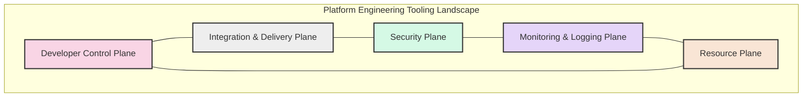

### Developer Control Plane

The Developer Control Plane provides tools and interfaces that developers directly interact with to manage their applications and services.

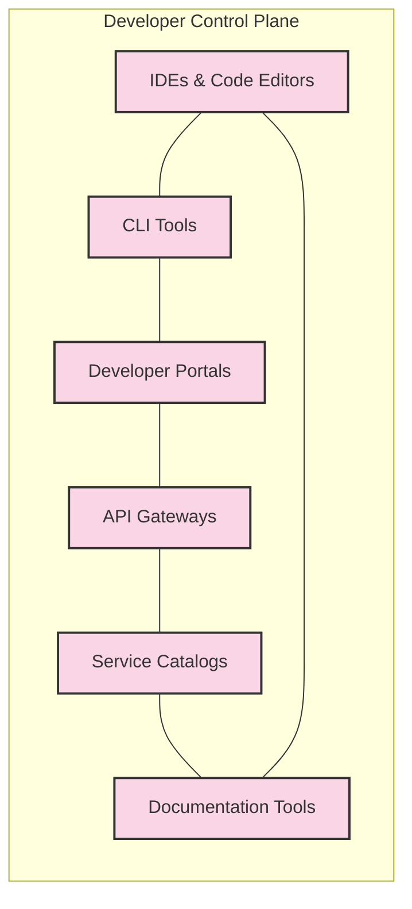

Key components include:

- **IDEs & Code Editors**: Tools like VS Code, IntelliJ, and Eclipse that provide integrated development environments
- **CLI Tools**: Command-line interfaces for interacting with platform services
- **Developer Portals**: Web interfaces for visualizing and managing applications and infrastructure
- **API Gateways**: Entry points for APIs that handle routing, authentication, and rate limiting
- **Service Catalogs**: Directories of available services and APIs
- **Documentation Tools**: Platforms for creating and maintaining technical documentation

### Integration & Delivery Plane

The Integration & Delivery Plane focuses on automating the build, test, and deployment processes for applications.

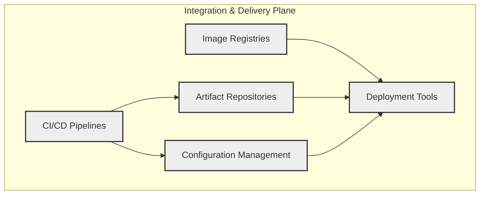

Key components include:

- **CI/CD Pipelines**: Tools like Jenkins, GitHub Actions, and GitLab CI/CD that automate building, testing, and deploying code
- **Artifact Repositories**: Storage for build artifacts such as JARs, WARs, and other packages
- **Configuration Management**: Tools for managing application configurations across environments
- **Image Registries**: Repositories for container images
- **Deployment Tools**: Software for automating application deployments to various environments

### Security Plane

The Security Plane provides tools and processes for securing applications and infrastructure throughout the development lifecycle.

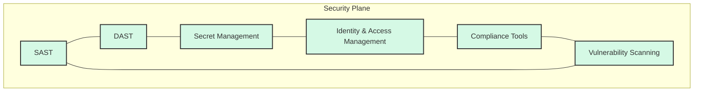

Key components include:

- **Static Application Security Testing (SAST)**: Analyzes source code to identify security vulnerabilities
- **Dynamic Application Security Testing (DAST)**: Tests running applications to find security issues
- **Secret Management**: Tools for securely storing and accessing credentials and other sensitive information
- **Identity & Access Management**: Solutions for managing user identities and controlling access to resources
- **Compliance Tools**: Software for ensuring adherence to regulatory requirements
- **Vulnerability Scanning**: Tools that scan applications and infrastructure for known vulnerabilities

### Monitoring & Logging Plane

The Monitoring & Logging Plane provides visibility into application performance and behavior.

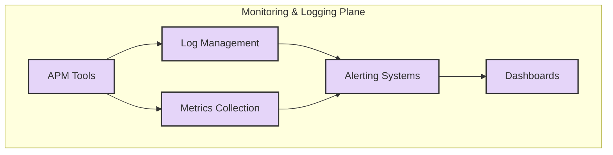

Key components include:

- **Application Performance Monitoring (APM)**: Tools that track and diagnose application performance
- **Log Management**: Solutions for collecting, parsing, and analyzing log data
- **Metrics Collection**: Systems for gathering and storing performance metrics
- **Alerting Systems**: Tools that notify teams of issues and anomalies
- **Dashboards**: Visual interfaces for monitoring system health and performance

### Resource Plane

The Resource Plane manages the infrastructure and resources that applications run on.

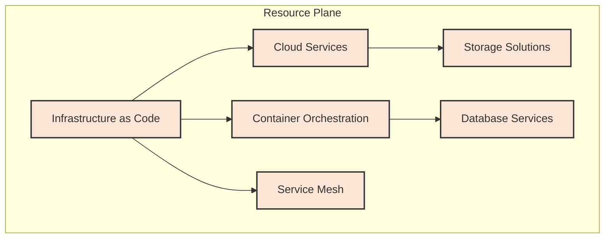

Key components include:

- **Infrastructure as Code (IaC)**: Tools like Terraform and Pulumi for defining infrastructure in code
- **Cloud Services**: Platforms like AWS, Azure, and GCP that provide computing resources
- **Container Orchestration**: Systems like Kubernetes for managing containerized applications
- **Service Mesh**: Solutions for managing service-to-service communication
- **Storage Solutions**: Services for storing data
- **Database Services**: Managed database solutions

### Platform Engineering Tools Landscape

The platform engineering tools landscape continues to evolve as new tools and methodologies emerge. Below is a comprehensive view of current popular tools by category:

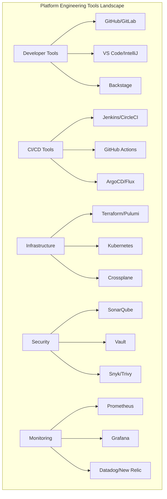

## Maturity Model

The Platform Engineering Maturity Model helps organizations assess their current capabilities and plan for growth.

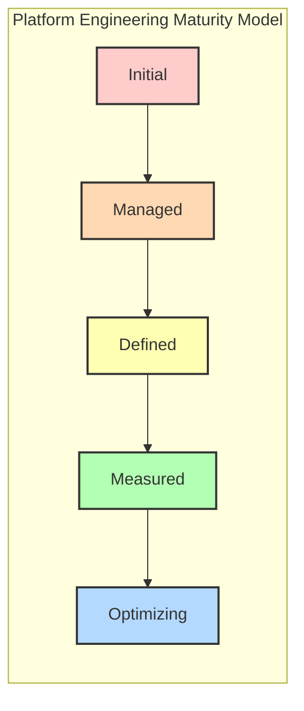

### Level 1: Initial

- Ad-hoc processes
- Manual deployments
- Limited automation
- Siloed teams
- Minimal self-service capabilities

### Level 2: Managed

- Basic CI/CD pipelines established
- Some deployment automation
- Preliminary developer self-service
- Beginning cloud adoption
- Basic monitoring in place

### Level 3: Defined

- Standardized CI/CD processes
- Infrastructure as Code adoption
- Developer portals for self-service
- Established cloud strategy
- Comprehensive monitoring and alerting

### Level 4: Measured

- Metrics-driven development
- Automated security scanning
- Full self-service capabilities
- Multi-cloud strategy
- Advanced observability

### Level 5: Optimizing

- Continuous optimization of platform
- Predictive analysis for resources
- Complete developer autonomy
- Cloud-agnostic architecture
- AI-powered operations

## References

### Internal Developer Platform on AWS Cloud

AWS provides numerous services that can be used to build a comprehensive internal developer platform.

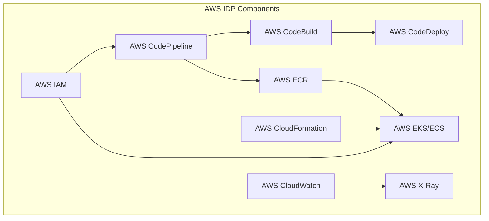

Key AWS services for platform engineering:

- **AWS CodeStar**: Unified interface for managing software development activities
- **AWS CodePipeline/CodeBuild/CodeDeploy**: CI/CD services
- **AWS ECR**: Container registry
- **AWS EKS/ECS**: Kubernetes service/Container service
- **AWS CloudFormation/CDK**: Infrastructure as Code
- **AWS IAM**: Identity and access management
- **AWS CloudWatch/X-Ray**: Monitoring and observability

### Internal Developer Platform on Google Cloud

Google Cloud Platform provides a rich set of services for building internal developer platforms.

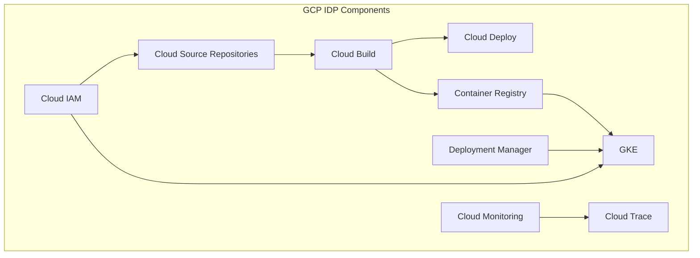

Key GCP services for platform engineering:

- **Google Kubernetes Engine (GKE)**: Managed Kubernetes service
- **Cloud Build**: CI/CD service
- **Artifact Registry**: Repository for container images and packages
- **Cloud Deploy**: Managed continuous delivery service
- **Cloud Monitoring/Logging**: Observability services
- **Identity and Access Management (IAM)**: Access control
- **Cloud Source Repositories**: Git repositories

### Internal Developer Platform on Azure Cloud

Microsoft Azure provides comprehensive services for building internal developer platforms.

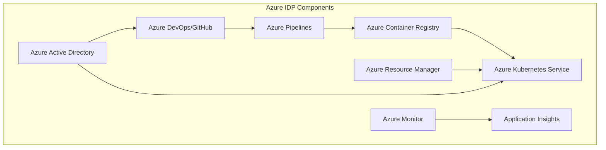

Key Azure services for platform engineering:

- **Azure DevOps/GitHub**: Development and collaboration tools
- **Azure Pipelines**: CI/CD service
- **Azure Container Registry**: Repository for container images
- **Azure Kubernetes Service (AKS)**: Managed Kubernetes service
- **Azure Resource Manager**: Infrastructure as Code
- **Azure Active Directory**: Identity and access management
- **Azure Monitor/Application Insights**: Monitoring and observability

### Internal Developer Platform on OpenShift

Red Hat OpenShift provides a comprehensive platform for building and managing containerized applications.

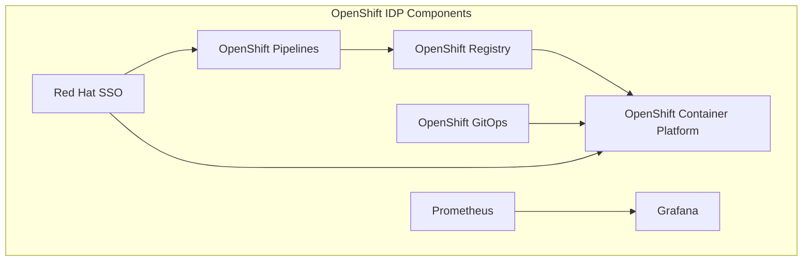

Key OpenShift components for platform engineering:

- **OpenShift Container Platform**: Enterprise Kubernetes platform
- **OpenShift Pipelines**: CI/CD based on Tekton
- **OpenShift Registry**: Integrated container registry
- **OpenShift GitOps**: GitOps with ArgoCD
- **Red Hat SSO**: Identity and access management
- **Prometheus/Grafana**: Monitoring and observability
- **OpenShift Service Mesh**: Based on Istio for service-to-service communication

### Internal Developer Platform on Multi-Cloud

A multi-cloud approach provides flexibility and prevents vendor lock-in, but requires additional tools for consistency.

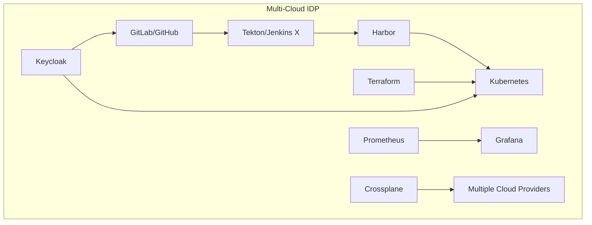

Key components for multi-cloud platform engineering:

- **Kubernetes**: Container orchestration across clouds
- **Crossplane**: Control plane for multi-cloud resource management
- **Terraform**: Infrastructure as Code for multiple cloud providers
- **GitLab/GitHub**: Source code management
- **Tekton/Jenkins X**: Cloud-native CI/CD
- **Harbor**: Multi-tenant container registry
- **Keycloak**: Identity and access management
- **Prometheus/Grafana**: Monitoring and observability
- **Istio/Linkerd**: Service mesh for multi-cluster communication

## Conclusion

Platform engineering is evolving rapidly as organizations seek to improve developer productivity and operational efficiency. By implementing comprehensive internal developer platforms with tools for CI/CD, security, monitoring, and infrastructure management, companies can accelerate their software delivery while maintaining quality and security.

A successful platform engineering initiative requires:

1. A clear understanding of developer needs
2. Standardized processes and workflows
3. Robust self-service capabilities
4. Strong security integration
5. Comprehensive observability
6. A culture of continuous improvement

By following these principles and leveraging the appropriate tools for your environment, you can build an internal developer platform that enhances productivity and drives business value.

---