# AI Code Assistant Performance Scoring Framework

## Overview

This scorecard provides a comprehensive evaluation framework for AI code assistants, measuring performance across four key domains: Intelligence, Acceleration, Experience, and Value. Each domain contains specific criteria rated on a scale of 0-10 points, creating a total potential score of 100 points.

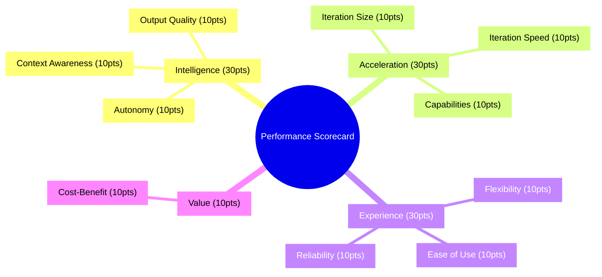

## Scoring Framework

Each dimension consists of multiple criteria, with each criterion scored from 0-10 points:

| Score Range | Performance Level | Description |
|-------------|-------------------|-------------|
| 8-10 | Exceptional | Exceeds requirements with exceptional performance |
| 6-7 | Good | Meets all requirements with solid performance |
| 4-5 | Fair | Meets basic requirements with limitations |
| 0-3 | Poor | Falls short of basic requirements |

## 1. Intelligence (30 points)

Intelligence evaluates how effectively the AI understands context, generates high-quality output, and operates with minimal supervision.

### 1.1 Context Awareness (10 points)

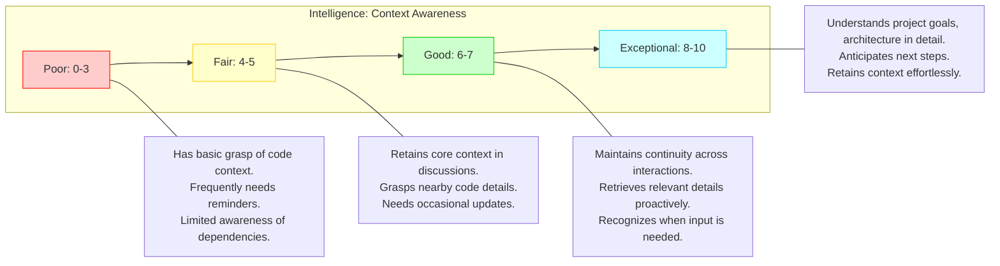

### 1.2 Output Quality (10 points)

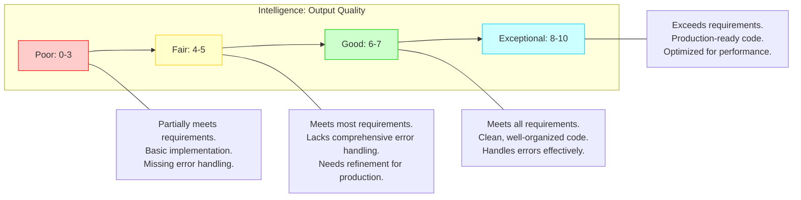

### 1.3 Autonomy (10 points)

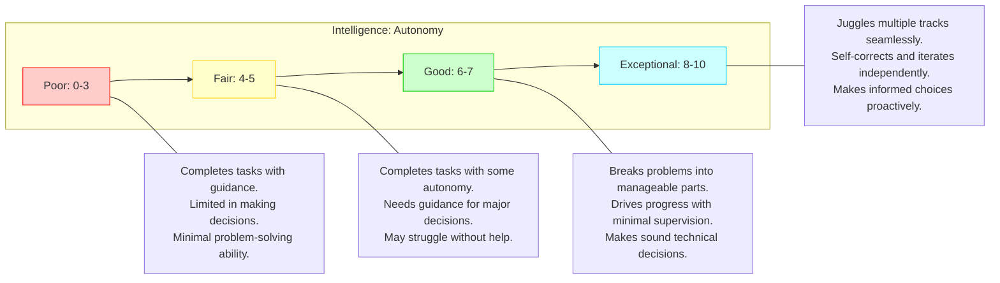

## 2. Acceleration (30 points)

Acceleration measures how the AI enhances developer productivity through code generation capabilities, response time, and feature breadth.

### 2.1 Iteration Size (10 points)

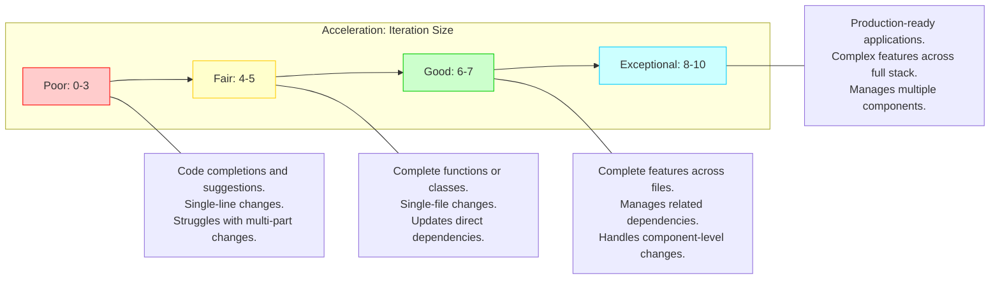

### 2.2 Iteration Speed (10 points)

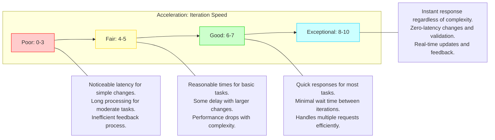

### 2.3 Capabilities (10 points)

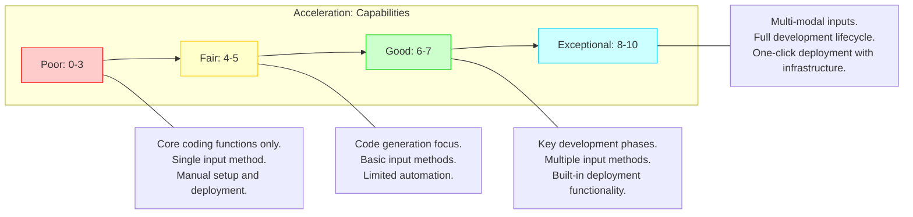

## 3. Experience (30 points)

Experience evaluates the user interaction quality, including flexibility across environments, ease of use, and operational reliability.

### 3.1 Flexibility (10 points)

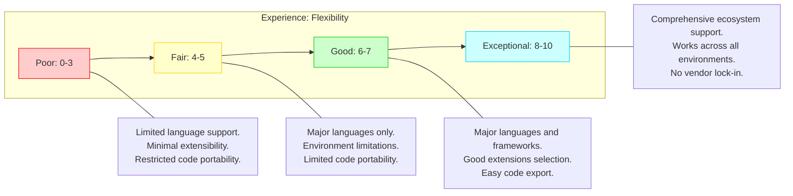

### 3.2 Ease of Use (10 points)

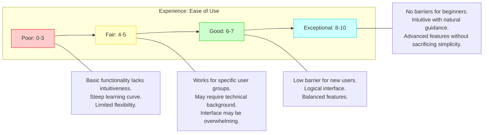

### 3.3 Reliability (10 points)

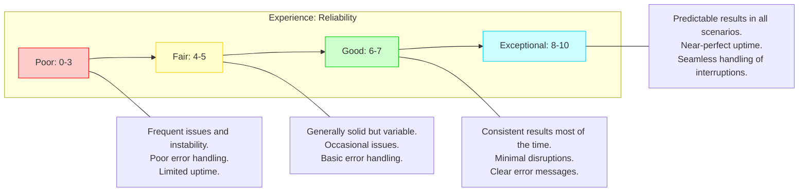

## 4. Value (10 points)

Value assesses the overall cost-benefit ratio, pricing structure, and return on investment.

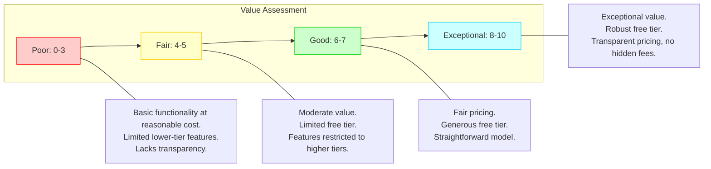

## Evaluation Process

To effectively evaluate AI code assistants using this scorecard:

1. **Define Requirements**: Identify organizational priorities and specific use cases
2. **Assign Weights**: Adjust the importance of each dimension based on team needs
3. **Conduct Assessment**: Score each AI tool across all dimensions
4. **Calculate Final Score**: Sum weighted scores across all criteria
5. **Compare Results**: Analyze strengths and weaknesses of each tool

## AI Code Assistant Comparison

This scorecard can be applied to evaluate the following AI code assistants:

1. **GitHub Copilot**
2. **Tabnine**
3. **Codeium**
4. **Amazon Q Developer**
5. **Cursor**
6. **Windsurf**
7. **CodeGPT**
8. **Google Code Assist**

## Conclusion

This performance scorecard provides a structured approach to evaluating AI code assistants across multiple dimensions. By systematically assessing each tool against these criteria, organizations can select the solution that best aligns with their specific development needs and priorities.

The highest-performing AI code assistants will demonstrate strengths across all four domains—Intelligence, Acceleration, Experience, and Value—though the relative importance of each domain may vary depending on your organization's specific requirements and constraints.