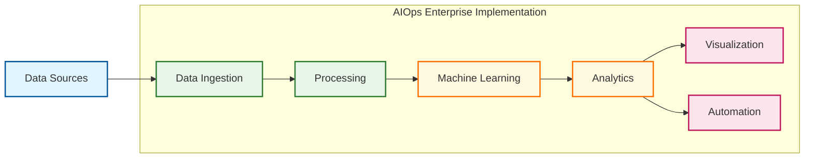
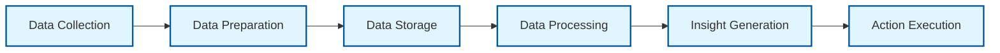

# AIOps: A Comprehensive Enterprise Implementation Guide

## 📋 Table of Contents

1. [Introduction to AIOps](#1-introduction-to-aiops)
2. [AIOps Technical Foundation](#2-aiops-technical-foundation)
3. [Core AIOps Capabilities](#3-core-aiops-capabilities)
4. [Enterprise Implementation Strategy](#4-enterprise-implementation-strategy)
5. [Practical Use Cases](#5-practical-use-cases)
6. [Integration with Modern IT Practices](#6-integration-with-modern-it-practices)
7. [Common Implementation Challenges](#7-common-implementation-challenges)
8. [Advanced AIOps Applications](#8-advanced-aiops-applications)
9. [AIOps Tools Landscape](#9-aiops-tools-landscape)
10. [Future of AIOps](#10-future-of-aiops)

---

## 1. Introduction to AIOps

### Definition and Evolution

> *"AIOps represents the application of artificial intelligence and machine learning technologies to transform how enterprises manage their IT operations."*

Artificial Intelligence for IT Operations (AIOps) has evolved from a conceptual framework to an enterprise-grade approach for managing increasingly complex IT environments. The term was coined by Gartner in 2016 and has since become a cornerstone of modern IT operations strategy.

#### Evolution Timeline

| Era | Period | Key Characteristics |
|:---|:---|:---|
| **Initial Monitoring** | Pre-2016 | Traditional monitoring tools with basic analytics capabilities |
| **Algorithmic IT Ops** | 2016-2018 | Introduction of machine learning for pattern recognition and correlation |
| **Integrated Platforms** | 2018-2020 | Comprehensive platforms combining data ingestion, analysis, and actionable insights |
| **Autonomous Ops** | 2020-Present | Advanced self-remediation capabilities and predictive operations |

AIOps emerged as a response to several converging challenges in enterprise IT:

* 📈 Exponential growth in operational data volume and velocity
* 🔄 Increased complexity from hybrid cloud environments
* 🧩 The shift toward microservices architectures
* ⏱️ The need for real-time service assurance
* 👨‍💻 A growing skills gap in specialized operations talent

---

### Business Context and Drivers

The rapid acceleration of digital transformation initiatives has fundamentally changed the IT operations landscape. Several key business drivers have accelerated AIOps adoption:

#### Digital Business Acceleration
Organizations are digitizing products, services, and customer touchpoints at unprecedented rates, creating complex technology ecosystems that traditional operations methods cannot effectively manage.

#### Customer Experience Imperatives
Digital services require near-perfect availability and performance, making traditional reactive approaches to operational incidents inadequate.

#### IT Complexity Explosion
The average enterprise now manages a hybrid landscape of legacy systems, on-premises infrastructure, multiple public clouds, containers, and microservices—creating an environment too complex for human operators to monitor effectively.

#### Cloud-Native Architectures
As organizations adopt cloud-native design patterns, the volume of components, dependencies, and potential failure points has expanded exponentially.

#### Resource Constraints
Organizations face growing skill shortages in specialized IT operations roles while simultaneously being pressured to reduce operational costs.

---

### Core Business Value Proposition

AIOps delivers tangible business value across multiple dimensions:

#### Financial Impact

* **Cost Reduction**
  * Reduced mean time to resolution (MTTR) by 30-50%
  * Decreased operational costs through automation of routine tasks
  * Lower downtime costs through predictive maintenance
  * Optimized infrastructure spending through accurate capacity forecasting

#### Operational Excellence

* **Service Improvement**
  * Proactive identification of issues before they impact customers
  * Consistent service delivery through automated processes
  * Reduced operational noise through intelligent filtering
  * Cross-domain visibility into complex service dependencies

#### Business Agility

* **Accelerated Innovation**
  * Faster deployment cycles with reduced operational risk
  * More efficient release management
  * Enhanced ability to scale services without proportional headcount increases
  * Improved innovation capacity by freeing IT resources from routine maintenance

#### Risk Reduction

* **Enhanced Security and Control**
  * Early detection of security anomalies
  * Comprehensive visibility across hybrid environments
  * Consistent policy enforcement through automation
  * Reduced human error through algorithmic decision support

The business case for AIOps becomes particularly compelling when considering the total cost of ownership for IT operations and the opportunity cost of suboptimal service delivery in a digital-first business environment.

---

## 2. AIOps Technical Foundation

### Architecture Components

A robust AIOps implementation requires a well-architected foundation comprising several key components:

#### 1. Data Integration Layer
Collects data from diverse sources including:
* Infrastructure monitoring
* Application performance monitoring
* Log management systems
* Service management platforms
* Network monitoring tools
* Cloud provider metrics
* Security monitoring
* Business transaction monitoring

#### 2. Data Processing Engine
Handles the ingestion, normalization, and processing of diverse data types:
* Structured metrics data
* Unstructured logs
* Events and alerts
* Topology information
* Configuration data
* Change records
* Trace data

#### 3. Analytics Layer
Applies AI/ML algorithms to:
* Detect anomalies
* Establish normal performance baselines
* Correlate events across domains
* Identify root causes
* Predict potential issues

#### 4. Automation Layer
Executes defined actions to:
* Remediate known issues
* Scale resources as needed
* Create and route tickets
* Notify appropriate teams
* Trigger workflow automation

#### 5. Knowledge Management
Captures and organizes:
* Incident resolution patterns
* Subject matter expertise
* Historical context
* Remediation procedures

#### 6. Engagement Layer
Provides interfaces for:
* Operations dashboards
* Alert notifications
* Integration with collaboration tools
* Mobile interfaces
* API access for external systems

---

### Data Pipeline Architecture

The AIOps data pipeline follows a sequential flow that transforms raw operational data into actionable intelligence:

#### 1. Data Collection
* Real-time streaming data ingestion
* Batch processing of historical data
* API-based data acquisition
* Agent-based collection
* Agentless discovery

#### 2. Data Preparation
* Normalization of formats and timestamps
* Deduplication of redundant data
* Filtering of non-essential information
* Enrichment with contextual metadata
* Format transformation

#### 3. Data Storage
* Time-series databases for metrics
* Document stores for unstructured data
* Graph databases for topology
* Data lakes for long-term storage
* In-memory systems for real-time processing

#### 4. Data Processing
* Real-time pattern recognition
* Statistical analysis
* Anomaly detection
* Correlation algorithms
* Machine learning models

#### 5. Insight Generation
* Root cause determination
* Impact analysis
* Predictive forecasting
* Recommendation generation
* Business context mapping

#### 6. Action Execution
* Alert creation and routing
* Automated remediation
* Ticketing system integration
* Workflow trigger
* Communication with stakeholders

This pipeline operates as a continuous cycle, with feedback loops that enhance the system's accuracy over time through supervised and unsupervised learning.

---

### Big Data Infrastructure

The foundation of any effective AIOps implementation is a robust big data infrastructure capable of handling the volume, velocity, and variety of modern IT operational data:

#### Storage Architecture
* **Multi-tiered storage** for cost optimization
  * Hot storage for real-time data (typically in-memory or SSD)
  * Warm storage for recent historical data
  * Cold storage for long-term retention and compliance

#### Processing Capabilities
* Stream processing for real-time analytics
* Batch processing for historical analysis
* Distributed computing for complex algorithms
* Resource elasticity to handle variable workloads

#### Data Management
* Data lifecycle policies
* Compression and archiving strategies
* Data quality monitoring
* Access control and security
* Compliance with relevant regulations

Enterprises typically implement big data infrastructure using either:

##### 1. Cloud-Native Solutions
* Managed services like AWS EMR, Google Dataproc, or Azure HDInsight
* Serverless analytics platforms
* Cloud provider-native data lakes

##### 2. On-Premises Infrastructure
* Hadoop ecosystems
* Distributed databases (Cassandra, HBase)
* Specialized time-series databases

##### 3. Hybrid Approaches
* Data processing close to the source
* Tiered storage spanning cloud and on-premises
* Cross-environment data federation

---

### Machine Learning Foundations

The intelligence in AIOps comes from various machine learning techniques applied to operational data:

#### 1. Supervised Learning
* Classification algorithms for event categorization
* Regression models for performance prediction
* Anomaly detection with labeled training data

#### 2. Unsupervised Learning
* Clustering for pattern detection
* Association rule mining for correlation
* Dimensionality reduction for data visualization
* Anomaly detection without labeled training data

#### 3. Reinforcement Learning
* Optimization of remediation actions
* Adaptive thresholding
* Policy-based automation

#### 4. Deep Learning
* Recurrent Neural Networks for time-series analysis
* Convolutional Neural Networks for pattern recognition
* Autoencoders for anomaly detection
* Natural Language Processing for log analysis

#### Critical Machine Learning Capabilities

* **Feature Engineering**: Transforming raw operational data into meaningful inputs for ML algorithms
* **Model Training**: Using historical data to develop effective prediction and classification models
* **Model Validation**: Testing models against known scenarios to ensure accuracy
* **Model Deployment**: Implementing models in production environments
* **Model Monitoring**: Tracking model performance and detecting drift
* **Continuous Learning**: Updating models with new data to maintain accuracy

Effective AIOps implementations must balance model sophistication with interpretability, as operations teams often need to understand the reasoning behind AI-driven recommendations.

---

## 3. Core AIOps Capabilities

### Observability Framework

Modern IT environments demand a comprehensive observability framework that goes beyond traditional monitoring approaches. AIOps-powered observability provides:

#### Multi-Dimensional Data Collection

| Data Type | Description | Examples |
|:---|:---|:---|
| **Metrics** | Quantitative measurements of system performance | CPU utilization, response time, error rates |
| **Logs** | Detailed records of system events and activities | Application logs, system logs, security logs |
| **Traces** | End-to-end transaction paths across distributed systems | Request flows, API calls, database queries |
| **Events** | Significant state changes from infrastructure and applications | Alerts, status changes, deployment events |
| **Topological Data** | Relationship mapping between components | Service dependencies, network connections |

#### Unified Observability
* Centralized visibility across hybrid and multi-cloud environments
* Correlation of data across domains (network, infrastructure, applications)
* Business context mapping to technical components
* Service-oriented views rather than siloed monitoring

#### Advanced Visualization
* Dynamic service dependency maps
* Real-time topology visualization
* Business impact dashboards
* Customizable operational views
* Drill-down capabilities for root cause analysis

#### Contextual Enrichment
* Integration with CMDB and asset management
* Change correlation
* User experience context
* Business process alignment
* Historical performance comparison

Enterprises implementing AIOps-driven observability typically evolve through the following maturity stages:

1. **Reactive Monitoring**: Basic alerting when thresholds are breached
2. **Integrated Monitoring**: Consolidated views across multiple domains
3. **Proactive Observability**: Early warning indicators and trend analysis
4. **Predictive Insights**: Forecasting potential issues before they occur
5. **Business-Aligned Observability**: Direct correlation between technical metrics and business outcomes

---

### Algorithmic Event Correlation

One of the most valuable capabilities of AIOps is its ability to intelligently correlate events across complex IT ecosystems:

#### Correlation Approaches
* **Temporal Correlation**: Events occurring within defined time windows
* **Topological Correlation**: Events related through infrastructure and application dependencies
* **Causal Correlation**: Events with direct cause-and-effect relationships
* **Statistical Correlation**: Events showing significant statistical relationships

#### Noise Reduction
* Event deduplication across monitoring sources
* Suppression of symptom alerts
* Filtering of known benign events
* Prioritization based on business impact

#### Root Cause Identification
* Automated determination of initiating events
* Probabilistic ranking of potential causes
* Historical pattern matching
* Dependency-aware analysis

#### Impact Analysis
* Service impact determination
* Affected user population estimation
* Business process mapping
* SLA/OLA violation prediction

Sophisticated event correlation can reduce alert volumes by 90% or more, allowing operations teams to focus on meaningful incidents rather than being overwhelmed by alert noise.

---

### Automated Anomaly Detection

AIOps platforms leverage multiple techniques to identify abnormal patterns that may indicate potential issues:

#### Detection Methods
* **Statistical Process Control**: Identifying deviations from normal distributions
* **Time-Series Analysis**: Detecting changes in patterns over time
* **Clustering Techniques**: Identifying outliers in multidimensional data
* **Density-Based Methods**: Finding instances that differ from local density patterns
* **Neural Network Approaches**: Using deep learning to identify complex anomalies

#### Anomaly Types

| Type | Description | Example |
|:---|:---|:---|
| **Point Anomalies** | Individual data points that deviate significantly | Sudden CPU spike to 100% |
| **Contextual Anomalies** | Data points normal in some contexts but anomalous in others | High CPU usage during backup window vs. normal hours |
| **Collective Anomalies** | Groups of related data points showing abnormal patterns | Gradual memory leak across multiple instances |
| **Seasonal Anomalies** | Deviations from expected cyclical patterns | Unexpected traffic pattern for time of day |

#### Contextual Awareness
* Time-of-day relevance
* Day-of-week patterns
* Seasonal variations
* Maintenance window awareness
* Change correlation

#### Dynamic Baselining
* Adaptive thresholds based on historical patterns
* Peer group comparison
* Self-learning normal behavior models
* Multi-dimensional baseline profiles

Effective anomaly detection significantly reduces false positives compared to traditional threshold-based alerting, while simultaneously improving detection of subtle issues that static thresholds would miss.

---

### Intelligent Alert Management

Beyond correlation and anomaly detection, AIOps transforms how alerts are managed throughout their lifecycle:

#### Alert Enrichment
* Adding contextual information
* Service mapping
* Historical context
* Similar past incidents
* Relevant documentation

#### Alert Prioritization
* Business impact assessment
* Service criticality weighting
* User impact estimation
* SLA consideration
* Urgency determination

#### Alert Routing
* Intelligent assignment to appropriate teams
* Skill-based routing
* Workload balancing
* Escalation path optimization
* Follow-the-sun support enablement

#### Alert Lifecycle Management
* Suppression during maintenance
* Auto-resolution of transient issues
* Alert aging and re-notification
* Duplicate prevention
* Related alert grouping

By transforming raw alerts into actionable, contextualized incidents, AIOps reduces mean time to identify (MTTI) and mean time to resolve (MTTR) while improving the efficiency of operations teams.

---

### Predictive Analytics

AIOps enables organizations to shift from reactive to proactive operations through predictive capabilities:

#### Capacity Forecasting
* Resource utilization prediction
* Growth trend analysis
* Seasonal pattern recognition
* Anomalous demand identification
* Cost optimization recommendations

#### Performance Prediction
* Service degradation forecasting
* Transaction response time prediction
* Database performance trending
* Network saturation forecasting
* Resource contention prediction

#### Failure Prediction
* Hardware failure probability assessment
* Software failure risk identification
* Service disruption likelihood estimation
* Security vulnerability exploitation risk
* Dependency failure impact

#### Business Impact Prediction
* Revenue impact forecasting
* User experience degradation prediction
* Compliance risk assessment
* Brand reputation impact estimation
* Productivity loss prediction

Predictive analytics typically leverages time-series forecasting methods, machine learning classification models, and statistical trend analysis to identify patterns that precede known issues, allowing preventive action before business impact occurs.

---

### Automated Remediation

The ultimate goal of AIOps is to enable autonomous operations through intelligent automation:

#### Remediation Approaches

| Approach | Description | Example |
|:---|:---|:---|
| **Rule-Based Automation** | Predefined responses to known conditions | Restart service when not responding |
| **Recommended Actions** | AI-suggested responses requiring human approval | "Database connection pool needs expansion - Approve?" |
| **Supervised Automation** | AI-driven actions with human oversight | Automatic scaling with notification and manual override |
| **Autonomous Remediation** | Self-healing systems with minimal human intervention | Full application stack recovery during failure |

#### Common Automation Use Cases
* Resource scaling (up/down/in/out)
* Service restarts
* Configuration adjustments
* Backup and failover initiation
* Patch deployment
* Security control implementation

#### Orchestration Capabilities
* Multi-step remediation workflows
* Cross-domain coordination
* Rollback capabilities
* Success verification
* Notification and documentation

#### Control and Governance
* Action approval workflows
* Audit trails of automated actions
* Role-based authorization
* Scheduled automation windows
* Environment-specific policies

Enterprises typically implement automated remediation using a crawl-walk-run approach:

1. **Crawl**: Automating simple, low-risk actions with explicit approval
2. **Walk**: Implementing automated responses for well-understood issues with post-execution notification
3. **Run**: Enabling autonomous remediation for critical services where downtime must be minimized

---

## 4. Enterprise Implementation Strategy

### Organizational Readiness Assessment

Before embarking on an AIOps implementation, organizations should assess their readiness across several dimensions:

#### Technical Readiness
* Data availability and quality assessment
* Existing monitoring coverage evaluation
* Integration capability assessment
* Infrastructure capacity for data processing
* Existing automation maturity

#### Process Readiness
* Incident management process maturity
* Change management effectiveness
* Problem management discipline
* Documentation quality and accessibility
* Continuous improvement mechanisms

#### People Readiness
* Leadership understanding and support
* Team skill assessment
* Cultural openness to AI-assisted operations
* Resistance points identification
* Training needs determination

#### Governance Readiness
* Data governance maturity
* Security and compliance requirements
* Decision-making authority structures
* Performance measurement frameworks
* Investment approval processes

The readiness assessment should produce a gap analysis and roadmap for addressing deficiencies before or in parallel with AIOps implementation.

---

### AIOps Strategic Charter

A successful AIOps program requires a clear charter that articulates:

#### Vision Statement
* Long-term aspirational goal
* Business outcomes sought
* Operational transformation targets
* Timeline horizons (1-3-5 year view)

#### Program Objectives
* Specific, measurable goals
* Priority order of capabilities
* Success criteria definition
* Value realization expectations

#### Scope Definition
* Services and applications included
* Infrastructure environments in scope
* Data domains to be integrated
* Teams and stakeholders involved

#### Guiding Principles
* Decision-making framework
* Risk tolerance parameters
* Ethical AI considerations
* Human-in-the-loop requirements

#### Governance Structure
* Executive sponsorship
* Steering committee composition
* Reporting cadence
* Escalation paths

The charter should be endorsed by senior leadership and communicated broadly to ensure alignment and manage expectations.

---

### Team Structure and Capabilities

Implementing AIOps requires a multidisciplinary team with diverse skills:

#### Core Team Roles

| Role | Responsibilities | Key Skills |
|:---|:---|:---|
| **AIOps Program Manager** | Overall program coordination and delivery | Project management, stakeholder management, IT operations knowledge |
| **Data Engineers** | Data pipeline development and maintenance | ETL, data integration, data modeling, big data technologies |
| **Data Scientists/ML Engineers** | Algorithm development and model training | Statistics, machine learning, programming (Python/R), time-series analysis |
| **Integration Specialists** | Connecting AIOps platform with existing systems | APIs, middleware, data formats, enterprise architecture |
| **Domain SMEs** | Providing context and validation | Deep knowledge in specific domains (network, infrastructure, applications) |
| **Automation Engineers** | Implementing remediation workflows | Scripting, orchestration tools, infrastructure as code |
| **UI/UX Specialists** | Designing effective interfaces | Data visualization, user experience design, dashboard development |
| **Change Management Lead** | Driving adoption and organizational change | Communication, training, organizational development |

#### Extended Team Participation
* Service Owners
* Operations Teams
* Security Representatives
* Compliance Officers
* Business Stakeholders
* End User Representatives

#### Skills Development Areas
* Machine Learning Fundamentals
* Data Analysis and Visualization
* Python/R Programming
* API Development
* Integration Patterns
* Cloud Platform Knowledge
* Automation Frameworks

#### Organizational Models
* **Centralized**: Single team responsible for enterprise AIOps
* **Federated**: Central platform with domain-specific implementations
* **Community of Practice**: Distributed expertise with shared standards
* **Center of Excellence**: Specialized team supporting distributed adoption

Most organizations begin with a centralized approach and evolve toward a federated model as capabilities mature.

---

### Implementation Roadmap

A typical AIOps implementation follows a phased approach:

#### Phase 1: Foundation (3-6 months)
* Data collection strategy implementation
* Initial platform deployment
* Integration with core monitoring systems
* Baseline measurements establishment
* Proof of concept in limited domains

#### Phase 2: Basic Capabilities (6-12 months)
* Event correlation implementation
* Noise reduction optimization
* Basic anomaly detection
* Initial dashboard development
* Alert enrichment implementation

#### Phase 3: Advanced Features (12-18 months)
* Predictive analytics implementation
* Automated remediation for selected use cases
* Dynamic baselining across services
* Business impact correlation
* Advanced visualization capabilities

#### Phase 4: Optimization (18-24 months)
* Continuous model improvement
* Expanded automation scope
* Integration with business systems
* Self-service capabilities
* Advanced use case implementation

#### Phase 5: Transformation (24+ months)
* Autonomous operations for suitable domains
* Business-driven prioritization
* Preemptive issue resolution
* Innovation enablement
* Operating model transformation

Each phase should deliver measurable value while building toward the long-term vision.

---

### Success Metrics and KPIs

Measuring AIOps success requires a comprehensive framework of metrics:

#### Operational Metrics
* Mean Time to Detect (MTTD) reduction
* Mean Time to Resolve (MTTR) reduction
* Alert volume reduction
* False positive reduction
* Automated resolution percentage
* Incident volume reduction

#### Financial Metrics
* Cost per incident
* Downtime cost reduction
* Staff efficiency improvements
* Infrastructure optimization savings
* Avoided outage value
* Total cost of ownership

#### Service Quality Metrics
* Service availability improvement
* Mean time between failures (MTBF)
* Service level agreement compliance
* Customer satisfaction scores
* Application performance improvement
* Business transaction reliability

#### Organizational Metrics
* Staff satisfaction improvement
* Knowledge capture effectiveness
* Cross-team collaboration increase
* Innovation capacity enhancement
* Skill development progression

Metrics should be established at baseline before implementation and tracked throughout the AIOps journey to demonstrate value and identify areas for improvement.

---

## 5. Practical Use Cases

### Incident Management Optimization

One of the most immediate and high-value applications of AIOps is transforming incident management:

#### Intelligent Event Correlation
* Automatic grouping of related alerts
* Root cause identification
* Noise suppression
* Impact determination
* Priority assignment

#### Enriched Incident Context
* Historical incident correlation
* Service mapping
* Configuration details
* Recent changes
* Knowledge article suggestions

#### Intelligent Routing
* Skill-based assignment
* Team workload balancing
* Escalation prediction
* Subject matter expert identification
* Cross-team coordination

#### Resolution Acceleration
* Similar incident identification
* Resolution recommendation
* Automated diagnostic collection
* Relevant documentation suggestion
* Remediation script suggestions

#### Post-Incident Learning
* Pattern identification for prevention
* Resolution documentation automation
* Knowledge gap identification
* Training recommendation
* Process improvement suggestions

Organizations implementing AIOps for incident management typically see 40-60% reduction in MTTR and 30-50% reduction in total incident volume through improved detection and prevention.

---

### Dynamic Baselining and Thresholding

Static thresholds are ineffective in dynamic environments. AIOps enables intelligent thresholding through:

#### Adaptive Baseline Models
* Time-of-day pattern recognition
* Day-of-week pattern recognition
* Seasonal variation modeling
* Trend-aware baselines
* Peer group comparison

#### Multi-Dimensional Thresholding
* Related metric correlation
* Compound condition detection
* Contextual threshold adjustment
* Configuration-aware thresholds
* Workload-sensitive boundaries

#### Time-Series Forecasting Techniques
* ARIMA/SARIMA modeling
* Exponential smoothing
* Prophet forecasting
* Neural network prediction
* Ensemble forecasting methods

#### Implementation Approaches
* Supervised learning with historical incidents
* Unsupervised anomaly detection
* Semi-supervised hybrid approaches
* Reinforcement learning for threshold optimization
* Continuous model retraining

Dynamic baselining significantly reduces false positives while improving detection of subtle degradation patterns that would be missed by traditional threshold methods.

---

### Event Deduplication and Noise Reduction

Alert fatigue is a critical challenge in modern operations. AIOps addresses this through:

#### Deduplication Techniques
* Exact match detection
* Fuzzy matching algorithms
* Temporal clustering
* Content similarity analysis
* Pattern recognition

#### Flapping Detection
* Rapid state change identification
* Oscillation pattern recognition
* Hysteresis implementation
* Alert suppression during instability
* Root cause analysis for unstable components

#### Noise Filtering Approaches
* Known benign alert suppression
* Maintenance window awareness
* Expected change correlation
* Low-impact alert dowgrading
* Alert storm detection and management

#### Alert Enrichment for Triage
* Probability of actionability scoring
* Historical response correlation
* Business impact assessment
* Effort estimation
* Knowledge base linkage

Organizations implementing effective noise reduction typically see 80-95% reduction in raw alert volume, allowing operations teams to focus on meaningful issues rather than triaging thousands of alerts.

---

### Capacity Forecasting

Predictive capacity management is a high-value AIOps use case:

#### Demand Forecasting Techniques
* Historical trend analysis
* Seasonal pattern detection
* Growth rate modeling
* Correlation with business drivers
* Anomalous demand detection

#### Resource Optimization
* Right-sizing recommendations
* Auto-scaling policy optimization
* Reserved capacity planning
* Cost optimization suggestions
* Waste identification

#### Constraint Prediction
* Bottleneck identification
* Saturation point forecasting
* Resource exhaustion prediction
* Performance degradation forecasting
* Capacity limit approach warnings

#### Cloud-Specific Capabilities
* Instance type optimization
* Reserved instance recommendations
* Spot instance opportunity identification
* Storage tier optimization
* Multi-cloud resource balancing

Effective capacity forecasting typically yields 15-30% infrastructure cost savings while simultaneously reducing performance-related incidents by preventing resource constraints.

---

### Service Health Management

AIOps enables comprehensive service health management through:

#### Service Modeling
* Component dependency mapping
* Critical path identification
* Redundancy analysis
* Failure impact modeling
* Performance contribution weighting

#### Health Scoring
* Multi-metric composite health indices
* User experience correlation
* Business transaction success rates
* Comparative health trending
* Leading indicator monitoring

#### Impact Analysis
* Affected user quantification
* Revenue impact estimation
* Productivity loss calculation
* Reputation impact assessment
* Compliance risk evaluation

#### Proactive Health Management
* Early warning detection
* Degradation trend identification
* Preventive maintenance recommendation
* Risk mitigation suggestions
* Resilience improvement opportunities

Service health management provides a business-aligned view of technical performance that helps prioritize operational activities based on business impact rather than technical severity.

---

## 6. Integration with Modern IT Practices

### AIOps in DevOps Environments

AIOps amplifies the effectiveness of DevOps practices through:

#### Deployment Risk Reduction
* Change risk assessment
* Deployment impact prediction
* Automated canary analysis
* Rollback trigger automation
* Feature flag impact analysis

#### Continuous Feedback
* Performance regression detection
* User experience impact measurement
* Error rate analysis
* Service reliability metrics
* Technical debt identification

#### Cross-Team Collaboration
* Shared observability platforms
* Unified incident management
* Collaborative root cause analysis
* Joint post-incident reviews
* Combined knowledge management

#### Pipeline Integration
* Quality gate automation
* Performance test result analysis
* Security vulnerability correlation
* Compliance verification
* Deployment approval automation

AIOps helps close the feedback loop in DevOps by providing data-driven insights about the operational impact of development activities, enabling faster, more reliable delivery cycles.

---

### Supporting Site Reliability Engineering

AIOps aligns closely with Site Reliability Engineering (SRE) principles:

#### Service Level Objective Management
* SLI automated measurement
* SLO compliance tracking
* Error budget calculation
* Trend analysis and forecasting
* Risk-based prioritization

#### Toil Reduction
* Repetitive task identification
* Automation opportunity detection
* Time spent analysis
* Cost of manual work quantification
* Knowledge capture automation

#### Reliability Engineering
* Failure mode analysis
* Chaos experiment monitoring
* Resilience testing support
* Recovery time optimization
* Dependency risk assessment

#### Production Readiness
* Automated checklist verification
* Monitoring coverage assessment
* Scalability validation
* Failure mode identification
* Operational documentation evaluation

AIOps provides SRE teams with the data and insights needed to maintain reliability while reducing manual effort, allowing them to focus on engineering improvements rather than operational firefighting.

---

### Cloud-Native Operations

Operating cloud-native environments presents unique challenges that AIOps helps address:

#### Dynamic Environment Management
* Auto-scaling optimization
* Ephemeral resource tracking
* Container health monitoring
* Serverless function performance analysis
* Multi-cloud visibility

#### Distributed System Observability
* Microservice dependency mapping
* Distributed tracing analysis
* API performance monitoring
* Service mesh telemetry integration
* End-to-end transaction tracking

#### Cloud Cost Optimization
* Resource utilization analysis
* Idle resource identification
* Right-sizing recommendations
* Reserved capacity planning
* Cost anomaly detection

#### Cloud-Specific Automation
* Infrastructure as Code validation
* Policy compliance enforcement
* Self-healing implementation
* Multi-cloud orchestration
* Secure configuration management

AIOps platforms designed for cloud-native operations typically offer specific capabilities for container orchestration platforms, serverless computing, and cloud provider-specific services.

---

### Microservices Monitoring

The complexity of microservices architectures requires specialized AIOps capabilities:

#### Service Mesh Integration
* Istio/Envoy metrics analysis
* Kubernetes pod health monitoring
* Container resource optimization
* API gateway performance analysis
* Network policy effectiveness monitoring

#### Distributed Tracing
* OpenTelemetry/Jaeger integration
* Latency hotspot identification
* Service dependency discovery
* Error propagation tracking
* Transaction path optimization

#### Polyglot Observability
* Language-specific instrumentation
* Framework-aware monitoring
* Database query optimization
* Third-party service dependency tracking
* Client library performance analysis

#### Resilience Pattern Monitoring
* Circuit breaker effectiveness analysis
* Retry storm detection
* Fallback mechanism validation
* Bulkhead isolation verification
* Rate limiting optimization

AIOps for microservices requires deep integration with modern observability frameworks and container orchestration platforms to provide the necessary visibility into these complex, distributed systems.

---

## 7. Common Implementation Challenges

### Organizational Change Management

AIOps represents a significant shift in how IT operations functions, requiring careful change management:

#### Common Resistance Points
* Fear of job displacement
* Distrust of AI-generated insights
* Attachment to existing tools and processes
* Concerns about skill relevance
* Reluctance to share tribal knowledge

#### Leadership Engagement Strategies
* Executive sponsorship cultivation
* Clear articulation of business benefits
* Tangible success metrics
* Regular progress communication
* Recognition of change champions

#### Staff Involvement Approaches
* Early practitioner participation
* Skills development opportunities
* Success celebration and recognition
* Transparent communication about role evolution
* Feedback incorporation

#### Cultural Transformation
* Shift from reactive to proactive mindset
* Data-driven decision making culture
* Continuous improvement orientation
* Collaborative problem solving
* Knowledge sharing incentives

Successful AIOps implementations treat organizational change as a primary workstream rather than an afterthought, with dedicated resources and explicit activities to address the human aspects of transformation.

---

### Data Quality and Availability

The effectiveness of AIOps is directly tied to the quality and comprehensiveness of available data:

#### Common Data Challenges
* Incomplete monitoring coverage
* Inconsistent data formats
* Timestamp synchronization issues
* Missing contextual information
* Historical data limitations

#### Data Quality Improvement
* Monitoring gap analysis
* Data completeness assessment
* Format standardization
* Metadata enrichment
* Time synchronization

#### Data Governance Requirements
* Data retention policies
* Privacy and compliance considerations
* Access control implementation
* Data lineage tracking
* Quality assurance processes

#### Progressive Data Enhancement
* Critical service prioritization
* Minimum viable data identification
* Incremental coverage expansion
* Continuous quality improvement
* Feedback loops for refinement

Organizations should begin with the data they have while simultaneously implementing a data enhancement roadmap to address gaps and quality issues over time.

---

### Skills Gap and Training

AIOps requires capabilities that may not exist within traditional IT operations teams:

#### Critical Skill Requirements
* Data engineering and integration
* Basic statistical analysis
* Machine learning concepts
* API and automation development
* Data visualization
* Process redesign

#### Skill Development Approaches
* Formal training programs
* Mentorship from data science teams
* Hands-on project participation
* Vendor-provided education
* Community participation

#### Team Composition Strategies
* Hybrid teams with diverse skills
* Data science partnership models
* Vendor/partner augmentation
* New role creation
* Career path development

#### Knowledge Transfer Mechanisms
* Documentation standards
* Cross-training sessions
* Communities of practice
* Recorded demonstrations
* Peer review processes

Organizations should develop a comprehensive talent strategy that includes upskilling existing staff, hiring for critical gaps, and leveraging partners to complement internal capabilities.

---

### Legacy Systems Integration

Most enterprises must integrate AIOps with existing operational tools and processes:

#### Integration Challenges
* Legacy monitoring tool limitations
* Proprietary data formats
* Limited API capabilities
* Batch vs. real-time constraints
* Duplicate and conflicting data

#### Integration Approaches
* API-first integration where available
* Log file processing for legacy systems
* Database replication techniques
* Webhook implementations
* Specialized adapters and connectors

#### Transitional Architectures
* Data lake as integration point
* Event bus/message queue implementation
* Dual-processing during migration
* Progressive replacement strategy
* Federation of old and new platforms

#### Modernization Roadmap
* Critical integration prioritization
* Technical debt assessment
* Replacement cost-benefit analysis
* Parallel operations planning
* Legacy retirement strategy

Rather than attempting complete replacement of legacy systems, successful AIOps implementations often begin by extracting value from existing tools through integration while planning for gradual modernization.

---

### Managing Expectations

Unrealistic expectations are a primary cause of perceived AIOps implementation failures:

#### Common Expectation Pitfalls
* Expecting immediate perfect accuracy
* Assuming complete automation from day one
* Underestimating implementation complexity
* Overlooking organizational change requirements
* Believing vendor marketing promises without validation

#### Expectation Setting Strategies
* Staged value realization roadmap
* Clear articulation of learning curve
* Transparent discussion of limitations
* Conservative benefit projections
* Early wins identification

#### Progress Communication
* Regular stakeholder updates
* Measured results sharing
* Challenge transparency
* Success story highlighting
* Lesson learned documentation

#### Continuous Adjustment
* Regular roadmap reviews
* Benefit realization tracking
* Scope refinement based on feedback
* Priorities adjustment
* Implementation pace calibration

Setting realistic expectations from the beginning and maintaining transparent communication throughout the implementation journey is critical for maintaining stakeholder support and perceiving success accurately.

---

## 8. Advanced AIOps Applications

### Natural Language Processing in IT Operations

NLP technologies are transforming how operations teams interact with systems and knowledge:

#### Log Analysis Applications
* Unstructured log pattern recognition
* Semantic clustering of log messages
* Entity extraction from narratives
* Root cause identification from descriptive text
* Knowledge extraction from documentation

#### Conversational Interfaces
* ChatOps implementation
* Natural language query processing
* Virtual operations assistants
* Voice-controlled operations
* Conversational knowledge retrieval

#### Documentation Intelligence
* Automatic procedure extraction
* Knowledge base optimization
* Question answering systems
* Document summarization
* Documentation gap identification

#### Human Communication Analysis
* Sentiment analysis of user reports
* Ticket content understanding
* Email and chat message prioritization
* Escalation language detection
* Communication quality assessment

NLP capabilities can dramatically improve knowledge accessibility and reduce the time spent searching for information during incident response.

---

### Deep Learning for Complex Pattern Recognition

Deep learning techniques enable recognition of complex patterns that traditional methods cannot detect:

#### Advanced Anomaly Detection
* Autoencoders for multidimensional anomalies
* Recurrent neural networks for sequence anomalies
* Convolutional networks for pattern recognition
* Generative adversarial networks for outlier detection
* Transfer learning for limited training data

#### Image and Signal Processing
* Infrastructure visual inspection automation
* Network traffic visualization analysis
* Heatmap pattern recognition
* Signal processing for performance data
* Video analytics for physical systems

#### Complex Event Processing
* Long short-term memory networks for temporal patterns
* Attention mechanisms for relevant feature focus
* Transformer models for contextual understanding
* Ensemble methods for robust prediction
* Reinforcement learning for adaptive response

#### Implementation Considerations
* Computational resource requirements
* Model interpretability challenges
* Training data volume needs
* Model drift monitoring
* Specialized skill requirements

While deep learning offers powerful capabilities, organizations should carefully evaluate the complexity-benefit tradeoff compared to simpler methods for specific use cases.

---

### Topology-Based Correlation

Understanding the relationships between components is essential for effective AIOps:

#### Topology Discovery Methods
* Network protocol-based discovery
* API dependency tracking
* Application instrumentation
* Configuration analysis
* Traffic flow monitoring

#### Relationship Modeling
* Service dependency mapping
* Component hierarchy representation
* Data flow visualization
* Redundancy and resilience mapping
* Business service modeling

#### Topology-Aware Analysis
* Impact path determination
* Fault domain isolation
* Propagation pattern recognition
* Blast radius estimation
* Critical path identification

#### Dynamic Topology Management
* Real-time topology updates
* Cloud resource tracking
* Container orchestration integration
* Microservice relationship discovery
* Change impact visualization

Topology-based correlation significantly improves root cause analysis accuracy and impact assessment by providing contextual understanding of how components interact.

---

### Self-Healing Systems

The ultimate goal of AIOps is autonomous operations through self-healing capabilities:

#### Implementation Approaches
* Rule-based automated remediation
* ML-recommended actions with approval
* Supervised autonomous resolution
* Fully autonomous remediation
* Continuous improvement through feedback

#### Common Self-Healing Use Cases
* Resource exhaustion prevention
* Service restart automation
* Configuration correction
* Load balancing optimization
* Failover orchestration

#### Control Framework
* Risk assessment of automated actions
* Approval workflows for critical changes
* Blast radius limitation
* Rollback capabilities
* Audit and compliance documentation

#### Maturity Progression
* Health check and diagnostics automation
* Known issue remediation
* Probabilistic issue resolution
* Preemptive action based on prediction
* Continuous environment optimization

Organizations should implement self-healing capabilities gradually, beginning with low-risk, well-understood scenarios and expanding as confidence in the system grows.

---

## 9. AIOps Tools Landscape

### Market Overview

The AIOps tool market is rapidly evolving with several categories of solutions:

#### End-to-End AIOps Platforms
* Comprehensive platforms covering the full AIOps lifecycle
* Integrated observability, analytics, and automation
* Enterprise-scale implementations
* Multi-domain coverage

#### Domain-Specific Solutions
* Network-focused AIOps
* Application performance analytics
* Infrastructure-specific platforms
* Cloud operations specialists

#### Integration Approaches
* Native capabilities in existing monitoring tools
* Add-on modules for ITSM platforms
* Standalone correlation engines
* Custom-built solutions using open-source components

#### Market Trends
* Consolidation through acquisition
* Cloud-native solution emergence
* Open-source ecosystem growth
* Integration of observability and AIOps functions
* Embedded ML in traditional monitoring tools

Organizations must navigate this complex landscape to find solutions that match their specific requirements, existing investments, and technical environment.

---

### Platform Evaluation Framework

When assessing AIOps solutions, organizations should consider:

#### Technical Capabilities
* Data ingestion flexibility
* Algorithmic sophistication
* Scalability and performance
* Integration ecosystem
* Automation capabilities

#### Deployment and Operations
* Implementation complexity
* Maintenance requirements
* Upgrade management
* Resource consumption
* High availability options

#### Organizational Fit
* Alignment with existing tools
* User experience and adoption
* Training and support availability
* Customization capabilities
* Total cost of ownership

#### Strategic Considerations
* Vendor stability and roadmap
* Innovation trajectory
* Community support
* Compliance and security
* Licensing model flexibility

Organizations should develop a weighted scoring framework based on their specific priorities and use structured evaluation processes to compare options objectively.

---

### Solution Comparison Matrix

The following table summarizes key characteristics of major AIOps solution categories:

| Aspect | Traditional Monitoring with ML | Integrated AIOps Platforms | Domain-Specific Solutions | Open Source Frameworks |
|:---|:---|:---|:---|:---|
| **Implementation Complexity** | Low-Medium | High | Medium | Very High |
| **Integration Breadth** | Limited | Comprehensive | Deep in domain | Flexible but custom |
| **ML Sophistication** | Basic | Advanced | Domain-optimized | Custom/varied |
| **Total Cost of Ownership** | Medium | High | Medium-High | Low license/High labor |
| **Time to Value** | Faster | Longer | Medium | Longest |
| **Customization** | Limited | Medium | Domain-specific | Unlimited |
| **Skills Required** | Lower | Higher | Domain + ML | Extensive |
| **Best For** | Starting point | Enterprise-wide | Domain excellence | Technical organizations |

#### Leading Vendors by Category (as of 2025)

##### End-to-End AIOps Platforms
* Moogsoft
* Dynatrace
* ServiceNow
* BMC Helix
* IBM Watson AIOps

##### Domain-Specific Solutions
* AppDynamics (Application)
* Datadog (Cloud Infrastructure)
* Splunk (Log Analytics)
* ThousandEyes (Network)
* New Relic (Digital Experience)

##### Open Source Components
* Prometheus + Grafana + Cortex
* ELK Stack + ML modules
* Apache Airflow for orchestration
* Jupyter for analytics
* TensorFlow/PyTorch for ML

---

### Open Source vs. Commercial Considerations

Organizations face important decisions regarding open source versus commercial solutions:

#### Open Source Advantages
* Lower licensing costs
* Flexibility and customization
* Community innovation
* Avoidance of vendor lock-in
* Transparency and auditability

#### Commercial Solution Advantages
* Integrated functionality
* Professional support
* Established implementation methodologies
* Lower implementation effort
* Predictable roadmap

#### Hybrid Approaches
* Open core with commercial extensions
* Commercial platforms with open APIs
* Open source for specific components
* Commercial support for open solutions
* Custom extensions to commercial platforms

#### Decision Factors
* Available technical expertise
* Integration requirements
* Customization needs
* Budget constraints
* Risk tolerance

Most organizations implement a mixed strategy, using commercial platforms for core capabilities while leveraging open source for specialized functions or unique requirements.

---

## 10. Future of AIOps

### Emerging Trends

The AIOps landscape continues to evolve rapidly, with several emerging trends:

#### Explainable AI
* Interpretable machine learning models
* Decision process visualization
* Confidence scoring for recommendations
* Human-understandable insights
* Transparency in automation decisions

#### Edge-Based AIOps
* Distributed analysis near data sources
* Reduced latency for critical decisions
* Bandwidth optimization
* Privacy-preserving local processing
* Resilience during connectivity issues

#### Causal AI
* Beyond correlation to causation
* Counterfactual analysis
* Root cause certainty improvement
* What-if scenario modeling
* Complex dependency understanding

#### Federated Learning
* Cross-organization model training
* Privacy-preserving learning
* Industry benchmarking
* Collective intelligence
* Pattern sharing without data sharing

These trends will drive new capabilities while addressing current limitations in AIOps implementations.

---

### Integration with Business Intelligence

AIOps is increasingly connecting technical operations with business outcomes:

#### Business Metrics Correlation
* Revenue impact analysis
* Customer experience mapping
* Cost optimization intelligence
* Productivity impact assessment
* Brand reputation correlation

#### Business-Aware Prioritization
* Value-driven incident ranking
* Customer journey alignment
* Financial impact forecasting
* Competitive impact assessment
* Compliance risk evaluation

#### Executive Dashboards
* Technical-to-business translation
* Strategic initiative alignment
* Investment justification data
* Risk visualization
* Digital experience scoring

#### Predictive Business Impact
* Revenue forecast adjustment
* Customer churn prediction
* Order processing impact
* Supply chain disruption forecasting
* Reputation impact modeling

This integration enables technical operations to directly demonstrate business value and align priorities with organizational objectives.

---

### Autonomous IT Operations

The future state of AIOps is increasingly autonomous operations:

#### Key Characteristics
* Self-configuring systems
* Self-optimizing performance
* Self-healing capabilities
* Self-learning from experience
* Self-adjusting to changing conditions

#### Implementation Progression
* Automated diagnostics and data collection
* Human-approved remediation
* Supervised autonomous operations
* Limited-domain full autonomy
* Broad autonomous operations with exceptions

#### Human Role Evolution
* Shift from operators to supervisors
* Focus on exception handling
* Strategic improvement rather than tactical response
* Policy and governance definition
* Innovation rather than maintenance

#### Ethical and Governance Considerations
* Appropriate human oversight
* Transparency in decision-making
* Auditability of automated actions
* Safety mechanisms and boundaries
* Responsible AI principles

While full autonomy remains aspirational, progressive implementation of autonomous capabilities will continue to transform IT operations over the next decade.

---

### Strategic Roadmap Planning

Organizations should develop a long-term AIOps strategy that:

#### Aligns with Business Transformation
* Digital strategy support
* Customer experience enablement
* Operational excellence goals
* Cost optimization targets
* Agility and innovation objectives

#### Considers Technology Evolution
* Cloud migration strategies
* Application modernization plans
* Security and compliance evolution
* Integration with emerging technologies
* Technical debt reduction

#### Addresses Organizational Development
* Skill evolution planning
* Operating model transformation
* Cultural change management
* Leadership capability development
* Talent acquisition strategy

#### Establishes Governance Framework
* Decision rights and responsibilities
* Ethics and responsible AI policies
* Risk management approach
* Continuous improvement process
* Value measurement methodology

A comprehensive AIOps roadmap should extend 3-5 years while remaining flexible enough to adapt to changing business needs and technological developments.

---

## Summary

AIOps represents a fundamental transformation in how IT operations is conducted, leveraging artificial intelligence and machine learning to address the unprecedented scale and complexity of modern IT environments. By integrating observability, intelligent analytics, and automated remediation, AIOps enables organizations to shift from reactive to predictive operations while simultaneously reducing costs and improving service quality.

The journey to AIOps maturity requires careful planning, organizational change management, and a phased implementation approach. Organizations that successfully navigate this transformation gain significant competitive advantages through more resilient, efficient, and business-aligned IT operations.

As AI technologies continue to evolve, the capabilities of AIOps platforms will expand, moving toward increasingly autonomous operations where human experts focus on innovation and strategic improvement rather than routine maintenance and troubleshooting. Organizations that begin their AIOps journey today will be well-positioned to leverage these advancements and realize the full potential of AI-driven operations.

---
