## Table of Contents
- [Machine Learning Fundamentals](#machine-learning-fundamentals)
  - [Run-time Complexity of Popular ML Algorithms](#run-time-complexity-of-popular-ml-algorithms)
  - [Importance of Mathematics in ML](#importance-of-mathematics-in-ml)
- [Model Evaluation and Validation](#model-evaluation-and-validation)
  - [Train, Validation, and Test Sets](#train-validation-and-test-sets)
  - [Cross Validation Techniques](#cross-validation-techniques)
  - [When to Retrain After Cross Validation](#when-to-retrain-after-cross-validation)
  - [Monitoring Probabilistic Multiclass-Classification Models](#monitoring-probabilistic-multiclass-classification-models)
  - [Model Improvement with Human Benchmarking](#model-improvement-with-human-benchmarking)
- [Statistical Concepts](#statistical-concepts)
  - [Maximum Likelihood Estimation vs Expectation Maximization](#maximum-likelihood-estimation-vs-expectation-maximization)
  - [Confidence Intervals vs Prediction Intervals](#confidence-intervals-vs-prediction-intervals)
  - [Probability vs Likelihood](#probability-vs-likelihood)
  - [Understanding Probability Distributions](#understanding-probability-distributions)
  - [Zero Probability in Continuous Distributions](#zero-probability-in-continuous-distributions)
  - [Distance Metrics for Distributions](#distance-metrics-for-distributions)
  - [Testing for Normality](#testing-for-normality)
- [Feature Engineering](#feature-engineering)
  - [Types of Variables in Datasets](#types-of-variables-in-datasets)
  - [Cyclical Feature Encoding](#cyclical-feature-encoding)
  - [Feature Discretization](#feature-discretization)
  - [Categorical Data Encoding](#categorical-data-encoding)
  - [Feature Importance and Selection](#feature-importance-and-selection)
- [Linear Models](#linear-models)
  - [Why Squared Error in MSE](#why-squared-error-in-mse)
  - [Linear Regression Hyperparameters](#linear-regression-hyperparameters)
  - [Poisson vs Linear Regression](#poisson-vs-linear-regression)
  - [Building Linear Models](#building-linear-models)
  - [Dummy Variable Trap](#dummy-variable-trap)
  - [Residual Distribution in Linear Regression](#residual-distribution-in-linear-regression)
  - [Understanding Statsmodel Regression Summary](#understanding-statsmodel-regression-summary)
  - [Generalized Linear Models (GLMs)](#generalized-linear-models-glms)
  - [Zero-Inflated Regression](#zero-inflated-regression)
  - [Huber Regression](#huber-regression)
- [Tree-Based Models](#tree-based-models)
  - [Condensing Random Forests](#condensing-random-forests)
  - [Decision Trees and Matrix Operations](#decision-trees-and-matrix-operations)
  - [Decision Tree Visualization](#decision-tree-visualization)
  - [Decision Tree Splits](#decision-tree-splits)
  - [Overfitting in Decision Trees](#overfitting-in-decision-trees)
  - [AdaBoost Algorithm](#adaboost-algorithm)
  - [Out-of-Bag Validation in Random Forests](#out-of-bag-validation-in-random-forests)
  - [Training Random Forests on Large Datasets](#training-random-forests-on-large-datasets)
- [Dimensionality Reduction](#dimensionality-reduction)
  - [PCA and Variance](#pca-and-variance)
  - [KernelPCA vs PCA](#kernelpca-vs-pca)
  - [PCA for Visualization](#pca-for-visualization)
  - [t-SNE vs SNE](#t-sne-vs-sne)
  - [t-SNE Projections](#t-sne-projections)
  - [Accelerating t-SNE](#accelerating-t-sne)
  - [PCA vs t-SNE](#pca-vs-t-sne)
- [Clustering Algorithms](#clustering-algorithms)
  - [Types of Clustering Algorithms](#types-of-clustering-algorithms)
  - [Intrinsic Measures for Clustering Evaluation](#intrinsic-measures-for-clustering-evaluation)
  - [Breathing KMeans: An Enhanced K-Means Algorithm](#breathing-kmeans-an-enhanced-k-means-algorithm)
  - [Mini-Batch KMeans for Large Datasets](#mini-batch-kmeans-for-large-datasets)
  - [Faiss: Accelerating KMeans with Approximate Nearest Neighbor Search](#faiss-accelerating-kmeans-with-approximate-nearest-neighbor-search)
  - [Gaussian Mixture Models vs KMeans](#gaussian-mixture-models-vs-kmeans)
  - [DBSCAN++ vs DBSCAN for Efficient Density-Based Clustering](#dbscan-vs-dbscan-for-efficient-density-based-clustering)
  - [HDBSCAN vs DBSCAN](#hdbscan-vs-dbscan)
- [Correlation Analysis](#correlation-analysis)
  - [Predictive Power Score vs Correlation](#predictive-power-score-vs-correlation)
  - [Dangers of Summary Statistics](#dangers-of-summary-statistics)
  - [Pearson vs Spearman Correlation](#pearson-vs-spearman-correlation)
  - [Correlation with Ordinal Categorical Data](#correlation-with-ordinal-categorical-data)
- [Model Monitoring and Drift Detection](#model-monitoring-and-drift-detection)
  - [Detecting Covariate Shift](#detecting-covariate-shift)
  - [Using Proxy-Labeling to Identify Drift](#using-proxy-labeling-to-identify-drift)
- [kNN Algorithms and Optimizations](#knn-algorithms-and-optimizations)
  - [kNN in Imbalanced Classification](#knn-in-imbalanced-classification)
  - [Approximate Nearest Neighbor Search with Inverted File Index](#approximate-nearest-neighbor-search-with-inverted-file-index)
- [Kernel Methods](#kernel-methods)
  - [Kernel Trick Explained](#kernel-trick-explained)
  - [Radial Basis Function (RBF) Kernel](#radial-basis-function-rbf-kernel)
- [Missing Data Analysis](#missing-data-analysis)
  - [Types of Missing Data](#types-of-missing-data)
  - [MissForest and kNN Imputation](#missforest-and-knn-imputation)
- [Data Preprocessing Techniques](#data-preprocessing-techniques)
  - [Group Shuffle Split for Preventing Data Leakage](#group-shuffle-split-for-preventing-data-leakage)
  - [Feature Scaling Necessity Analysis](#feature-scaling-necessity-analysis)
  - [Log Transformations for Skewness](#log-transformations-for-skewness)
  - [Feature Scaling vs Standardization](#feature-scaling-vs-standardization)
  - [L2 Regularization and Multicollinearity](#l2-regularization-and-multicollinearity)
- [Model Development and Optimization](#model-development-and-optimization)
  - [Determining Data Deficiency](#determining-data-deficiency)
  - [Bayesian Optimization for Hyperparameter Tuning](#bayesian-optimization-for-hyperparameter-tuning)
  - [Training and Test-Time Data Augmentation](#training-and-test-time-data-augmentation)
- [Data Analysis and Manipulation](#data-analysis-and-manipulation)
  - [Pandas, SQL, Polars, and PySpark Equivalents](#pandas-sql-polars-and-pyspark-equivalents)
  - [Enhanced DataFrame Summary Tools](#enhanced-dataframe-summary-tools)
  - [Accelerating Pandas with CUDA GPU](#accelerating-pandas-with-cuda-gpu)
  - [Missing Value Analysis with Heatmaps](#missing-value-analysis-with-heatmaps)
  - [DataFrame Styling Techniques](#dataframe-styling-techniques)
- [Advanced Data Visualization](#advanced-data-visualization)
  - [Quantile-Quantile (QQ) Plots Explained](#quantile-quantile-qq-plots-explained)
  - [Alternative Plot Types for Specialized Visualization](#alternative-plot-types-for-specialized-visualization)
  - [Interactive Controls in Jupyter](#interactive-controls-in-jupyter)
  - [Custom Subplot Layouts](#custom-subplot-layouts)
  - [Enhancing Plots with Annotations and Zoom](#enhancing-plots-with-annotations-and-zoom)
  - [Professionalizing Matplotlib Plots](#professionalizing-matplotlib-plots)
  - [Sparkline Plots in DataFrames](#sparkline-plots-in-dataframes)
  - [Sankey Diagrams for Flow Visualization](#sankey-diagrams-for-flow-visualization)
  - [Ridgeline Plots for Distribution Comparison](#ridgeline-plots-for-distribution-comparison)
- [SQL Techniques for Data Science](#sql-techniques-for-data-science)
  - [Advanced Grouping: Grouping Sets, Rollup, and Cube](#advanced-grouping-grouping-sets-rollup-and-cube)
  - [Specialized Join Types: Semi, Anti, and Natural Joins](#specialized-join-types-semi-anti-and-natural-joins)
  - [NOT IN Clause and NULL Values](#not-in-clause-and-null-values)
- [Python Programming for Data Science](#python-programming-for-data-science)
  - [Property Decorators vs Getter/Setter Methods](#property-decorators-vs-gettersetter-methods)
  - [Python Descriptors for Attribute Validation](#python-descriptors-for-attribute-validation)
  - [Magic Methods in Python OOP](#magic-methods-in-python-oop)
  - [Slotted Classes for Memory Efficiency](#slotted-classes-for-memory-efficiency)
  - [Understanding __call__ in Python Classes](#understanding-__call__-in-python-classes)
  - [Understanding Access Modifiers in Python](#understanding-access-modifiers-in-python)
  - [__new__ vs __init__ Methods](#__new__-vs-__init__-methods)
  - [Function Overloading in Python](#function-overloading-in-python)

## Machine Learning Fundamentals

### Run-time Complexity of Popular ML Algorithms

Understanding the run-time complexity of machine learning algorithms is crucial when dealing with large datasets. This affects both training and inference times, and can be the deciding factor in algorithm selection.

Here's the run-time complexity of 10 popular ML algorithms:

| Algorithm | Time Complexity | Notes |
|-----------|-----------------|-------|
| **Linear Regression (OLS)** | O(nd²) | n = samples, d = features |
| **SVM** | O(n³) | Runtime grows cubically with samples |
| **Decision Tree** | O(nd log n) | Scales reasonably with dataset size |
| **Random Forest** | O(K × nd log n) | K = number of trees |
| **k-Nearest Neighbors** | Training: O(1)<br>Inference: O(nd + n log k) | k = number of neighbors |
| **K-Means** | O(nkdi) | k = clusters, d = dimensions, i = iterations |
| **t-SNE** | O(n²) | Quadratic with sample count |
| **PCA** | O(nd² + d³) | Dominated by d³ term for high dimensions |
| **Logistic Regression** | O(nd) | Linear with sample count |
| **Neural Networks** | Varies | Depends on architecture |

When selecting algorithms, consider:
- The size of your dataset
- Available computational resources
- Required inference speed
- Whether you need to retrain frequently

For example, SVM or t-SNE will struggle with very large datasets due to their O(n³) and O(n²) complexity respectively, while linear models scale better with sample size.

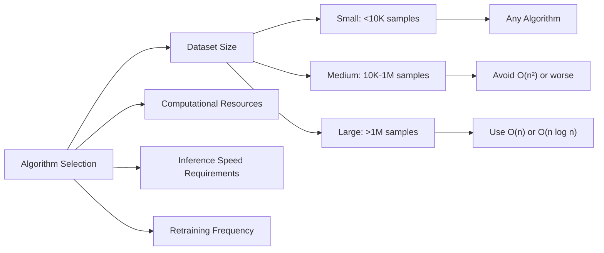

---

### Importance of Mathematics in ML

Many data scientists can build and deploy models without fully understanding the underlying mathematics, thanks to libraries like sklearn. However, this comes with significant disadvantages:

- Difficulty optimizing models
- Struggle identifying improvement areas
- Longer debugging time
- Incomplete understanding of hyperparameters
- Inability to estimate algorithm time complexity

**Key mathematical concepts essential for data science include:**

| Concept | Description |
|---------|-------------|
| **Maximum Likelihood Estimation (MLE)** | A method for estimating statistical model parameters by maximizing the likelihood of observed data |
| **Gradient Descent** | Optimization algorithm for finding local minima |
| **Normal Distribution** | Understanding probability distributions |
| **Eigenvectors** | Used in dimensionality reduction techniques like PCA |
| **Z-score** | Standardized value indicating standard deviations from the mean |
| **Entropy** | Measure of uncertainty of a random variable |
| **R-squared** | Statistical measure representing variance explained by regression |
| **KL Divergence** | Assesses information loss when approximating distributions |
| **SVD (Singular Value Decomposition)** | Matrix factorization technique |
| **Lagrange Multipliers** | Used for constrained optimization problems |

Building mathematical intuition transforms your approach from trial-and-error to principled understanding.

---

## Model Evaluation and Validation

### Train, Validation, and Test Sets

The proper use of train, validation, and test sets is crucial for model development:

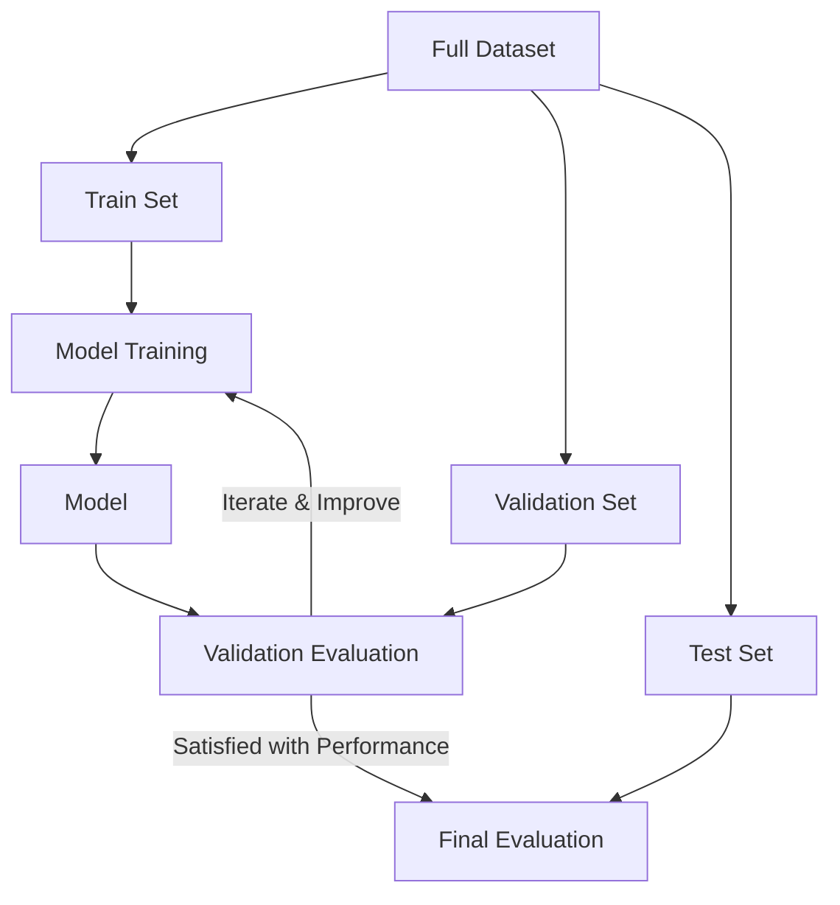

1. **Split data** into train, validation, and test sets
2. **Use the train set** for all analysis, transformations, and initial model fitting
3. **Evaluate on validation set** to guide model improvements
4. **Iterate between training and validation** until satisfied
5. **If validation set is "exhausted"** (overfitted), merge it with train and create a new split
6. **Only use test set once** for final unbiased evaluation
7. **If model underperforms on test**, go back to modeling but create new splits

**Important considerations:**
- The test set should never influence model decisions
- Once used, a test set should not be reused
- Cross-validation is preferable when data is limited

---

### Cross Validation Techniques

Cross validation provides more robust model performance estimates by repeatedly partitioning data into training and validation subsets:

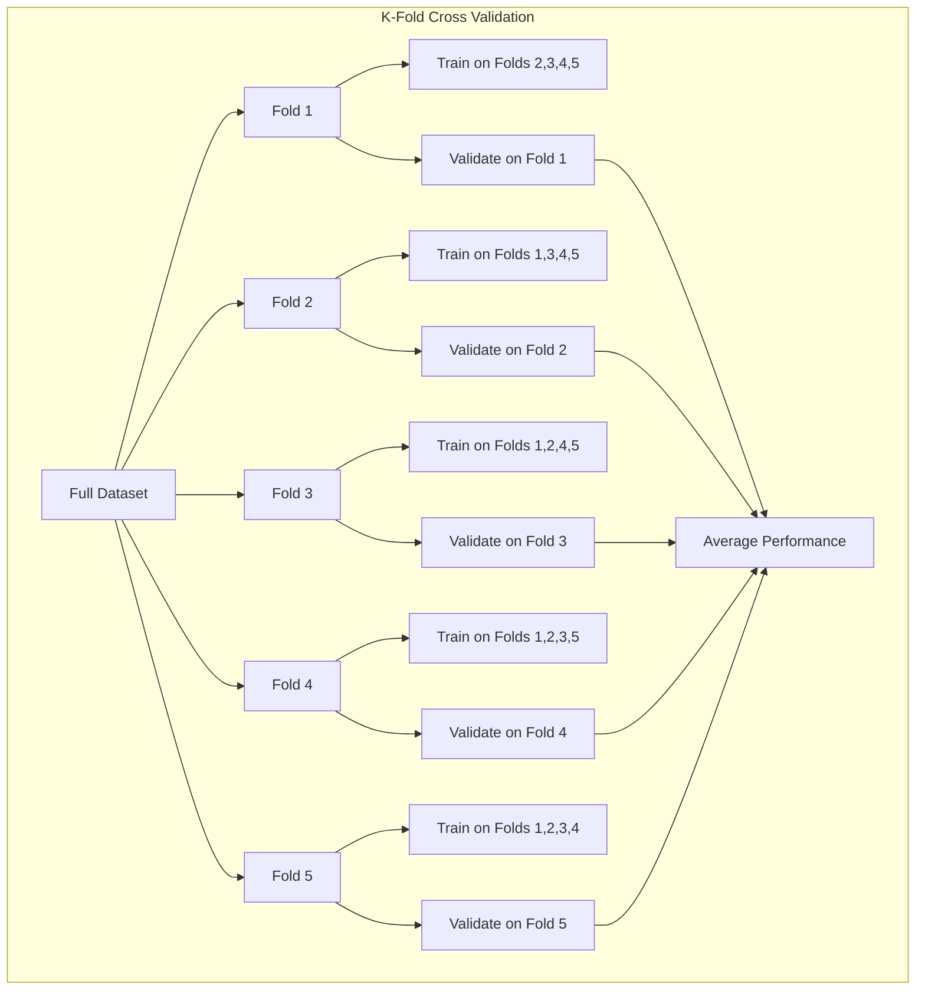

#### 1. Leave-One-Out Cross Validation
- Leaves one data point for validation
- Trains on remaining data points
- Repeats for all points
- Computationally expensive for large datasets

#### 2. K-Fold Cross Validation
- Splits data into k equally-sized subsets
- Uses one subset for validation, rest for training
- Repeats k times, using each subset once for validation
- Common choice: k=5 or k=10

#### 3. Rolling Cross Validation
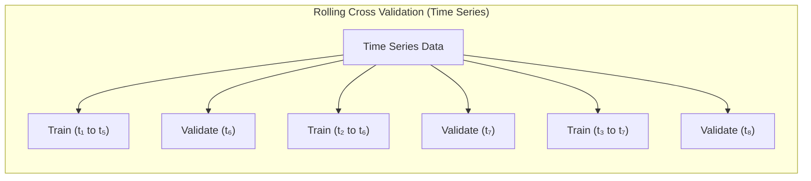
- Used for time-series data
- Maintains temporal order with fixed-size training windows
- Evaluates on subsequent windows

#### 4. Block Cross Validation
- Another technique for time-series data
- Uses shorter data slices when variance is steady

#### 5. Stratified Cross Validation
- Preserves class distribution in each fold
- Essential for imbalanced datasets

---

### When to Retrain After Cross Validation

After cross-validation identifies optimal hyperparameters, you have two options:

#### 1. Retrain on entire dataset
**Advantages:**
- Uses all available data

**Disadvantages:**
- Cannot reliably validate the final model

#### 2. Use the best model from cross-validation
**Advantages:**
- Already validated performance

**Disadvantages:**
- Leaves out potentially valuable training data

The **recommended approach** is usually to retrain on the entire dataset because:
- Cross-validation has already estimated out-of-fold performance
- Including validation data likely won't harm generalization
- It maximizes use of available training data

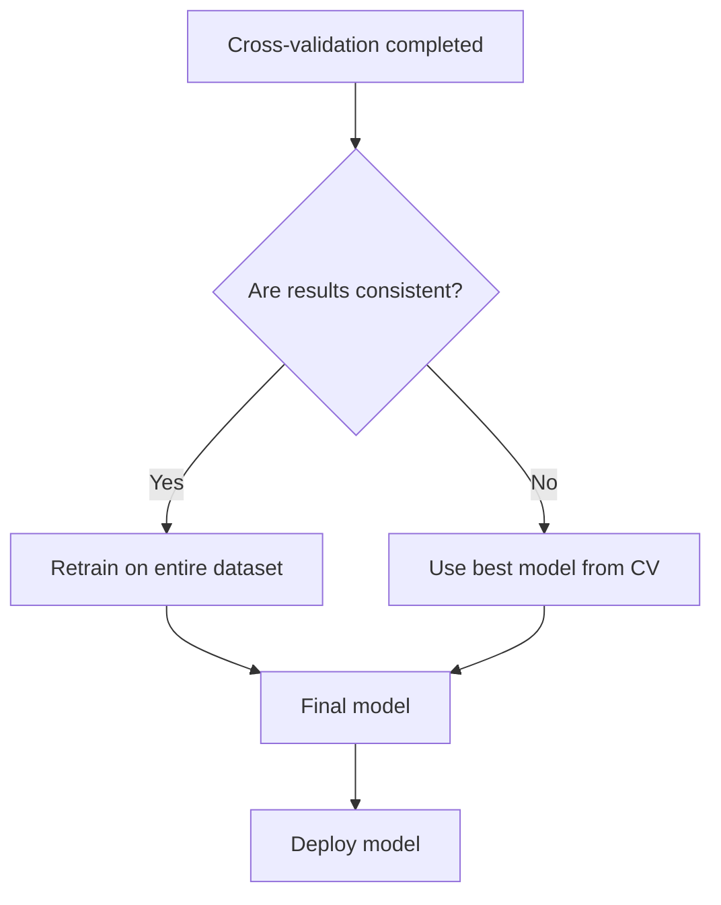

**Exceptions** include when:
- Training takes days/weeks
- Stakes are extremely high (e.g., fraud detection)
- You can gather new data for final validation

---

### Monitoring Probabilistic Multiclass-Classification Models

Traditional accuracy metrics can be misleading when iteratively improving probabilistic multiclass models. Consider using:

**Top-k Accuracy Score**: Measures whether the correct label appears among the top k predicted labels.

**Benefits:**
- Captures gradual model improvements
- Shows if the model is getting "closer" to correct predictions
- Available in sklearn as `top_k_accuracy_score`

For example, if top-3 accuracy improves from 75% to 90%, it indicates the model is improving even if traditional accuracy remains unchanged.

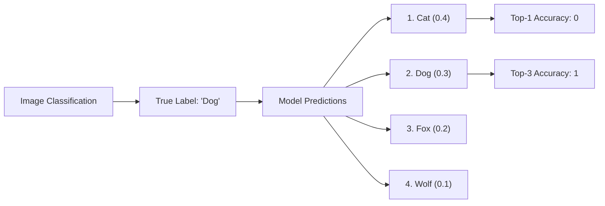

---

### Model Improvement with Human Benchmarking

A powerful technique for guiding model improvements is comparing model performance against human performance on the same task:

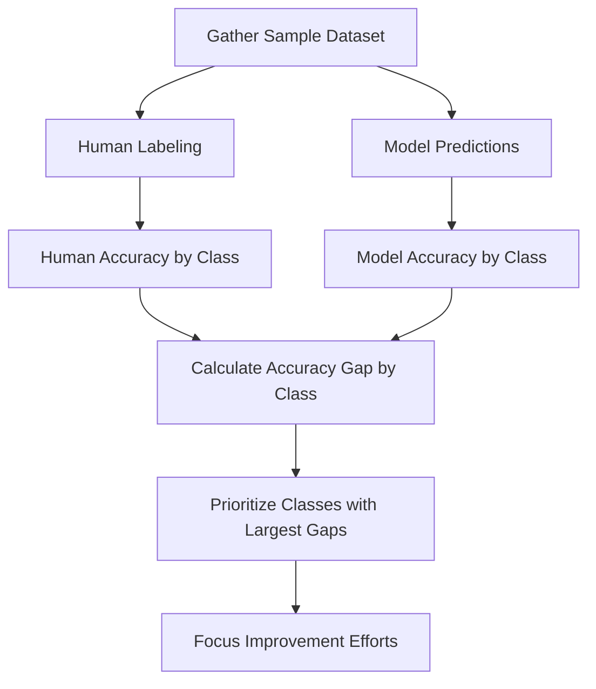

1. Gather human labels for a sample of your dataset
2. Calculate accuracy for both humans and the model
3. Compare class-wise accuracies
4. Focus improvement efforts on classes where the gap between human and model performance is largest

**Example:**
If your model achieves:
- 85% accuracy on "Rock" vs. 98% for humans (13% gap)
- 70% accuracy on "Scissors" vs. 72% for humans (2% gap)

This reveals that "Rock" needs more attention, even though absolute performance on "Scissors" is lower.

This technique:
- Provides clarity on which classes need improvement
- Establishes realistic performance goals
- Helps determine when a model has reached diminishing returns

---

## Statistical Concepts

### Maximum Likelihood Estimation vs Expectation Maximization

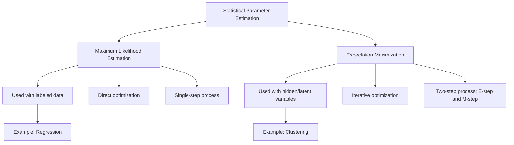

#### Maximum Likelihood Estimation (MLE)
- Used when we have labeled data
- Finds parameters that maximize the likelihood of observing the given data
- **Process:**
  1. Assume a data generation process
  2. Define likelihood of observing the data
  3. Find parameters that maximize this likelihood

#### Expectation Maximization (EM)
- Used when we have unobserved/hidden labels
- Iterative optimization technique
- **Process:**
  1. Make initial parameter guess
  2. E-step: Compute posterior probabilities of unobserved label
  3. M-step: Maximize expected likelihood to get new parameters
  4. Repeat until convergence

EM is particularly useful for clustering where true labels are unknown. Unlike MLE which directly maximizes likelihood, EM iteratively improves estimates of both parameters and labels.

---

### Confidence Intervals vs Prediction Intervals

Statistical models always involve uncertainty which should be communicated:

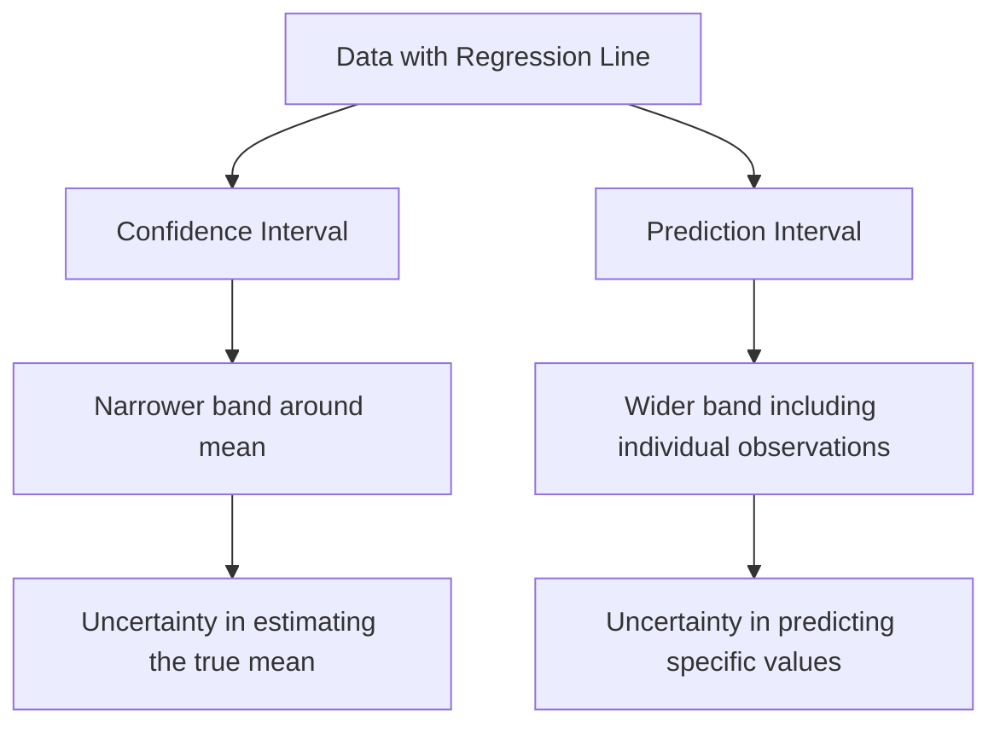

#### Confidence Intervals
- Represent uncertainty in estimating the true mean value
- Narrower than prediction intervals
- Capture sampling uncertainty
- **Example:** "We are 95% confident the mean house price for this square footage is between $190,000-$210,000"

#### Prediction Intervals
- Represent uncertainty in predicting a specific value
- Wider than confidence intervals
- Include both sampling uncertainty and individual observation variance
- **Example:** "We are 95% confident a house of this size will sell between $165,000-$235,000"

**Key differences:**
- Confidence intervals address: "How certain are we about our estimate of the average?"
- Prediction intervals address: "How certain are we about a single future value?"
- More data narrows confidence intervals but has less impact on prediction intervals

---

### Probability vs Likelihood

Though often used interchangeably in everyday language, probability and likelihood have distinct meanings in statistics:

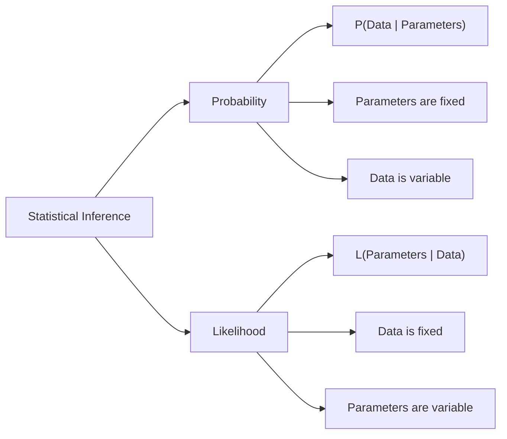

#### Probability
- Used to determine the possibility of an event
- Parameters are known and trusted
- **Example:** "What's the probability of obtaining heads in a fair coin toss?"
- In ML: "What's the probability this image contains a cat?"

#### Likelihood
- Used to evaluate parameters based on observed data
- Quantifies how well parameters explain observations
- **Example:** "Given these coin toss outcomes, what's the likelihood this coin is fair?"
- In ML: Used during training to find optimal parameters

The relationship can be summarized as:
- **Probability:** Given parameters, what's the chance of certain data?
- **Likelihood:** Given data, how reasonable are these parameters?

This distinction is fundamental to understanding model training, especially maximum likelihood estimation.

---

### Understanding Probability Distributions

Statistical models assume a data generation process, making knowledge of probability distributions essential. Key distributions include:

| Distribution | Description | Example Use Case |
|--------------|-------------|-----------------|
| **Normal (Gaussian)** | Symmetric bell-shaped curve parameterized by mean and standard deviation | Heights of individuals |
| **Bernoulli** | Models binary events with probability of success parameter | Single coin flip outcome |
| **Binomial** | Bernoulli distribution repeated multiple times, counts successes in fixed trials | Number of heads in 10 coin flips |
| **Poisson** | Models count of events in fixed interval with rate parameter | Number of customer arrivals per hour |
| **Exponential** | Models time between events in Poisson process | Wait time between customer arrivals |
| **Gamma** | Variation of exponential distribution for waiting time for multiple events | Time until three customers arrive |
| **Beta** | Models probabilities (bounded between [0,1]) | Prior distribution for probabilities |
| **Uniform** | Equal probability across range, can be discrete or continuous | Die roll outcomes |
| **Log-Normal** | Variable whose log follows normal distribution | Stock prices, income distributions |
| **Student's t** | Similar to normal but with heavier tails | Used in t-SNE for low-dimensional similarities |
| **Weibull** | Models waiting time for events | Time-to-failure analysis |

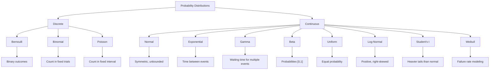

---

### Zero Probability in Continuous Distributions

In continuous probability distributions, the probability of any specific exact value is zero, which is counterintuitive but mathematically sound.

**Example:**
If travel time follows a uniform distribution between 1-5 minutes:
- The probability of taking exactly 3 minutes is zero
- We can only meaningfully ask about ranges (e.g., between 2.9-3.1 minutes)

This occurs because:
- Continuous distributions have infinitely many possible values
- Probability is calculated as area under the curve
- A single point has zero width, therefore zero area

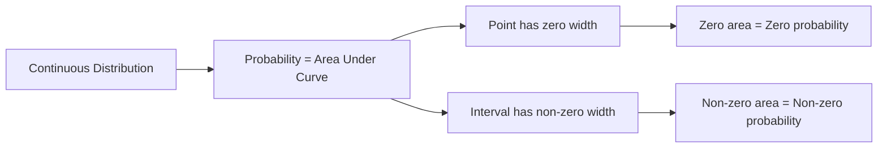

This is why we use probability density functions (PDFs) to calculate probabilities over intervals rather than at specific points.

---

### Distance Metrics for Distributions

#### Bhattacharyya Distance
- Quantifies similarity between probability distributions
- Measures overlap between distributions
- Higher values indicate less similarity
- Symmetric (distance A→B equals B→A)
- **Useful for:**
  - Simplifying complex distributions
  - Image matching
  - Comparing observed data to reference distributions

#### KL Divergence vs Bhattacharyya Distance
- KL Divergence measures information lost when approximating one distribution with another
- Bhattacharyya measures overlap or closeness
- KL Divergence is asymmetric, Bhattacharyya is symmetric
- KL Divergence is used as a loss function in some algorithms (e.g., t-SNE)

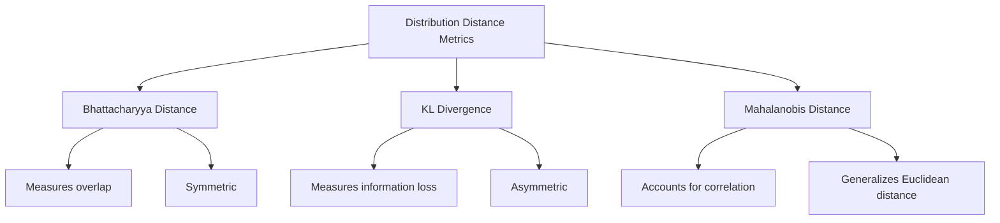

#### Mahalanobis Distance vs Euclidean Distance
- Euclidean distance assumes independent axes and can be misleading with correlated features
- Mahalanobis distance accounts for data distribution and correlation between features
- **Process:**
  1. Transform to uncorrelated variables
  2. Scale to unit variance
  3. Calculate Euclidean distance in new space
- Particularly useful for:
  - Outlier detection
  - Working with correlated features
  - Modified kNN implementations

---

### Testing for Normality

Many ML models assume or work better with normally distributed data. Methods to test normality include:

#### Visual Methods
- Histogram
- QQ Plot
- KDE Plot
- Violin Plot

#### Statistical Tests

| Test | Description | Interpretation |
|------|-------------|----------------|
| **Shapiro-Wilk** | Uses correlation between observed data and expected normal values | High p-value indicates normality |
| **Kolmogorov-Smirnov (KS)** | Measures maximum difference between observed and theoretical CDFs | High p-value indicates normality |
| **Anderson-Darling** | Emphasizes differences in distribution tails | More sensitive to deviations in extreme values |
| **Lilliefors** | Modified KS test for unknown parameters | Adjusts for parameter estimation |

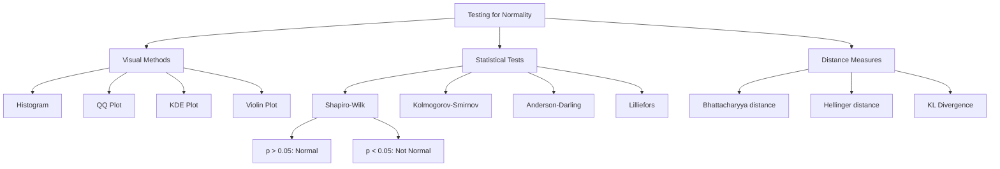

#### Distance Measures
- Compare observed distribution to multiple reference distributions
- Choose distribution with minimum distance
- Common measures:
  - Bhattacharyya distance
  - Hellinger distance
  - KL Divergence

---

## Feature Engineering

### Types of Variables in Datasets

Understanding variable types helps guide appropriate handling during analysis:

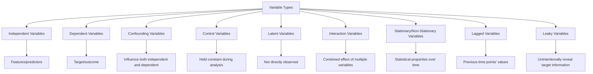

#### Independent and Dependent Variables
- **Independent variables:** Features/predictors used as input
- **Dependent variable:** Target/outcome being predicted

#### Confounding Variables
- Not primary interest but influence both independent and dependent variables
- Can lead to spurious associations
- **Example:** Temperature affecting both ice cream sales and air conditioner sales
- Why "correlation doesn't imply causation"

#### Control Variables
- Variables held constant during analysis
- Help isolate true causal relationships

#### Latent Variables
- Not directly observed but inferred
- **Example:** Intelligence (inferred from test scores)
- In clustering, true labels are latent variables

#### Interaction Variables
- Represent combined effect of multiple variables
- Created by cross-multiplying features
- **Example:** Income-level * Population-density

#### Stationary and Non-Stationary Variables
- **Stationary:** Statistical properties don't change over time
- **Non-stationary:** Properties evolve over time
- Critical for time-series analysis
- Non-stationary features often transformed to relative changes

#### Lagged Variables
- Previous time points' values
- Common in time-series forecasting
- **Example:** Previous month's sales to predict current month

#### Leaky Variables
- Unintentionally provide information about target
- Lead to overoptimistic model performance
- **Example:** Patient images in both train and test sets

---

### Cyclical Feature Encoding

Cyclical features (like hour-of-day, day-of-week, month) require special encoding to preserve their circular nature:

#### The Problem
- Standard encoding loses crucial information
- **Example:** Hours 23 and 0 should be close, but numerically they're far apart
- Distance between adjacent values should be equal

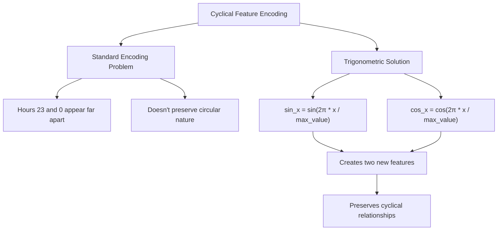

#### Solution: Trigonometric Encoding
- Use sine and cosine functions
- **Formula:**
  ```
  sin_x = sin(2π * x / max_value)
  cos_x = cos(2π * x / max_value)
  ```
- **Example for hour (0-23):**
  ```
  sin_hour = sin(2π * hour / 24)
  cos_hour = cos(2π * hour / 24)
  ```

#### Benefits
- Preserves cyclical nature
- Distance between adjacent values is constant
- Works for any cyclical feature (hours, days, months, angles)

---

### Feature Discretization

Feature discretization transforms continuous features into discrete features:

#### Rationale
- Sometimes continuous values are better understood in groups
- **Example:** Age as youngsters/adults/seniors instead of exact years
- Can reveal more valuable insights than raw features

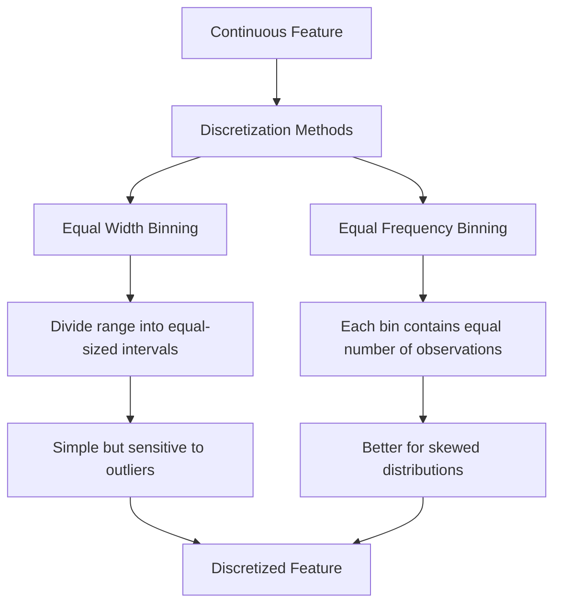

#### Techniques
1. **Equal Width Binning**
   - Divides range into equal-sized bins
   - Simple but sensitive to outliers

2. **Equal Frequency Binning**
   - Each bin contains equal number of observations
   - Better handles skewed distributions

#### Benefits
- Enables non-linear behavior even with linear models
- Improves signal-to-noise ratio by smoothing minor fluctuations
- Makes interpretations more intuitive

#### Considerations
- Increases dimensionality after one-hot encoding
- Can lead to overfitting
- Best used when it makes intuitive sense

---

### Categorical Data Encoding

Seven techniques for encoding categorical features:

| Encoding Method | Description | Feature Count | Use Cases |
|-----------------|-------------|---------------|-----------|
| **One-Hot Encoding** | Each category gets binary feature (0 or 1) | Number of categories | When no ordinal relationship exists |
| **Dummy Encoding** | One-hot encoding minus one feature | Number of categories - 1 | Avoiding multicollinearity |
| **Effect Encoding** | Similar to dummy but reference category = -1 | Number of categories - 1 | Statistical modeling |
| **Label Encoding** | Assigns unique integer to each category | 1 | For tree-based models |
| **Ordinal Encoding** | Similar to label but preserves actual order | 1 | For ordered categories |
| **Count Encoding** | Replaces category with its frequency | 1 | Capturing population information |
| **Binary Encoding** | Converts categories to binary code | log2(number of categories) | High-cardinality features |

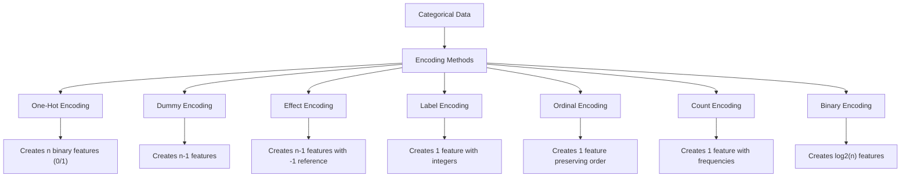

The choice depends on:
- Whether categories have natural order
- Number of categories
- Model type
- Concern about dimensionality

---

### Feature Importance and Selection

#### Shuffle Feature Importance
- Intuitive technique to measure feature importance
- **Process:**
  1. Measure baseline model performance
  2. Randomly shuffle one feature
  3. Measure performance drop
  4. Repeat for all features
- Features with larger performance drops are more important
- **Advantages:**
  - No retraining required
  - Intuitive interpretation
  - Works with any model type
- **Limitation:** Correlated features may show lower importance

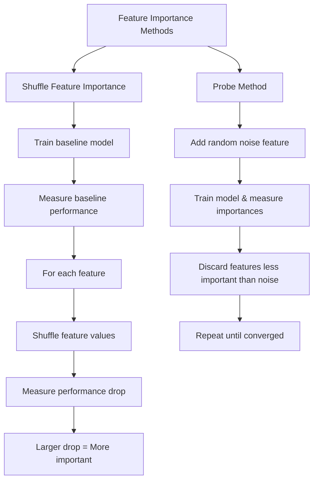

#### The Probe Method for Feature Selection
- **Process:**
  1. Add random feature (noise)
  2. Train model
  3. Measure feature importance
  4. Discard features less important than random feature
  5. Repeat until convergence
- **Intuition:** If a feature is less important than random noise, it's useless
- Helps reduce model complexity
- Requires multiple model trainings

---

## Linear Models

### Why Squared Error in MSE

Mean Squared Error (MSE) is the most common loss function for regression, but why specifically use squared error?

From a probabilistic perspective:
1. In linear regression, we assume data follows: y = Xθ + ε where ε ~ N(0, σ²)
2. This means the likelihood of observing data is:
   P(y|X,θ) = (1/√(2πσ²)) * exp(-(y-Xθ)²/(2σ²))
3. For all data points, the likelihood is the product of individual likelihoods
4. Taking log of likelihood and maximizing:
   log(P(y|X,θ)) ∝ -∑(y-Xθ)²
5. Maximizing this is equivalent to minimizing squared error

Therefore, squared error in MSE directly emerges from maximum likelihood estimation under Gaussian noise assumption. It's not arbitrary but has strong statistical foundations.

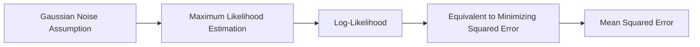

---

### Linear Regression Hyperparameters

Sklearn's LinearRegression implementation has no hyperparameters because it uses Ordinary Least Squares (OLS) rather than gradient descent:

#### OLS vs Gradient Descent

| Ordinary Least Squares | Gradient Descent |
|------------------------|------------------|
| Deterministic algorithm | Stochastic algorithm with randomness |
| Always finds optimal solution | Approximate solution via optimization |
| No hyperparameters | Has hyperparameters (learning rate, etc.) |
| OLS closed-form solution: θ = (X^T X)^(-1) X^T y | Iterative updates to parameters |

```mermaid
flowchart TD
    A[Linear Regression Implementation] --> B[OLS]
    A --> C[Gradient Descent]
    
    B --> D[Closed-form solution]
    B --> E[No hyperparameters]
    B --> F[Always finds global optimum]
    B --> G[Computationally expensive for high dimensions]
    
    C --> H[Iterative optimization]
    C --> I[Has hyperparameters]
    C --> J[May converge to local optimum]
    C --> K[Scales better to high dimensions]
```

This approach:
- Always finds the same optimal solution
- Requires no hyperparameter tuning
- Has cubic time complexity with feature count
- Can be impractical for very high-dimensional data

For large feature sets, gradient descent methods like SGDRegressor may be more practical.

---

### Poisson vs Linear Regression

Linear regression has limitations that Poisson regression addresses:

#### Linear Regression Limitations
- Can predict negative values (nonsensical for count data)
- Assumes residuals are normally distributed around mean
- Assumes outcomes on either side of mean equally likely

```mermaid
graph TD
    A[Count Data Modeling] --> B[Linear Regression]
    A --> C[Poisson Regression]
    
    B --> D[Can predict negative values]
    B --> E[Assumes normal distribution of errors]
    B --> F[Constant variance]
    
    C --> G[Always predicts non-negative values]
    C --> H[Models log of expected count]
    C --> I[Variance equals mean]
    C --> J[Suited for count data]
```

#### Poisson Regression
- Suitable for count data (always non-negative)
- Assumes response follows Poisson distribution
- Models log of expected count: log(λ) = Xβ
- Variance equals mean (unlike linear regression's constant variance)
- Asymmetric distribution around mean

**Example use cases:**
- Number of events in time period
- Count data like calls received, goals scored
- Any non-negative integer outcomes

---

### Building Linear Models

Understanding the data generation process is critical when selecting linear models:

Every generalized linear model relates to a specific data distribution:

| Distribution | Model Type |
|--------------|------------|
| Normal distribution | Linear Regression |
| Poisson distribution | Poisson Regression (count data) |
| Bernoulli distribution | Logistic Regression (binary data) |
| Binomial distribution | Binomial Regression (categorical data) |

```mermaid
flowchart TD
    A[Data Generation Process] --> B[Identify Distribution]
    B --> C[Normal]
    B --> D[Poisson]
    B --> E[Bernoulli]
    B --> F[Binomial]
    
    C --> G[Linear Regression]
    D --> H[Poisson Regression]
    E --> I[Logistic Regression]
    F --> J[Binomial Regression]
```

This connection helps you:
- Select appropriate models based on data characteristics
- Understand model assumptions
- Make informed modeling decisions
- Avoid blindly applying algorithms

Instead of trial and error, first consider: "What process likely generated this data?"

---

### Dummy Variable Trap

When one-hot encoding categorical variables, we introduce perfect multicollinearity:

#### The Problem
- If we have n categories and n one-hot encoded features, we can predict any feature using the others
- **Example:** If we know n-1 features are 0, the nth must be 1
- This redundancy makes regression coefficients unreliable

```mermaid
graph TD
    A[One-Hot Encoding Categories] --> B[n Binary Features]
    B --> C[Perfect Multicollinearity]
    C --> D[Coefficient Instability]
    
    A --> E[n-1 Binary Features]
    E --> F[Drop One Category]
    F --> G[No Multicollinearity]
    G --> H[Stable Coefficients]
```

#### Solution
- Drop any one category from the one-hot encoded features
- This breaks the linear relationship
- Known as "dummy encoding"

This is why sklearn and other libraries automatically drop one category when encoding.

---

### Residual Distribution in Linear Regression

Linear regression assumes normally distributed residuals. A residual distribution plot helps verify this:

#### What to Look For
- **Good residual plot:** Bell-shaped, centered at zero, no patterns
- **Bad residual plot:** Skewed, shows trends or patterns

```mermaid
graph LR
    A[Residual Analysis] --> B[Good Residual Distribution]
    A --> C[Problematic Residual Distribution]
    
    B --> D[Bell-shaped]
    B --> E[Centered at zero]
    B --> F[No patterns]
    
    C --> G[Skewed]
    C --> H[Shows trends]
    C --> I[Clusters]
    
    G --> J[Try Data Transformation]
    H --> K[Missing Features/Non-linearity]
    I --> L[Heteroscedasticity]
```

#### Advantages
- Works in high dimensions where regression line can't be visualized
- Residual distribution is always one-dimensional
- Quickly identifies assumption violations

If residuals aren't normally distributed, consider:
- Data transformations
- Different model types
- Adding features

---

### Understanding Statsmodel Regression Summary

Statsmodel provides comprehensive regression analysis summaries with three key sections:

#### Section 1: Model Configuration and Overall Performance
- Dependent variable, method, observations
- R-squared: Variance explained by model
- Adjusted R-squared: Accounts for feature count
- F-statistic: Overall model significance
- AIC/BIC: Goodness of fit measures with complexity penalty

#### Section 2: Feature Details
- Coefficients: Estimated effect of each feature
- t-statistic and p-values: Individual feature significance
- Confidence intervals: Range for true coefficient values

```mermaid
graph TD
    A[Statsmodel Summary] --> B[Model Configuration]
    A --> C[Feature Details]
    A --> D[Assumption Tests]
    
    B --> E[R-squared/Adj R-squared]
    B --> F[F-statistic]
    B --> G[AIC/BIC]
    
    C --> H[Coefficients]
    C --> I[t-statistic & p-values]
    C --> J[Confidence intervals]
    
    D --> K[Residual normality]
    D --> L[Autocorrelation]
    D --> M[Multicollinearity]
```

#### Section 3: Assumption Tests
- Omnibus/Jarque-Bera: Tests residual normality
- Skew/Kurtosis: Residual distribution shape
- Durbin-Watson: Tests residual autocorrelation
- Condition Number: Tests multicollinearity

These metrics help validate model assumptions and guide improvements.

---

### Generalized Linear Models (GLMs)

GLMs extend linear regression by relaxing its strict assumptions:

#### Linear Regression Assumptions
1. Conditional distribution of Y given X is Gaussian
2. Mean is linear combination of features
3. Constant variance across all X levels

```mermaid
flowchart TD
    A[Linear Models] --> B[Linear Regression]
    A --> C[Generalized Linear Models]
    
    B --> D[Normal distribution assumption]
    B --> E[Linear mean function]
    B --> F[Constant variance]
    
    C --> G[Various distributions]
    C --> H[Link functions]
    C --> I[Variance can depend on mean]
    
    G --> J[Normal, Poisson, Binomial, etc.]
    H --> K[Identity, Log, Logit, etc.]
    
    J --> L[Flexibility for different data types]
    K --> L
    I --> L
```

#### How GLMs Relax These
- Allow different distributions (Poisson, Binomial, etc.)
- Transform relationship between X and mean (link functions)
- Allow variance to change with X

This makes linear models more adaptable to real-world data and helps address issues like:
- Count data with Poisson regression
- Binary outcomes with logistic regression
- Categorical data with multinomial regression

---

### Zero-Inflated Regression

For datasets with many zero values in the target variable:

#### The Problem
- Regular regression models struggle with excess zeros
- Can't predict exact zeros frequently enough
- Leads to poor fit

```mermaid
flowchart TD
    A[Zero-Inflated Data] --> B[Regular Regression]
    A --> C[Zero-Inflated Model]
    
    B --> D[Poor fit for excess zeros]
    B --> E[Biased predictions]
    
    C --> F[Two-part model]
    F --> G[Binary classifier: Zero vs. Non-zero]
    F --> H[Regression model for non-zeros]
    
    G --> I[If predicted zero, output 0]
    H --> J[If predicted non-zero, use regression]
    
    I --> K[Final prediction]
    J --> K
```

#### Solution: Two-Model Approach
1. Binary classifier to predict zero vs. non-zero
2. Regression model trained only on non-zero examples

#### Prediction Process
- If classifier predicts "zero", output zero
- If classifier predicts "non-zero", use regression prediction

This approach significantly improves performance on zero-inflated datasets like:
- Count data with many zeros
- Sales data with many non-purchasing customers
- Event occurrence with many non-event periods

---

### Huber Regression

Linear regression is sensitive to outliers due to squared error magnifying large residuals.

#### Huber Regression Solution
- Uses Huber loss function with threshold parameter δ
- For residuals < δ: Uses squared error (like linear regression)
- For residuals ≥ δ: Uses linear loss (less sensitive to outliers)

```mermaid
graph TD
    A[Outlier Sensitivity] --> B[Linear Regression]
    A --> C[Huber Regression]
    
    B --> D[Squared Error Loss]
    D --> E[Highly sensitive to outliers]
    
    C --> F[Huber Loss]
    F --> G[Squared error for small residuals]
    F --> H[Linear loss for large residuals]
    F --> I[Controlled by δ threshold]
    
    G --> J[Efficient for inliers]
    H --> K[Robust to outliers]
    I --> L[Optimal balance point]
```

#### Determining δ
- Create residual plot from regular regression
- Identify where outliers begin
- Set threshold at this point

Huber regression provides robust predictions while maintaining the interpretability of linear models.

---

## Tree-Based Models

### Condensing Random Forests

A technique to convert a random forest into a single decision tree with comparable performance:

#### Process
1. Train a random forest model
2. Generate predictions on training data
3. Train a single decision tree on original features and random forest predictions

```mermaid
flowchart TD
    A[Random Forest Model] --> B[Make predictions on training data]
    B --> C[Use predictions as target for new decision tree]
    C --> D[Train decision tree on original features]
    D --> E[Condensed Model]
    
    E --> F[Faster inference]
    E --> G[Lower memory footprint]
    E --> H[Better interpretability]
    E --> I[Similar performance]
```

#### Benefits
- Decreased prediction time
- Improved interpretability
- Reduced memory footprint
- Simplified model
- Maintains generalization power

This works because the decision tree learns to mimic the more complex random forest model's decision boundaries.

---

### Decision Trees and Matrix Operations

Decision tree inference can be transformed into matrix operations for faster prediction:

#### The Process
1. Create five matrices representing tree structure:
   - Matrix A: Features used at each node
   - Matrix B: Thresholds at each node
   - Matrix C: Left/right subtree mappings
   - Matrix D: Sum of non-negative entries in Matrix C
   - Matrix E: Mapping from leaf nodes to class labels

2. For prediction, use matrix operations:
   ```
   XA < B
   Result × C
   Compare with D
   Multiply by E
   ```

```mermaid
graph LR
    A[Decision Tree Structure] --> B[Transform to Matrices]
    B --> C[Matrix A: Features]
    B --> D[Matrix B: Thresholds]
    B --> E[Matrix C: Subtree maps]
    B --> F[Matrix D: Sum of Matrix C]
    B --> G[Matrix E: Leaf mappings]
    
    C --> H[Matrix Operations]
    D --> H
    E --> H
    F --> H
    G --> H
    
    H --> I[Parallelized Inference]
    H --> J[GPU Acceleration]
    H --> K[40x Speedup]
```

#### Benefits
- Enables parallelization
- Allows GPU acceleration (40x speedup)
- Maintains identical accuracy
- Makes deployment more efficient

---

### Decision Tree Visualization

Interactive Sankey diagrams provide an elegant way to visualize and prune decision trees:

#### Advantages over Standard Visualization
- Interactive node collapsing
- Size and color encoding for class distribution
- Intuitive representation of data flow
- Easier identification of pruning candidates

```mermaid
sankey-beta
    Root, 3000 --> Feature1_left, 1200
    Root, 3000 --> Feature1_right, 1800
    Feature1_left, 1200 --> Feature2_left, 500
    Feature1_left, 1200 --> Feature2_right, 700
    Feature1_right, 1800 --> Feature3_left, 1100
    Feature1_right, 1800 --> Feature3_right, 700
    Feature2_left, 500 --> Leaf1, 200
    Feature2_left, 500 --> Leaf2, 300
    Feature2_right, 700 --> Leaf3, 400
    Feature2_right, 700 --> Leaf4, 300
    Feature3_left, 1100 --> Leaf5, 600
    Feature3_left, 1100 --> Leaf6, 500
    Feature3_right, 700 --> Leaf7, 300
    Feature3_right, 700 --> Leaf8, 400
```

This visualization helps quickly determine optimal tree depth and identify unnecessary splits.

---

### Decision Tree Splits

Decision trees make only perpendicular (axis-aligned) splits, which can be inefficient for diagonal decision boundaries:

#### The Issue
- Trees create boundaries perpendicular to feature axes
- Diagonal boundaries require many perpendicular splits
- Results in unnecessarily complex trees

```mermaid
graph TD
    A[Decision Tree Splits] --> B[Axis-Aligned Splits]
    B --> C[Perpendicular to Feature Axes]
    C --> D[Inefficient for Diagonal Boundaries]
    D --> E[Requires Many Splits]
    E --> F[Complex Tree Structure]
    
    D --> G[Potential Solutions]
    G --> H[Feature Engineering]
    G --> I[PCA Transformation]
    G --> J[Alternative Models]
    
    H --> K[Create Features Aligned with Boundaries]
    I --> L[Align Axes with Natural Boundaries]
    J --> M[Linear Models, SVM]
```

#### Detection and Solutions
1. Inspect decision tree visualization
2. If many small, closely-spaced splits, suspect diagonal boundary
3. Try PCA transformation to align with boundary
4. Consider alternative models (logistic regression, SVM)
5. Engineer features aligned with natural boundaries

Understanding this limitation helps choose appropriate models or transformations.

---

### Overfitting in Decision Trees

By default, decision trees grow until all leaves are pure, leading to 100% overfitting:

#### Cost-Complexity Pruning (CCP) Solution
- Balances misclassification cost against tree complexity
- Removes subtrees that minimally increase error but maximize complexity reduction
- Controlled by ccp_alpha parameter:
  - Large alpha → underfitting (simpler tree)
  - Small alpha → overfitting (complex tree)

```mermaid
graph LR
    A[Decision Tree] --> B[Default: Pure Leaves]
    B --> C[Overfitting Problem]
    
    A --> D[Cost-Complexity Pruning]
    D --> E[ccp_alpha parameter]
    
    E --> F[Small alpha]
    E --> G[Large alpha]
    
    F --> H[Complex tree, potential overfitting]
    G --> I[Simple tree, potential underfitting]
    
    D --> J[Balance complexity vs. accuracy]
    J --> K[Better generalization]
```

This produces simpler trees with better generalization.

---

### AdaBoost Algorithm

AdaBoost builds strong models from weak learners through weighted ensembling:

```mermaid
flowchart TD
    A[Training Data with Equal Weights] --> B[Train Weak Learner 1]
    B --> C[Calculate Error]
    C --> D[Calculate Learner Importance]
    D --> E[Update Sample Weights]
    E --> F[Train Weak Learner 2]
    F --> G[Calculate Error]
    G --> H[Calculate Learner Importance]
    H --> I[Update Sample Weights]
    I --> J[Train Weak Learner 3]
    J --> K[...]
    K --> L[Final Ensemble]
    
    M[Prediction Process] --> N[Weighted Average of Weak Learners]
    L --> N
```

#### Process
1. Assign equal weights to all training instances
2. Train weak learner (typically decision stump)
3. Calculate error as sum of weights for incorrect predictions
4. Calculate learner importance based on error
5. Update instance weights:
   - Decrease weights for correct predictions
   - Increase weights for incorrect predictions
6. Normalize weights to sum to one
7. Sample new training data based on weights
8. Repeat steps 2-7 for specified iterations

**Final prediction** combines all weak learners weighted by their importance.

This approach progressively focuses on difficult examples, creating a powerful ensemble.

---

### Out-of-Bag Validation in Random Forests

Random forests allow performance evaluation without a separate validation set:

```mermaid
graph TD
    A[Original Dataset] --> B[Bootstrap Sample 1]
    A --> C[Bootstrap Sample 2]
    A --> D[Bootstrap Sample 3]
    
    B --> E[Tree 1]
    C --> F[Tree 2]
    D --> G[Tree 3]
    
    B --> H[~37% OOB Sample 1]
    C --> I[~37% OOB Sample 2]
    D --> J[~37% OOB Sample 3]
    
    H --> K[Evaluate Tree 2 & Tree 3]
    I --> L[Evaluate Tree 1 & Tree 3]
    J --> M[Evaluate Tree 1 & Tree 2]
    
    K --> N[OOB Predictions]
    L --> N
    M --> N
    
    N --> O[Calculate OOB Error]
```

#### How It Works
- Each tree in random forest uses bootstrap sample (~63% of data)
- Remaining ~37% are "out-of-bag" (OOB) samples
- For each data point, collect predictions only from trees that didn't use it in training
- Aggregate these predictions for final OOB prediction
- Calculate performance metrics using OOB predictions

#### Benefits
- No data splitting required
- Computationally efficient
- No data leakage

#### Considerations
- Use cautiously for model selection
- Still benefits from final validation on truly unseen data

---

### Training Random Forests on Large Datasets

Most ML implementations require entire dataset in memory, limiting their use with very large datasets.

#### Random Patches Approach
1. Sample random data patches (subsets of rows and columns)
2. Train tree model on each patch
3. Repeat to create ensemble

```mermaid
flowchart TD
    A[Large Dataset] --> B[Memory Limitations]
    A --> C[Random Patches Solution]
    
    C --> D[Sample Subset of Rows]
    C --> E[Sample Subset of Features]
    
    D --> F[Data Patch 1]
    D --> G[Data Patch 2]
    D --> H[Data Patch 3]
    
    F --> I[Train Tree 1]
    G --> J[Train Tree 2]
    H --> K[Train Tree 3]
    
    I --> L[Random Forest Ensemble]
    J --> L
    K --> L
```

#### Benefits
- Works with data too large for memory
- Often performs better than traditional random forest
- Increases diversity between trees
- Further reduces variance

This approach enables tree-based models on massive datasets without specialized frameworks.

---

## Dimensionality Reduction

### PCA and Variance

Principal Component Analysis (PCA) aims to retain maximum variance during dimensionality reduction. But why focus on variance?

#### The Intuition
- Features with higher variance typically contain more information
- **Example:** If height varies greatly but weight barely differs, height better distinguishes individuals
- Retaining variance = retaining information

```mermaid
graph TD
    A[Principal Component Analysis] --> B[Find Directions of Maximum Variance]
    B --> C[Create Orthogonal Components]
    C --> D[Sort by Variance Explained]
    D --> E[Keep Top k Components]
    
    F[Original Features] --> G[Decorrelation]
    G --> H[Dimensionality Reduction]
    H --> I[Information Preservation]
```

PCA works by:
1. Transforming data to create uncorrelated features
2. Measuring variance of each new feature
3. Keeping features with highest variance

This approach maximizes information retention while reducing dimensions.

---

### KernelPCA vs PCA

Standard PCA has limitations with non-linear data:

#### The Problem
- PCA only finds linear subspaces
- Many datasets have non-linear structures
- Linear projection loses important information

```mermaid
flowchart TD
    A[Dimensionality Reduction] --> B[Linear PCA]
    A --> C[Kernel PCA]
    
    B --> D[Linear subspaces only]
    B --> E[Efficient computation]
    B --> F[Easy interpretation]
    
    C --> G[Non-linear mappings]
    C --> H[Implicit feature transformation]
    C --> I[Higher computational cost]
    
    G --> J[Better fit for complex data]
    H --> K[Kernel trick]
    I --> L[Scales poorly with sample size]
```

#### KernelPCA Solution
- Uses kernel trick to implicitly transform data to higher dimensions
- Applies standard PCA in transformed space
- Creates non-linear projections in original space

#### Tradeoffs
- Better fits non-linear data
- Increased computational complexity (quadratic with sample count)
- Less interpretable components

Consider KernelPCA when data shows clear non-linear patterns that PCA can't capture.

---

### PCA for Visualization

Using PCA for 2D visualization requires caution:

#### Potential Issue
- First two components may not capture sufficient variance
- Results in misleading visualization

```mermaid
graph TD
    A[PCA Visualization] --> B[Check Explained Variance]
    B --> C[>90% in first 2 components]
    B --> D[70-90% in first 2 components]
    B --> E[<70% in first 2 components]
    
    C --> F[Use PCA visualization confidently]
    D --> G[Use PCA with caution]
    E --> H[Consider alternative techniques]
    
    H --> I[t-SNE]
    H --> J[UMAP]
```

#### Solution: Check Explained Variance
- Create cumulative explained variance plot
- Only use PCA for visualization if first two components explain substantial variance (>70-80%)
- Otherwise, use visualization-specific techniques (t-SNE, UMAP)

**Example guideline:**
- >90% explained variance: PCA visualization is reliable
- 70-90%: Use with caution
- <70%: Consider alternative visualization techniques

---

### t-SNE vs SNE

t-SNE improves upon Stochastic Neighbor Embedding (SNE) for visualization:

#### SNE Process
1. Convert high-dimensional distances to Gaussian probabilities
2. Initialize low-dimensional points randomly
3. Define similar conditional probabilities in low dimensions
4. Minimize KL divergence between distributions

```mermaid
flowchart TD
    A[Dimensionality Reduction for Visualization] --> B[SNE]
    A --> C[t-SNE]
    
    B --> D[Gaussian distribution in low dimensions]
    B --> E[Crowding problem]
    
    C --> F[t-distribution in low dimensions]
    C --> G[Better separation of clusters]
    C --> H[Heavier tails handle crowding]
    
    G --> I[Improved visualizations]
    H --> I
```

#### t-SNE Improvement
- Uses t-distribution instead of Gaussian in low dimensions
- Creates more separated clusters by having heavier tails
- Addresses "crowding problem" in SNE
- Computationally more efficient

This produces better separated, more interpretable visualizations.

---

### t-SNE Projections

t-SNE visualizations require careful interpretation:

#### Cautions
- Perplexity parameter drastically affects results
- Cluster shapes in projection don't reflect original shapes
- Cluster sizes are not meaningful
- Distances between clusters don't represent high-dimensional distances
- Axes have no inherent meaning

```mermaid
graph TD
    A[t-SNE Interpretation] --> B[What t-SNE Shows]
    A --> C[What t-SNE Doesn't Show]
    
    B --> D[Local neighborhood structure]
    B --> E[Cluster membership]
    B --> F[Similarity within neighborhoods]
    
    C --> G[Global distances]
    C --> H[Density information]
    C --> I[Cluster sizes/shapes]
    C --> J[Axes meaning]
```

#### Best Practices
- Try multiple perplexity values (typically 5-50)
- Don't over-interpret specific positions
- Focus on cluster membership, not geometry
- Use for exploring structure, not making precise claims
- Always combine with other analysis methods

---

### Accelerating t-SNE

t-SNE is computationally intensive with O(n²) complexity, making it impractical for large datasets:

#### GPU Acceleration (tSNE-CUDA)
- CUDA implementation of t-SNE algorithm
- 33-700x faster than sklearn implementation
- Enables visualization of much larger datasets
- Similar quality to standard implementation
- Limited to 2D projections

```mermaid
graph LR
    A[t-SNE Optimization] --> B[GPU Acceleration]
    A --> C[CPU Optimization]
    
    B --> D[tSNE-CUDA]
    D --> E[33-700x speedup]
    
    C --> F[openTSNE]
    F --> G[20x speedup]
    
    E --> H[Large Dataset Visualization]
    G --> H
```

#### CPU Optimization (openTSNE)
- 20x faster than sklearn without GPU
- Scales to millions of data points
- Better memory management
- Similar quality to standard implementation

These implementations make t-SNE practical for large-scale visualization tasks.

---

### PCA vs t-SNE

Key differences between PCA and t-SNE:

| Aspect | PCA | t-SNE |
|--------|-----|-------|
| **Purpose** | Primarily dimensionality reduction | Primarily visualization |
| **Algorithm Type** | Deterministic (same result every run) | Stochastic (different results each run) |
| **Uniqueness** | Unique solution (rotation of axes) | Multiple possible solutions |
| **Approach** | Linear technique | Non-linear technique |
| **Preservation** | Preserves global variance | Preserves local relationships |

```mermaid
graph TD
    A[Dimensionality Reduction & Visualization] --> B[PCA]
    A --> C[t-SNE]
    
    B --> D[Linear]
    B --> E[Deterministic]
    B --> F[Global structure]
    B --> G[Fast]
    
    C --> H[Non-linear]
    C --> I[Stochastic]
    C --> J[Local structure]
    C --> K[Slow]
    
    D --> L[Choose Based on Task]
    E --> L
    F --> L
    G --> L
    H --> L
    I --> L
    J --> L
    K --> L
```

**When to use each:**
- **PCA:** For dimensionality reduction, feature extraction, or when interpretability matters
- **t-SNE:** For visualization, cluster identification, or exploring complex data structure

---

## Clustering Algorithms

### Types of Clustering Algorithms

Clustering algorithms can be categorized into six main types, each with its own strengths and application areas:

```mermaid
graph TD
    A[Clustering Algorithms] --> B[Centroid-based]
    A --> C[Connectivity-based]
    A --> D[Density-based]
    A --> E[Graph-based]
    A --> F[Distribution-based]
    A --> G[Compression-based]
    
    B --> H[K-Means]
    C --> I[Hierarchical]
    D --> J[DBSCAN, HDBSCAN]
    E --> K[Spectral Clustering]
    F --> L[Gaussian Mixture Models]
    G --> M[Deep Embedded Clustering]
    
    H --> N[Globular clusters]
    I --> O[Hierarchical relationships]
    J --> P[Arbitrary shapes, outlier detection]
    K --> Q[Complex, non-linear structures]
    L --> R[Known underlying distributions]
    M --> S[High-dimensional data]
```

#### 1. Centroid-based Clustering 
- Clusters data based on proximity to centroids
- Example: K-Means
- Best for: Well-separated, globular clusters of similar size

#### 2. Connectivity-based Clustering
- Clusters points based on proximity between clusters
- Example: Hierarchical clustering
- Best for: Finding hierarchical relationships in data

#### 3. Density-based Clustering
- Clusters points based on areas of high density
- Example: DBSCAN, HDBSCAN
- Best for: Irregularly shaped clusters and detecting outliers

#### 4. Graph-based Clustering
- Clusters points based on graph distance
- Example: Spectral clustering
- Best for: Complex, non-linear structures

#### 5. Distribution-based Clustering
- Clusters points based on probability of belonging to the same distribution
- Example: Gaussian Mixture Models
- Best for: When underlying distributions are known or suspected

#### 6. Compression-based Clustering
- Transforms data to lower dimensions then performs clustering
- Example: Deep embedded clustering
- Best for: High-dimensional data

Understanding these categories helps in selecting the appropriate algorithm for specific data characteristics and clustering objectives.

---

### Intrinsic Measures for Clustering Evaluation

Without labeled data, evaluating clustering quality requires intrinsic measures. These metrics help determine the optimal number of clusters and assess overall clustering quality:

```mermaid
flowchart LR
    A[Clustering Evaluation] --> B[Silhouette Coefficient]
    A --> C[Calinski-Harabasz Index]
    A --> D[Density-Based Clustering Validation]
    
    B --> E[Measures fit within cluster vs. nearby clusters]
    B --> F[Range: -1 to 1, higher is better]
    B --> G["O(n²) complexity"]
    
    C --> H[Ratio of between to within-cluster variance]
    C --> I[Higher values = better clustering]
    C --> J[Faster than Silhouette]
    
    D --> K[For arbitrary-shaped clusters]
    D --> L[Measures density separation]
    D --> M[Overcomes bias toward convex clusters]
```

#### 1. Silhouette Coefficient
- Measures how well each data point fits into its assigned cluster
- For each point:
  - Calculate A = average distance to all points in the same cluster
  - Calculate B = average distance to all points in the nearest cluster
  - Score = (B-A)/max(B,A)
- Overall score = average of all individual scores
- Range: -1 to 1 (higher is better)
- Time complexity: O(n²)

#### 2. Calinski-Harabasz Index
- Ratio of between-cluster variance to within-cluster variance
- A = sum of squared distances between centroids and overall center
- B = sum of squared distances between points and their centroids
- Score = A/B (with scaling factor)
- Higher values indicate better-defined clusters
- Faster than Silhouette (especially for large datasets)

#### 3. Density-Based Clustering Validation (DBCV)
- Specifically for evaluating arbitrary-shaped clustering algorithms
- Computes density within clusters and density overlap between clusters
- More appropriate for density-based clustering methods like DBSCAN
- Overcomes bias of Silhouette and Calinski-Harabasz toward convex clusters

When evaluating clustering results:
- Use multiple metrics for comprehensive assessment
- Match the evaluation metric to the clustering algorithm type
- For arbitrary-shaped clusters, prefer DBCV over traditional metrics
- Consider computational requirements for large datasets

---

### Breathing KMeans: An Enhanced K-Means Algorithm

KMeans clustering effectiveness depends heavily on centroid initialization. Breathing KMeans addresses this limitation with a "breathe-in, breathe-out" approach:

```mermaid
flowchart TD
    A[Initial K-Means Run] --> B[Measure Error for Each Centroid]
    B --> C[Breathe In: Add m New Centroids]
    C --> D[Run K-Means with k+m Centroids]
    D --> E[Calculate Utility for Each Centroid]
    E --> F[Breathe Out: Remove m Lowest-Utility Centroids]
    F --> G[Run K-Means with k Centroids]
    G --> H[Converged?]
    H -->|No| B
    H -->|Yes| I[Final Model]
```

#### Process
1. **Run Standard KMeans** once without repetition
2. **Breathe In**: Add m new centroids (typically m=5)
   - New centroids are added near existing centroids with high error
   - High error = large sum of squared distances to assigned points
   - Intuition: High error centroids likely represent multiple clusters
3. **Run KMeans** once with k+m centroids
4. **Breathe Out**: Remove m centroids with lowest utility
   - Utility = distance from other centroids (isolated centroids have higher utility)
   - After removing each centroid, recalculate utility for remaining centroids
5. **Run KMeans** once with resulting k centroids
6. **Repeat** breathing cycles until convergence

#### Benefits
- More accurate clustering than standard KMeans
- Faster convergence (typically 50% runtime improvement)
- Less dependent on initialization
- Better handles complex cluster structures

This approach effectively splits clusters with high error and merges similar clusters, leading to more optimal centroid placement. Implementation is available in the `bkmeans` Python library with a sklearn-like API.

---

### Mini-Batch KMeans for Large Datasets

Standard KMeans requires the entire dataset to fit in memory, creating challenges for large datasets. Mini-Batch KMeans addresses this limitation:

#### Memory Bottleneck in Standard KMeans
- Step 1: Initialize centroids
- Step 2: Find nearest centroid for each point
- Step 3: Reassign centroids as average of assigned points
- Step 4: Repeat until convergence

The bottleneck occurs in Step 3, which requires all points in memory to compute averages.

```mermaid
flowchart TD
    A[Mini-Batch KMeans] --> B[Initialize Centroids]
    B --> C[For each mini-batch]
    C --> D[Find nearest centroid for each point]
    D --> E[Update sum-vector for each assigned centroid]
    E --> F[Increment count for each assigned centroid]
    F --> G[Calculate new centroid positions]
    G --> H[Reset sum-vectors and counts]
    H --> I[More mini-batches?]
    I -->|Yes| C
    I -->|No| J[Converged?]
    J -->|No| C
    J -->|Yes| K[Final model]
```

#### Mini-Batch KMeans Solution
1. Initialize centroids
2. For each centroid, maintain:
   - A "sum-vector" (initialized to zero)
   - A "count" variable (initialized to zero)
3. Process data in mini-batches:
   - For each point in batch, find nearest centroid
   - Update sum-vector for assigned centroid
   - Increment count for assigned centroid
4. After processing all batches, calculate new centroid positions:
   - New position = sum-vector / count
5. Reset sum-vectors and counts
6. Repeat until convergence

This approach uses constant memory regardless of dataset size and allows processing of datasets larger than available memory. The implementation is available in scikit-learn as `MiniBatchKMeans`.

---

### Faiss: Accelerating KMeans with Approximate Nearest Neighbor Search

Standard KMeans has a runtime bottleneck in finding the nearest centroid for each point (an exhaustive search). Facebook AI Research's Faiss library accelerates this process:

#### How Faiss Works
- Uses approximate nearest-neighbor search algorithms
- Implements "Inverted Index" data structure to optimize searching
- Provides GPU acceleration for further speedup

```mermaid
flowchart TD
    A[K-Means Acceleration] --> B[Exhaustive Search Bottleneck]
    A --> C[Faiss Solution]
    
    B --> D["O(nk) comparisons"]
    B --> E[Slow for large datasets]
    
    C --> F[Approximate Nearest Neighbor]
    C --> G[Inverted Index Structure]
    C --> H[GPU Parallelization]
    
    F --> I[Reduced Comparisons]
    G --> I
    H --> J[Hardware Acceleration]
    
    I --> K[20x Speedup]
    J --> K
```

#### Performance Benefits
- 20x faster than sklearn's KMeans on large datasets
- **Example:** On 500k points with 1024 dimensions
  - Sklearn KMeans: ~4.5 minutes
  - Faiss KMeans: ~12 seconds
- Same accuracy as traditional KMeans

Faiss is particularly valuable for:
- Very large datasets
- High-dimensional data
- Applications requiring fast training/inference
- Real-time clustering tasks

The library can be installed with `pip install faiss-cpu` or `pip install faiss-gpu` depending on hardware availability.

---

### Gaussian Mixture Models vs KMeans

Gaussian Mixture Models (GMMs) address several limitations of KMeans clustering:

#### Limitations of KMeans
1. Only produces globular (circular) clusters
2. Performs hard assignment (each point belongs to exactly one cluster)
3. Only relies on distance, ignoring cluster variance/shape

```mermaid
graph TD
    A[Clustering Comparison] --> B[K-Means]
    A --> C[Gaussian Mixture Models]
    
    B --> D[Globular clusters only]
    B --> E[Hard assignment]
    B --> F[Distance-based only]
    
    C --> G[Flexible cluster shapes]
    C --> H[Soft assignment]
    C --> I[Accounts for variance/covariance]
    
    G --> J[Better for complex data]
    H --> K[Probabilistic membership]
    I --> L[Handles different densities]
```

#### GMM Advantages
1. Creates flexible cluster shapes (e.g., oval clusters in 2D)
2. Provides probabilistic assignments (soft clustering)
3. Accounts for cluster variance and covariance
4. Better handles clusters with different sizes and densities

#### How GMMs Work
- Represent data as mixture of multiple Gaussian distributions
- Each Gaussian component corresponds to a cluster
- Learn parameters (mean, covariance, mixing coefficients) via EM algorithm
- Assign probabilities of cluster membership to each point

**When to use GMMs over KMeans:**
- When clusters have different shapes, sizes, or orientations
- When probabilistic assignments are needed
- When cluster variance is important for interpretation
- When data likely comes from mixture of distributions

GMMs provide a more flexible and statistically sound approach to clustering, though with increased computational complexity.

---

### DBSCAN++ vs DBSCAN for Efficient Density-Based Clustering

DBSCAN is an effective density-based clustering algorithm, but its O(n²) worst-case time complexity limits scalability. DBSCAN++ addresses this limitation:

#### DBSCAN Limitations
- Quadratic time complexity with dataset size
- Prohibitively slow on large datasets (>100k points)
- Excellent for arbitrary-shaped clusters when data size permits

```mermaid
flowchart TD
    A[Density-Based Clustering] --> B[DBSCAN]
    A --> C[DBSCAN++]
    
    B --> D["O(n²) complexity"]
    B --> E[Full density computation]
    
    C --> F[Sample-based approach]
    C --> G[Compute density for subset only]
    
    D --> H[Slow on large datasets]
    F --> I[20x faster]
    G --> J[Similar quality clustering]
```

#### DBSCAN++ Approach
- Based on the observation that density estimates for a subset of points are sufficient
- **Process:**
  1. Sample m << n points from the dataset (m can be much smaller than n)
  2. Compute density estimates only for this subset
  3. Use these estimates for clustering the entire dataset
- Maintains clustering quality while dramatically reducing computation

#### Performance Comparison
- 20x faster than standard DBSCAN on 60k data points
- Often produces better clustering scores than standard DBSCAN
- Scales to datasets where original DBSCAN is impractical

DBSCAN++ makes density-based clustering feasible for large datasets while preserving the ability to detect arbitrary-shaped clusters and identify outliers.

---

### HDBSCAN vs DBSCAN

HDBSCAN (Hierarchical DBSCAN) enhances DBSCAN by addressing several limitations:

#### DBSCAN Limitations
1. Assumes uniform density across clusters (controlled by eps parameter)
2. Struggles with varying-density clusters
3. Requires careful parameter tuning
4. Scale variant (results change if data is scaled)

```mermaid
graph TD
    A[Density-Based Clustering] --> B[DBSCAN]
    A --> C[HDBSCAN]
    
    B --> D[Uniform density assumption]
    B --> E[Manual eps parameter]
    B --> F[Scale variant]
    
    C --> G[Handles varying density]
    C --> H[Fewer parameters]
    C --> I[Scale invariant]
    C --> J[Hierarchical structure]
    
    G --> K[Better for real-world data]
    H --> L[Easier to use]
    I --> M[Robust to preprocessing]
    J --> N[Multiple density views]
```

#### HDBSCAN Improvements
1. Handles varying density clusters automatically
2. Requires fewer parameters (no eps parameter)
3. Scale invariant (same results regardless of data scaling)
4. Explores multiple density scales simultaneously
5. Provides hierarchical clustering structure

#### How HDBSCAN Works
1. Transforms space based on density estimation
2. Builds minimum spanning tree of transformed space
3. Constructs cluster hierarchy
4. Extracts stable clusters

**When to use HDBSCAN:**
- Datasets with varying-density clusters
- When cluster counts are unknown
- When minimal parameter tuning is preferred
- When scale invariance is important

HDBSCAN is implemented in the `hdbscan` Python package and offers significant advantages over traditional DBSCAN for most clustering tasks.

---

## Correlation Analysis

### Predictive Power Score vs Correlation

Traditional correlation measures like Pearson's have several limitations that the Predictive Power Score (PPS) addresses:

#### Correlation Limitations
1. Symmetric (corr(A,B) = corr(B,A)) while real-world associations are often asymmetric
2. Only measures linear/monotonic relationships
3. Not designed to measure predictive power
4. Limited to numerical data

```mermaid
graph TD
    A[Relationship Measures] --> B[Correlation]
    A --> C[Predictive Power Score]
    
    B --> D[Symmetric]
    B --> E[Linear/Monotonic only]
    B --> F[Numerical data only]
    
    C --> G[Asymmetric]
    C --> H[Handles non-linear relationships]
    C --> I[Works with categorical data]
    C --> J[Measures predictive ability]
    
    G --> K[Direction-specific insights]
    H --> L[Captures complex relationships]
    I --> M[Mixed data type analysis]
    J --> N[Feature selection relevance]
```

#### Predictive Power Score (PPS)
- Asymmetric measure (PPS(A→B) ≠ PPS(B→A))
- Measures predictive power of one feature for another
- Works with categorical and numerical data
- Handles linear and non-linear relationships
- **Calculation:**
  - For numeric targets: Train Decision Tree Regressor, compare MAE to baseline model
  - For categorical targets: Train Decision Tree Classifier, compare F1 to baseline model

#### When to Use Each
- **Correlation:** When interested in general monotonic trends between variables
- **PPS:** When evaluating feature predictiveness or for feature selection

PPS reveals relationships that correlation might miss, particularly for:
- Non-linear but highly predictive relationships
- Categorical variables
- Asymmetric relationships

The `ppscore` Python package provides an easy implementation of this technique.

---

### Dangers of Summary Statistics

Relying solely on summary statistics like correlation coefficients can lead to misleading conclusions:

#### The Problem
- Summary statistics can mask important patterns in data
- Different datasets can have identical statistics but wildly different structures
- Outliers can dramatically change correlation values

```mermaid
graph LR
    A[Summary Statistics Limitations] --> B[Anscombe's Quartet]
    A --> C[Datasaurus Dozen]
    A --> D[Outlier Effects]
    
    B --> E[Four datasets]
    E --> F[Same mean, variance, correlation]
    F --> G[Completely different patterns]
    
    C --> H[Diverse visual patterns]
    H --> I[Identical summary statistics]
    
    D --> J[Two outliers can change]
    J --> K[Correlation from 0.81 to 0.14]
```

#### Example
Adding just two outliers to a dataset can change a correlation coefficient from 0.816 to 0.139, completely altering the perceived relationship.

#### Solution
- Always visualize data alongside statistical measures
- Use tools like pair plots to examine relationships
- Look for patterns that statistics might miss
- Be vigilant for outliers that could distort statistics

The classic example is Anscombe's quartet: four datasets with nearly identical summary statistics but completely different visual patterns. Similar examples include the "Datasaurus Dozen" where drastically different data shapes yield identical statistics.

This reinforces the principle: "Never draw conclusions from summary statistics without visualizing the data."

---

### Pearson vs Spearman Correlation

Different correlation measures serve different purposes and have distinct characteristics:

#### Pearson Correlation
- Measures linear relationship only
- Sensitive to outliers
- Default in many frameworks (e.g., Pandas)
- Underestimates non-linear relationships
- Range: -1 to 1

```mermaid
graph TD
    A[Correlation Methods] --> B[Pearson Correlation]
    A --> C[Spearman Correlation]
    
    B --> D[Measures linear relationships]
    B --> E[Uses raw values]
    B --> F[Sensitive to outliers]
    
    C --> G[Measures monotonic relationships]
    C --> H[Uses ranks]
    C --> I[Robust to outliers]
    
    D --> J[Linear: Pearson ≈ Spearman]
    G --> K[Non-linear: Spearman > Pearson]
    F --> L[With outliers: Spearman more reliable]
    H --> M[Ordinal data: Spearman preferred]
```

#### Spearman Correlation
- Measures monotonic relationship (can be non-linear)
- Based on ranks rather than raw values
- Less sensitive to outliers
- Better for ordinal data
- Range: -1 to 1

#### Key Differences
- On linear data: Pearson ≈ Spearman
- On non-linear but monotonic data: Spearman > Pearson
- With outliers: Spearman more robust than Pearson

#### When to Use Spearman
- When relationship might be non-linear
- When data contains outliers
- With ordinal or ranked data
- When monotonicity is more important than linearity

To use Spearman in Pandas: `df.corr(method='spearman')`

---

### Correlation with Ordinal Categorical Data

When measuring correlation between ordinal categorical features and continuous features, encoding choice matters:

#### The Challenge
- Categorical encoding affects Pearson correlation results
- Different encoding schemes can yield different correlation values for the same relationship

```mermaid
graph TD
    A[Ordinal Categorical Data] --> B[Encoding Choice]
    B --> C[Linear Encoding: 1,2,3,4]
    B --> D[Non-linear Encoding: 1,2,4,8]
    
    C --> E[Pearson Correlation: 0.61]
    D --> F[Pearson Correlation: 0.75]
    
    A --> G[Use Spearman Correlation]
    G --> H[Invariant to monotonic transformation]
    H --> I[Same correlation regardless of encoding]
```

#### Example
T-shirt sizes (S, M, L, XL) correlated with weight:
- Encoding 1: S(1), M(2), L(3), XL(4) → Correlation: 0.61
- Encoding 2: S(1), M(2), L(4), XL(8) → Correlation: 0.75

#### Solution: Spearman Correlation
- Based on ranks, not actual values
- Invariant to monotonic transformations of encoding
- Preserves the original relationship regardless of encoding scheme
- Same correlation value regardless of ordinal encoding

This property makes Spearman correlation particularly valuable when working with:
- Ordinal categorical variables
- Variables requiring transformation
- Any data where the exact numeric values are less important than their order

---

## Model Monitoring and Drift Detection

### Detecting Covariate Shift

Covariate shift occurs when the distribution of features changes over time while the relationship between features and target remains the same:

#### Types of Covariate Shift
1. **Univariate Shift**: Distribution of individual features changes
2. **Multivariate Covariate Shift (MCS)**: Joint distribution changes while individual distributions remain the same

```mermaid
flowchart TD
    A[Covariate Shift Detection] --> B[Univariate Shift]
    A --> C[Multivariate Shift]
    
    B --> D[Compare feature distributions]
    D --> E[Visual comparison]
    D --> F[Statistical tests]
    D --> G[Distribution distances]
    
    C --> H[PCA Visualization]
    C --> I[Autoencoder Reconstruction]
    
    I --> J[Train on original data]
    J --> K[Apply to new data]
    K --> L[High reconstruction error = drift]
```

#### Detecting Univariate Shift
- Compare feature distributions (training vs. production)
- **Methods:**
  - Visual comparison of distributions
  - Compare summary statistics
  - Statistical tests (KS test, etc.)
  - Distribution distance measures (Bhattacharyya, etc.)

#### Detecting Multivariate Shift
1. **PCA Visualization**: For 2-3 features at a time
2. **Data Reconstruction**:
   - Train autoencoder on original training data
   - Apply to new data and measure reconstruction error
   - High error indicates distribution shift
   - **Process:**
     1. Establish baseline reconstruction error on post-training data
     2. Regularly check reconstruction error on new data
     3. Compare to baseline to identify shifts

#### Implementation Considerations
- Covariate shift typically happens gradually
- Establish monitoring windows (e.g., weekly checks)
- Combine with performance metrics when available
- Consider gathering user feedback as proxy for performance

Early detection of covariate shift allows for timely model updates before performance significantly degrades.

---

### Using Proxy-Labeling to Identify Drift

When true labels aren't immediately available, proxy-labeling techniques can help detect feature drift:

#### The Challenge
- Model performance degrades due to changing feature distributions
- True labels often unavailable or delayed in production
- Need to detect drift without waiting for labels

```mermaid
flowchart TD
    A[Training Dataset] --> B["Label as 'old'"]
    C[Current Dataset] --> D["Label as 'current'"]
    
    B --> E[Combined Dataset]
    D --> E
    
    E --> F[Train Classifier]
    F --> G[Measure Feature Importance]
    G --> H[High Importance Features]
    H --> I[Features Likely Drifting]
```

#### Proxy-Labeling Solution
1. Combine old (training) dataset and current (production) dataset
2. Add binary label: "old" vs "current" to each dataset
3. Merge datasets and train a classification model
4. Measure feature importance for distinguishing between datasets
5. Features with high importance are likely drifting

#### Why It Works
- If features can reliably distinguish between datasets, their distribution has changed
- No need for true outcome labels
- Provides early warning of potential performance issues

#### Implementation Insights
- Use interpretable models (e.g., Random Forest) for feature importance
- Can be automated as part of regular monitoring
- Particularly valuable when labels are delayed (e.g., fraud detection where true labels arrive weeks later)

This technique provides actionable insights about which features are drifting, allowing targeted remediation strategies.

---

## kNN Algorithms and Optimizations

### kNN in Imbalanced Classification

The k-Nearest Neighbors algorithm is highly sensitive to the parameter k, particularly with imbalanced data:

#### The Problem
- Standard kNN uses majority voting
- With imbalanced classes, majority class dominates predictions
- Minority classes may never be predicted regardless of proximity

```mermaid
graph TD
    A[kNN with Imbalanced Data] --> B[Standard kNN]
    A --> C[Improved Approaches]
    
    B --> D[Majority Voting]
    D --> E[Majority class dominates]
    E --> F[Minority class rarely predicted]
    
    C --> G[Distance-Weighted kNN]
    C --> H[Dynamic k Parameter]
    
    G --> I[Closer neighbors have more influence]
    I --> J[Weights = 1/distance²]
    
    H --> K[Find initial k neighbors]
    K --> L[Adjust k based on classes present]
```

**Example:**
With k=7 and a class having fewer than 4 samples, that class can never be predicted even if a query point is extremely close to it.

#### Solutions

1. **Distance-Weighted kNN**
   - Weights neighbors by their distance
   - Closer neighbors have more influence on prediction
   - Formula: weight = 1/distance²
   - Implementation: `KNeighborsClassifier(weights='distance')` in sklearn
   - More robust to imbalance than standard kNN

2. **Dynamic k Parameter**
   - For each test instance:
     1. Find initial k nearest neighbors
     2. Identify classes represented in these neighbors
     3. Update k to min(total training samples of represented classes)
     4. Use majority voting on first k' neighbors only
   - Rationale: Adjust k based on class representation
   - Requires custom implementation

These approaches significantly improve kNN performance on imbalanced datasets by preventing majority class dominance while maintaining the intuitive nearest-neighbor concept.

---

### Approximate Nearest Neighbor Search with Inverted File Index

Traditional kNN performs exhaustive search, comparing each query point to all database points. This becomes prohibitively slow for large datasets:

#### The Challenge
- kNN has O(nd) search complexity (n = data points, d = dimensions)
- Real-time requirements often incompatible with large datasets
- Need faster search without losing too much accuracy

```mermaid
flowchart TD
    A[Nearest Neighbor Search] --> B[Exhaustive Search]
    A --> C[Approximate Search]
    
    B --> D[Compare to all points]
    D --> E["O(nd) complexity"]
    
    C --> F[Inverted File Index]
    F --> G[Indexing Phase]
    F --> H[Search Phase]
    
    G --> I[Partition dataset]
    I --> J[Assign points to partitions]
    
    H --> K[Find closest partition]
    K --> L[Search only within partition]
    L --> M["O(k + n/k) complexity"]
```

#### Inverted File Index (IVF) Solution

1. **Indexing Phase**
   - Partition dataset using clustering (e.g., k-means)
   - Each partition has a centroid
   - Each data point belongs to one partition (nearest centroid)
   - Each centroid maintains list of its points

2. **Search Phase**
   - Find closest centroid to query point
   - Search only points in that partition
   - Time complexity: O(k + n/k) where k = number of partitions

#### Performance Example
For 10M data points with 100 partitions:
- Standard kNN: O(10M) operations
- IVF: O(100 + 100K) = O(100K) operations
- ~100x speedup

#### Accuracy Tradeoff
- May miss nearest neighbors in neighboring partitions
- Acceptable tradeoff for many applications
- Can query multiple nearby partitions for higher accuracy

This approach enables kNN on massive datasets with minimal accuracy loss, making it practical for real-time applications like recommendation systems and similarity search.

---

## Kernel Methods

### Kernel Trick Explained

The kernel trick is a fundamental concept in machine learning that allows algorithms to operate in high-dimensional spaces without explicitly computing coordinates in that space:

```mermaid
flowchart TD
    A[Kernel Trick] --> B[Problem: Linear Separability]
    B --> C[Solution: Transform to Higher Dimension]
    C --> D[Challenge: Computational Cost]
    D --> E[Kernel Trick: Implicit Transformation]
    
    E --> F["Compute K(x,y) = <φ(x), φ(y)>"]
    F --> G["No need to compute φ(x) explicitly"]
    
    E --> H[Common Kernels]
    H --> I["Linear: K(x,y) = x·y"]
    H --> J["Polynomial: K(x,y) = (x·y + c)^d"]
    H --> K["RBF: K(x,y) = exp(-γ||x-y||²)"]
    H --> L["Sigmoid: K(x,y) = tanh(γx·y + c)"]
```

#### The Concept
- A kernel function K(x,y) computes the dot product between two vectors in some high-dimensional space without actually mapping to that space
- Mathematically: K(x,y) = ⟨φ(x), φ(y)⟩ where φ is the mapping function

#### Example: Polynomial Kernel
For K(x,y) = (x·y + 1)²:

Given 2D vectors x = [x₁, x₂] and y = [y₁, y₂]:
1. Expand K(x,y) = (x₁y₁ + x₂y₂ + 1)²
2. = (x₁y₁)² + (x₂y₂)² + 2(x₁y₁)(x₂y₂) + 2x₁y₁ + 2x₂y₂ + 1
3. This equals the dot product of x and y mapped to 6D space:
   φ(x) = [x₁², √2x₁x₂, x₂², √2x₁, √2x₂, 1]
   φ(y) = [y₁², √2y₁y₂, y₂², √2y₁, √2y₂, 1]

#### Key Insight
The kernel computes this 6D dot product while only working with the original 2D vectors.

#### Benefits
- Enables non-linear decision boundaries with linear algorithms
- Computationally efficient
- Allows working in potentially infinite-dimensional spaces
- Particularly powerful for SVM, PCA, and other algorithms

Common kernels include polynomial, RBF (Gaussian), sigmoid, and linear. The choice of kernel determines the type of non-linear transformations applied to the data.

---

### Radial Basis Function (RBF) Kernel

The Radial Basis Function kernel is one of the most widely used kernels in machine learning, serving as the default in many implementations including sklearn's SVC:

#### Mathematical Expression
RBF Kernel: K(x,y) = exp(-γ ||x-y||²)

```mermaid
flowchart TD
    A[RBF Kernel] --> B["K(x,y) = exp(-γ||x-y||²)"]
    B --> C[Infinite-Dimensional Space]
    
    B --> D["γ Parameter"]
    D --> E["Small γ = Wide Influence"]
    D --> F["Large γ = Narrow Influence"]
    
    C --> G[Taylor Expansion]
    G --> H["exp(2γxy) = 1 + 2γxy + (2γxy)²/2! + ..."]
    
    B --> I[Properties]
    I --> J[Decreases as distance increases]
    I --> K[Between 0 and 1]
    I --> L[Equals 1 when x=y]
```

#### Feature Mapping Exploration
For a 1D input, the RBF kernel implicitly maps to an infinite-dimensional space:

1. Expand the kernel:
   K(x,y) = exp(-γ(x-y)²)
   = exp(-γx²) · exp(2γxy) · exp(-γy²)

2. Using the Taylor expansion of exp(2γxy):
   exp(2γxy) = 1 + 2γxy + (2γxy)²/2! + (2γxy)³/3! + ...

3. The equivalent mapping φ is:
   φ(x) = exp(-γx²) · [1, √2γx, √2γ²x²/√2!, √2γ³x³/√3!, ...]

This reveals that RBF maps points to an infinite-dimensional space, explaining its flexibility.

#### Properties of RBF Kernel
- Decreases as points move apart (locality property)
- Always between 0 and 1
- Equal to 1 only when x=y
- Can model highly complex decision boundaries
- Particularly effective when relationship between features is non-linear
- γ parameter controls the influence radius (smaller γ = larger radius)

The infinite-dimensional mapping explains why RBF kernels can model virtually any smooth function and why they're so effective for complex classification tasks.

---

## Missing Data Analysis

### Types of Missing Data

Understanding why data is missing is crucial before applying imputation techniques. Missing data falls into three categories:

```mermaid
graph TD
    A[Missing Data Types] --> B[Missing Completely At Random]
    A --> C[Missing At Random]
    A --> D[Missing Not At Random]
    
    B --> E[No pattern to missingness]
    B --> F[Simple imputation suitable]
    
    C --> G[Missingness related to observed data]
    C --> H[Model-based imputation suitable]
    
    D --> I[Missingness related to missing value itself]
    D --> J[Requires special handling]
    
    K[Analysis Process] --> L[Determine missingness mechanism]
    L --> M[Analyze patterns]
    M --> N[Select appropriate imputation]
```

#### 1. Missing Completely At Random (MCAR)
- Data missingness has no relation to any variables
- No discernible pattern in missingness
- **Example:** Survey participants randomly skipping questions
- Rare in real-world datasets
- Suitable for simple imputation techniques

#### 2. Missing At Random (MAR)
- Missingness of one feature can be explained by other observed features
- Pattern exists but can be accounted for using available data
- **Example:** Higher-income respondents less likely to disclose income, but income correlates with education (which is observed)
- More common in practice
- Suitable for model-based imputation (kNN, MissForest)

#### 3. Missing Not At Random (MNAR)
- Missingness related to the missing value itself or unobserved variables
- **Example:** People with high stress levels less likely to report stress
- Most challenging type
- Difficult to address without additional data collection
- Best handled by adding missingness indicators and domain expertise

#### Approach to Missing Data
1. First understand the missingness mechanism (talk to domain experts, data engineers)
2. Analyze patterns in missing data
3. Then select appropriate imputation technique based on missingness type
4. For MNAR, consider adding binary indicators for missingness

This systematic approach prevents introducing bias during imputation and improves model performance.

---

### MissForest and kNN Imputation

For data Missing At Random (MAR), two powerful imputation techniques are kNN Imputation and MissForest:

```mermaid
flowchart TD
    A[Imputation Techniques] --> B[kNN Imputation]
    A --> C[MissForest]
    
    B --> D[Find k nearest neighbors]
    D --> E[Use their values for imputation]
    
    C --> F[Initial mean/median imputation]
    F --> G[For each feature with missing values]
    G --> H[Train Random Forest to predict it]
    H --> I[Impute missing values with predictions]
    I --> J[Repeat until convergence]
```

#### kNN Imputation
1. For each row with missing values:
   - Find k nearest neighbors using non-missing features
   - Impute missing values using corresponding values from neighbors
2. **Advantages:**
   - Preserves data relationships
   - Handles multiple missing values
   - Maintains feature distributions
3. **Limitations:**
   - Computationally expensive for large datasets
   - Requires feature scaling
   - Struggles with categorical features

#### MissForest
1. **Process:**
   - Initially impute missing values with mean/median/mode
   - For each feature with missing values:
     - Train Random Forest to predict it using other features
     - Impute only originally missing values with predictions
   - Repeat until convergence
2. For multiple missing features:
   - Impute in order of increasing missingness
   - Features with fewer missing values first
3. **Advantages:**
   - Handles mixed data types naturally
   - Captures non-linear relationships
   - Preserves feature distributions
   - More efficient than kNN for high-dimensional data
   - No feature scaling required

#### Comparison to Simple Imputation
Both methods preserve summary statistics and distributions better than mean/median imputation, which can distort distributions and relationships between variables.

The choice between kNN and MissForest depends on dataset size, dimensionality, and computational resources. MissForest generally performs better for complex relationships but requires more computation time.

---

## Data Preprocessing Techniques

### Group Shuffle Split for Preventing Data Leakage

Random splitting is a common technique to divide datasets into training and validation sets, but it can lead to data leakage in certain scenarios:

#### The Problem
- Random splitting assumes independent data points
- In many real-world datasets, multiple data points may be derived from the same source
- **Examples:**
  - Multiple captions for a single image
  - Multiple readings from the same patient
  - Multiple samples from the same recording

```mermaid
graph TD
    A[Data Splitting] --> B[Standard Random Split]
    A --> C[Group Shuffle Split]
    
    B --> D[Assumes independent samples]
    D --> E[Can lead to data leakage]
    E --> F[Artificially high validation performance]
    
    C --> G[Maintains group integrity]
    G --> H[Ensures related data in same split]
    H --> I[Realistic performance estimates]
```

#### Consequences of Random Splitting
- Same source appearing in both training and validation sets
- Model memorizes patterns specific to the source rather than generalizing
- Artificially high validation performance that doesn't translate to new sources
- Overfitting to source-specific characteristics

#### Group Shuffle Split Solution
1. Group all training instances related to the same source
2. Ensure entire groups are sent to either training or validation set, never split
3. This prevents information from the same source appearing in both sets

#### Implementation in scikit-learn
```python
from sklearn.model_selection import GroupShuffleSplit

gss = GroupShuffleSplit(n_splits=1, test_size=0.2, random_state=42)
train_idx, test_idx = next(gss.split(X, y, groups=source_ids))
```

This approach is essential for:
- Image captioning datasets
- Medical imaging where multiple images come from the same patient
- Audio processing with multiple segments from same recording
- Any scenario where data has hierarchical or nested structure

By keeping related data points together during splitting, you ensure that your validation set truly represents the model's ability to generalize to new, unseen sources.

---

### Feature Scaling Necessity Analysis

Feature scaling is commonly applied as a preprocessing step, but not all algorithms require it. Understanding when scaling is necessary can save preprocessing time and avoid unnecessary transformations:

```mermaid
flowchart TD
    A[Feature Scaling] --> B[Necessary for]
    A --> C[Unnecessary for]
    
    B --> D[Distance-based algorithms]
    B --> E[Gradient-based optimization]
    B --> F[Linear models with regularization]
    
    C --> G[Tree-based methods]
    C --> H[Probability-based models]
    
    D --> I[K-Means, KNN, SVM]
    E --> J[Neural Networks, Logistic Regression]
    F --> K[Ridge, Lasso]
    
    G --> L[Decision Trees, Random Forests]
    H --> M[Naive Bayes]
```

#### Algorithms That Benefit from Feature Scaling
- Logistic Regression (especially when trained with gradient descent)
- Support Vector Machines
- K-Nearest Neighbors
- Neural Networks/Deep Learning
- Principal Component Analysis
- K-Means Clustering
- Any algorithm using distance metrics or gradient-based optimization

#### Algorithms Unaffected by Feature Scaling
- Decision Trees
- Random Forests
- Gradient Boosted Trees
- Naive Bayes
- Other tree-based ensembles

#### The Reason for the Difference
- Decision trees make splits based on thresholds, which are determined based on the data distribution regardless of scale
- Distance-based algorithms are directly influenced by the magnitude of features
- Gradient-based algorithms converge faster and more reliably with scaled features

#### Testing Approach
You can verify this empirically by comparing model performance with and without scaling for different algorithms. For tree-based models, you'll find virtually identical performance, while distance-based models show significant improvement with scaling.

#### Rule of Thumb
1. Always scale features for neural networks, SVMs, KNN, and clustering
2. Don't bother scaling for tree-based methods
3. For other algorithms, test both approaches if computational resources allow

This selective approach to scaling is more efficient and avoids unnecessary preprocessing steps in your data science pipeline.

---

### Log Transformations for Skewness

Log transformation is a common technique for handling skewed data, but it's not universally effective:

#### Effectiveness for Skewness Types
- **Right-skewed data**: Log transform works well
- **Left-skewed data**: Log transform is ineffective
- **Right-skewed with large values**: Log transform has diminished effect

```mermaid
flowchart TD
    A[Skewed Data Transformation] --> B[Right Skewness]
    A --> C[Left Skewness]
    
    B --> D[Log Transform]
    D --> E["log(x) grows faster at lower values"]
    E --> F[Compresses right tail]
    
    C --> G[Log Transform Ineffective]
    G --> H[Box-Cox Transform]
    
    B --> I[Box-Cox Transform]
    I --> J[Automatically finds optimal transformation]
    
    H --> K["λ parameter adjusts transformation type"]
    J --> K
```

#### Why Log Transform Works for Right Skewness
Log function grows faster for lower values, stretching out the lower end of the distribution more than the higher end. For right-skewed distributions (most values on the left, tail on the right), this compresses the tail and makes the distribution more symmetric.

#### Why Log Transform Fails for Left Skewness
For left-skewed distributions (most values on the right, tail on the left), the log transform stretches the tail even more, potentially increasing skewness.

#### Alternatives for All Skewness Types
The Box-Cox transformation is a more flexible approach that can handle both left and right skewness:

```python
from scipy import stats
transformed_data = stats.boxcox(data)[0]  # Returns transformed data and lambda
```

The Box-Cox transformation applies different power transformations based on the data, automatically finding the best transformation parameter (lambda) for symmetry.

#### Application Guidance
1. For moderate right skewness: Use log transform
2. For severe right skewness with large values: Consider sqrt transform
3. For left skewness or unknown skewness pattern: Use Box-Cox
4. Always plot before and after to verify transformation effectiveness

Log transformations should be applied thoughtfully, with understanding of their mathematical properties and the specific characteristics of your data.

---

### Feature Scaling vs Standardization

Feature scaling and standardization are often confused, but they serve different purposes and have different effects on data distributions:

```mermaid
flowchart LR
    A[Data Transformation] --> B[Feature Scaling]
    A --> C[Standardization]
    
    B --> D[Min-Max Scaling]
    D --> E["Range [0,1]"]
    D --> F["X_scaled = (X-min)/(max-min)"]
    
    C --> G[Z-score Normalization]
    G --> H["Mean 0, SD 1"]
    G --> I["X_standardized = (X-μ)/σ"]
    
    J[Common Misconception] --> K[Neither changes distribution shape]
    K --> L[Skewed data remains skewed]
```

#### Feature Scaling (Min-Max Scaling)
- Changes range to [0,1] or another specific range
- Formula: X_scaled = (X - X_min) / (X_max - X_min)
- Preserves the shape of the original distribution
- Does not affect skewness or other distribution properties

#### Standardization (Z-score Normalization)
- Makes mean=0 and standard deviation=1
- Formula: X_standardized = (X - μ) / σ
- Also preserves the shape of the original distribution
- Does not affect skewness or other distribution properties

#### Common Misconception
Many data scientists mistakenly believe these techniques can eliminate data skewness. However, neither approach changes the underlying distribution shape:
- Normal distributions remain normal
- Uniform distributions remain uniform
- Skewed distributions remain skewed

#### For Addressing Skewness
Instead of scaling/standardization, use transformations like:
- Log transform (for right-skewed data)
- Square root transform (for moderate right skew)
- Box-Cox transform (for flexible distribution modeling)

#### When to Use Each
- Use scaling/standardization for algorithm performance, not distribution shaping
- Choose scaling when you need a specific range (e.g., [0,1] for neural network inputs)
- Choose standardization when you need unified influence across features with different scales

Understanding these distinctions helps avoid the common pitfall of applying scaling techniques when data transformation is actually needed.

---

### L2 Regularization and Multicollinearity

L2 regularization (Ridge regression) is commonly presented as a technique to prevent overfitting, but it also serves as an effective solution for multicollinearity:

```mermaid
flowchart TD
    A[Ridge Regression] --> B[OLS Objective]
    A --> C[Ridge Objective]
    
    B --> D["||y - Xθ||²"]
    D --> E[Multiple solutions possible with multicollinearity]
    
    C --> F["||y - Xθ||² + λ||θ||²"]
    F --> G[L2 penalty creates unique solution]
    F --> H[Stabilizes coefficients]
    
    E --> I[Unstable coefficient estimates]
    G --> J[Stable coefficient estimates]
```

#### Multicollinearity Problem
- Occurs when features are highly correlated or can predict each other
- Causes instability in coefficient estimates
- Makes model interpretation difficult
- Can lead to poor generalization

#### How L2 Regularization Addresses Multicollinearity
In mathematical terms, for ordinary least squares (OLS), we minimize:
```
RSS = ||y - Xθ||²
```

With perfect multicollinearity, multiple combinations of parameters yield the same minimal RSS, creating a "valley" in the error space.

With L2 regularization (Ridge regression), we minimize:
```
RSS_L2 = ||y - Xθ||² + λ||θ||²
```

The added regularization term:
1. Creates a unique global minimum in the error space
2. Stabilizes coefficient estimates
3. Distributes the impact of correlated features among them

#### Visual Intuition
- OLS with multicollinearity: Error surface has a valley with infinite solutions
- Ridge regression: Error surface has a single global minimum

#### Practical Impact
- Ridge ensures coefficient stability even with highly correlated features
- It shrinks correlated features' coefficients toward each other
- Provides more reliable feature importance estimates

#### Why Called "Ridge"
The name "Ridge regression" comes from the ridge-like structure it adds to the likelihood function when optimizing. This ridge ensures a single optimal solution even with perfect multicollinearity.

L2 regularization's role in handling multicollinearity makes it especially valuable for models where interpretation is important, not just for preventing overfitting.

---

## Model Development and Optimization

### Determining Data Deficiency

When model performance plateaus despite trying different algorithms and feature engineering, it might indicate data deficiency. Here's a systematic approach to determine if more data will help:

```mermaid
flowchart TD
    A[Data Deficiency Analysis] --> B[Learning Curve Process]
    B --> C[Divide training data into k parts]
    C --> D[Train models cumulatively]
    D --> E[Plot validation performance]
    
    E --> F[Increasing curve]
    E --> G[Plateaued curve]
    
    F --> H[More data likely helpful]
    G --> I[More data unlikely to help]
    
    H --> J[Collect more data]
    I --> K[Focus on model or features]
```

#### Learning Curve Analysis Process
1. Divide your training dataset into k equal parts (typically 7-12)
2. Train models cumulatively:
   - Train model on first subset, evaluate on validation set
   - Train model on first two subsets, evaluate on validation set
   - Continue adding subsets until using all training data

3. Plot validation performance vs. training set size

#### Interpretation
- **Increasing curve (not plateaued)**: More data likely to help
  - Model performance continues to improve with additional data
  - Suggests insufficient data for problem complexity
  
- **Plateaued curve**: More data unlikely to help
  - Model performance has saturated with available data
  - Additional data will likely yield minimal improvement
  - Focus on model architecture, feature engineering, or algorithm selection instead

#### Implementation Tips
- Use consistent validation set across all training runs
- Use fewer parts (smaller k) for large datasets to reduce computation
- Keep model architecture and hyperparameters constant across runs
- Consider plotting training and validation performance together to identify overfitting

This approach provides evidence-based guidance before investing resources in data collection, helping prioritize improvement efforts between getting more data versus model refinement.

---

### Bayesian Optimization for Hyperparameter Tuning

Hyperparameter tuning is crucial but time-consuming. Bayesian optimization offers significant advantages over traditional methods:

#### Limitations of Traditional Methods
- **Grid Search**: Exhaustive but computationally expensive
- **Random Search**: More efficient but still wasteful
- Both methods:
  - Treat each evaluation independently
  - Cannot utilize previous results
  - Limited to predefined ranges
  - Perform only discrete searches

```mermaid
flowchart TD
    A[Hyperparameter Tuning] --> B[Traditional Methods]
    A --> C[Bayesian Optimization]
    
    B --> D[Grid Search]
    B --> E[Random Search]
    
    C --> F[Build surrogate model]
    F --> G[Use acquisition function]
    G --> H[Evaluate at best point]
    H --> I[Update model]
    I --> J[Repeat until done]
    
    F --> K[Gaussian Process]
    G --> L[Expected Improvement]
    
    D --> M[Brute force]
    E --> N[Random sampling]
    J --> O[Informed sampling]
```

#### Bayesian Optimization Approach
1. Build probabilistic model of objective function (surrogate model)
2. Use acquisition function to determine most promising point to evaluate next
3. Evaluate objective function at this point
4. Update surrogate model with new observation
5. Repeat until convergence or budget exhaustion

#### Key Advantages
- **Efficiency**: Takes informed steps based on previous evaluations
- **Continuous Search**: Explores continuous hyperparameter space, not just predefined values
- **Beyond Grid Boundaries**: Can suggest values outside initial ranges
- **Early Stopping**: Can terminate unpromising configurations
- **Uncertainty Modeling**: Accounts for noise in evaluation process

#### Performance Comparison
- Reaches optimal hyperparameters with 5-10x fewer iterations than grid/random search
- Example: Achieving same F1 score with 7x fewer iterations (5x faster) than random search

#### Implementation Options
- Libraries: Optuna, Hyperopt, scikit-optimize
- Cloud platforms: Google Cloud Hyperparameter Tuning, AWS SageMaker

Bayesian optimization is particularly valuable for:
- Computationally expensive model training
- Models with many hyperparameters
- When evaluation budget is limited
- When fine-tuning is critical for performance

This approach transforms hyperparameter tuning from brute-force search to an intelligent optimization process.

---

### Training and Test-Time Data Augmentation

Data augmentation extends beyond just training time and can be used during inference for improved results:

```mermaid
graph TD
    A[Data Augmentation] --> B[Training-Time Augmentation]
    A --> C[Test-Time Augmentation]
    
    B --> D[Create diverse training examples]
    D --> E[Combat overfitting]
    D --> F[Improve generalization]
    
    C --> G[Create multiple test variants]
    G --> H[Generate predictions for each]
    H --> I[Ensemble predictions]
    
    C --> J[More robust predictions]
    C --> K[Reduced variance]
    C --> L[Improves performance]
```

#### Training-Time Data Augmentation
- Creates diverse training examples from existing data
- Helps combat overfitting and improves generalization
- **Example techniques:**
  - For images: rotation, flipping, cropping, color shifts
  - For text: synonym replacement, word swapping, backtranslation
  - For audio: time stretching, pitch shifting, adding noise

#### Creative Augmentation Example for NLP
In named entity recognition tasks, entities can be substituted while preserving labels:
- Original: "John Smith lives in New York" [PERSON, PERSON, O, O, LOCATION, LOCATION]
- Augmented: "Mary Johnson lives in Chicago" [PERSON, PERSON, O, O, LOCATION]

This preserves the entity structure while creating new training examples.

#### Test-Time Augmentation (TTA)
- Apply augmentation during inference, not just training
- **Process:**
  1. Create multiple augmented versions of each test example
  2. Generate predictions for each version
  3. Average/ensemble predictions for final result

#### TTA Benefits
- More robust predictions
- Reduced variance in predictions
- Can improve performance without changing model architecture
- Mathematically proven to never increase average model error

#### TTA Considerations
- Increases inference time linearly with number of augmentations
- Should be used when prediction quality matters more than speed
- Particularly effective for high-stakes applications

Test-time augmentation offers a practical way to boost model performance with existing models, making it valuable for production systems where retraining might be costly or disruptive.

---

## Data Analysis and Manipulation

### Pandas, SQL, Polars, and PySpark Equivalents

Understanding equivalent operations across data processing frameworks enables easier transition between tools based on data size and performance needs:

#### Polars Advantages over Pandas
- Multi-core computation vs. single-core in Pandas
- Lazy execution support
- Lightweight dataframes
- Significantly faster on large datasets

```mermaid
graph TD
    A[Data Processing Frameworks] --> B[Pandas]
    A --> C[SQL]
    A --> D[Polars]
    A --> E[PySpark]
    
    B --> F[<1GB data]
    B --> G[Single machine]
    B --> H[Interactive analysis]
    
    C --> I[Data in database]
    C --> J[Simple transformations]
    
    D --> K[1-100GB data]
    D --> L[Performance critical]
    D --> M[Single machine]
    
    E --> N[>100GB data]
    E --> O[Distributed computing]
    E --> P[Cluster environments]
```

#### Common Operations Across Frameworks

| Operation | Pandas | SQL | Polars | PySpark |
|-----------|--------|-----|--------|---------|
| Read CSV | `pd.read_csv()` | `COPY FROM` | `pl.read_csv()` | `spark.read.csv()` |
| Filter rows | `df[df.col > 5]` | `WHERE col > 5` | `df.filter(pl.col("col") > 5)` | `df.filter(df.col > 5)` |
| Select columns | `df[['A', 'B']]` | `SELECT A, B` | `df.select(['A', 'B'])` | `df.select('A', 'B')` |
| Create new column | `df['C'] = df['A'] + df['B']` | `SELECT *, A+B AS C` | `df.with_column(pl.col('A') + pl.col('B')).alias('C')` | `df.withColumn('C', df.A + df.B)` |
| Group by & aggregate | `df.groupby('A').agg({'B': 'sum'})` | `GROUP BY A SUM(B)` | `df.groupby('A').agg(pl.sum('B'))` | `df.groupBy('A').agg(sum('B'))` |
| Sort | `df.sort_values('col')` | `ORDER BY col` | `df.sort('col')` | `df.orderBy('col')` |
| Join | `df1.merge(df2, on='key')` | `JOIN ON key` | `df1.join(df2, on='key')` | `df1.join(df2, 'key')` |
| Drop NA | `df.dropna()` | `WHERE col IS NOT NULL` | `df.drop_nulls()` | `df.na.drop()` |
| Fill NA | `df.fillna(0)` | `COALESCE(col, 0)` | `df.fill_null(0)` | `df.na.fill(0)` |
| Unique values | `df.col.unique()` | `SELECT DISTINCT col` | `df.select(pl.col('col').unique())` | `df.select('col').distinct()` |

#### When to Use Each Framework
- **Pandas**: Small to medium datasets (<1GB), interactive analysis, single machine
- **Polars**: Medium to large datasets (1-100GB), single machine, performance-critical
- **SQL**: Data stored in database, simple transformations, leveraging database engine
- **PySpark**: Very large datasets (>100GB), distributed computing, cluster environments

Understanding these equivalents facilitates gradual adoption of more performant tools as data scale increases, without requiring complete retraining on new frameworks.

---

### Enhanced DataFrame Summary Tools

Standard DataFrame summary methods like `df.describe()` provide limited information. More advanced tools offer comprehensive insights:

```mermaid
flowchart TD
    A[DataFrame Summary Tools] --> B["Standard df.describe()"]
    A --> C[Enhanced Tools]
    
    C --> D[Skimpy]
    C --> E[SummaryTools]
    
    D --> F[Works with Pandas and Polars]
    D --> G[Type-grouped analysis]
    D --> H[Distribution charts]
    
    E --> I[Collapsible summaries]
    E --> J[Tabbed interface]
    E --> K[Variable-by-variable analysis]
```

#### Skimpy
- Jupyter-based tool for standardized data summaries
- **Features:**
  - Grouped by data types for quicker analysis
  - Column data types overview
  - Comprehensive summary statistics
  - Distribution charts
  - Missing value analysis
  - Works with both Pandas and Polars

**Implementation:**
```python
import skimpy
summary = skimpy.skim(df)
summary
```

#### SummaryTools
- Generates comprehensive standardized reports
- **Features:**
  - Collapsible summaries for better organization
  - Tabbed interface for exploring different aspects
  - Detailed variable-by-variable analysis
  - Works with Pandas (not yet Polars-compatible)

**Implementation:**
```python
from summarytools import DataFrameSummary
summary = DataFrameSummary(df)
summary.summary()
```

#### Benefits Over Standard describe()
- Visualizations alongside statistics
- Better handling of categorical variables
- Missing value patterns and counts
- Automated detection of potential issues
- More granular statistics for distributions

These tools significantly accelerate the exploratory data analysis phase by providing immediate insights that would otherwise require multiple custom visualizations and calculations.

---

### Accelerating Pandas with CUDA GPU

Pandas operations are restricted to CPU and single-core processing, creating performance bottlenecks with large datasets. NVIDIA's RAPIDS cuDF library offers GPU acceleration:

```mermaid
graph LR
    A[Pandas GPU Acceleration] --> B[RAPIDS cuDF Library]
    B --> C[Simple Implementation]
    C --> D[Import cudf and pandas]
    
    B --> E[Performance Benefits]
    E --> F[Up to 150x speedup]
    E --> G[Best for aggregations, joins, sorts]
    
    B --> H[Limitations]
    H --> I[Requires NVIDIA GPU]
    H --> J[Not all operations accelerated]
    H --> K[Memory limited to GPU VRAM]
```

#### Implementation
```python
# Load RAPIDS extension
import cudf

# Import Pandas with GPU acceleration
import pandas as pd
```

Once loaded, standard Pandas syntax automatically leverages GPU acceleration.

#### Performance Benefits
- Up to 150x speedup on compatible operations
- Most significant for:
  - Aggregations (groupby, sum, mean)
  - Joins and merges
  - Sorting operations
  - Mathematical transformations

#### How It Works
- The import statement redirects to GPU-accelerated implementations
- Preserves entire Pandas syntax and API
- Automatically falls back to CPU for unsupported operations
- No code changes required beyond import

#### Limitations
- Requires NVIDIA GPU
- Not all Pandas operations are accelerated
- Memory limited to GPU VRAM
- Additional package installation required

This approach provides an easy entry point to GPU acceleration without learning a new API or rewriting code, making it ideal for data scientists looking to speed up existing workflows with minimal effort.

---

### Missing Value Analysis with Heatmaps

Simple summaries of missing values (like counts or percentages) can mask important patterns. Heatmap visualizations reveal more comprehensive insights:

```mermaid
graph TD
    A[Missing Value Analysis] --> B[Traditional Approach]
    A --> C[Heatmap Approach]
    
    B --> D[Column-wise counts/percentages]
    D --> E[Hides patterns]
    
    C --> F[Binary matrix visualization]
    F --> G[Reveals temporal patterns]
    F --> H[Shows co-occurrence]
    F --> I[Identifies structural missingness]
```

#### Limitations of Traditional Missing Value Analysis
- Column-wise counts hide temporal patterns
- Percentages don't show correlations between missing values
- Summary statistics obscure potentially meaningful missingness patterns

#### Heatmap Approach
1. Create a binary matrix (missing=1, present=0)
2. Visualize as heatmap with time/observations on one axis and variables on other
3. Observe patterns visually

#### Insights Revealed by Heatmaps
- Temporal patterns (e.g., missing values occur at specific time periods)
- Co-occurrence of missing values across variables
- Structural missingness (e.g., specific rows or columns systemically missing)
- Potential relationships with other variables

#### Example Case Study
A store's daily sales dataset showed periodic missing values in opening and closing times. The heatmap revealed these always occurred on Sundays when the store was closed - a clear case of "Missing at Random" (MAR) with day-of-week as the determining factor.

#### Implementation
```python
import seaborn as sns
import matplotlib.pyplot as plt
import numpy as np

# Create binary missing value matrix
missing_matrix = df.isna().astype(int)

# Plot heatmap
plt.figure(figsize=(10, 8))
sns.heatmap(missing_matrix, cbar=False, cmap='Blues')
plt.title('Missing Value Patterns')
plt.show()
```

This visualization technique transforms missing value analysis from a merely quantitative exercise to a rich exploratory tool that can directly inform imputation strategy and feature engineering.

---

### DataFrame Styling Techniques

Jupyter notebooks render DataFrames using HTML and CSS, enabling rich styling beyond plain tables:

```mermaid
graph TD
    A[DataFrame Styling] --> B[Styling API]
    B --> C[Conditional Formatting]
    B --> D[Value-Based Formatting]
    B --> E[Visual Elements]
    B --> F[Table Aesthetics]
    
    C --> G[Highlight values]
    C --> H[Color gradients]
    C --> I[Background colors]
    
    D --> J[Currencies, percentages]
    D --> K[Different formats by column]
    D --> L[Custom number formats]
    
    E --> M[Color bars]
    E --> N[Icons for status]
    E --> O[Gradient backgrounds]
    
    F --> P[Custom headers]
    F --> Q[Borders and spacing]
    F --> R[Captions and titles]
```

#### Styling API Usage
```python
df.style.highlight_max()  # Highlight maximum values
```

#### Powerful Styling Capabilities

1. **Conditional Formatting**
   - Highlight values based on conditions
   - Color gradients for numeric ranges
   - Background color for outliers

2. **Value-Based Formatting**
   - Format currencies, percentages, scientific notation
   - Apply different formats to different columns
   - Custom number formatting

3. **Visual Elements**
   - Color bars for relative magnitudes
   - Icons for statuses or trends
   - Gradient backgrounds

4. **Table Aesthetics**
   - Custom headers and indices
   - Borders and cell spacing
   - Table captions and titles

#### Example Implementation
```python
# Create graduated background color based on values
df.style.background_gradient(cmap='Blues')

# Format currencies and percentages
df.style.format({'Price': '${:.2f}', 'Change': '{:.2%}'})

# Highlight values above threshold
df.style.highlight_max(axis=0, color='lightgreen')
  .highlight_between(left=80, right=100, inclusive='both', 
                    props='color:white;background-color:darkgreen')
```

#### Benefits
- Improved readability for large dataframes
- Faster identification of patterns and outliers
- More professional-looking reports and presentations
- Better communication of insights

This approach transforms DataFrames from simple data tables to rich analytical tools that integrate visualization directly into tabular data.

---

## Advanced Data Visualization

### Quantile-Quantile (QQ) Plots Explained

QQ plots are powerful tools for comparing distributions but are often misunderstood. Here's a step-by-step explanation of how they work and how to interpret them:

```mermaid
graph TD
    A[QQ Plot Creation] --> B[Arrange data points]
    B --> C[Calculate percentiles]
    C --> D[Match corresponding percentiles]
    D --> E[Plot intersection points]
    E --> F[Add reference line]
    
    G[QQ Plot Interpretation] --> H[Points follow line]
    G --> I[Departures from line]
    
    H --> J[Similar distributions]
    I --> K[Distribution differences]
    
    I --> L[Curved pattern]
    I --> M[S-shape]
    I --> N[Isolated deviations]
    
    L --> O[Skewness/kurtosis differences]
    M --> P[Range/scale differences]
    N --> Q[Potential outliers]
```

#### Creation Process
1. **Arrange data points on axes:**
   - Distribution 1 (D1) on y-axis
   - Distribution 2 (D2) on x-axis

2. **Calculate and match percentiles:**
   - Mark corresponding percentiles (10th, 20th, 30th, etc.) on both axes
   - Draw intersecting lines at each percentile point
   - Plot intersection points

3. **Add reference line:**
   - Usually line through 25th and 75th percentile points
   - Serves as baseline for expected perfect match

#### Interpretation Guidelines
- **Points following reference line:** Distributions are similar
- **Departures from line:** Differences between distributions
- **Curved pattern:** Differences in shape (skewness, kurtosis)
- **S-shape:** Differences in range or scale
- **Isolated deviations:** Potential outliers

#### Common Applications
- **Normality testing:** Compare data to theoretical normal distribution
- **Distribution comparison:** Assess whether two samples come from same distribution
- **Model diagnostics:** Check residuals for normality in regression
- **Batch comparison:** Verify consistency across manufacturing batches

#### Advantages over Histograms
- More sensitive to distribution differences
- Better for small sample sizes
- Quantifies differences precisely
- Highlights outliers effectively

QQ plots provide a visual tool for statistical assessment that maintains detail often lost in summary statistics or simplified visualizations.

---

### Alternative Plot Types for Specialized Visualization

Standard plots (bar, line, scatter) have limitations for specific visualization needs. Here are specialized alternatives for common scenarios:

```mermaid
graph TD
    A[Specialized Plot Types] --> B[Circle-Sized Heatmaps]
    A --> C[Waterfall Charts]
    A --> D[Bump Charts]
    A --> E[Raincloud Plots]
    A --> F[Hexbin/Density Plots]
    A --> G[Bubble/Dot Plots]
    
    B --> H[Precise value comparison in matrices]
    C --> I[Step-by-step changes in values]
    D --> J[Rank changes over time]
    E --> K[Detailed distribution analysis]
    F --> L[Pattern detection in large datasets]
    G --> M[Many categories visualization]
```

#### 1. Circle-Sized Heatmaps
- **Problem:** Traditional heatmaps make precise value comparison difficult
- **Solution:** Add size encoding to color encoding
- **Benefit:** Dual visual channels (color + size) enhance interpretability
- **Use when:** Precise value comparison is needed within a matrix structure

#### 2. Waterfall Charts
- **Problem:** Bar/line charts show values, not incremental changes
- **Solution:** Waterfall charts display sequential changes visually connected
- **Benefit:** Clearly shows how values build up or break down over steps
- **Use when:** Visualizing step-by-step changes in a value (e.g., budget variance)

#### 3. Bump Charts
- **Problem:** Bar charts become cluttered when showing rank changes over time
- **Solution:** Bump charts focus only on rank position and changes
- **Benefit:** Clearly shows relative position changes without value distraction
- **Use when:** Tracking rank changes over time (e.g., company rankings, sports teams)

#### 4. Raincloud Plots
- **Problem:** Box plots and histograms can hide distribution details
- **Solution:** Combine box plot, scatter plot, and density plot
- **Benefit:** Shows raw data, distribution shape, and summary statistics together
- **Use when:** Detailed distribution analysis is required

#### 5. Hexbin/Density Plots
- **Problem:** Scatter plots become unintelligible with many points
- **Solution:** Bin points into hexagons or create density contours
- **Benefit:** Reveals density patterns in crowded data regions
- **Use when:** Working with large datasets (>1000 points)

#### 6. Bubble/Dot Plots
- **Problem:** Bar plots with many categories become cluttered
- **Solution:** Replace bars with dots or bubbles
- **Benefit:** Cleaner visualization focusing on endpoints rather than bars
- **Use when:** Visualizing many categories or time points

These specialized plot types create more effective visualizations by matching the visual encoding to the specific insights being communicated.

---

### Interactive Controls in Jupyter

Jupyter notebooks often involve repetitive cell modifications for parameter exploration. Interactive controls provide a more efficient alternative:

```mermaid
graph TD
    A[Interactive Jupyter Controls] --> B[Ipywidgets Implementation]
    B --> C[Control Types]
    
    C --> D[Sliders]
    C --> E[Dropdowns]
    C --> F[Text inputs]
    C --> G[Checkboxes]
    C --> H[Date pickers]
    C --> I[Color pickers]
    
    B --> J[Benefits]
    J --> K[Exploration efficiency]
    J --> L[Reproducibility]
    J --> M[Cleaner notebooks]
    J --> N[User-friendly interface]
    J --> O[Immediate feedback]
    
    B --> P[Advanced Applications]
    P --> Q[Interactive visualizations]
    P --> R[Model tuning]
    P --> S[Dynamic data filtering]
    P --> T[Simple dashboards]
```

#### Ipywidgets Implementation
```python
import ipywidgets as widgets
from ipywidgets import interact

@interact(param1=(0, 100, 1), param2=['option1', 'option2'])
def analyze_data(param1, param2):
    # Analysis code using parameters
    result = process_data(param1, param2)
    return result
```

#### Available Control Types
- **Sliders:** For numerical ranges
- **Dropdowns:** For categorical options
- **Text inputs:** For string parameters
- **Checkboxes:** For boolean flags
- **Date pickers:** For temporal parameters
- **Color pickers:** For visual customization

#### Benefits
1. **Exploration Efficiency:** Adjust parameters without rewriting code
2. **Reproducibility:** Parameter changes tracked in widget state
3. **Cleaner Notebooks:** Eliminates duplicate cells with minor changes
4. **User-Friendly Interface:** Non-technical stakeholders can explore results
5. **Immediate Feedback:** See results instantly as parameters change

#### Advanced Applications
- **Interactive Visualizations:** Update plots based on parameter selections
- **Model Tuning:** Explore hyperparameters interactively
- **Data Filtering:** Apply dynamic filters to analysis
- **Dashboard Creation:** Build simple dashboards within Jupyter

This approach transforms Jupyter notebooks from static documents to interactive analysis tools, significantly enhancing the exploratory data analysis workflow and communication with stakeholders.

---

### Custom Subplot Layouts

Standard matplotlib subplot grids have limitations for complex visualizations. The `subplot_mosaic` function offers a more flexible alternative:

```mermaid
graph TD
    A[Custom Subplot Layouts] --> B[Traditional Approach Limitations]
    A --> C[Subplot Mosaic Solution]
    
    B --> D[Fixed grid dimensions]
    B --> E[Equal-sized subplots]
    B --> F[Complex indexing]
    B --> G[Limited layout options]
    
    C --> H[ASCII art layout definition]
    C --> I[Named subplot access]
    C --> J[Flexible subplot sizing]
    C --> K[Complex layouts]
    
    H --> L["AAAB
CCCB
DDDE"]
    
    C --> M[Cleaner code]
    C --> N[Reduced errors]
```

#### Traditional Approach Limitations
- Fixed grid dimensions
- Equal-sized subplots 
- Complex indexing prone to errors
- Limited layout options

#### Subplot Mosaic Solution
```python
import matplotlib.pyplot as plt

# Define layout as string
layout = """
AB
AC
"""

# Create figure with mosaic layout
fig, axs = plt.subplot_mosaic(layout, figsize=(10, 8))

# Access specific subplots by key
axs['A'].plot([1, 2, 3], [4, 5, 6])
axs['B'].scatter([1, 2, 3], [4, 5, 6])
axs['C'].bar([1, 2, 3], [4, 5, 6])
```

#### Key Advantages
1. **Intuitive Definition:** Layout defined visually as ASCII art
2. **Named Access:** Reference subplots by name instead of index
3. **Flexible Sizing:** Subplots can span multiple grid cells
4. **Complex Layouts:** Create nested, non-uniform arrangements
5. **Reduced Errors:** No confusion with row-major vs. column-major indexing

#### Advanced Layout Examples
```
# Complex dashboard
"""
AAAB
CCCB
DDDE
"""

# Focal visualization with sidebars
"""
BBBBB
BAAAB
BBBBB
"""
```

This approach allows creating publication-quality figures with complex layouts while maintaining clean, readable code and reducing the risk of indexing errors common in traditional subplot creation.

---

### Enhancing Plots with Annotations and Zoom

Data visualizations often contain key regions of interest that need emphasis. Annotations and zoom effects help guide viewer attention:

```mermaid
graph TD
    A[Plot Enhancements] --> B[Zoomed Insets]
    A --> C[Text Annotations]
    
    B --> D[Create main plot]
    D --> E[Create zoomed inset]
    E --> F[Set zoom limits]
    F --> G[Add connecting lines]
    
    C --> H[Add contextual annotations]
    H --> I[Use arrows to point to features]
    I --> J[Provide explanatory text]
    
    A --> K[Benefits]
    K --> L[Guided attention]
    K --> M[Context provision]
    K --> N[Detail preservation]
    K --> O[Narrative support]
    K --> P[Standalone clarity]
```

#### Implementing Zoomed Insets
```python
from mpl_toolkits.axes_grid1.inset_locator import mark_inset, zoomed_inset_axes

# Create main plot
fig, ax = plt.subplots(figsize=(10, 6))
ax.plot(x, y)

# Create zoomed inset
axins = zoomed_inset_axes(ax, zoom=3, loc='upper left')
axins.plot(x, y)

# Set zoom limits
axins.set_xlim(x1, x2)
axins.set_ylim(y1, y2)

# Add connecting lines
mark_inset(ax, axins, loc1=2, loc2=4, fc="none", ec="0.5")
```

#### Effective Text Annotations
```python
# Add contextual annotation with arrow
ax.annotate('Key insight', xy=(x, y), xytext=(x+5, y+10),
            arrowprops=dict(facecolor='black', shrink=0.05, width=1.5),
            fontsize=12, ha='center')
```

#### Benefits of Enhanced Annotations
1. **Guided Attention:** Direct viewers to important features
2. **Context Provision:** Explain patterns or anomalies in-place
3. **Detail Preservation:** Show both overview and detailed views
4. **Narrative Support:** Enhance data storytelling
5. **Standalone Clarity:** Visualizations remain informative without presenter

#### Best Practices
- Use annotations sparingly to avoid clutter
- Ensure consistent styling of annotation elements
- Position text to avoid overlapping with data
- Use color strategically to distinguish annotations
- Add borderlines to text in busy areas for legibility

These techniques transform basic visualizations into self-explanatory analytical tools that effectively communicate insights even when the creator isn't present to explain them.

---

### Professionalizing Matplotlib Plots

Default matplotlib plots often lack visual appeal for presentations and reports. With minimal effort, they can be transformed into professional visualizations:

```mermaid
graph TD
    A[Plot Enhancement Areas] --> B[Titles and Labels]
    A --> C[Data Representation]
    A --> D[Contextual Elements]
    A --> E[Visual Styling]
    
    B --> F[Descriptive title & subtitle]
    B --> G[Clear axis labels with units]
    B --> H[Hierarchical text sizing]
    
    C --> I[Appropriate color palette]
    C --> J[Highlight key data points]
    C --> K[Transparency for overlaps]
    
    D --> L[Annotations for insights]
    D --> M[Reference lines/regions]
    D --> N[Source and methodology notes]
    
    E --> O[Remove unnecessary gridlines]
    E --> P[Consistent font family]
    E --> Q[Subtle background]
    E --> R[Adequate whitespace]
```

#### Key Enhancement Areas

1. **Titles and Labels**
   - Add descriptive title, subtitle, and clear axis labels
   - Use hierarchical text sizing for visual organization
   - Include units in parentheses where appropriate

2. **Data Representation**
   - Use appropriate color palette for data type
   - Highlight key data points or series
   - Apply transparency for overlapping elements

3. **Contextual Elements**
   - Add annotations for key insights
   - Include reference lines for benchmarks or targets
   - Provide footnotes for data sources or methodology

4. **Visual Styling**
   - Remove unnecessary gridlines
   - Use consistent font family
   - Apply subtle background color
   - Ensure adequate whitespace

#### Implementation Example
```python
# Create base plot
fig, ax = plt.subplots(figsize=(10, 6))
ax.plot(x, y)

# Add informative title with subtitle
ax.set_title('Annual Revenue Growth\n', fontsize=16, fontweight='bold')
fig.text(0.125, 0.95, 'Quarterly comparison 2020-2023', fontsize=12, alpha=0.8)

# Style axes and background
ax.spines['top'].set_visible(False)
ax.spines['right'].set_visible(False)
ax.tick_params(labelsize=10)
ax.set_facecolor('#f8f8f8')

# Add context elements
ax.axhline(y=industry_avg, color='gray', linestyle='--', alpha=0.7)
ax.text(x[-1]+0.5, industry_avg, 'Industry Average', va='center')

# Add footnote
fig.text(0.125, 0.02, 'Source: Quarterly financial reports. Adjusted for inflation.', 
         fontsize=8, alpha=0.7)
```

The default plot typically shows just data with generic labels, while the enhanced version includes context, highlights, proper titling and source information, transforming it from a mere chart to an analytical insight.

These enhancements require minimal additional code but dramatically improve visualization impact and professionalism for stakeholder presentations and reports.

---

### Sparkline Plots in DataFrames

Sparklines are small, word-sized charts that provide visual summaries alongside text. They can be embedded directly in Pandas DataFrames for compact, information-rich displays:

```mermaid
graph TD
    A[Sparklines in DataFrames] --> B[Implementation]
    B --> C[Create sparkline function]
    C --> D[Generate mini-plot]
    D --> E[Remove axes and borders]
    E --> F[Convert to base64 image]
    F --> G[Return as HTML img tag]
    
    B --> H[Apply to DataFrame]
    H --> I[Add sparkline column]
    
    A --> J[Applications]
    J --> K[Time series overview]
    J --> L[Performance dashboards]
    J --> M[Comparative analysis]
    J --> N[Anomaly detection]
    
    A --> O[Benefits]
    O --> P[Space efficiency]
    O --> Q[Context preservation]
    O --> R[Pattern recognition]
    O --> S[Information density]
```

#### Implementation Approach
```python
import base64
from io import BytesIO
import matplotlib.pyplot as plt
import pandas as pd
from IPython.display import HTML

def sparkline(data, figsize=(4, 0.5), **plot_kwargs):
    """Create sparkline image and return as HTML."""
    # Create figure
    fig, ax = plt.subplots(figsize=figsize)
    ax.plot(data, **plot_kwargs)
    ax.fill_between(range(len(data)), data, alpha=0.1)
    
    # Remove axes and borders
    ax.set_axis_off()
    plt.box(False)
    
    # Convert to base64 image
    buffer = BytesIO()
    plt.savefig(buffer, format='png', bbox_inches='tight', pad_inches=0.1, dpi=100)
    buffer.seek(0)
    image = base64.b64encode(buffer.read()).decode('utf-8')
    plt.close()
    
    return f''

# Apply to DataFrame
def add_sparklines(df, column):
    """Add sparklines to DataFrame based on column values."""
    df['sparkline'] = df[column].apply(sparkline)
    return HTML(df.to_html(escape=False))
```

#### Applications
1. **Time Series Overview:** Show trends for multiple entities in a single view
2. **Performance Dashboard:** Display key metrics alongside visual patterns
3. **Comparative Analysis:** Compare trend patterns across categories
4. **Anomaly Detection:** Quickly identify unusual patterns among many series
5. **Report Enhancements:** Create compact, data-rich tables for reports

#### Benefits
- **Space Efficiency:** Convey trends without dedicated charts
- **Context Preservation:** Keep numerical data alongside visual patterns
- **Pattern Recognition:** Identify visual similarities across rows
- **Information Density:** Present more information in limited space

#### Best Practices
- Keep sparklines simple (avoid markers, multiple lines)
- Use consistent scales across sparklines for valid comparisons
- Consider color coding based on trends (green for positive, red for negative)
- Add markers for min/max points when relevant
- Match width to available space in the DataFrame

Sparklines transform tabular data from mere numbers to visual insights, allowing pattern recognition that would be difficult with numbers alone.

---

### Sankey Diagrams for Flow Visualization

Sankey diagrams visualize flows between entities, where width represents quantity. They excel at showing complex relationships that tabular or bar chart representations obscure:

```mermaid
sankey-beta
    A, 80 --> D, 50
    A, 80 --> E, 30
    B, 80 --> D, 20
    B, 80 --> E, 60
    C, 65 --> D, 40
    C, 65 --> E, 25
```

#### Use Cases
1. **Resource Flows:** Energy transfers, material flows, financial transactions
2. **User Journeys:** Website navigation paths, conversion funnels
3. **Migration Patterns:** Population movements between regions
4. **Budget Allocation:** How funds are distributed across departments
5. **Sports Analytics:** Player performance across categories

#### Example: Sports Popularity by Country
While a grouped bar chart would show basic relationships, a Sankey diagram clearly reveals:
- Cricket dominates in India
- Basketball and Football have similar popularity in the US
- Football is England's most popular sport
- Australia has balanced interest in Cricket and Football

#### Implementation Options
1. **Python Libraries:**
   ```python
   import plotly.graph_objects as go
   
   fig = go.Figure(data=[go.Sankey(
       node = dict(
           pad = 15,
           thickness = 20,
           line = dict(color = "black", width = 0.5),
           label = ["Country A", "Country B", "Sport 1", "Sport 2"],
       ),
       link = dict(
           source = [0, 0, 1, 1],  # indices correspond to node labels
           target = [2, 3, 2, 3],
           value = [5, 10, 15, 5]   # link widths
       ))])
   
   fig.update_layout(title_text="Sports Popularity by Country", font_size=10)
   fig.show()
   ```

2. **GUI Tools:**
   - SankeyMATIC (web-based): https://sankeymatic.com/
   - Power BI custom visual
   - Tableau with extensions

#### Best Practices
- Limit to ~20 nodes to maintain readability
- Use color consistently (e.g., by source or category)
- Order nodes strategically to minimize crossing lines
- Include totals or percentages for context
- Ensure source-target relationships are clear

Sankey diagrams transform complex multi-dimensional relationships into intuitive visualizations that immediately reveal patterns and proportions that would require significant mental effort to extract from traditional charts.

---

### Ridgeline Plots for Distribution Comparison

Ridgeline plots (formerly called Joy plots) display the distribution of a variable across multiple categories or time periods by stacking density plots with slight overlap:

```mermaid
graph TD
    A[Ridgeline Plot] --> B[Multiple Overlapping Density Plots]
    B --> C[Stacked by Category/Time]
    C --> D[Slight Overlap]
    
    A --> E[Use Cases]
    E --> F[Temporal changes]
    E --> G[Group comparisons]
    E --> H[Geographic variations]
    E --> I[Seasonal patterns]
    
    A --> J[Implementation with Joypy]
    J --> K[Import joypy]
    K --> L[Define grouping and value columns]
    L --> M[Set colormap and overlap]
    
    A --> N[Best Practices]
    N --> O[Meaningful order]
    N --> P[Balanced overlap]
    N --> Q[Appropriate color scheme]
```

#### Use Cases
1. **Temporal Changes:** Distribution evolution over time
2. **Group Comparisons:** Distribution differences across categories
3. **Geographic Variations:** Distribution patterns across locations
4. **Seasonal Patterns:** Distribution changes throughout seasons
5. **Before/After Analysis:** Impact of interventions on distributions

#### Implementation with Joypy
```python
import joypy
import matplotlib.pyplot as plt
import pandas as pd

# Create ridgeline plot
fig, axes = joypy.joyplot(
    data=df, 
    by='category_column',     # Column to group by
    column='value_column',    # Column to plot distribution
    colormap=plt.cm.Blues,    # Color palette
    linewidth=1,              # Line thickness
    legend=True,              # Show legend
    overlap=0.7,              # Density plot overlap
    figsize=(10, 8)
)

plt.title('Distribution Comparison Across Categories')
```

#### Advantages Over Alternatives
- **Vs. Multiple Histograms:** Clearer comparison with less space
- **Vs. Box Plots:** Shows full distribution shape, not just summary statistics
- **Vs. Violin Plots:** Better for many categories without crowding
- **Vs. Grouped Density Plots:** Easier to distinguish individual distributions

#### Best Practices
1. **Ordering:** Arrange categories in meaningful order (ascending/descending/chronological)
2. **Overlap:** Balance between separation and compact display
3. **Color:** Use sequential or categorical color maps based on relationship
4. **Scale:** Consider common x-axis scale for valid comparisons
5. **Labeling:** Include clear labels directly on or beside each distribution

#### When to Use
- For 3+ categories/groups
- When distribution shape is important (not just central tendency)
- When there is a natural order or progression to categories
- When comparisons between adjacent groups are primary focus

Ridgeline plots transform multiple distribution comparisons from complex overlapping curves to an intuitive "mountain range" visualization that clearly shows shifts, spreads, and central tendencies across groups.

---

## SQL Techniques for Data Science

### Advanced Grouping: Grouping Sets, Rollup, and Cube

Standard SQL GROUP BY operations perform single-level aggregations. For multi-level aggregations, advanced grouping techniques offer efficient alternatives to multiple queries:

```mermaid
graph TD
    A[Advanced SQL Grouping] --> B[GROUPING SETS]
    A --> C[ROLLUP]
    A --> D[CUBE]
    
    B --> E[Multiple independent groupings]
    B --> F[Like UNION ALL of GROUP BYs]
    
    C --> G[Hierarchical aggregations]
    C --> H[Group by 1, Group by 1,2, Group by 1,2,3...]
    
    D --> I[All possible grouping combinations]
    D --> J[2^n combinations]
    
    K[Performance Benefits] --> L[Single table scan]
    L --> M[Faster than multiple queries]
```

#### 1. GROUPING SETS
- Performs multiple different groupings in a single query
- Equivalent to UNION ALL of multiple GROUP BY queries
- Scans table only once, improving performance

```sql
SELECT 
    COALESCE(city, 'All Cities') as city,
    COALESCE(fruit, 'All Fruits') as fruit,
    SUM(sales) as total_sales
FROM sales
GROUP BY GROUPING SETS (
    (city),           -- Group by city only
    (fruit),          -- Group by fruit only
    (city, fruit),    -- Group by city and fruit
    ()                -- Grand total
)
```

#### 2. ROLLUP
- Creates hierarchical aggregations with subtotals and grand total
- Particularly useful for hierarchical data or time dimensions
- Order of columns matters (hierarchical relationship)

```sql
SELECT 
    year, 
    quarter,
    month,
    SUM(sales) as total_sales
FROM sales
GROUP BY ROLLUP(year, quarter, month)
```
This produces:
- Sales by year, quarter, month
- Sales by year, quarter
- Sales by year
- Grand total

#### 3. CUBE
- Generates all possible combinations of grouping columns
- Most comprehensive but potentially largest result set
- For n columns, generates 2^n grouping combinations

```sql
SELECT 
    product_category,
    region,
    payment_method,
    SUM(sales) as total_sales
FROM sales
GROUP BY CUBE(product_category, region, payment_method)
```

#### Performance Considerations
- Single table scan improves performance over multiple queries
- Results can be large, especially with CUBE
- Use WHERE clauses to filter before grouping
- Consider materialized views for frequently used aggregations

These techniques simplify complex analytical queries and improve performance by reducing table scans, making them valuable tools for data analysis and reporting.

---

### Specialized Join Types: Semi, Anti, and Natural Joins

Beyond standard joins (INNER, LEFT, RIGHT, FULL), specialized join types offer elegant solutions for specific data requirements:

```mermaid
graph TD
    A[Specialized Joins] --> B[Semi-Join]
    A --> C[Anti-Join]
    A --> D[Natural Join]
    
    B --> E[Only matching rows from left table]
    B --> F[No duplicates]
    B --> G[Only left table columns]
    
    C --> H[Rows from left with no match in right]
    C --> I[NOT EXISTS or LEFT JOIN + IS NULL]
    
    D --> J[Automatic join on matching column names]
    D --> K[No need to specify join conditions]
    D --> L[Risk of unexpected joins]
```

#### 1. Semi-Join
- Returns only matching rows from the left table without duplicates
- Only includes columns from left table
- Similar to INNER JOIN + DISTINCT, but more efficient

```sql
-- SQL standard implementation (most databases)
SELECT DISTINCT left_table.*
FROM left_table
WHERE EXISTS (
    SELECT 1 
    FROM right_table
    WHERE left_table.key = right_table.key
)

-- PostgreSQL specific syntax
SELECT left_table.*
FROM left_table
WHERE left_table.key IN (
    SELECT right_table.key 
    FROM right_table
)
```

**Use cases:** Filtering without duplication, existence checking

#### 2. Anti-Join
- Returns rows from left table that have no match in right table
- Complement of semi-join
- Useful for identifying missing relationships

```sql
-- SQL standard implementation
SELECT left_table.*
FROM left_table
WHERE NOT EXISTS (
    SELECT 1 
    FROM right_table
    WHERE left_table.key = right_table.key
)

-- Alternative implementation
SELECT left_table.*
FROM left_table
LEFT JOIN right_table ON left_table.key = right_table.key
WHERE right_table.key IS NULL
```

**Use cases:** Finding exceptions, incomplete records, orphaned data

#### 3. Natural Join
- Automatically joins tables on all matching column names
- No need to specify join conditions
- Implicitly uses INNER JOIN semantics

```sql
SELECT *
FROM table1
NATURAL JOIN table2
```

#### Advantages and Cautions
- **Semi-joins**: More efficient than INNER JOIN + DISTINCT
- **Anti-joins**: Cleaner than LEFT JOIN + NULL filtering
- **Natural joins**: 
  - More concise code
  - Risky if column names change
  - Can cause unexpected joins if column names overlap unintentionally

These specialized joins enhance query readability and performance when used appropriately, but require careful consideration of database schema to avoid unexpected results.

---

### NOT IN Clause and NULL Values

The `NOT IN` clause with NULL values can produce unexpected results that are difficult to debug:

```mermaid
graph TD
    A[NOT IN with NULL Values] --> B[The Problem]
    B --> C[NOT IN with NULL in subquery]
    C --> D[Empty result set]
    
    A --> E[Why It Happens]
    E --> F[NOT IN expands to series of !=]
    F --> G[Any comparison with NULL is UNKNOWN]
    G --> H[All comparisons must be TRUE]
    H --> I[Overall expression never TRUE]
    
    A --> J[Solutions]
    J --> K[Filter NULLs in subquery]
    J --> L[Use NOT EXISTS instead]
    J --> M[Use LEFT JOIN with NULL filter]
```

#### The Problem
```sql
SELECT * FROM students
WHERE first_name NOT IN (SELECT first_name FROM names)
```

If the `names` table contains a NULL value, this query will return no records, regardless of the data in `students`.

#### Why This Happens
1. `NOT IN` expands to a series of `!=` comparisons with AND logic:
   ```
   first_name != name1 AND first_name != name2 AND first_name != NULL
   ```

2. Any comparison with NULL results in UNKNOWN (not TRUE or FALSE)

3. For the overall expression to be TRUE, all comparisons must be TRUE

4. Since `first_name != NULL` is UNKNOWN, the entire expression can never be TRUE

#### Solutions

1. **Filter NULLs in the subquery:**
   ```sql
   SELECT * FROM students
   WHERE first_name NOT IN (
       SELECT first_name FROM names WHERE first_name IS NOT NULL
   )
   ```

2. **Use NOT EXISTS instead:**
   ```sql
   SELECT * FROM students s
   WHERE NOT EXISTS (
       SELECT 1 FROM names n
       WHERE n.first_name = s.first_name
   )
   ```

3. **Use LEFT JOIN with NULL filter:**
   ```sql
   SELECT s.*
   FROM students s
   LEFT JOIN names n ON s.first_name = n.first_name
   WHERE n.first_name IS NULL
   ```

#### Best Practices
- Always filter NULL values when using NOT IN with subqueries
- Consider using NOT EXISTS or LEFT JOIN anti-pattern instead
- Include explicit NULL handling in queries
- Test with known NULL values in the dataset

This behavior applies across most SQL databases and is a common source of confusion and bugs in data pipelines.

---

## Python Programming for Data Science

### Property Decorators vs Getter/Setter Methods

Python attributes can be directly accessed via dot notation, but this offers no validation or control. Property decorators provide elegant attribute management:

```mermaid
graph TD
    A[Attribute Access Approaches] --> B[Direct Access]
    A --> C[Getter/Setter Methods]
    A --> D[Property Decorators]
    
    B --> E[No validation]
    B --> F[Allows invalid values]
    
    C --> G[Explicit method calls]
    C --> H[Verbose syntax]
    C --> I[Good validation]
    
    D --> J[Elegant dot notation]
    D --> K[Validation and control]
    D --> L[Backward compatibility]
```

#### The Problem with Direct Access
```python
class Person:
    def __init__(self, age):
        self.age = age  # No validation

# Later usage
person = Person(25)
person.age = -10  # Invalid age, but no check
```

#### Traditional Getter/Setter Approach
```python
class Person:
    def __init__(self, age):
        self._age = 0  # Private attribute
        self.set_age(age)
    
    def get_age(self):
        return self._age
    
    def set_age(self, age):
        if age < 0:
            raise ValueError("Age cannot be negative")
        self._age = age

# Usage requires explicit method calls
person = Person(25)
person.set_age(30)  # Explicit setter call
```

#### Property Decorator Solution
```python
class Person:
    def __init__(self, age):
        self._age = 0  # Private attribute
        self.age = age  # Uses property setter
    
    @property
    def age(self):
        return self._age
    
    @age.setter
    def age(self, value):
        if value < 0:
            raise ValueError("Age cannot be negative")
        self._age = value

# Usage with elegant dot notation
person = Person(25)
person.age = 30  # Uses property setter with validation
```

#### Benefits of Property Decorators
1. **Encapsulation:** Protects internal representation
2. **Validation:** Ensures attribute values meet constraints
3. **Computed Properties:** Can calculate values on-the-fly
4. **Elegant API:** Maintains simple dot notation for users
5. **Backward Compatibility:** Can refactor direct attributes without changing API

This approach combines the elegant syntax of direct attribute access with the control and validation of getter/setter methods.

---

### Python Descriptors for Attribute Validation

Property decorators work well for individual attributes but become repetitive when multiple attributes need similar validation. Descriptors provide a more efficient solution:

```mermaid
graph TD
    A[Attribute Validation] --> B[Property Decorators]
    A --> C[Descriptors]
    
    B --> D[Works well for few attributes]
    B --> E[Repetitive for multiple attributes]
    
    C --> F[Define validation once]
    C --> G[Reuse across attributes]
    C --> H[Consistent validation]
    
    C --> I[Descriptor Methods]
    I --> J[__set_name__]
    I --> K[__get__]
    I --> L[__set__]
```

#### Limitation of Property Decorators
```python
class Person:
    @property
    def age(self):
        return self._age
    
    @age.setter
    def age(self, value):
        if value < 0:
            raise ValueError("Age cannot be negative")
        self._age = value
        
    @property
    def height(self):
        return self._height
    
    @height.setter
    def height(self, value):
        if value < 0:
            raise ValueError("Height cannot be negative")
        self._height = value
        
    # Repetitive code continues for other attributes...
```

#### Descriptor Solution
```python
class PositiveNumber:
    def __set_name__(self, owner, name):
        self.name = name
        
    def __get__(self, instance, owner):
        if instance is None:
            return self
        return instance.__dict__.get(self.name, 0)
    
    def __set__(self, instance, value):
        if value < 0:
            raise ValueError(f"{self.name} cannot be negative")
        instance.__dict__[self.name] = value

class Person:
    age = PositiveNumber()
    height = PositiveNumber()
    weight = PositiveNumber()
    
    def __init__(self, age, height, weight):
        self.age = age
        self.height = height
        self.weight = weight
```

#### Key Descriptor Methods
1. `__set_name__(self, owner, name)`: Called when descriptor is assigned to class attribute
2. `__get__(self, instance, owner)`: Called when attribute is accessed
3. `__set__(self, instance, value)`: Called when attribute is assigned

#### Benefits of Descriptors
1. **Reusability:** Define validation once, use for multiple attributes
2. **Consistency:** Ensures uniform validation across attributes
3. **Cleaner Code:** Reduces duplication and improves maintainability
4. **Initialization Support:** Validation even during object creation
5. **Advanced Control:** Can implement complex validation and transformation logic

Descriptors are particularly valuable for data-centric classes with many attributes requiring similar validation rules, such as numerical constraints, type checking, or format validation.

---

### Magic Methods in Python OOP

Magic methods (dunder methods) enable customizing class behavior by hooking into Python's internal operations. These 20 common magic methods provide powerful capabilities:

```mermaid
graph TD
    A[Magic Methods] --> B[Object Lifecycle]
    A --> C[Representation]
    A --> D[Attribute Access]
    A --> E[Container Operations]
    A --> F[Numeric Operations]
    A --> G[Callable Objects]
    
    B --> H[__new__, __init__, __del__]
    C --> I[__str__, __repr__, __format__]
    D --> J[__getattr__, __setattr__, __delattr__]
    E --> K[__len__, __getitem__, __contains__]
    F --> L[__add__, __sub__, __mul__, __truediv__]
    G --> M[__call__]
```

#### Object Lifecycle
1. `__new__(cls, *args, **kwargs)`: Object creation (before initialization)
2. `__init__(self, *args, **kwargs)`: Object initialization
3. `__del__(self)`: Object cleanup when destroyed

#### Representation
4. `__str__(self)`: String representation for users (str())
5. `__repr__(self)`: String representation for developers (repr())
6. `__format__(self, format_spec)`: Custom string formatting

#### Attribute Access
7. `__getattr__(self, name)`: Fallback for attribute access
8. `__setattr__(self, name, value)`: Customizes attribute assignment
9. `__delattr__(self, name)`: Customizes attribute deletion
10. `__getattribute__(self, name)`: Controls all attribute access

#### Container Operations
11. `__len__(self)`: Length behavior (len())
12. `__getitem__(self, key)`: Indexing behavior (obj[key])
13. `__setitem__(self, key, value)`: Assignment behavior (obj[key] = value)
14. `__delitem__(self, key)`: Deletion behavior (del obj[key])
15. `__contains__(self, item)`: Membership test (item in obj)

#### Numeric Operations
16. `__add__(self, other)`: Addition behavior (+)
17. `__sub__(self, other)`: Subtraction behavior (-)
18. `__mul__(self, other)`: Multiplication behavior (*)
19. `__truediv__(self, other)`: Division behavior (/)

#### Callable Objects
20. `__call__(self, *args, **kwargs)`: Makes instance callable like a function

#### Example Implementation
```python
class DataPoint:
    def __init__(self, x, y):
        self.x = x
        self.y = y
    
    def __repr__(self):
        return f"DataPoint({self.x}, {self.y})"
    
    def __str__(self):
        return f"Point at ({self.x}, {self.y})"
    
    def __add__(self, other):
        if isinstance(other, DataPoint):
            return DataPoint(self.x + other.x, self.y + other.y)
        return NotImplemented
    
    def __len__(self):
        return int((self.x**2 + self.y**2)**0.5)  # Distance from origin
    
    def __call__(self, factor):
        return DataPoint(self.x * factor, self.y * factor)
```

Understanding these magic methods enables creating classes that behave naturally in Python's ecosystem, with intuitive interfaces for different operations.

---

### Slotted Classes for Memory Efficiency

Python classes dynamically accept new attributes, which consumes additional memory. Slotted classes restrict this behavior, improving efficiency:

```mermaid
flowchart TD
    A[Class Memory Optimization] --> B[Standard Classes]
    A --> C[Slotted Classes]
    
    B --> D[Dynamic attribute dictionary]
    D --> E[Flexible but memory-intensive]
    
    C --> F["__slots__ = ['attribute1', 'attribute2']"]
    F --> G[No __dict__ created]
    G --> H[8-16% memory reduction per instance]
    
    F --> I[Benefits]
    I --> J[Faster attribute access]
    I --> K[Reduced memory usage]
    I --> L[Typo protection]
    
    F --> M[Limitations]
    M --> N[No dynamic attributes]
    M --> O[Complex multiple inheritance]
```

#### Standard Class Behavior
```python
class StandardClass:
    def __init__(self, x, y):
        self.x = x
        self.y = y

obj = StandardClass(1, 2)
obj.z = 3  # Dynamically adding a new attribute works
```

#### Slotted Class Implementation
```python
class SlottedClass:
    __slots__ = ['x', 'y']
    
    def __init__(self, x, y):
        self.x = x
        self.y = y

obj = SlottedClass(1, 2)
# obj.z = 3  # Raises AttributeError: 'SlottedClass' object has no attribute 'z'
```

#### Benefits of Slotted Classes

1. **Memory Efficiency:**
   - ~8-16% memory reduction per instance
   - Avoids creating instance dictionary (`__dict__`)
   - Significant for applications creating millions of objects

2. **Performance Improvements:**
   - Faster attribute access
   - Reduced CPU cache misses
   - More efficient garbage collection

3. **Protection Against Typos:**
   ```python
   obj.Name = "John"  # Typo of obj.name would create new attribute in normal class
   # In slotted class, raises AttributeError, catching the mistake
   ```

4. **Clarity and Documentation:**
   - Explicitly defines all possible class attributes
   - Self-documents class structure
   - Makes code more maintainable

#### Limitations
- Cannot add attributes dynamically
- Multiple inheritance becomes more complex
- Certain metaclass operations may not work
- No automatic weak references (unless added to __slots__)

#### Best Uses
- Data container classes with fixed attributes
- Classes instantiated in large numbers
- Performance-critical code
- Network protocol or data structure implementations

Slotted classes provide a simple optimization that can significantly improve memory usage and performance for data-intensive applications.

---

### Understanding __call__ in Python Classes

Python allows class instances to be called like functions using the `__call__` magic method, enabling powerful functional programming patterns:

```mermaid
flowchart TD
    A["__call__ Method"] --> B[Makes instances callable]
    B --> C["obj() calls obj.__call__()"]
    
    A --> D[Applications]
    D --> E[Function factories]
    D --> F[Stateful functions]
    D --> G[Decorators]
    D --> H[Machine learning models]
    
    A --> I[PyTorch Connection]
    I --> J["nn.Module.__call__"]
    J --> K[Preprocessing]
    K --> L["Call forward()"]
    L --> M[Postprocessing]
```

#### Basic Implementation
```python
class Polynomial:
    def __init__(self, a, b, c):
        self.a = a
        self.b = b
        self.c = c
    
    def __call__(self, x):
        return self.a * x**2 + self.b * x + self.c

# Create and use callable instance
quadratic = Polynomial(1, 2, 3)
result = quadratic(5)  # Called like a function
```

#### PyTorch Connection
In PyTorch, the `forward()` method is called indirectly through `__call__`. When you invoke a model:

```python
class NeuralNetwork(nn.Module):
    def __init__(self):
        super().__init__()
        self.layers = nn.Sequential(...)
    
    def forward(self, x):
        return self.layers(x)

model = NeuralNetwork()
output = model(input_data)  # Actually calls model.__call__(input_data)
```

Behind the scenes, the parent `nn.Module` class implements `__call__` which:
1. Performs preprocessing
2. Handles training/evaluation modes
3. Invokes your `forward()` method
4. Performs postprocessing

#### Applications of __call__

1. **Function Factories:**
   ```python
   class FunctionGenerator:
       def __init__(self, function_type):
           self.function_type = function_type
       
       def __call__(self, *args):
           if self.function_type == "square":
               return args[0] ** 2
           elif self.function_type == "sum":
               return sum(args)
   
   square_func = FunctionGenerator("square")
   result = square_func(5)  # Returns 25
   ```

2. **Stateful Functions:**
   ```python
   class Counter:
       def __init__(self):
           self.count = 0
       
       def __call__(self):
           self.count += 1
           return self.count
   
   counter = Counter()
   print(counter())  # 1
   print(counter())  # 2
   ```

3. **Decorators:**
   ```python
   class Logger:
       def __init__(self, prefix):
           self.prefix = prefix
       
       def __call__(self, func):
           def wrapper(*args, **kwargs):
               print(f"{self.prefix}: Calling {func.__name__}")
               return func(*args, **kwargs)
           return wrapper
   
   @Logger("DEBUG")
   def add(a, b):
       return a + b
   ```

The `__call__` method bridges object-oriented and functional programming paradigms, enabling objects that maintain state while behaving like functions.

---

### Understanding Access Modifiers in Python

Unlike many object-oriented languages, Python implements access modifiers through naming conventions rather than strict enforcement:

```mermaid
graph TD
    A[Python Access Modifiers] --> B[Public]
    A --> C[Protected]
    A --> D[Private]
    
    B --> E[No prefix]
    B --> F[Accessible anywhere]
    
    C --> G[Single underscore _]
    C --> H[Should be used within class/subclass]
    C --> I[Still accessible outside]
    
    D --> J[Double underscore __]
    D --> K[Name mangling]
    D --> L[_ClassName__attribute]
    D --> M[Prevents name collisions]
```

#### Three Access Levels

1. **Public Members** (no prefix)
   - Accessible everywhere inside and outside the class
   - Inherited by all subclasses
   - Default if no naming convention applied
   ```python
   class Example:
       def __init__(self):
           self.public_attr = "Accessible anywhere"
       
       def public_method(self):
           return "Anyone can call this"
   ```

2. **Protected Members** (single underscore prefix `_`)
   - Should only be accessed within the class and subclasses
   - Accessible outside the class but signals "use at your own risk"
   - Not hidden by `from module import *`
   ```python
   class Example:
       def __init__(self):
           self._protected_attr = "Intended for internal use"
       
       def _protected_method(self):
           return "Preferably called only within class hierarchy"
   ```

3. **Private Members** (double underscore prefix `__`)
   - Name mangling applied: `__attr` becomes `_ClassName__attr`
   - Not truly private, but harder to access from outside
   - Helps avoid name collisions in inheritance
   ```python
   class Example:
       def __init__(self):
           self.__private_attr = "Harder to access outside"
       
       def __private_method(self):
           return "Not intended for external use"
   ```

#### Python's Approach vs. Strict OOP
```python
# Create instance
obj = Example()

# Accessing members
obj.public_attr           # Works normally
obj._protected_attr       # Works (but convention suggests not to)
obj.__private_attr        # AttributeError
obj._Example__private_attr  # Works (name mangling)
```

#### Key Points
1. Python relies on the "consenting adults" principle - no strict access control
2. Access modifiers are conventions, not enforcement mechanisms
3. Name mangling for private attributes is for preventing accidents, not security
4. Protected members are fully accessible but signal usage intent

#### Best Practices
- Respect naming conventions when using others' code
- Document access intentions in class docstrings
- Use properties for controlled access to attributes
- Understand that any attribute can be accessed with enough determination

This approach emphasizes code clarity and developer responsibility over strict enforcement, aligning with Python's philosophy of trusting developers to make appropriate decisions.

---

### __new__ vs __init__ Methods

Many Python programmers misunderstand the roles of `__new__` and `__init__` in object creation:

```mermaid
graph TD
    A[Object Creation Process] --> B[__new__]
    B --> C[__init__]
    
    B --> D[Memory allocation]
    B --> E[Returns new instance]
    B --> F[Static method]
    B --> G[Called first]
    
    C --> H[Attribute initialization]
    C --> I[Returns None]
    C --> J[Instance method]
    C --> K[Called after __new__]
    
    L[When to Override __new__] --> M[Singletons]
    L --> N[Immutable type subclassing]
    L --> O[Instance creation control]
    L --> P[Return different types]
```

#### The Object Creation Process
1. `__new__` allocates memory and creates new instance
2. `__init__` initializes the created instance

#### __new__ Method
- Static method (first argument is class, not instance)
- Responsible for memory allocation
- Returns the new instance
- Called before `__init__`
- Rarely overridden in typical class definitions

```python
class Example:
    def __new__(cls, *args, **kwargs):
        print("Creating new instance")
        instance = super().__new__(cls)
        return instance
```

#### __init__ Method
- Instance method (first argument is self)
- Responsible for attribute initialization
- Does not return anything (returns None)
- Called after `__new__`
- Commonly implemented in most class definitions

```python
class Example:
    def __init__(self, value):
        print("Initializing instance")
        self.value = value
```

#### When to Override __new__

1. **Implementing Singletons:**
   ```python
   class Singleton:
       _instance = None
       
       def __new__(cls, *args, **kwargs):
           if cls._instance is None:
               cls._instance = super().__new__(cls)
           return cls._instance
   ```

2. **Controlling Instance Creation:**
   ```python
   class PositiveInteger:
       def __new__(cls, value):
           if not isinstance(value, int) or value <= 0:
               raise ValueError("Value must be a positive integer")
           return super().__new__(cls)
   ```

3. **Returning Different Types:**
   ```python
   class Factory:
       def __new__(cls, type_name):
           if type_name == "list":
               return list()
           elif type_name == "dict":
               return dict()
           return super().__new__(cls)
   ```

4. **Immutable Type Subclassing:**
   When subclassing immutable types like `int`, `str`, `tuple`, `__new__` is essential because `__init__` cannot modify the immutable instance after creation.

#### Common Misconception
Many developers incorrectly believe that `__init__` creates the object, when it actually only initializes an already-created object. This distinction becomes important in advanced scenarios like metaclasses, singletons, and immutable type customization.

---

### Function Overloading in Python

Function overloading (having multiple functions with the same name but different parameters) isn't natively supported in Python, but can be implemented:

```mermaid
graph TD
    A[Function Overloading] --> B[Native Python Challenge]
    B --> C[Last definition overwrites previous]
    
    A --> D[Workarounds]
    D --> E[Default Parameters]
    D --> F[Type-Based Branching]
    D --> G[Multipledispatch Library]
    
    G --> H[Decorator-Based Solution]
    H --> I[Clean, separate definitions]
    H --> J[Type-based dispatch]
```

#### The Challenge
```python
def add(a, b):
    return a + b

def add(a, b, c):  # Overwrites previous definition
    return a + b + c

# Now only the second definition exists
add(1, 2)      # TypeError: missing required argument 'c'
```

#### Standard Workaround with Default Parameters
```python
def add(a, b, c=None):
    if c is None:
        return a + b
    return a + b + c
```

#### Type-Based Branching
```python
def add(*args):
    if all(isinstance(arg, str) for arg in args):
        return ''.join(args)
    return sum(args)
```

#### Multidispatch Library Solution
```python
from multipledispatch import dispatch

@dispatch(int, int)
def add(a, b):
    return a + b

@dispatch(int, int, int)
def add(a, b, c):
    return a + b + c

@dispatch(str, str)
def add(a, b):
    return f"{a} {b}"
```

#### Benefits of the Multidispatch Approach
1. **Clean Syntax:** Separate function definitions for each signature
2. **Type Safety:** Dispatches based on argument types
3. **Better Errors:** Raises meaningful errors for unmatched signatures
4. **Readability:** Clear separation of different argument handling
5. **Maintainability:** Easier to add new type combinations

#### Limitations
- Small runtime overhead
- Additional dependency
- Not part of standard library
- Dispatches only on argument types, not values or patterns

This approach enables true function overloading similar to languages like C++ or Java, allowing for more intuitive APIs when functions need to handle multiple argument patterns.