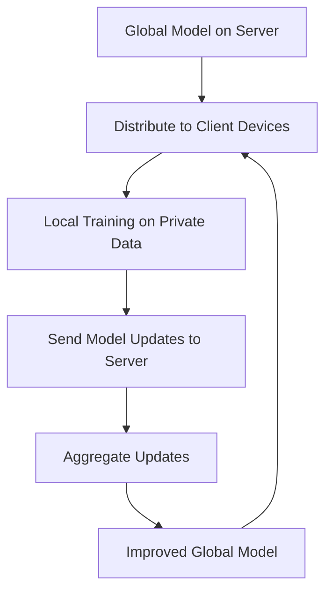
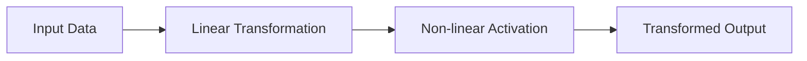
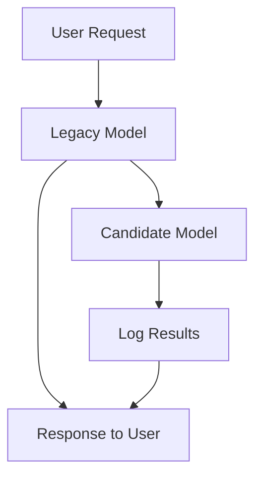
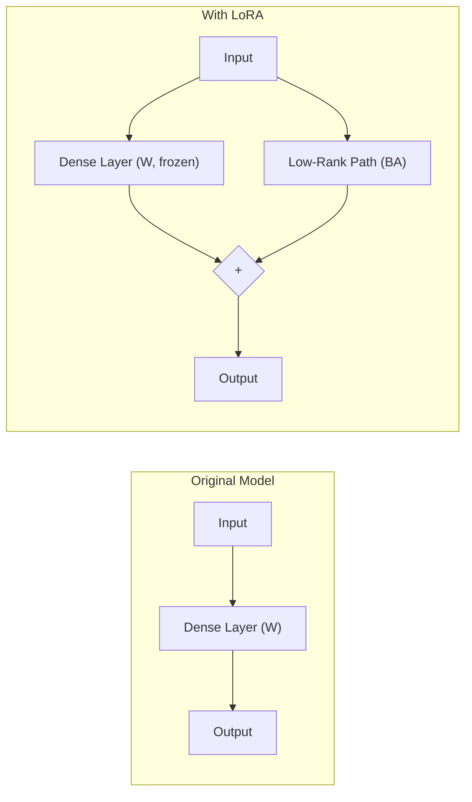
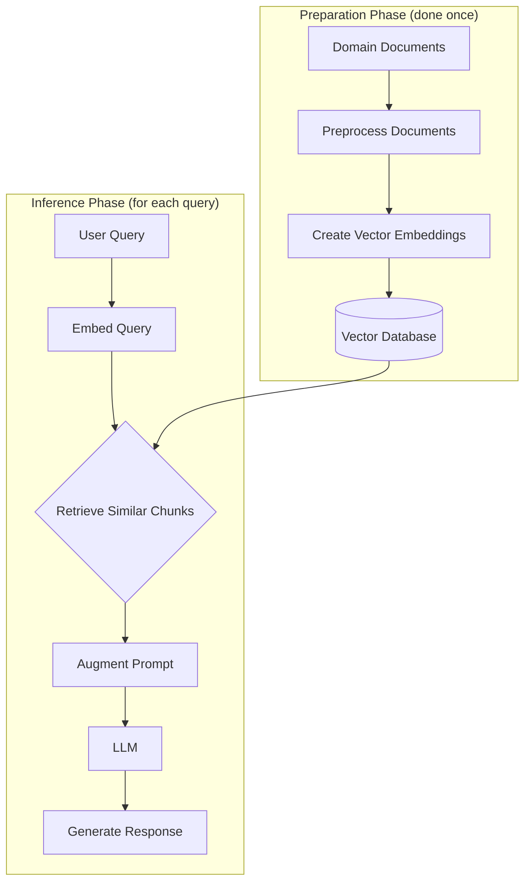

## Table of Contents

- [Advanced Learning Methodologies](#advanced-learning-methodologies)
  - [Transfer Learning vs. Fine-tuning vs. Multi-task Learning](#transfer-learning-vs-fine-tuning-vs-multi-task-learning)
  - [Introduction to Federated Learning](#introduction-to-federated-learning)
  - [Building Multi-task Learning Models](#building-multi-task-learning-models)
  - [Self-supervised Learning Approaches](#self-supervised-learning-approaches)
  - [Active Learning for Efficient Model Building](#active-learning-for-efficient-model-building)
- [Neural Network Training Optimization](#neural-network-training-optimization)
  - [Understanding Momentum in Optimization](#understanding-momentum-in-optimization)
  - [Mixed Precision Training](#mixed-precision-training)
  - [Gradient Checkpointing for Memory Efficiency](#gradient-checkpointing-for-memory-efficiency)
  - [Gradient Accumulation for Large Batch Training](#gradient-accumulation-for-large-batch-training)
- [Model Regularization Techniques](#model-regularization-techniques)
  - [Label Smoothing for Better Generalization](#label-smoothing-for-better-generalization)
  - [Focal Loss for Imbalanced Classification](#focal-loss-for-imbalanced-classification)
  - [Dropout: How it Actually Works](#dropout-how-it-actually-works)
  - [DropBlock: Enhanced Regularization for CNNs](#dropblock-enhanced-regularization-for-cnns)
  - [Understanding Neural Network Activations](#understanding-neural-network-activations)
- [Model Compression and Deployment](#model-compression-and-deployment)
  - [Knowledge Distillation for Model Compression](#knowledge-distillation-for-model-compression)
  - [Activation Pruning for Network Compression](#activation-pruning-for-network-compression)
  - [Model Deployment from Jupyter Notebooks](#model-deployment-from-jupyter-notebooks)
  - [Testing ML Models in Production](#testing-ml-models-in-production)
  - [Model Versioning and Registry](#model-versioning-and-registry)
- [Large Language Model Techniques](#large-language-model-techniques)
  - [Memory Requirements for LLM Training](#memory-requirements-for-llm-training)
  - [Low-Rank Adaptation (LoRA) Fine-tuning](#low-rank-adaptation-lora-fine-tuning)
  - [LoRA and Other Parameter-Efficient Fine-tuning Methods](#lora-and-other-parameter-efficient-fine-tuning-methods)
  - [Retrieval Augmented Generation (RAG) vs. Fine-tuning](#retrieval-augmented-generation-rag-vs-fine-tuning)

---

## Advanced Learning Methodologies

### Transfer Learning vs. Fine-tuning vs. Multi-task Learning

Different learning paradigms offer various approaches to leverage existing knowledge for new tasks:

#### Transfer Learning

Transfer learning is particularly valuable when:
- Your target task has limited data
- A related task has abundant data

**Process:**
1. Train a neural network (base model) on a data-rich related task
2. Replace the final layers of the base model with new layers
3. Train only the new layers on the target task, keeping earlier layers frozen

**Key Benefits:**
- Leverages patterns learned from related domains
- Reduces training data requirements for new tasks
- Accelerates convergence
- Often improves performance on target task

**Common Applications:**
- Computer vision tasks with pre-trained models like ResNet, VGG, EfficientNet
- NLP tasks with pre-trained models like BERT, RoBERTa

#### Fine-tuning

While often confused with transfer learning, fine-tuning has a distinct approach:

**Process:**
1. Start with a pre-trained model
2. Update weights of some or all layers of the model
3. Use a small learning rate to preserve learned features while adapting to new data

**Key Differences from Transfer Learning:**
- Does not typically replace model layers
- Updates weights throughout the network, not just in final layers
- Adjusts the entire pre-trained model to the new data

**Best Practices:**
- Use progressively higher learning rates for later layers
- Often combined with gradual unfreezing (starting with just the final layers)
- Can be more prone to catastrophic forgetting than transfer learning

#### Multi-task Learning

Multi-task learning trains a single model to perform multiple related tasks simultaneously:

**Process:**
1. Define a network with shared layers and task-specific branches
2. Define loss functions for each task
3. During backpropagation, accumulate gradients from all branches
4. Update shared layers with combined gradient information

**Implementation Example:**
```python
class MultitaskModel(nn.Module):
    def __init__(self):
        super().__init__()
        
        # Shared layers
        self.shared = nn.Sequential(
            nn.Linear(input_dim, 128),
            nn.ReLU(),
            nn.Linear(128, 64),
            nn.ReLU()
        )
        
        # Task-specific layers
        self.task1_output = nn.Linear(64, task1_output_dim)
        self.task2_output = nn.Linear(64, task2_output_dim)
    
    def forward(self, x):
        shared_features = self.shared(x)
        task1_pred = self.task1_output(shared_features)
        task2_pred = self.task2_output(shared_features)
        return task1_pred, task2_pred
```

**Key Benefits:**
- Improved generalization through shared representations
- More efficient use of data
- Reduced overfitting risk
- Computational efficiency (shared parameters)

**Implementation Considerations:**
- Task weighting can be critical (some tasks may need higher priority)
- Dynamic task weights based on validation performance can improve results
- Balancing tasks with different convergence rates requires careful optimization

---

### Introduction to Federated Learning

Federated learning addresses the challenge of training models on private data distributed across multiple devices or organizations:

**Core Concept:**
Rather than centralizing data for training, federated learning brings the model to the data, trains locally, and aggregates only model updates.

**Process:**



1. Start with a global model on a central server
2. Distribute this model to client devices (phones, hospitals, etc.)
3. Train the model on local private data on each device
4. Send only the model updates (not the data) back to the server
5. Aggregate updates from all clients to improve the global model
6. Repeat the process for multiple rounds

**Key Advantages:**
- Preserves data privacy (raw data never leaves the device)
- Reduces bandwidth requirements (only model updates are transmitted)
- Enables learning from data that cannot be centralized due to regulations, size, or privacy
- Distributes computational load across devices

**Challenges:**
- Device heterogeneity (different hardware, data distributions)
- Communication efficiency
- Client availability and reliability
- Potential for malicious clients

**Applications:**
- Mobile keyboard prediction
- Healthcare (sharing insights across hospitals without sharing patient data)
- Financial fraud detection across institutions
- IoT sensor networks

Federated learning represents a paradigm shift in how we think about model training, moving from "bring data to computation" to "bring computation to data".

---

### Building Multi-task Learning Models

Multi-task learning involves training a single model to perform multiple related tasks simultaneously. Here's a practical guide to implementation:

**Example Implementation:**
```python
import torch
import torch.nn as nn

# Define multi-task model for predicting sine and cosine
class TrigModel(nn.Module):
    def __init__(self):
        super().__init__()
        
        # Shared layers
        self.model = nn.Sequential(
            nn.Linear(1, 64),
            nn.ReLU(),
            nn.Linear(64, 64),
            nn.ReLU()
        )
        
        # Task-specific layers
        self.sin_branch = nn.Linear(64, 1)
        self.cos_branch = nn.Linear(64, 1)
    
    def forward(self, x):
        shared_features = self.model(x)
        sin_pred = self.sin_branch(shared_features)
        cos_pred = self.cos_branch(shared_features)
        return sin_pred, cos_pred
```

**Training Process:**
```python
# Initialize model, optimizer, and loss function
model = TrigModel()
optimizer = torch.optim.Adam(model.parameters(), lr=0.001)
loss_fn = nn.MSELoss()

# Training loop
for epoch in range(epochs):
    for x_batch in dataloader:
        # Forward pass
        sin_pred, cos_pred = model(x_batch)
        
        # Calculate task-specific losses
        sin_loss = loss_fn(sin_pred, torch.sin(x_batch))
        cos_loss = loss_fn(cos_pred, torch.cos(x_batch))
        
        # Combine losses
        total_loss = sin_loss + cos_loss
        
        # Backward pass and optimization
        optimizer.zero_grad()
        total_loss.backward()
        optimizer.step()
```

**Task Weighting Strategies:**
1. **Equal Weighting:** `total_loss = task1_loss + task2_loss`
2. **Fixed Weighting:** `total_loss = 0.7 * task1_loss + 0.3 * task2_loss`
3. **Dynamic Weighting:** Adjust weights based on validation performance
   ```python
   # Simplified dynamic weighting example
   weights = [1/task1_val_loss, 1/task2_val_loss]
   weights = [w/sum(weights) for w in weights]
   total_loss = weights[0] * task1_loss + weights[1] * task2_loss
   ```
4. **Uncertainty Weighting:** Weight tasks by learned uncertainty parameters

**Key Implementation Considerations:**
- Balance dataset sizes across tasks
- Consider task difficulty when designing shared layers
- Monitor validation performance on each task separately
- Shared layers should be large enough to learn shared representations
- Task-specific branches should be substantial enough to specialize

Multi-task learning can be particularly effective when tasks are related but different enough to provide complementary learning signals.

---

### Self-supervised Learning Approaches

Self-supervised learning creates supervised training signals from unlabeled data by leveraging the inherent structure of the data itself:

**Core Concept:**
Rather than requiring manual labels, self-supervised learning automatically generates labels from the data, transforming an unsupervised problem into a supervised one.

**Common Approaches in NLP:**
- **Masked Language Modeling:** Predict masked words in a sentence (BERT)
- **Next Sentence Prediction:** Determine if two sentences follow each other
- **Next Token Prediction:** Predict the next word given previous context (GPT)
- **Text Rotation:** Predict the correct order of shuffled sentences

**Common Approaches in Computer Vision:**
- **Contrastive Learning:** Learn similar representations for augmented versions of the same image
- **Rotation Prediction:** Predict the angle an image was rotated
- **Jigsaw Puzzles:** Reconstruct shuffled image patches
- **Colorization:** Predict colors from grayscale images

**Benefits:**
- Requires no manual labeling
- Can leverage vast amounts of available unlabeled data
- Often learns more general and transferable representations
- Reduces dependency on domain-specific labels

**Example: Language Model Pre-training**
```
Original text: "The cat sat on the mat."

Self-supervised task: Mask random words and predict them
Input: "The [MASK] sat on the [MASK]."
Target: Predict "cat" and "mat"
```

This approach allows models like BERT and GPT to learn powerful language representations from vast text corpora without explicit labeling, which can then be fine-tuned for specific downstream tasks with minimal labeled data.

---

### Active Learning for Efficient Model Building

Active learning addresses the challenge of building high-performing supervised models when data annotation is expensive or time-consuming:

**Core Concept:**
Rather than randomly selecting data to label, active learning strategically chooses the most informative examples for human annotation, maximizing learning efficiency.

**Process:**
1. Start by manually labeling a small percentage of the dataset (1-5%)
2. Train an initial model on this small labeled dataset
3. Use this model to predict labels for the remaining unlabeled data
4. Select instances the model is least confident about
5. Have humans annotate these selected instances
6. Add newly labeled data to the training set
7. Retrain the model and repeat

**Confidence Estimation Methods:**
1. **Probabilistic Margin:** Gap between highest and second-highest class probabilities
   - Small gap = low confidence = good candidate for labeling
2. **Entropy:** Measure information uncertainty across all possible classes
   - High entropy = high uncertainty = good candidate for labeling
3. **Model Ensemble Disagreement:** Where multiple models disagree on prediction
   - High disagreement = good candidate for labeling

**Example Scenario:**
```
Initial dataset: 10,000 images, only 100 labeled (1%)
Active learning process:
- Train model on 100 labeled images
- Predict on remaining 9,900 images
- Select 100 images with lowest confidence
- Obtain human labels for these 100 images
- Retrain model on 200 labeled images
- Repeat until desired performance is reached
```

**Variations:**
- **Pool-based Active Learning:** Select from a fixed pool of unlabeled data
- **Stream-based Active Learning:** Make label/skip decisions for each incoming example
- **Query Synthesis:** Generate synthetic examples for labeling
- **Cooperative Learning:** Also use high-confidence predictions as pseudo-labels

Active learning has shown to achieve the same model performance with 40-80% fewer labels in many domains, making it particularly valuable for medical imaging, legal document analysis, and other areas where expert annotation is costly.

---

## Neural Network Training Optimization

### Understanding Momentum in Optimization

Momentum is a technique that significantly improves the efficiency and effectiveness of gradient-based optimization methods:

**The Problem With Standard Gradient Descent:**
Standard gradient descent updates weights using only the current gradient, which can lead to:
- Slow progress in flat regions
- Oscillations in narrow valleys
- Getting stuck in suboptimal local minima

**How Momentum Works:**
Momentum adds a fraction of the previous update vector to the current update:

```
v_t = β * v_{t-1} + (1 - β) * gradient_t
weights = weights - learning_rate * v_t
```

Where:
- `v_t` is the velocity at time t
- `β` is the momentum coefficient (typically 0.9)
- `gradient_t` is the current gradient

**Visual Intuition:**
Imagine a ball rolling down a hill:
- Standard gradient descent is like a ball that stops and changes direction at each step
- Momentum is like a ball with inertia that accumulates speed in consistent directions

**Benefits:**
1. **Accelerates Progress:** Builds up velocity in directions with consistent gradients
2. **Dampens Oscillations:** Averages out opposing gradients in narrow dimensions
3. **Escapes Local Minima:** Momentum can carry updates past small local minima
4. **Faster Convergence:** Often reduces training time by 2-3x

**Implementation in PyTorch:**
```python
optimizer = torch.optim.SGD(
    model.parameters(),
    lr=0.01,
    momentum=0.9  # Momentum coefficient
)
```

**Parameter Selection:**
- β = 0.9 is a common default (considers ~10 previous updates)
- Higher values (0.95-0.99) give more weight to past updates
- Lower values (0.5-0.8) are more responsive to recent gradients

Momentum is a foundational optimization technique in deep learning, and variants like Nesterov Momentum, Adam, and RMSProp build upon its core principles to offer further improvements in specific scenarios.

---

### Mixed Precision Training

Mixed precision training allows for faster, memory-efficient neural network training by utilizing lower precision number formats:

**Core Concept:**
Strategically use 16-bit (half precision) calculations where possible while maintaining 32-bit precision where necessary for numerical stability.

**Why it Works:**
- FP16 (16-bit) operations are significantly faster on modern GPUs
- FP16 values take half the memory of FP32 (32-bit)
- Most neural network calculations don't require full 32-bit precision

**Memory and Computational Benefits:**
- 2x memory efficiency for stored tensors
- Up to 3x computational speedup on hardware with FP16 support
- Allows larger batch sizes and bigger models on the same hardware

**Implementation Strategy:**
1. **Keep master weights in FP32**
2. **Create FP16 copy** of weights for forward pass
3. **Compute forward pass** in FP16
4. **Scale loss** to prevent gradient underflow
5. **Compute gradients** in FP16
6. **Convert gradients to FP32** for weight updates
7. **Update FP32 master weights**

**PyTorch Implementation:**
```python
# Import mixed precision tools
from torch.cuda.amp import autocast, GradScaler

# Initialize model, optimizer and scaler
model = MyModel().cuda()
optimizer = torch.optim.Adam(model.parameters())
scaler = GradScaler()

# Training loop
for inputs, labels in dataloader:
    # Move data to GPU
    inputs, labels = inputs.cuda(), labels.cuda()
    
    # Forward pass with autocasting
    with autocast():
        outputs = model(inputs)
        loss = loss_fn(outputs, labels)
    
    # Backward pass with scaling
    optimizer.zero_grad()
    scaler.scale(loss).backward()
    scaler.step(optimizer)
    scaler.update()
```

**Best Practices:**
- Start with mixed precision for all new training projects
- Monitor for any signs of numerical instability
- Particularly beneficial for:
  - Models with many matrix multiplications (Transformers, CNNs)
  - Training on hardware with dedicated FP16 support (NVIDIA Tensor Cores)
  - Memory-limited scenarios

Mixed precision training is widely used for training large models like BERT, GPT, and state-of-the-art computer vision networks, enabling larger and more capable models to be trained on existing hardware.

---

### Gradient Checkpointing for Memory Efficiency

Gradient checkpointing is a technique to reduce memory usage during neural network training at the cost of additional computation:

**The Memory Problem:**
During backpropagation, neural networks store all intermediate activations from the forward pass, leading to:
- Linear memory growth with network depth
- Memory becoming the limiting factor for large models
- Restrictions on batch size and model complexity

**How Gradient Checkpointing Works:**
1. **Divide network into segments**
2. **During forward pass:** Only store activations at segment boundaries
3. **During backward pass:** Recompute internal activations when needed

**Memory vs. Computation Tradeoff:**
- Memory reduction: Typically 50-60% less memory usage
- Computational cost: ~20-30% additional computation time
- Net benefit: Often allows 2-3x larger models or batch sizes

**Implementation in PyTorch:**
```python
import torch
from torch.utils.checkpoint import checkpoint_sequential

class CheckpointedModel(torch.nn.Module):
    def __init__(self):
        super().__init__()
        # Define network as a sequence of layers
        self.layers = torch.nn.Sequential(
            # Many layers here...
            torch.nn.Linear(512, 512),
            torch.nn.ReLU(),
            torch.nn.Linear(512, 512),
            # More layers...
        )
    
    def forward(self, x):
        # Divide into 2 segments for checkpointing
        return checkpoint_sequential(self.layers, 2, x)
```

**When to Use:**
- Training very deep networks
- Working with limited GPU memory
- When larger batch sizes are needed for training stability
- When you can tolerate longer training times for memory efficiency

Gradient checkpointing is particularly valuable for:
- Transformer models (like BERT, GPT)
- Very deep ResNets
- Training on consumer GPUs with limited VRAM
- Enabling research on larger models without specialized hardware

This technique has been crucial for democratizing research on large models, allowing researchers with limited hardware to work on state-of-the-art architectures.

---

### Gradient Accumulation for Large Batch Training

Gradient accumulation enables training with effectively larger batch sizes without requiring proportional memory increases:

**The Problem:**
- Larger batch sizes often lead to more stable training
- Memory limitations restrict maximum batch size
- Simply reducing batch size can harm convergence

**How Gradient Accumulation Works:**
1. Process smaller mini-batches through forward and backward passes
2. Accumulate gradients without updating weights
3. Update weights only after processing several mini-batches
4. Reset accumulated gradients and repeat

**Mathematical Equivalence:**
Processing 4 batches of size 16 with gradient accumulation is mathematically equivalent to processing 1 batch of size 64 in terms of weight updates.

**PyTorch Implementation:**
```python
# Define accumulation steps
accumulation_steps = 4
model.train()

for i, (inputs, labels) in enumerate(dataloader):
    # Forward pass
    outputs = model(inputs)
    loss = criterion(outputs, labels)
    
    # Scale loss by accumulation steps
    loss = loss / accumulation_steps
    
    # Backward pass
    loss.backward()
    
    # Update weights only after accumulation_steps backward passes
    if (i + 1) % accumulation_steps == 0:
        optimizer.step()
        optimizer.zero_grad()
```

**Benefits:**
- Train with effectively larger batch sizes
- Maintain training stability without memory scaling
- Enable state-of-the-art training techniques on limited hardware
- Particularly useful for large models and high-resolution inputs

**Considerations:**
- Slightly slower training due to smaller batch efficiency
- May require learning rate adjustment
- BatchNorm layers need special handling (use larger actual batches or sync stats)

**Real-world Impact:**
Gradient accumulation made it possible to reproduce results from papers that used 8-16 high-end GPUs on just 1-2 consumer GPUs, dramatically democratizing deep learning research.

---

## Model Regularization Techniques

### Label Smoothing for Better Generalization

Label smoothing is a powerful regularization technique that improves model generalization by preventing overconfidence:

**The Problem:**
- Neural networks often become overly confident in their predictions
- With standard one-hot labels, models are trained to assign 100% probability to the correct class
- This pushes models to make extreme predictions, reducing generalization

**How Label Smoothing Works:**
Instead of using hard 0/1 labels, slightly "smooth" the labels:

```
# Standard one-hot label for a 3-class problem
[0, 1, 0]

# With label smoothing (α = 0.1)
[0.033, 0.933, 0.033]
```

The smoothed label is calculated as:
```
new_label = (1 - α) * one_hot_label + α * uniform_distribution
```

Where α is the smoothing factor (typically 0.1-0.2).

**Implementation in PyTorch:**
```python
class LabelSmoothingLoss(nn.Module):
    def __init__(self, classes, smoothing=0.1):
        super().__init__()
        self.confidence = 1.0 - smoothing
        self.smoothing = smoothing
        self.classes = classes
    
    def forward(self, pred, target):
        pred = pred.log_softmax(dim=-1)
        with torch.no_grad():
            true_dist = torch.zeros_like(pred)
            true_dist.fill_(self.smoothing / (self.classes - 1))
            true_dist.scatter_(1, target.unsqueeze(1), self.confidence)
        return torch.mean(torch.sum(-true_dist * pred, dim=-1))
```

**Benefits:**
- Improves model generalization
- Reduces overfitting
- Makes models more robust to label noise
- Often improves test accuracy by 0.5-2%

**Effect on Calibration:**
While label smoothing improves classification accuracy, it can affect probability calibration. Models trained with label smoothing tend to:
- Produce less extreme probability distributions
- Have lower confidence in their predictions
- Sometimes have less reliable confidence estimates

**Applications:**
Label smoothing has become standard practice in many state-of-the-art models, including:
- Image classification (EfficientNet, ResNet)
- Transformers for NLP
- Machine translation models

This simple technique provides substantial benefits with minimal computational overhead.

---

### Focal Loss for Imbalanced Classification

Focal Loss addresses the challenge of class imbalance by dynamically adjusting the loss contribution of easy examples:

**The Problem with Standard Losses:**
- In imbalanced datasets, the majority class dominates training
- Standard BCE loss treats all examples equally
- Easy majority-class examples can overwhelm rare class signals

**How Focal Loss Works:**
Focal Loss modifies standard cross-entropy by adding a modulating factor:

```
Focal Loss = -α(1-p)^γ * log(p)
```

Where:
- p is the predicted probability of the true class
- γ (gamma) is the focusing parameter (typically 2-5)
- α is an optional weighting factor based on class frequency

**The Downweighting Effect:**
- When a prediction is confident and correct (p close to 1): (1-p)^γ is small, reducing loss
- When a prediction is uncertain (p close to 0.5): loss is less reduced
- When a prediction is wrong (p close to 0): loss is barely reduced

This naturally focuses training on hard examples while downweighting easy examples that contribute little learning signal.

**PyTorch Implementation:**
```python
def focal_loss(predictions, targets, alpha=0.25, gamma=2.0):
    """
    Focal loss for binary classification
    """
    BCE_loss = F.binary_cross_entropy_with_logits(predictions, targets, reduction='none')
    
    pt = torch.exp(-BCE_loss)  # probabilities
    focal_loss = alpha * (1-pt)**gamma * BCE_loss
    
    return focal_loss.mean()
```

**When to Use Focal Loss:**
- Extreme class imbalance (e.g., 1:100 or worse)
- Object detection (where background dominates)
- Medical image analysis (where abnormalities are rare)
- Fraud detection and other anomaly detection scenarios

**Results Comparison:**
Testing Focal Loss (γ=3) on a binary classification dataset with 90:10 imbalance:
- Standard BCE: 73% accuracy, 45% recall on minority class
- Focal Loss: 82% accuracy, 78% recall on minority class

Focal Loss has become a standard component in many object detection frameworks (like RetinaNet) and is increasingly used in medical image analysis and other domains with significant class imbalance.

---

### Dropout: How it Actually Works

Dropout is a fundamental regularization technique in deep learning, but its full mechanism is often misunderstood:

**Basic Understanding:**
- Randomly "drop" (set to zero) neurons during training
- Each neuron has probability p of being dropped
- At inference time, no neurons are dropped

**The Complete Mechanism:**
What many resources don't explain is the scaling component:

1. **During Training:**
   - Randomly zero out neurons with probability p
   - Scale remaining activations by 1/(1-p)
   - Example: With p=0.4, scale remaining activations by 1/0.6 ≈ 1.67

2. **During Inference:**
   - No neurons are dropped
   - No scaling is performed

**Why Scaling Is Necessary:**
- Ensures expected sum of inputs to the next layer remains consistent
- Maintains statistical coherence between training and inference
- Without scaling, the model would experience a dramatic shift in activation magnitudes

**Verification in PyTorch:**
```python
# Define dropout layer
dropout = nn.Dropout(p=0.5)

# Create random tensor
x = torch.randn(5)
print("Original:", x)

# Apply dropout in training mode
dropout.train()
y = dropout(x)
print("With dropout (train):", y)

# Apply dropout in evaluation mode
dropout.eval()
z = dropout(x)
print("With dropout (eval):", z)
```

This code would show retained values are scaled by 1/(1-p) = 2 during training.

**Ensemble Interpretation:**
Dropout can be viewed as training an ensemble of sub-networks:
- Each training batch uses a different sub-network
- At inference time, we approximate averaging predictions from all possible sub-networks

**Practical Guidelines:**
- Common dropout rates: 0.1-0.3 for convolutional layers, 0.4-0.5 for fully-connected layers
- Apply dropout after activation functions
- Consider not using dropout in the final layers
- Monitor validation performance to tune dropout rate

Understanding the complete dropout mechanism helps explain why it works and guides its effective application across different network architectures.

---

### DropBlock: Enhanced Regularization for CNNs

Standard Dropout is less effective for convolutional layers because of spatial correlations. DropBlock addresses this limitation:

**The Problem with Dropout in CNNs:**
- CNNs create spatially correlated feature maps
- Adjacent pixels/features contain similar information
- Dropping individual pixels/features doesn't effectively regularize
- Information "leaks" through neighboring features

**How DropBlock Works:**
1. Create a binary mask with probability p of pixels being dropped
2. Form contiguous blocks (of size block_size × block_size) centered on the selected pixels
3. Drop entire blocks of features instead of individual features
4. Scale remaining activations by 1/(1-p) as in standard dropout

**Implementation in PyTorch:**
```python
class DropBlock2D(nn.Module):
    def __init__(self, drop_prob=0.1, block_size=7):
        super(DropBlock2D, self).__init__()
        self.drop_prob = drop_prob
        self.block_size = block_size
        
    def forward(self, x):
        if not self.training or self.drop_prob == 0:
            return x
            
        # Get dimensions
        _, _, height, width = x.size()
        
        # Sample mask
        mask_reduction = (self.block_size // 2)
        mask_height = height - 2 * mask_reduction
        mask_width = width - 2 * mask_reduction
        
        mask = torch.rand(x.shape[0], 1, mask_height, mask_width).to(x.device)
        mask = (mask < self.drop_prob).float()
        
        # Expand mask to block_size
        mask = F.pad(mask, (mask_reduction, mask_reduction, 
                            mask_reduction, mask_reduction))
        mask = F.max_pool2d(mask, kernel_size=self.block_size, 
                          stride=1, padding=self.block_size//2)
        
        # Apply mask and scale
        mask = 1 - mask
        x = x * mask * (mask.numel() / mask.sum())
        
        return x
```

**Key Parameters:**
- `drop_prob`: Probability of dropping a feature (similar to standard dropout)
- `block_size`: Size of blocks to drop (larger sizes = stronger regularization)

**Results from Research:**
On ImageNet classification:
- Standard model: 76.8% Top-1 accuracy
- With Dropout: 77.1% Top-1 accuracy (+0.3%)
- With DropBlock: 78.1% Top-1 accuracy (+1.3%)

**Best Practices:**
- Start with block_size approximately 1/10 of feature map size
- Use a drop_prob schedule that increases gradually during training
- Apply DropBlock to later convolutional layers (where features are more semantic)
- Consider different block sizes for different network depths

DropBlock has become a standard regularization technique for state-of-the-art CNN architectures, particularly in computer vision tasks that require strong regularization like object detection and segmentation.

---

### Understanding Neural Network Activations

Neural networks create complex decision boundaries through layer-by-layer transformations. Understanding this process provides insights into their functioning:

**The Core Transformation Process:**
At each layer, neural networks perform:
1. Linear transformation of input data
2. Non-linear activation function application



**What Neural Networks Actually Learn:**
Through multiple layers of transformation, neural networks are constantly striving to **project data into a linearly separable form** before the final layer.

**Visual Intuition:**
Consider a 2D binary classification problem with non-linear decision boundary:
1. Input space: Data points are not linearly separable
2. After first hidden layer: Some non-linear transformations applied
3. After second hidden layer: Data becoming more separated
4. Before output layer: Data has become linearly separable

**Experimental Verification:**
We can verify this by adding a visualization layer with 2 neurons right before the output layer:
```python
class VisualizationModel(nn.Module):
    def __init__(self):
        super().__init__()
        # Initial layers
        self.initial_layers = nn.Sequential(
            nn.Linear(input_dim, 64),
            nn.ReLU(),
            nn.Linear(64, 32),
            nn.ReLU()
        )
        
        # Visualization layer (2D)
        self.viz_layer = nn.Linear(32, 2)
        
        # Output layer
        self.output_layer = nn.Linear(2, 1)
    
    def forward(self, x):
        x = self.initial_layers(x)
        viz_features = self.viz_layer(x)
        output = self.output_layer(viz_features)
        return output, viz_features
```

By plotting the 2D activations from `viz_features`, we can observe that the model has transformed the data to be linearly separable.

**Why This Matters:**
Understanding this principle:
1. Explains why neural networks can approximate any function
2. Guides architecture design (deeper networks can create more complex transformations)
3. Informs debugging approaches (examining intermediate activations)
4. Helps understand why regularization techniques like dropout work

This insight reveals that what appears as a "black box" is actually a systematic process of successive transformations aimed at creating linear separability.

---

## Model Compression and Deployment

### Knowledge Distillation for Model Compression

Knowledge distillation compresses larger, complex models ("teachers") into smaller, simpler models ("students") while maintaining performance:

**Core Concept:**
Rather than training a small model directly on hard labels, train it to mimic the output distribution of a larger pre-trained model.

**How It Works:**
1. Train a large, complex "teacher" model
2. Use this teacher to generate "soft targets" (probability distributions)
3. Train a smaller "student" model to match these distributions

**The Knowledge Transfer Process:**
- Hard labels (ground truth): [0, 1, 0, 0]
- Soft targets (teacher output): [0.01, 0.92, 0.05, 0.02]
- Student learns from both, with emphasis on soft targets

**Implementation in PyTorch:**
```python
class DistillationLoss(nn.Module):
    def __init__(self, alpha=0.5, temperature=2.0):
        super().__init__()
        self.alpha = alpha  # Balance between hard and soft targets
        self.T = temperature  # Temperature for softening distributions
        self.kl_div = nn.KLDivLoss(reduction='batchmean')
        self.ce = nn.CrossEntropyLoss()
    
    def forward(self, student_logits, teacher_logits, targets):
        # Hard target loss
        hard_loss = self.ce(student_logits, targets)
        
        # Soft target loss
        soft_student = F.log_softmax(student_logits / self.T, dim=1)
        soft_teacher = F.softmax(teacher_logits / self.T, dim=1)
        soft_loss = self.kl_div(soft_student, soft_teacher) * (self.T ** 2)
        
        # Combined loss
        return self.alpha * hard_loss + (1 - self.alpha) * soft_loss
```

**Training Process:**
```python
# Pre-trained teacher model
teacher.eval()

# Training loop
for inputs, targets in dataloader:
    # Get teacher predictions
    with torch.no_grad():
        teacher_logits = teacher(inputs)
    
    # Get student predictions
    student_logits = student(inputs)
    
    # Calculate distillation loss
    loss = distillation_loss(student_logits, teacher_logits, targets)
    
    # Update student model
    optimizer.zero_grad()
    loss.backward()
    optimizer.step()
```

**Key Parameters:**
- **Temperature (T):** Controls the "softness" of probability distributions
  - Higher T → Softer distributions → More emphasis on smaller logits
  - Typical values: 2-10
- **Alpha:** Balance between hard and soft targets
  - Higher alpha → More emphasis on original labels
  - Typical values: 0.3-0.7

**Results from a MNIST Example:**
- Teacher: CNN with 1.3M parameters, 99.2% accuracy
- Student without distillation: 2-layer network with 80K parameters, 97.8% accuracy
- Student with distillation: Same network, 98.7% accuracy

**Real-World Applications:**
- DistilBERT: 40% smaller than BERT, retains 97% of performance, 60% faster
- MobileNet distilled from larger CNN models
- Edge device deployment where model size and inference speed are critical

Knowledge distillation provides a powerful way to deploy high-performing models in resource-constrained environments.

---

### Activation Pruning for Network Compression

After training, neural networks often contain many "useless" neurons that can be removed without affecting performance. Activation pruning identifies and removes these redundant components:

**Core Concept:**
Identify neurons with consistently low activation values across the dataset and remove them from the network.

**Pruning Process:**
1. Train a neural network to completion
2. Run the entire dataset through the model (without backpropagation)
3. Calculate the average activation magnitude of each neuron
4. Remove neurons with activations below a threshold λ
5. Fine-tune the remaining network if necessary

**Implementation Example:**
```python
def prune_network(model, dataloader, threshold=0.4):
    # Set up activation hooks
    activations = {}
    
    def get_activation(name):
        def hook(model, input, output):
            activations[name] = output.detach()
        return hook
    
    # Register hooks for each layer
    for name, layer in model.named_modules():
        if isinstance(layer, nn.ReLU):
            layer.register_forward_hook(get_activation(name))
    
    # Collect activations across dataset
    model.eval()
    activation_sums = {}
    counts = {}
    
    with torch.no_grad():
        for inputs, _ in dataloader:
            inputs = inputs.to(device)
            _ = model(inputs)
            
            # Accumulate activations
            for name, act in activations.items():
                act_mean = act.abs().mean(dim=0)  # Average across batch
                if name in activation_sums:
                    activation_sums[name] += act_mean
                    counts[name] += 1
                else:
                    activation_sums[name] = act_mean
                    counts[name] = 1
    
    # Compute average activations
    avg_activations = {name: activation_sums[name] / counts[name] 
                       for name in activation_sums}
    
    # Determine neurons to prune (below threshold)
    prune_masks = {name: avg_act > threshold for name, avg_act 
                  in avg_activations.items()}
    
    return prune_masks
```

**Pruning Results at Different Thresholds:**
| Threshold (λ) | Parameters Pruned | Accuracy Change |
|---------------|-------------------|-----------------|
| 0.1           | 20%               | -0.15%          |
| 0.2           | 42%               | -0.38%          |
| 0.3           | 61%               | -0.47%          |
| 0.4           | 72%               | -0.62%          |
| 0.5           | 83%               | -3.50%          |

**Benefits:**
- Reduces model size (up to 70-80% with minimal accuracy loss)
- Decreases inference time
- Lowers memory requirements
- Can improve generalization in some cases

**Best Practices:**
- Start with a small threshold and gradually increase
- Prune layer by layer, starting from later layers
- Fine-tune after pruning to recover accuracy
- Consider combining with quantization for further compression

Activation pruning provides a straightforward approach to network compression without requiring changes to the training process, making it easily applicable to existing models.

---

### Model Deployment from Jupyter Notebooks

Deploying machine learning models from development to production environment often involves multiple steps and technologies. Modelbit simplifies this process by enabling direct deployment from Jupyter notebooks:

**Traditional Deployment Challenges:**
- Environment management and dependency tracking
- Converting research code to production code
- Setting up API endpoints and infrastructure
- Version control and continuous integration

**Modelbit Deployment Process:**
1. Install the Modelbit package:
   ```python
   !pip install modelbit
   ```

2. Log in to Modelbit from the notebook:
   ```python
   import modelbit
   modelbit.login()
   ```

3. Define an inference function that will be executed at prediction time:
   ```python
   def predict_revenue(x_value):
       # Validate input
       if not isinstance(x_value, float):
           raise TypeError("Input must be a float")
       
       # Generate prediction using our model
       prediction = model.predict([[x_value]])[0]
       
       return prediction
   ```

4. Deploy the model:
   ```python
   modelbit.deploy(predict_revenue)
   ```

**Key Benefits:**
- One-click deployment from research environment
- Automatic packaging of dependencies
- Immediate API endpoint generation
- Version control integration
- No infrastructure management required

**Using the Deployed Model:**
The deployed model can be accessed via API:
```python
import requests
import json

response = requests.post(
    "https://yourname.modelbit.com/v1/predict_revenue/latest",
    json={"data": [[5.0]]}
)

prediction = response.json()["data"]
```

This approach dramatically simplifies the deployment process, allowing data scientists to focus on model development rather than infrastructure concerns.

---

### Testing ML Models in Production

Deploying a new ML model directly to production can be risky. Several testing strategies help mitigate this risk:

**1. A/B Testing:**
- Randomly distribute traffic between legacy model and candidate model
- Measure performance metrics for both models
- Gradually increase traffic to new model if it performs better

**2. Canary Deployment:**
- Release the candidate model to a small subset of users
- Monitor performance closely for issues
- Gradually roll out to more users if successful
- Roll back immediately if problems occur

**3. Interleaved Testing:**
- Mix predictions from both models in the same response
- Particularly useful for recommendation systems
- Example: Mixing product recommendations from old and new models
- Allows direct comparison of engagement metrics

**4. Shadow Testing:**
- Deploy candidate model alongside legacy model
- Send requests to both models but only use legacy model's responses
- Log candidate model outputs for analysis
- Compare performance offline without affecting users

**Shadow Testing Implementation:**


**Selecting the Right Testing Strategy:**
- **A/B Testing:** When you're confident in the new model but want to measure real impact
- **Canary Deployment:** When you want to limit potential negative impact
- **Interleaved Testing:** For recommendation and ranking systems
- **Shadow Testing:** When any error would be costly or when comparing many models

**Metrics to Monitor:**
- Model-specific metrics (accuracy, F1, etc.)
- Business metrics (conversion rate, revenue)
- Technical metrics (latency, throughput)
- User experience metrics (engagement, satisfaction)

These testing strategies allow for safe, controlled deployment of new models while minimizing risk and maximizing learning opportunities.

---

### Model Versioning and Registry

Effective ML deployment requires proper model versioning and registry systems to track, manage, and deploy models:

**Why Version Control for Models:**
- Models evolve over time with new data and algorithms
- Need to track which model version is in production
- Ability to roll back to previous versions if issues arise
- Audit trail for compliance and debugging

**Common Versioning Approaches:**

1. **Code and Model Together:**
   - Version control both code and serialized model
   - Simple but inefficient for large models
   - Example: Git LFS + model file

2. **Separate Model Registry:**
   - Code in standard version control
   - Models in specialized registry
   - More efficient for large models
   - Better for model lifecycle management

**Model Registry Benefits:**
- Centralized repository for all models
- Metadata tracking (performance metrics, training data version)
- Deployment status tracking
- Streamlined promotion workflows (dev → staging → production)
- Simplified rollback capabilities

**Real-World Example:**
A bug is discovered in the inference code (not the model itself):
- **Without Registry:** Re-train and re-deploy entire model
- **With Registry:** Update only the inference code while using the same model

**Implementation Considerations:**
- Use model registry platforms (MLflow, Weights & Biases, etc.)
- Establish clear versioning conventions (semantic versioning)
- Track key metadata with each model version:
  - Training data version/hash
  - Performance metrics
  - Hyperparameters
  - Dependencies and environment
  - Author and approval status

A robust model versioning and registry system is foundational for reliable, maintainable machine learning systems in production environments.

---

## Large Language Model Techniques

### Memory Requirements for LLM Training

Understanding the memory required for training large language models helps explain why they're so resource-intensive:

**Memory Components for LLM Training:**

1. **Model Parameters (16-bit):**
   - Each parameter requires 2 bytes in 16-bit precision
   - Example: GPT-2 XL (1.5B parameters) = 3GB for parameters alone

2. **Optimizer States (Adam, 32-bit):**
   - Momentum: 4 bytes per parameter
   - Variance: 4 bytes per parameter
   - 32-bit model copy: 4 bytes per parameter
   - Total: 12 bytes per parameter
   - Example: GPT-2 XL = 18GB for optimizer states

3. **Activations (16-bit):**
   - Depends on batch size, sequence length, and model architecture
   - Formula for transformer block activations:
     ```
     Activations = batch_size * seq_length * (4 * hidden_dim + 2 * ffn_dim)
     ```
   - Total activations = activations per block * number of blocks
   - Example: GPT-2 XL with batch size 32 = ~60GB without optimizations

**Total Memory Requirements:**
For GPT-2 XL (1.5B parameters):
- Parameters: 3GB
- Optimizer states: 18GB
- Activations: ~60GB
- **Total: ~81GB**

With gradient checkpointing to reduce activation memory to ~9GB:
- **Reduced total: ~30GB**

**Memory Optimization Techniques:**
1. **Mixed Precision Training:** Use 16-bit for most operations
2. **Gradient Checkpointing:** Trade computation for memory by recomputing activations
3. **Gradient Accumulation:** Use smaller batch sizes and accumulate gradients
4. **Optimizer Memory Reduction:** Use optimizers with lower memory requirements
5. **Model Parallelism:** Distribute model across multiple GPUs
6. **ZeRO (Zero Redundancy Optimizer):** Partition optimizer states across GPUs

**Practical Implications:**
- Training GPT-2 XL (1.5B parameters) requires at least 32GB GPU memory
- Models like GPT-3 (175B parameters) require distributed training across hundreds of GPUs
- Even inference can require substantial memory for large models

This memory analysis explains why LLM training is primarily conducted by organizations with access to large GPU clusters and why techniques to reduce memory requirements are crucial for democratizing LLM research.

---

### Low-Rank Adaptation (LoRA) Fine-tuning

Full fine-tuning of large language models is resource-intensive. Low-Rank Adaptation (LoRA) offers an efficient alternative:

**Problem with Full Fine-tuning:**
- Requires updating all model parameters (billions for modern LLMs)
- High GPU memory requirements
- Costly in both computation and storage
- Each fine-tuned model is a full copy of the original

**LoRA Approach:**
1. Keep the pre-trained model frozen (no weight updates)
2. Add small, trainable low-rank matrices alongside original weight matrices
3. Train only these low-rank matrices
4. Combine original and low-rank matrices at inference time

**Mathematical Formulation:**
For a weight matrix W, LoRA decomposes the update ΔW as:
```
ΔW = BA
```
Where:
- B is a matrix of size (d_out × r)
- A is a matrix of size (r × d_in)
- r is the rank (typically 4-32)

The effective weight matrix becomes:
```
W_effective = W + ΔW = W + BA
```

**Parameter Efficiency:**
For a weight matrix of size 1000×1000:
- Full fine-tuning: 1M parameters
- LoRA with r=8: 16K parameters (1.6% of original)

**Implementation Architecture:**


**Advantages:**
1. **Memory Efficiency:** Only requires storing small matrices
2. **Computational Efficiency:** Much faster training with fewer parameters
3. **Storage Efficiency:** LoRA adapters are typically <100MB vs. full models at >10GB
4. **Composition:** Multiple LoRA adapters can be combined
5. **Zero Inference Overhead:** Can be merged with original weights at inference time

**Variants and Extensions:**
- **LoRA-FA:** Freezes matrix A and only trains matrix B
- **VeRA:** Uses random frozen matrices with trainable scaling vectors
- **Delta-LoRA:** Adds differences between consecutive training steps to original weights
- **LoRA+:** Uses different learning rates for matrices A and B

LoRA has become the standard approach for efficient fine-tuning of large language models, enabling personalization and domain adaptation with limited computational resources.

---

### LoRA and Other Parameter-Efficient Fine-tuning Methods

Several techniques extend or complement LoRA for efficient LLM fine-tuning:

**1. LoRA (Low-Rank Adaptation):**
- Adds trainable low-rank matrices (A and B) alongside frozen weight matrices
- Typical rank: 4-32
- Parameter reduction: >95% compared to full fine-tuning
- Original matrix W updated as: W + BA

**2. LoRA-FA (Frozen-A):**
- Further reduces parameters by freezing matrix A
- Only matrix B is trained
- Addresses memory constraints from activation storage
- Same inference capabilities as standard LoRA

**3. VeRA (Vector-based Random Matrix Adaptation):**
- Uses random, frozen matrices A and B across all layers
- Only trains small layer-specific scaling vectors b and d
- Update: W + b⊗d × (AB)
- Extreme parameter efficiency with minimal performance loss

**4. Delta-LoRA:**
- Combines LoRA with direct weight updates
- Computes low-rank matrices A and B
- Updates original weights W with the difference between consecutive AB products
- Formula: W_t+1 = W_t + η(A_t+1B_t+1 - A_tB_t)
- Addresses LoRA's limitations with complex transformations

**5. LoRA+:**
- Same architecture as LoRA
- Uses different learning rates for matrices A and B
- Typically higher learning rate for B than A
- Improves convergence speed and final performance

**Comparison of Parameter Counts:**
For a model with 1B parameters:
- Full fine-tuning: 1B trainable parameters
- LoRA (r=16): ~10M trainable parameters (1%)
- LoRA-FA (r=16): ~5M trainable parameters (0.5%)
- VeRA: <1M trainable parameters (0.1%)

**When to Use Each Approach:**
- **Standard LoRA:** General purpose, balanced performance and efficiency
- **LoRA-FA:** Very memory-constrained environments
- **VeRA:** Extreme parameter efficiency needs
- **Delta-LoRA:** Complex adaptations where LoRA underperforms
- **LoRA+:** When training stability or convergence speed is critical

These parameter-efficient techniques have democratized LLM fine-tuning, enabling customization of powerful models on consumer hardware and reducing the environmental impact of model adaptation.

---

### Retrieval Augmented Generation (RAG) vs. Fine-tuning

RAG and fine-tuning represent two different approaches to enhancing LLMs with domain-specific knowledge:

**Fine-tuning Approach:**
- Modifies model weights to incorporate new knowledge
- Requires training on domain-specific data
- Knowledge is embedded within model parameters
- Creates a specialized model variant

**RAG Approach:**
- Keeps model weights unchanged
- Retrieves relevant information from external knowledge source at query time
- Augments prompt with retrieved information
- Uses LLM to generate response based on augmented context

**RAG Process:**



1. **Preparation Phase (done once):**
   - Preprocess domain-specific documents
   - Create vector embeddings of document chunks
   - Store embeddings in vector database

2. **Inference Phase (for each query):**
   - Embed user query using same embedding model
   - Retrieve most similar document chunks from vector database
   - Combine query and retrieved documents into augmented prompt
   - Send augmented prompt to LLM for response generation

**Comparing Approaches:**

| Aspect | Fine-tuning | RAG |
|--------|-------------|-----|
| Training cost | High | Low (one-time embedding) |
| Inference cost | Standard | Higher (retrieval + larger context) |
| Knowledge update | Requires retraining | Just update database |
| Memory efficiency | Requires full model copy | Shares base model |
| Hallucination risk | Moderate | Lower (factual grounding) |
| Knowledge depth | Limited by model size | Limited by retrieval quality |
| Knowledge transparency | Implicit in weights | Explicit in retrieved docs |
| Response latency | Standard | Higher (retrieval step) |

**RAG Limitations:**
- Relies on similarity matching (questions vs. answers can be structurally different)
- Best suited for factual question-answering
- Not ideal for creative generation or reasoning tasks
- Cannot summarize entire knowledge base (limited to retrieved chunks)

**Hybrid Approaches:**
Many production systems combine both approaches:
- Fine-tune model for domain knowledge and generation style
- Use RAG for factual grounding and up-to-date information
- This combines the strengths of both approaches

RAG has become particularly valuable for building LLM applications that need access to proprietary information, frequently updated content, or highly specific domain knowledge without the cost of continuous fine-tuning.