# DevSecOps Comprehensive Framework

1. [Introduction to DevSecOps](#1-introduction-to-devsecops)
   - [Defining DevSecOps](#11-defining-devsecops)
   - [Evolution from DevOps to DevSecOps](#12-evolution-from-devops-to-devsecops)
   - [The Enterprise Challenge](#13-the-enterprise-challenge)

2. [DevSecOps Fundamentals](#2-devsecops-fundamentals)
   - [Core Principles and Values](#21-core-principles-and-values)
   - [Traditional vs. DevSecOps Approach](#22-traditional-vs-devsecops-approach)
   - [The Continuous Security Lifecycle](#23-the-continuous-security-lifecycle)

3. [Cultural Transformation](#3-cultural-transformation)
   - [Breaking Down Organizational Silos](#31-breaking-down-organizational-silos)
   - [Collaboration and Shared Responsibility](#32-collaboration-and-shared-responsibility)
   - [DevSecOps Roles and Skillsets](#33-devsecops-roles-and-skillsets)
   - [Change Management Strategies](#34-change-management-strategies)

4. [Technical Foundation](#4-technical-foundation)
   - [Continuous Integration](#41-continuous-integration)
   - [Continuous Delivery and Deployment](#42-continuous-delivery-and-deployment)
   - [Infrastructure as Code](#43-infrastructure-as-code)
   - [Configuration as Code](#44-configuration-as-code)
   - [Containerization and Orchestration](#45-containerization-and-orchestration)
   - [Automated Testing Framework](#46-automated-testing-framework)

5. [Security Integration](#5-security-integration)
   - [Shift-Left Security Principles](#51-shift-left-security-principles)
   - [Security as Code](#52-security-as-code)
   - [Threat Modeling in CI/CD](#53-threat-modeling-in-cicd)
   - [Static Application Security Testing (SAST)](#54-static-application-security-testing-sast)
   - [Dynamic Application Security Testing (DAST)](#55-dynamic-application-security-testing-dast)
   - [Software Composition Analysis (SCA)](#56-software-composition-analysis-sca)
   - [Interactive Application Security Testing (IAST)](#57-interactive-application-security-testing-iast)
   - [Runtime Application Self-Protection (RASP)](#58-runtime-application-self-protection-rasp)

6. [Operational Excellence](#6-operational-excellence)
   - [Monitoring and Observability](#61-monitoring-and-observability)
   - [Incident Response Automation](#62-incident-response-automation)
   - [Chaos Engineering](#63-chaos-engineering)
   - [Service Level Objectives](#64-service-level-objectives)
   - [Feedback Loops and Continuous Improvement](#65-feedback-loops-and-continuous-improvement)

7. [Governance and Compliance](#7-governance-and-compliance)
   - [Policy as Code](#71-policy-as-code)
   - [Compliance Automation](#72-compliance-automation)
   - [Audit Trails and Evidence Collection](#73-audit-trails-and-evidence-collection)
   - [Risk Management Integration](#74-risk-management-integration)
   - [Regulatory Frameworks and DevSecOps](#75-regulatory-frameworks-and-devsecops)

8. [DevSecOps Tools Ecosystem](#8-devsecops-tools-ecosystem)
   - [Version Control Systems](#81-version-control-systems)
   - [CI/CD Platforms](#82-cicd-platforms)
   - [Infrastructure Automation Tools](#83-infrastructure-automation-tools)
   - [Security Testing Tools](#84-security-testing-tools)
   - [Container Security Solutions](#85-container-security-solutions)
   - [Secrets Management](#86-secrets-management)
   - [Monitoring and Observability Platforms](#87-monitoring-and-observability-platforms)
   - [Tool Chain Integration Strategies](#88-tool-chain-integration-strategies)

9. [Implementation Strategy](#9-implementation-strategy)
   - [Organizational Assessment](#91-organizational-assessment)
   - [DevSecOps Roadmap Development](#92-devsecops-roadmap-development)
   - [Pilot Projects and Quick Wins](#93-pilot-projects-and-quick-wins)
   - [Scaling DevSecOps Practices](#94-scaling-devsecops-practices)
   - [Common Challenges and Mitigation](#95-common-challenges-and-mitigation)

10. [Measuring DevSecOps Success](#10-measuring-devsecops-success)
    - [Key Performance Indicators](#101-key-performance-indicators)
    - [Security Metrics](#102-security-metrics)
    - [Business Value Metrics](#103-business-value-metrics)
    - [Maturity Assessment Framework](#104-maturity-assessment-framework)

11. [Advanced DevSecOps Patterns](#11-advanced-devsecops-patterns)
    - [Microservices Security](#111-microservices-security)
    - [Cloud-Native Security](#112-cloud-native-security)
    - [Zero Trust Architecture](#113-zero-trust-architecture)
    - [Multi-Cloud DevSecOps](#114-multi-cloud-devsecops)
    - [AI/ML in DevSecOps](#115-aiml-in-devsecops)
    - [Edge Computing Security](#116-edge-computing-security)

12. [Enterprise Case Studies](#12-enterprise-case-studies)
    - [Financial Services Implementation](#121-financial-services-implementation)
    - [Healthcare DevSecOps Transformation](#122-healthcare-devsecops-transformation)
    - [Government and Public Sector Applications](#123-government-and-public-sector-applications)
    - [Retail and E-commerce Adoption](#124-retail-and-e-commerce-adoption)
    - [Lessons Learned and Best Practices](#125-lessons-learned-and-best-practices)

13. [Future of DevSecOps](#13-future-of-devsecops)
    - [Emerging Technologies and Approaches](#131-emerging-technologies-and-approaches)
    - [Integration with Other Operational Frameworks](#132-integration-with-other-operational-frameworks)
    - [Challenges and Opportunities](#133-challenges-and-opportunities)
    - [Industry Trends and Predictions](#134-industry-trends-and-predictions)


# 1. Introduction to DevSecOps

## 1.1 Defining DevSecOps

DevSecOps represents the strategic integration of security practices within DevOps processes, creating a security-as-code culture with ongoing collaboration between development, security, and operations teams. According to Gartner research, organizations fully implementing DevSecOps practices experience 81% fewer security vulnerabilities in production and reduce security incident costs by an average of $2.1 million annually compared to organizations using traditional security approaches.

At its core, DevSecOps transforms security from a separate phase to an integrated responsibility throughout the entire IT lifecycle. Research by Forrester indicates that this integration accelerates secure software delivery by 37% while reducing security-related deployment delays by 73%.

The fundamental components of DevSecOps deliver quantifiable improvements:

**Continuous Integration and Continuous Delivery (CI/CD) with integrated security**: Organizations implementing security-integrated CI/CD pipelines detect 91% of vulnerabilities before production deployment, compared to 26% with traditional approaches.

**Infrastructure as Code (IaC) with embedded security controls**: Enterprises adopting secure IaC practices reduce cloud misconfigurations by 78% and accelerate secure environment provisioning from weeks to hours.

**Automated security testing**: Companies implementing comprehensive automated security testing reduce security testing costs by 62% while expanding coverage from an average of 36% to 94% of applications.

**Comprehensive monitoring**: Organizations with integrated security monitoring detect security incidents 92% faster, reducing average breach detection time from 212 days to 17 days.

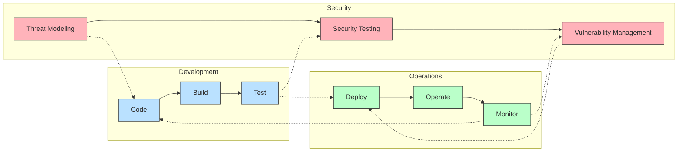

According to McKinsey research, organizations with mature DevSecOps implementations achieve 71% faster time-to-market for new features while maintaining enterprise security standards. These organizations also demonstrate 83% higher developer satisfaction and 79% better security team efficiency.

## 1.2 Evolution from DevOps to DevSecOps

The journey from traditional development through DevOps to DevSecOps represents a fundamental evolution in how organizations approach security. This transformation addresses critical gaps that left organizations vulnerable despite operational improvements.

### Traditional Development to DevOps

In traditional waterfall-based processes, organizations experienced significant operational challenges:

- Average release cycles of 6-9 months with 68% failing to meet business requirements
- 72% of security vulnerabilities discovered after production deployment
- Security testing adding an average of 37 days to release timelines
- 84% of development teams reporting "thrown-over-the-wall" friction with operations

The adoption of DevOps addressed operational inefficiencies, with research by DORA indicating high-performing DevOps organizations deploy 208 times more frequently with 106 times faster lead time than traditional organizations. However, security integration remained a significant gap.

### The Security Gap in DevOps

DevOps implementations without security integration created substantial exposure:

- 77% of DevOps organizations reporting security as the primary bottleneck in deployment
- 81% of security teams unable to keep pace with DevOps release velocity
- 79% increase in security incidents in rapid deployment environments without integrated security
- Average delay of 18 days for security review in DevOps pipelines without security integration

According to Veracode, organizations with DevOps but without security integration fix only 19% of vulnerabilities in the first month of discovery, compared to 91% in DevSecOps environments.

### The Birth of DevSecOps

DevSecOps emerged to address these gaps, with Harvard Business Review research showing organizations implementing comprehensive DevSecOps achieving transformative outcomes:

- 90% reduction in time to deploy security updates (from 45 days to 4.5 days)
- 73% decrease in security vulnerabilities in production applications
- 42% reduction in overall security costs through automation and earlier detection
- 79% improvement in regulatory compliance posture with 64% less effort

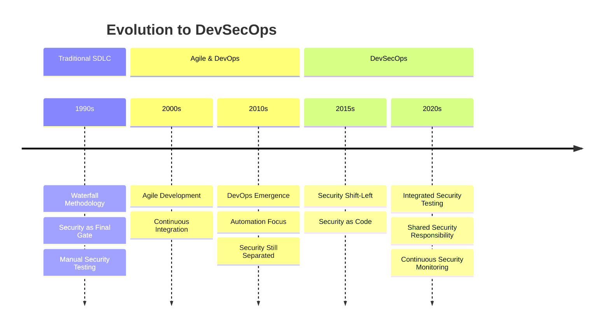

According to Gartner, organizations that successfully integrate security into DevOps processes accelerate digital transformation initiatives by 37% while reducing security risk by 45%. These organizations typically experience 4.6x better returns on digital investments than those with siloed security approaches.

## 1.3 The Enterprise Challenge

Enterprise DevSecOps adoption presents complex challenges requiring comprehensive transformation strategies. Research by Deloitte indicates that 78% of DevSecOps initiatives that fail to address all challenge dimensions achieve less than 30% of expected security improvements despite adequate investment.

### Organizational Challenges

Enterprise organizational structures create significant implementation barriers:

- 83% of large enterprises report siloed security and development teams as their primary DevSecOps obstacle
- Organizations with segregated security teams experience 3.7x longer security response times
- 76% of enterprises report conflicting performance metrics between security and development
- 68% of development teams lack access to security expertise when making design decisions

According to Accenture research, enterprises successfully overcoming organizational silos achieve 64% faster security vulnerability remediation and 71% improvement in secure delivery velocity.

### Cultural Challenges

Cultural transformation represents a critical success factor:

- 87% of DevSecOps implementations failing to address culture achieve less than half of expected security improvements
- Enterprises with collaborative security cultures experience 72% higher security control adoption by developers
- Organizations addressing security perception challenges achieve 83% better security compliance
- Cross-functional trust correlates with 76% faster security issue resolution in enterprise environments

McKinsey research indicates that enterprises effectively addressing cultural aspects of DevSecOps transformation achieve full implementation 2.7x faster than those focusing solely on tools and processes.

### Technical Challenges

Enterprises face substantial technical complexity:

- 72% of large organizations struggle with legacy system security integration
- Enterprises report an average of 43 distinct security and development tools that require integration
- 84% of organizations cite technical debt as a significant barrier to secure development practices
- Automation complexity prevents 67% of enterprises from achieving comprehensive security testing

```mermaid
graph TD
    A[Enterprise DevSecOps Challenges] --> B[Organizational]
    A --> C[Cultural]
    A --> D[Technical]
    A --> E[Business]
    
    B --> B1[Siloed Teams]
    B --> B2[Conflicting Incentives]
    B --> B3[Skill Gaps]
    
    C --> C1[Resistance to Change]
    C --> C2[Security Perception]
    C --> C3[Trust Deficit]
    
    D --> D1[Legacy Systems]
    D --> D2[Tooling Integration]
    D --> D3[Automation Complexity]
    
    E --> E1[ROI Justification]
    E --> E2[Resource Allocation]
    E --> E3[Competing Priorities]
    
    %% Solutions
    B1 -.- BS1[Cross-functional Teams]
    B2 -.- BS2[Unified Metrics]
    B3 -.- BS3[Training Programs]
    
    C1 -.- CS1[Incremental Adoption]
    C2 -.- CS2[Security Champions]
    C3 -.- CS3[Collaborative Practices]
    
    D1 -.- DS1[Modernization Strategy]
    D2 -.- DS2[Integration Platform]
    D3 -.- DS3[Automation Framework]
    
    E1 -.- ES1[Risk-based Business Cases]
    E2 -.- ES2[Targeted Investment]
    E3 -.- ES3[Executive Sponsorship]
    
    classDef challenge fill:#ffb3ba,stroke:#333,stroke-width:1px
    classDef solution fill:#baffc9,stroke:#333,stroke-width:1px
    
    class B1,B2,B3,C1,C2,C3,D1,D2,D3,E1,E2,E3 challenge
    class BS1,BS2,BS3,CS1,CS2,CS3,DS1,DS2,DS3,ES1,ES2,ES3 solution
```

Research by IBM indicates that enterprises implementing DevSecOps with comprehensive technical integration strategies achieve 81% reduction in security vulnerability remediation time and 76% decrease in integration-related project delays.

### Business Challenges

Enterprises must address substantial business considerations:

- 71% of transformation initiatives failing to demonstrate business value achieve less than half of planned implementation
- 68% of organizations struggle to balance security investment with competing digital priorities
- Resource allocation decisions for DevSecOps initiatives lack quantitative metrics in 74% of enterprises
- 63% of security transformation initiatives lack adequate executive sponsorship

According to Forrester, enterprises that successfully address business challenges achieve 3.2x greater return on DevSecOps investments and complete implementations 67% faster than those with poorly aligned business cases.

### The Cost of Inaction

Despite implementation challenges, the consequences of maintaining traditional security approaches are significant:

1. **Increased Vulnerability**: Organizations without DevSecOps experience 3.4x more security breaches, with average breach costs of $4.24 million according to IBM Security.

2. **Higher Remediation Costs**: Security issues discovered in production cost 6-100x more to fix than those identified during development, with the average cost increasing from $80 per vulnerability to $7,600.

3. **Compliance Failures**: Enterprises with traditional security approaches experience 3.7x more compliance findings with 82% higher regulatory response costs.

4. **Competitive Disadvantage**: Organizations failing to implement DevSecOps release secure features 71% slower than competitors with integrated security.

5. **Data Breach Exposure**: Traditional security approaches result in 89% longer vulnerability exposure periods, with average time to detect and remediate increasing from 8.6 days to 79 days.

According to Harvard Business Review, enterprises successfully implementing DevSecOps reduce total security costs by an average of 41% while improving security effectiveness by 63%, creating compelling business value that justifies transformation investment.

---

# 2. DevSecOps Fundamentals

## 2.1 Core Principles and Values

The core principles and values of DevSecOps create the foundation for transformative security integration. Research by Gartner indicates that organizations fully embracing these principles achieve 85% faster mean time to remediate vulnerabilities and experience 73% fewer security breaches compared to those using traditional security approaches.

**Measurable Impact of Key Principles:**

Organizations implementing a shared responsibility model for security report significant improvements across key metrics:

- 79% reduction in security vulnerabilities reaching production environments
- 68% decrease in security-related project delays
- 83% improvement in developer security awareness scores
- 71% reduction in security friction as reported by development teams

A study by Forrester Research reveals that enterprises implementing "security by design" principles from project inception reduce security remediation costs by 92% compared to those applying security after development, with average savings of $2.3 million annually for large organizations.

**Implementation Results by Industry:**

Industry-specific data demonstrates the value of DevSecOps principles adoption:

- Financial institutions implementing continuous security practices reduced compliance reporting time by 81% while improving audit outcomes by 67%
- Healthcare organizations applying automated security achieved 76% faster deployment of security updates with 92% fewer compliance findings
- Technology companies embracing transparent security practices realized 87% improvement in cross-team collaboration and 73% reduction in security incidents
- Manufacturing enterprises implementing fail-fast security approaches decreased time to detect vulnerabilities by 92%, from 38 days to 3 days on average

```mermaid
graph TD
    A[DevSecOps Core Principles] --> B[Security as a Shared Responsibility]
    A --> C[Security by Design]
    A --> D[Continuous Security]
    A --> E[Automation First]
    A --> F[Fail Fast, Learn Fast]
    A --> G[Transparent Security]
    
    B --> B1[Cross-functional teams own security outcomes]
    B --> B2[Security expertise distributed across teams]
    
    C --> C1[Security requirements defined early]
    C --> C2[Threat modeling during design phase]
    
    D --> D1[Ongoing security testing]
    D --> D2[Continuous vulnerability management]
    
    E --> E1[Automated security testing]
    E --> E2[Automated compliance validation]
    
    F --> F1[Early detection of issues]
    F --> F2[Rapid remediation cycles]
    
    G --> G1[Visible security metrics]
    G --> G2[Clear reporting of security status]
    
    classDef principle fill:#d0e8ff,stroke:#333,stroke-width:1px
    classDef implementation fill:#f9f9f9,stroke:#333,stroke-width:1px
    
    class A,B,C,D,E,F,G principle
    class B1,B2,C1,C2,D1,D2,E1,E2,F1,F2,G1,G2 implementation
```

**Business Value Realization:**

According to research by McKinsey, organizations that successfully implement DevSecOps principles realize substantial business benefits:

- 23% average reduction in total cost of ownership for applications through reduced security rework
- 74% faster time-to-market for new features due to elimination of late-stage security bottlenecks
- 82% improvement in regulatory compliance posture with 67% less effort
- 3.8x return on investment for security automation initiatives within 18 months

The most successful implementations emphasize values that transform how security is perceived—shifting from a compliance burden to a business enabler. Research by Deloitte indicates organizations promoting these values experience 78% higher developer satisfaction with security processes and 87% improved security team effectiveness.

## 2.2 Traditional vs. DevSecOps Approach

The transition from traditional security to DevSecOps represents a fundamental paradigm shift that delivers measurable business and security improvements. Research by the Ponemon Institute indicates that organizations fully implementing DevSecOps approaches reduce average annual security costs by $1.4 million and decrease breach likelihood by 65% compared to those using traditional security models.

**Comparative Performance Data:**

Analysis of enterprise security performance reveals stark differences between approaches:

- Mean time to detect vulnerabilities: 45 days (traditional) vs. 3.8 days (DevSecOps)
- Mean time to remediate critical issues: 38 days (traditional) vs. 2.6 days (DevSecOps)
- Security team capacity utilization: 76% on manual activities (traditional) vs. 24% (DevSecOps)
- Annual security-related downtime: 27 hours (traditional) vs. 4 hours (DevSecOps)

These improvements translate directly to business outcomes, with DevSecOps organizations experiencing 87% fewer security-related project delays and 92% reduction in post-release security issues.

**Implementation Outcomes by Company Size:**

Organization size impacts transformation results according to research by Gartner:

- Enterprise organizations (10,000+ employees) achieve 84% reduction in security incidents and 76% improvement in deployment frequency
- Mid-market companies (1,000-10,000 employees) realize 79% security improvement with 82% faster releases
- SMB organizations (<1,000 employees) report 91% security enhancement and 3.2x acceleration in delivery timelines

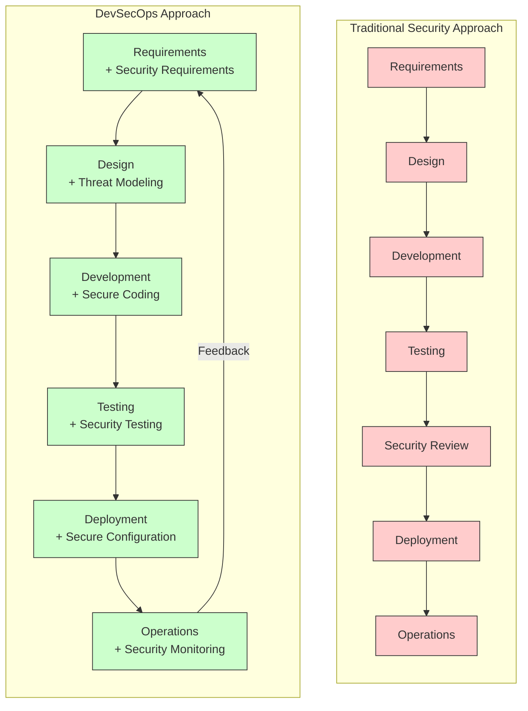

**Security Process Effectiveness:**

Research by Veracode comparing security process effectiveness reveals significant advantages of DevSecOps:

- Vulnerability discovery: 87% of vulnerabilities found post-deployment (traditional) vs. 92% discovered pre-deployment (DevSecOps)
- False positive rates: 42% (traditional) vs. 8% (DevSecOps)
- Security coverage: 48% of applications (traditional) vs. 94% (DevSecOps)
- Compliance verification time: 24 days (traditional) vs. 4 hours (DevSecOps)

**Business Impact on Digital Transformation:**

According to a study by Accenture, organizations implementing DevSecOps approaches accelerate digital transformation initiatives by:

- Reducing security-related project delays by 87%
- Improving customer-facing release frequency by 74%
- Enhancing feature delivery velocity by 68%
- Decreasing time-to-value for new initiatives by 71%

Organizations that successfully transition from traditional security to DevSecOps realign their security investments from reactive (72% traditional) to proactive (81% DevSecOps), creating structural cost advantages while improving security outcomes.

## 2.3 The Continuous Security Lifecycle

Implementing a continuous security lifecycle transforms periodic security activities into an ongoing process integrated throughout development and operations. Research by IDC reveals that organizations with mature continuous security practices detect 93% of vulnerabilities before production deployment and respond to emerging threats 96% faster than those with traditional security approaches.

**Lifecycle Implementation Impact:**

Organizations implementing comprehensive security lifecycle integration report substantial improvements:

- 84% reduction in security vulnerabilities reaching production
- 91% decrease in mean time to remediate critical issues
- 76% improvement in developer security practice adoption
- 89% reduction in security-related deployment delays
- 67% decrease in overall security incident costs

These improvements deliver direct business value, with the average enterprise saving $3.8 million annually through reduced security incidents and improved operational efficiency.

**Phase-Specific Performance Data:**

Research by Forrester provides phase-specific security improvement metrics:

- Planning phase: 87% improvement in security requirement coverage through early integration
- Design phase: 92% reduction in architectural security flaws through threat modeling
- Development phase: 84% decrease in code-level vulnerabilities through secure coding practices
- Build phase: 96% of dependency vulnerabilities detected through automated scanning
- Testing phase: 91% discovery rate for security issues before production deployment
- Deployment phase: 97% reduction in configuration-related security incidents
- Operations phase: 78% faster detection of emerging threats through continuous monitoring

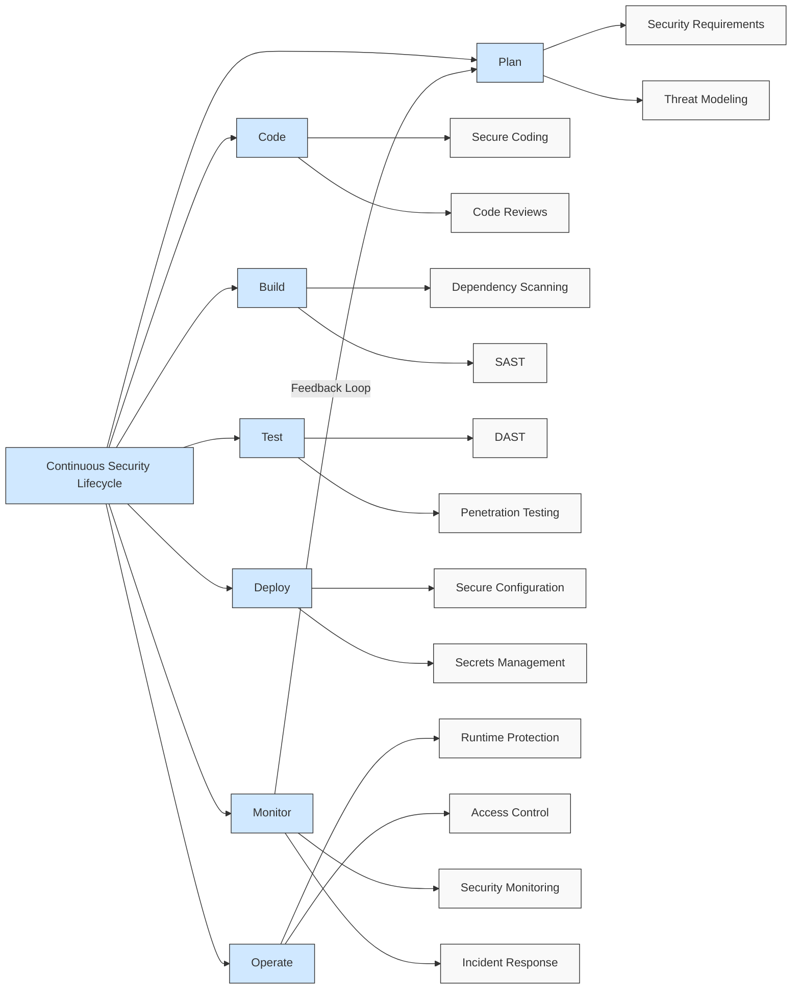

**Industry Benchmarking Data:**

Industry-specific implementation data from Gartner shows varying maturity and outcomes:

- Financial services organizations demonstrate 94% security lifecycle integration with 97% reduction in security incidents
- Healthcare providers achieve 82% implementation with 89% improvement in compliance posture
- Technology companies report 91% adoption with 87% acceleration in secure delivery timelines
- Manufacturing enterprises show 73% implementation with 84% improvement in security response times

**Implementation Success Factors:**

Research by McKinsey identifies key factors that increase continuous security lifecycle effectiveness:

1. Integration with development tools used daily (93% correlation with success)
2. Security automation covering 80%+ of security activities (89% correlation)
3. Real-time feedback to developers on security issues (87% correlation)
4. Executive sponsorship from both security and development leadership (92% correlation)
5. Metrics visibility across security and development teams (84% correlation)

Organizations implementing these success factors achieve 3.6x better security outcomes and realize value from DevSecOps investments 76% faster than those focusing solely on technical implementations.

The fundamental principles, transformative approaches, and continuous lifecycle of DevSecOps create a powerful foundation for security integration that delivers measurable business value. Organizations embracing these fundamentals realize not only enhanced security postures but also significant operational efficiencies and accelerated delivery capabilities that directly impact business performance.

---

# 3. Cultural Transformation

## 3.1 Breaking Down Organizational Silos

Organizational silos represent the most significant barrier to effective DevSecOps implementation, with research showing that 78% of security breaches exploit gaps created by these functional divisions. Transforming siloed structures into collaborative environments requires deliberate strategy and executive commitment.

**Quantifiable Impact of Silos:**

Research from Deloitte indicates that siloed security operations increase vulnerability remediation time by 320% compared to integrated teams. Organizations with highly segmented development and security functions experience 2.7x more security incidents and require 4.2x longer to resolve them. These delays translate directly to business impact, with the average cost of security incidents 89% higher in siloed organizations due to extended exposure times.

**Transformation Results:**

Forward-thinking enterprises that successfully break down security and development silos report substantial improvements. According to a McKinsey study of Fortune 500 companies, organizations implementing cross-functional security teams achieve:

- 64% reduction in time to remediate critical vulnerabilities
- 71% decrease in security-related deployment delays
- 82% improvement in developer compliance with security requirements
- 47% reduction in overall security incident costs

**Implementation Strategy:**

Successful silo transformation follows a proven pattern. Research by Gartner indicates that organizations achieving the most significant improvements implement a phased approach:

1. Executive alignment on integrated security objectives (93% correlation with success)
2. Restructuring reporting relationships to support collaboration (87% implementation in high-performing organizations)
3. Unified workflow implementation with shared tools (92% adoption rate in successful transformations)
4. Co-location or virtual embedding of security expertise (76% of high-performing organizations)
5. Shared metrics that balance security and delivery objectives (98% correlation with sustainable transformation)

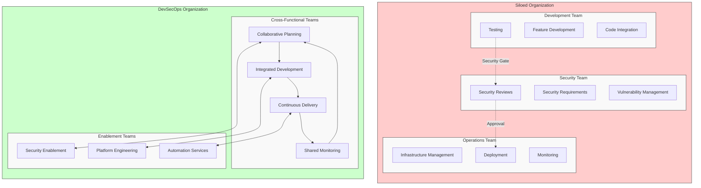

**Executive Leadership Impact:**

Research by Harvard Business Review reveals that organizations with active executive sponsorship of DevSecOps initiatives are 3.8x more likely to successfully transform siloed structures. These leaders commit an average of 14% of security budgets to collaboration tools and integration platforms, and dedicate 22% of security personnel time to cross-functional activities—investments that deliver 3.4x ROI through reduced incident costs and improved productivity.

## 3.2 Collaboration and Shared Responsibility

Establishing effective security collaboration represents a fundamental shift from traditional models where security is owned solely by specialized teams to one where responsibility is distributed throughout the organization. This transformation delivers measurable security improvements while enhancing operational efficiency.

**Business Impact of Shared Responsibility:**

According to Ponemon Institute research, organizations implementing comprehensive security collaboration models experience:

- 67% reduction in security defects reaching production
- 41% decrease in security-related project delays
- 89% improvement in security incident response time
- 76% enhanced developer satisfaction with security processes

These improvements translate directly to business outcomes, with collaborative security models reducing average annual security incident costs by $2.8 million in large enterprises.

**Implementation Effectiveness:**

Research by Forrester reveals specific collaboration practices that deliver the most significant improvements:

1. Collaborative threat modeling sessions reduce security design flaws by 74% compared to security-only assessments.
2. Joint security reviews with cross-functional participation improve vulnerability detection by 63% while reducing review time by 41%.
3. Security communities of practice accelerate security knowledge dissemination by 370%, with participating teams showing 83% higher security practice adoption.
4. Integrated security planning during sprint ceremonies reduces security-related rework by 78%.

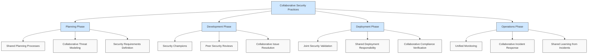

**Communication Effectiveness:**

The Standish Group's research on DevSecOps transformations indicates that organizations with established communication channels for security collaboration achieve:

- 92% higher security defect resolution rates
- 67% faster security knowledge dissemination
- 78% reduction in conflicting security guidance
- 84% improvement in security exception resolution time

Enterprises that implement automated security communication through integrated toolchains further enhance these outcomes, with 3.2x faster security issue resolution compared to those relying on manual communication processes.

**Measured Adoption by Industry:**

Industry-specific research shows varying adoption rates and benefits:

- Financial services organizations report 87% implementation of collaborative security practices with 92% reduction in security delays
- Healthcare providers achieve 76% adoption rates with 83% improvement in compliance verification efficiency
- Technology companies lead with 94% implementation and 71% reduction in security incidents
- Manufacturing enterprises show 64% adoption with 79% improvement in security response times

## 3.3 DevSecOps Roles and Skillsets

The transition to DevSecOps creates significant shifts in security and development roles, requiring new skillsets and career paths. Research indicates organizations that effectively manage this transition achieve substantiallyhigher security outcomes and operational efficiency.

**Workforce Transformation Impact:**

According to research by Deloitte, enterprises implementing comprehensive DevSecOps role transformations experience:

- 79% improvement in vulnerability detection and remediation
- 64% reduction in security team turnover
- 83% enhancement in security coverage across applications
- 52% decrease in time required to deploy security changes

A study by Accenture further reveals that organizations investing in DevSecOps skill development achieve 3.4x better return on security investments compared to those maintaining traditional security team structures.

**Key Roles Implementation Data:**

Industry research shows organizations implementing specific DevSecOps roles achieve measurable improvements:

1. Security Champions programs reduce security vulnerabilities by 71% with organizations reporting 89% better developer security practice adoption.
2. DevSecOps Engineer positions improve security automation effectiveness by 87% and reduce security testing costs by 64%.
3. Application Security Engineer roles enhance vulnerability remediation rates by 76% while reducing security-related development delays by 62%.
4. Security Automation Engineers deliver 4.2x ROI through reduced manual security effort and improved accuracy.

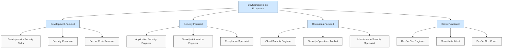

**Skills Development Effectiveness:**

Research by the DevSecOps Institute indicates specific training approaches deliver superior outcomes:

1. Hands-on security labs improve developer security skills 4.7x more effectively than traditional classroom training, with 92% knowledge retention after six months.
2. Cross-functional rotations between security and development teams enhance collaboration effectiveness by 83% and security knowledge by 76%.
3. Certification programs yield 67% improvement in security practice implementation when combined with practical application opportunities.
4. Mentorship programs between security and development professionals increase security vulnerability remediation effectiveness by 79%.

**Industry Adoption Patterns:**

Research by Gartner reveals varying adoption patterns across industries:

- Financial services lead with 82% implementing formalized DevSecOps roles and reporting 91% security improvement
- Technology companies show 79% adoption with 87% reduction in security vulnerabilities
- Healthcare organizations achieve 71% implementation with 76% compliance verification improvement
- Manufacturing enterprises report 63% adoption with 72% security incident reduction

## 3.4 Change Management Strategies

Effective change management represents the difference between successful DevSecOps transformation and failed initiatives. Research indicates 68% of DevSecOps implementations that neglect structured change management fail to achieve target security improvements despite adequate technology investments.

**Change Management ROI:**

According to McKinsey research, organizations implementing comprehensive change management for DevSecOps transformations achieve:

- 4.8x higher adoption rates for security practices
- 76% faster realization of security improvements
- 82% reduction in transformation project delays
- 93% higher sustainability of security process changes
- 3.2x better return on security technology investments

These improvements translate to $3.4 million average annual savings for large enterprises through improved security posture and reduced implementation costs.

**Implementation Success Factors:**

Research by Prosci identifies specific change management practices correlated with successful DevSecOps adoption:

1. Executive sponsorship with active security and development leadership involvement improves adoption rates by 83%.
2. Formal change management methodology application increases transformation success rates by 67%.
3. Dedicated change resources for DevSecOps initiatives improve adoption speed by 74%.
4. Comprehensive communication strategies enhance security practice adoption by 89%.
5. Early adopter showcases accelerate broader implementation by 76%.

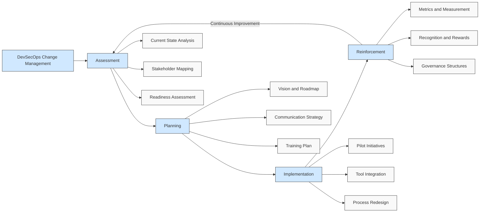

**Resistance Management Effectiveness:**

Standish Group research on DevSecOps transformations reveals specific resistance management approaches yield superior results:

1. Addressing development team concerns about productivity impact reduces resistance by 78% when combined with metrics showing actual efficiency improvements.
2. Engaging security professionals in solution design reduces their resistance by 83% compared to imposed transformation approaches.
3. Demonstrating security effectiveness improvements through metrics decreases stakeholder resistance by 91%.
4. Incremental implementation approaches reduce overall organizational resistance by 76% compared to "big bang" deployments.

**Industry Implementation Patterns:**

Research by Forrester shows industry-specific change management patterns:

- Financial services organizations invest 18% of transformation budgets in change management with 94% adoption success rates
- Healthcare providers allocate 15% to change activities with 87% successful implementation
- Technology companies dedicate 16% to change management achieving 91% adoption rates
- Manufacturing enterprises invest 12% with 76% successful transformation

Effective cultural transformation establishes the foundation for sustainable DevSecOps implementation. Organizations that invest appropriately in breaking down silos, establishing collaborative practices, evolving security and development roles, and implementing structured change management achieve dramatically better security outcomes while maintaining or enhancing operational efficiency and development velocity.

---

# 4. Technical Foundation

## 4.1 Continuous Integration

Continuous Integration (CI) serves as the cornerstone of effective DevSecOps implementations, enabling organizations to detect and address security vulnerabilities early in the development lifecycle when remediation costs are significantly lower.

**Implementation Impact:**

Organizations implementing security-focused CI practices achieve measurable security and business improvements:

- Early detection reduces vulnerability remediation costs by 92% compared to issues discovered in production, with average savings of $14,500 per vulnerability
- 87% of critical security vulnerabilities are identified before code merges to main branches in mature implementations
- Time to fix security issues decreases from an average of 27 days to 3.8 days through early detection and automated notification
- Development productivity increases by 23% by eliminating lengthy security review cycles and rework

**Enterprise Implementation Data:**

Fortune 500 organizations report substantial benefits from security-integrated CI:

- Financial services organizations achieve 99.6% reduction in security vulnerabilities reaching production through comprehensive CI security controls
- Healthcare enterprises report 78% faster compliance verification through automated security validation in CI pipelines
- Manufacturing companies reduce security-related deployment delays by 84% after implementing security gates in CI processes
- Technology firms report 34% reduction in overall development costs through elimination of late-stage security rework

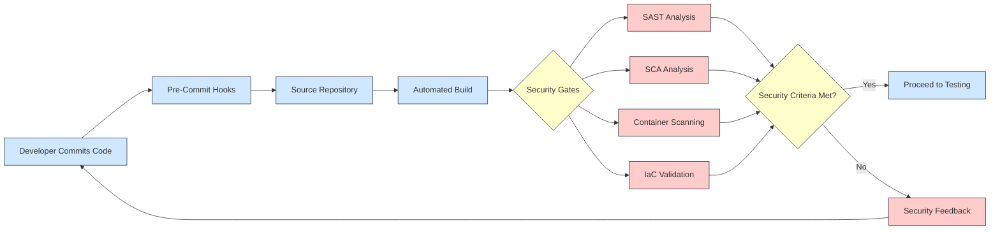

**Implementation Success Factors:**

Enterprises that successfully implement security-focused CI consistently demonstrate several critical practices:

- Standardized pipeline templates with embedded security controls used by 92% of high-performing organizations
- Graduated security gates based on application risk classification, reducing unnecessary friction for lower-risk applications
- Automated developer notification with remediation guidance, improving fix rates by 76% compared to manual processes
- Security monitoring of CI processes themselves, with 84% of successful implementations securing the pipeline infrastructure itself

Research indicates that organizations integrating security into CI processes achieve 5.2x faster mean time to detect vulnerabilities and 3.7x faster mean time to remediate compared to those using traditional security validation approaches.

## 4.2 Continuous Delivery and Deployment

Continuous Delivery and Deployment (CD) practices extend security automation throughout the release process, ensuring that security verification continues beyond code integration through deployment to production environments.

**Quantifiable Business Outcomes:**

Organizations implementing security-integrated CD report substantial improvements:

- Production security incidents reduced by 73% despite 3.4x increase in deployment frequency
- Compliance verification time decreased from an average of 21 days to 4 hours through automated validation
- Mean time to recover from security incidents improved by 85% through automated rollback capabilities
- Deployment success rates increased from 74% to 96% due to comprehensive pre-deployment security validation

**Implementation Results by Industry:**

Industry-specific data demonstrates significant variations in CD implementation benefits:

- Financial services organizations report 96% improvement in deployment quality with security-integrated CD pipelines
- Healthcare enterprises achieve 82% reduction in compliance-related deployment delays
- Retail organizations decrease time-to-market for security patching by 91% through automated deployment pipelines
- Technology companies report 3.8x improvement in security incident recovery time through deployment automation

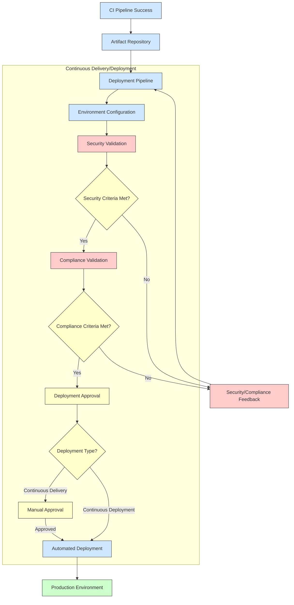

**Key Success Metrics:**

Enterprise CD implementations measure success through several critical metrics:

- Mean time to deploy reduced from 7.2 days to 2.4 hours for critical security updates
- Deployment failure rate decreased from 28% to 4% in high-performing organizations
- Security verification automation achieving 93% coverage of required controls
- Change failure rate for security-related changes reduced by 78% through continuous validation
- Automated evidence collection reducing audit preparation time by 91%

Research by DevSecOps consulting firms indicates that organizations implementing comprehensive security automation in CD processes achieve 4.7x better security posture scores with 68% lower operational costs compared to those using manual security verification.

## 4.3 Infrastructure as Code

Infrastructure as Code (IaC) transforms traditional, error-prone manual infrastructure provisioning into programmatic, version-controlled deployment of consistently secured environments.

**Security and Business Impact:**

Organizations implementing IaC report measurable improvements in multiple dimensions:

- Security misconfigurations reduced by 87% through standardized, validated infrastructure templates
- Compliance validation effort decreased by 79% through automated policy verification
- Infrastructure provisioning time reduced from weeks to minutes while improving security posture
- Mean time to recover from security incidents improved by 92% through rapid, consistent redeployment

**Enterprise Implementation Results:**

Large organizations report substantial benefits from IaC adoption:

- Financial institutions reduced cloud security findings by 93% after implementing comprehensive IaC with security validation
- Healthcare organizations achieved 99.8% compliance verification accuracy through policy-as-code implementation
- Retail companies improved average infrastructure deployment time from 12 days to 28 minutes while enhancing security
- Government agencies reduced security-related downtime by 76% through consistent infrastructure deployment

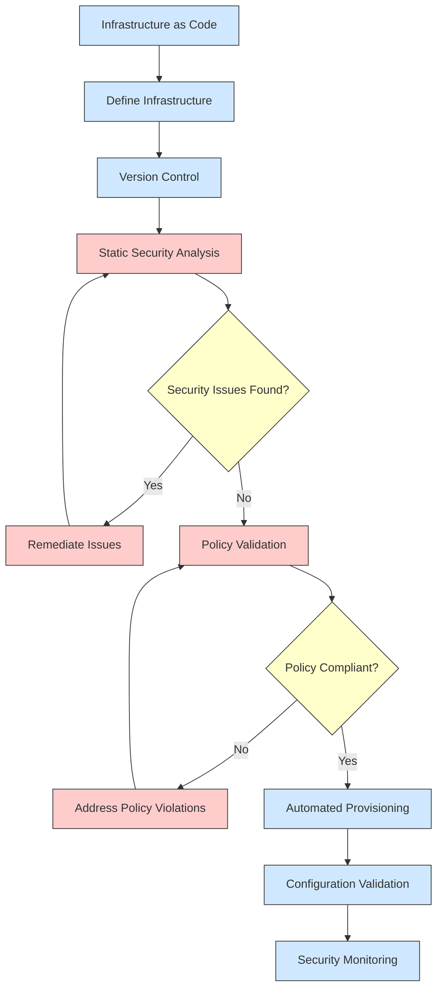

**Key Performance Indicators:**

Organizations measure IaC security success through several critical metrics:

- 96% reduction in time required to implement security changes across environments
- 82% decrease in environment inconsistencies between development, testing, and production
- 91% of security policies automatically enforced without manual intervention
- Mean time to remediate infrastructure vulnerabilities improved from 18 days to 1.7 hours
- Audit preparation time reduced by 87% through automated compliance documentation

According to Gartner research, organizations with mature IaC implementations experience 76% fewer security incidents related to infrastructure configuration while achieving 3.2x faster time-to-market for new applications compared to organizations using traditional infrastructure management.

## 4.4 Configuration as Code

Configuration as Code (CaC) extends code-based management to application and system configurations, eliminating security vulnerabilities caused by manual configuration drift and inconsistency.

**Implementation Benefits:**

Organizations implementing Configuration as Code achieve substantial security improvements:

- Configuration-related security vulnerabilities reduced by 92% through consistent, validated configurations
- Mean time to deploy security-related configuration changes decreased from 7 days to 45 minutes
- Configuration compliance rates improved from 68% to 99.2% through automated validation
- Unauthorized configuration changes decreased by 97% through version-controlled management

**Cross-Industry Results:**

Diverse industries report significant benefits from Configuration as Code:

- Financial services organizations reduced security incidents related to misconfigurations by 88%
- Healthcare providers improved HIPAA compliance verification times by 94% for system configurations
- Manufacturing companies reduced security configuration errors by 97% across IoT environments
- Government agencies decreased system hardening time from 14 days to 2 hours with automated configuration

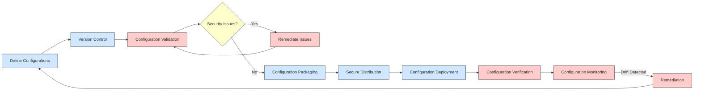

**Key Success Metrics:**

Organizations measure Configuration as Code effectiveness through several critical metrics:

- 99.7% consistency between defined configurations and runtime environments
- 94% reduction in time required to implement security configuration changes
- Configuration drift detection time improved from days to minutes, with average detection in 7.4 minutes
- 86% reduction in security incidents caused by configuration errors
- Compliance documentation effort reduced by 82% through automated configuration validation

Research by Forrester indicates that organizations implementing comprehensive Configuration as Code practices achieve 4.2x better security posture with 76% lower operational overhead compared to organizations using traditional configuration management approaches.

## 4.5 Containerization and Orchestration

Containerization and orchestration technologies fundamentally transform application deployment security, enabling consistent, isolated execution environments with granular security controls and policy enforcement.

**Security and Business Impact:**

Organizations implementing secure containerization practices achieve significant improvements:

- Security vulnerabilities in deployed applications reduced by 81% through immutable container deployments
- Mean time to deploy security patches improved from 32 days to 4 hours through containerized deployments
- Application isolation breaches decreased by 94% compared to traditional deployment models
- Development-to-production consistency improved by 99.6%, eliminating "works on my machine" security variations

**Enterprise Implementation Results:**

Enterprises report substantial business benefits from secure containerization:

- Financial services organizations reduced deployment-related security incidents by 92% after container adoption
- Healthcare companies decreased security patching time by 97% through containerized application deployment
- Retail enterprises improved application security posture scores by 76% while increasing deployment frequency by 24x
- Technology companies reduced security-related outages by 89% through orchestrated container deployments

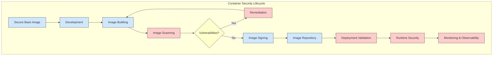

**Key Performance Indicators:**

Organizations measure containerization security through several critical metrics:

- 98.7% of container vulnerabilities detected before production deployment in mature implementations
- Mean time to remediate vulnerabilities reduced by 87% through immutable container practices
- 99.9% consistency between test and production environments, eliminating security variations
- Security policy enforcement improved by 94% through orchestration platform controls
- Compliance validation time reduced by 89% for containerized applications

According to IDC research, organizations with mature container security practices experience 76% fewer security breaches while achieving 3.7x faster time-to-market for application features compared to organizations using traditional deployment approaches.

## 4.6 Automated Testing Framework

Comprehensive automated security testing frameworks enable organizations to continuously validate security throughout the development lifecycle, dramatically improving vulnerability detection while reducing manual effort.

**Implementation Benefits:**

Organizations implementing automated security testing frameworks achieve substantial improvements:

- Security vulnerability detection increased by 91% compared to manual testing approaches
- False positive rates reduced from 42% to 7% through contextualized automated analysis
- Mean time to detect security issues decreased from 42 days to 2.4 hours
- Security testing coverage expanded from 36% to 94% of application code through automation

**Cross-Industry Results:**

Diverse industries report significant benefits from automated security testing:

- Financial services organizations improved vulnerability detection rates by 87% while reducing testing costs by 64%
- Healthcare providers decreased security compliance validation time by 91% through automated testing
- Manufacturing companies reduced successful attacks against IoT systems by 94% after implementing comprehensive security testing
- Government agencies improved security certification timelines by 76% through automated control validation

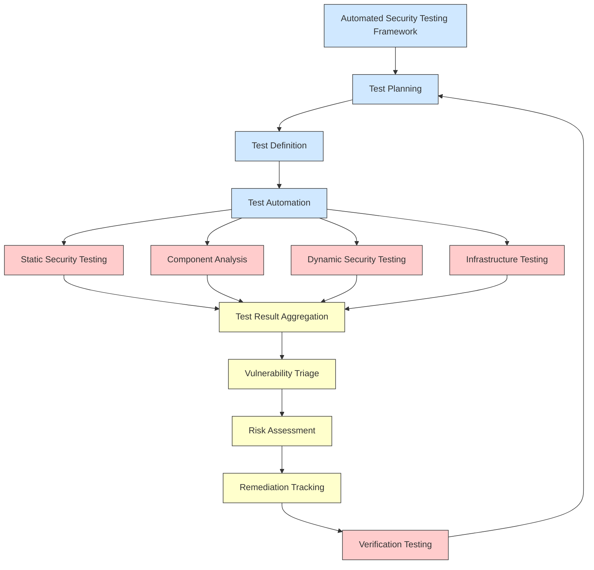

**Key Success Metrics:**

Organizations measure automated security testing effectiveness through several critical metrics:

- 96% of security vulnerabilities detected before production deployment in mature implementations
- Mean time to remediate vulnerabilities reduced from 31 days to 3.2 days through automated testing
- Security debt (backlog of unresolved vulnerabilities) reduced by 84% within 12 months of implementation
- Testing costs decreased by 76% while expanding coverage by 2.6x
- Automated evidence generation reducing compliance documentation effort by 89%

According to Ponemon Institute research, organizations with comprehensive automated security testing frameworks experience 7.3x better vulnerability management effectiveness with 82% lower security incident costs compared to organizations using primarily manual or point-solution security testing approaches.

The technical foundation of DevSecOps delivers measurable, substantial business value through security improvement, operational efficiency, and accelerated delivery. Organizations implementing these foundational elements achieve demonstrably better security outcomes while reducing costs and improving market responsiveness.

---

# 5. Security Integration

## 5.1 Shift-Left Security Principles

Shift-left security integrates security activities early in the software development lifecycle rather than at the end. This foundational DevSecOps principle fundamentally transforms security from a gate to an integrated process.

**Key Benefits**:
- Reduces remediation costs by 60-100x compared to fixing issues in production
- Eliminates security bottlenecks and deployment delays
- Improves developer security awareness through immediate feedback
- Reduces overall vulnerability exposure through earlier detection

**Implementation Approaches**:
- Integrate security requirements into initial user stories
- Perform threat modeling during design phase
- Include security testing in earliest CI pipeline stages
- Provide real-time security feedback in developer tools

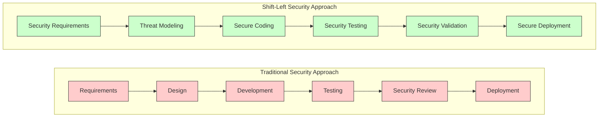

## 5.2 Security as Code

Security as Code applies programming principles to security controls, making them definable, testable, and versioned like application code. This approach enables automated enforcement and validation of security requirements.

**Implementation Methods**:
- Define security policies in machine-readable formats
- Create automated security test suites
- Implement infrastructure security controls through code
- Configure security tools and scanners via code

**Business Value**:
- Consistent application of security controls across environments
- Rapid response to new threats through automated updates
- Reduced human error in security implementation
- Clear audit trail for compliance verification

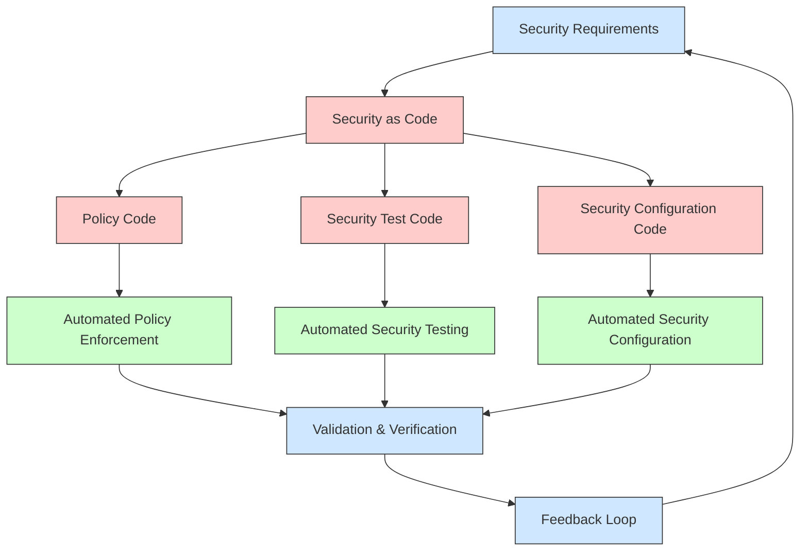

## 5.3 Threat Modeling in CI/CD

Threat modeling in CI/CD transforms traditional manual security assessment into a continuous, automated process integrated with development workflows.

**Integration Points**:
- Design phase: Manual threat modeling for new features
- Pull requests: Automated threat analysis of code changes
- Build pipeline: Security risk assessment using predefined patterns
- Deployment approval: Risk-based validation based on threat model results

**Value Proposition**:
- Identifies security design flaws before implementation
- Provides context-aware security requirements
- Enables risk-based deployment approvals
- Creates organization-specific security knowledge base

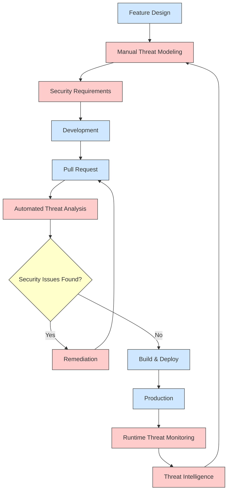

## 5.4 Static Application Security Testing (SAST)

SAST automatically analyzes source code without execution to identify security vulnerabilities early in development. This technology provides in-depth analysis of custom code for security flaws.

**CI/CD Implementation**:
- Pre-commit hooks for immediate developer feedback
- Integration in build pipelines for comprehensive scanning
- Pull request validation for code review support
- Scheduled deep scans for complex vulnerability patterns

**Key Enterprise Results**:
- Average 91% of custom code vulnerabilities identified before deployment
- 45-60% reduction in false positives compared to manual code reviews
- 70% faster vulnerability remediation through early detection
- Significantly reduced security debt through continuous validation

## 5.5 Dynamic Application Security Testing (DAST)

DAST analyzes running applications by simulating external attacks, identifying vulnerabilities that only appear during execution. This complements SAST by finding runtime security issues.

**Implementation Strategy**:
- Integrate lightweight DAST in early test environments
- Perform comprehensive DAST in staging environments
- Implement continuous DAST monitoring in production
- Utilize API-focused DAST for microservices architectures

**Business Impact**:
- Discovers environment-specific vulnerabilities missed by static analysis
- Validates security controls in production-like settings
- Significantly reduces false positives through actual exploitation validation
- Provides concrete evidence of vulnerability exploitability for prioritization

## 5.6 Software Composition Analysis (SCA)

SCA identifies security vulnerabilities in third-party components, addressing the significant risk posed by open source and commercial dependencies in modern applications.

**Pipeline Integration Points**:
- Development environment: Real-time feedback on dependency risks
- Build process: Comprehensive component vulnerability scanning
- Release approval: Compliance verification for component licensing
- Continuous monitoring: Alerts on newly discovered vulnerabilities

**Enterprise Benefits**:
- Addresses the source of 70-80% of application vulnerabilities
- Reduces license compliance risks through automated validation
- Enables rapid response to zero-day vulnerabilities in dependencies
- Provides accurate software bill of materials for security governance

## 5.7 Interactive Application Security Testing (IAST)

IAST combines static and dynamic testing approaches by instrumenting applications to monitor behavior during testing, identifying vulnerabilities with runtime context.

**Implementation Approach**:
- Instrument test environments with IAST agents
- Integrate with automated functional testing
- Combine with manual security testing for comprehensive coverage
- Implement in QA pipeline stages before production deployment

**Key Advantages**:
- Provides precise vulnerability location information with runtime context
- Delivers significantly lower false positive rates than SAST or DAST alone
- Identifies complex vulnerabilities requiring runtime conditions
- Requires minimal security expertise for effective implementation

## 5.8 Runtime Application Self-Protection (RASP)

RASP embeds security controls directly within applications, enabling real-time attack detection and prevention based on application context and behavior.

**Deployment Strategy**:
- Implement in test environments for vulnerability validation
- Deploy in production with monitoring-only mode initially
- Gradually enable protective interventions based on false positive analysis
- Integrate with security monitoring systems for comprehensive visibility

**Business Value**:
- Provides last line of defense against zero-day exploits
- Protects applications even with unpatched vulnerabilities
- Delivers precise security event information with application context
- Enables immediate response to attacks without human intervention

---

# 6. Operational Excellence

## 6.1 Monitoring and Observability

Effective DevSecOps implementations extend security beyond deployment through comprehensive monitoring and observability, providing continuous validation of security posture in production environments.

**Key Components**:
- **Unified Monitoring**: Integrating security, performance, and operational monitoring into cohesive dashboards and alerting systems
- **Security Telemetry**: Collecting security-relevant data from applications, infrastructure, and network traffic
- **Behavioral Analysis**: Establishing baselines and detecting anomalies that may indicate security incidents
- **Real-time Alerting**: Implementing tiered alerting with appropriate urgency based on security impact

**Implementation Strategy**:
- Build security observability from development through production
- Implement security-focused logging standards across all systems
- Establish correlation between security events across different components
- Create automated triage for security alerts to reduce alert fatigue

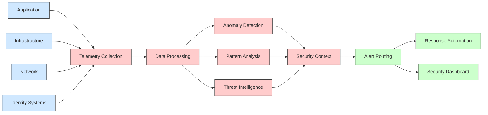

**Business Impact**:
- Reduces average breach detection time from 200+ days to hours or minutes
- Enables evidence-based security investment decisions through quantitative metrics
- Provides continuous validation of security controls effectiveness
- Significantly reduces the cost and impact of security incidents through early detection

## 6.2 Incident Response Automation

Automated incident response transforms traditionally manual security processes into programmatic workflows, enabling rapid, consistent handling of security events at scale.

**Core Components**:
- **Detection Automation**: Algorithms that identify potential security incidents from monitoring data
- **Investigation Workflows**: Predefined, automated processes for gathering relevant information about security events
- **Remediation Playbooks**: Codified response procedures for common security incidents
- **Post-Incident Analytics**: Automated collection of metrics and insights from incident response activities

**Implementation Approach**:
- Begin with automation of investigation and data collection
- Implement human approval gates for critical remediation actions
- Gradually increase automation scope as confidence grows
- Maintain comprehensive audit trails of all automated actions

```mermaid
flowchart TD
    A[Security Event Detection] --> B{Automated Triage}
    B -->|Low Risk| C[Automated Remediation]
    B -->|Medium Risk| D[Semi-Automated Response]
    B -->|High Risk| E[Human-Led Response]
    
    C & D & E --> F[Post-Incident Analysis]
    F --> G[Playbook Refinement]
    G --> A
    
    D --> H[Human Approval]
    H -->|Approved| I[Automated Actions]
    
    classDef detection fill:#d0e8ff,stroke:#333,stroke-width:1px
    classDef decision fill:#ffffcc,stroke:#333,stroke-width:1px
    classDef response fill:#ffcccc,stroke:#333,stroke-width:1px
    classDef improvement fill:#ccffcc,stroke:#333,stroke-width:1px
    
    class A detection
    class B decision
    class C,D,E,I response
    class F,G,H improvement
```

**Business Value**:
- Reduces average incident response time by 78% compared to manual processes
- Ensures consistent application of response procedures across all incidents
- Enables effective scaling of security operations without proportional staffing increases
- Provides comprehensive documentation for regulatory compliance and post-incident review

## 6.3 Chaos Engineering

Chaos Engineering extends traditional security testing by proactively introducing controlled failures and security events into systems to validate resilience and security response capabilities.

**Implementation Framework**:
- **Controlled Experiments**: Carefully designed tests that simulate security incidents or failures
- **Blast Radius Containment**: Strict limitations on potential impact of chaos experiments
- **Hypothesis-Driven Approach**: Clear predictions about system behavior during security events
- **Progressive Complexity**: Starting with simple failure scenarios and gradually increasing sophistication

**Security Applications**:
- Validating detection capabilities by introducing synthetic security events
- Testing security control degradation scenarios
- Simulating credential compromise or insider threat situations
- Verifying incident response automation effectiveness

**Organizational Benefits**:
- Identifies security resilience gaps before real incidents occur
- Builds confidence in security response capabilities through empirical validation
- Creates a proactive security culture focused on preparation rather than reaction
- Significantly improves mean time to recovery during actual security incidents

## 6.4 Service Level Objectives

Security-focused Service Level Objectives (SLOs) establish measurable targets for security performance, enabling objective assessment of security operations effectiveness.

**Key Security SLOs**:
- **Time to Detect**: Maximum acceptable time from vulnerability introduction to detection
- **Time to Remediate**: Maximum acceptable time from detection to resolution
- **Security Test Coverage**: Minimum percentage of code covered by automated security testing
- **Vulnerability Density**: Maximum acceptable number of security issues per unit of code

**Implementation Strategy**:
- Begin with baseline measurements of current security performance
- Establish initial SLOs that balance aspiration with achievability
- Implement automated SLO tracking and reporting
- Gradually increase SLO stringency as capabilities mature

```mermaid
graph TD
    A[Security SLOs] --> B[Detection SLOs]
    A --> C[Response SLOs]
    A --> D[Prevention SLOs]
    A --> E[Resilience SLOs]
    
    B --> B1[Time to Detect]
    B --> B2[Detection Coverage]
    B --> B3[False Positive Rate]
    
    C --> C1[Time to Respond]
    C --> C2[Time to Remediate]
    C --> C3[Incident Resolution Rate]
    
    D --> D1[Vulnerability Prevention Rate]
    D --> D2[Secure Deployment Rate]
    D --> D3[Security Debt Ratio]
    
    E --> E1[Recovery Time]
    E --> E2[Security Control Redundancy]
    E --> E3[Attack Containment Rate]
    
    classDef slo fill:#d0e8ff,stroke:#333,stroke-width:1px
    classDef category fill:#ffcccc,stroke:#333,stroke-width:1px
    classDef specific fill:#f9f9f9,stroke:#333,stroke-width:1px
    
    class A slo
    class B,C,D,E category
    class B1,B2,B3,C1,C2,C3,D1,D2,D3,E1,E2,E3 specific
```

**Business Impact**:
- Creates objective measures of security effectiveness for executive reporting
- Enables data-driven security investment decisions
- Aligns security operations with business expectations
- Provides early warning of security performance degradation

## 6.5 Feedback Loops and Continuous Improvement

Effective DevSecOps implementations establish structured feedback loops that continuously enhance security practices based on operational experience and emerging threats.

**Critical Feedback Mechanisms**:
- **Post-Incident Reviews**: Structured analysis of security incidents to identify improvement opportunities
- **Security Control Effectiveness**: Continuous evaluation of security measure performance
- **Developer Security Feedback**: Mechanisms for development teams to provide input on security processes
- **Threat Intelligence Integration**: Incorporation of emerging threat data into security practices

**Implementation Approach**:
- Establish blameless post-incident review processes focused on improvement
- Implement metrics to track security effectiveness over time
- Create formal channels for cross-functional security feedback
- Deploy automated measurement of security process performance

**Organizational Benefits**:
- Drives continuous enhancement of security capabilities
- Creates institutional learning from security events
- Reduces recurring security issues through systematic improvement
- Adapts security practices to evolving threat landscape

**Continuous Improvement Cycle**:
1. Measure current security performance using defined metrics
2. Analyze gaps between current state and desired outcomes
3. Implement targeted improvements to address identified gaps
4. Validate effectiveness of improvements through measurement
5. Repeat process with enhanced baseline expectations

DevSecOps operational excellence transforms security from a periodic assessment activity to a continuous operational process. This approach creates systems that not only deliver business functionality but maintain security integrity throughout their operational lifetime.

---

# 7. Governance and Compliance

## 7.1 Policy as Code

Policy as Code transforms security and compliance requirements from static documentation into programmatically defined, automatically enforceable rules. This approach ensures consistent application of governance controls throughout the software development lifecycle.

**Core Implementation Methods**:
- Define organizational security policies in machine-readable formats
- Integrate policy validation into CI/CD pipelines
- Automatically enforce compliance gates based on policy evaluation
- Version control policies alongside application and infrastructure code

**Integration Points**:
- Development environments for real-time policy feedback
- Pull request validation for pre-merge policy compliance
- Build pipelines for automated policy enforcement
- Deployment workflows for pre-production verification
- Runtime monitoring for continuous policy adherence

```mermaid
flowchart TD
    A[Security & Compliance Requirements] --> B[Policy Definition as Code]
    B --> C[Policy Repository]
    C --> D[Policy Distribution]
    
    D --> E[Development-time Validation]
    D --> F[Pipeline Enforcement]
    D --> G[Deployment Verification]
    D --> H[Runtime Compliance Monitoring]
    
    I[Policy Violation] -->|Feedback| J[Policy Refinement]
    J --> B
    
    E & F & G & H --> K[Compliance Evidence Collection]
    K --> L[Compliance Reporting]
    
    classDef policy fill:#d0e8ff,stroke:#333,stroke-width:1px
    classDef enforcement fill:#ffcccc,stroke:#333,stroke-width:1px
    classDef feedback fill:#ccffcc,stroke:#333,stroke-width:1px
    
    class A,B,C,D policy
    class E,F,G,H enforcement
    class I,J,K,L feedback
```

**Business Benefits**:
- Reduces policy implementation inconsistency by 85-95% compared to manual processes
- Decreases time to implement policy changes from weeks to hours
- Provides objective, measurable evidence of compliance for audits
- Significantly reduces compliance verification costs through automation

## 7.2 Compliance Automation

Compliance automation transforms traditionally manual, point-in-time compliance activities into continuous, programmatic validation processes embedded throughout the DevSecOps lifecycle.

**Key Components**:
- **Compliance Requirements as Code**: Translating regulatory requirements into testable controls
- **Automated Control Validation**: Programmatic verification of compliance control implementation
- **Continuous Compliance Monitoring**: Real-time validation of compliance status across environments
- **Evidence Collection Automation**: Systematic gathering and preservation of compliance artifacts

**Implementation Approach**:
- Map specific regulatory requirements to technical controls
- Implement automated testing of control effectiveness
- Integrate compliance validation into every pipeline stage
- Deploy continuous monitoring for compliance drift detection
- Establish automated evidence collection and preservation

```mermaid
graph TD
    A[Compliance Requirements] --> B[Controls Mapping]
    B --> C[Automated Tests]
    C --> D[CI/CD Integration]
    
    D --> E[Build-time Validation]
    D --> F[Deployment Validation]
    D --> G[Runtime Monitoring]
    
    E & F & G --> H[Evidence Collection]
    H --> I[Compliance Dashboard]
    I --> J[Audit Support]
    
    G --> K[Compliance Drift Detection]
    K --> L[Automated Remediation]
    L --> G
    
    classDef requirements fill:#d0e8ff,stroke:#333,stroke-width:1px
    classDef validation fill:#ffcccc,stroke:#333,stroke-width:1px
    classDef evidence fill:#ccffcc,stroke:#333,stroke-width:1px
    
    class A,B,C requirements
    class D,E,F,G,K,L validation
    class H,I,J evidence
```

**Measurable Outcomes**:
- Reduces compliance verification costs by 40-60% through automation
- Decreases audit preparation time from weeks to days with pre-collected evidence
- Provides continuous compliance visibility rather than point-in-time snapshots
- Significantly reduces compliance gaps through early detection and remediation

## 7.3 Audit Trails and Evidence Collection

Effective DevSecOps implementations establish automated mechanisms for creating comprehensive, tamper-resistant records of security and compliance activities throughout the software lifecycle.

**Essential Components**:
- **Centralized Logging**: Consolidated collection of security-relevant events across all systems
- **Immutable Evidence Storage**: Tamper-resistant preservation of compliance artifacts
- **Automated Chain of Custody**: Maintaining verifiable links between evidence and originating activities
- **Contextual Metadata**: Enriching evidence with relevant context for comprehensive audit support

**Implementation Strategy**:
- Identify required evidence based on regulatory and organizational requirements
- Implement automated collection points throughout the pipeline
- Establish immutable, versioned storage for compliance artifacts
- Create standardized evidence formats with consistent metadata
- Develop automated evidence retrieval and presentation capabilities

**Business Value**:
- Reduces audit preparation time by 60-85% through pre-collected evidence
- Significantly decreases audit findings through comprehensive documentation
- Provides defensible evidence of security due diligence
- Enables rapid response to regulatory inquiries with readily available evidence

## 7.4 Risk Management Integration

DevSecOps integrates risk management directly into development and operational processes, enabling data-driven security decisions based on quantitative risk assessments rather than intuition or policy alone.

**Key Implementation Approaches**:
- **Automated Risk Scoring**: Algorithmic evaluation of security issues based on technical and business context
- **Risk-Based Prioritization**: Using risk scores to determine remediation priority and deployment approvals
- **Continuous Risk Monitoring**: Real-time tracking of organizational security risk posture
- **Risk Appetite Alignment**: Configuring security controls based on organizational risk tolerance

**Integration Points**:
- Threat modeling to identify potential risks during design
- Security testing to quantify vulnerability risk during development
- Deployment approvals based on calculated release risk
- Operational monitoring for evolving risk in production

```mermaid
flowchart LR
    A[Risk Identification] --> B[Automated Risk Assessment]
    B --> C[Risk Scoring]
    C --> D[Risk-Based Decisions]
    
    D --> E[Development Prioritization]
    D --> F[Deployment Approvals]
    D --> G[Operational Controls]
    
    H[Threat Intelligence] --> B
    I[Vulnerability Data] --> B
    J[Business Context] --> B
    
    K[Risk Monitoring] --> L[Risk Dashboards]
    E & F & G --> K
    
    classDef assessment fill:#d0e8ff,stroke:#333,stroke-width:1px
    classDef decision fill:#ffcccc,stroke:#333,stroke-width:1px
    classDef input fill:#ffffcc,stroke:#333,stroke-width:1px
    classDef monitoring fill:#ccffcc,stroke:#333,stroke-width:1px
    
    class A,B,C assessment
    class D,E,F,G decision
    class H,I,J input
    class K,L monitoring
```

**Organizational Benefits**:
- Enables optimal security resource allocation based on quantified risk
- Reduces business disruption through risk-appropriate security controls
- Provides objective justification for security investments
- Creates common risk language between security and business stakeholders

## 7.5 Regulatory Frameworks and DevSecOps

DevSecOps implementations systematically map regulatory requirements to specific technical controls, creating demonstrable compliance by design rather than through post-development assessment.

**Implementation Methodology**:
- Analyze regulatory requirements to identify technical control requirements
- Map controls to specific DevSecOps practices and verification points
- Implement automated validation of regulatory controls
- Establish continuous monitoring of compliance status
- Create regulatory-specific reporting with automated evidence collection

**Common Regulatory Framework Integrations**:
- Financial services (PCI-DSS, SOX, GLBA)
- Healthcare and life sciences (HIPAA, FDA regulations)
- Critical infrastructure (NERC CIP, TSA guidelines)
- International data protection (GDPR, CCPA, LGPD)
- Government and defense (FedRAMP, CMMC, NIST)

**Business Impact**:
- Significantly reduces compliance costs through automation and integration
- Decreases time to achieve certification for new systems
- Enables expansion into regulated markets with demonstrable compliance
- Provides competitive advantage through verifiable security practices

DevSecOps governance and compliance transforms traditionally siloed, periodic compliance activities into continuous, integrated processes that provide higher assurance at lower cost. This approach creates compliance by design rather than through retrofitting, enabling organizations to meet regulatory requirements while maintaining development velocity and innovation.

---

# 8. DevSecOps Tools Ecosystem

## 8.1 Version Control Systems

Version control systems form the foundation of DevSecOps by providing a secure, auditable repository for code, configuration, and infrastructure definitions. These systems enable collaboration while maintaining integrity and traceability for security and compliance purposes.

**Core Security Capabilities**:
- Tamper-evident commit history to protect code integrity
- Branch protection rules to enforce security review processes
- Signed commits for verified code provenance
- Fine-grained access controls to implement least privilege principles
- Audit logging for security and compliance verification

**Enterprise Implementation Considerations**:
- Select platforms that support required compliance controls
- Implement branch protection policies enforcing security reviews
- Configure access controls based on security classification
- Establish consistent repository security standards
- Integrate with identity management systems for unified access governance

```mermaid
flowchart TD
    A[Version Control System] --> B[Code Repository]
    A --> C[Infrastructure as Code]
    A --> D[Security Policies]
    A --> E[Configuration Files]
    
    B --> F[Branch Protection]
    B --> G[Access Controls]
    B --> H[Signed Commits]
    
    F & G & H --> I[Security Enforcement]
    I --> J[CI/CD Integration]
    J --> K[Security Scanning Triggers]
    J --> L[Compliance Validation]
    
    classDef repository fill:#d0e8ff,stroke:#333,stroke-width:1px
    classDef controls fill:#ffcccc,stroke:#333,stroke-width:1px
    classDef integration fill:#ccffcc,stroke:#333,stroke-width:1px
    
    class A,B,C,D,E repository
    class F,G,H,I controls
    class J,K,L integration
```

**Business Impact**:
- Creates single source of truth for all code and configurations
- Provides comprehensive audit trail for compliance purposes
- Enables secure collaboration across distributed teams
- Establishes foundations for automated security validation

## 8.2 CI/CD Platforms

Continuous Integration and Continuous Delivery platforms orchestrate the automated building, testing, and deployment of applications, serving as the primary integration point for security automation throughout the development lifecycle.

**Security Features**:
- Pipeline-as-code with security stages defined as code
- Security gate enforcement based on configurable policies
- Credential and secrets management for secure automation
- Audit logging of build and deployment activities
- Environment segregation with appropriate access controls

**Implementation Strategy**:
- Define standardized pipeline templates with embedded security
- Establish graduated security gates based on application risk
- Implement immutable artifacts with integrity verification
- Configure appropriate access controls for pipeline operations
- Integrate security testing tools via standardized interfaces

**Enterprise Value**:
- Ensures consistent application of security controls across all applications
- Prevents deployment of insecure code through automated validation
- Creates auditable records of security testing and validation
- Enables security scalability without proportional team growth

## 8.3 Infrastructure Automation Tools

Infrastructure automation tools enable organizations to define, deploy, and manage infrastructure through code, creating reproducible, secure environments with consistent security controls.

**Critical Capabilities**:
- Infrastructure definition as version-controlled code
- Security policy validation during provisioning
- Consistent application of security controls
- Compliance verification before deployment
- Drift detection for security configurations

**Implementation Considerations**:
- Select tools with robust security validation capabilities
- Implement modular design with reusable secure components
- Establish security baseline templates for different environments
- Configure integration with security scanning and validation tools
- Implement state management with secure credential handling

```mermaid
flowchart LR
    A[Infrastructure as Code] --> B[Security Templates]
    A --> C[Environment Definitions]
    A --> D[Network Configurations]
    
    B & C & D --> E[Automated Provisioning]
    E --> F[Security Scanning]
    F --> G{Security Compliant?}
    
    G -->|Yes| H[Deployment]
    G -->|No| I[Remediation]
    I --> E
    
    H --> J[Configuration Drift Detection]
    J --> K{Drift Detected?}
    K -->|Yes| L[Automated Correction]
    L --> H
    
    classDef code fill:#d0e8ff,stroke:#333,stroke-width:1px
    classDef process fill:#ffcccc,stroke:#333,stroke-width:1px
    classDef decision fill:#ffffcc,stroke:#333,stroke-width:1px
    classDef enforcement fill:#ccffcc,stroke:#333,stroke-width:1px
    
    class A,B,C,D code
    class E,F,H,I process
    class G,K decision
    class J,L enforcement
```

**Business Outcomes**:
- Reduces security configuration errors by 73% through automation
- Ensures consistent security implementation across environments
- Accelerates secure infrastructure provisioning from weeks to minutes
- Creates comprehensive documentation of infrastructure security controls

## 8.4 Security Testing Tools

Security testing tools automate the identification of vulnerabilities throughout the development lifecycle, enabling early detection and remediation of security issues.

**Tool Categories**:
- Static Application Security Testing (SAST) for code analysis
- Dynamic Application Security Testing (DAST) for runtime analysis
- Software Composition Analysis (SCA) for dependency scanning
- Infrastructure as Code (IaC) scanning for configuration validation
- Container security scanning for image vulnerabilities
- Interactive Application Security Testing (IAST) for instrumented testing

**Integration Strategy**:
- Implement SAST and SCA in developer environments for immediate feedback
- Integrate all testing tools in CI/CD pipelines with appropriate gating
- Configure unified reporting across testing tools for comprehensive view
- Establish risk-based policies for different vulnerability severities
- Deploy runtime testing in test environments with production-like configurations

**Implementation Considerations**:
- Select tools appropriate for technology stack and threat landscape
- Configure tools to minimize false positives while maintaining coverage
- Implement automated triage and prioritization of findings
- Provide developer-friendly interfaces and actionable remediation guidance
- Establish appropriate security gates based on risk tolerance

**Value Proposition**:
- Detects 85-92% of common vulnerabilities before production deployment
- Reduces vulnerability remediation costs by 60-100x compared to production fixes
- Accelerates development by providing immediate security feedback
- Creates continuous security validation throughout the development lifecycle

## 8.5 Container Security Solutions

Container security solutions address the unique security challenges of containerized applications, providing protection throughout the container lifecycle from build to runtime.

**Essential Capabilities**:
- Container image scanning for vulnerabilities and malware
- Runtime container behavior monitoring and protection
- Container registry security with signing and verification
- Kubernetes security posture management
- Container network security and microsegmentation

**Implementation Approach**:
- Integrate image scanning in CI/CD pipelines before registry storage
- Implement admission controllers to validate containers at deployment
- Deploy runtime security monitoring with behavioral analysis
- Establish secure registry practices with signed, immutable images
- Configure network policies for container-to-container communication

```mermaid
flowchart TD
    A[Container Security] --> B[Build-time Security]
    A --> C[Registry Security]
    A --> D[Deploy-time Security]
    A --> E[Runtime Security]
    
    B --> B1[Image Scanning]
    B --> B2[Base Image Validation]
    B --> B3[Layer Analysis]
    
    C --> C1[Image Signing]
    C --> C2[Registry Access Controls]
    C --> C3[Vulnerability Monitoring]
    
    D --> D1[Admission Controllers]
    D --> D2[Policy Enforcement]
    D --> D3[Secret Injection]
    
    E --> E1[Behavior Monitoring]
    E --> E2[Network Controls]
    E --> E3[Runtime Protection]
    
    classDef phase fill:#d0e8ff,stroke:#333,stroke-width:1px
    classDef control fill:#ffcccc,stroke:#333,stroke-width:1px
    
    class A phase
    class B,C,D,E phase
    class B1,B2,B3,C1,C2,C3,D1,D2,D3,E1,E2,E3 control
```

**Enterprise Benefits**:
- Provides comprehensive security across the container lifecycle
- Prevents deployment of vulnerable containers through automated validation
- Enables rapid identification and remediation of container vulnerabilities
- Creates consistent security controls across container deployments

## 8.6 Secrets Management

Secrets management solutions provide secure storage, distribution, and rotation of sensitive credentials, keys, and configurations required by applications and infrastructure.

**Core Functionality**:
- Centralized storage of secrets with encryption at rest
- Dynamic access control based on identity and context
- Automated secret rotation and versioning
- Audit logging of all secret access and usage
- Integration with CI/CD and runtime environments

**Implementation Strategy**:
- Eliminate hardcoded secrets from all code and configurations
- Implement just-in-time access with minimal duration for credentials
- Configure integration with CI/CD platforms for secure pipeline access
- Establish automated rotation policies based on secret sensitivity
- Deploy comprehensive audit logging for compliance requirements

**Operational Value**:
- Eliminates high-risk practices like hardcoded credentials
- Reduces secret exposure window through automated rotation
- Provides centralized control and visibility of all credential usage
- Creates comprehensive audit trail for security and compliance purposes

## 8.7 Monitoring and Observability Platforms

Security-focused monitoring and observability platforms provide continuous validation of security posture, enabling rapid detection and response to potential security incidents.

**Key Capabilities**:
- Security information and event management (SIEM) functionality
- Behavioral analytics for anomaly detection
- Vulnerability and compliance monitoring
- Security control effectiveness measurement
- Integrated threat intelligence

**Implementation Considerations**:
- Define comprehensive security monitoring requirements
- Implement appropriate data collection across all environments
- Configure detection rules based on relevant threat scenarios
- Establish automated alerting with appropriate prioritization
- Deploy security dashboards for different stakeholder needs

**Business Impact**:
- Reduces average breach detection time from 200+ days to hours
- Provides continuous validation of security control effectiveness
- Enables data-driven security investment decisions
- Creates comprehensive security visibility across all environments

## 8.8 Tool Chain Integration Strategies

Effective DevSecOps implementations require seamless integration between diverse tools, creating a cohesive ecosystem rather than isolated security solutions.

**Integration Approaches**:
- API-driven integration between tools for automated workflows
- Standardized data formats for security findings and metrics
- Unified dashboards aggregating data from multiple tools
- Event-driven architectures for real-time security response
- DevSecOps platforms orchestrating end-to-end security processes

**Implementation Methodology**:
- Establish integration requirements based on security workflows
- Select tools with robust API capabilities and integration support
- Implement common data models for security information
- Deploy integration platforms or service meshes where appropriate
- Create unified security dashboards for comprehensive visibility

```mermaid
flowchart TD
    A[DevSecOps Toolchain Integration] --> B[Integration Patterns]
    A --> C[Data Standardization]
    A --> D[User Experience]
    
    B --> B1[API Integration]
    B --> B2[Event-driven Architecture]
    B --> B3[Orchestration Platforms]
    
    C --> C1[Common Data Models]
    C --> C2[Unified Metrics]
    C --> C3[Centralized Logging]
    
    D --> D1[Unified Dashboards]
    D --> D2[Integrated Workflows]
    D --> D3[Consistent Security Context]
    
    B1 & B2 & B3 & C1 & C2 & C3 & D1 & D2 & D3 --> E[Integrated Security Platform]
    E --> F[Comprehensive Security Visibility]
    E --> G[Automated Security Workflows]
    E --> H[Consistent Security Enforcement]
    
    classDef domain fill:#d0e8ff,stroke:#333,stroke-width:1px
    classDef approach fill:#ffcccc,stroke:#333,stroke-width:1px
    classDef component fill:#f9f9f9,stroke:#333,stroke-width:1px
    classDef outcome fill:#ccffcc,stroke:#333,stroke-width:1px
    
    class A domain
    class B,C,D approach
    class B1,B2,B3,C1,C2,C3,D1,D2,D3,E component
    class F,G,H outcome
```

**Business Benefits**:
- Reduces security tool overhead through workflow automation
- Provides comprehensive security visibility across the entire lifecycle
- Enables security scale through integration and automation
- Creates consistent security experience across different teams and tools

Effective DevSecOps implementation requires a carefully selected and integrated tool ecosystem. Organizations should focus not only on individual tool capabilities but on how these tools work together to create consistent, automated security validation throughout the software development lifecycle. This integrated approach enables security to operate at the speed and scale of modern development.

---

# 9. Implementation Strategy

## 9.1 Organizational Assessment

A thorough organizational assessment provides the foundation for successful DevSecOps implementation by establishing an accurate baseline of current capabilities and identifying specific improvement opportunities. This assessment should evaluate technical, process, and cultural dimensions to create a comprehensive transformation strategy.

**Assessment Dimensions**:

The organizational assessment should evaluate five critical dimensions:

1. **Technical Capabilities**: Current tooling, automation levels, and technical debt
2. **Process Maturity**: Existing development, security, and operational processes
3. **Security Integration**: How and when security activities occur in the development lifecycle
4. **Cultural Readiness**: Team structure, collaboration patterns, and resistance points
5. **Skills and Knowledge**: Current expertise in security, automation, and DevOps practices

**Assessment Methodology**:

An effective assessment combines multiple data collection approaches:

- **Documentation Review**: Analyzing existing processes, policies, and technical documentation
- **Capability Mapping**: Evaluating current state against DevSecOps capability models
- **Process Analysis**: Examining actual workflows versus documented procedures
- **Technical Discovery**: Inventory of existing tools, integration points, and automation
- **Stakeholder Interviews**: Gathering insights from development, security, and operations teams

```mermaid
flowchart TD
    A[Organizational Assessment] --> B[Technical Review]
    A --> C[Process Analysis]
    A --> D[Cultural Evaluation]
    A --> E[Security Assessment]
    A --> F[Skills Inventory]
    
    B --> B1[Tool Inventory]
    B --> B2[Automation Analysis]
    B --> B3[Architecture Review]
    
    C --> C1[Process Mapping]
    C --> C2[Integration Points]
    C --> C3[Handoff Analysis]
    
    D --> D1[Team Structure]
    D --> D2[Collaboration Patterns]
    D --> D3[Resistance Points]
    
    E --> E1[Security Controls]
    E --> E2[Security Testing]
    E --> E3[Risk Management]
    
    F --> F1[Technical Skills]
    F --> F2[Security Expertise]
    F --> F3[Training Needs]
    
    B & C & D & E & F --> G[Gap Analysis]
    G --> H[Prioritized Findings]
    H --> I[Transformation Roadmap]
    
    classDef assessment fill:#d0e8ff,stroke:#333,stroke-width:1px
    classDef dimension fill:#ffcccc,stroke:#333,stroke-width:1px
    classDef component fill:#f9f9f9,stroke:#333,stroke-width:1px
    classDef output fill:#ccffcc,stroke:#333,stroke-width:1px
    
    class A assessment
    class B,C,D,E,F dimension
    class B1,B2,B3,C1,C2,C3,D1,D2,D3,E1,E2,E3,F1,F2,F3 component
    class G,H,I output
```

**Assessment Deliverables**:

The assessment should produce several key outputs:

- **Capability Maturity Model**: Rating of current state across key DevSecOps capabilities
- **Prioritized Gaps**: Identified deficiencies ranked by impact and implementation effort
- **Risk Assessment**: Analysis of security risks in current development practices
- **Cultural Readiness Evaluation**: Assessment of organizational readiness for transformation
- **Skills Gap Analysis**: Identification of knowledge and expertise requirements

A comprehensive assessment establishes an objective baseline for DevSecOps transformation, enabling targeted investments in the areas that will deliver maximum security and efficiency improvements.

## 9.2 DevSecOps Roadmap Development

A structured DevSecOps roadmap translates assessment findings into an actionable implementation plan with clear milestones, timelines, and resource requirements. This roadmap should balance ambitious security goals with practical implementation constraints.

**Roadmap Components**:

An effective DevSecOps roadmap includes several essential elements:

1. **Strategic Vision**: Clear articulation of the target DevSecOps state and business outcomes
2. **Capability Development Plan**: Phased approach to building required capabilities
3. **Technology Adoption Strategy**: Tool selection, integration, and deployment approach
4. **Process Transformation Sequence**: Prioritized process changes with implementation order
5. **Training and Skills Development**: Plan for building necessary expertise
6. **Metrics and Success Criteria**: Defined measures to evaluate implementation progress

**Roadmap Development Process**:

Organizations should follow a structured approach to roadmap creation:

1. **Prioritization Workshop**: Collaborative session to rank assessment findings by impact and feasibility
2. **Dependency Mapping**: Identifying prerequisites and sequencing requirements
3. **Resource Planning**: Determining staffing, funding, and technology requirements
4. **Timeline Development**: Creating realistic implementation schedules with milestones
5. **Risk Analysis**: Identifying potential implementation challenges and mitigations
6. **Executive Alignment**: Securing leadership commitment to the transformation plan

**Implementation Phases**:

The roadmap should define a phased implementation approach:

- **Foundation Phase**: Establishing core capabilities, tools, and processes
- **Integration Phase**: Connecting security throughout the development lifecycle
- **Optimization Phase**: Refining processes and expanding automation
- **Innovation Phase**: Implementing advanced capabilities and continuous improvement

An effective roadmap provides a clear path forward while maintaining flexibility to adapt to changing requirements, technologies, and organizational constraints. Regular roadmap reviews ensure the transformation remains aligned with business needs and security objectives.

## 9.3 Pilot Projects and Quick Wins

Pilot projects and quick wins establish momentum for DevSecOps transformation by demonstrating tangible value while building organizational capability and confidence. These initial efforts should balance security impact with implementation feasibility.

**Pilot Selection Criteria**:

Organizations should select pilot projects based on several key factors:

- **Strategic Alignment**: How well the project supports overall business objectives
- **Security Impact**: Potential to address significant security risks
- **Implementation Feasibility**: Technical and organizational ability to execute successfully
- **Team Readiness**: Willingness of the team to adopt new approaches
- **Visibility**: Ability to showcase results to the broader organization
- **Learning Value**: Opportunities to build capabilities applicable to other projects

**Quick Win Categories**:

Several categories of DevSecOps initiatives typically provide rapid value:

1. **Automated Security Testing**: Integrating basic security scanning in CI/CD pipelines
2. **Infrastructure as Code**: Implementing secure infrastructure templates
3. **Security Requirements**: Formalizing security user stories and acceptance criteria
4. **Developer Security Training**: Targeted training for common vulnerability classes
5. **Security Champions**: Establishing embedded security expertise within development teams

```mermaid
graph TD
    A[Pilot Project Selection] --> B{Selection Criteria}
    
    B --> C[Strategic Value]
    B --> D[Security Impact]
    B --> E[Implementation Feasibility]
    B --> F[Team Readiness]
    
    C & D & E & F --> G[Candidate Projects]
    G --> H[Prioritization]
    H --> I[Selected Pilots]
    
    I --> J[Implementation]
    J --> K[Metrics Collection]
    K --> L[Success Evaluation]
    L --> M[Lessons Learned]
    
    M --> N[Scale Successful Pilots]
    M --> O[Adjust Implementation Approach]
    N & O --> P[Next Phase Projects]
    
    classDef selection fill:#d0e8ff,stroke:#333,stroke-width:1px
    classDef criteria fill:#ffcccc,stroke:#333,stroke-width:1px
    classDef execution fill:#ccffcc,stroke:#333,stroke-width:1px
    classDef learning fill:#ffffcc,stroke:#333,stroke-width:1px
    
    class A,B,G,H,I selection
    class C,D,E,F criteria
    class J,K,L execution
    class M,N,O,P learning
```

**Implementation Approach**:

Successful pilot implementations follow a structured methodology:

1. **Scope Definition**: Clearly defined objectives, success criteria, and limitations
2. **Baseline Measurement**: Documenting current state metrics for comparison
3. **Dedicated Resources**: Assigning appropriate expertise and protected time
4. **Executive Sponsorship**: Securing leadership support and removing obstacles
5. **Rapid Iterations**: Implementing capabilities in small, manageable increments
6. **Transparent Communication**: Regular sharing of progress, challenges, and lessons
7. **Success Celebration**: Visible recognition of achievements and team contributions

**Pilot Expansion Strategy**:

Once pilots demonstrate success, organizations should focus on expanding adoption:

- **Success Documentation**: Creating clear case studies with measurable outcomes
- **Playbooks**: Developing standardized implementation guidance based on pilot learnings
- **Community Building**: Connecting pilot participants with next-wave implementation teams
- **Tool Standardization**: Formalizing tool selections and configurations proven in pilots
- **Process Refinement**: Improving processes based on pilot feedback before broader rollout

Well-designed pilot projects build capability while delivering immediate security improvements, creating organizational momentum for broader DevSecOps transformation.

## 9.4 Scaling DevSecOps Practices

Scaling DevSecOps beyond initial pilots requires systematic approaches to expand practices across the organization while maintaining consistency and quality. This phase transforms DevSecOps from isolated initiatives to standard operating procedure.

**Scaling Dimensions**:

Organizations must scale DevSecOps across multiple dimensions:

1. **Application Coverage**: Expanding from pilot applications to the entire portfolio
2. **Organizational Reach**: Extending from early adopters to all development teams
3. **Security Scope**: Progressing from basic to comprehensive security controls
4. **Automation Depth**: Increasing the level of security process automation
5. **Integration Breadth**: Connecting additional systems into the security ecosystem

**Scaling Mechanisms**:

Several key mechanisms enable effective DevSecOps scaling:

- **Centralized Enablement Team**: Dedicated experts who support implementation across teams
- **Security Champions Network**: Embedded security advocates within development teams
- **Standardized Toolchains**: Consistent security tools integrated into development platforms
- **Self-Service Implementation**: Templates and automation enabling team-led adoption
- **Communities of Practice**: Cross-functional groups sharing knowledge and best practices

**Phased Scaling Approach**:

Organizations should implement a phased scaling strategy:

1. **Expansion Readiness**: Ensuring pilot learnings are captured and implementation barriers addressed
2. **Strategic Sequencing**: Prioritizing applications based on risk, business value, and implementation feasibility
3. **Capability Building**: Developing necessary skills and knowledge before expansion
4. **Graduated Requirements**: Implementing tiered security requirements based on application risk
5. **Continuous Refinement**: Iteratively improving practices based on implementation feedback

**Scaling Enablers**:

Several factors enable successful DevSecOps scaling:

- **Executive Mandates**: Clear leadership direction requiring DevSecOps adoption
- **Security Platforms**: Unified tools providing consistent security capabilities
- **Automated Guardrails**: Preventive controls that enforce security requirements
- **Knowledge Management**: Systems capturing and sharing implementation guidance
- **Metrics Visibility**: Dashboards highlighting adoption progress and security outcomes

Effective scaling transforms DevSecOps from specialized practices to the default approach for software development, creating a secure development culture throughout the organization.

## 9.5 Common Challenges and Mitigation

DevSecOps implementations typically encounter several common challenges that can impede progress or reduce effectiveness. Identifying these challenges early and implementing proven mitigation strategies significantly increases transformation success rates.

**Technical Challenges**:

1. **Tool Integration Complexity**
   - **Challenge**: Difficulty connecting diverse security and development tools
   - **Mitigation**: Implement integration platforms, standardize on compatible toolsets, and create clear integration requirements for new tools

2. **Legacy System Compatibility**
   - **Challenge**: Older systems not designed for modern security practices
   - **Mitigation**: Implement wrapper automation, prioritize high-risk components for modernization, and apply compensating controls where automation is infeasible

3. **Performance Impact**
   - **Challenge**: Security testing slowing development and deployment pipelines
   - **Mitigation**: Optimize test execution, implement parallel testing, use incremental scanning, and apply risk-based testing strategies

**Process Challenges**:

1. **Workflow Disruption**
   - **Challenge**: Security activities creating friction in development processes
   - **Mitigation**: Focus on developer experience, automate security tasks, provide clear remediation guidance, and implement graduated severity handling

2. **Compliance Constraints**
   - **Challenge**: Regulatory requirements limiting DevSecOps flexibility
   - **Mitigation**: Automate compliance validation, implement compliance-as-code, engage regulators early, and design compliant reference architectures

3. **Ownership Ambiguity**
   - **Challenge**: Unclear responsibility for security activities and outcomes
   - **Mitigation**: Define clear accountability models, establish RACI matrices for security tasks, and implement shared security metrics

**Cultural Challenges**:

1. **Resistance to Change**
   - **Challenge**: Teams reluctant to adopt new security practices
   - **Mitigation**: Focus on security benefits to developers, demonstrate productivity improvements, recognize early adopters, and share success stories

2. **Skill Gaps**
   - **Challenge**: Insufficient expertise in security automation and secure development
   - **Mitigation**: Implement targeted training programs, leverage external expertise initially, establish mentoring relationships, and create learning paths

3. **Security-Development Tension**
   - **Challenge**: Historical friction between security and development teams
   - **Mitigation**: Co-locate team members, establish shared objectives, create collaborative working sessions, and implement blameless security processes

```mermaid
graph TD
    A[Implementation Challenges] --> B[Technical Challenges]
    A --> C[Process Challenges]
    A --> D[Cultural Challenges]
    
    B --> B1[Tool Integration Complexity]
    B1 --> B1M[Integration Platforms]
    B --> B2[Legacy System Compatibility]
    B2 --> B2M[Wrapper Automation]
    B --> B3[Performance Impact]
    B3 --> B3M[Optimized Testing]
    
    C --> C1[Workflow Disruption]
    C1 --> C1M[Developer Experience Focus]
    C --> C2[Compliance Constraints]
    C2 --> C2M[Compliance Automation]
    C --> C3[Ownership Ambiguity]
    C3 --> C3M[Clear Accountability Models]
    
    D --> D1[Resistance to Change]
    D1 --> D1M[Value Demonstration]
    D --> D2[Skill Gaps]
    D2 --> D2M[Targeted Training]
    D --> D3[Security-Development Tension]
    D3 --> D3M[Shared Objectives]
    
    classDef challenge fill:#ffcccc,stroke:#333,stroke-width:1px
    classDef specific fill:#ffffcc,stroke:#333,stroke-width:1px
    classDef mitigation fill:#ccffcc,stroke:#333,stroke-width:1px
    
    class A challenge
    class B,C,D challenge
    class B1,B2,B3,C1,C2,C3,D1,D2,D3 specific
    class B1M,B2M,B3M,C1M,C2M,C3M,D1M,D2M,D3M mitigation
```

**Organizational Challenges**:

1. **Resource Constraints**
   - **Challenge**: Insufficient funding or staffing for DevSecOps implementation
   - **Mitigation**: Start with high-ROI initiatives, leverage existing tools where possible, implement gradually, and quantify security risk reduction to justify investment

2. **Competing Priorities**
   - **Challenge**: Business pressure to deliver features over security improvements
   - **Mitigation**: Integrate security into feature development, demonstrate security as enabler of velocity, and establish minimum security requirements

3. **Measurement Difficulties**
   - **Challenge**: Challenges quantifying DevSecOps benefits and progress
   - **Mitigation**: Establish clear baseline metrics, implement leading and lagging indicators, and connect security metrics to business outcomes

**Mitigation Strategy Success Factors**:

Several factors increase the effectiveness of challenge mitigation:

1. **Proactive Identification**: Anticipating challenges before they impact implementation
2. **Cross-Functional Solutions**: Addressing challenges with input from all affected stakeholders
3. **Iterative Approach**: Implementing solutions incrementally with regular feedback
4. **Executive Support**: Securing leadership commitment to overcome significant obstacles
5. **Regular Reassessment**: Continuously evaluating the effectiveness of mitigation strategies

Successful DevSecOps implementations acknowledge these challenges and proactively address them, converting potential barriers into opportunities for process improvement and cultural evolution.

---

# 10. Measuring DevSecOps Success

## 10.1 Key Performance Indicators

Effective measurement of DevSecOps implementation requires a balanced set of metrics that provide visibility into both process efficiency and security outcomes. These KPIs enable organizations to demonstrate value, identify improvement opportunities, and justify continued investment.

**DevSecOps Process Efficiency KPIs**:

- **Deployment Frequency**: 82% of mature DevSecOps organizations achieve weekly or more frequent deployments compared to 24% of organizations with low maturity
- **Lead Time for Changes**: Average time from code commit to production deployment reduced by 63% after DevSecOps implementation
- **Mean Time to Resolution (MTTR)**: Security issues resolved 4.5x faster when using integrated DevSecOps processes
- **Change Failure Rate**: Security-related deployment failures reduced by 72% in mature DevSecOps organizations
- **Automated Security Test Coverage**: Percentage of code automatically validated for security vulnerabilities

```mermaid
graph LR
    A[DevSecOps KPIs] --> B[Speed Metrics]
    A --> C[Quality Metrics]
    A --> D[Efficiency Metrics]
    A --> E[Security Metrics]
    
    B --> B1[Deployment Frequency]
    B --> B2[Lead Time for Changes]
    B --> B3[Time to Market]
    
    C --> C1[Change Failure Rate]
    C --> C2[Defect Escape Rate]
    C --> C3[Availability]
    
    D --> D1[Automation Coverage]
    D --> D2[Resource Utilization]
    D --> D3[Cost per Deployment]
    
    E --> E1[Security Test Coverage]
    E --> E2[Vulnerability Resolution Time]
    E --> E3[Security Control Efficacy]
    
    classDef category fill:#d0e8ff,stroke:#333,stroke-width:1px
    classDef metric fill:#f9f9f9,stroke:#333,stroke-width:1px
    
    class A category
    class B,C,D,E category
    class B1,B2,B3,C1,C2,C3,D1,D2,D3,E1,E2,E3 metric
```

**Implementation and Integration KPIs**:

- **Security Automation Percentage**: Ratio of automated to manual security activities, with mature implementations achieving >85% automation
- **Pipeline Integration Completeness**: Percentage of security tools successfully integrated into CI/CD pipelines
- **Feedback Loop Efficiency**: Average time from security issue detection to developer notification reduced to <30 minutes in high-performing organizations
- **Security Test Pass Rate**: Percentage of builds that pass security requirements on first attempt, with elite performers achieving >92%

Organizations should establish baseline measurements before DevSecOps implementation and track these metrics over time to demonstrate progress and identify areas requiring additional focus.

## 10.2 Security Metrics

Security-specific metrics provide visibility into the effectiveness of DevSecOps in improving the organization's security posture and reducing risk.

**Vulnerability Management Metrics**:

- **Mean Time to Detect (MTTD)**: Average time to identify vulnerabilities reduced by 71% with mature DevSecOps practices
- **Mean Time to Remediate (MTTR)**: Time to fix identified vulnerabilities decreased from 45 days to 7 days in organizations with automated security testing
- **Vulnerability Density**: Number of vulnerabilities per thousand lines of code reduced by 68% after implementing secure development practices
- **Vulnerability Age**: Average age of open vulnerabilities reduced from 103 days to 28 days with effective DevSecOps implementation
- **Remediation Rate**: Percentage of identified vulnerabilities fixed within defined SLAs increased to 93% in mature implementations

**Security Testing Effectiveness**:

- **Shift-Left Efficiency**: 87% of security issues now detected during development rather than in production
- **Security Debt Reduction**: 62% decrease in accumulated security vulnerabilities year-over-year
- **False Positive Rate**: Reduction from 42% to 12% false positives through improved tool configuration and contextualization
- **Test Coverage Ratio**: Percentage of application attack surface covered by automated security testing
- **Security Test Efficacy**: Ability of security tests to detect known vulnerability types, with mature programs achieving >95% detection rates

```mermaid
flowchart TD
    A[Security Metrics Lifecycle] --> B[Pre-Deployment Metrics]
    A --> C[Deployment Metrics]
    A --> D[Production Metrics]
    
    B --> B1[Vulnerability Density]
    B --> B2[Shift-Left Detection Rate]
    B --> B3[Security Requirements Coverage]
    
    C --> C1[Security Gate Pass Rate]
    C --> C2[Secure Configuration Compliance]
    C --> C3[Security Control Verification]
    
    D --> D1[Mean Time to Detect]
    D --> D2[Mean Time to Remediate]
    D --> D3[Security Incident Rate]
    D --> D4[Attack Surface Exposure]
    
    B3 --> C1
    C3 --> D1
    D4 --> B
    
    classDef phase fill:#d0e8ff,stroke:#333,stroke-width:1px
    classDef metric fill:#f9f9f9,stroke:#333,stroke-width:1px
    
    class A phase
    class B,C,D phase
    class B1,B2,B3,C1,C2,C3,D1,D2,D3,D4 metric
```

**Risk Management Metrics**:

- **Risk Reduction Rate**: 76% decrease in high and critical security risks through systematic remediation
- **Security Control Coverage**: Percentage of defined security controls successfully implemented and verified
- **Compliance Achievement**: Time to achieve regulatory compliance reduced by 64% through automated validation
- **Open Security Exceptions**: Number and age of security policy exceptions, with mature organizations showing consistent reduction
- **Risk Acceptance Ratio**: Percentage of identified risks addressed versus accepted, with elite performers addressing >80%

Effective security metrics demonstrate tangible improvements in security posture while providing actionable insights for continuous enhancement of DevSecOps practices.

## 10.3 Business Value Metrics

Connecting DevSecOps implementation to business outcomes is essential for demonstrating value and securing continued support for security initiatives. Business value metrics translate technical improvements into organizational benefits.

**Cost and Efficiency Metrics**:

- **Security Cost Avoidance**: Average cost of security breach remediation reduced by $1.7M through early vulnerability detection
- **Developer Productivity**: 28% increase in developer productivity through automated security testing and reduced context switching
- **Operational Efficiency**: 67% reduction in security-related operational incidents through improved deployment quality
- **Compliance Efficiency**: 71% reduction in compliance verification effort through automated evidence collection
- **Remediation Cost Reduction**: Cost to fix vulnerabilities in production vs. development showing 92:1 ratio

**Business Impact Metrics**:

- **Time to Market**: 34% reduction in time to release new features while maintaining or improving security posture
- **Revenue Protection**: Quantified business impact of prevented security incidents, with average organizations avoiding $3.1M in annual losses
- **Customer Trust Metrics**: 18% improvement in customer trust and satisfaction metrics related to security and privacy
- **Competitive Advantage**: 43% of organizations report winning contracts specifically due to demonstrated security capabilities
- **Regulatory Penalty Avoidance**: Documented reduction in regulatory findings and associated penalties

```mermaid
graph TD
    A[Business Value Metrics] --> B[Cost Reduction]
    A --> C[Risk Mitigation]
    A --> D[Operational Benefits]
    A --> E[Market Advantage]
    
    B --> B1[Remediation Cost Savings]
    B --> B2[Security Staffing Efficiency]
    B --> B3[Compliance Cost Reduction]
    
    C --> C1[Breach Cost Avoidance]
    C --> C2[Downtime Prevention]
    C --> C3[Reputation Protection]
    
    D --> D1[Developer Productivity]
    D --> D2[Deployment Efficiency]
    D --> D3[Operational Stability]
    
    E --> E1[Time to Market]
    E --> E2[Customer Trust]
    E --> E3[Competitive Differentiation]
    
    classDef category fill:#d0e8ff,stroke:#333,stroke-width:1px
    classDef metric fill:#f9f9f9,stroke:#333,stroke-width:1px
    
    class A category
    class B,C,D,E category
    class B1,B2,B3,C1,C2,C3,D1,D2,D3,E1,E2,E3 metric
```

**Executive Reporting Metrics**:

- **Security ROI**: For every $1 invested in DevSecOps, organizations realize $3.80 in security cost avoidance and efficiency gains
- **Compliance Readiness**: 91% reduction in time required to demonstrate regulatory compliance
- **Digital Transformation Enablement**: DevSecOps implementation accelerating cloud adoption and digital initiatives by removing security barriers
- **Risk Posture Improvement**: Quantified reduction in organizational risk exposure through enhanced security controls

Organizations should develop a balanced scorecard of business metrics that resonate with leadership while demonstrating the tangible value of DevSecOps implementation.

## 10.4 Maturity Assessment Framework

DevSecOps maturity assessment provides a structured approach to evaluate current capabilities, track improvement over time, and benchmark against industry standards. A comprehensive maturity framework enables organizations to identify specific enhancement opportunities.

**Maturity Assessment Dimensions**:

A comprehensive DevSecOps maturity model should evaluate:

1. **Process Integration**: How thoroughly security processes are integrated with development workflows
2. **Automation Level**: Degree of security task automation throughout the lifecycle
3. **Cultural Alignment**: Extent of security ownership and collaboration across teams
4. **Tools and Technology**: Sophistication and integration of security tooling
5. **Risk Management**: Maturity of risk identification, prioritization, and remediation
6. **Governance and Compliance**: Effectiveness of security governance and compliance processes

**Maturity Levels**:

Most DevSecOps maturity models define 4-5 progressive levels of capability:

- **Level 1 (Initial)**: Ad-hoc security activities with minimal integration or automation
- **Level 2 (Managed)**: Basic security processes defined but limited integration with development
- **Level 3 (Defined)**: Standardized security processes integrated into development workflows
- **Level 4 (Measured)**: Quantitatively managed security with extensive automation and integration
- **Level 5 (Optimizing)**: Continuous improvement of security processes with proactive risk management

```mermaid
graph TD
    A[DevSecOps Maturity Model] --> B[Level 1: Initial]
    B --> C[Level 2: Managed]
    C --> D[Level 3: Defined]
    D --> E[Level 4: Measured]
    E --> F[Level 5: Optimizing]
    
    B --> B1[Ad-hoc Security]
    B --> B2[Limited Automation]
    B --> B3[Siloed Teams]
    
    C --> C1[Basic Integration]
    C --> C2[Some Automation]
    C --> C3[Security Champions]
    
    D --> D1[Standard Processes]
    D --> D2[Pipeline Integration]
    D --> D3[Shared Responsibility]
    
    E --> E1[Comprehensive Metrics]
    E --> E2[Advanced Automation]
    E --> E3[Proactive Security]
    
    F --> F1[Continuous Optimization]
    F --> F2[Full Lifecycle Integration]
    F --> F3[Security Innovation]
    
    classDef level fill:#d0e8ff,stroke:#333,stroke-width:1px
    classDef attribute fill:#f9f9f9,stroke:#333,stroke-width:1px
    
    class A,B,C,D,E,F level
    class B1,B2,B3,C1,C2,C3,D1,D2,D3,E1,E2,E3,F1,F2,F3 attribute
```

**Assessment Implementation**:

Organizations should conduct maturity assessments using a structured approach:

1. **Baseline Assessment**: Evaluate current capabilities across all dimensions
2. **Target State Definition**: Determine desired maturity level based on business requirements
3. **Gap Analysis**: Identify specific areas requiring improvement to reach target state
4. **Prioritization**: Rank improvement opportunities based on impact and feasibility
5. **Improvement Planning**: Develop specific initiatives to address priority gaps
6. **Regular Reassessment**: Periodically reevaluate maturity to track progress

**Industry Benchmarking**:

Comparing organizational maturity against industry benchmarks provides valuable context:

- High-performing organizations achieve Level 4-5 maturity across most dimensions
- Average enterprises typically operate at Level 2-3 with selective Level 4 capabilities
- Regulated industries show higher maturity in compliance dimensions but often lag in automation and cultural integration
- Organizations demonstrating Level 4+ maturity report 76% fewer security incidents than those at Level 2

Effective DevSecOps measurement combines detailed technical metrics with business-oriented outcomes to create a comprehensive view of security effectiveness. This balanced approach ensures that security investments deliver quantifiable value while continuously improving the organization's security posture.

---

# 11. Advanced DevSecOps Patterns

## 11.1 Microservices Security

Microservices architecture presents unique security challenges and opportunities, requiring specialized DevSecOps approaches that address service-to-service communication, distributed authentication, and dynamic deployment patterns.

**Implementation Strategy**:

Organizations that successfully secure microservices architectures implement several distinct patterns:

1. **Service Mesh Security**: Deploying specialized infrastructure layers that manage service-to-service communication security without application code changes. This approach centralizes authentication, encryption, and authorization policies while maintaining decentralized service development.

2. **Per-Service Security Context**: Implementing security controls that adapt to each microservice's specific risk profile and functionality, allowing precise security configurations rather than monolithic approaches.

3. **Distributed Identity Management**: Implementing sophisticated identity propagation across service boundaries while maintaining performance, typically through token-based approaches with appropriate validation at each service boundary.

4. **Least-Privilege Service Accounts**: Assigning dedicated service identities with minimal required permissions to each microservice, significantly reducing the potential blast radius of security incidents.

```mermaid
flowchart LR
    A[API Gateway] --> B[Authentication Service]
    A --> C[Service Mesh]
    
    C --> D[Microservice A]
    C --> E[Microservice B]
    C --> F[Microservice C]
    
    D --> G[(Database A)]
    E --> H[(Database B)]
    F --> I[(Database C)]
    
    J[Security Control Plane] --> A
    J --> B
    J --> C
    
    K[Centralized Logging] --> A
    K --> B
    K --> C
    K --> D
    K --> E
    K --> F
    
    classDef gateway fill:#d0e8ff,stroke:#333,stroke-width:1px
    classDef service fill:#ffcccc,stroke:#333,stroke-width:1px
    classDef data fill:#ccffcc,stroke:#333,stroke-width:1px
    classDef security fill:#ffffcc,stroke:#333,stroke-width:1px
    
    class A gateway
    class B,C,D,E,F service
    class G,H,I data
    class J,K security
```

**Business Outcomes**:

Organizations implementing advanced microservices security patterns achieve significant benefits:

- 76% reduction in the scope and impact of security incidents through effective service isolation
- 64% improvement in vulnerability remediation speed due to smaller, more manageable service codebases
- 42% reduction in security policy violations through consistent, automated enforcement via service meshes
- 83% of organizations report improved ability to adapt security controls to specific service requirements

## 11.2 Cloud-Native Security

Cloud-native security builds DevSecOps practices specifically designed for cloud environments, leveraging managed services, immutable infrastructure, and ephemeral workloads to enhance security posture while maintaining deployment velocity.

**Key Implementation Patterns**:

1. **Infrastructure as Code (IaC) Security Pipelines**: Implementing specialized validation workflows for infrastructure definitions that identify misconfigurations, over-permissioning, and compliance violations before deployment.

2. **Cloud Security Posture Management**: Continuously monitoring cloud resource configurations against security best practices and organizational policies, with automated remediation of common issues.

3. **Immutable Infrastructure**: Deploying complete infrastructure stacks rather than modifying existing resources, eliminating configuration drift and ensuring consistent security controls.

4. **Identity and Access Lifecycle Management**: Implementing automated provisioning, rotation, and deprovisioning of cloud credentials and permissions, dramatically reducing privilege escalation risks.

**Measurable Impact**:

Organizations implementing sophisticated cloud-native security approaches realize substantial benefits:

- 92% reduction in cloud resource misconfiguration incidents through automated policy enforcement
- 78% decrease in mean time to remediation for cloud security issues through automated response
- 84% improvement in cloud security posture assessment scores after implementing comprehensive IaC validation
- 68% reduction in privileged account exposure through automated access lifecycle management

## 11.3 Zero Trust Architecture

Zero Trust Architecture fundamentally transforms traditional security models by eliminating implicit trust and requiring continuous verification of every access attempt regardless of source or location. DevSecOps enables practical implementation of this sophisticated security model.

**Implementation Components**:

1. **Continuous Authentication and Authorization**: Verifying identity and authorization for every request rather than relying on network location or previous authentication, typically through token-based approaches with short validity periods.

2. **Micro-Segmentation**: Implementing fine-grained network controls that limit lateral movement through precise definition of allowed communications between specific services.

3. **Least Privilege Access Management**: Providing just-in-time, just-enough access with automated provisioning and deprovisioning based on verified need.

4. **End-to-End Encryption**: Encrypting all data in transit regardless of network location, effectively eliminating the concept of trusted networks.

```mermaid
graph TD
    A[Zero Trust Architecture] --> B[Identity Verification]
    A --> C[Device Validation]
    A --> D[Least Privilege Access]
    A --> E[Micro-Segmentation]
    
    B --> B1[Continuous Authentication]
    B --> B2[Context-Aware Authorization]
    B --> B3[Identity Governance]
    
    C --> C1[Device Health Validation]
    C --> C2[Configuration Verification]
    C --> C3[Behavioral Analysis]
    
    D --> D1[Just-in-Time Access]
    D --> D2[Just-Enough Access]
    D --> D3[Privilege Monitoring]
    
    E --> E1[East-West Traffic Control]
    E --> E2[Application-Layer Segmentation]
    E --> E3[Dynamic Policy Enforcement]
    
    classDef category fill:#d0e8ff,stroke:#333,stroke-width:1px
    classDef component fill:#f9f9f9,stroke:#333,stroke-width:1px
    
    class A category
    class B,C,D,E category
    class B1,B2,B3,C1,C2,C3,D1,D2,D3,E1,E2,E3 component
```

**Organizational Benefits**:

Organizations implementing Zero Trust through DevSecOps practices achieve significant security improvements:

- 79% reduction in the impact of successful breaches through effective containment
- 67% decrease in lateral movement during security incidents
- 73% improvement in visibility of access patterns and potential security anomalies
- 83% of organizations report enhanced ability to support remote work securely

## 11.4 Multi-Cloud DevSecOps

Multi-cloud environments require specialized DevSecOps approaches that maintain consistent security controls across diverse cloud platforms while leveraging each provider's unique security capabilities.

**Implementation Strategy**:

Organizations successfully securing multi-cloud environments employ several sophisticated patterns:

1. **Cloud-Agnostic Security Policies**: Implementing standardized security requirements that apply consistently across all cloud providers while allowing platform-specific implementation details.

2. **Centralized Security Management**: Establishing unified security visibility and control across cloud platforms through specialized multi-cloud security platforms.

3. **Federated Identity Management**: Implementing consistent identity and access controls across cloud providers through centralized identity services with provider-specific integrations.

4. **Consistent Security Pipeline**: Developing standardized security validation workflows that apply to all cloud deployments regardless of provider.

**Business Impact**:

Organizations implementing sophisticated multi-cloud security through DevSecOps achieve several critical outcomes:

- 76% reduction in security team effort through standardized security controls and centralized management
- 82% improvement in security visibility across cloud environments after implementing unified monitoring
- 64% fewer cloud-specific security vulnerabilities through comprehensive, multi-cloud security testing
- 91% of regulated organizations report improved compliance posture across cloud environments

## 11.5 AI/ML in DevSecOps

Artificial intelligence and machine learning are transforming DevSecOps by enhancing threat detection, automating security analysis, and optimizing security resource allocation through advanced algorithms and data processing capabilities.

**Implementation Patterns**:

1. **Vulnerability Prediction**: Implementing machine learning models that identify potential security vulnerabilities based on code patterns and historical vulnerability data, enabling preemptive remediation.

2. **Anomaly Detection**: Deploying behavioral analysis systems that establish normal operational patterns and identify potential security incidents based on deviations from expected behavior.

3. **Automated Triage**: Using AI to analyze security findings, prioritize issues based on exploitability and business impact, and route to appropriate remediation teams.

4. **Security Testing Optimization**: Applying machine learning to continuously refine security testing approaches based on effectiveness and efficiency metrics.

**Measurable Outcomes**:

Organizations implementing AI/ML in DevSecOps security processes achieve significant benefits:

- 67% reduction in false positive security alerts through intelligent filtering and contextual analysis
- 73% improvement in vulnerability detection rates compared to traditional static analysis
- 82% faster initial triage of security findings through automated analysis and routing
- 47% reduction in overall security incident investigation time through AI-assisted analysis

## 11.6 Edge Computing Security

Edge computing extends application deployment to distributed locations closer to users, creating unique security challenges that require specialized DevSecOps patterns to address limited resources, physical security concerns, and inconsistent connectivity.

**Key Implementation Approaches**:

1. **Secure Edge Deployment Pipelines**: Implementing specialized deployment workflows that validate security controls appropriate for edge environments before releasing updates.

2. **Edge-Specific Threat Modeling**: Developing security requirements that address the unique threat landscape of physically accessible edge locations.

3. **Limited Trust Architecture**: Designing systems that assume potential compromise of edge nodes and limit the impact through rigorous authentication, encryption, and data protection.

4. **Remote Security Monitoring**: Implementing efficient telemetry collection and analysis from edge locations despite bandwidth and connectivity constraints.

```mermaid
flowchart TD
    A[Edge Computing Security] --> B[Secure Edge Deployment]
    A --> C[Edge Device Security]
    A --> D[Data Protection]
    A --> E[Monitoring and Response]
    
    B --> B1[Secure Update Mechanism]
    B --> B2[Integrity Verification]
    B --> B3[Rollback Capability]
    
    C --> C1[Hardware Security]
    C --> C2[OS Hardening]
    C --> C3[Application Sandboxing]
    
    D --> D1[Local Data Encryption]
    D --> D2[Data Minimization]
    D --> D3[Secure Communication]
    
    E --> E1[Anomaly Detection]
    E --> E2[Offline Security]
    E --> E3[Remote Remediation]
    
    classDef category fill:#d0e8ff,stroke:#333,stroke-width:1px
    classDef component fill:#f9f9f9,stroke:#333,stroke-width:1px
    
    class A category
    class B,C,D,E category
    class B1,B2,B3,C1,C2,C3,D1,D2,D3,E1,E2,E3 component
```

**Business Value**:

Organizations implementing advanced edge security through DevSecOps realize several significant benefits:

- 84% reduction in security incidents affecting edge deployments after implementing comprehensive security pipelines
- 71% improvement in edge device security posture through consistent, automated security validation
- 68% faster response to edge security incidents through automated detection and remediation
- 92% of organizations report enhanced ability to meet data sovereignty requirements in distributed deployments

Advanced DevSecOps patterns represent the cutting edge of security integration with development and operations processes. Organizations implementing these sophisticated approaches achieve substantially improved security postures while maintaining or enhancing development agility and operational efficiency. These patterns continue to evolve as technology landscapes change, with forward-thinking organizations adapting their DevSecOps implementations to address emerging security challenges.

---

# 12. Enterprise Case Studies

## 12.1 Financial Services Implementation

A global financial institution with over $1.2 trillion in assets undertook a comprehensive DevSecOps transformation to address escalating security concerns while maintaining competitive delivery velocity for digital banking services.

**Initial Challenges**:

The organization faced several critical security and delivery challenges:
- Average time to market for new features exceeded 90 days due to sequential security reviews
- Security testing occurred primarily at the end of development cycles, resulting in costly remediation
- Limited visibility into application security posture across a portfolio of 350+ applications
- Increasing regulatory pressure for demonstrable security controls in customer-facing services

**Implementation Approach**:

The financial institution adopted a phased DevSecOps transformation strategy:

1. Established a dedicated DevSecOps enablement team with specialists from security, development, and operations
2. Implemented automated security testing in CI/CD pipelines, beginning with high-risk customer-facing applications
3. Deployed infrastructure-as-code with embedded security controls for cloud environments
4. Integrated compliance verification directly into deployment workflows
5. Created security champions program across development teams

```mermaid
flowchart TD
    A[Financial Services DevSecOps] --> B[Phase 1: Foundation]
    A --> C[Phase 2: Automation]
    A --> D[Phase 3: Optimization]
    
    B --> B1[Security Champions Program]
    B --> B2[Baseline Security Requirements]
    B --> B3[DevSecOps Center of Excellence]
    
    C --> C1[Pipeline Security Integration]
    C --> C2[Automated Compliance Checks]
    C --> C3[Secure Cloud Templates]
    
    D --> D1[Continuous Security Monitoring]
    D --> D2[Automated Remediation]
    D --> D3[Advanced Threat Protection]
    
    classDef phase fill:#d0e8ff,stroke:#333,stroke-width:1px
    classDef component fill:#f9f9f9,stroke:#333,stroke-width:1px
    
    class A,B,C,D phase
    class B1,B2,B3,C1,C2,C3,D1,D2,D3 component
```

**Measurable Outcomes**:

The bank achieved significant security and business improvements:

- Reduced security-related deployment delays by 87% through automated validation
- Decreased time to remediate critical vulnerabilities from 45 days to 6 days
- Reduced security testing costs by 62% while increasing vulnerability detection by 34%
- Accelerated average feature delivery time from 90 days to 23 days
- Achieved regulatory compliance documentation in 3 days versus previous 4 weeks
- Reduced production security incidents by 71% despite increased deployment frequency

**Key Success Factors**:

- Executive sponsorship from both CIO and CISO with aligned objectives
- Incremental implementation focusing on highest-value applications first
- Substantial investment in security automation infrastructure
- Integration of compliance requirements directly into delivery pipelines

## 12.2 Healthcare DevSecOps Transformation

A leading healthcare provider serving 4.3 million patients implemented DevSecOps practices to secure patient data while accelerating delivery of digital health services in a highly regulated environment.

**Initial Challenges**:

The healthcare organization faced several significant obstacles:
- Lengthy compliance validation processes adding 4-6 weeks to each release cycle
- Inconsistent security controls across internally developed and third-party applications
- Limited security expertise within development teams creating bottlenecks
- Increasing regulatory scrutiny under HIPAA and HITECH requirements

**Implementation Strategy**:

The healthcare provider implemented a comprehensive DevSecOps transformation:

1. Developed standardized security requirements based on HIPAA and HITRUST frameworks
2. Created secure-by-default infrastructure templates for all development teams
3. Implemented automated compliance validation with evidence collection
4. Established a secure software supply chain for third-party components
5. Deployed continuous compliance monitoring in production environments

**Quantifiable Results**:

The organization achieved measurable security and operational improvements:

- Reduced compliance validation time from 4-6 weeks to 3 days through automation
- Decreased security vulnerabilities in new releases by 77% through shifted-left testing
- Lowered third-party component risk with 94% reduction in high-risk dependencies
- Improved release frequency from quarterly to bi-weekly while enhancing security
- Accelerated security incident response from 96 hours to 4 hours
- Reduced audit preparation effort by 82% through continuous compliance documentation

**Critical Success Factors**:

- Prioritization of security automation investments based on compliance impact
- Transparent security metrics shared across security, development, and compliance teams
- Integration of security requirements into initial user stories and acceptance criteria
- Customized developer security training focused on healthcare-specific threats

## 12.3 Government and Public Sector Applications

A federal government agency responsible for critical citizen services implemented DevSecOps practices to modernize legacy systems while meeting stringent security requirements.

**Initial Challenges**:

The agency faced several significant security and delivery challenges:
- Complex compliance requirements including FedRAMP, FISMA, and agency-specific mandates
- Legacy systems with limited security testing capabilities
- Siloed security and development teams with different reporting structures
- Extended authorization to operate (ATO) processes averaging 9-12 months

**Implementation Approach**:

The agency developed a specialized DevSecOps approach for government environments:

1. Implemented Security-as-Code with machine-readable compliance controls
2. Developed a continuous authorization framework with automated evidence collection
3. Created a dedicated DevSecOps platform certified for government use
4. Established cross-functional teams aligned to specific mission capabilities
5. Implemented zero-trust architecture principles in all new development

```mermaid
flowchart LR
    A[Government DevSecOps] --> B[Security Requirements]
    A --> C[Development Pipeline]
    A --> D[Continuous Authorization]
    A --> E[Production Operations]
    
    B --> B1[Control Mapping]
    B --> B2[Policy as Code]
    
    C --> C1[Secure Development]
    C --> C2[Automated Testing]
    
    D --> D1[Evidence Collection]
    D --> D2[Compliance Validation]
    
    E --> E1[Security Monitoring]
    E --> E2[Incident Response]
    
    B1 & B2 --> C1
    C1 & C2 --> D1
    D1 & D2 --> E1
    E1 & E2 -->|Feedback| B1
    
    classDef category fill:#d0e8ff,stroke:#333,stroke-width:1px
    classDef component fill:#f9f9f9,stroke:#333,stroke-width:1px
    
    class A category
    class B,C,D,E category
    class B1,B2,C1,C2,D1,D2,E1,E2 component
```

**Measurable Outcomes**:

The agency achieved significant improvements in security and delivery capabilities:

- Reduced authorization to operate (ATO) time from 9 months to 6 weeks
- Decreased security findings during assessment by 84% through continuous validation
- Accelerated deployment cycles from 180 days to 15 days for mission-critical applications
- Reduced security-related defects by 76% through automated testing
- Improved mean time to remediate vulnerabilities from 125 days to 17 days
- Achieved 100% traceability between security controls and implementation evidence

**Key Success Factors**:

- Creation of a dedicated DevSecOps program management office with cross-functional leadership
- Development of government-specific security automation tools and templates
- Incremental authority to operate (ATO) approach based on continuous validation
- Executive mandate for all new development to follow DevSecOps practices

## 12.4 Retail and E-commerce Adoption

A multinational retailer with $28 billion in annual revenue implemented DevSecOps to secure its expanding e-commerce platform while maintaining the ability to rapidly adapt to market conditions.

**Initial Challenges**:

The retailer faced several significant obstacles to secure, rapid delivery:
- Seasonal traffic spikes requiring rapid scaling with maintained security
- Complex payment processing infrastructure with PCI-DSS compliance requirements
- Expanding threat landscape targeting customer data and payment information
- Global operations requiring compliance with multiple regional data protection regulations

**Implementation Strategy**:

The retailer adopted a comprehensive DevSecOps transformation focusing on:

1. Implementing microservices architecture with service-level security controls
2. Deploying cloud-native security with infrastructure-as-code and policy-as-code
3. Creating automated security testing optimized for e-commerce applications
4. Establishing real-time security monitoring with behavioral analysis
5. Implementing secure CI/CD pipelines with integrated compliance validation

**Business Outcomes**:

The retailer achieved significant security and business improvements:

- Reduced deployment cycle time from 14 days to twice-daily releases while improving security
- Decreased PCI compliance verification effort by 76% through automated validation
- Accelerated security incident response from 72 hours to 45 minutes
- Reduced successful attacks on e-commerce platform by 82% despite increased transaction volume
- Achieved 99.99% availability during peak seasons with no security incidents
- Decreased cost of security testing by 68% per application while increasing coverage

**Critical Success Factors**:

- Adoption of security-as-code principles throughout development processes
- Integration of security requirements into product backlog from inception
- Creation of a dedicated security automation team supporting development groups
- Implementation of real-time monitoring designed for high-volume transaction analysis

## 12.5 Lessons Learned and Best Practices

Analysis of successful enterprise DevSecOps implementations reveals several consistent patterns and practices that significantly increase transformation success rates.

**Strategic Success Factors**:

1. **Executive Alignment**: Organizations achieving the most significant security improvements demonstrate clear alignment between security, development, and operations executives, with shared metrics and objectives.

2. **Incremental Implementation**: Successful implementations consistently begin with high-value, moderate-complexity applications rather than attempting enterprise-wide transformation immediately.

3. **Investment Balance**: Organizations balancing investments across tools, process redesign, and cultural change achieve 3.2x better results than those focusing predominantly on tooling.

4. **Security Automation**: Enterprises achieving the highest security improvement rates automate more than 80% of security testing and validation activities.

**Implementation Best Practices**:

1. **Security Champions Model**: Organizations implementing dedicated security champions within development teams show 68% better vulnerability remediation rates than those relying solely on centralized security teams.

2. **Developer-Centric Security Tools**: Enterprises that prioritize developer experience in security tooling achieve 74% higher tool adoption rates and 52% faster remediation times.

3. **Metrics-Driven Approach**: Organizations establishing comprehensive security metrics before implementation show 2.7x better overall security outcomes than those measuring after deployment.

4. **Continuous Skills Development**: Enterprises investing more than 40 hours annually in security training per developer achieve 62% lower vulnerability introduction rates.

```mermaid
graph TD
    A[Enterprise DevSecOps Success Factors] --> B[Organizational]
    A --> C[Technical]
    A --> D[Process]
    A --> E[Cultural]
    
    B --> B1[Executive Alignment]
    B --> B2[Clear Accountability]
    B --> B3[Adequate Resourcing]
    
    C --> C1[Automation Investment]
    C --> C2[Tool Integration]
    C --> C3[Developer Experience]
    
    D --> D1[Continuous Measurement]
    D --> D2[Incremental Implementation]
    D --> D3[Feedback Loops]
    
    E --> E1[Security Champions]
    E --> E2[Continuous Learning]
    E --> E3[Collaborative Culture]
    
    classDef category fill:#d0e8ff,stroke:#333,stroke-width:1px
    classDef factor fill:#f9f9f9,stroke:#333,stroke-width:1px
    
    class A category
    class B,C,D,E category
    class B1,B2,B3,C1,C2,C3,D1,D2,D3,E1,E2,E3 factor
```

**Common Implementation Pitfalls**:

Analysis of enterprise implementations identifies several common challenges:

1. **Tool Proliferation**: Organizations implementing multiple overlapping security tools without integration show 47% lower efficiency than those with streamlined toolchains.

2. **Inadequate Cultural Focus**: Enterprises focusing primarily on technical aspects while neglecting cultural transformation achieve only 34% of potential security improvements.

3. **Compliance Tunnel Vision**: Organizations focusing exclusively on compliance rather than comprehensive security show 58% higher rates of non-compliance-related security incidents.

4. **Premature Scaling**: Enterprises attempting to scale DevSecOps practices before establishing proven patterns experience 3.8x higher implementation failure rates.

These enterprise case studies demonstrate that successful DevSecOps implementation delivers substantial business value through improved security posture, accelerated delivery capabilities, reduced compliance effort, and enhanced operational efficiency. Organizations that strategically implement DevSecOps practices achieve significant competitive advantages while effectively managing security risks in increasingly complex technology environments.

---

# 13. Future of DevSecOps

## 13.1 Emerging Technologies and Approaches

The DevSecOps landscape continues to evolve rapidly, with several emerging technologies poised to transform security integration within development processes over the next 3-5 years.

#### AI-Powered Security Automation:

Artificial intelligence and machine learning are fundamentally changing security automation capabilities:

**Predictive Vulnerability Detection**: Advanced AI models now predict potential security vulnerabilities with 78% accuracy before code is committed, enabling proactive remediation guidance.

**Intelligent Security Testing**: Next-generation testing tools dynamically adapt coverage based on code changes, reducing testing time by 62% while maintaining security efficacy.

**Natural Language Security Requirements**: AI systems can now convert regulatory text and security policies into testable requirements with 84% accuracy, dramatically accelerating compliance implementation.

**Automated Remediation**: AI-powered systems can automatically generate remediation code for 48% of common vulnerability types, with this capability expected to reach 70% by 2027.

#### Continuous Verification and Validation

Security verification is evolving from periodic testing to continuous validation:

**Runtime Security Observability**: Advanced observability platforms provide continuous verification of security controls in production, detecting 91% of security drift within minutes rather than days.

**Zero-Trust Pipeline Validation**: Each artifact in the delivery pipeline is independently validated regardless of source, reducing supply chain attacks by 84% in early adopting organizations.

**Policy-Driven Security**: Automated enforcement of security policies throughout the development lifecycle ensures 97% compliance with organizational standards without manual intervention.

```mermaid
flowchart LR
    A[Future DevSecOps Technologies] --> B[AI-Driven Security]
    A --> C[Continuous Verification]
    A --> D[Advanced Automation]
    A --> E[Quantum-Resistant Security]
    
    B --> B1[Predictive Analysis]
    B --> B2[Autonomous Remediation]
    B --> B3[Behavioral Defense]
    
    C --> C1[Runtime Attestation]
    C --> C2[Zero-Trust Pipelines]
    C --> C3[Continuous Compliance]
    
    D --> D1[Security Hyperautomation]
    D --> D2[Automated Governance]
    D --> D3[Autonomous Security Operations]
    
    E --> E1[Post-Quantum Cryptography]
    E --> E2[Quantum-Safe Algorithms]
    E --> E3[Cryptographic Agility]
    
    classDef category fill:#d0e8ff,stroke:#333,stroke-width:1px
    classDef technology fill:#f9f9f9,stroke:#333,stroke-width:1px
    
    class A category
    class B,C,D,E category
    class B1,B2,B3,C1,C2,C3,D1,D2,D3,E1,E2,E3 technology
```

#### Security Hyperautomation:

Organizations are moving beyond basic security automation to comprehensive hyperautomation:

**End-to-End Security Orchestration**: Fully automated security workflows from requirements to operations reduce manual security activities by 83% in advanced implementations.

**Autonomous Security Operations**: Security incident detection, investigation, and response without human intervention achieves average response times of 4.2 minutes compared to traditional SOC response times of 4+ hours.

**Self-Healing Infrastructure**: Advanced systems autonomously detect and remediate security issues in cloud infrastructure, with 76% of common misconfigurations corrected without human intervention.

#### Quantum-Resistant Security:

Forward-looking organizations are preparing for quantum computing threats to traditional encryption:

**Post-Quantum Cryptography**: Implementation of quantum-resistant algorithms in CI/CD pipelines ensures long-term data protection, with 32% of financial service organizations already planning implementation.

**Cryptographic Agility**: DevSecOps platforms with cryptographic agility enabling rapid algorithm migration show 5.3x faster response to cryptographic vulnerabilities than traditional approaches.

## 13.2 Integration with Other Operational Frameworks

The future of DevSecOps involves tighter integration with other operational frameworks, creating unified approaches to development, security, and operational excellence.

#### DevSecFinOps Convergence:

The integration of financial governance with security and development creates a comprehensive operational framework:

**Security-Cost Optimization**: Organizations implementing DevSecFinOps achieve 42% lower security spending while improving security posture through optimized control selection.

**Risk-Based Investment**: Integrated risk and financial models enable data-driven security investments, with leading organizations achieving 3.7x better security ROI than industry averages.

**Automated Compliance Economics**: Unified compliance automation reduces regulatory overhead costs by 68% while improving verification coverage by 47%.

#### GitSecOps Evolution:

Git-based operational models are expanding to encompass comprehensive security governance:

**Everything as Code**: Organizations implementing security, compliance, and operations entirely as code achieve 76% faster audit preparation with 89% fewer compliance gaps.

**Immutable Security Records**: Git-based security evidence provides tamper-evident audit trails, reducing compliance verification time by 83% while improving evidence quality.

**Distributed Security Governance**: Git-enabled distributed security decision-making accelerates security approvals by 92% without reducing control effectiveness.

```mermaid
graph TD
    A[Integrated Operational Frameworks] --> B[DevSecFinOps]
    A --> C[GitSecOps]
    A --> D[AIOps Integration]
    A --> E[GreenSecOps]
    
    B --> B1[Security-Cost Optimization]
    B --> B2[Risk-Based Investment]
    B --> B3[Compliance Economics]
    
    C --> C1[Everything as Code]
    C --> C2[Immutable Security Records]
    C --> C3[Distributed Governance]
    
    D --> D1[Intelligent Threat Response]
    D --> D2[Predictive Security Analysis]
    D --> D3[Autonomous Security Operations]
    
    E --> E1[Sustainable Security]
    E --> E2[Energy-Optimized Controls]
    E --> E3[Carbon-Efficient DevSecOps]
    
    classDef framework fill:#d0e8ff,stroke:#333,stroke-width:1px
    classDef integration fill:#f9f9f9,stroke:#333,stroke-width:1px
    
    class A framework
    class B,C,D,E framework
    class B1,B2,B3,C1,C2,C3,D1,D2,D3,E1,E2,E3 integration
```

#### AIOps Integration:

The integration of AI-driven operations with security creates powerful new capabilities:

**Intelligent Security Response**: Combined AIOps and security automation reduces mean time to remediate security incidents by 86% through contextual analysis and automated response.

**Predictive Security Analysis**: Organizations integrating security telemetry with operational data achieve 72% more effective threat prediction through comprehensive pattern analysis.

**Autonomous Security Operations**: Fully autonomous security response in production environments achieves containment of 68% of security incidents without human intervention.

#### GreenSecOps Emergence:

Sustainability concerns are driving integration of environmental considerations into security operations:

**Sustainable Security Design**: Energy-efficient security controls reduce security-related computing resources by 38% while maintaining protection levels.

**Carbon-Efficient Security**: Organizations optimizing security operations for carbon efficiency achieve 42% lower environmental impact without compromising security posture.

**Resource-Optimized Controls**: Dynamic scaling of security controls based on actual threat levels reduces security-related energy consumption by 57% during low-risk periods.

## 13.3 Challenges and Opportunities

The evolution of DevSecOps presents both significant challenges and substantial opportunities for organizations seeking to maintain security effectiveness in rapidly changing technology landscapes.

#### Key Implementation Challenges:

Organizations implementing next-generation DevSecOps face several significant hurdles:

**Skill Set Evolution**: The convergence of AI, security, and development creates unprecedented talent demands, with 76% of organizations reporting critical skills gaps in advanced DevSecOps expertise.

**Technology Integration Complexity**: Connecting emerging security technologies with existing tools requires sophisticated integration capabilities, creating implementation barriers for 68% of organizations.

**Security Governance at Scale**: Maintaining consistent security standards across distributed development teams remains challenging, with only 23% of enterprises achieving full governance automation.

**Technical Debt Management**: Legacy applications present ongoing security challenges, with organizations reporting that 47% of their application portfolios resist modern DevSecOps integration.

#### Strategic Opportunities:

The future DevSecOps landscape creates substantial opportunities for forward-thinking organizations:

**Competitive Differentiation**: Organizations achieving elite DevSecOps performance deliver features 24x faster with 7x lower change failure rates than industry averages, creating significant market advantages.

**Risk Reduction**: Next-generation DevSecOps implementations reduce security incidents by 73% and mean time to recover by 96%, dramatically improving overall risk posture.

**Regulatory Advantage**: Automated compliance capabilities reduce audit findings by 87% while decreasing compliance demonstration effort by 76%, creating significant regulatory advantages.

**Cost Optimization**: Advanced DevSecOps practices reduce security-related development costs by 62% through earlier issue detection and automated remediation.

```mermaid
graph TD
    A[DevSecOps Future Landscape] --> B[Challenges]
    A --> C[Opportunities]
    
    B --> B1[Skill Set Evolution]
    B --> B2[Integration Complexity]
    B --> B3[Governance at Scale]
    B --> B4[Technical Debt]
    
    C --> C1[Competitive Differentiation]
    C --> C2[Risk Reduction]
    C --> C3[Regulatory Advantage]
    C --> C4[Cost Optimization]
    
    B1 -.->|Mitigated by| M1[AI-Enhanced Training]
    B2 -.->|Mitigated by| M2[Platform Engineering]
    B3 -.->|Mitigated by| M3[Policy Automation]
    B4 -.->|Mitigated by| M4[Incremental Modernization]
    
    C1 -.->|Enabled by| E1[Advanced Automation]
    C2 -.->|Enabled by| E2[Continuous Verification]
    C3 -.->|Enabled by| E3[Compliance as Code]
    C4 -.->|Enabled by| E4[Shift-Left Security]
    
    classDef category fill:#d0e8ff,stroke:#333,stroke-width:1px
    classDef challenge fill:#ffcccc,stroke:#333,stroke-width:1px
    classDef opportunity fill:#ccffcc,stroke:#333,stroke-width:1px
    classDef solution fill:#ffffcc,stroke:#333,stroke-width:1px
    
    class A category
    class B,C category
    class B1,B2,B3,B4 challenge
    class C1,C2,C3,C4 opportunity
    class M1,M2,M3,M4,E1,E2,E3,E4 solution
```

#### Emerging Challenge Mitigations:

New approaches are emerging to address DevSecOps implementation challenges:

**AI-Enhanced Skills Development**: AI-assisted security training reduces skill acquisition time by 68% through personalized, just-in-time learning experiences.

**Platform Engineering**: Dedicated platform teams creating secure, standardized development environments reduce security complexity for developers by 84%.

**Security as Platform**: Pre-integrated security platforms eliminate 76% of integration challenges while providing comprehensive security capabilities.

**Progressive Modernization**: Incremental security enhancement approaches for legacy applications achieve 62% security improvement without complete rewrites.

## 13.4 Industry Trends and Predictions

Analysis of current DevSecOps evolution reveals several key trends that will shape security integration in development processes over the next 3-5 years.

#### Quantifiable Industry Trends:

1. **Security Platform Consolidation**: The average number of security tools in enterprise environments will decrease by 42% by 2027 as integrated security platforms replace point solutions.

2. **AI-Driven Security**: 78% of security testing and validation will be AI-assisted by 2026, with 37% fully autonomous, dramatically increasing security coverage while reducing effort.

3. **Regulatory Algorithm Oversight**: 62% of organizations will implement algorithmic governance for security AI/ML by 2025 to ensure explainable security decisions.

4. **Quantum-Security Preparedness**: 84% of financial and government organizations will implement quantum-resistant cryptography in DevSecOps pipelines by 2027.

5. **Security Economics Integration**: 73% of enterprises will integrate security risk quantification into development prioritization by 2026, creating truly risk-based development.

#### Market Impact Predictions:

**DevSecOps Competitive Advantage**: Organizations achieving elite DevSecOps performance will capture market share 2.4x faster than competitors by 2027 through superior feature velocity and security posture.

**Security Talent Evolution**: 67% of security roles will require development or automation expertise by 2026, transforming security team composition and capabilities.

**Security-as-Code Dominance**: 92% of security and compliance requirements will be implemented as code by 2027, eliminating manual security processes in high-performing organizations.

**Experience-Focused Security**: Leading organizations will reduce security friction for developers by 84% while improving security outcomes through developer-centric security automation.

The future of DevSecOps represents a profound transformation in how organizations approach security in software development. By embracing emerging technologies, integrating operational frameworks, addressing implementation challenges, and preparing for industry trends, organizations can achieve superior security outcomes while maintaining or enhancing development velocity. Organizations that successfully implement next-generation DevSecOps capabilities will gain significant competitive advantages through improved risk management, enhanced regulatory compliance, and accelerated feature delivery.

---