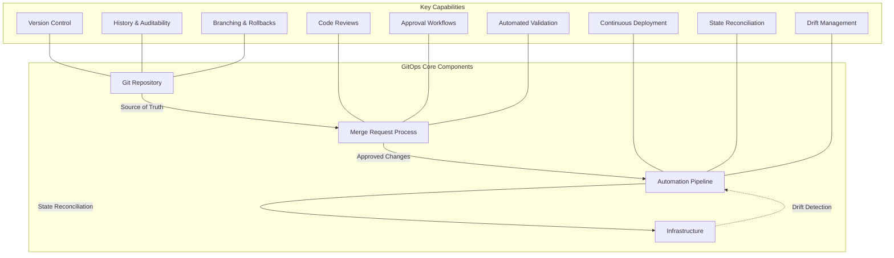
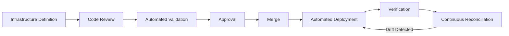
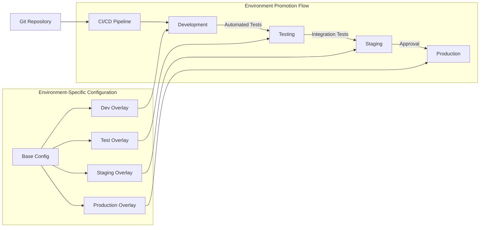
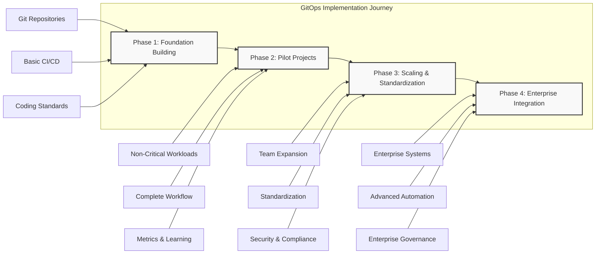

# GitOps: Automating the Enterprise Cloud: A Strategic Blueprint

## Table of Contents

1. [Introduction to GitOps](#1-introduction-to-gitops)
   - [Defining GitOps](#11-defining-gitops)
   - [The Enterprise Challenge](#12-the-enterprise-challenge)
2. [Evolution of Infrastructure Management](#2-evolution-of-infrastructure-management)
   - [The Pre-Automation Era](#21-the-pre-automation-era)
   - [First Generation Infrastructure Tools](#22-first-generation-infrastructure-tools)
   - [Cloud-Native Infrastructure Tools](#23-cloud-native-infrastructure-tools)
   - [The GitOps Paradigm](#24-the-gitops-paradigm)
3. [GitOps Architecture and Core Principles](#3-gitops-architecture-and-core-principles)
   - [Foundational Components](#31-foundational-components)
   - [Core Principles](#32-core-principles)
   - [GitOps Workflow](#33-gitops-workflow)
4. [Strategic Benefits for Enterprises](#4-strategic-benefits-for-enterprises)
   - [Operational Efficiency](#41-operational-efficiency)
   - [Governance and Compliance](#42-governance-and-compliance)
   - [Security Enhancements](#43-security-enhancements)
   - [Developer Experience](#44-developer-experience)
   - [Business Agility](#45-business-agility)
5. [Implementation Framework](#5-implementation-framework)
   - [Core Components Selection](#51-core-components-selection)
   - [Infrastructure Definition Strategy](#52-infrastructure-definition-strategy)
   - [Automation Pipeline Design](#53-automation-pipeline-design)
6. [Enterprise Best Practices](#6-enterprise-best-practices)
   - [Infrastructure Code Management](#61-infrastructure-code-management)
   - [Change Management](#62-change-management)
   - [Access Control](#63-access-control)
   - [Continuous Verification](#64-continuous-verification)
7. [Advanced GitOps Patterns](#7-advanced-gitops-patterns)
   - [Multi-Environment Management](#71-multi-environment-management)
   - [GitOps for Kubernetes](#72-gitops-for-kubernetes)
   - [Self-Service Infrastructure](#73-self-service-infrastructure)
8. [Security Considerations](#8-security-considerations)
   - [Secure GitOps Implementation](#81-secure-gitops-implementation)
   - [Compliance and Governance](#82-compliance-and-governance)
   - [Secrets Management](#83-secrets-management)
9. [Tool Ecosystem and Comparison](#9-tool-ecosystem-and-comparison)
   - [Git Repository Platforms](#91-git-repository-platforms)
   - [Infrastructure as Code Tools](#92-infrastructure-as-code-tools)
   - [GitOps Tools for Kubernetes](#93-gitops-tools-for-kubernetes)
   - [Configuration Management Tools](#94-configuration-management-tools)
10. [Enterprise Adoption Roadmap](#10-enterprise-adoption-roadmap)
    - [Assessment and Planning](#101-assessment-and-planning)
    - [Implementation Phases](#102-implementation-phases)
    - [Measuring Success](#103-measuring-success)
11. [Future Directions and Innovations](#11-future-directions-and-innovations)
    - [GitOps Evolution](#111-gitops-evolution)
    - [Emerging Technologies](#112-emerging-technologies)
    - [Industry Adoption Trends](#113-industry-adoption-trends)

---

## 1. Introduction to GitOps

As modern enterprise applications grow increasingly sophisticated, infrastructure requirements have expanded dramatically in both scale and complexity. While application development has largely embraced automation, infrastructure management has remained predominantly manual, creating operational bottlenecks that impede innovation and agility.

GitOps represents a transformative approach to infrastructure automation that applies the same DevOps principles used in application development to infrastructure management. At its core, GitOps uses Git repositories as the single source of truth for declaratively describing infrastructure, with automated processes ensuring the actual infrastructure state matches the desired state defined in Git.

### 1.1 Defining GitOps

GitOps is a framework for infrastructure automation that combines:

| Component | Description |
|-----------|-------------|
| **Infrastructure as Code (IaC)** | All infrastructure defined and stored as code |
| **Merge Requests (MRs)** | Change management mechanism for all infrastructure updates |
| **CI/CD** | Automated pipelines that implement infrastructure changes |
| **Declarative Systems** | Infrastructure defined by its desired end state rather than procedural steps |

> *"GitOps = IaC + MRs + CI/CD"*

---

### 1.2 The Enterprise Challenge

Enterprise organizations face unique infrastructure challenges:

* **Scale & Complexity**: Managing multi-cloud and hybrid environments with thousands of resources
* **Compliance & Security**: Ensuring adherence to regulatory requirements and security best practices
* **Team Alignment**: Supporting multiple teams with varying access requirements
* **Velocity & Stability**: Maintaining system reliability while enabling rapid innovation
* **Cost Management**: Optimizing infrastructure spending as environments scale

GitOps provides a systematic approach to address these challenges by bringing infrastructure management into the same workflow paradigm that has proven successful for application development.

---

## 2. Evolution of Infrastructure Management

### 2.1 The Pre-Automation Era

Infrastructure management has undergone a remarkable evolution over the past two decades:

#### Physical Hardware Era
* Manual provisioning and configuration of physical servers
* Limited scalability and high capital expenses
* Long lead times for changes
* Extensive documentation requirements
* Impossible to version control

#### Early Virtualization
* Manual creation and configuration of virtual machines
* Improved resource utilization
* Faster provisioning than physical hardware
* Still largely manual processes
* Limited standardization

---

### 2.2 First Generation Infrastructure Tools

#### First-Generation Configuration Management
* **Tools**: Puppet, Chef
* **Capabilities**: Automated software installation and configuration on existing servers
* **Limitations**: Required pre-provisioned servers/VMs; not designed for cloud-native services

#### Second-Generation Configuration Management
* **Tools**: Ansible, SaltStack
* **Capabilities**: VM provisioning + software installation
* **Limitations**: Limited cloud-native service support; often imperative rather than declarative

---

### 2.3 Cloud-Native Infrastructure Tools

#### Cloud-Specific Infrastructure as Code
* **Tools**: AWS CloudFormation, Azure Resource Manager (ARM)
* **Capabilities**: Declarative infrastructure definition, cloud service provisioning
* **Limitations**: Vendor lock-in, only works with specific cloud providers

#### Multi-Cloud Infrastructure as Code
* **Tools**: Terraform, Pulumi
* **Capabilities**: Cross-platform infrastructure definition, support for multiple providers
* **Limitations**: Still requires manual execution, limited integration with application deployment

---

### 2.4 The GitOps Paradigm

GitOps represents the next evolutionary step, adding:
* Version control for infrastructure definitions
* Automated change management processes
* Continuous reconciliation between desired and actual states
* Integration with development workflows

---

## 3. GitOps Architecture and Core Principles

### 3.1 Foundational Components

The GitOps architecture consists of three essential components:

1. **Git Repository** (The Source of Truth)
   * Contains declarative infrastructure definitions
   * Maintains complete history of all infrastructure changes
   * Enables branching, rollbacks, and collaborative workflows
   * Provides audit trail for compliance purposes

2. **Merge Request Process** (The Change Mechanism)
   * Provides a collaborative platform for reviewing infrastructure changes
   * Enforces approval workflows before changes are applied
   * Creates documentation of change rationale and discussions
   * Enables automated validation and testing

3. **Automation Pipeline** (The Implementation Engine)
   * Automatically applies approved changes to infrastructure
   * Continuously reconciles actual state with desired state
   * Provides feedback on implementation status
   * Manages rollbacks when necessary

---

### 3.2 Core Principles

#### 1. Declarative Configuration
* Infrastructure defined by its desired end state
* System automatically determines how to reach that state
* Eliminates need for procedural scripts or manual steps

#### 2. Version-Controlled, Immutable Infrastructure
* All configuration stored in Git
* Changes made through controlled processes (MRs)
* Infrastructure treated as immutable; changes create new instances rather than modifying existing ones

#### 3. Continuous Reconciliation
* Automated systems continuously compare actual state to desired state
* Divergences automatically corrected (system of record is always the Git repository)
* Prevents configuration drift and unauthorized changes

#### 4. Pull-Based Deployment Model
* Agents in the environment pull desired state from Git
* Eliminates need for direct administrative access to environments
* Improves security by reducing attack surface

---

### 3.3 GitOps Workflow

The standard GitOps workflow follows these steps:

1. **Infrastructure Definition**: Developers define or update infrastructure in Git repository
2. **Code Review**: Changes are reviewed through merge requests
3. **Automated Validation**: CI pipeline validates infrastructure code
4. **Approval**: Changes are approved by authorized reviewers
5. **Merge**: Approved changes are merged to the main branch
6. **Automated Deployment**: CI/CD pipeline or operators apply changes to environment
7. **Verification**: System confirms that changes have been successfully applied
8. **Continuous Reconciliation**: System continuously monitors and corrects any drift

---

## 4. Strategic Benefits for Enterprises

GitOps delivers substantial benefits that address key enterprise concerns:

### 4.1 Operational Efficiency

* **Automated Workflows**: Eliminates manual infrastructure tasks
* **Reduced Mean Time to Recovery (MTTR)**: Faster recovery through version-controlled configurations
* **Standardization**: Consistent infrastructure across environments
* **Resource Optimization**: More efficient management of cloud resources

---

### 4.2 Governance and Compliance

* **Complete Audit Trail**: Every infrastructure change tracked in Git history
* **Enforced Review Process**: Changes require approval before implementation
* **Documented Changes**: Context and justification captured in merge requests
* **Simplified Auditing**: Single source of truth for infrastructure state

---

### 4.3 Security Enhancements

* **Reduced Attack Surface**: No direct administrative access to production
* **Least Privilege Access**: Only CI/CD systems need infrastructure credentials
* **Consistent Security Controls**: Security policies defined as code
* **Automated Security Scanning**: Security validation integrated into CI pipeline

---

### 4.4 Developer Experience

* **Familiar Workflows**: Same processes used for application and infrastructure
* **Self-Service Infrastructure**: Developers can request infrastructure changes through Git
* **Faster Feedback Loops**: Automated validation provides immediate feedback
* **Reduced Cognitive Load**: Less context switching between tools and processes

---

### 4.5 Business Agility

* **Faster Time to Market**: Automated provisioning accelerates deployment
* **Reduced Cost**: Fewer manual operations, better resource utilization
* **Improved Reliability**: Fewer human errors, consistent environments
* **Enhanced Collaboration**: Cross-functional teams work through same processes

---

## 5. Implementation Framework

### 5.1 Core Components Selection

#### Git Repository Management
* **Options**: GitHub, GitLab, Bitbucket, Azure DevOps
* **Enterprise considerations**: 
  * Single sign-on integration
  * Role-based access control
  * Compliance features
  * Existing enterprise agreements

#### Continuous Integration/Continuous Delivery
* **Options**: GitLab CI/CD, Jenkins, GitHub Actions, CircleCI, ArgoCD
* **Enterprise considerations**:
  * Integration with existing tools
  * Scalability for enterprise workloads
  * Compliance and audit capabilities
  * Support for multiple deployment targets

#### Infrastructure as Code Tools
* **Options**: Terraform, AWS CloudFormation, Azure Resource Manager, Kubernetes YAML
* **Enterprise considerations**:
  * Multi-cloud strategy requirements
  * Existing infrastructure investments
  * Team expertise and learning curve
  * Integration with other enterprise systems

---

### 5.2 Infrastructure Definition Strategy

#### Repository Organization

| Approach | Description | Best For |
|----------|-------------|----------|
| **Monorepo** | Single repository for all infrastructure | Centralized teams, tight integration |
| **Multiple repos** | Separate repositories by service/team | Distributed teams, clear ownership |
| **Hybrid** | Shared modules with service-specific repos | Large enterprises with diverse needs |

#### Configuration Management
* **Environment-specific configurations**: Managing differences between dev/test/prod
* **Secret management**: Secure handling of sensitive information
* **State file management**: Terraform state handling in team environments
* **Module versioning**: Maintaining stability while enabling updates

#### Validation and Testing
* **Linting and syntax validation**: Automated checks for code quality
* **Policy enforcement**: Compliance validation with OPA, HashiCorp Sentinel
* **Infrastructure unit testing**: Verifying resource configurations
* **Security scanning**: Detecting vulnerabilities and misconfigurations

---

### 5.3 Automation Pipeline Design

#### Pipeline Stages

```mermaid
graph LR
    A[Code Changes] --> B[Validation]
    B -->|Syntax Check| C[Planning]
    C -->|Preview Changes| D[Approval]
    D -->|Manual/Auto| E[Deployment]
    E -->|Apply Changes| F[Verification]
    F -->|Confirm Success| G[Monitoring]
    G -->|Detect Drift| H{Drift?}
    H -->|Yes| E
    H -->|No| I[Complete]
    
    style B fill:#d0e0ff,stroke:#0066cc
    style C fill:#d0e0ff,stroke:#0066cc
    style D fill:#ffe0d0,stroke:#cc6600
    style E fill:#ffd0d0,stroke:#cc0000
    style F fill:#d0ffd0,stroke:#00cc00
    style G fill:#d0ffd0,stroke:#00cc00
```

1. **Validation**: Syntax checking, formatting, policy compliance
2. **Planning**: Preview of changes (e.g., Terraform plan)
3. **Approval**: Manual or automated based on risk assessment
4. **Deployment**: Apply changes to environment
5. **Verification**: Confirm successful application
6. **Monitoring**: Detect drift from desired state

#### Pipeline Security
* **Credential management**: Secure handling of access keys
* **Role-based access**: Limiting permissions by pipeline stage
* **Audit logging**: Tracking all pipeline operations
* **Environment isolation**: Preventing cross-environment access

#### Pipeline Scalability
* **Parallel execution**: Running operations concurrently
* **Caching strategies**: Reducing redundant operations
* **Resource optimization**: Efficient use of CI/CD runners
* **Failure handling**: Graceful error management and recovery

---

## 6. Enterprise Best Practices

### 6.1 Infrastructure Code Management

#### Define All Infrastructure as Config Files
* Use declarative code rather than imperative scripts
* Include all resources, even those with default settings
* Structure code for reusability and consistency
* Document the purpose and relationships of resources

#### Document What Cannot Be Automated
* Create clear procedures for manual steps
* Integrate manual steps into workflow tools
* Create validation mechanisms to ensure completion
* Plan for eventual automation

#### Repository Strategy
* Consider organizational structure when planning repositories
* Balance access control with collaboration needs
* Implement branching strategies aligned with deployment pipelines
* Create standards for repository organization

---

### 6.2 Change Management

#### Code Review and Merge Request Process
* Define minimum number of reviewers
* Create detailed code review guidelines
* Implement automated checks for common issues
* Document approval requirements for different environments

#### Keep Changes Small
* Encourage incremental changes
* Use feature flags for larger changes
* Implement atomic commits with clear messages
* Create deployment strategies for interdependent changes

#### Environment Progression
* Define clear promotion paths between environments
* Implement automatic validation between environment promotions
* Create environment-specific approval requirements
* Document rollback procedures

---

### 6.3 Access Control

#### Make CI/CD the Access Point to Resources
* Eliminate direct infrastructure access for routine operations
* Implement emergency access procedures with approval and auditing
* Use service accounts with minimal permissions for automation
* Implement just-in-time access for exceptional cases

#### Role-Based Access Control
* Define clear roles for repository access
* Implement approval requirements based on roles
* Restrict sensitive configuration based on need-to-know
* Audit access regularly

#### Secret Management
* Integrate secrets management tools (HashiCorp Vault, AWS Secrets Manager)
* Implement least-privilege access to secrets
* Rotate credentials automatically
* Audit secret access

---

### 6.4 Continuous Verification

#### State Reconciliation
* Implement continuous comparison between desired and actual state
* Create alerting for unauthorized drift
* Implement automatic remediation for unauthorized changes
* Document exceptions to automatic remediation

#### Compliance Verification
* Integrate policy-as-code tools (OPA, Cloud Custodian)
* Create automated compliance reporting
* Implement guardrails to prevent non-compliant changes
* Maintain compliance history for auditing

---

## 7. Advanced GitOps Patterns

### 7.1 Multi-Environment Management

#### Environment Promotion Strategy

* Define consistent promotion paths (Dev → Test → Staging → Production)
* Implement environment-specific validation
* Create isolated credentials for each environment
* Manage environment-specific configuration

#### Configuration Variance Management
* Parameterize environment differences
* Use overlay patterns for Kubernetes resources
* Implement templating for consistent variance
* Validate configuration across environments

#### Hybrid and Multi-Cloud Deployment
* Implement abstraction layers for provider-specific resources
* Standardize deployment processes across clouds
* Create unified monitoring and observability
* Implement consistent security controls

---

### 7.2 GitOps for Kubernetes

#### Operator-Based GitOps
* Implement Kubernetes operators for continuous reconciliation
* Use pull-based deployment models
* Implement health checks and automatic remediation
* Create progressive delivery strategies

#### Application and Infrastructure Alignment
* Coordinate application and infrastructure changes
* Implement dependency management between resources
* Create consistent labeling and metadata
* Implement service discovery and networking

#### GitOps with Helm and Kustomize
* Manage Helm releases through Git
* Implement value overrides for different environments
* Use Kustomize for environment-specific patches
* Create consistent release management

---

### 7.3 Self-Service Infrastructure

#### Infrastructure Platform Teams
* Create reusable infrastructure modules
* Implement service catalogs for common resources
* Define clear interfaces and contracts
* Provide documentation and examples

#### Developer Experience
* Create self-service portals integrated with Git
* Implement automated validation and feedback
* Provide development environments that match production
* Create clear documentation for infrastructure usage

---

## 8. Security Considerations

### 8.1 Secure GitOps Implementation

#### Repository Security
* Implement branch protection
* Require signed commits
* Enforce multi-factor authentication
* Regular security scanning of repositories

#### Pipeline Security
* Secure credential management
* Isolated execution environments
* Input validation and sanitization
* Image and dependency scanning

#### Infrastructure Security
* Implement least-privilege access
* Network segmentation and isolation
* Regular security scanning and auditing
* Automated remediation of security issues

---

### 8.2 Compliance and Governance

#### Policy as Code
* Implement declarative policies
* Automate compliance checks
* Create policy libraries for common requirements
* Integrate compliance into review process

#### Audit and Reporting
* Generate automated compliance reports
* Maintain complete audit history
* Implement real-time compliance monitoring
* Create dashboards for compliance status

---

### 8.3 Secrets Management

#### Secure Secrets Handling
* Integrate dedicated secrets management tools
* Implement dynamic secrets with short lifetimes
* Audit secret access and usage
* Implement secret rotation

#### Sensitive Data Protection
* Encrypt sensitive data at rest and in transit
* Implement data classification and handling policies
* Create clear processes for managing sensitive data
* Regular auditing and assessment

---

## 9. Tool Ecosystem and Comparison

### 9.1 Git Repository Platforms

| Feature | GitHub | GitLab | Bitbucket | Azure DevOps |
|---------|--------|--------|-----------|--------------|
| **Enterprise features** | GitHub Enterprise | GitLab Enterprise | Bitbucket Server | Azure DevOps Server |
| **CI/CD integration** | GitHub Actions | GitLab CI/CD | Pipelines | Azure Pipelines |
| **Access control** | Organization-based | Project-based | Project-based | Organization-based |
| **Compliance features** | Advanced Security | Compliance Dashboard | Compliance reporting | Compliance reporting |
| **Deployment automation** | Environments | Environments | Deployments | Environments |

---

### 9.2 Infrastructure as Code Tools

| Feature | Terraform | AWS CloudFormation | Azure ARM | Pulumi |
|---------|-----------|-------------------|-----------|--------|
| **Language** | HCL | JSON/YAML | JSON | Python, TypeScript, Go |
| **Multi-cloud** | Yes | AWS only | Azure only | Yes |
| **State management** | State files | Managed by AWS | Managed by Azure | Service or local |
| **Modularity** | Modules | Nested stacks | Linked templates | Components |
| **Enterprise features** | Terraform Cloud/Enterprise | CloudFormation StackSets | Management groups | Pulumi Enterprise |

---

### 9.3 GitOps Tools for Kubernetes

| Feature | Flux | ArgoCD | Jenkins X | GitLab |
|---------|------|--------|----------|--------|
| **Reconciliation model** | Pull-based | Pull-based | Push/Pull hybrid | Push-based |
| **UI Dashboard** | Minimal | Comprehensive | Comprehensive | Integrated |
| **Multi-cluster support** | Yes | Yes | Limited | Yes |
| **Progressive delivery** | Flagger integration | Argo Rollouts | Supported | Canary deployments |
| **Enterprise support** | CNCF project | CNCF project | Commercial support | GitLab Enterprise |

---

### 9.4 Configuration Management Tools

| Feature | Ansible | Chef | Puppet | SaltStack |
|---------|---------|------|--------|-----------|
| **Architecture** | Agentless | Agent-based | Agent-based | Agent-based |
| **Language** | YAML | Ruby DSL | Puppet DSL | YAML/Python |
| **Idempotence** | Yes | Yes | Yes | Yes |
| **Cloud integration** | Modules | Cookbooks | Modules | States |
| **Enterprise features** | Ansible Tower/AWX | Chef Enterprise | Puppet Enterprise | Salt Enterprise |

---

## 10. Enterprise Adoption Roadmap

### 10.1 Assessment and Planning

#### Readiness Assessment

📋 **Evaluate your organization against these key dimensions:**

* Current infrastructure management practices
* Team skills and knowledge gaps
* Compliance and security requirements
* Existing automation and tools

#### Strategy Development
* Define clear objectives and success metrics
* Identify pilot projects and teams
* Create a phased implementation plan
* Define governance model and responsibilities

#### Tool Selection
* Evaluate tools against enterprise requirements
* Consider existing investments and skills
* Plan for training and enablement
* Create proof-of-concept implementations

---

### 10.2 Implementation Phases

#### Phase 1: Foundation Building
* Establish Git repositories for infrastructure
* Implement basic CI/CD pipelines
* Define coding standards and practices
* Create initial documentation and training

#### Phase 2: Pilot Projects
* Select non-critical workloads
* Implement full GitOps workflow
* Measure success against defined metrics
* Document lessons learned and refine approach

#### Phase 3: Scaling and Standardization
* Expand to additional teams and workloads
* Standardize workflows and tools
* Implement advanced security and compliance
* Create internal enablement programs

#### Phase 4: Enterprise Integration
* Integrate with enterprise systems
* Implement advanced automation
* Optimize for scale and performance
* Create enterprise-wide governance

---

### 10.3 Measuring Success

#### Key Performance Indicators
* Deployment frequency
* Lead time for changes
* Change failure rate
* Mean time to recovery
* Infrastructure cost optimization

#### Operational Metrics
* Infrastructure provisioning time
* Configuration drift incidents
* Security and compliance violations
* Manual intervention frequency

#### Business Impact Metrics
* Time to market for new capabilities
* Cost reduction
* Reliability improvements
* Developer satisfaction

---

## 11. Future Directions and Innovations

### 11.1 GitOps Evolution

#### Platform Engineering
* Internal developer platforms built on GitOps principles
* Self-service infrastructure with guardrails
* Integration with service meshes and API gateways
* Unified application and infrastructure lifecycle

#### AI/ML Integration
* Intelligent change analysis and recommendation
* Predictive scaling and optimization
* Automated security and compliance remediation
* Anomaly detection and root cause analysis

#### Advanced Observability
* Integrated metrics, logs, and traces
* Infrastructure cost attribution and optimization
* Performance impact analysis
* Proactive issue detection

---

### 11.2 Emerging Technologies

#### FinOps Integration
* Cost forecasting for infrastructure changes
* Budget enforcement through GitOps workflows
* Resource optimization recommendations
* Chargeback/showback integration

#### Security Shift-Left
* Enhanced policy enforcement
* Integrated threat modeling
* Supply chain security
* Zero-trust architecture implementation

#### Edge and Distributed Systems
* GitOps for edge computing
* Disconnected operation patterns
* Multi-region orchestration
* Latency-aware deployment strategies

---

### 11.3 Industry Adoption Trends

#### Enterprise Standardization
* Industry-specific reference architectures
* Regulatory compliance templates
* Certified GitOps practices
* Enterprise-scale success patterns

#### Community and Ecosystem
* Expanding tool integration
* Industry standards development
* Cross-platform compatibility
* Knowledge sharing and best practices

---

## Conclusion

GitOps represents a fundamental shift in how enterprises manage infrastructure, bringing the same rigor, automation, and reliability to infrastructure that DevOps brought to application development. By implementing GitOps practices, enterprises can achieve greater operational efficiency, enhanced security, improved compliance, and faster innovation.

The journey to GitOps maturity requires careful planning, incremental implementation, and continuous refinement. By starting with clear objectives, selecting appropriate tools, and creating a structured adoption plan, organizations can successfully transform their infrastructure management practices.

As the GitOps ecosystem continues to evolve, enterprises that invest in these practices today will be well-positioned to take advantage of emerging technologies and approaches, ensuring their infrastructure management capabilities continue to support and accelerate business objectives.

---