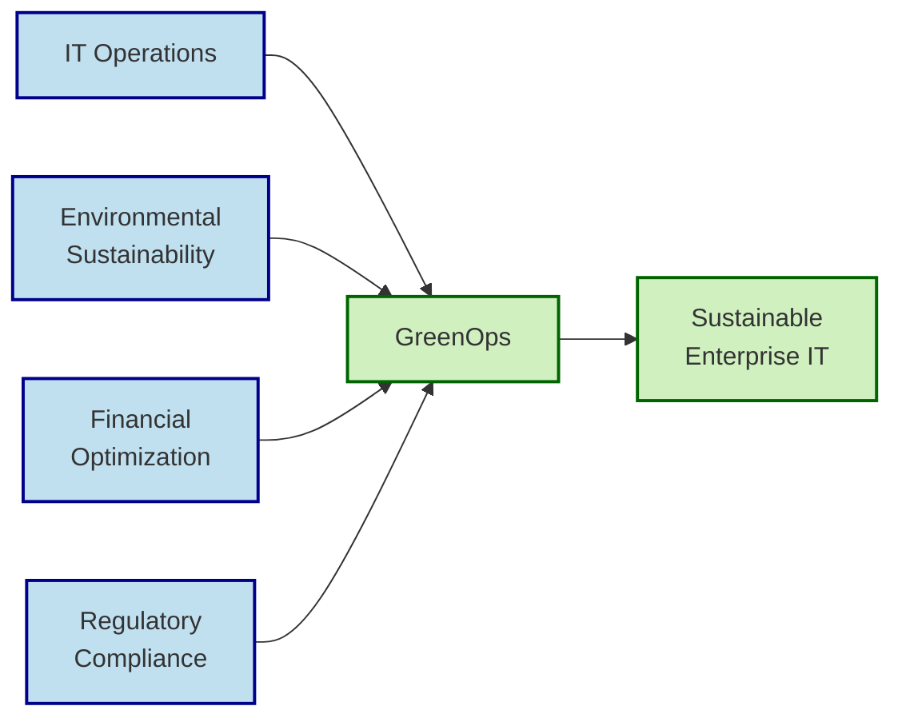
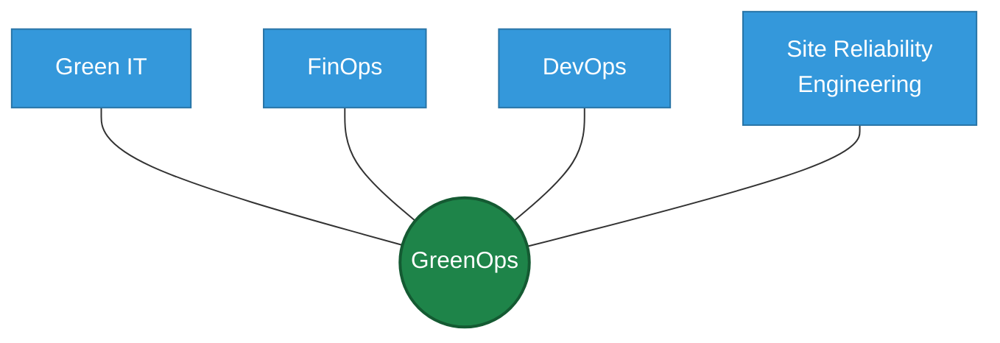
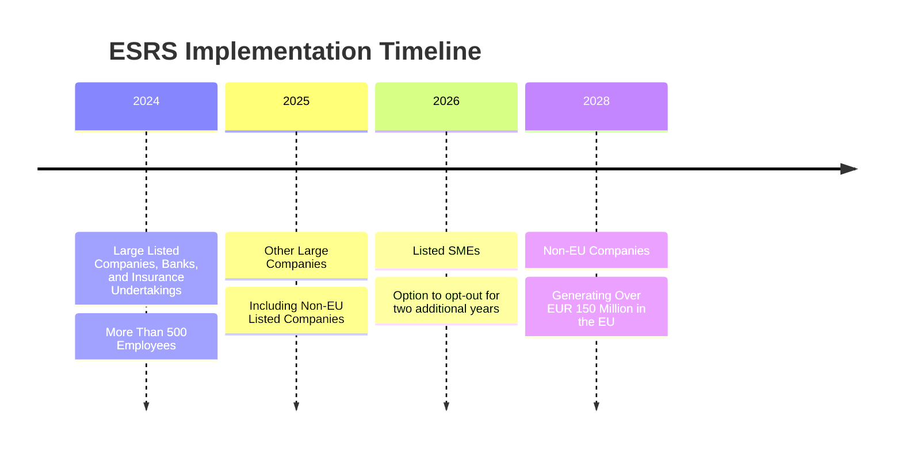
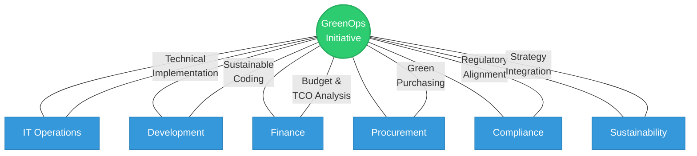
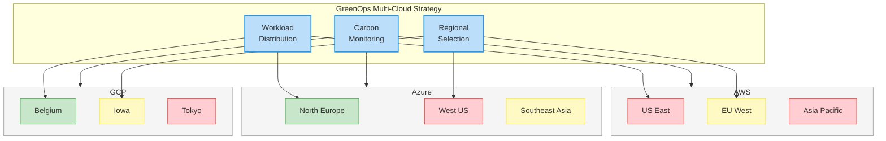
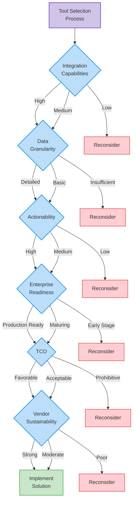
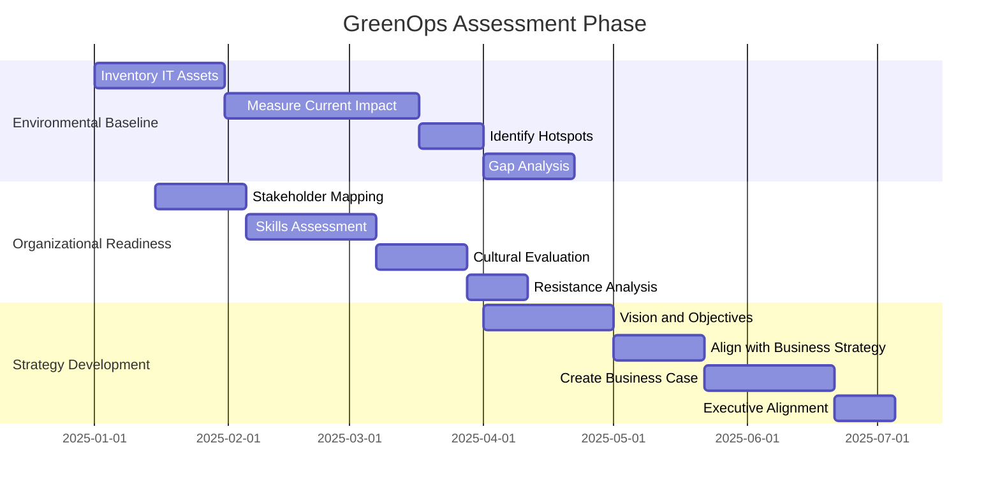
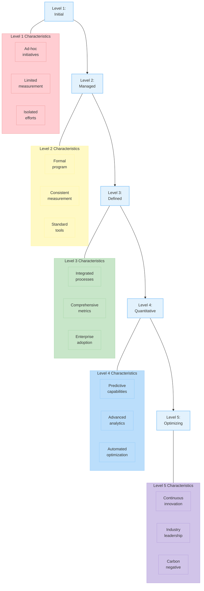

# The Comprehensive Guide to GreenOps: Enterprise Sustainability in IT

> *"The most sustainable energy is the energy we don't use."*

---

## Table of Contents

- [Introduction to GreenOps](#introduction-to-greenops)
- [The Business Imperative for GreenOps](#the-business-imperative-for-greenops)
- [Organizational Framework for GreenOps](#organizational-framework-for-greenops)
- [Enterprise Implementation Strategies](#enterprise-implementation-strategies)
- [Measuring Success: Metrics and KPIs](#measuring-success-metrics-and-kpis)
- [Tools and Technologies for GreenOps](#tools-and-technologies-for-greenops)
- [Case Studies and Success Stories](#case-studies-and-success-stories)
- [Implementation Roadmap for Enterprises](#implementation-roadmap-for-enterprises)

---

## Introduction to GreenOps

### Definition and Core Principles

**GreenOps** is a comprehensive framework for organizations to quantify, manage, and reduce the environmental impact of their IT operations while maintaining optimal business performance. At its core, GreenOps integrates environmental consciousness into all aspects of IT infrastructure, development, and operations.

As defined by Cycloid founder Benjamin Brial:

> "At its heart, GreenOps is a framework for organizations to start understanding and quantifying the environmental impacts of their IT strategies whilst promoting a culture of environmental sobriety which flows through a workforce. Closely linked to more established terms like FinOps - another framework for managing operational expenditure across an organization - GreenOps is about generating greater cost transparency while promoting environmental responsibility."

**The core principles of GreenOps include:**

| Principle | Description |
|:----------|:------------|
| **Measurement First** | You cannot improve what you cannot measure. GreenOps begins with establishing baseline metrics for environmental impact. |
| **Efficiency Optimization** | Maximizing the business value generated per unit of environmental impact. |
| **Continuous Improvement** | Implementing systematic processes to regularly evaluate and enhance environmental performance. |
| **Cross-Functional Collaboration** | Engaging stakeholders across the organization in sustainability efforts. |
| **Balanced Decision-Making** | Considering environmental impact alongside traditional metrics like cost, performance, and reliability. |

---

### The GreenOps Ecosystem

GreenOps exists within a broader ecosystem of related disciplines and frameworks:

- **Green IT**: Focuses on environmentally sustainable computing, covering hardware, software, and IT services.
- **FinOps**: Manages and optimizes cloud financial operations.
- **DevOps**: Integrates development and operations for faster delivery and higher quality.
- **SRE (Site Reliability Engineering)**: Ensures system reliability and efficiency.

GreenOps operates at the intersection of these disciplines, creating a holistic approach that considers environmental impact throughout the IT lifecycle.

---

### The Unique Elements of GreenOps

What distinguishes GreenOps from traditional sustainability initiatives:

1. **IT-Specific Focus**: Tailored specifically to address the unique environmental challenges of information technology.
2. **Operational Integration**: Embedded within day-to-day operations rather than as a separate sustainability initiative.
3. **Dual-Optimization Objective**: Simultaneously targets environmental improvements and cost reductions.
4. **Measurement-Driven**: Relies on concrete metrics and KPIs rather than aspirational goals.
5. **Cultural Transformation**: Creates a mindset shift that places sustainability at the orchestration layer of IT operations.

---

## The Business Imperative for GreenOps

### The Financial Case for GreenOps

GreenOps represents a rare convergence where environmental responsibility directly aligns with financial benefits. The financial drivers include:

#### Rising Energy Costs

Data center operators in the UK and Ireland saw energy bills increase by as much as **50%** in recent years. This trend is projected to continue globally as energy demands grow and fossil fuel resources become more constrained.

For enterprise organizations, this translates to:
- ⚡ Escalating operational costs for on-premises data centers
- ⚡ Increasing cloud service fees as providers pass on higher energy costs
- ⚡ Greater volatility in IT operational expenditures

#### Cloud Waste Elimination

Research by Flexera indicates that organizations waste approximately **30%** of their cloud spend on idle or oversized resources. For large enterprises, this can represent millions in unnecessary expenditure that also generates avoidable carbon emissions.

**Sources of cloud waste include:**

- **Idle resources** – Development environments running 24/7
- **Oversized instances** – Using higher performance tiers than required
- **Orphaned resources** – Forgotten assets that continue incurring charges
- **Inefficient architectures** – Designs that consume excessive resources

#### Infrastructure Optimization Benefits

Implementing GreenOps principles delivers measurable financial returns:

| Optimization Area | Typical Cost Reduction | Environmental Benefit |
|:------------------|:----------------------:|:----------------------:|
| Right-sizing cloud resources | 20-30% | 15-25% emissions reduction |
| Automated scaling | 15-25% | 10-20% emissions reduction |
| Storage optimization | 10-20% | 5-15% emissions reduction |
| Workload scheduling | 5-15% | 10-30% emissions reduction |

---

### The Regulatory Landscape

#### Current Regulatory Framework

The regulatory environment for corporate environmental responsibility is rapidly evolving:

- **European Sustainability Reporting Standards (ESRS)**: Mandates comprehensive sustainability reporting for European businesses.
- **SEC Climate Disclosure Rules**: Requires public companies to disclose climate-related risks and greenhouse gas emissions.
- **Carbon Border Adjustment Mechanism (CBAM)**: Imposes carbon pricing on imports to the EU.
- **National Green Digital Transformation Initiatives**: Countries worldwide are implementing policies to reduce the environmental impact of the digital sector.

#### Implementation Timeline for ESRS

- **2024**: Large Listed Companies, Banks, and Insurance Undertakings with More Than 500 Employees
- **2025**: Other Large Companies, Including Non-EU Listed Companies
- **2026**: Listed SMEs (with the option to opt-out for two additional years)
- **2028**: Non-EU Companies Generating Over EUR 150 Million in the EU

#### Compliance Considerations for Enterprises

Organizations must prepare for:
- 📋 Mandatory emissions reporting for IT operations
- 📋 Supply chain environmental impact disclosure
- 📋 Digital carbon footprint accounting
- 📋 Green procurement requirements
- 📋 Energy efficiency benchmarking

---

### Market and Stakeholder Expectations

#### Investor Priorities

The investment community has firmly embraced environmental sustainability as a key criterion:

- **ESG Investment Growth**: Global ESG assets are projected to exceed $50 trillion by 2025, representing more than a third of total assets under management.
- **Venture Capital Screening**: 87% of VCs now include environmental criteria in their investment decisions.
- **Shareholder Activism**: Increasing pressure from shareholders for transparent environmental performance.
- **Valuation Impact**: Companies with strong environmental performance command premium valuations.

#### Customer Expectations

Consumer and B2B customer preferences are increasingly influenced by sustainability credentials:

- **B2B Procurement**: 79% of enterprise buyers consider environmental sustainability in vendor selection.
- **RFP Requirements**: Growing inclusion of environmental criteria in formal procurement processes.
- **Brand Differentiation**: Sustainability as a competitive differentiator in crowded markets.
- **Supply Chain Pressure**: Large enterprises extending environmental requirements to their vendors and suppliers.

---

## Organizational Framework for GreenOps

### Governance Structure

Effective GreenOps implementation requires a clear governance structure:

#### Executive Sponsorship

- **C-Suite Champion**: Ideally the CIO, CTO, or newly created Chief Sustainability Officer (CSO)
- **Board-Level Reporting**: Regular sustainability updates to the board of directors
- **Strategic Alignment**: Integration of GreenOps objectives with corporate strategy

#### Cross-Functional Teams

A successful GreenOps initiative requires collaboration across multiple departments:

| Department | Role in GreenOps |
|:-----------|:-----------------|
| **IT Operations** | Implementation of technical solutions and monitoring |
| **Finance** | Budget allocation and TCO analysis |
| **Procurement** | Vendor selection with sustainability criteria |
| **Development** | Sustainable coding practices and architecture |
| **Compliance** | Meeting regulatory requirements |
| **Sustainability** | Overall environmental strategy alignment |

#### Roles and Responsibilities

Specific roles may include:

- **GreenOps Program Manager**: Oversees the overall initiative
- **Cloud Sustainability Architects**: Design environmentally optimized cloud environments
- **Energy Efficiency Engineers**: Specialize in power optimization
- **GreenOps Analysts**: Track metrics and identify optimization opportunities
- **Sustainable Development Leads**: Guide developers in creating efficient code

---

### Cultural Transformation

#### Mindset Shift

GreenOps requires a fundamental cultural change:

- From treating infrastructure as an unlimited resource to practicing "environmental sobriety"
- From focusing solely on speed and features to balancing these with efficiency
- From isolated sustainability initiatives to integrated environmental considerations

#### Training and Awareness

Enterprise-wide education is essential:

- **Technical Training**: Equipping IT teams with skills for efficient resource management
- **Developer Education**: Teaching sustainable coding practices
- **Leadership Workshops**: Helping decision-makers understand environmental implications
- **All-Employee Awareness**: Creating broad understanding of individual impact

Tools like ClimateFresk provide effective workshop formats for building understanding of climate impacts across the organization.

#### Incentive Alignment

Behavior change requires aligned incentives:

- 🏆 **Performance Metrics**: Including environmental KPIs in performance evaluations
- 🏆 **Recognition Programs**: Celebrating teams that achieve significant efficiency improvements
- 🏆 **Bonus Structures**: Linking compensation to sustainability targets
- 🏆 **Career Advancement**: Creating advancement paths for sustainability specialists

---

## Enterprise Implementation Strategies

### Infrastructure Optimization

#### Cloud Resource Management

- **Right-sizing**: Matching resource allocation to actual requirements
- **Instance Scheduling**: Automatically powering down non-production environments during off-hours
- **Reserved Instances**: Committing to predictable workloads for cost and efficiency benefits
- **Spot Instances**: Utilizing excess capacity for non-critical workloads
- **Waste Identification**: Implementing tools to detect and eliminate unused resources

#### Data Center Efficiency

For enterprises maintaining on-premises infrastructure:

- **Power Usage Effectiveness (PUE) Optimization**: Reducing the ratio of total energy to IT equipment energy
- **Server Virtualization**: Maximizing utilization through virtual machines
- **Hardware Lifecycle Management**: Optimizing refresh cycles for both performance and environmental impact
- **Cooling Optimization**: Implementing efficient cooling technologies and designs
- **Renewable Energy Sourcing**: Transitioning to renewable power sources

#### Multi-Cloud Environmental Strategy

For enterprises operating across multiple cloud providers:

- **Provider Selection**: Considering the environmental credentials of different cloud providers
- **Regional Selection**: Choosing data center regions powered by renewable energy
- **Workload Distribution**: Allocating workloads based partially on environmental factors
- **Unified Monitoring**: Implementing cross-cloud carbon and efficiency tracking

---

### Sustainable Software Development

#### Green Software Engineering Principles

- **Energy Efficiency**: Minimizing the energy required to perform computing tasks
- **Hardware Efficiency**: Maximizing the useful life and utilization of hardware
- **Carbon Awareness**: Considering the carbon intensity of electricity when scheduling workloads

#### Practical Implementation Techniques

- **Carbon-Aware APIs**: Building applications that can adjust behavior based on carbon intensity
- **Efficient Algorithms**: Prioritizing computational efficiency in algorithm selection
- **Resource-Conscious Design Patterns**: Implementing patterns that minimize resource consumption
- **Data Minimization**: Reducing unnecessary data processing and storage
- **Edge Computing**: Processing data closer to its source to reduce transmission energy

#### DevOps Integration

- **Green CI/CD Pipelines**: Optimizing build and deployment processes for efficiency
- **Environment Lifecycle Management**: Automating the creation and destruction of development environments
- **Green Testing Strategies**: Efficient test automation that minimizes resource consumption
- **Energy-Aware Deployment Scheduling**: Deploying during periods of low carbon intensity

---

### Data Management

#### Storage Optimization

- **Data Lifecycle Management**: Automating the movement of data between storage tiers
- **Deduplication and Compression**: Reducing storage requirements through technology
- **Retention Policies**: Implementing environmentally conscious data retention
- **Cold Storage Utilization**: Moving infrequently accessed data to low-energy storage options

#### Efficient Database Operations

- **Query Optimization**: Reducing computational requirements of database operations
- **Database Right-sizing**: Matching database resources to actual needs
- **Caching Strategies**: Implementing effective caches to reduce repeated processing
- **Data Archiving**: Moving historical data to efficient archive storage

---

## Measuring Success: Metrics and KPIs

### Environmental Metrics

#### Carbon Emissions

- 🌍 **Total IT Carbon Footprint**: Overall emissions from IT operations
- 🌍 **Emissions per User**: Carbon footprint normalized by user base
- 🌍 **Emissions per Transaction**: Environmental cost of business transactions
- 🌍 **Emissions per Revenue**: Carbon intensity of revenue generation

#### Energy Consumption

- ⚡ **Total IT Energy Usage**: Kilowatt-hours consumed by IT operations
- ⚡ **Energy Efficiency Ratio**: Business output per unit of energy
- ⚡ **Data Center PUE**: Power Usage Effectiveness of data centers
- ⚡ **Renewable Energy Percentage**: Proportion of renewable energy used

---

### Financial Metrics

#### Cost Optimization

- 💰 **IT Spend per Carbon Unit**: Efficiency of spending relative to emissions
- 💰 **Cloud Waste Percentage**: Proportion of cloud spend on underutilized resources
- 💰 **Energy Cost Trends**: Changes in energy expenses over time
- 💰 **Sustainability ROI**: Return on investment for green initiatives

#### Value Creation

- 📈 **Green Premium**: Revenue attributable to sustainable positioning
- 📈 **Compliance Cost Avoidance**: Savings from proactive regulatory compliance
- 📈 **Innovation Value**: Benefits from sustainability-driven innovation
- 📈 **Brand Value Enhancement**: Impact on corporate brand equity

---

### Operational Metrics

#### Resource Utilization

- 🔄 **Average Server Utilization**: Percentage of server capacity actively used
- 🔄 **Storage Efficiency**: Effective use of storage resources
- 🔄 **Network Optimization**: Efficiency of data transmission
- 🔄 **Resource Elasticity**: Ability to scale resources to match demand

#### Performance Efficiency

- ⚙️ **Performance per Watt**: Computing output per unit of power
- ⚙️ **Carbon per Service Level**: Emissions required to maintain service levels
- ⚙️ **Efficiency Improvement Rate**: Pace of efficiency enhancements
- ⚙️ **Technical Debt Reduction**: Progress in eliminating inefficient legacy systems

---

### Reporting and Dashboards

#### Executive Dashboards

Key elements for leadership visibility:

```mermaid
graph TD
    subgraph Executive_Dashboard [Executive GreenOps Dashboard]
        A[Carbon<br>Emissions]
        B[Cost<br>Metrics]
        C[Resource<br>Efficiency]
        D[Compliance<br>Status]
    end
    
    subgraph Key_Metrics
        A1[Total: 1,250 tCO2e]
        A2[Per User: 0.42 tCO2e]
        A3[YoY Change: -15%]
        
        B1[Cloud Spend: $3.2M]
        B2[Energy Costs: $850K]
        B3[Waste Reduction: 22%]
        
        C1[Server Utilization: 68%]
        C2[Storage Efficiency: 73%]
        C3[Network Optimization: 65%]
        
        D1[ESRS: 92% Ready]
        D2[SEC: 87% Ready]
        D3[Risk Level: Low]
    end
    
    A --> A1
    A --> A2
    A --> A3
    
    B --> B1
    B --> B2
    B --> B3
    
    C --> C1
    C --> C2
    C --> C3
    
    D --> D1
    D --> D2
    D --> D3
    
    classDef dashboard fill:#e8f5e9,stroke:#81c784,stroke-width:2px;
    classDef metrics fill:#f1f8e9,stroke:#aed581,stroke-width:1px;
    classDef good fill:#c8e6c9,stroke:#4caf50,stroke-width:1px;
    classDef warning fill:#fff9c4,stroke:#ffeb3b,stroke-width:1px;
    classDef attention fill:#ffccbc,stroke:#ff8a65,stroke-width:1px;
    
    class Executive_Dashboard dashboard;
    class Key_Metrics metrics;
    class A1,A3,B3,D3 good;
    class C1,C2,C3,D1,D2 warning;
    class A2,B1,B2 attention;
```

- **Sustainability Scorecard**: High-level view of environmental performance
- **Trend Analysis**: Directional indicators for key metrics
- **Benchmark Comparisons**: Performance relative to industry standards
- **Risk Indicators**: Early warnings of environmental compliance issues

#### Operational Dashboards

Detailed views for implementation teams:

- **Resource Efficiency Maps**: Visualization of resource utilization
- **Waste Identifiers**: Highlighting areas of resource waste
- **Optimization Opportunities**: Actionable improvement suggestions
- **Real-time Monitoring**: Current status of key systems and operations

---

## Tools and Technologies for GreenOps

### Carbon Footprint Monitoring

#### Enterprise Carbon Accounting Platforms

| Tool | Key Features | Best For |
|:-----|:------------|:---------|
| **Watershed** | Comprehensive emissions tracking, supply chain analysis | Large enterprises |
| **COZERO** | Carbon management, regulatory compliance | European companies |
| **Persefoni** | Financial-grade carbon accounting, investor reporting | Public companies |
| **Greenly** | IT-focused emissions tracking, integration with cloud platforms | Technology companies |

#### Cloud-Specific Carbon Tools

| Tool | Supported Clouds | Key Capabilities |
|:-----|:----------------|:-----------------|
| **Cloud Carbon Footprint** | AWS, Azure, GCP | Open-source, detailed emissions analytics |
| **Cycloid's Carbon Footprint** | AWS, Azure, GCP | Integrated FinOps and GreenOps |
| **GreenOps.io** | AWS, Azure, GCP, Oracle | Real-time carbon monitoring |
| **Carbon Aware SDK** | Multi-cloud | Carbon-aware application development |

---

### Resource Optimization Tools

#### Cloud Cost and Resource Management

| Tool | Primary Focus | Environmental Features |
|:-----|:-------------|:------------------------|
| **CloudZero** | Cost intelligence | Carbon efficiency recommendations |
| **CloudHealth** | Multi-cloud management | Sustainability dashboards |
| **Densify** | Workload optimization | Energy-efficient resource matching |
| **Apptio Cloudability** | FinOps platform | Carbon allocation tracking |

#### Specialized Optimization Tools

| Tool | Optimization Area | Key Benefit |
|:-----|:-----------------|:------------|
| **PerfectScale** | Kubernetes efficiency | Reduced cluster footprint |
| **Granulate** | Application performance | Lower compute requirements |
| **Akamas** | Performance optimization | AI-driven efficiency improvements |
| **ecoCode** | Code efficiency | Sustainable coding practices |

---

### Integration and Automation

#### Green DevOps Tools

| Tool | Primary Function | Environmental Impact |
|:-----|:----------------|:---------------------|
| **Jenkins Plugins for Green CI/CD** | Build process optimization | Reduced CI/CD energy consumption |
| **Terraform Sustainability Modules** | Infrastructure as Code | Efficient resource provisioning |
| **Green Kubernetes Operators** | Container orchestration | Optimized cluster resource usage |
| **Codecarbon** | Development emissions tracking | Developer awareness and optimization |

#### Workflow Automation

| Tool | Use Case | Sustainability Benefit |
|:-----|:--------|:------------------------|
| **PowerAutomate with Green Extensions** | Process automation | Efficient workflow execution |
| **GreenPipeline** | CI/CD optimization | Carbon-aware build scheduling |
| **ResourceScheduler** | Environment management | Automatic resource shutdown |
| **WasteNotAI** | Waste detection | Automated resource optimization |

---

### Tool Selection Framework

When evaluating GreenOps tools, enterprises should consider:

1. **Integration Capabilities**: Compatibility with existing systems and workflows
2. **Data Granularity**: Level of detail in measurements and reporting
3. **Actionability**: Practical recommendations vs. pure analytics
4. **Enterprise Readiness**: Security, compliance, and scalability features
5. **Total Cost of Ownership**: Implementation and ongoing operational costs
6. **Vendor Sustainability**: The environmental credentials of the tool provider

---

## Case Studies and Success Stories

### Financial Services

#### Global Investment Bank

> **Challenge**: Managing the environmental impact of high-frequency trading infrastructure while maintaining competitive performance.

**Approach**:
- Implemented dynamic scaling of non-critical systems
- Optimized algorithm efficiency for lower resource consumption
- Relocated workloads to low-carbon data center regions

**Results**:
- 🌱 32% reduction in carbon emissions
- 💰 28% decrease in infrastructure costs
- ⚡ No impact on trading performance

---

### Technology Sector

#### Enterprise SaaS Provider

> **Challenge**: Reducing the environmental footprint of a multi-tenant SaaS platform experiencing rapid growth.

**Approach**:
- Redesigned database architecture for efficiency
- Implemented intelligent caching throughout the application
- Optimized CI/CD pipelines to reduce build resources

**Results**:
- 🌱 45% improvement in resource efficiency per user
- 💰 30% reduction in database energy consumption
- ⚡ Carbon intensity per customer reduced by 40%

---

### Manufacturing

#### Global Industrial Equipment Manufacturer

> **Challenge**: Aligning IT operations with corporate sustainability goals across a diverse technology landscape.

**Approach**:
- Consolidated data centers with virtualization
- Implemented GreenOps governance across business units
- Integrated environmental KPIs into IT service management

**Results**:
- 🌱 50% reduction in data center footprint
- 💰 35% decrease in IT energy consumption
- ⚡ Alignment with corporate net-zero roadmap

---

### Healthcare

#### Regional Healthcare Network

> **Challenge**: Balancing data retention requirements with growing storage environmental impact.

**Approach**:
- Implemented tiered storage architecture
- Optimized imaging systems for storage efficiency
- Deployed intelligent data lifecycle management

**Results**:
- 🌱 60% reduction in storage growth rate
- 💰 40% decrease in storage-related emissions
- ⚡ Full compliance with medical data retention requirements

---

## Implementation Roadmap for Enterprises

### Assessment Phase

#### Environmental Baseline

1. **Inventory IT Assets**: Catalog all hardware, software, and cloud resources
2. **Measure Current Impact**: Establish baseline energy consumption and emissions
3. **Identify Hotspots**: Determine areas of highest environmental impact
4. **Gap Analysis**: Compare current state to industry benchmarks and best practices

#### Organizational Readiness

1. **Stakeholder Mapping**: Identify key stakeholders and their interests
2. **Skills Assessment**: Evaluate current capabilities and training needs
3. **Cultural Evaluation**: Assess organizational readiness for sustainability focus
4. **Resistance Analysis**: Identify potential barriers to implementation

---

### Strategy Development

#### Vision and Objectives

1. **Define Environmental Goals**: Set specific, measurable objectives
2. **Align with Business Strategy**: Ensure environmental goals support business objectives
3. **Create Business Case**: Develop ROI analysis for GreenOps initiatives
4. **Executive Alignment**: Secure leadership commitment and resources

#### Governance Framework

1. **Define Roles and Responsibilities**: Establish clear ownership of initiatives
2. **Create Policies and Standards**: Develop guidelines for sustainable IT
3. **Implement Reporting Structure**: Define how progress will be communicated
4. **Integrate with Existing Frameworks**: Align with current IT governance

---

### Implementation

#### Quick Wins

Early initiatives with high impact and low difficulty:

1. **Cloud Instance Right-sizing**: Adjust oversized resources
2. **Development Environment Scheduling**: Implement automatic shutdown
3. **Storage Cleanup**: Remove redundant and obsolete data
4. **Application Consolidation**: Eliminate underutilized applications

#### Medium-Term Initiatives

Projects requiring moderate effort and organizational change:

1. **Sustainable Software Development Practices**: Train and implement
2. **Carbon-Aware Infrastructure**: Deploy tools for carbon-optimized workloads
3. **Green Procurement Policies**: Establish environmental criteria for vendors
4. **Efficiency Metrics Integration**: Embed into existing dashboards and reporting

#### Long-Term Transformation

Fundamental changes requiring significant investment:

1. **Application Refactoring**: Redesign legacy systems for efficiency
2. **Green Architecture Standards**: Establish sustainability as a design principle
3. **Carbon-Neutral IT Operations**: Achieve net-zero emissions through efficiency and offsets
4. **Innovation Program**: Create mechanisms to develop new sustainable technologies

---

### Continuous Improvement

#### Monitoring and Optimization

1. **Regular Auditing**: Conduct periodic environmental impact assessments
2. **Benchmark Analysis**: Compare performance against industry standards
3. **Trend Analysis**: Track progress against established baselines
4. **Optimization Cycle**: Continuously identify and implement improvements

#### Maturity Model Progression

| Maturity Level | Characteristics | Focus Areas |
|:---------------|:---------------|:------------|
| **Level 1: Initial** | Ad-hoc initiatives, limited measurement | Basic awareness, simple optimizations |
| **Level 2: Managed** | Formal program, consistent measurement | Cloud optimization, energy efficiency |
| **Level 3: Defined** | Integrated processes, comprehensive metrics | Sustainable development, comprehensive governance |
| **Level 4: Quantitative** | Predictive capabilities, advanced analytics | Predictive optimization, carbon-aware workloads |
| **Level 5: Optimizing** | Continuous innovation, industry leadership | Advanced innovation, ecosystem influence |

---

## Conclusion

GreenOps represents a critical evolution in enterprise IT management, aligning environmental responsibility with business performance. By implementing a comprehensive GreenOps strategy, organizations can simultaneously:

- ✅ Reduce costs
- ✅ Meet regulatory requirements
- ✅ Satisfy stakeholder expectations
- ✅ Contribute to global sustainability goals

The journey toward sustainable IT operations is not merely a compliance exercise or cost-saving initiative—it represents a fundamental transformation in how enterprises conceive of and manage their digital infrastructure. Organizations that successfully implement GreenOps principles will find themselves at a competitive advantage, better positioned to thrive in an increasingly resource-constrained and environmentally conscious business landscape.

As computing continues to expand its role in global business, the environmental impact of IT operations will only grow in significance. Forward-thinking enterprises are already recognizing that GreenOps is not just an optional enhancement to existing practices but a fundamental requirement for responsible and successful business operations in the 21st century.

---

## Additional Resources

### Industry Standards and Frameworks

- [Green Software Foundation](https://greensoftware.foundation/)
- [The Carbon Trust ICT Sector Guidance](https://www.carbontrust.com/)
- [Sustainable Digital Infrastructure Alliance](https://sdialliance.org/)

---

### Open Source Projects

- [Cloud Carbon Footprint](https://www.cloudcarbonfootprint.org/)
- [Carbon Aware SDK](https://github.com/Green-Software-Foundation/carbon-aware-sdk)
- [Boavizta Impact Evaluator](https://github.com/Boavizta/environmental-footprint-computer)
- [Codecarbon](https://github.com/codecarbon/codecarbon)

### Research and Publications

- "Lean ICT: Towards Digital Sobriety" - The Shift Project
- "Greening Data Centers: The Role of Cloud Computing in Sustainable IT" - Journal of Green Engineering
- "Sustainable Software Engineering: Principles and Practices" - IEEE Software

---

> *"The greatest threat to our planet is the belief that someone else will save it."* — Robert Swan
