# The Enterprise Guide to MLOps: Bridging the Gap Between ML Development and Production

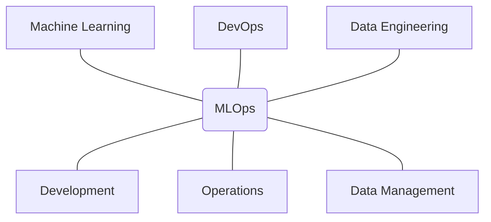

---

## Table of Contents

- [Introduction to MLOps](#introduction-to-mlops)
- [The Fundamental Challenge: ML vs. Traditional Software](#the-fundamental-challenge-ml-vs-traditional-software)
- [The MLOps Lifecycle](#the-mlops-lifecycle)
- [Key Stakeholders and Team Structure](#key-stakeholders-and-team-structure)
- [Core MLOps Components](#core-mlops-components)
  - [Data Engineering and Management](#51-data-engineering-and-management)
  - [Model Development and Experimentation](#52-model-development-and-experimentation)
  - [CI/CD for Machine Learning](#53-cicd-for-machine-learning)
  - [Testing and Quality Assurance](#54-testing-and-quality-assurance)
  - [Deployment and Serving](#55-deployment-and-serving)
  - [Monitoring and Observability](#56-monitoring-and-observability)
  - [Governance and Compliance](#57-governance-and-compliance)
- [Measuring Success in MLOps](#measuring-success-in-mlops)
- [MLOps Maturity Model](#mlops-maturity-model)
- [MLOps Tools Landscape](#mlops-tools-landscape)
- [Implementation Strategies](#implementation-strategies)
- [Case Studies and Real-World Examples](#case-studies-and-real-world-examples)

---

## Introduction to MLOps

> *"Only a model that is running in production can bring value."*

Machine Learning Operations (MLOps) is a set of practices at the intersection of Machine Learning, DevOps, and Data Engineering designed to reliably and efficiently take machine learning models from development to production. 

Traditionally, machine learning has been approached from a perspective of individual scientific experiments carried out in isolation by data scientists. However, as machine learning models become integral to real-world solutions and critical to business operations, organizations must shift their perspective—not to depreciate scientific principles but to make them more accessible, reproducible, and collaborative.

### Why MLOps Matters

The stakes are high: according to industry research, approximately **85% of ML projects fail to make it to production**. Of those that do, many struggle with issues like model drift, poor scalability, inadequate monitoring, and high maintenance costs. MLOps aims to address these challenges by bringing engineering discipline to the entire ML lifecycle.

The rise of MLOps correlates with the increasing recognition of production models as the key to deriving value from machine learning investments. In 2020-2021, a significant shift occurred in the ML landscape:

- Over **50%** of data scientists focused on developing models for production
- Over **40%** were actively deploying models to production
- Steadily rising interest in MLOps based on search volume and industry adoption

----

### The Goal of MLOps

The primary goal of MLOps is to:

> **Reduce technical friction to get models from idea into production in the shortest possible time with the lowest possible risk.**

This statement contains two key aspects:

1. **Reducing time to market** - Accelerating the path from model development to production deployment
2. **Reducing risk** - Minimizing the potential for failure, knowledge loss, and regulatory issues

By addressing these two aspects, MLOps helps data scientists and business stakeholders speak the same language and frames MLOps as a business-driven necessity rather than just a technical improvement.

---

## The Fundamental Challenge: ML vs. Traditional Software

Understanding why MLOps is necessary requires recognizing how machine learning development fundamentally differs from traditional software development.

### The Data Dimension

Traditional software development is primarily concerned with code. A version of code produces a version of software, following well-established development practices. Machine learning, however, introduces a new variable: **data**.

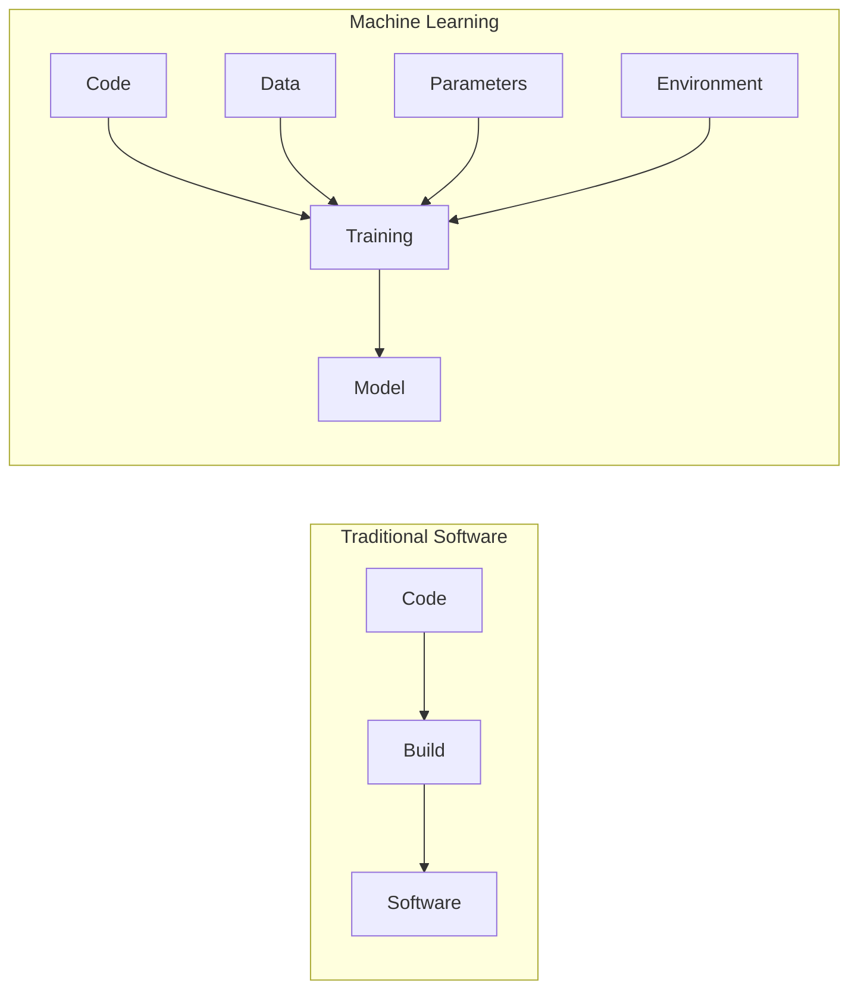

In ML, it's not just about code—a model is the product of both code and data working together. This introduces several complexities:

#### Development Feedback Cycles
While software developers can see the effects of code changes almost instantaneously, ML practitioners must retrain models to see results—potentially taking hours or days with large datasets.

#### Infrastructure Requirements
ML often requires specialized infrastructure (like GPU clusters) that traditional software development does not.

#### Reproducibility Challenges
To reproduce ML results, you need to reproduce both the code environment and the exact data used—dramatically increasing complexity.

#### Versioning Complexity
You must version both code and data, along with model parameters, training environments, and configurations.

----

### Visualization: Traditional Software vs. ML Development

| Traditional Software Development | Machine Learning Development |
|----------------------------------|------------------------------|
| Code → Build → Software | Code + Data + Parameters + Environment → Training → Model |
| Well-established practices | Emerging standards |
| Code versioning sufficient | Must version code, data, and configurations |
| Quick feedback cycles | Lengthy training/evaluation cycles |
| Focused on functionality | Focused on performance and accuracy |

This fundamental difference leads to new challenges in areas like version control, testing, deployment, and monitoring—all of which are addressed by MLOps practices.

---

## The MLOps Lifecycle

The MLOps lifecycle represents the continuous flow of ML development, deployment, and improvement. Unlike the traditional "waterfall" handover from design to development to operations, MLOps emphasizes a continuous feedback loop.

### Understanding the ML Model Lifecycle

In theory, the ML model lifecycle should flow smoothly:

1. Design the model
2. Develop the model
3. Deploy to operations
4. Monitor and gather feedback
5. Update and improve

However, in reality, most organizations still operate with messy manual handovers between model development and operations. This results in significant time-to-market delays, as development is only **10% of the effort**, while **90% is spent on the "glue coding"** required to move models to production.

----

### The Continuous MLOps Loop

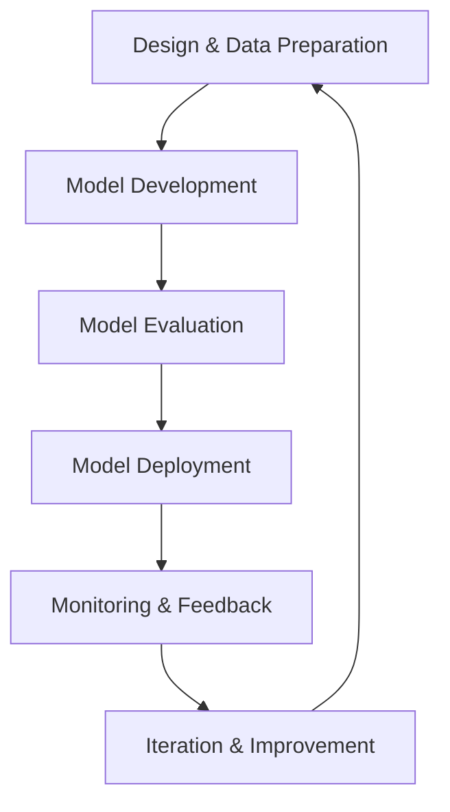

A mature MLOps practice transforms the linear process into a continuous loop:

| Stage | Description |
|-------|-------------|
| **Design and Data Preparation** | Define the problem, gather and prepare data |
| **Model Development** | Experiment with model architectures and hyperparameters |
| **Model Evaluation** | Validate model performance against established metrics |
| **Model Deployment** | Transition the model to the production environment |
| **Monitoring and Feedback** | Continuously observe model performance and data drift |
| **Iteration and Improvement** | Use feedback to update and enhance the model |

This loop operates at two speeds: the longer outer loop of new model development, and the more frequent inner loop of model retraining and updates. Automating both loops is a key goal of MLOps.

---

## Key Stakeholders and Team Structure

Machine learning projects involve diverse roles across multiple disciplines. Understanding these roles and establishing effective collaboration between them is critical to MLOps success.

### Core Roles in MLOps

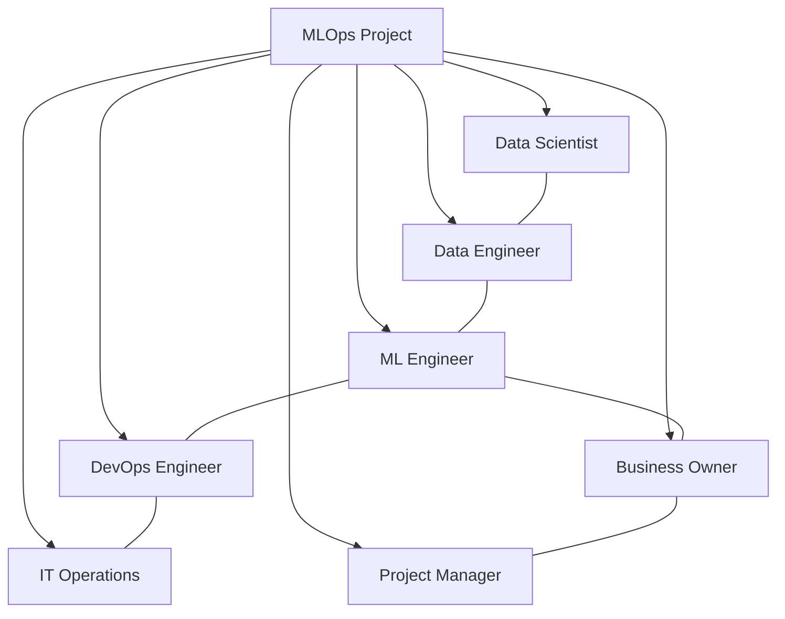

#### Data Scientist
- **Tasks**: Finding data-driven solutions to business problems
- **Background**: Typically highly educated in mathematics, statistics, computer science, or engineering
- **Strengths**: Data wrangling, statistical analysis, data visualization, and applying machine learning
- **Primary focus**: Exploring data and building models (though often spending significant time on data manipulation)

#### Data Engineer
- **Responsibilities**: Building and maintaining data infrastructure
- **Key functions**: Ingesting data from various sources, storing it in centralized data lakes, and transforming it for usability
- **Goal**: Ensuring data is stored and available for data scientists

#### Machine Learning Engineer
- **Role**: Bridging the gap between theoretical ML concepts and production systems
- **Focus**: Automating and scaling model training, testing models before deployment, and handling production deployment
- **Skills**: Understanding both ML theory and engineering practices like CI/CD
- **Tasks**: Often restructuring code written by data scientists to make it production-ready

#### DevOps Engineer
- **Domain**: Intersection of software engineering and cloud infrastructure
- **Function in ML**: Connecting ML models to end-user applications, ensuring scalability and reliability
- **Concerns**: Application performance, stability, and responsiveness

#### IT Operations
- **Responsibilities**: Resource management, access control, information security
- **Value**: Helping projects run smoothly through established processes and governance

#### Business Owner
- **Contribution**: Deep understanding of end-users and use cases
- **Role**: Guiding the team to produce valuable ML systems
- **Tasks**: Defining useful predictions and understanding operational and regulatory risks

#### Manager
- **Challenge**: Navigating the complexity of ML projects
- **Key tasks**: Securing resources from different parts of the organization
- **Responsibility**: Understanding and communicating ROI of the team's work

----

### Cross-Functional Collaboration

> **"The most successful MLOps implementations come from breaking down silos between teams."**

Effective MLOps requires breaking down silos between these roles. The traditional approach where data scientists work in isolation, then "throw the model over the wall" to engineering teams, leads to delays, miscommunication, and failed deployments.

Instead, MLOps promotes:

1. **Shared language and tools**: Common vocabulary and toolsets that all team members understand
2. **Clear hand-off procedures**: Well-defined processes for transitioning work between roles
3. **Collaborative practices**: Joint planning, regular cross-functional meetings, and shared responsibility
4. **T-shaped skills**: Encouraging specialists to develop broad understanding across adjacent domains

In smaller organizations, individuals may fulfill multiple roles. Regardless of organization size, having clear role definitions while maintaining cross-functional collaboration is essential.

---

## Core MLOps Components

### 5.1 Data Engineering and Management

At the foundation of any ML system is data. The quality, availability, and usability of data directly impact model performance and reliability. MLOps emphasizes structured approaches to data management throughout the ML lifecycle.

#### Data Exploration and Validation

Data exploration is the first concrete step in any ML project. The purpose is to understand the data before attempting to model it.

**Key aspects of data exploration**:
- Visual examination of data distributions and relationships
- Identification of patterns, outliers, and potential issues
- Understanding feature characteristics and potential usefulness
- Initial hypothesis formation about the data's predictive power

Data validation establishes guardrails to ensure data quality and consistency, both during initial development and in production:

| Validation Type | Purpose |
|-----------------|---------|
| **Schema validation** | Ensuring data adheres to expected structure and types |
| **Statistical validation** | Checking that distributions match expectations |
| **Integrity checks** | Verifying relationships between data elements |
| **Completeness checks** | Identifying and handling missing values |

**Tools and techniques for data validation**:
- TensorFlow Data Validation
- Great Expectations
- Deequ (for Spark-based validation)
- Custom validation rules based on domain knowledge

#### Feature Engineering and Feature Stores

Feature engineering transforms raw data into the inputs that ML models can effectively use. This process typically includes:

- Cleaning and normalizing data
- Creating derived features that capture domain knowledge
- Encoding categorical variables
- Handling missing values and outliers
- Dimensionality reduction

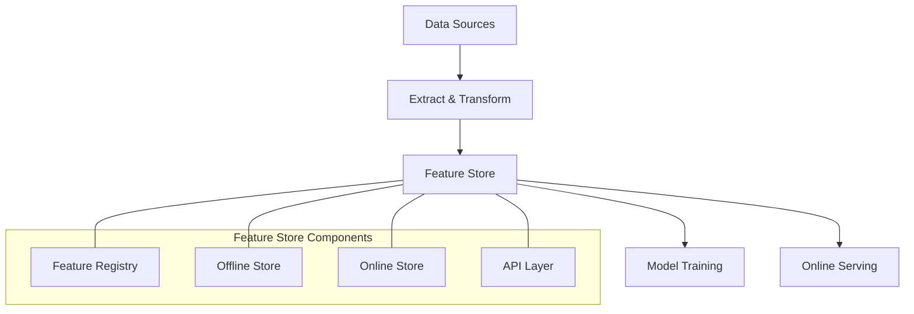

**Feature Stores** are specialized systems that solve several critical challenges in feature management:

1. **Feature computation and serving**: Transforming raw data into feature values and serving them for both training and inference
2. **Feature sharing and reuse**: Allowing teams to discover and reuse features across multiple models
3. **Training-serving skew prevention**: Ensuring consistent feature transformations between training and production
4. **Point-in-time correctness**: Preventing data leakage by respecting temporal boundaries

Feature stores provide several key benefits:
- Accelerating feature development (hours instead of months)
- Enabling data scientists to control features from development to production
- Building a collaborative library of high-quality features
- Deploying features to production instantly
- Sharing, discovering, and reusing features across teams

**Leading feature store solutions include**:

| Open-Source | Commercial |
|-------------|------------|
| Feast | Tecton |
| Hopsworks Feature Store | Amazon SageMaker Feature Store |
|  | Databricks Feature Store |

#### Data Versioning and Lineage

Version control for data is as important as version control for code in ML systems:

- **Data versioning**: Tracking changes to datasets over time
- **Data lineage**: Recording the origin and transformations applied to data
- **Reproducibility**: Ensuring the ability to recreate exact training datasets

**Tools for data versioning include**:
- DVC (Data Version Control)
- Pachyderm
- Delta Lake
- Dolt
- lakeFS

A comprehensive data management strategy addresses:
- Where data is stored
- How it's version-controlled
- How access is governed
- How quality is assured
- How metadata is managed

----

### 5.2 Model Development and Experimentation

Model development is where data scientists spend most of their time. MLOps enhances this process with structure and tracking without impeding creativity and exploration.

#### Experimentation Environments

Effective ML development requires appropriate environments for experimentation:

- **Notebooks**: Interactive environments like Jupyter for exploration and prototyping
- **Development environments**: Structured coding environments with version control integration
- **Compute resources**: Access to sufficient processing power (CPUs, GPUs, TPUs)
- **Standardization**: Consistent environments to prevent "works on my machine" issues

#### Experiment Tracking

Experiment tracking brings order to the naturally iterative process of model development:

| Tracking Element | Purpose |
|------------------|---------|
| **Version control** | Tracking code, data, and parameters for each experiment |
| **Metadata capture** | Recording environment details, dependencies, and configurations |
| **Result logging** | Storing metrics, artifacts, and visualizations |
| **Comparison** | Facilitating easy comparison between experiment runs |

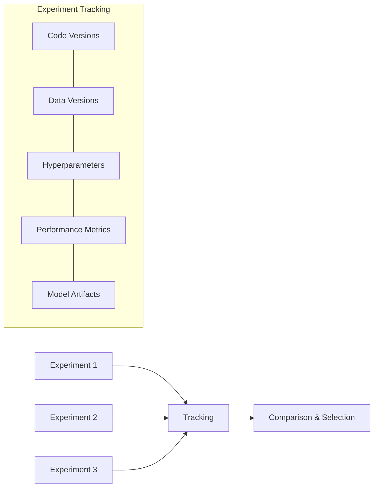

**Key experiment tracking tools**:

| Tool | Key Features |
|------|-------------|
| MLflow | Open-source, comprehensive tracking, model registry |
| Weights & Biases | Visualization-focused, team collaboration features |
| Neptune | Metadata store, experiment comparison |
| Comet ML | Automated experiment logging, collaboration |
| DVC Experiments | Git-integrated experiment tracking |

#### Hyperparameter Optimization

Hyperparameter optimization systematically identifies the best configuration for model performance:

- **Optimization strategies**: Grid search, random search, Bayesian optimization
- **Multi-metric optimization**: Balancing competing metrics (e.g., accuracy vs. inference time)
- **Resource allocation**: Managing computational budget effectively
- **Visualization**: Understanding parameter importance and interactions

**Tools for hyperparameter optimization**:
- Optuna
- Hyperopt
- Ray Tune
- SigOpt
- Katib

#### Model Evaluation and Metrics

Rigorous evaluation ensures models meet performance requirements:

| Evaluation Aspect | Description |
|-------------------|-------------|
| **Training/validation/test splitting** | Proper dataset division to prevent overfitting |
| **Metric selection** | Choosing metrics aligned with business objectives |
| **Evaluation protocols** | Consistent procedures for fair comparison |
| **Specialized evaluation** | Domain-specific assessments (e.g., fairness audits) |

Effective model development and experimentation in MLOps emphasizes:
- Reproducibility of experiments
- Systematic exploration of options
- Rigorous evaluation against established metrics
- Clear documentation of decisions and results

----

### 5.3 CI/CD for Machine Learning

Continuous Integration/Continuous Delivery (CI/CD) practices must be adapted for the unique challenges of ML systems.

#### ML Pipelines

ML pipelines are the backbone of automated model development and deployment:

- **Component-based architecture**: Breaking down the ML workflow into modular steps
- **Pipeline orchestration**: Coordinating the execution of pipeline components
- **Data flow management**: Handling the movement of data between components
- **Parameter passing**: Transferring configuration and results between steps

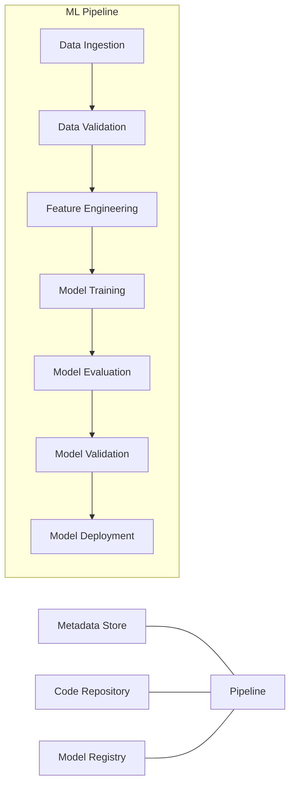

**Example pipeline components**:

| Component | Purpose |
|-----------|---------|
| Data ingestion | Collecting and preparing input data |
| Data validation | Ensuring data quality and consistency |
| Feature engineering | Transforming raw data into model features |
| Model training | Optimizing model parameters using training data |
| Model evaluation | Assessing model performance against metrics |
| Model validation | Verifying model meets all requirements |
| Deployment | Promoting model to production environment |

Unlike a single notebook, pipelines enable:
- Parallel work by different team members
- Systematic testing at each stage
- Automated execution and monitoring
- Simplified troubleshooting and maintenance

#### Automation Strategies

Automation reduces manual effort and increases reliability:

| Strategy | Description |
|----------|-------------|
| **Training automation** | Scheduling regular retraining based on time or data changes |
| **Evaluation automation** | Automatically comparing new models against baselines |
| **Deployment automation** | Streamlining the promotion of models to production |
| **Rollback automation** | Quickly reverting to previous versions when issues arise |

#### Version Control for ML

Version control for ML extends beyond just code:

- **Model versioning**: Tracking model artifacts and their lineage
- **Pipeline versioning**: Maintaining the history of pipeline configurations
- **Experiment versioning**: Recording the parameters and results of each run
- **Component versioning**: Managing the evolution of individual pipeline components

**Tools supporting ML version control**:

| Tool | Purpose |
|------|---------|
| Git | Code version control |
| DVC | Data and model version control |
| MLflow Model Registry | Model versioning and stages |
| Pachyderm | Pipeline and data versioning |
| Neptune | Experiment tracking and versioning |

#### Containerization

Containerization provides consistent environments across development and production:

- **Docker containers**: Packaging code, dependencies, and runtime environment
- **Kubernetes orchestration**: Managing container deployment and scaling
- **Standardized interfaces**: Facilitating component integration and reusability
- **Isolation**: Preventing conflicts between different ML workloads

Effective CI/CD for ML emphasizes:
- The pipeline as the product (not just the model)
- Automation of repetitive tasks
- Comprehensive versioning of all artifacts
- Consistent environments throughout the lifecycle

----

### 5.4 Testing and Quality Assurance

Testing ML systems presents unique challenges beyond traditional software testing, requiring specialized approaches to ensure reliability.

#### Data Testing

Data testing verifies the quality and consistency of data inputs:

- **Schema testing**: Validating that data structure matches expectations
- **Distribution testing**: Checking that statistical properties remain consistent
- **Relationship testing**: Ensuring correlations and dependencies are as expected
- **Edge case testing**: Verifying handling of unusual or extreme values

**Example data tests**:

| Test Type | Examples |
|-----------|----------|
| Quality checks | Null value detection, outlier identification |
| Distribution checks | Feature distribution stability, feature correlation analysis |
| Balance checks | Class balance verification, sampling bias detection |
| Drift detection | Feature drift monitoring, concept drift detection |

#### Model Testing

Model testing ensures predictive performance and reliability:

| Test Type | Purpose |
|-----------|---------|
| **Performance testing** | Validating metrics on hold-out test sets |
| **Stability testing** | Verifying consistent performance across data subsets |
| **Stress testing** | Assessing behavior with challenging or adversarial inputs |
| **Threshold testing** | Confirming model behavior at decision boundaries |
| **A/B testing** | Comparing model performance against alternatives |

#### Infrastructure Testing

Infrastructure testing ensures reliable operation in production:

- **Load testing**: Verifying performance under expected traffic volumes
- **Latency testing**: Measuring and optimizing response times
- **Scalability testing**: Confirming ability to handle increased load
- **Failover testing**: Ensuring graceful handling of component failures
- **Integration testing**: Validating interactions with other systems

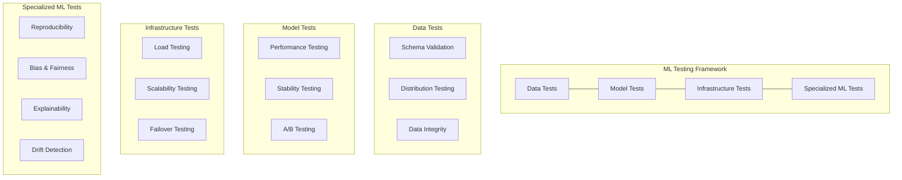

#### Specialized ML Testing

ML systems require additional testing approaches:

| Approach | Description |
|----------|-------------|
| **Reproducibility testing** | Verifying consistent results across runs |
| **Bias and fairness testing** | Detecting and mitigating discriminatory outcomes |
| **Explainability testing** | Ensuring model decisions can be interpreted |
| **Robustness testing** | Confirming resilience to data perturbations |
| **Concept drift detection** | Identifying when model assumptions no longer hold |

**Testing frameworks and tools**:
- Great Expectations (data testing)
- TensorFlow Model Analysis
- Deepchecks
- Alibi Detect
- Seldon Alibi

Comprehensive testing strategies should:
- Address both data and model quality
- Include automated tests in CI/CD pipelines
- Balance offline testing with production monitoring
- Establish clear quality gates for model promotion

----

### 5.5 Deployment and Serving

Deploying ML models to production involves architectural decisions that impact scalability, latency, and maintenance.

#### Deployment Strategies

Different strategies offer tradeoffs in safety, speed, and complexity:

| Strategy | Description | Best For |
|----------|-------------|----------|
| **Blue/Green deployment** | Running parallel environments for zero-downtime switching | High-availability use cases |
| **Canary deployment** | Gradually shifting traffic to new model versions | Validating models with real traffic |
| **Shadow deployment** | Testing new models with production traffic without affecting outcomes | High-risk model changes |
| **Multi-armed bandit** | Dynamically allocating traffic based on performance | Optimizing between multiple models |

#### Batch vs. Online Inference

The choice between batch and online inference depends on use case requirements:

**Batch inference**:
- Processes data in scheduled intervals
- Advantages: Higher throughput, easier scaling, lower operational complexity
- Use cases: Daily recommendations, periodic risk scoring, non-real-time analytics

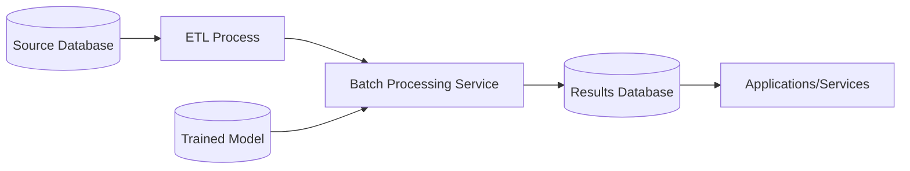

**Online inference**:
- Processes requests in real-time
- Advantages: Immediate responses, handling of fresh data
- Use cases: Fraud detection, real-time bidding, interactive applications
- Challenges: Latency requirements, unpredictable traffic patterns, high availability needs

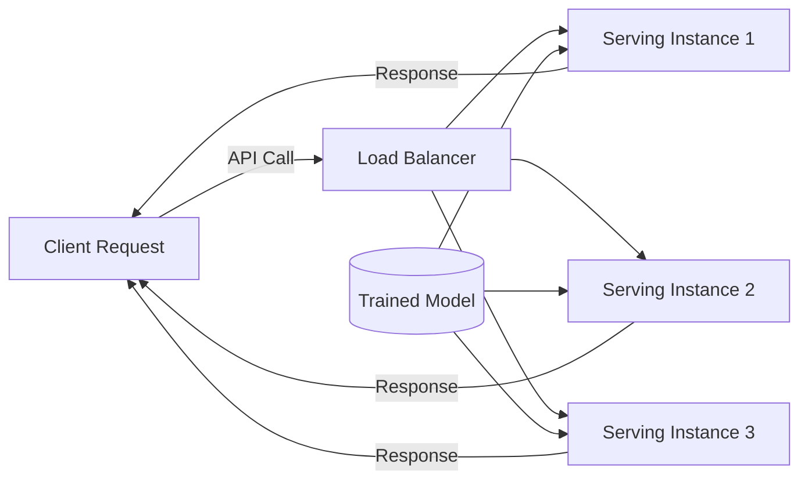

#### Edge Deployment

Edge deployment moves inference to user devices or local servers:

- Advantages: Lower latency, reduced bandwidth, offline operation, privacy
- Challenges: Device heterogeneity, model size constraints, update management
- Use cases: Mobile applications, IoT devices, environments with connectivity limitations

#### Model Serving Infrastructure

Infrastructure choices impact performance, scalability, and operability:

| Option | Examples | Best For |
|--------|----------|----------|
| **Dedicated serving frameworks** | TensorFlow Serving, NVIDIA Triton, Seldon Core | High-performance requirements |
| **Serverless options** | AWS Lambda, Azure Functions, Google Cloud Functions | Variable load, cost efficiency |
| **Kubernetes-based** | KServe, Kubeflow Serving | Enterprise-scale deployments |
| **API frameworks** | Flask, FastAPI with custom model serving | Simple use cases, custom logic |

#### Scaling Considerations

Effective scaling ensures reliable performance under varying loads:

- **Horizontal scaling**: Adding more serving instances
- **Vertical scaling**: Increasing resources for existing instances
- **Autoscaling**: Dynamically adjusting resources based on demand
- **Load balancing**: Distributing requests across multiple instances
- **Caching**: Storing common inference results to reduce computation

Deployment best practices include:
- Standardizing model packaging formats
- Implementing progressive rollout strategies
- Establishing rollback procedures
- Monitoring performance continuously
- Optimizing for both reliability and resource efficiency

----

### 5.6 Monitoring and Observability

Once models are deployed, ongoing monitoring ensures they continue to perform as expected and detects issues before they impact business outcomes.

#### Performance Monitoring

Performance monitoring tracks the technical health of ML systems:

| Metric | Description |
|--------|-------------|
| **Throughput** | Requests processed per time period |
| **Latency** | Response time distribution |
| **Error rates** | Failed requests and exceptions |
| **Resource utilization** | CPU, memory, GPU, network usage |
| **Availability** | Uptime and service level objective (SLO) compliance |

#### Data Drift Detection

Data drift occurs when production data differs from training data:

| Drift Type | Description |
|------------|-------------|
| **Feature drift** | Changes in individual feature distributions |
| **Covariate shift** | Changes in input distribution without changes in the relationship to the target |
| **Concept drift** | Changes in the relationship between inputs and target |
| **Prediction drift** | Changes in the distribution of model outputs |

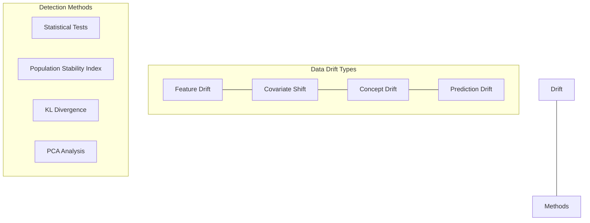

**Monitoring approaches**:
- Statistical tests for distribution comparison
- Population stability index (PSI)
- Kullback-Leibler divergence
- Principal component analysis for multivariate drift

#### Model Performance Monitoring

Model performance monitoring tracks how well models are achieving their objectives:

- **Accuracy metrics**: Tracking standard performance metrics (accuracy, F1, AUC, etc.)
- **Business metrics**: Monitoring impact on KPIs (conversion rates, revenue, etc.)
- **Segment performance**: Analyzing model behavior across different subpopulations
- **Ground truth collection**: Gathering actual outcomes for comparison with predictions

#### Alerting and Notification

Effective alerting ensures timely response to issues:

| Component | Purpose |
|-----------|---------|
| **Thresholds** | Setting acceptable ranges for key metrics |
| **Anomaly detection** | Identifying unusual patterns in monitoring data |
| **Alert routing** | Directing notifications to appropriate teams |
| **Incident management** | Processes for investigating and resolving issues |
| **Feedback loops** | Using alerts to trigger retraining or model updates |

**Monitoring tools and platforms**:

| Tool | Focus Area |
|------|------------|
| Prometheus with Grafana | General monitoring and visualization |
| Evidently AI | ML-specific monitoring and drift detection |
| Arize | Model performance and explainability |
| WhyLabs | ML observability and data quality |
| New Relic/Datadog | Application performance with ML monitoring |

Comprehensive monitoring should:
- Include both technical and business metrics
- Establish clear thresholds and alert conditions
- Provide actionable diagnostics for troubleshooting
- Support both real-time and historical analysis
- Feed back into the MLOps lifecycle for continuous improvement

----

### 5.7 Governance and Compliance

ML governance establishes frameworks for responsible model development, deployment, and operation.

#### Regulatory Compliance

ML systems must comply with various regulations depending on industry and location:

| Regulation | Focus Area |
|------------|------------|
| **GDPR** | Data privacy, explainability, right to be forgotten |
| **CCPA/CPRA** | California's regulations on consumer data protection |
| **HIPAA** | Healthcare data privacy and security |
| **FCRA** | Fair Credit Reporting Act for lending decisions |
| **Industry-specific** | Financial services (Basel, CCAR), healthcare (FDA), autonomous systems |

#### Model Governance

Model governance establishes processes for oversight and accountability:

- **Model inventories**: Cataloging all models and their purposes
- **Review processes**: Structured evaluation before deployment
- **Approval workflows**: Clear sign-off requirements for model releases
- **Documentation standards**: Comprehensive records of model development
- **Audit trails**: Evidence of compliance with policies and regulations

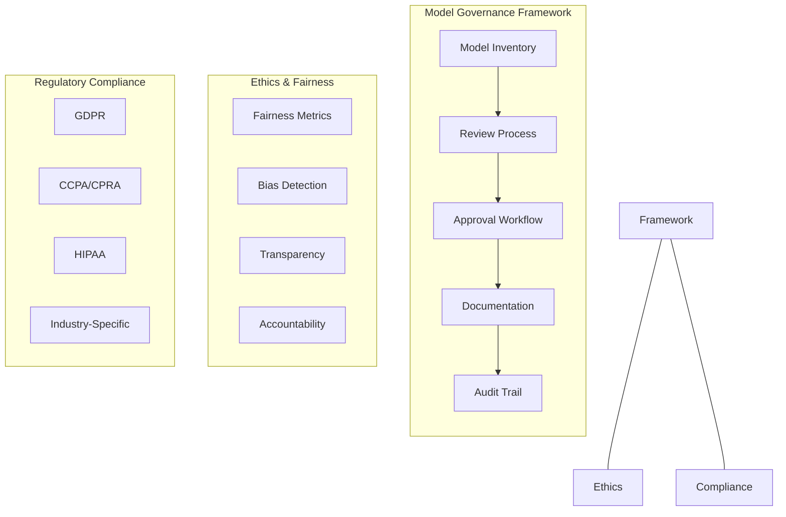

#### Ethics and Fairness

Ethical considerations ensure ML systems align with organizational values:

| Consideration | Approach |
|---------------|----------|
| **Fairness metrics** | Measuring disparate impact across protected groups |
| **Bias detection** | Identifying and mitigating unintended biases |
| **Transparency** | Making model decisions understandable to stakeholders |
| **Accountability** | Establishing responsibility for model outcomes |
| **Privacy protection** | Safeguarding sensitive data used in models |

#### Model Documentation

Thorough documentation supports both compliance and knowledge transfer:

- **Model cards**: Standardized documentation of model details and limitations
- **Datasheets**: Documentation of dataset characteristics and collection methods
- **Decision records**: Documentation of key design choices and their rationale
- **Usage guidelines**: Clear instructions for appropriate model application
- **Risk assessments**: Analysis of potential failure modes and mitigations

**Governance tools and frameworks**:
- Model Cards Toolkit
- Fairlearn
- AI Fairness 360
- ML Metadata (MLMD)
- Datasheets for Datasets
- DVC Studio

Effective governance approaches should:
- Integrate with existing enterprise governance
- Balance compliance with innovation
- Establish clear roles and responsibilities
- Automate compliance where possible
- Adapt to evolving regulatory landscapes

---

## Measuring Success in MLOps

Measuring the success of MLOps initiatives requires metrics that capture both technical efficiency and business impact.

### Key Performance Indicators

Effective MLOps measurement considers multiple dimensions:

#### Time to Market Metrics

| Metric | Description |
|--------|-------------|
| **Development cycle time** | Duration from idea to production deployment |
| **Model refresh time** | Time required to update models with new data |
| **Experiment throughput** | Number of experiments completed per time period |
| **Release frequency** | How often new or updated models are deployed |

#### Reliability Metrics

| Metric | Description |
|--------|-------------|
| **Model reliability** | Mean time between failures (MTBF) |
| **Recovery time** | Mean time to recover (MTTR) from issues |
| **Successful deployment rate** | Percentage of deployments without incidents |
| **SLA compliance** | Meeting defined service level agreements |

#### Quality Metrics

| Metric | Description |
|--------|-------------|
| **Technical debt** | Tracking and reducing maintenance burden |
| **Code quality** | Adherence to established standards |
| **Test coverage** | Percentage of code and functionality covered by tests |
| **Documentation completeness** | Comprehensiveness of system documentation |

#### Business Impact Metrics

| Metric | Description |
|--------|-------------|
| **Model performance** | Improvement in key performance metrics |
| **Cost efficiency** | Reduction in computational or operational costs |
| **Business value** | Contribution to revenue, cost savings, or other KPIs |
| **User adoption** | Uptake and usage of ML-powered features |

----

### Balancing Technical and Business Metrics

> **"Successful MLOps initiatives require balance between technical excellence and business outcomes."**

Successful MLOps initiatives require balance between technical excellence and business outcomes:

- **Technical focus without business alignment** leads to sophisticated systems that don't deliver value
- **Business focus without technical rigor** leads to short-term gains but long-term maintenance issues

----

### Measurement Framework

A comprehensive measurement framework includes:

1. **Baseline establishment**: Documenting the starting point
2. **Regular assessment**: Continuous tracking of key metrics
3. **Comparative analysis**: Benchmarking against industry standards
4. **Improvement targets**: Setting specific, measurable goals
5. **Feedback loops**: Using measurements to inform process improvements

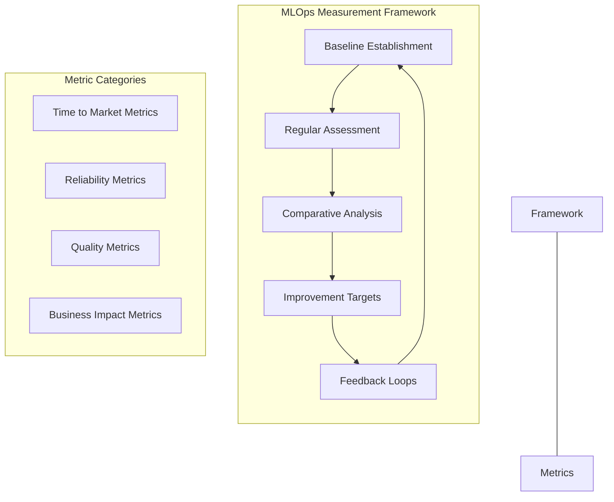

Effective measurement should:
- Align with organizational objectives
- Focus on outcomes rather than activities
- Include both leading and lagging indicators
- Support continuous improvement
- Inform resource allocation decisions

---

## MLOps Maturity Model

Organizations typically evolve through distinct stages of MLOps maturity, each with characteristic capabilities and limitations.

### Level 0: Manual Process

**Characteristics**:
- Manual, ad-hoc development and deployment
- Disconnected experimentation and production environments
- Heavy reliance on individual knowledge
- Limited reproducibility and version control
- Minimal testing and monitoring

**Challenges**:
- Knowledge silos and bus factor risks
- Long deployment cycles
- Difficulty maintaining models in production
- Limited collaboration between data scientists and engineers

----

### Level 1: ML Pipeline Automation

**Characteristics**:
- Automated training pipelines
- Basic versioning of code and data
- Standardized development environments
- Initial test automation
- Manual deployment processes

**Improvements**:
- More reliable model training
- Better reproducibility of experiments
- Reduced dependency on individual knowledge
- Easier collaboration on model development

----

### Level 2: CI/CD Pipeline Automation

**Characteristics**:
- Automated testing and deployment pipelines
- Standardized model packaging
- Continuous integration practices
- Systematic model evaluation
- Basic monitoring and alerting

**Improvements**:
- Faster deployment cycles
- More reliable production environments
- Earlier detection of issues
- Clearer handoffs between development and operations

----

### Level 3: Automated Operations

**Characteristics**:
- Comprehensive monitoring and observability
- Automated retraining triggered by data or performance changes
- Sophisticated testing frameworks
- Governance and compliance automation
- Self-healing systems and automated incident response

**Improvements**:
- Proactive handling of model decay
- Rapid adaptation to changing conditions
- Reduced operational overhead
- Strong alignment with regulatory requirements

----

### Level 4: Full MLOps Optimization

**Characteristics**:
- Seamless integration across the entire ML lifecycle
- Advanced experimentation platforms
- Sophisticated feature stores and data management
- Automated A/B testing and progressive deployment
- Comprehensive governance frameworks

**Improvements**:
- Maximum development velocity
- Optimal resource utilization
- Minimized risk exposure
- Full traceability and auditability

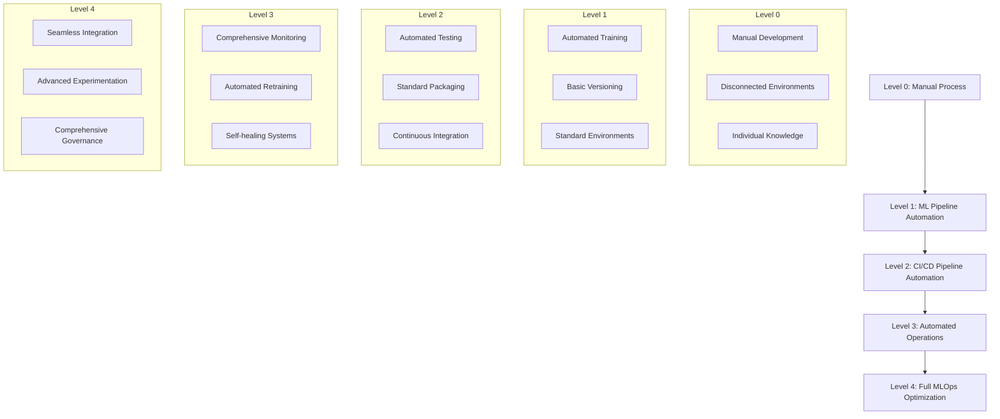

----

### Maturity Assessment

Organizations can assess their MLOps maturity by evaluating:

| Dimension | Assessment Questions |
|-----------|----------------------|
| **Process automation** | What percentage of the ML lifecycle is automated? |
| **Infrastructure standardization** | How consistent are environments and tools? |
| **Collaboration effectiveness** | How well do different roles work together? |
| **Risk management** | What processes exist for identifying and mitigating risks? |
| **Governance implementation** | What frameworks are in place for oversight and compliance? |

Advancing through maturity levels requires:
- Executive sponsorship and resource allocation
- Incremental improvement rather than big-bang transformations
- Cultural change alongside technical implementations
- Balanced focus across all MLOps dimensions
- Regular reassessment and adjustment of approaches

---

## MLOps Tools Landscape

The MLOps tools landscape continues to evolve rapidly, with solutions addressing different aspects of the ML lifecycle.

### Categories of MLOps Tools

#### Data Management Tools

| Category | Notable Tools |
|----------|---------------|
| **Data versioning** | DVC, Pachyderm, lakeFS |
| **Feature stores** | Feast, Tecton, SageMaker Feature Store, Hopsworks |
| **Data quality** | Great Expectations, TensorFlow Data Validation, Deequ |
| **Data labeling** | Label Studio, Labelbox, Scale AI |

#### Experiment Management

| Category | Notable Tools |
|----------|---------------|
| **Experiment tracking** | MLflow, Weights & Biases, Neptune, Comet ML |
| **Hyperparameter optimization** | Optuna, Ray Tune, SigOpt, Hyperopt |
| **Notebook management** | Jupyter Hub, Papermill, Neptyne |
| **Visualization** | TensorBoard, Plotly, Streamlit |

#### ML Pipelines and Orchestration

| Category | Notable Tools |
|----------|---------------|
| **Pipeline platforms** | Kubeflow Pipelines, TFX, Metaflow, Argo Workflows |
| **Workflow management** | Airflow, Prefect, Luigi, Dagster |
| **Resource orchestration** | Kubernetes, Slurm, Ray |

#### Model Deployment and Serving

| Category | Notable Tools |
|----------|---------------|
| **Serving frameworks** | TensorFlow Serving, NVIDIA Triton, Seldon Core, KServe |
| **Inference optimization** | ONNX Runtime, TensorRT, OpenVINO |
| **Edge deployment** | TensorFlow Lite, ONNX Runtime Mobile, CoreML |

#### Monitoring and Observability

| Category | Notable Tools |
|----------|---------------|
| **ML-specific monitoring** | Evidently AI, WhyLabs, Arize, Fiddler |
| **General monitoring** | Prometheus, Grafana, New Relic, Datadog |
| **Drift detection** | Alibi Detect, TensorFlow Model Analysis, NannyML |

#### Governance and Documentation

| Category | Notable Tools |
|----------|---------------|
| **Model management** | MLflow Model Registry, SageMaker Model Registry |
| **Documentation tools** | Model Cards Toolkit, Datatwig |
| **Compliance frameworks** | Fairlearn, AI Fairness 360 |

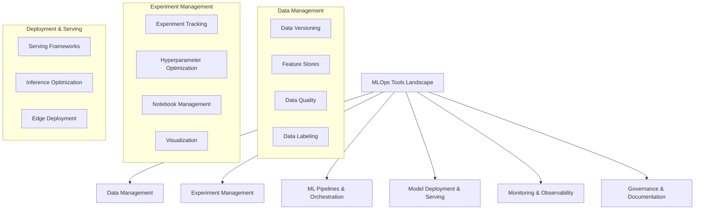

----

### Integrated Platforms vs. Best-of-Breed

Organizations face a choice between:

**Integrated platforms**:
- Examples: AWS SageMaker, Azure ML, Google Vertex AI, Databricks, Domino Data Lab
- Advantages: Cohesive experience, simplified vendor management, pre-built integrations
- Limitations: Potential vendor lock-in, may lack specialized capabilities

**Best-of-breed approach**:
- Examples: Combining specialized tools for different ML lifecycle stages
- Advantages: Best capabilities for each function, flexibility to adapt
- Limitations: Integration complexity, multiple vendor relationships, potential gaps

----

### Open Source vs. Commercial Solutions

**Open source tools**:
- Advantages: Cost-effective, community support, customizability
- Limitations: May require more internal expertise, support concerns

**Commercial solutions**:
- Advantages: Professional support, enterprise features, compliance guarantees
- Limitations: Licensing costs, potential lock-in

----

### Tool Selection Criteria

Organizations should evaluate tools based on:

1. **Functional requirements**: Coverage of necessary capabilities
2. **Technical fit**: Alignment with existing technology stack
3. **Scalability**: Ability to grow with organizational needs
4. **Usability**: Adoption potential across different user groups
5. **Security and compliance**: Meeting regulatory requirements
6. **Total cost of ownership**: Including licensing, infrastructure, and maintenance

The most effective approach often combines:
- Core platform providing foundational capabilities
- Specialized tools for specific high-value functions
- Custom components for unique organizational needs
- Integration layer connecting disparate elements

---

## Implementation Strategies

Implementing MLOps requires strategic planning and execution to achieve sustainable success.

### Starting Small: The Pilot Approach

Beginning with a focused pilot project allows organizations to:
- Demonstrate value quickly
- Learn and adapt before scaling
- Build internal expertise
- Identify organization-specific challenges

**Effective pilot characteristics**:
- Well-defined scope with clear success criteria
- High-visibility use case with business impact
- Manageable technical complexity
- Cross-functional team representation
- Executive sponsorship

----

### Building the Foundation

Core infrastructure and practices to establish early:

| Foundation Element | Description |
|-------------------|-------------|
| **Version control** | For all artifacts: code, data, models, and configurations |
| **Standardized environments** | Consistent development and deployment contexts |
| **Basic automation** | Initial CI/CD pipelines for model training and deployment |
| **Documentation standards** | Templates and expectations for knowledge capture |
| **Monitoring fundamentals** | Essential metrics for model and system health |

----

### Scaling Progressively

As initial implementations prove successful, organizations can scale by:

- **Expanding use cases**: Applying MLOps practices to additional models
- **Enhancing capabilities**: Adding more sophisticated tools and practices
- **Broadening adoption**: Bringing more teams into the MLOps framework
- **Deepening integration**: Connecting MLOps with other enterprise systems
- **Increasing automation**: Reducing manual interventions throughout the lifecycle

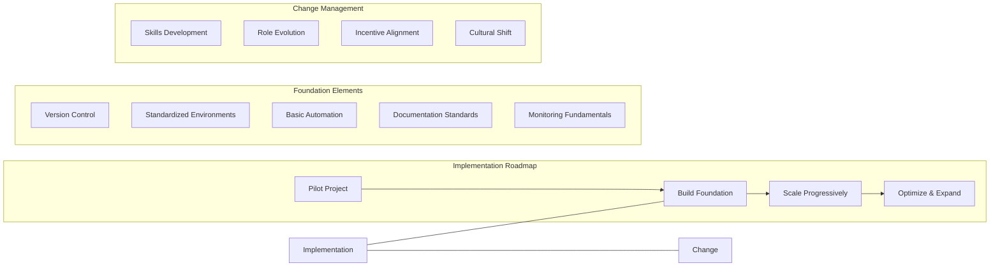

----

### Change Management

Successful MLOps implementation requires organizational change:

- **Skills development**: Training teams on new tools and practices
- **Role evolution**: Adapting job descriptions and responsibilities
- **Incentive alignment**: Rewarding collaborative behavior and operational excellence
- **Communication**: Clearly articulating benefits and expectations
- **Cultural shift**: Moving from siloed experimentation to collaborative production

----

### Common Implementation Pitfalls

> **Warning**: Organizations often focus on tools without addressing the underlying process and cultural changes.

Organizations should be aware of common challenges:

| Pitfall | Description |
|---------|-------------|
| **Tool focus without process change** | Implementing technology without adapting workflows |
| **Boil-the-ocean approaches** | Attempting too much transformation at once |
| **Ignoring cultural factors** | Focusing solely on technical elements |
| **Insufficient executive support** | Lacking leadership commitment to change |
| **Isolated implementation** | Failing to integrate with broader IT and data practices |

----

### Building Long-term Capability

Sustainable MLOps capability requires:

1. **Center of excellence**: Establishing MLOps expertise and governance
2. **Community of practice**: Fostering knowledge sharing across teams
3. **Continuous improvement**: Regularly reassessing and enhancing practices
4. **Measurement framework**: Tracking progress against defined metrics
5. **Technology roadmap**: Planning for tool evolution and expansion

Effective implementation balances:
- Short-term wins with long-term foundation building
- Technical excellence with practical business outcomes
- Standardization with flexibility for innovation
- Process rigor with pragmatic adaptation

---

## Case Studies and Real-World Examples

### Success Story: Company A - Building a Foundation First

**Starting Point**:
- Multiple data science teams working in isolation
- Models rarely making it to production
- Long deployment cycles (3-6 months)
- Limited collaboration between data scientists and engineers

**Approach**:
- Established cross-functional MLOps team with representatives from data science, engineering, and IT
- Implemented standardized development environments and basic version control
- Built automated training pipelines with consistent evaluation metrics
- Created model registry and deployment protocols
- Developed monitoring dashboard for all production models

**Results**:
- Deployment time reduced from months to weeks
- 300% increase in models successfully deployed to production
- 70% reduction in production incidents
- Improved model performance through faster iteration cycles
- Enhanced collaboration between data science and engineering teams

**Key Success Factors**:
- Executive sponsorship from both CTO and Chief Data Officer
- Focus on solving practical pain points rather than theoretical perfection
- Incremental implementation starting with highest-value capabilities
- Regular showcases of progress and business impact

----

### Cautionary Tale: Company B - The "Big Bang" Approach

**Starting Point**:
- Ad-hoc model development and deployment
- Heavy reliance on manual processes
- Siloed teams with minimal collaboration
- Growing regulatory pressure for model governance

**Approach**:
- Ambitious plan to implement comprehensive MLOps platform
- Large upfront investment in commercial tooling
- Mandate for all teams to adopt new processes simultaneously
- Extensive custom integrations with existing systems

**Challenges Encountered**:
- Tool complexity overwhelmed teams with limited MLOps experience
- Integration issues delayed implementation by months
- Teams reverted to shadow IT practices to meet deadlines
- Unclear ownership of cross-functional processes
- Insufficient focus on cultural and organizational change

**Recovery Strategy**:
- Reset expectations and developed phased implementation plan
- Identified critical capabilities and prioritized accordingly
- Established MLOps center of excellence to provide guidance
- Created targeted training program for different user roles
- Implemented metrics to track adoption and impact

**Lessons Learned**:
- Start with minimum viable MLOps rather than perfect solution
- Prioritize adoption over comprehensive functionality
- Invest in change management and skills development
- Build momentum through early wins
- Align MLOps implementation with existing project timelines

----

### Industry-Specific Example: Financial Services

**Unique Challenges**:
- Stringent regulatory requirements (model risk management)
- Need for extensive model documentation and validation
- Complex approval processes for model deployment
- High expectations for model explainability
- Sensitive data with privacy implications

**MLOps Adaptations**:
- Enhanced governance workflows integrated into MLOps pipelines
- Automated generation of model documentation for regulatory review
- Extended testing protocols for bias, fairness, and explainability
- Versioning of all model artifacts for audit purposes 
- Strict separation of development and production environments

**Implementation Strategy**:
- Collaboration between data science, technology, and compliance teams
- Explicit mapping of MLOps processes to regulatory requirements
- Standardized templates for model documentation and review
- Regular engagement with regulatory bodies to ensure alignment
- Comprehensive model inventory and lineage tracking

**Outcomes**:
- 40% reduction in model validation cycle time
- Improved audit readiness with comprehensive documentation
- Enhanced model performance through more rapid iteration
- Increased confidence from regulatory teams
- Better resource allocation to high-value modeling activities

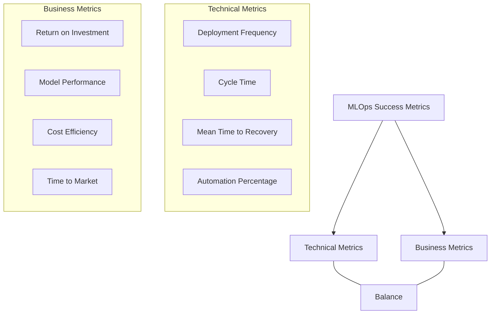

These case studies highlight that successful MLOps implementation requires:
- Clear alignment with business objectives
- Balanced focus on technology, process, and people
- Realistic expectations and incremental improvement
- Adaptation to industry-specific requirements
- Measurement of both technical and business outcomes

----