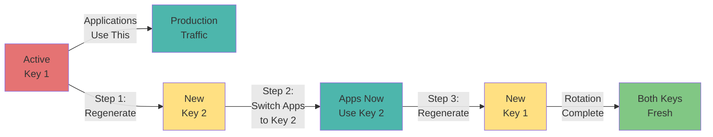
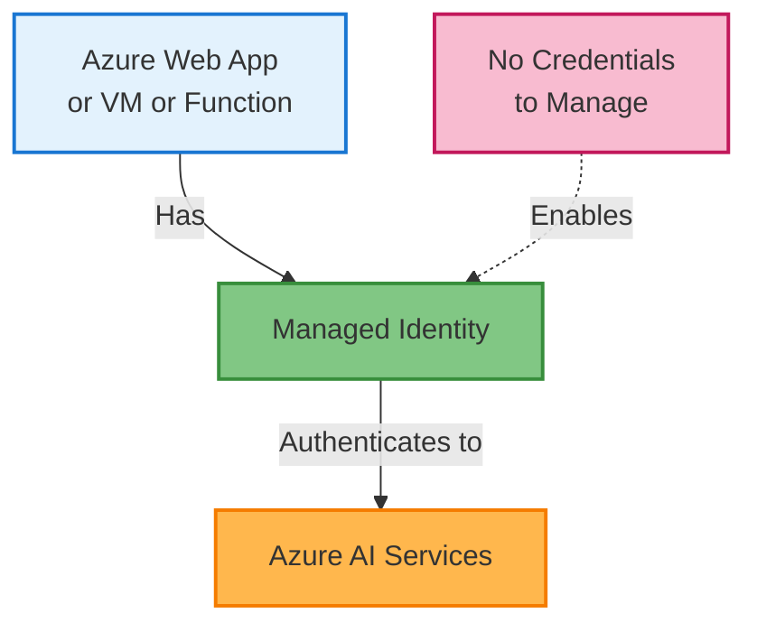
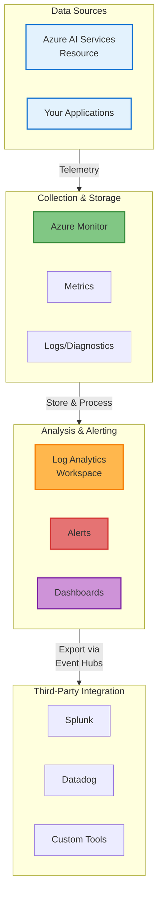
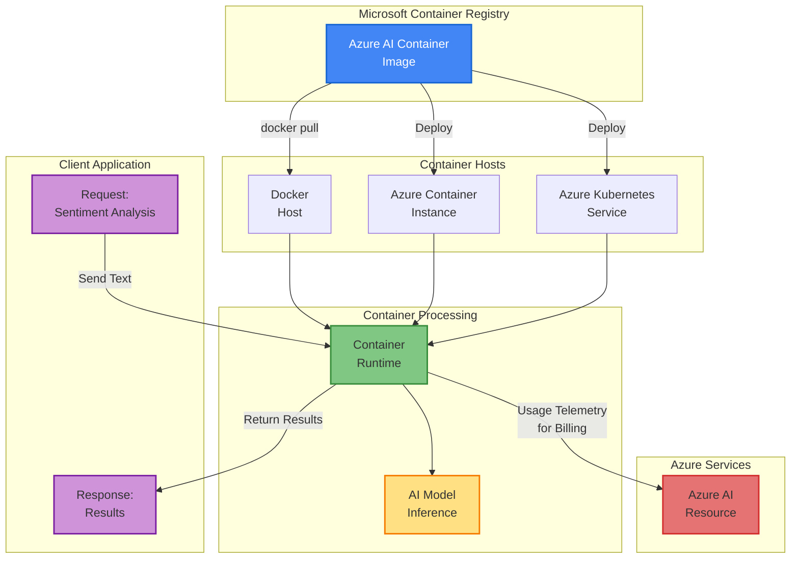
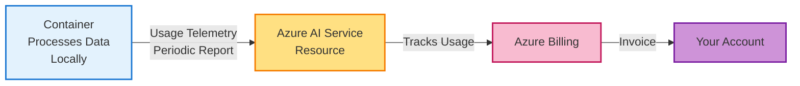

# Azure AI Services for Enterprise Applications

<div style="background: linear-gradient(135deg, #0078D4 0%, #00BCF2 100%); color: white; padding: 1.5rem; border-radius: 10px; margin-bottom: 2rem;">
  <div style="display: flex; justify-content: space-between; align-items: center;">
    <div>
      <h2 style="margin: 0; color: white;">🏢 Enterprise-Grade Deployment</h2>
      <p style="margin: 0.5rem 0 0 0; opacity: 0.9;">Security, Monitoring, and Containerization at Scale</p>
    </div>
  </div>
</div>

## 📋 Table of Contents

<!--ts-->
   * [Learning Objectives](#-learning-objectives)
   * [Overview](#overview)
   * [Securing Azure AI Services](#securing-azure-ai-services)
   * [Monitoring and Optimizing AI Usage](#monitoring-and-optimizing-ai-usage)
   * [Deploying AI Services in Containers](#deploying-ai-services-in-containers)
   * [Production Best Practices](#production-best-practices)
<!--te-->

---

## 🎯 Learning Objectives

By the end of this section, you will be able to:

<div style="background: #E3F2FD; padding: 1.5rem; border-radius: 10px; border-left: 4px solid #1976D2; margin: 1rem 0;">

- ✅ **Authenticate and secure AI services** using key rotation, Azure Key Vault, and managed identities

- ✅ **Monitor and optimize AI usage** by tracking metrics, viewing logs, and analyzing performance data

- ✅ **Deploy AI services in containers** for local processing while maintaining billing and licensing with Azure

- ✅ **Operate AI services in production environments** with enterprise-grade security and observability

- ✅ **Implement data isolation and compliance** requirements for sensitive workloads

</div>

---

## 📌 Overview

Building AI solutions is just the beginning. True success in enterprise environments requires:

<div style="display: grid; grid-template-columns: repeat(auto-fit, minmax(280px, 1fr)); gap: 1.5rem; margin: 2rem 0;">

<div style="background: #FFF3E0; padding: 1.5rem; border-radius: 10px; border-left: 4px solid #F57C00;">
  <h3 style="margin-top: 0; color: #F57C00;">🔐 Security Management</h3>
  <p>Protect API keys, manage credentials, and ensure only authorized applications access your AI services.</p>
</div>

<div style="background: #E8F5E9; padding: 1.5rem; border-radius: 10px; border-left: 4px solid #388E3C;">
  <h3 style="margin-top: 0; color: #388E3C;">📊 Observability</h3>
  <p>Track performance, identify issues, and optimize costs through comprehensive monitoring and analytics.</p>
</div>

<div style="background: #E0F7FA; padding: 1.5rem; border-radius: 10px; border-left: 4px solid #00838F;">
  <h3 style="margin-top: 0; color: #00838F;">📦 Containerization</h3>
  <p>Run AI models locally in controlled environments while maintaining compliance and data sovereignty.</p>
</div>

</div>

---

## 🔐 Securing Azure AI Services

Security is paramount in enterprise environments. Azure provides multiple methods to protect your AI service credentials.

### Three Key Security Methods

#### 1️⃣ Key Rotation Strategy

<div style="background: #FFEBEE; padding: 1.5rem; border-radius: 10px; border-left: 4px solid #F44336; margin: 1rem 0;">

**Why Rotate Keys?**
- 🔄 Reduces exposure from leaked credentials
- 🛡️ Industry best practice for security
- 📋 Compliance requirement for many organizations

**How to Rotate Keys Safely:**



**Rotation Process:**

| Step | Action | Details |
|------|--------|---------|
| **1** | Regenerate Secondary Key | Generate a new Key 2 |
| **2** | Update Applications | Switch all apps to use Key 2 |
| **3** | Regenerate Primary Key | Generate a new Key 1 while apps use Key 2 |
| **4** | Complete Rotation | Both keys are now fresh and secure |

**🎯 Best Practice:** Rotate keys every 90 days or when staff with access leaves your organization.

</div>

#### 2️⃣ Azure Key Vault Integration

<div style="background: #E8F5E9; padding: 1.5rem; border-radius: 10px; border-left: 4px solid #388E3C; margin: 1rem 0;">

**The Problem:**

```python
# ❌ BAD: Hardcoded keys
api_key = "abc123xyz789abc123xyz789abc123"
endpoint = "https://ai102.cognitiveservices.azure.com/"
```

**The Solution:**

<div style="background: #E3F2FD; padding: 1rem; border-radius: 8px; margin: 1rem 0; border-left: 4px solid #1976D4;">

**Azure Key Vault** is a secure vault for storing and retrieving secrets:

```python
# ✅ GOOD: Store keys in Key Vault
from azure.identity import DefaultAzureCredential
from azure.keyvault.secrets import SecretClient

# Initialize Key Vault client
credential = DefaultAzureCredential()
vault_url = "https://myvault.vault.azure.net/"
client = SecretClient(vault_url=vault_url, credential=credential)

# Retrieve API key securely
api_key = client.get_secret("ai-service-key").value
endpoint = client.get_secret("ai-service-endpoint").value

# Use credentials in your application
```

</div>

**Benefits:**

| Benefit | Explanation |
|---------|-------------|
| 🔒 **Encryption at Rest** | Keys encrypted when stored in the vault |
| 🔑 **Encryption in Transit** | Keys encrypted when retrieved over network |
| 📝 **Audit Logging** | All access attempts logged for compliance |
| 🔄 **Easy Rotation** | Update secrets without redeploying apps |
| 👥 **Access Control** | Grant vault access only to who needs it |

**🎯 Best Practice:** Always use Key Vault for production credentials, never hardcode or commit keys to source control.

</div>

#### 3️⃣ Managed Identity

<div style="background: #F3E5F5; padding: 1.5rem; border-radius: 10px; border-left: 4px solid #7B1FA2; margin: 1rem 0;">

**The Concept:**

Managed Identity allows Azure resources (VMs, Web Apps, Functions) to authenticate to Azure AI services **without managing credentials**.



**How It Works:**

| Step | Process |
|------|---------|
| **1. Enable** | Enable managed identity on your Azure resource (Web App, VM, etc.) |
| **2. Assign Role** | Assign the identity a role (e.g., "Cognitive Services User") |
| **3. Authenticate** | Resource automatically authenticates without storing credentials |
| **4. Access** | Resource can call AI services using its identity |

**Example: Azure Web App calling AI Service**

```python
from azure.identity import DefaultAzureCredential
from azure.ai.textanalytics import TextAnalyticsClient

# No credentials needed - uses the web app's managed identity
credential = DefaultAzureCredential()

client = TextAnalyticsClient(
    endpoint="https://ai102.cognitiveservices.azure.com/",
    credential=credential
)

# Use client to analyze text
result = client.analyze_sentiment(["The service is excellent!"])
```

**Benefits:**

✅ **No Secrets to Manage** - Azure handles credential generation  
✅ **Automatic Rotation** - Azure rotates credentials automatically  
✅ **Reduced Attack Surface** - Credentials never exposed to developers  
✅ **Audit Trail** - All access logged with identity information

</div>

### Security Best Practices Summary

<div style="background: linear-gradient(135deg, #FFEBEE 0%, #FFCDD2 100%); padding: 1.5rem; border-radius: 10px; margin: 1rem 0;">

🔑 **Key Rotation** - Rotate credentials every 90 days  
🔐 **Key Vault** - Store all secrets in Azure Key Vault  
🆔 **Managed Identity** - Use for Azure-to-Azure service communication  
🔒 **RBAC** - Grant minimum required permissions  
📋 **Audit Logging** - Enable and review access logs regularly

</div>

---

## 📊 Monitoring and Optimizing AI Usage

Production systems require visibility into performance, usage, and issues. Azure provides comprehensive monitoring tools.

### Azure Monitoring Architecture



### Key Monitoring Tools

#### 1️⃣ Metrics

<div style="background: #E3F2FD; padding: 1.5rem; border-radius: 10px; border-left: 4px solid #1976D2; margin: 1rem 0;">

**What are Metrics?**

Numerical performance data captured at regular intervals in time-series format. Metrics help you understand how your AI service is performing in real-time.

**Common AI Service Metrics:**

| Metric | What It Measures | Why It Matters |
|--------|-----------------|----------------|
| **Request Count** | Total API calls made | Understand usage volume |
| **Latency** | Response time in milliseconds | Monitor performance |
| **Error Rate** | Percentage of failed requests | Detect service issues |
| **Throttled Requests** | Calls rejected due to rate limits | Identify capacity problems |
| **Successful Requests** | API calls that succeeded | Track reliability |

**How to View Metrics in Azure Portal:**

1. Open your AI service resource
2. Click **Metrics** in the left navigation menu
3. Select your desired timeframe (last hour, 24 hours, 7 days)
4. Choose metric to visualize (Request Count, Latency, Error Rate, etc.)
5. View interactive charts with trends and patterns
6. Pin to dashboards for quick access

**Metrics Storage Details:**

- Retained for 30 days by default
- Available in 1-minute intervals
- Free to view in Azure Portal
- Can export to Log Analytics for longer retention (up to 2 years)

</div>

#### 2️⃣ Logs and Diagnostics

<div style="background: #E8F5E9; padding: 1.5rem; border-radius: 10px; border-left: 4px solid #388E3C; margin: 1rem 0;">

**What are Logs?**

Time-stamped records of events and changes for detailed analysis, troubleshooting, and compliance auditing. Logs capture everything that happens in your AI service.

**Diagnostic Settings Flow:**

Your AI service generates logs → Diagnostic settings route them to destinations:

- **Log Analytics Workspace** - For querying and analyzing logs in real-time
- **Azure Storage** - For long-term archival and compliance retention
- **Event Hubs** - For streaming to external tools like Splunk or Datadog

**Destination Options:**

| Destination | Best For | Retention | Cost |
|------------|----------|-----------|------|
| **Log Analytics** | Query, analyze, create alerts | 30-730 days | Pay per GB ingested |
| **Azure Storage** | Compliance, long-term archive | Up to 999 years | Low cost storage |
| **Event Hubs** | Real-time integration | Variable | Pay per event unit |

**How to Enable Diagnostics:**

**Step 1:** Open your AI service in Azure Portal  
**Step 2:** Click Diagnostic settings in the left menu  
**Step 3:** Click Add diagnostic setting  
**Step 4:** Select which log categories to capture  
**Step 5:** Choose your destination (Log Analytics, Storage, or Event Hubs)  
**Step 6:** Name the setting and click Save  
**Step 7:** Wait 5 minutes for logs to start flowing  

**Log Categories:**

| Category | What It Contains |
|----------|-----------------|
| **Audit Logs** | Who accessed the service, when, and from where |
| **API Logs** | Detailed request/response data, headers, payloads |
| **Error Logs** | Failed requests, exceptions, and error details |
| **Performance Logs** | Response times, resource usage, latency metrics |

**Sample Log Entry:**

```json
{
  "time": "2025-02-03T10:30:45Z",
  "operationName": "TextAnalytics.AnalyzeSentiment",
  "callerIPAddress": "203.0.113.45",
  "resultSignature": "200",
  "durationMs": 287,
  "category": "APILog"
}
```

</div>

#### 3️⃣ Alerts and Notifications

<div style="background: #FFF3E0; padding: 1.5rem; border-radius: 10px; border-left: 4px solid #F57C00; margin: 1rem 0;">

**What are Alerts?**

Automated notifications triggered when predefined conditions are met. Alerts enable proactive issue resolution before users are impacted.

**Alert Flow:**

Metrics/Logs → Alert Rule Evaluation → Condition Met → Send Notification

**Common Alert Scenarios:**

| Alert Type | Condition | Action |
|-----------|-----------|--------|
| **High Error Rate** | Errors > 5% for 5 minutes | Email ops team, trigger auto-remediation |
| **Rate Limiting** | Throttled requests > 10/min | Page on-call engineer |
| **High Latency** | Avg response > 2 sec for 2 min | Alert team, create support ticket |
| **Cost Anomaly** | Daily cost > 150% of baseline | Email billing team |
| **Security Issue** | Failed auth attempts > 10/min | Immediate alert, block suspicious IP |

**How to Create an Error Rate Alert:**

**Step 1:** Open your AI service in Azure Portal  
**Step 2:** Click Alerts in the left menu  
**Step 3:** Click New alert rule  
**Step 4:** Set Scope to your AI service  
**Step 5:** Select Metric: "Failed Requests"  
**Step 6:** Set Condition: "Greater than 5%" for "5 minutes"  
**Step 7:** Add Action Group to define notifications  
**Step 8:** Choose action type: Email, SMS, Webhook, etc.  
**Step 9:** Save alert rule with a descriptive name  

**Available Alert Actions:**

| Action Type | Details | Use Case |
|------------|---------|----------|
| **Email** | Send to individuals or groups | All scenarios |
| **SMS** | Text message to phone | Critical issues |
| **Push Notification** | Mobile app notification | On-call teams |
| **Azure Functions** | Trigger code automation | Auto-remediation |
| **Webhook** | POST to custom endpoint | External tools |
| **Logic Apps** | Trigger workflow automation | Complex orchestration |
| **ITSM Integration** | Create tickets automatically | ServiceNow, Jira, etc. |

**Best Practices for Alerts:**

- Create alerts for business-critical thresholds (error rate, latency)
- Include cost anomaly alerts to catch unexpected usage spikes
- Set up security alerts for authentication failures
- Route alerts to appropriate teams using action groups
- Tune thresholds to avoid alert fatigue
- Suppress alerts during maintenance windows
- Establish escalation policies for severity levels

</div>

### Monitoring Best Practices

<div style="background: linear-gradient(135deg, #E8F5E9 0%, #C8E6C9 100%); padding: 1.5rem; border-radius: 10px; margin: 2rem 0;">

#### Key Recommendations:

**📊 Metrics Strategy**
- Track essential metrics: request count, latency (p50, p95, p99), error rate, throttled requests
- Review daily trends to identify patterns and anomalies
- Set baseline performance expectations (SLA targets)
- Create dashboards for different audiences (ops, management, engineering)

**📝 Diagnostic Logging**
- Enable diagnostic settings on day one of production deployment
- Send logs to Log Analytics for searchable, queryable data
- Archive to Azure Storage for compliance and long-term retention
- Stream to Event Hubs for real-time analysis with external tools

**🔔 Alert Configuration**
- Create alerts for business-critical thresholds (error rate, latency)
- Include cost anomaly alerts to catch unexpected usage spikes
- Set up security alerts for authentication failures
- Use action groups to route alerts to appropriate teams
- Avoid alert fatigue by tuning thresholds appropriately

**📋 Log Analysis Practices**
- Review audit logs monthly for access patterns and anomalies
- Investigate error logs for recurring issues or patterns
- Use Log Analytics queries to find root causes
- Maintain compliance by auditing sensitive operations

**💰 Cost Optimization**
- Monitor API usage against budget and quotas
- Identify high-cost operations and optimize them
- Set up budget alerts to prevent overspending
- Review pricing tier usage and adjust if needed

**📈 Operational Excellence**
- Pin critical metrics to main dashboard for visibility
- Document baseline performance for your service
- Establish runbooks for common alerts
- Perform regular drill exercises (chaos engineering)
- Review monitoring strategy quarterly

</div>

---

## 📦 Deploying AI Services in Containers

Containerization allows you to run Azure AI models locally while maintaining compliance, security, and cost control.

### Why Containerize AI Services?

<div style="display: grid; grid-template-columns: repeat(auto-fit, minmax(250px, 1fr)); gap: 1rem; margin: 1rem 0;">

<div style="background: #E3F2FD; padding: 1rem; border-radius: 8px; border-left: 4px solid #1976D2;">
  <strong>🔒 Data Isolation</strong><br>
  Process sensitive data locally without sending to cloud
</div>

<div style="background: #E8F5E9; padding: 1rem; border-radius: 8px; border-left: 4px solid #388E3C;">
  <strong>📍 On-Premises Deployment</strong><br>
  Run AI models in your datacenter for compliance
</div>

<div style="background: #FFF3E0; padding: 1rem; border-radius: 8px; border-left: 4px solid #F57C00;">
  <strong>🌐 Hybrid Architecture</strong><br>
  Combine local processing with cloud services
</div>

<div style="background: #F3E5F5; padding: 1rem; border-radius: 8px; border-left: 4px solid #7B1FA2;">
  <strong>⚡ Reduced Latency</strong><br>
  Instant responses without network round-trips
</div>

<div style="background: #FCE4EC; padding: 1rem; border-radius: 8px; border-left: 4px solid #C2185B;">
  <strong>💰 Cost Control</strong><br>
  Avoid per-request charges for high-volume processing
</div>

<div style="background: #E0F7FA; padding: 1rem; border-radius: 8px; border-left: 4px solid #00838F;">
  <strong>📊 Scalability</strong><br>
  Scale to thousands of instances independently
</div>

</div>

### Container Deployment Architecture



### How Containerized AI Works

#### Step 1: Pull the Container Image

<div style="background: #E3F2FD; padding: 1.5rem; border-radius: 10px; border-left: 4px solid #1976D2; margin: 1rem 0;">

Azure AI container images are stored in **Microsoft Container Registry (MCR)**.

**Example: Pull Text Analytics (Sentiment Analysis) image**

```bash
docker pull mcr.microsoft.com/azure-cognitive-services/textanalytics/sentiment:latest
```

**Available Container Images:**

```
mcr.microsoft.com/azure-cognitive-services/
├── textanalytics/sentiment
├── textanalytics/language
├── vision/read
├── vision/face
├── speech/speech-to-text
└── ... (many more)
```

</div>

#### Step 2: Deploy Container to Host

<div style="background: #E8F5E9; padding: 1.5rem; border-radius: 10px; border-left: 4px solid #388E3C; margin: 1rem 0;">

**Deployment Options:**

##### Option A: Docker Host (Local Development)

```bash
docker run --rm -it -p 5000:5000 \
  -e Eula=accept \
  -e Billing=https://ai102.cognitiveservices.azure.com/ \
  -e ApiKey=YOUR_API_KEY \
  mcr.microsoft.com/azure-cognitive-services/textanalytics/sentiment:latest
```

The container starts an HTTP server on port 5000.

##### Option B: Azure Container Instances

Deploy without managing servers:

```bash
az container create \
  --resource-group myResourceGroup \
  --name sentiment-container \
  --image mcr.microsoft.com/azure-cognitive-services/textanalytics/sentiment:latest \
  --cpu 1 --memory 1 \
  --environment-variables Eula=accept Billing=https://... ApiKey=...
```

##### Option C: Azure Kubernetes Service (AKS)

For large-scale, highly available deployments:

```yaml
apiVersion: apps/v1
kind: Deployment
metadata:
  name: sentiment-analyzer
spec:
  replicas: 3
  template:
    spec:
      containers:
      - name: sentiment
        image: mcr.microsoft.com/azure-cognitive-services/textanalytics/sentiment:latest
        env:
        - name: Eula
          value: "accept"
        - name: Billing
          value: "https://ai102.cognitiveservices.azure.com/"
        - name: ApiKey
          valueFrom:
            secretKeyRef:
              name: ai-credentials
              key: api-key
```

</div>

#### Step 3: Process Data Locally

<div style="background: #FFF3E0; padding: 1.5rem; border-radius: 10px; border-left: 4px solid #F57C00; margin: 1rem 0;">

Your application sends requests to the local container:

**Client Code (Python):**

```python
import requests
import json

# Send request to local container
url = "http://localhost:5000/text/analytics/v3.0/sentiment"

payload = {
    "documents": [
        {
            "id": "1",
            "language": "en",
            "text": "The product quality is excellent!"
        }
    ]
}

headers = {
    "Ocp-Apim-Subscription-Key": "YOUR_API_KEY",
    "Content-Type": "application/json"
}

# Local processing - data stays on-premises
response = requests.post(url, json=payload, headers=headers)
results = response.json()

print(results)
```

**Key Benefits:**
- ✅ Data processed locally
- ✅ Sensitive information never leaves your network
- ✅ Instant response (no cloud latency)
- ✅ Works offline or in restricted networks

</div>

#### Step 4: Billing and Licensing

<div style="background: #F3E5F5; padding: 1.5rem; border-radius: 10px; border-left: 4px solid #7B1FA2; margin: 1rem 0;">

**How Billing Works:**



**Key Points:**

1. **Container Requires Azure Credential** - Must authenticate with your Azure AI service key
2. **Usage Reporting** - Container periodically sends usage metrics to your Azure resource
3. **Billing** - You're charged based on actual API calls made through the container
4. **Licensing** - Accepts "Eula=accept" environment variable to acknowledge terms

**Requirements for Container to Function:**

- ✅ Valid Azure subscription
- ✅ Azure AI service resource created
- ✅ API key from that resource
- ✅ Network access to Azure (for licensing validation)

</div>

### Container Deployment Options Comparison

| Aspect | Docker Host | Container Instance | Kubernetes |
|--------|-------------|-------------------|-----------|
| **Setup Complexity** | Low | Medium | High |
| **Scalability** | Manual | Limited | Unlimited |
| **High Availability** | No | Yes | Yes |
| **Cost** | Low | Medium | Higher |
| **Use Case** | Development | Small production | Enterprise scale |

### Containerization Best Practices

<div style="background: linear-gradient(135deg, #E0F7FA 0%, #B3E5FC 100%); padding: 1.5rem; border-radius: 10px; margin: 1rem 0;">

📦 **Use Official Images** - Always pull from Microsoft Container Registry (MCR)  
🔐 **Secure API Keys** - Store in Key Vault, not environment variables  
🌐 **Network Connectivity** - Containers need to reach Azure for licensing  
📊 **Resource Limits** - Allocate sufficient CPU and memory  
🔄 **Update Regularly** - Pull latest image versions for security patches  
📝 **Enable Logging** - Capture container logs for troubleshooting  
📈 **Monitor Performance** - Track container health and resource usage

</div>

---

## ✅ Production Best Practices

<div style="background: linear-gradient(135deg, #C8E6C9 0%, #A5D6A7 100%); padding: 1.5rem; border-radius: 10px; margin: 2rem 0;">

### 🔐 Security

- Use Azure Key Vault for all credentials
- Implement managed identities for Azure services
- Rotate API keys every 90 days
- Enable Azure RBAC for fine-grained access control
- Audit all access attempts and API calls

### 📊 Monitoring

- Track key metrics: requests, latency, errors, throttling
- Enable diagnostic logging to Log Analytics
- Create alerts for anomalies and errors
- Review logs regularly for security issues
- Monitor costs and optimize API usage

### 📦 Containerization

- Use official Microsoft Container Registry images
- Deploy with proper resource limits and requests
- Use managed identity instead of hardcoded keys
- Implement health checks and auto-restart
- Keep images updated with latest security patches

### 🏗️ Architecture

- Design for failure and implement retries
- Use exponential backoff for rate limiting
- Cache results to reduce API calls
- Monitor quota usage and scale appropriately
- Implement circuit breakers for fault tolerance

### 📋 Compliance

- Ensure data residency requirements are met
- Use containers for sensitive on-premises data
- Maintain audit trails for all API access
- Encrypt data in transit and at rest
- Document security and access controls

</div>

---

## 📝 Summary

<div style="background: linear-gradient(135deg, #E3F2FD 0%, #BBDEFB 100%); padding: 1.5rem; border-radius: 10px; margin: 1rem 0;">

✅ **Secure AI Services** using key rotation, Azure Key Vault, and managed identities  
✅ **Monitor Usage** with metrics, logs, diagnostics, and alerts  
✅ **Deploy Containers** for on-premises processing while maintaining Azure integration  
✅ **Operate at Scale** with enterprise-grade security and observability  
✅ **Stay Compliant** with audit logging and data isolation

</div>

---

## 🔗 Next Steps

<div style="display: flex; justify-content: space-between; margin-top: 2rem;">
  <a href="get-started-azure-ai-services.html" style="padding: 1rem; background: #f5f5f5; border-radius: 8px; text-decoration: none; color: #333;">
    ← Getting Started with Azure AI
  </a>
  <a href="azure-ai-language-services.html" style="padding: 1rem; background: #0078D4; border-radius: 8px; text-decoration: none; color: white;">
    Next: Azure AI Language Services →
  </a>
</div>

## ➡️ Navigation

<div style="display: flex; justify-content: space-between; margin-top: 2rem;">
  <a href="get-started-azure-ai-services.html" style="padding: 1rem; background: #f5f5f5; border-radius: 8px; text-decoration: none; color: #333;">
    ← Get Started
  </a>
  <a href="analyze-manipulate-images.html" style="padding: 1rem; background: #0078D4; border-radius: 8px; text-decoration: none; color: white;">
    Next: Computer Vision →
  </a>
</div>
