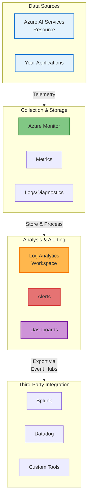
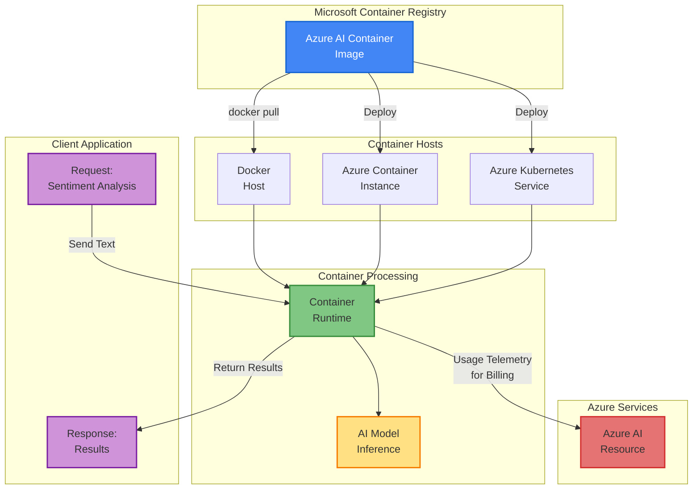

# Azure AI Services for Enterprise Applications

<div style="background: linear-gradient(135deg, #0078D4 0%, #00BCF2 100%); color: white; padding: 1.5rem; border-radius: 10px; margin-bottom: 2rem;">
  <div style="display: flex; justify-content: space-between; align-items: center;">
    <div>
      <h2 style="margin: 0; color: white;">🏢 Enterprise-Grade Deployment</h2>
      <p style="margin: 0.5rem 0 0 0; opacity: 0.9;">Security, Monitoring, and Containerization at Scale</p>
    </div>
  </div>
</div>

## 📋 Table of Contents

<!--ts-->
   * [Learning Objectives](#-learning-objectives)
   * [Overview](#overview)
   * [Securing Azure AI Services](#securing-azure-ai-services)
   * [Monitoring and Optimizing AI Usage](#monitoring-and-optimizing-ai-usage)
   * [Deploying AI Services in Containers](#deploying-ai-services-in-containers)
   * [Production Best Practices](#production-best-practices)
<!--te-->

---

## 🎯 Learning Objectives

By the end of this section, you will be able to:

- Authenticate and secure AI services using key rotation, Azure Key Vault, and managed identities
- Monitor and optimize AI usage by tracking metrics, viewing logs, and analyzing performance data
- Deploy AI services in containers for local processing while maintaining billing and licensing with Azure
- Operate AI services in production environments with enterprise-grade security and observability
- Implement data isolation and compliance requirements for sensitive workloads

---

## 📌 Overview

Building AI solutions is just the beginning. True success in enterprise environments requires:

**Security Management**
Protect API keys, manage credentials, and ensure only authorized applications access your AI services.

**Observability**
Track performance, identify issues, and optimize costs through comprehensive monitoring and analytics.

**Containerization**
Run AI models locally in controlled environments while maintaining compliance and data sovereignty.

---

## 🔐 Securing Azure AI Services

Security is paramount in enterprise environments. Azure provides multiple methods to protect your AI service credentials.

### Three Key Security Methods

#### 1️⃣ Key Rotation Strategy

**Why Rotate Keys?**

- Reduces exposure from leaked credentials
- Industry best practice for security
- Compliance requirement for many organizations

**How to Rotate Keys:**

Step 1: Regenerate your Secondary Key (Key 2)  
Step 2: Update all applications to use Key 2  
Step 3: Regenerate your Primary Key (Key 1)  
Step 4: Both keys are now fresh and secure  

**Rotation Schedule:**

- Rotate keys every 90 days
- Rotate immediately when staff with access leaves
- Rotate if you suspect a key has been compromised

**How It Works:**

You have two keys (Key 1 and Key 2). When rotating:
- Applications use one key while you regenerate the other
- This ensures zero downtime during key rotation
- You can regenerate keys one at a time without service interruption

#### 2️⃣ Azure Key Vault Integration

**The Problem:**

Never hardcode credentials in your application:

```python
# BAD - Do not do this
api_key = "abc123xyz789abc123xyz789abc123"
endpoint = "https://ai102.cognitiveservices.azure.com/"
```

**The Solution:**

Use Azure Key Vault to store and retrieve secrets securely:

```python
# GOOD - Store keys in Key Vault
from azure.identity import DefaultAzureCredential
from azure.keyvault.secrets import SecretClient

credential = DefaultAzureCredential()
vault_url = "https://myvault.vault.azure.net/"
client = SecretClient(vault_url=vault_url, credential=credential)

api_key = client.get_secret("ai-service-key").value
endpoint = client.get_secret("ai-service-endpoint").value
```

**Key Vault Benefits:**

| Benefit | Details |
|---------|---------|
| Encryption at Rest | Keys encrypted when stored in vault |
| Encryption in Transit | Keys encrypted when retrieved |
| Audit Logging | All access attempts logged |
| Easy Rotation | Update secrets without redeploying |
| Access Control | Grant vault access to specific people/apps |

**Best Practice:**

- Always use Key Vault for production credentials
- Never hardcode keys in code
- Never commit keys to source control
- Grant Key Vault access only to who needs it

#### 3️⃣ Managed Identity

**What is Managed Identity?**

Managed Identity allows Azure resources (Web Apps, VMs, Functions) to authenticate to AI services without managing credentials.

**How It Works:**

1. Enable managed identity on your Azure resource
2. Assign the identity a role (e.g., "Cognitive Services User")
3. Resource automatically authenticates without storing credentials
4. Resource can call AI services using its identity

**Example: Web App calling AI Service**

```python
from azure.identity import DefaultAzureCredential
from azure.ai.textanalytics import TextAnalyticsClient

# No credentials needed - uses the web app's managed identity
credential = DefaultAzureCredential()

client = TextAnalyticsClient(
    endpoint="https://ai102.cognitiveservices.azure.com/",
    credential=credential
)

result = client.analyze_sentiment(["The service is excellent!"])
```

**Benefits:**

- No secrets to manage - Azure handles credential generation
- Automatic rotation - Azure rotates credentials automatically
- Reduced attack surface - Credentials never exposed to developers
- Audit trail - All access logged with identity information

### Security Best Practices Summary

- Rotate credentials every 90 days
- Store all secrets in Azure Key Vault
- Use managed identities for Azure-to-Azure communication
- Grant minimum required permissions (principle of least privilege)
- Enable and review access logs regularly
- Never hardcode or commit credentials to source control

---

## 📊 Monitoring and Optimizing AI Usage

Production systems require visibility into performance, usage, and issues. Azure provides comprehensive monitoring tools.

### Azure Monitoring Architecture



### Key Monitoring Tools

#### 1️⃣ Metrics

**What are Metrics?**

Numerical performance data captured at regular intervals. Metrics help you understand how your AI service is performing.

**Common AI Service Metrics:**

| Metric | What It Measures | Why It Matters |
|--------|-----------------|----------------|
| Request Count | Total API calls made | Understand usage volume |
| Latency | Response time in milliseconds | Monitor performance |
| Error Rate | Percentage of failed requests | Detect service issues |
| Throttled Requests | Calls rejected due to rate limits | Identify capacity problems |
| Successful Requests | API calls that succeeded | Track reliability |

**How to View Metrics:**

1. Open your AI service resource in Azure Portal
2. Click Metrics in the left navigation menu
3. Select timeframe (last hour, 24 hours, 7 days, etc.)
4. Choose metric to visualize
5. View charts and trends
6. Pin to dashboards

**Metrics Details:**

- Retained for 30 days by default
- Available in 1-minute intervals
- Free to view in Azure Portal
- Can export to Log Analytics for longer retention

#### 2️⃣ Logs and Diagnostics

**What are Logs?**

Time-stamped records of events and changes in your AI service. Logs capture everything that happens for troubleshooting and compliance.

**Where Logs Go:**

- Log Analytics Workspace - Query and analyze logs
- Azure Storage - Long-term archive
- Event Hubs - Send to external tools like Splunk or Datadog

**Destination Comparison:**

| Destination | Best For | Retention |
|------------|----------|-----------|
| Log Analytics | Real-time analysis and alerts | 30-730 days |
| Azure Storage | Compliance and long-term archive | Up to 999 years |
| Event Hubs | Integration with external tools | Configurable |

**How to Enable Diagnostics:**

1. Open your AI service in Azure Portal
2. Click Diagnostic settings in the left menu
3. Click Add diagnostic setting
4. Select log categories to capture
5. Choose destination
6. Click Save
7. Wait 5 minutes for logs to start flowing

**Log Types:**

- Audit Logs - Who accessed the service and when
- API Logs - Request and response details
- Error Logs - Failed requests and exceptions
- Performance Logs - Response times and resource usage

#### 3️⃣ Alerts and Notifications

**What are Alerts?**

Automated notifications triggered when conditions are met. Alerts help you respond to issues before they impact users.

**Common Alerts:**

| Alert Type | When to Trigger | Action |
|-----------|-----------------|--------|
| High Error Rate | Errors > 5% for 5 minutes | Email ops team |
| Rate Limiting | Throttled requests > 10/min | Page engineer |
| High Latency | Response > 2 seconds for 2 min | Alert team |
| Cost Anomaly | Daily cost > 150% baseline | Email billing |
| Security Issue | Failed auth > 10/min | Immediate alert |

**How to Create an Alert:**

1. Open your AI service in Azure Portal
2. Click Alerts in the left menu
3. Click New alert rule
4. Set the scope to your AI service
5. Select a metric (Failed Requests, Latency, etc.)
6. Set the condition (greater than, less than, etc.)
7. Set the time window (5 minutes, 15 minutes, etc.)
8. Add an action group (email, SMS, etc.)
9. Give the alert a name and save

**Alert Actions:**

- Email notification
- SMS text message
- Push notification
- Trigger Azure Function
- Webhook to external system
- Create ITSM ticket (ServiceNow, Jira)
- Trigger Logic App automation

**Best Practices:**

- Create alerts for critical metrics (error rate, latency)
- Set up cost alerts to catch unexpected spikes
- Route alerts to the right teams
- Tune thresholds to avoid false alerts
- Suppress alerts during maintenance windows
- Review and adjust alerts quarterly

### Monitoring Best Practices

**Track Key Metrics**
- Monitor request count, latency, error rate, and throttled requests
- Review daily trends to identify patterns
- Set baseline performance expectations
- Create dashboards for different teams

**Enable Diagnostic Logging**
- Turn on diagnostics from day one of production
- Send logs to Log Analytics for real-time analysis
- Archive to Azure Storage for compliance
- Stream to Event Hubs for external tools

**Set Up Alerts**
- Create alerts for error rate, latency, and cost anomalies
- Route alerts to appropriate teams
- Tune thresholds to avoid false alerts
- Suppress alerts during maintenance

**Review Logs Regularly**
- Check audit logs monthly for access patterns
- Investigate error logs for recurring issues
- Use Log Analytics queries to find root causes
- Maintain compliance records

**Monitor Costs**
- Track API usage against budget
- Identify high-cost operations
- Set budget alerts
- Review pricing tier efficiency

**Operational Excellence**
- Pin critical metrics to main dashboard
- Document baseline performance
- Create runbooks for common alerts
- Review monitoring strategy quarterly

---

## 📦 Deploying AI Services in Containers

Containerization allows you to run Azure AI models locally while maintaining compliance, security, and cost control.

### Why Containerize AI Services?

<div style="display: grid; grid-template-columns: repeat(auto-fit, minmax(250px, 1fr)); gap: 1rem; margin: 1rem 0;">

<div style="background: #E3F2FD; padding: 1rem; border-radius: 8px; border-left: 4px solid #1976D2;">
  <strong>🔒 Data Isolation</strong><br>
  Process sensitive data locally without sending to cloud
</div>

<div style="background: #E8F5E9; padding: 1rem; border-radius: 8px; border-left: 4px solid #388E3C;">
  <strong>📍 On-Premises Deployment</strong><br>
  Run AI models in your datacenter for compliance
</div>

<div style="background: #FFF3E0; padding: 1rem; border-radius: 8px; border-left: 4px solid #F57C00;">
  <strong>🌐 Hybrid Architecture</strong><br>
  Combine local processing with cloud services
</div>

<div style="background: #F3E5F5; padding: 1rem; border-radius: 8px; border-left: 4px solid #7B1FA2;">
  <strong>⚡ Reduced Latency</strong><br>
  Instant responses without network round-trips
</div>

<div style="background: #FCE4EC; padding: 1rem; border-radius: 8px; border-left: 4px solid #C2185B;">
  <strong>💰 Cost Control</strong><br>
  Avoid per-request charges for high-volume processing
</div>

<div style="background: #E0F7FA; padding: 1rem; border-radius: 8px; border-left: 4px solid #00838F;">
  <strong>📊 Scalability</strong><br>
  Scale to thousands of instances independently
</div>

</div>

### Container Deployment Architecture



### How Containerized AI Works

#### Step 1: Pull the Container Image

Azure AI container images are stored in Microsoft Container Registry (MCR).

**Pull Text Analytics (Sentiment Analysis) image:**

```bash
docker pull mcr.microsoft.com/azure-cognitive-services/textanalytics/sentiment:latest
```

**Available Container Images:**

- mcr.microsoft.com/azure-cognitive-services/textanalytics/sentiment
- mcr.microsoft.com/azure-cognitive-services/textanalytics/language
- mcr.microsoft.com/azure-cognitive-services/vision/read
- mcr.microsoft.com/azure-cognitive-services/vision/face
- mcr.microsoft.com/azure-cognitive-services/speech/speech-to-text
- And many more...

#### Step 2: Deploy Container to Host

**Option A: Docker Host (Local Development)**

```bash
docker run --rm -it -p 5000:5000 \
  -e Eula=accept \
  -e Billing=https://ai102.cognitiveservices.azure.com/ \
  -e ApiKey=YOUR_API_KEY \
  mcr.microsoft.com/azure-cognitive-services/textanalytics/sentiment:latest
```

The container starts an HTTP server on port 5000.

**Option B: Azure Container Instances**

Deploy without managing servers:

```bash
az container create \
  --resource-group myResourceGroup \
  --name sentiment-container \
  --image mcr.microsoft.com/azure-cognitive-services/textanalytics/sentiment:latest \
  --cpu 1 --memory 1 \
  --environment-variables Eula=accept Billing=https://... ApiKey=...
```

**Option C: Azure Kubernetes Service (AKS)**

For large-scale, highly available deployments:

```yaml
apiVersion: apps/v1
kind: Deployment
metadata:
  name: sentiment-analyzer
spec:
  replicas: 3
  containers:
  - name: sentiment
    image: mcr.microsoft.com/azure-cognitive-services/textanalytics/sentiment:latest
    env:
    - name: Eula
      value: "accept"
    - name: Billing
      value: "https://ai102.cognitiveservices.azure.com/"
    - name: ApiKey
      valueFrom:
        secretKeyRef:
          name: ai-credentials
          key: api-key
```

#### Step 3: Process Data Locally

Your application sends requests to the local container:

**Client Code (Python):**

```python
import requests
import json

url = "http://localhost:5000/text/analytics/v3.0/sentiment"

payload = {
    "documents": [
        {
            "id": "1",
            "language": "en",
            "text": "The product quality is excellent!"
        }
    ]
}

headers = {
    "Ocp-Apim-Subscription-Key": "YOUR_API_KEY",
    "Content-Type": "application/json"
}

response = requests.post(url, json=payload, headers=headers)
results = response.json()
print(results)
```

**Key Benefits:**

- Data processed locally
- Sensitive information never leaves your network
- Instant response (no cloud latency)
- Works offline or in restricted networks

#### Step 4: Billing and Licensing

**How Billing Works:**

1. Container processes data locally
2. Container periodically sends usage telemetry to Azure
3. Azure AI resource tracks the usage
4. You are charged based on actual API calls

**Requirements:**

- Valid Azure subscription
- Azure AI service resource created
- API key from that resource
- Network access to Azure (for licensing validation)
- Container must accept Eula=accept environment variable

### Container Deployment Options

| Aspect | Docker Host | Container Instance | Kubernetes |
|--------|-------------|-------------------|-----------|
| Setup Complexity | Low | Medium | High |
| Scalability | Manual | Limited | Unlimited |
| High Availability | No | Yes | Yes |
| Cost | Low | Medium | Higher |
| Use Case | Development | Small production | Enterprise scale |

### Containerization Best Practices

- Use official images from Microsoft Container Registry
- Store API keys in Azure Key Vault
- Ensure containers have network access to Azure for licensing
- Allocate sufficient CPU and memory
- Pull latest image versions regularly for security patches
- Enable container logging for troubleshooting
- Monitor container health and resource usage

---

## ✅ Production Best Practices

**Security**

- Use Azure Key Vault for all credentials
- Implement managed identities for Azure services
- Rotate API keys every 90 days
- Enable Azure RBAC for fine-grained access control
- Audit all access attempts and API calls

**Monitoring**

- Track key metrics: requests, latency, errors, throttling
- Enable diagnostic logging to Log Analytics
- Create alerts for anomalies and errors
- Review logs regularly for security issues
- Monitor costs and optimize API usage

**Containerization**

- Use official Microsoft Container Registry images
- Deploy with proper resource limits and requests
- Use managed identity instead of hardcoded keys
- Implement health checks and auto-restart
- Keep images updated with latest security patches

**Architecture**

- Design for failure and implement retries
- Use exponential backoff for rate limiting
- Cache results to reduce API calls
- Monitor quota usage and scale appropriately
- Implement circuit breakers for fault tolerance

**Compliance**

- Ensure data residency requirements are met
- Use containers for sensitive on-premises data
- Maintain audit trails for all API access
- Encrypt data in transit and at rest
- Document security and access controls

---

## 📝 Summary

- Secure AI Services using key rotation, Azure Key Vault, and managed identities
- Monitor Usage with metrics, logs, diagnostics, and alerts
- Deploy Containers for on-premises processing while maintaining Azure integration
- Operate at Scale with enterprise-grade security and observability
- Stay Compliant with audit logging and data isolation

---

## 🔗 Next Steps

<div style="display: flex; justify-content: space-between; margin-top: 2rem;">
  <a href="get-started-azure-ai-services.html" style="padding: 1rem; background: #f5f5f5; border-radius: 8px; text-decoration: none; color: #333;">
    ← Getting Started with Azure AI
  </a>
  <a href="azure-ai-language-services.html" style="padding: 1rem; background: #0078D4; border-radius: 8px; text-decoration: none; color: white;">
    Next: Azure AI Language Services →
  </a>
</div>

## ➡️ Navigation

<div style="display: flex; justify-content: space-between; margin-top: 2rem;">
  <a href="get-started-azure-ai-services.html" style="padding: 1rem; background: #f5f5f5; border-radius: 8px; text-decoration: none; color: #333;">
    ← Get Started
  </a>
  <a href="analyze-manipulate-images.html" style="padding: 1rem; background: #0078D4; border-radius: 8px; text-decoration: none; color: white;">
    Next: Computer Vision →
  </a>
</div>
