# Module 1: Introduction to AI and Azure AI Services

  

    

      <h2 style="margin: 0; color: white;">📚 7 Lessons</h2>
      
Exam Weight: Part of 20-25%

    

    

      Module 1 of 6
    

  

## 📋 Table of Contents

<!--ts-->
   * [Learning Objectives](#-learning-objectives)
   * [What is Artificial Intelligence?](#1️⃣-what-is-artificial-intelligence)
   * [AI Skills for Software Engineers](#ai-skills-for-software-engineers)
   * [Responsible AI Considerations](#2️⃣-responsible-ai-considerations)
   * [Azure Machine Learning](#3️⃣-azure-machine-learning)
   * [Azure AI Services](#4️⃣-azure-ai-services)
   * [Azure AI Search](#5️⃣-azure-ai-search)
<!--te-->

---

## 🎯 Learning Objectives

By the end of this module, you will be able to:

- ✅ **Understand the fundamentals of Artificial Intelligence** and its relationship with machine learning and data science
  - *These distinctions are important because while they are often used interchangeably, each has its own specific role in building intelligent systems.*

- ✅ **Learn about Azure AI's capabilities and services**
  - *Azure provides a robust platform with ready-made tools that make it easier to build, train, and deploy AI solutions without needing to start from scratch.*

---

## 1️⃣ What is Artificial Intelligence?

> **Definition:** Software that exhibits human-like capabilities

### AI Human-Like Capabilities

| Capability | Description | Examples |
|------------|-------------|----------|
| **👁️ Visual Perception** | AI's ability to analyze and interpret visual data | Object recognition, face detection, image understanding |
| **📝 Text Analysis** | AI's ability to process and generate human language | Sentiment analysis, translation, summarization |
| **💬 Conversation** | AI's ability to interact using Natural Language Processing | Chatbots, virtual assistants |
| **🧠 Decision Making** | AI analyzes data to make informed decisions | Finance, medicine, automation |

---

## AI Skills for Software Engineers

Software engineers working with AI need both **Technical Skills** and a solid understanding of **AI Concepts and Principles**.

### 1.1 Technical Skills

  <strong>💻 Programming Languages</strong> 
  Proficiency in Python, C#, and JavaScript

  <strong>🔗 API Integration</strong> 
  Integrate with AI services via REST APIs or SDKs

  <strong>⚙️ DevOps Practices</strong> 
  Version control and CI/CD pipelines

### 1.2 AI Concepts & Principles

  <strong>🯠Model Training</strong> 
  Understanding the process of training and deploying AI models

  <strong>📊 Predictions</strong> 
  Interpreting model predictions with probability and confidence levels

  <strong>⚖️ Ethical AI</strong> 
  Implementing ethical AI practices including fairness and transparency

---

## 2️⃣ Responsible AI Considerations

> **Responsible AI ensures that AI is designed and used in ways that are ethical, safe, and fair.**

### The 6 Pillars of Responsible AI

### 2.1 ⚖️ Fairness

> **AI should treat all individuals equally, without bias.**

  <strong>📌 Example:</strong> Imagine a hiring algorithm that prefers male applicants over equally qualified female candidates based on biased training data.

**Best Practice:** AI systems must be trained on **balanced datasets** and tested to ensure **fair outcomes** across different groups.

---

### 2.2 🛡️ Reliability and Safety

> **AI should consistently perform as expected and avoid harm.**

  <strong>📌 Example:</strong> In self-driving cars, the AI must reliably detect stop signs and pedestrians, even in rain or low light. A failure could be dangerous.

**Best Practice:** Reliability and safety are especially important in **critical sectors** like healthcare, finance, and transportation.

---

### 2.3 🔒 Privacy and Security

> **AI systems must protect user data and be resistant to misuse.**

  <strong>📌 Example:</strong> A voice assistant that records private conversations without consent is a breach of privacy. Similarly, an AI system that's easily hacked can lead to serious data leaks.

**Best Practice:** AI should follow best practices for **data encryption**, **access control**, and **user consent**.

---

### 2.4 🌍 Inclusiveness

> **AI should be designed to include and empower people from diverse backgrounds and abilities.**

  <strong>📌 Example:</strong> A speech recognition app that works well only with American accents but struggles with others is not inclusive.

**Best Practice:** Systems should be trained and tested for **all users**, including those with disabilities or from non-dominant cultures.

---

### 2.5 👁️ Transparency

> **Users should be able to understand how AI systems make decisions.**

  <strong>📌 Example:</strong> If an AI denies a loan, the applicant should know why. Was it due to income, credit score, or another factor?

**Best Practice:** Transparent AI systems **explain their reasoning**, helping users build trust in AI decisions.

---

### 2.6 📋 Accountability

> **There should always be a clear person or team responsible for the actions of an AI system.**

  <strong>📌 Example:</strong> If a chatbot gives harmful medical advice, the company that deployed it—not just the developer—must be held accountable.

**Best Practice:** Clear accountability ensures that someone is **monitoring and improving** the system continuously.

---

### Responsible AI Summary Table

| Principle | Definition | Key Action |
|-----------|------------|------------|
| **Fairness** | Treat all individuals equally | Use balanced training data |
| **Reliability & Safety** | Perform consistently, avoid harm | Test in critical scenarios |
| **Privacy & Security** | Protect user data | Implement encryption & consent |
| **Inclusiveness** | Empower diverse users | Test across demographics |
| **Transparency** | Explain decisions | Provide clear reasoning |
| **Accountability** | Clear ownership | Monitor continuously |

---

## 3️⃣ Azure Machine Learning

> **A cloud-based service that allows data scientists and developers to build and manage machine learning models at scale.**

### What Azure ML Offers

- 🚀 **Train models** using large datasets
- 📦 **Deploy models** to make real-time predictions
- ☁️ **Scale infrastructure** without managing hardware or servers

### Azure ML Process Flow

```mermaid
flowchart LR
    A["📊 Data Collection"] --> B["💻 Compute Resources"]
    B --> C["🔬 Experiment\n(Train Model)"]
    C --> D["🚀 Deploy to\nProduction"]
    D --> E["📱 User App\n(Predictions)"]
    
    style A fill:#E3F2FD,stroke:#1976D2
    style B fill:#E8F5E9,stroke:#388E3C
    style C fill:#FFF3E0,stroke:#F57C00
    style D fill:#F3E5F5,stroke:#7B1FA2
    style E fill:#FCE4EC,stroke:#C2185B
```

### Step-by-Step Process

| Step | Description |
|------|-------------|
| **1. Data Collection** | Data is collected and prepared for training |
| **2. Compute Resources** | Azure VMs provide the power to train your models |
| **3. Experiment** | ML model is trained and tuned to find patterns in data |
| **4. Deploy** | High-performing model is deployed to production |
| **5. User Interaction** | Users interact with deployed model via app/dashboard for real-time predictions |

> 💡 **Key Benefit:** With Azure ML, any industry can turn their data into actionable insights using the power of AI!

---

## 4️⃣ Azure AI Services

### Azure Key AI Offerings

| Service | Description |
|---------|-------------|
| **💬 Azure AI Language** | Text analytics, sentiment analysis, translation |
| **👁️ Azure AI Vision** | Image and video analysis, OCR, face detection |
| **📄 Azure AI Document Intelligence** | Extract data from forms, receipts, contracts |
| **🔍 Azure AI Search** | Intelligent search with AI enrichment |
| **🤖 Azure OpenAI** | Access to GPT models, DALL-E, and embeddings |

---

## 5️⃣ Azure AI Search

> **An intelligent search and data exploration service powered by AI.**

### Key Features

| Feature | Description | Example |
|---------|-------------|---------|
| **🗂️ AI-Powered Indexing** | Automatically structures and organizes data for fast retrieval | Indexes documents, images, tables |
| **🧠 Cognitive Search** | Uses NLP to understand user intent, not just keywords | "top-selling product in Q1" finds relevant results |
| **⭐ Semantic Ranking** | Prioritizes most relevant results by understanding word relationships | Best answers appear at the top |
| **💎 Knowledge Mining** | Extracts insights from both structured and unstructured data | Key phrases, names, product IDs from messy documents |

---

### How Azure AI Search Works

> **Azure AI Search uses an "AI Enrichment Pipeline"**

```mermaid
flowchart TB
    A["📄 Raw Data\n(Files, Tables, Documents)"] --> B["⚙️ AI Enrichment Pipeline"]
    
    subgraph Pipeline["AI Enrichment Techniques"]
        B1["OCR"]
        B2["Entity Recognition"]
        B3["Translation"]
    end
    
    B --> Pipeline
    Pipeline --> C["🗂️ Search Index\n(Searchable Format)"]
    C --> D["🔍 User Search\n(Natural Language Queries)"]
    
    style A fill:#FFECB3,stroke:#FFA000
    style B fill:#E3F2FD,stroke:#1976D2
    style C fill:#E8F5E9,stroke:#388E3C
    style D fill:#F3E5F5,stroke:#7B1FA2
```

### Pipeline Steps

| Step | Process |
|------|---------|
| **1. Raw Data** | Start with files, tables, and documents |
| **2. AI Enrichment** | Apply OCR, Entity Recognition, Translation |
| **3. Indexing** | Convert data into searchable format |
| **4. User Search** | Query using natural language |

---

## 📝 Module Summary

### Key Takeaways

✅ **AI exhibits human-like capabilities**: Visual perception, text analysis, conversation, and decision making

✅ **Software engineers need both technical skills and AI concept understanding**

✅ **6 Pillars of Responsible AI**: Fairness, Reliability & Safety, Privacy & Security, Inclusiveness, Transparency, Accountability

✅ **Azure ML** provides end-to-end model training and deployment at scale

✅ **Azure AI Services** include Language, Vision, Document Intelligence, Search, and OpenAI

✅ **Azure AI Search** uses AI Enrichment Pipeline for intelligent search capabilities

---

## 🧪 Knowledge Check

Test your understanding with these questions:

1. What are the four main human-like capabilities of AI?
2. Name the 6 pillars of Responsible AI.
3. What is the purpose of Azure Machine Learning's Compute Resources?
4. How does Cognitive Search differ from traditional keyword search?
5. What techniques are used in the AI Enrichment Pipeline?

---

## ➡️ Next Steps

  <a href="/2025/01/25/ai-102-azure-ai-engineer-study-guide.html" style="padding: 1rem; background: #f5f5f5; border-radius: 8px; text-decoration: none; color: #333;">
    ← Back to Study Guide
  </a>
  <a href="/2025/01/25/get-started-azure-ai-services.html" style="padding: 1rem; background: #0078D4; border-radius: 8px; text-decoration: none; color: white;">
    Next: Get Started with Azure AI Services →
  </a>

